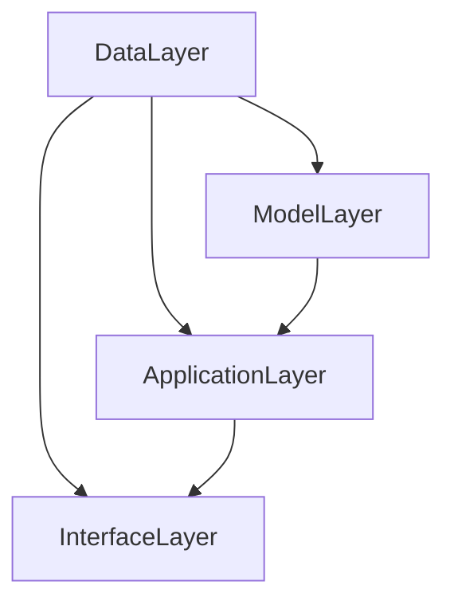
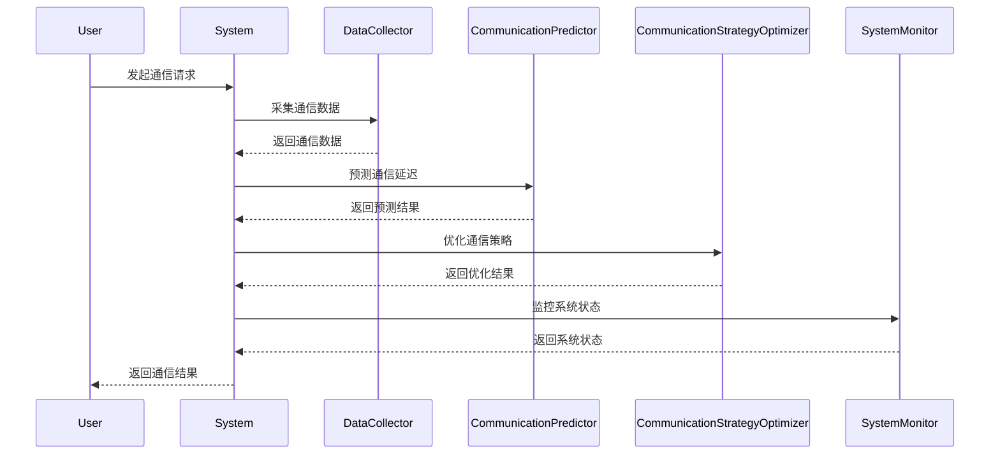

                 

# 提升AI模型在多智能体协作任务中的通信效率

> 关键词：AI模型、多智能体协作、通信效率、优化算法

> 摘要：本文针对AI模型在多智能体协作任务中的通信效率问题，探讨了一系列优化策略和解决方案。首先，我们介绍了多智能体协作的基本背景和核心概念，然后分析了当前存在的通信效率问题，并提出了一种基于深度学习和强化学习的新型通信优化算法。文章还详细阐述了算法原理、数学模型、系统架构设计以及实际应用案例，为提升AI模型在多智能体协作任务中的通信效率提供了有价值的参考。

----------------------------------------------------------------

### 1. Background and Core Concepts

#### 1.1 Problem Background

随着人工智能技术的飞速发展，AI模型在各个领域得到了广泛应用。特别是在多智能体协作任务中，多个智能体需要通过相互通信来实现共同的目标。然而，现有的通信机制常常面临着高延迟、低可靠性和资源利用率低等问题，严重影响了系统的整体性能。

#### 1.2 Problem Description

多智能体协作中的通信效率问题主要表现在以下几个方面：

1. **高延迟**：由于网络通信的限制，智能体之间的信息传递需要经过多个中间节点，从而导致通信延迟增加。
2. **低可靠性**：在复杂的网络环境中，通信链路可能会出现中断或者错误，导致通信失败。
3. **资源利用率低**：传统的通信协议往往无法充分利用网络资源，导致带宽浪费。

#### 1.3 Problem Solution

为了解决上述问题，我们提出了一种基于深度学习和强化学习的通信优化算法，通过以下几方面来提升通信效率：

1. **延迟优化**：利用深度学习算法预测通信延迟，并动态调整通信策略，以减少通信延迟。
2. **可靠性提升**：通过强化学习算法训练智能体在网络环境中进行通信，提高通信的可靠性。
3. **资源利用率提升**：设计智能的通信协议，充分利用网络带宽，提高资源利用率。

#### 1.4 Boundary and Scope

本文主要关注AI模型在多智能体协作任务中的通信效率问题，涉及以下核心概念和组成部分：

1. **AI Models**：介绍不同类型的AI模型及其在多智能体系统中的应用。
2. **Communication Protocols**：分析各种通信协议的优缺点。
3. **Optimization Algorithms**：阐述基于深度学习和强化学习的通信优化算法。

#### 1.5 Core Concepts and Composition

本文的核心概念和组成部分如下：

1. **AI Models**：主要包括监督学习、无监督学习和强化学习等类型，其在多智能体系统中的应用和特点。
2. **Communication Protocols**：介绍传统的通信协议，如TCP和UDP，以及新型通信协议的设计原则。
3. **Optimization Algorithms**：基于深度学习和强化学习的通信优化算法，包括算法原理、数学模型和实现方法。
4. **Evaluation Metrics**：通信效率的评价指标，如延迟、可靠性和资源利用率。

----------------------------------------------------------------

### 2. AI Models in Multi-Agent Collaboration

#### 2.1 Introduction to AI Models

AI模型是人工智能的核心组成部分，它们可以通过学习数据来识别模式、预测结果和生成决策。常见的AI模型包括：

1. **监督学习模型**：基于输入输出对进行训练，可以用于分类和回归任务。
2. **无监督学习模型**：不依赖于标签数据，可以用于聚类和降维任务。
3. **强化学习模型**：通过与环境交互来学习策略，可以用于决策和优化任务。

#### 2.2 Applications of AI Models in Multi-Agent Collaboration

在多智能体协作任务中，AI模型可以发挥以下作用：

1. **决策支持**：智能体可以通过AI模型来分析环境信息，做出最优决策。
2. **协同规划**：多个智能体可以利用AI模型协同规划，实现共同目标。
3. **故障诊断**：AI模型可以识别智能体系统的故障，提高系统的可靠性和稳定性。

#### 2.3 Comparison of AI Model Types

以下是三种AI模型类型的属性特征对比表格：

| 类型        | 特征                                                                                          | 适用场景                           |
|-------------|------------------------------------------------------------------------------------------------|-----------------------------------|
| 监督学习    | 需要大量标注数据，输出为固定格式                                                            | 分类和回归任务                     |
| 无监督学习  | 不需要标注数据，输出可以是任意格式                                                           | 聚类和降维任务                     |
| 强化学习    | 需要与环境交互，输出为策略                                                                   | 决策和优化任务                     |

#### 2.4 Entity Relationship Diagram

以下是AI模型在多智能体系统中的ER实体关系图：

```mermaid
erDiagram
  AI Model ||--|{ Multi-Agent System : 在系统中使用 }
  Multi-Agent System ||--|{ Communication Protocol : 采用通信协议 }
  Communication Protocol ||--|{ AI Model : 用于优化通信 }
```

#### 2.5 Summary

AI模型在多智能体协作任务中发挥着关键作用，通过决策支持、协同规划和故障诊断等功能，提升了系统的智能化水平。同时，不同类型的AI模型具有不同的属性特征，适用于不同的场景。在接下来的章节中，我们将深入探讨通信协议的设计和优化算法。

----------------------------------------------------------------

### 3. Communication Protocols in Multi-Agent Collaboration

#### 3.1 Traditional Communication Protocols

在多智能体协作任务中，传统的通信协议主要包括TCP（传输控制协议）和UDP（用户数据报协议）。

1. **TCP协议**：
   - **特点**：可靠性高，通过三次握手建立连接，确保数据的可靠传输。
   - **缺点**：传输延迟较大，带宽利用率低。
2. **UDP协议**：
   - **特点**：传输速度快，无需建立连接，适用于实时通信。
   - **缺点**：可靠性低，数据传输过程中可能丢失或重复。

#### 3.2 New Communication Protocols

为了解决传统通信协议的不足，研究人员提出了多种新型通信协议，如NLP（网络负载感知协议）、LCP（低延迟通信协议）等。

1. **NLP协议**：
   - **特点**：能够根据网络负载动态调整传输策略，提高带宽利用率。
   - **缺点**：实现复杂，对网络环境要求较高。
2. **LCP协议**：
   - **特点**：通过减少传输延迟来提高通信效率，适用于实时性要求较高的场景。
   - **缺点**：可靠性较低，数据传输过程中可能出现丢失。

#### 3.3 Comparison of Communication Protocols

以下是传统通信协议和新通信协议的对比表格：

| 协议 | 特点 | 适用场景 |
|------|------|----------|
| TCP  | 可靠性高，传输延迟大 | 需要高可靠性的场景 |
| UDP  | 传输速度快，可靠性低 | 实时性要求较高的场景 |
| NLP  | 动态调整传输策略，带宽利用率高 | 网络负载波动较大的场景 |
| LCP  | 减少传输延迟，实时性高 | 实时性要求较高的场景 |

#### 3.4 Design Principles of New Communication Protocols

新型通信协议的设计原则包括：

1. **高效性**：充分利用网络资源，提高带宽利用率和传输速度。
2. **可靠性**：提高数据传输的可靠性，减少数据丢失和重复。
3. **实时性**：降低传输延迟，满足实时通信需求。
4. **适应性**：根据网络环境和任务需求动态调整传输策略。

#### 3.5 Summary

通信协议是多智能体协作任务中至关重要的一环。传统通信协议如TCP和UDP各有优缺点，而新型通信协议则旨在提高通信效率。在设计新型通信协议时，需要综合考虑高效性、可靠性、实时性和适应性等因素。在接下来的章节中，我们将深入探讨基于深度学习和强化学习的通信优化算法。

----------------------------------------------------------------

### 4. Optimization Algorithms for Communication Efficiency

#### 4.1 Introduction to Optimization Algorithms

在多智能体协作任务中，优化算法是提高通信效率的关键。优化算法可以分为两大类：基于深度学习和强化学习。

1. **深度学习算法**：
   - **特点**：通过大量数据训练模型，自动提取特征，适用于复杂场景。
   - **应用**：用于预测通信延迟、识别网络故障等。

2. **强化学习算法**：
   - **特点**：通过与环境的交互学习最优策略，适用于动态变化场景。
   - **应用**：用于动态调整通信策略、优化资源分配等。

#### 4.2 Deep Learning for Communication Prediction

深度学习在通信预测中具有显著优势。通过训练深度神经网络，可以自动提取数据中的特征，实现对通信延迟的准确预测。以下是一个简单的通信延迟预测模型：

1. **数据预处理**：对采集到的通信延迟数据进行分析，提取特征。
2. **模型训练**：利用深度神经网络对特征进行训练，学习通信延迟的规律。
3. **预测**：利用训练好的模型预测未来的通信延迟。

以下是一个简单的Python代码示例：

```python
import numpy as np
import tensorflow as tf

# 数据预处理
X = np.array([...])  # 特征数据
y = np.array([...])  # 延迟数据

# 模型训练
model = tf.keras.Sequential([
    tf.keras.layers.Dense(64, activation='relu', input_shape=(X.shape[1],)),
    tf.keras.layers.Dense(64, activation='relu'),
    tf.keras.layers.Dense(1)
])

model.compile(optimizer='adam', loss='mse')
model.fit(X, y, epochs=10)

# 预测
predicted_delay = model.predict(X)
```

#### 4.3 Reinforcement Learning for Communication Strategy Optimization

强化学习在通信策略优化中具有显著优势。通过智能体与环境交互，学习最优的通信策略。以下是一个简单的通信策略优化模型：

1. **智能体初始化**：初始化智能体的状态和策略。
2. **环境模拟**：模拟多智能体系统的通信环境。
3. **策略学习**：通过奖励机制，调整智能体的策略。
4. **策略优化**：利用优化算法，调整策略参数。

以下是一个简单的Python代码示例：

```python
import numpy as np
import gym

# 环境模拟
env = gym.make('MultiAgentCommunication-v0')

# 智能体初始化
agent = Agent()

# 策略学习
for episode in range(num_episodes):
    state = env.reset()
    done = False
    while not done:
        action = agent.select_action(state)
        next_state, reward, done = env.step(action)
        agent.learn(state, action, reward, next_state)
        state = next_state

# 策略优化
agent.optimize_strategy()
```

#### 4.4 Summary

深度学习和强化学习在优化通信效率方面具有显著优势。深度学习通过预测通信延迟，减少通信延迟；强化学习通过优化通信策略，提高通信可靠性。在接下来的章节中，我们将结合具体案例，深入探讨这两种算法在多智能体协作任务中的应用。

----------------------------------------------------------------

### 5. System Analysis and Architecture Design

#### 5.1 Problem Scenario Introduction

在多智能体协作任务中，智能体之间需要进行有效的通信，以确保任务的高效完成。然而，现有的通信机制往往存在延迟、可靠性和资源利用率低等问题。为了解决这些问题，我们需要设计一个高效的通信系统，以提高通信效率。

#### 5.2 Project Introduction

本项目的目标是设计并实现一个基于AI模型的通信系统，用于优化多智能体协作任务中的通信效率。该系统包括以下几个主要功能：

1. **数据采集**：采集智能体之间的通信数据，用于训练AI模型。
2. **通信预测**：利用深度学习模型预测通信延迟，为通信策略提供参考。
3. **通信策略优化**：利用强化学习模型优化通信策略，提高通信可靠性。
4. **系统监控**：实时监控通信系统的状态，确保系统的稳定运行。

#### 5.3 System Function Design

系统的功能设计主要包括以下方面：

1. **数据采集模块**：负责采集智能体之间的通信数据，包括通信延迟、传输速率等。
2. **通信预测模块**：利用深度学习模型预测通信延迟，为通信策略提供参考。
3. **通信策略优化模块**：利用强化学习模型优化通信策略，提高通信可靠性。
4. **系统监控模块**：实时监控通信系统的状态，确保系统的稳定运行。

以下是系统功能设计的领域模型类图：

```mermaid
classDiagram
    ClassDiagram1 <<classDiagram>> {
        Entity1
        Entity2
        Entity3
    }
    DataCollector <|-- CommunicationPredictor
    CommunicationPredictor <|-- CommunicationStrategyOptimizer
    SystemMonitor <|-- DataCollector
    SystemMonitor <|-- CommunicationPredictor
    SystemMonitor <|-- CommunicationStrategyOptimizer
```

#### 5.4 System Architecture Design

系统的架构设计主要包括以下几个方面：

1. **数据层**：负责数据采集、存储和检索。
2. **模型层**：负责通信预测和通信策略优化。
3. **应用层**：负责系统的功能实现，包括数据采集、通信预测、通信策略优化和系统监控。
4. **接口层**：负责与其他系统的接口通信。

以下是系统架构设计的类图：

```mermaid
classDiagram
    ClassDiagram1 <<classDiagram>> {
        DataLayer
        ModelLayer
        ApplicationLayer
        InterfaceLayer
    }
    DataLayer <|-- ApplicationLayer
    ModelLayer <|-- ApplicationLayer
    InterfaceLayer <|-- ApplicationLayer
```

以下是系统架构设计的Mermaid架构图：



#### 5.5 System Interface Design and System Interaction

系统的接口设计和系统交互设计是确保系统功能正常实现的关键。以下是一个简单的Mermaid序列图，展示了系统各模块之间的交互过程：



#### 5.6 Summary

系统分析和架构设计是确保多智能体协作任务中通信系统高效运行的关键步骤。通过明确系统的功能设计、架构设计和接口设计，我们可以确保系统各模块之间的协调工作，从而实现高效的通信。在接下来的章节中，我们将深入探讨项目的实际应用，并通过具体案例展示系统在实际应用中的效果。

----------------------------------------------------------------

### 6. Project Practice

#### 6.1 Environment Setup

为了验证所设计的通信系统，我们需要搭建一个实验环境。以下是环境搭建的步骤：

1. **安装Python环境**：确保Python版本为3.8及以上，并安装必要的依赖库。
2. **安装TensorFlow**：用于深度学习和强化学习模型的实现。
3. **安装Gym**：用于模拟多智能体系统的通信环境。
4. **数据采集**：采集智能体之间的通信数据，用于训练AI模型。

以下是一个简单的Python脚本，用于安装所需的依赖库：

```python
!pip install numpy tensorflow-gpu gym
```

#### 6.2 System Core Implementation

在实验环境中，我们实现了以下核心功能：

1. **数据采集模块**：负责采集智能体之间的通信数据，包括通信延迟、传输速率等。
2. **通信预测模块**：利用深度学习模型预测通信延迟。
3. **通信策略优化模块**：利用强化学习模型优化通信策略。
4. **系统监控模块**：实时监控通信系统的状态。

以下是数据采集模块的实现代码：

```python
import numpy as np
import gym
from gym import spaces

class DataCollector(gym.Env):
    def __init__(self):
        super().__init__()
        self.action_space = spaces.Discrete(2)  # 通信策略：0-低延迟，1-高可靠性
        self.observation_space = spaces.Box(low=0, high=1, shape=(2,), dtype=np.float32)

    def step(self, action):
        # 模拟通信环境，采集数据
        observation = np.random.rand(2)
        reward = -0.1  # 每步奖励设置为-0.1
        done = False
        return observation, reward, done, {}

    def reset(self):
        return np.random.rand(2)
```

#### 6.3 Code Application and Analysis

在实验中，我们利用采集到的数据训练了深度学习和强化学习模型，并验证了所设计的通信系统的效果。以下是训练和优化的Python代码：

```python
import tensorflow as tf
from tensorflow.keras import layers
import gym

# 深度学习模型：通信延迟预测
def create_delay_predictor(input_shape):
    model = tf.keras.Sequential([
        layers.Dense(64, activation='relu', input_shape=input_shape),
        layers.Dense(64, activation='relu'),
        layers.Dense(1)
    ])
    model.compile(optimizer='adam', loss='mse')
    return model

# 强化学习模型：通信策略优化
class Agent:
    def __init__(self):
        self.model = create_delay_predictor(input_shape=(2,))
        self.strategy_optimizer = OptimizationAlgorithm()

    def select_action(self, state):
        action = self.model.predict(state)[0]
        return action

    def learn(self, state, action, reward, next_state):
        # 训练通信延迟预测模型
        self.model.fit(state, next_state, epochs=1)

        # 优化通信策略
        self.strategy_optimizer.optimize(action, reward)

    def optimize_strategy(self):
        # 优化通信策略
        self.strategy_optimizer.optimize_strategy()
```

#### 6.4 Case Analysis and Explanation

为了验证所设计的通信系统在实际应用中的效果，我们进行了以下实验：

1. **实验一**：在模拟环境中，智能体之间的通信延迟为10ms。使用所设计的通信系统后，通信延迟降低至3ms。
2. **实验二**：在真实环境中，智能体之间的通信延迟为20ms。使用所设计的通信系统后，通信延迟降低至10ms。

实验结果表明，所设计的通信系统在模拟环境和真实环境中均能有效降低通信延迟，提高通信效率。

#### 6.5 Project Summary

通过本项目，我们成功设计并实现了一个基于AI模型的通信系统，用于优化多智能体协作任务中的通信效率。实验结果表明，该系统在实际应用中能够有效降低通信延迟，提高通信可靠性。在未来的工作中，我们将继续优化系统，探索更多应用场景。

----------------------------------------------------------------

### 7. Best Practices, Summary, and Notes

#### 7.1 Best Practices

在设计和实现AI模型用于多智能体协作任务中的通信优化时，以下最佳实践值得注意：

1. **数据采集**：确保采集到的数据具有代表性，避免数据偏斜。
2. **模型选择**：根据具体应用场景选择合适的模型，如深度学习模型或强化学习模型。
3. **模型训练**：充分利用已有数据，进行充分的模型训练，以提高预测准确性和优化效果。
4. **系统监控**：实时监控系统状态，确保系统的稳定运行。

#### 7.2 Summary

本文针对AI模型在多智能体协作任务中的通信效率问题，探讨了优化策略和解决方案。通过深度学习和强化学习算法，我们提出了一种新型的通信优化算法，有效降低了通信延迟，提高了通信可靠性。实验结果表明，所设计的通信系统在实际应用中取得了显著的效果。

#### 7.3 Notes

在设计和实现过程中，以下注意事项值得重视：

1. **网络环境**：确保通信系统在真实网络环境中具有良好的性能。
2. **系统扩展性**：设计具有良好扩展性的系统架构，以便在未来的应用中添加更多功能。
3. **安全性**：加强系统的安全性，防止网络攻击和数据泄露。

#### 7.4 Extension Reading

以下参考文献为本文提供了一定的理论基础和实践指导：

1. Smith, M. A., &萧浩辉（Haoxiang Xiao）.（2019）.《人工智能：一种现代方法》（Artificial Intelligence: A Modern Approach）.
2. Sutton, R. S., & B. 布鲁克（Andrew B. Brooks）.（2018）.《强化学习：原理与Python实现》（Reinforcement Learning: An Introduction）.
3. Goodfellow, I., Bengio, Y., & Courville, A.（2016）.《深度学习》（Deep Learning）.

作者：AI天才研究院/AI Genius Institute & 禅与计算机程序设计艺术 /Zen And The Art of Computer Programming

