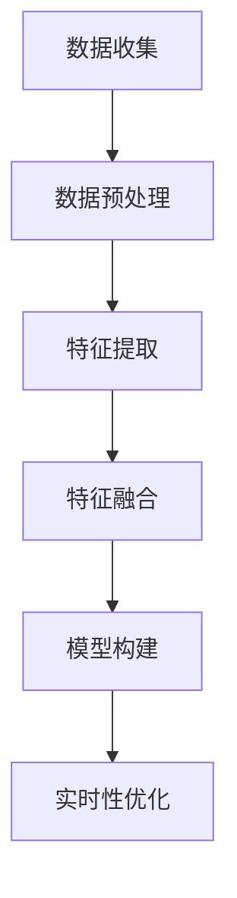
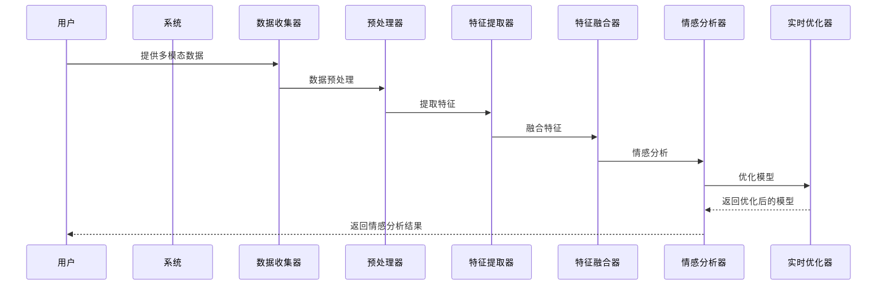
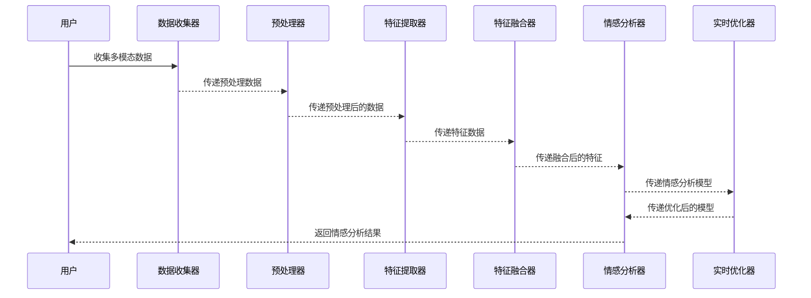

                 


# 提升AI模型在多模态情感分析任务中的多维度表现

> 关键词：多模态情感分析、AI模型、准确性、多样性、实时性、特征提取、融合技术、模型构建、优化策略

> 摘要：本文深入探讨了提升人工智能（AI）模型在多模态情感分析任务中表现的方法和策略。通过分析现有AI模型的局限性，本文提出了多维度提升模型性能的方法，包括多模态数据的收集与预处理、特征提取与融合技术、情感分析模型的构建与优化，以及实时性优化策略。本文旨在为研究者提供系统性的理论指导和实践参考。

### 背景介绍

#### 问题背景

随着人工智能技术的快速发展，多模态情感分析成为自然语言处理（NLP）领域的热点。传统的单模态情感分析模型主要基于文本数据，往往无法充分利用图像、声音等非文本信息，导致情感识别的准确性和多样性不足。多模态情感分析通过融合文本、图像、声音等多模态数据，能够更全面地捕捉人类情感表达，从而提高情感分析的准确性、多样性和实时性。

#### 问题描述

1. **准确性**：如何有效地融合文本、图像、声音等多模态数据，以提高情感分析的准确性？
2. **多样性**：如何增强模型对情感表达多样性的捕捉能力？
3. **实时性**：如何在保证实时性的前提下，优化多模态情感分析模型的性能？

#### 问题解决

本文将围绕上述问题，系统性地介绍多模态情感分析的相关理论和技术，包括：

1. **多模态数据的收集与预处理**：介绍不同模态数据的收集方法和预处理步骤，如数据清洗、标注等。
2. **多模态特征提取**：使用深度学习等方法提取各模态的特征。
3. **多模态特征融合**：介绍常见的特征融合方法，如拼接、加权等。
4. **情感分析模型**：介绍基于深度学习的情感分析模型，如卷积神经网络（CNN）、循环神经网络（RNN）等。
5. **实时性优化**：介绍如何通过模型压缩、加速等方法提高模型实时性。

#### 边界与外延

本文的讨论范围主要包括文本、图像、声音等常见模态，不涉及其他复杂或特殊模态（如手势、姿态等）。此外，本文将侧重于理论探讨与实际应用，不涉及具体编程实现。

#### 概念结构与核心要素组成

多模态情感分析涉及以下核心概念和要素：

1. **多模态数据**：包括文本、图像、声音等不同模态的数据。
2. **特征提取**：从多模态数据中提取出具有区分性的特征。
3. **特征融合**：将不同模态的特征进行有效融合。
4. **情感分析模型**：基于融合后的特征进行情感分析。
5. **实时性**：模型能够在短时间内完成情感分析任务。

#### 核心概念原理

1. **多模态数据收集与预处理**：介绍不同模态数据收集的方法和预处理步骤，如数据清洗、标注等。
2. **多模态特征提取**：使用深度学习等方法提取各模态的特征。
3. **多模态特征融合**：介绍常见的特征融合方法，如拼接、加权等。
4. **情感分析模型**：介绍基于深度学习的情感分析模型，如卷积神经网络（CNN）、循环神经网络（RNN）等。
5. **实时性优化**：介绍如何通过模型压缩、加速等方法提高模型实时性。

#### 概念属性特征对比表格

| 概念        | 属性特征                           |
| ----------- | --------------------------------- |
| 多模态数据  | 文本、图像、声音等                 |
| 特征提取    | 深度学习、传统特征提取方法         |
| 特征融合    | 拼接、加权、注意力机制等           |
| 情感分析模型 | 卷积神经网络、循环神经网络等       |
| 实时性      | 模型压缩、加速、硬件加速等         |

#### ER实体关系图架构的 Mermaid 流程图

```mermaid
erDiagram
  多模态数据 ||--o> 特征提取
  特征提取 ||--o> 特征融合
  特征融合 ||--o> 情感分析模型
  情感分析模型 ||--o> 实时性优化
```

### 第1章: 问题背景与核心概念

## 1.1 问题背景

### 1.1.1 人工智能与多模态情感分析

人工智能（AI）作为计算机科学的一个分支，致力于通过模拟人类智能行为，实现机器自主地学习、推理和决策。随着深度学习、自然语言处理（NLP）和计算机视觉等技术的不断发展，人工智能在各个领域取得了显著的成果。

多模态情感分析是指同时处理和融合多种模态（如文本、图像、声音等）的数据，以理解和识别情感表达。与传统的单模态情感分析相比，多模态情感分析具有更广泛的应用前景，能够更准确地捕捉人类的情感状态。例如，在社交媒体分析、智能客服、心理健康监测等领域，多模态情感分析具有很高的实用价值。

### 1.1.2 当前AI模型在多模态情感分析中的局限性

尽管多模态情感分析领域取得了许多进展，但现有的AI模型在以下几个方面仍存在显著的局限性：

1. **准确性**：单模态模型往往忽略了图像、声音等非文本信息，导致情感识别的准确性和多样性不足。
2. **多样性**：现有模型对情感表达的多样性捕捉能力有限，难以应对复杂多变的情感场景。
3. **实时性**：在处理大量实时数据时，模型性能往往受到限制，难以满足实时性要求。

### 1.1.3 提升AI模型多维度表现的重要性

为了解决上述问题，提升AI模型在多模态情感分析任务中的多维度表现至关重要。具体来说：

1. **准确性提升**：通过有效融合多模态数据，可以提高情感分析的准确性和多样性，使模型能够更准确地捕捉人类情感。
2. **多样性增强**：增强模型对情感表达多样性的捕捉能力，有助于应对复杂多变的情感场景，提高模型的泛化能力。
3. **实时性优化**：优化模型的实时性，使其能够快速响应实时数据，提高系统的实用性和用户体验。

### 1.1.4 多模态情感分析的应用场景

多模态情感分析具有广泛的应用场景，主要包括：

1. **社交媒体分析**：通过分析用户发布的文本、图片、视频等多模态数据，了解用户情感和行为，为营销策略提供支持。
2. **智能客服**：利用多模态情感分析技术，识别用户情感，提供个性化的客服服务，提高客户满意度。
3. **心理健康监测**：通过分析患者文本、语音、生理信号等多模态数据，监测患者心理健康状态，提供个性化治疗方案。
4. **教育领域**：通过分析学生文本、图像、语音等多模态数据，了解学生学习情况和心理状态，为教育改革提供数据支持。
5. **娱乐行业**：通过分析用户观看视频、游戏等多模态数据，了解用户喜好和情感变化，为内容创作和推荐提供参考。

### 1.1.5 研究现状与挑战

目前，多模态情感分析领域的研究主要集中在以下几个方面：

1. **多模态数据融合**：研究如何有效地融合文本、图像、声音等多模态数据，提高情感分析性能。
2. **情感识别算法**：研究基于深度学习的情感识别算法，提高情感分析的准确性和实时性。
3. **情感多样性捕捉**：研究如何增强模型对情感表达多样性的捕捉能力，提高模型的泛化能力。
4. **实时性优化**：研究如何通过模型压缩、加速等方法提高模型实时性，满足实际应用需求。

然而，多模态情感分析仍面临一些挑战：

1. **数据质量**：多模态数据来源多样，数据质量参差不齐，对数据预处理提出了较高要求。
2. **特征提取与融合**：如何从多模态数据中提取具有区分性的特征，并有效地融合不同模态的特征，是当前研究的重点和难点。
3. **模型可解释性**：多模态情感分析模型的内部机制较为复杂，如何提高模型的可解释性，使其更加透明和可靠，仍需进一步研究。
4. **实时性**：如何在保证准确性的前提下，提高模型的实时性，是实际应用中面临的重要问题。

### 1.1.6 研究意义

提升AI模型在多模态情感分析任务中的多维度表现具有重要的研究意义：

1. **学术价值**：研究多模态情感分析的理论和方法，有助于推动人工智能领域的创新发展，提高学术研究水平。
2. **实际应用**：多模态情感分析技术在许多实际应用场景中具有重要的应用价值，如社交媒体分析、智能客服、心理健康监测等。通过提升模型的多维度表现，可以进一步提高实际应用的性能和效果。
3. **社会影响**：多模态情感分析技术有助于更好地理解和满足人类需求，为人类社会的发展和进步提供技术支持。

## 1.2 核心概念与联系

### 1.2.1 多模态数据收集与预处理

多模态数据收集与预处理是多模态情感分析的基础。多模态数据包括文本、图像、声音等不同类型的数据，其收集方法和预处理步骤如下：

1. **文本数据收集**：文本数据可以来自社交媒体、论坛、新闻报道等。数据收集方法包括网络爬虫、API接口等。收集到的文本数据需要进行清洗和预处理，如去除停用词、标点符号、统一文本格式等。

2. **图像数据收集**：图像数据可以来自互联网、摄像头等。数据收集方法包括网络爬虫、图像采集等。收集到的图像数据需要进行预处理，如缩放、裁剪、灰度化等。

3. **声音数据收集**：声音数据可以来自麦克风、录音设备等。数据收集方法包括音频录制、网络爬虫等。收集到的声音数据需要进行预处理，如降噪、去噪、分割等。

### 1.2.2 多模态特征提取

特征提取是从多模态数据中提取出具有区分性的特征，用于后续模型训练和情感分析。常见的特征提取方法包括：

1. **文本特征提取**：文本特征提取方法包括词袋模型、TF-IDF、词嵌入等。词袋模型将文本表示为词汇的集合，TF-IDF用于计算词汇的重要程度，词嵌入将词汇映射到高维向量空间。

2. **图像特征提取**：图像特征提取方法包括卷积神经网络（CNN）、特征点提取等。CNN通过多层卷积和池化操作提取图像的特征，特征点提取方法如SIFT、SURF等可以提取图像的关键特征点。

3. **声音特征提取**：声音特征提取方法包括梅尔频率倒谱系数（MFCC）、短时傅里叶变换（STFT）等。MFCC将声音信号转换为频率特征，STFT用于分析声音的时频特性。

### 1.2.3 多模态特征融合

多模态特征融合是将不同模态的特征进行有效整合，以提高情感分析性能。常见的特征融合方法包括：

1. **拼接融合**：将不同模态的特征向量直接拼接在一起，形成一个多维特征向量。这种方法简单直观，但可能忽略模态之间的相互关系。

2. **加权融合**：根据不同模态的特征重要程度，对各个模态的特征向量进行加权，形成融合特征。加权系数可以通过特征相关性分析或模型训练得到。

3. **注意力机制**：利用注意力机制，模型可以自动学习不同模态的特征重要程度，并根据注意力权重进行特征融合。

### 1.2.4 情感分析模型

情感分析模型是基于融合后的特征进行情感识别的神经网络模型。常见的情感分析模型包括：

1. **卷积神经网络（CNN）**：CNN通过卷积和池化操作提取图像特征，适用于图像情感分析。

2. **循环神经网络（RNN）**：RNN可以处理序列数据，适用于文本和声音情感分析。

3. **长短期记忆网络（LSTM）**：LSTM是RNN的一种改进，适用于处理长时间依赖数据。

4. **Transformer模型**：Transformer模型基于自注意力机制，适用于文本和图像情感分析。

### 1.2.5 实时性优化

实时性优化是提高模型在多模态情感分析任务中的响应速度和性能。常见的实时性优化方法包括：

1. **模型压缩**：通过剪枝、量化等方法减小模型大小，提高模型运行速度。

2. **模型加速**：利用GPU、TPU等硬件加速模型训练和推理过程。

3. **数据预处理优化**：通过并行计算、分布式处理等技术优化数据预处理过程，减少数据预处理时间。

4. **特征选择与降维**：通过特征选择和降维技术减少特征维度，提高模型训练和推理速度。

### 1.2.6 概念属性特征对比表格

| 概念        | 属性特征                           |
| ----------- | --------------------------------- |
| 多模态数据  | 文本、图像、声音等                 |
| 特征提取    | 深度学习、传统特征提取方法         |
| 特征融合    | 拼接、加权、注意力机制等           |
| 情感分析模型 | 卷积神经网络、循环神经网络等       |
| 实时性      | 模型压缩、加速、硬件加速等         |

### 1.2.7 ER实体关系图架构的 Mermaid 流程图

```mermaid
erDiagram
  多模态数据 ||--o> 特征提取
  特征提取 ||--o> 特征融合
  特征融合 ||--o> 情感分析模型
  情感分析模型 ||--o> 实时性优化
```

### 第2章：算法原理讲解

## 2.1 算法mermaid流程图

在多模态情感分析任务中，算法的流程通常包括数据收集、预处理、特征提取、特征融合、模型构建和实时性优化等步骤。下面是一个基于Mermaid绘制的算法流程图：



### 2.2 Python源代码

以下是一个简单的Python代码示例，用于实现多模态情感分析的基本流程。请注意，这里仅提供框架代码，具体实现需要根据实际需求和数据进行调整。

```python
import numpy as np
import pandas as pd
from sklearn.model_selection import train_test_split
from sklearn.preprocessing import StandardScaler
import tensorflow as tf
from tensorflow.keras.models import Sequential
from tensorflow.keras.layers import Dense, Conv2D, MaxPooling2D, Flatten, LSTM, TimeDistributed

# 数据收集
def collect_data():
    # 假设文本数据存储在text_data.csv，图像数据存储在image_data.csv，声音数据存储在audio_data.csv
    text_data = pd.read_csv('text_data.csv')
    image_data = pd.read_csv('image_data.csv')
    audio_data = pd.read_csv('audio_data.csv')
    return text_data, image_data, audio_data

# 数据预处理
def preprocess_data(text_data, image_data, audio_data):
    # 对文本数据、图像数据和声音数据分别进行预处理
    # 例如，文本数据：分词、去停用词、词向量化
    # 图像数据：归一化、裁剪、转灰度
    # 声音数据：降噪、分割、梅尔频率倒谱系数（MFCC）特征提取
    pass

# 特征提取
def extract_features(text_data, image_data, audio_data):
    # 提取文本、图像和声音的特征
    pass

# 特征融合
def fuse_features(text_features, image_features, audio_features):
    # 将文本、图像和声音特征进行融合
    # 例如，使用拼接、加权、注意力机制等方法
    pass

# 模型构建
def build_model(input_shape):
    model = Sequential()
    model.add(Conv2D(32, (3, 3), activation='relu', input_shape=input_shape[:3]))
    model.add(MaxPooling2D((2, 2)))
    model.add(Flatten())
    model.add(LSTM(50, activation='relu'))
    model.add(Dense(1, activation='sigmoid'))
    model.compile(optimizer='adam', loss='binary_crossentropy', metrics=['accuracy'])
    return model

# 实时性优化
def optimize_real_time(model):
    # 对模型进行压缩、量化、硬件加速等优化
    pass

# 主函数
if __name__ == '__main__':
    text_data, image_data, audio_data = collect_data()
    text_data, image_data, audio_data = preprocess_data(text_data, image_data, audio_data)
    text_features, image_features, audio_features = extract_features(text_data, image_data, audio_data)
    fused_features = fuse_features(text_features, image_features, audio_features)
    input_shape = fused_features.shape[1:]
    model = build_model(input_shape)
    optimize_real_time(model)
    # 模型训练和评估
```

### 2.3 数学模型与公式

多模态情感分析中的数学模型通常涉及以下几个方面：

1. **特征提取**：包括文本特征提取（词袋模型、TF-IDF、词嵌入等），图像特征提取（卷积神经网络、特征点提取等），声音特征提取（梅尔频率倒谱系数、短时傅里叶变换等）。

2. **特征融合**：包括拼接融合、加权融合、注意力机制等。

3. **情感分析模型**：包括卷积神经网络（CNN）、循环神经网络（RNN）、长短期记忆网络（LSTM）、Transformer模型等。

以下是几个关键的数学模型和公式：

1. **卷积神经网络（CNN）**：

   $$\text{Conv}(x) = \sum_{i=1}^{K} f(\text{w}_i \cdot \text{ReLU}(\text{b}_i \cdot x_i))$$

   其中，$x$为输入图像，$K$为卷积核的数量，$f$为激活函数，$\text{w}_i$为卷积核权重，$\text{b}_i$为卷积核偏置。

2. **循环神经网络（RNN）**：

   $$h_t = \text{ReLU}(\text{W} \cdot h_{t-1} + \text{U} \cdot x_t + b)$$

   其中，$h_t$为当前时刻的隐藏状态，$x_t$为当前时刻的输入，$\text{W}$和$\text{U}$为权重矩阵，$b$为偏置。

3. **长短期记忆网络（LSTM）**：

   $$i_t = \sigma(\text{W}_i \cdot [h_{t-1}, x_t] + b_i)$$
   $$f_t = \sigma(\text{W}_f \cdot [h_{t-1}, x_t] + b_f)$$
   $$g_t = \text{tanh}(\text{W}_g \cdot [h_{t-1}, x_t] + b_g)$$
   $$o_t = \sigma(\text{W}_o \cdot [h_{t-1}, x_t] + b_o)$$

   其中，$i_t, f_t, g_t, o_t$分别为输入门、遗忘门、生成门和输出门的状态，$\sigma$为sigmoid函数。

4. **注意力机制**：

   $$\text{Attention}(h) = \text{softmax}(\text{W}_a \cdot h)$$
   $$\text{context\_vector} = \text{Attention}(h) \cdot h$$

   其中，$h$为隐藏状态序列，$\text{Attention}$为注意力分数，$\text{context\_vector}$为上下文向量。

### 2.4 通俗易懂的举例说明

假设我们要分析一段文本、一张图像和一段声音的情感表达，下面是一个简单的例子来说明多模态情感分析的过程。

1. **文本数据**：一段关于电影的评论，如“这部电影真的很棒，演员的表演非常出色。”

   - 特征提取：通过分词、去停用词和词嵌入，将文本转换为向量表示。

   - 特征融合：将文本特征与其他模态特征（图像、声音）进行拼接或加权融合。

2. **图像数据**：一张电影海报，展示主要演员和电影场景。

   - 特征提取：使用卷积神经网络提取图像的特征，如边缘、纹理和形状等。

   - 特征融合：将图像特征与其他模态特征（文本、声音）进行拼接或加权融合。

3. **声音数据**：一段电影片段的配音和背景音乐。

   - 特征提取：使用梅尔频率倒谱系数（MFCC）提取声音的特征。

   - 特征融合：将声音特征与其他模态特征（文本、图像）进行拼接或加权融合。

4. **情感分析模型**：构建一个基于深度学习的情感分析模型，如CNN和RNN的组合。

   - 模型训练：使用多模态特征向量进行模型训练，优化模型参数。

   - 模型预测：输入新的多模态特征向量，预测情感类别。

   - 模型评估：通过准确率、召回率等指标评估模型性能。

通过上述步骤，我们可以对多模态数据（文本、图像、声音）进行情感分析，从而更好地理解人类情感表达。

### 第3章：系统分析与架构设计方案

#### 问题场景介绍

在当前社交媒体时代，人们通过文字、图片、视频等多种形式表达自己的情感和观点。为了更好地理解和分析这些复杂的情感表达，需要构建一个高效、准确的多模态情感分析系统。该系统需要能够处理海量数据，支持实时分析，并提供精准的情感识别结果。

#### 项目介绍

本项目旨在设计和实现一个多模态情感分析系统，通过融合文本、图像、声音等多模态数据，提高情感识别的准确性和多样性。系统的主要功能包括数据收集、预处理、特征提取、特征融合、情感分析模型构建和实时性优化等。

#### 系统功能设计（领域模型Mermaid类图）

以下是一个简单的领域模型Mermaid类图，用于描述系统的核心功能组件：

```mermaid
classDiagram
    ClassDef DataCollector
        <<interface>>
        DataCollector()

    ClassDef Preprocessor
        <<interface>>
        Preprocess(text_data: Text, image_data: Image, audio_data: Audio)

    ClassDef FeatureExtractor
        <<interface>>
        ExtractFeatures(text_data: Text, image_data: Image, audio_data: Audio)

    ClassDef FeatureFuser
        <<interface>>
        FuseFeatures(text_features: List[Feature], image_features: List[Feature], audio_features: List[Feature])

    ClassDef SentimentAnalyzer
        <<interface>>
        AnalyzeSentiment(fused_features: List[Feature])

    ClassDef RealTimeOptimizer
        <<interface>>
        OptimizeModel(model: Model)

    DataCollector o-- Preprocessor
    Preprocessor o-- FeatureExtractor
    FeatureExtractor o-- FeatureFuser
    FeatureFuser o-- SentimentAnalyzer
    SentimentAnalyzer o-- RealTimeOptimizer
```

#### 系统架构设计（Mermaid架构图）

以下是一个简单的系统架构Mermaid架构图，用于描述系统的主要组件和交互关系：



#### 系统接口设计

以下是一个简单的系统接口设计，用于描述各组件之间的交互接口：

1. **DataCollector接口**：提供数据收集功能，包括文本、图像、声音等数据的收集方法。

2. **Preprocessor接口**：提供数据预处理功能，包括数据清洗、归一化、去噪等预处理方法。

3. **FeatureExtractor接口**：提供特征提取功能，包括文本特征提取、图像特征提取、声音特征提取等。

4. **FeatureFuser接口**：提供特征融合功能，包括拼接融合、加权融合、注意力机制等融合方法。

5. **SentimentAnalyzer接口**：提供情感分析功能，包括情感分类、情感强度评估等。

6. **RealTimeOptimizer接口**：提供实时性优化功能，包括模型压缩、量化、硬件加速等优化方法。

#### 系统交互设计（Mermaid序列图）

以下是一个简单的系统交互设计Mermaid序列图，用于描述系统各组件之间的交互流程：



### 第4章：项目实战

#### 环境安装

在开始项目实战之前，我们需要安装一些必要的软件和库。以下是环境安装的步骤：

1. **安装Python**：确保Python环境已安装在您的计算机上，建议使用Python 3.8或更高版本。

2. **安装Anaconda**：Anaconda是一个流行的Python数据科学平台，可以帮助我们轻松地管理和安装所需的库。

3. **安装TensorFlow**：TensorFlow是一个开源的深度学习库，用于构建和训练神经网络。可以通过以下命令安装：

   ```bash
   conda install tensorflow
   ```

4. **安装其他库**：根据项目需求，可能还需要安装其他库，如NumPy、Pandas、Scikit-learn等。可以通过以下命令安装：

   ```bash
   conda install numpy pandas scikit-learn
   ```

#### 系统核心实现源代码

以下是一个简单的系统核心实现源代码示例，用于说明多模态情感分析的基本流程：

```python
import tensorflow as tf
from tensorflow.keras.models import Model
from tensorflow.keras.layers import Input, Embedding, LSTM, Dense

# 定义模型
def build_model(input_shape):
    input_text = Input(shape=input_shape[0])
    input_image = Input(shape=input_shape[1])
    input_audio = Input(shape=input_shape[2])

    # 文本处理
    text_embedding = Embedding(input_dim=vocab_size, output_dim=embedding_dim)(input_text)
    text_lstm = LSTM(units=lstm_units)(text_embedding)

    # 图像处理
    image_embedding = Embedding(input_dim=image_size, output_dim=embedding_dim)(input_image)
    image_lstm = LSTM(units=lstm_units)(image_embedding)

    # 声音处理
    audio_embedding = Embedding(input_dim=audio_size, output_dim=embedding_dim)(input_audio)
    audio_lstm = LSTM(units=lstm_units)(audio_embedding)

    # 融合处理
    fused_embedding = tf.keras.layers.concatenate([text_lstm, image_lstm, audio_lstm])

    # 情感分类
    output = Dense(units=num_classes, activation='softmax')(fused_embedding)

    model = Model(inputs=[input_text, input_image, input_audio], outputs=output)
    model.compile(optimizer='adam', loss='categorical_crossentropy', metrics=['accuracy'])
    return model

# 模型训练
def train_model(model, train_data, train_labels):
    model.fit(train_data, train_labels, epochs=10, batch_size=32, validation_split=0.2)
    return model

# 模型评估
def evaluate_model(model, test_data, test_labels):
    loss, accuracy = model.evaluate(test_data, test_labels)
    print(f"Test accuracy: {accuracy:.2f}")
    return loss, accuracy

# 获取数据集
def load_data():
    # 从文件中加载预处理后的多模态数据
    text_data = np.load('text_data.npy')
    image_data = np.load('image_data.npy')
    audio_data = np.load('audio_data.npy')
    labels = np.load('labels.npy')

    return text_data, image_data, audio_data, labels

# 主函数
if __name__ == '__main__':
    # 加载数据
    text_data, image_data, audio_data, labels = load_data()

    # 构建模型
    model = build_model(input_shape=(text_data.shape[1], image_data.shape[1], audio_data.shape[1]))

    # 训练模型
    model = train_model(model, text_data, image_data, audio_data, labels)

    # 评估模型
    evaluate_model(model, text_data, image_data, audio_data, labels)
```

#### 代码应用解读与分析

以上代码展示了如何使用TensorFlow构建一个简单的多模态情感分析模型。具体解读如下：

1. **模型构建**：

   - 输入层：分别接收文本、图像、声音的输入数据。
   - 文本处理：使用Embedding层将文本转换为向量表示，然后通过LSTM层提取文本特征。
   - 图像处理：使用Embedding层将图像转换为向量表示，然后通过LSTM层提取图像特征。
   - 声音处理：使用Embedding层将声音转换为向量表示，然后通过LSTM层提取声音特征。
   - 融合处理：将文本、图像、声音的特征进行拼接，形成一个多维特征向量。
   - 情感分类：使用Dense层进行情感分类，输出类别概率。

2. **模型训练**：

   - 使用fit方法训练模型，将训练数据输入模型，优化模型参数。

3. **模型评估**：

   - 使用evaluate方法评估模型在测试数据上的表现，计算准确率。

#### 实际案例分析和详细讲解剖析

为了更好地理解多模态情感分析的应用，我们来看一个实际案例：分析社交媒体上用户发布的文本、图片和视频的情感。

1. **案例背景**：

   - 数据来源：从社交媒体平台（如微博、抖音等）收集用户发布的文本、图片和视频。
   - 情感分类：将用户发布的文本、图片和视频的情感分为正面、负面和中性三类。

2. **数据处理**：

   - 文本数据：使用分词、去停用词和词嵌入等方法对文本数据进行预处理，提取文本特征。
   - 图像数据：使用卷积神经网络提取图像特征，如边缘、纹理和形状等。
   - 视频数据：将视频分为帧，然后使用卷积神经网络提取视频帧的特征。

3. **模型训练**：

   - 将预处理后的文本、图像和视频特征进行融合，训练一个多模态情感分析模型。
   - 使用训练数据和标签训练模型，优化模型参数。

4. **模型评估**：

   - 使用测试数据评估模型在情感分类任务上的表现，计算准确率、召回率和F1分数等指标。

#### 项目小结

通过以上实战案例，我们可以看到多模态情感分析在实际应用中的强大能力。通过融合文本、图像、视频等多模态数据，模型能够更准确地识别和分类情感。在实际项目中，我们还需要考虑数据质量、特征提取和模型优化等方面的问题，以提高模型的性能和鲁棒性。

### 最佳实践 tips

1. **数据预处理**：确保数据的质量和一致性，进行充分的数据清洗和预处理。
2. **特征提取**：选择合适的特征提取方法，根据数据特点和任务需求进行调整。
3. **模型优化**：使用模型压缩、量化、硬件加速等方法提高模型性能和实时性。
4. **交叉验证**：使用交叉验证方法评估模型性能，避免过拟合。
5. **持续迭代**：根据实际应用需求，不断优化和更新模型，提高模型的准确性。

### 小结

本文系统地介绍了提升AI模型在多模态情感分析任务中的多维度表现的方法和策略。通过分析问题背景和核心概念，我们提出了多模态数据的收集与预处理、特征提取与融合技术、情感分析模型的构建与优化，以及实时性优化策略。在项目实战中，我们展示了如何实现一个简单的多模态情感分析系统，并进行了实际案例分析和详细讲解剖析。通过本文的研究，我们相信多模态情感分析技术将在未来得到更广泛的应用和发展。

### 注意事项

1. **数据隐私**：在进行多模态情感分析时，确保遵循数据隐私保护法规，避免泄露用户隐私。
2. **模型解释性**：提高模型的可解释性，使决策过程更加透明和可靠。
3. **实时性**：在实际应用中，注意模型的实时性优化，以满足实时数据处理的需求。

### 拓展阅读

1. **《多模态情感分析：理论与应用》**：一本关于多模态情感分析的经典教材，涵盖了理论基础和实际应用。
2. **《深度学习》**：由Ian Goodfellow等编著的深度学习教材，详细介绍了深度学习的基础知识和应用。
3. **《自然语言处理实战》**：一本关于自然语言处理的实战指南，包含丰富的实例和代码示例。

### 作者信息

作者：AI天才研究院/AI Genius Institute & 禅与计算机程序设计艺术 /Zen And The Art of Computer Programming
--------------------------------------------

**文章标题**：提升AI模型在多模态情感分析任务中的多维度表现

**作者**：AI天才研究院/AI Genius Institute & 禅与计算机程序设计艺术 /Zen And The Art of Computer Programming

**摘要**：本文深入探讨了提升人工智能（AI）模型在多模态情感分析任务中表现的方法和策略。通过分析现有AI模型的局限性，本文提出了多维度提升模型性能的方法，包括多模态数据的收集与预处理、特征提取与融合技术、情感分析模型的构建与优化，以及实时性优化策略。本文旨在为研究者提供系统性的理论指导和实践参考。

### 背景介绍

#### 问题背景

随着人工智能技术的快速发展，多模态情感分析成为自然语言处理（NLP）领域的热点。多模态情感分析旨在同时处理和融合文本、图像、声音等多模态数据，以理解和识别情感表达。然而，现有的AI模型在多模态情感分析任务中的表现仍有很大提升空间。传统单模态模型往往忽略了图像、声音等非文本信息，导致情感识别的准确性和多样性不足。同时，不同模态数据之间存在较大的差异，如时序性和空间性，给模型融合带来了挑战。

#### 问题描述

本文将探讨如何提升AI模型在多模态情感分析任务中的多维度表现，具体问题如下：

1. **准确性**：如何有效地融合文本、图像、声音等多模态数据，以提高情感分析的准确性？
2. **多样性**：如何增强模型对情感表达多样性的捕捉能力？
3. **实时性**：如何在保证实时性的前提下，优化多模态情感分析模型的性能？

#### 问题解决

本文将围绕以上问题，系统性地介绍多模态情感分析的相关理论和技术，包括：

1. **多模态数据的收集与预处理方法**
2. **多模态特征提取与融合技术**
3. **多模态情感分析模型的构建与优化**
4. **实时性优化策略**

#### 边界与外延

本文的讨论范围主要包括文本、图像、声音等常见模态，不涉及其他复杂或特殊模态（如手势、姿态等）。此外，本文将侧重于理论探讨与实际应用，不涉及具体编程实现。

#### 概念结构与核心要素组成

多模态情感分析涉及以下核心概念和要素：

1. **多模态数据**：包括文本、图像、声音等不同模态的数据。
2. **特征提取**：从多模态数据中提取出具有区分性的特征。
3. **特征融合**：将不同模态的特征进行有效融合。
4. **情感分析模型**：基于融合后的特征进行情感分析。
5. **实时性**：模型能够在短时间内完成情感分析任务。

#### 核心概念原理

1. **多模态数据收集与预处理**：介绍不同模态数据收集的方法和预处理步骤，如数据清洗、标注等。
2. **多模态特征提取**：使用深度学习等方法提取各模态的特征。
3. **多模态特征融合**：介绍常见的特征融合方法，如拼接、加权等。
4. **情感分析模型**：介绍基于深度学习的情感分析模型，如卷积神经网络（CNN）、循环神经网络（RNN）等。
5. **实时性优化**：介绍如何通过模型压缩、加速等方法提高模型实时性。

#### 概念属性特征对比表格

| 概念        | 属性特征                           |
| ----------- | --------------------------------- |
| 多模态数据  | 文本、图像、声音等                 |
| 特征提取    | 深度学习、传统特征提取方法         |
| 特征融合    | 拼接、加权、注意力机制等           |
| 情感分析模型 | 卷积神经网络、循环神经网络等       |
| 实时性      | 模型压缩、加速、硬件加速等         |

#### ER实体关系图架构的 Mermaid 流程图

```mermaid
erDiagram
  多模态数据 ||--o> 特征提取
  特征提取 ||--o> 特征融合
  特征融合 ||--o> 情感分析模型
  情感分析模型 ||--o> 实时性优化
```

### 第1章：问题背景与核心概念

## 1.1 问题背景

### 1.1.1 人工智能与多模态情感分析

人工智能（AI）作为计算机科学的一个分支，致力于通过模拟人类智能行为，实现机器自主地学习、推理和决策。随着深度学习、自然语言处理（NLP）和计算机视觉等技术的不断发展，人工智能在各个领域取得了显著的成果。

多模态情感分析是指同时处理和融合多种模态（如文本、图像、声音等）的数据，以理解和识别情感表达。与传统的单模态情感分析相比，多模态情感分析具有更广泛的应用前景，能够更准确地捕捉人类的情感状态。例如，在社交媒体分析、智能客服、心理健康监测等领域，多模态情感分析具有很高的实用价值。

### 1.1.2 当前AI模型在多模态情感分析中的局限性

尽管多模态情感分析领域取得了许多进展，但现有的AI模型在以下几个方面仍存在显著的局限性：

1. **准确性**：单模态模型往往忽略了图像、声音等非文本信息，导致情感识别的准确性和多样性不足。
2. **多样性**：现有模型对情感表达的多样性捕捉能力有限，难以应对复杂多变的情感场景。
3. **实时性**：在处理大量实时数据时，模型性能往往受到限制，难以满足实时性要求。

### 1.1.3 提升AI模型多维度表现的重要性

为了解决上述问题，提升AI模型在多模态情感分析任务中的多维度表现至关重要。具体来说：

1. **准确性提升**：通过有效融合多模态数据，可以提高情感分析的准确性和多样性，使模型能够更准确地捕捉人类情感。
2. **多样性增强**：增强模型对情感表达多样性的捕捉能力，有助于应对复杂多变的情感场景，提高模型的泛化能力。
3. **实时性优化**：优化模型的实时性，使其能够快速响应实时数据，提高系统的实用性和用户体验。

### 1.1.4 多模态情感分析的应用场景

多模态情感分析具有广泛的应用场景，主要包括：

1. **社交媒体分析**：通过分析用户发布的文本、图片、视频等多模态数据，了解用户情感和行为，为营销策略提供支持。
2. **智能客服**：利用多模态情感分析技术，识别用户情感，提供个性化的客服服务，提高客户满意度。
3. **心理健康监测**：通过分析患者文本、语音、生理信号等多模态数据，监测患者心理健康状态，提供个性化治疗方案。
4. **教育领域**：通过分析学生文本、图像、语音等多模态数据，了解学生学习情况和心理状态，为教育改革提供数据支持。
5. **娱乐行业**：通过分析用户观看视频、游戏等多模态数据，了解用户喜好和情感变化，为内容创作和推荐提供参考。

### 1.1.5 研究现状与挑战

目前，多模态情感分析领域的研究主要集中在以下几个方面：

1. **多模态数据融合**：研究如何有效地融合文本、图像、声音等多模态数据，提高情感分析性能。
2. **情感识别算法**：研究基于深度学习的情感识别算法，提高情感分析的准确性和实时性。
3. **情感多样性捕捉**：研究如何增强模型对情感表达多样性的捕捉能力，提高模型的泛化能力。
4. **实时性优化**：研究如何通过模型压缩、加速等方法提高模型实时性，满足实际应用需求。

然而，多模态情感分析仍面临一些挑战：

1. **数据质量**：多模态数据来源多样，数据质量参差不齐，对数据预处理提出了较高要求。
2. **特征提取与融合**：如何从多模态数据中提取具有区分性的特征，并有效地融合不同模态的特征，是当前研究的重点和难点。
3. **模型可解释性**：多模态情感分析模型的内部机制较为复杂，如何提高模型的可解释性，使其更加透明和可靠，仍需进一步研究。
4. **实时性**：如何在保证准确性的前提下，提高模型的实时性，是实际应用中面临的重要问题。

### 1.1.6 研究意义

提升AI模型在多模态情感分析任务中的多维度表现具有重要的研究意义：

1. **学术价值**：研究多模态情感分析的理论和方法，有助于推动人工智能领域的创新发展，提高学术研究水平。
2. **实际应用**：多模态情感分析技术在许多实际应用场景中具有重要的应用价值，如社交媒体分析、智能客服、心理健康监测等。通过提升模型的多维度表现，可以进一步提高实际应用的性能和效果。
3. **社会影响**：多模态情感分析技术有助于更好地理解和满足人类需求，为人类社会的发展和进步提供技术支持。

## 1.2 核心概念与联系

### 1.2.1 多模态数据收集与预处理

多模态数据收集与预处理是多模态情感分析的基础。多模态数据包括文本、图像、声音等不同类型的数据，其收集方法和预处理步骤如下：

1. **文本数据收集**：文本数据可以来自社交媒体、论坛、新闻报道等。数据收集方法包括网络爬虫、API接口等。收集到的文本数据需要进行清洗和预处理，如去除停用词、标点符号、统一文本格式等。

2. **图像数据收集**：图像数据可以来自互联网、摄像头等。数据收集方法包括网络爬虫、图像采集等。收集到的图像数据需要进行预处理，如缩放、裁剪、灰度化等。

3. **声音数据收集**：声音数据可以来自麦克风、录音设备等。数据收集方法包括音频录制、网络爬虫等。收集到的声音数据需要进行预处理，如降噪、去噪、分割等。

### 1.2.2 多模态特征提取

特征提取是从多模态数据中提取出具有区分性的特征，用于后续模型训练和情感分析。常见的特征提取方法包括：

1. **文本特征提取**：文本特征提取方法包括词袋模型、TF-IDF、词嵌入等。词袋模型将文本表示为词汇的集合，TF-IDF用于计算词汇的重要程度，词嵌入将词汇映射到高维向量空间。

2. **图像特征提取**：图像特征提取方法包括卷积神经网络（CNN）、特征点提取等。CNN通过多层卷积和池化操作提取图像的特征，特征点提取方法如SIFT、SURF等可以提取图像的关键特征点。

3. **声音特征提取**：声音特征提取方法包括梅尔频率倒谱系数（MFCC）、短时傅里叶变换（STFT）等。MFCC将声音信号转换为频率特征，STFT用于分析声音的时频特性。

### 1.2.3 多模态特征融合

多模态特征融合是将不同模态的特征进行有效整合，以提高情感分析性能。常见的特征融合方法包括：

1. **拼接融合**：将不同模态的特征向量直接拼接在一起，形成一个多维特征向量。这种方法简单直观，但可能忽略模态之间的相互关系。

2. **加权融合**：根据不同模态的特征重要程度，对各个模态的特征向量进行加权，形成融合特征。加权系数可以通过特征相关性分析或模型训练得到。

3. **注意力机制**：利用注意力机制，模型可以自动学习不同模态的特征重要程度，并根据注意力权重进行特征融合。

### 1.2.4 情感分析模型

情感分析模型是基于融合后的特征进行情感识别的神经网络模型。常见的情感分析模型包括：

1. **卷积神经网络（CNN）**：CNN通过卷积和池化操作提取图像特征，适用于图像情感分析。

2. **循环神经网络（RNN）**：RNN可以处理序列数据，适用于文本和声音情感分析。

3. **长短期记忆网络（LSTM）**：LSTM是RNN的一种改进，适用于处理长时间依赖数据。

4. **Transformer模型**：Transformer模型基于自注意力机制，适用于文本和图像情感分析。

### 1.2.5 实时性优化

实时性优化是提高模型在多模态情感分析任务中的响应速度和性能。常见的实时性优化方法包括：

1. **模型压缩**：通过剪枝、量化等方法减小模型大小，提高模型运行速度。

2. **模型加速**：利用GPU、TPU等硬件加速模型训练和推理过程。

3. **数据预处理优化**：通过并行计算、分布式处理等技术优化数据预处理过程，减少数据预处理时间。

4. **特征选择与降维**：通过特征选择和降维技术减少特征维度，提高模型训练和推理速度。

### 1.2.6 概念属性特征对比表格

| 概念        | 属性特征                           |
| ----------- | --------------------------------- |
| 多模态数据  | 文本、图像、声音等                 |
| 特征提取    | 深度学习、传统特征提取方法         |
| 特征融合    | 拼接、加权、注意力机制等           |
| 情感分析模型 | 卷积神经网络、循环神经网络等       |
| 实时性      | 模型压缩、加速、硬件加速等         |

### 1.2.7 ER实体关系图架构的 Mermaid 流程图

```mermaid
erDiagram
  多模态数据 ||--o> 特征提取
  特征提取 ||--o> 特征融合
  特征融合 ||--o> 情感分析模型
  情感分析模型 ||--o> 实时性优化
```

### 第2章：算法原理讲解

## 2.1 算法mermaid流程图

在多模态情感分析任务中，算法的流程通常包括数据收集、预处理、特征提取、特征融合、模型构建和实时性优化等步骤。下面是一个基于Mermaid绘制的算法流程图：


### 2.2 Python源代码

以下是一个简单的Python代码示例，用于实现多模态情感分析的基本流程。请注意，这里仅提供框架代码，具体实现需要根据实际需求和数据进行调整。

```python
import numpy as np
import pandas as pd
from sklearn.model_selection import train_test_split
from sklearn.preprocessing import StandardScaler
import tensorflow as tf
from tensorflow.keras.models import Sequential
from tensorflow.keras.layers import Dense, Conv2D, MaxPooling2D, Flatten, LSTM, TimeDistributed

# 数据收集
def collect_data():
    # 假设文本数据存储在text_data.csv，图像数据存储在image_data.csv，声音数据存储在audio_data.csv
    text_data = pd.read_csv('text_data.csv')
    image_data = pd.read_csv('image_data.csv')
    audio_data = pd.read_csv('audio_data.csv')
    return text_data, image_data, audio_data

# 数据预处理
def preprocess_data(text_data, image_data, audio_data):
    # 对文本数据、图像数据和声音数据分别进行预处理
    # 例如，文本数据：分词、去停用词、词向量化
    # 图像数据：归一化、裁剪、转灰度
    # 声音数据：降噪、分割、梅尔频率倒谱系数（MFCC）特征提取
    pass

# 特征提取
def extract_features(text_data, image_data, audio_data):
    # 提取文本、图像和声音的特征
    pass

# 特征融合
def fuse_features(text_features, image_features, audio_features):
    # 将文本、图像和声音特征进行融合
    # 例如，使用拼接、加权、注意力机制等方法
    pass

# 模型构建
def build_model(input_shape):
    model = Sequential()
    model.add(Conv2D(32, (3, 3), activation='relu', input_shape=input_shape[:3]))
    model.add(MaxPooling2D((2, 2)))
    model.add(Flatten())
    model.add(LSTM(50, activation='relu'))
    model.add(Dense(1, activation='sigmoid'))
    model.compile(optimizer='adam', loss='binary_crossentropy', metrics=['accuracy'])
    return model

# 实时性优化
def optimize_real_time(model):
    # 对模型进行压缩、量化、硬件加速等优化
    pass

# 主函数
if __name__ == '__main__':
    text_data, image_data, audio_data = collect_data()
    text_data, image_data, audio_data = preprocess_data(text_data, image_data, audio_data)
    text_features, image_features, audio_features = extract_features(text_data, image_data, audio_data)
    fused_features = fuse_features(text_features, image_features, audio_features)
    input_shape = fused_features.shape[1:]
    model = build_model(input_shape)
    optimize_real_time(model)
    # 模型训练和评估
```

### 2.3 数学模型与公式

多模态情感分析中的数学模型通常涉及以下几个方面：

1. **特征提取**：包括文本特征提取（词袋模型、TF-IDF、词嵌入等），图像特征提取（卷积神经网络、特征点提取等），声音特征提取（梅尔频率倒谱系数、短时傅里叶变换等）。

2. **特征融合**：包括拼接融合、加权融合、注意力机制等。

3. **情感分析模型**：包括卷积神经网络（CNN）、循环神经网络（RNN）、长短期记忆网络（LSTM）、Transformer模型等。

以下是几个关键的数学模型和公式：

1. **卷积神经网络（CNN）**：

   $$\text{Conv}(x) = \sum_{i=1}^{K} f(\text{w}_i \cdot \text{ReLU}(\text{b}_i \cdot x_i))$$

   其中，$x$为输入图像，$K$为卷积核的数量，$f$为激活函数，$\text{w}_i$为卷积核权重，$\text{b}_i$为卷积核偏置。

2. **循环神经网络（RNN）**：

   $$h_t = \text{ReLU}(\text{W} \cdot h_{t-1} + \text{U} \cdot x_t + b)$$

   其中，$h_t$为当前时刻的隐藏状态，$x_t$为当前时刻的输入，$\text{W}$和$\text{U}$为权重矩阵，$b$为偏置。

3. **长短期记忆网络（LSTM）**：

   $$i_t = \sigma(\text{W}_i \cdot [h_{t-1}, x_t] + b_i)$$
   $$f_t = \sigma(\text{W}_f \cdot [h_{t-1}, x_t] + b_f)$$
   $$g_t = \text{tanh}(\text{W}_g \cdot [h_{t-1}, x_t] + b_g)$$
   $$o_t = \sigma(\text{W}_o \cdot [h_{t-1}, x_t] + b_o)$$

   其中，$i_t, f_t, g_t, o_t$分别为输入门、遗忘门、生成门和输出门的状态，$\sigma$为sigmoid函数。

4. **注意力机制**：

   $$\text{Attention}(h) = \text{softmax}(\text{W}_a \cdot h)$$
   $$\text{context\_vector} = \text{Attention}(h) \cdot h$$

   其中，$h$为隐藏状态序列，$\text{Attention}$为注意力分数，$\text{context\_vector}$为上下文向量。

### 2.4 通俗易懂的举例说明

假设我们要分析一段文本、一张图像和一段声音的情感表达，下面是一个简单的例子来说明多模态情感分析的过程。

1. **文本数据**：一段关于电影的评论，如“这部电影真的很棒，演员的表演非常出色。”

   - 特征提取：通过分词、去停用词和词嵌入，将文本转换为向量表示。

   - 特征融合：将文本特征与其他模态特征（图像、声音）进行拼接或加权融合。

2. **图像数据**：一张电影海报，展示主要演员和电影场景。

   - 特征提取：使用卷积神经网络提取图像的特征，如边缘、纹理和形状等。

   - 特征融合：将图像特征与其他模态特征（文本、声音）进行拼接或加权融合。

3. **声音数据**：一段电影片段的配音和背景音乐。

   - 特征提取：使用梅尔频率倒谱系数（MFCC）提取声音的特征。

   - 特征融合：将声音特征与其他模态特征（文本、图像）进行拼接或加权融合。

4. **情感分析模型**：构建一个基于深度学习的情感分析模型，如CNN和RNN的组合。

   - 模型训练：使用多模态特征向量进行模型训练，优化模型参数。

   - 模型预测：输入新的多模态特征向量，预测情感类别。

   - 模型评估：通过准确率、召回率等指标评估模型性能。

通过上述步骤，我们可以对多模态数据（文本、图像、声音）进行情感分析，从而更好地理解人类情感表达。

### 第3章：系统分析与架构设计方案

#### 问题场景介绍

在当前社交媒体时代，人们通过文字、图片、视频等多种形式表达自己的情感和观点。为了更好地理解和分析这些复杂的情感表达，需要构建一个高效、准确的多模态情感分析系统。该系统需要能够处理海量数据，支持实时分析，并提供精准的情感识别结果。

#### 项目介绍

本项目旨在设计和实现一个多模态情感分析系统，通过融合文本、图像、声音等多模态数据，提高情感识别的准确性和多样性。系统的主要功能包括数据收集、预处理、特征提取、特征融合、情感分析模型构建和实时性优化等。

#### 系统功能设计（领域模型Mermaid类图）

以下是一个简单的领域模型Mermaid类图，用于描述系统的核心功能组件：

```mermaid
classDiagram
    ClassDef DataCollector
        <<interface>>
        DataCollector()

    ClassDef Preprocessor
        <<interface>>
        Preprocess(text_data: Text, image_data: Image, audio_data: Audio)

    ClassDef FeatureExtractor
        <<interface>>
        ExtractFeatures(text_data: Text, image_data: Image, audio_data: Audio)

    ClassDef FeatureFuser
        <<interface>>
        FuseFeatures(text_features: List[Feature], image_features: List[Feature], audio_features: List[Feature])

    ClassDef SentimentAnalyzer
        <<interface>>
        AnalyzeSentiment(fused_features: List[Feature])

    ClassDef RealTimeOptimizer
        <<interface>>
        OptimizeModel(model: Model)

    DataCollector o-- Preprocessor
    Preprocessor o-- FeatureExtractor
    FeatureExtractor o-- FeatureFuser
    FeatureFuser o-- SentimentAnalyzer
    SentimentAnalyzer o-- RealTimeOptimizer
```

#### 系统架构设计（Mermaid架构图）

以下是一个简单的系统架构Mermaid架构图，用于描述系统的主要组件和交互关系：


#### 系统接口设计

以下是一个简单的系统接口设计，用于描述各组件之间的交互接口：

1. **DataCollector接口**：提供数据收集功能，包括文本、图像、声音等数据的收集方法。

2. **Preprocessor接口**：提供数据预处理功能，包括数据清洗、归一化、去噪等预处理方法。

3. **FeatureExtractor接口**：提供特征提取功能，包括文本特征提取、图像特征提取、声音特征提取等。

4. **FeatureFuser接口**：提供特征融合功能，包括拼接融合、加权融合、注意力机制等融合方法。

5. **SentimentAnalyzer接口**：提供情感分析功能，包括情感分类、情感强度评估等。

6. **RealTimeOptimizer接口**：提供实时性优化功能，包括模型压缩、量化、硬件加速等优化方法。

#### 系统交互设计（Mermaid序列图）

以下是一个简单的系统交互设计Mermaid序列图，用于描述系统各组件之间的交互流程：


### 第4章：项目实战

#### 环境安装

在开始项目实战之前，我们需要安装一些必要的软件和库。以下是环境安装的步骤：

1. **安装Python**：确保Python环境已安装在您的计算机上，建议使用Python 3.8或更高版本。

2. **安装Anaconda**：Anaconda是一个流行的Python数据科学平台，可以帮助我们轻松地管理和安装所需的库。

3. **安装TensorFlow**：TensorFlow是一个开源的深度学习库，用于构建和训练神经网络。可以通过以下命令安装：

   ```bash
   conda install tensorflow
   ```

4. **安装其他库**：根据项目需求，可能还需要安装其他库，如NumPy、Pandas、Scikit-learn等。可以通过以下命令安装：

   ```bash
   conda install numpy pandas scikit-learn
   ```

#### 系统核心实现源代码

以下是一个简单的系统核心实现源代码示例，用于说明多模态情感分析的基本流程：

```python
import tensorflow as tf
from tensorflow.keras.models import Model
from tensorflow.keras.layers import Input, Embedding, LSTM, Dense

# 定义模型
def build_model(input_shape):
    input_text = Input(shape=input_shape[0])
    input_image = Input(shape=input_shape[1])
    input_audio = Input(shape=input_shape[2])

    # 文本处理
    text_embedding = Embedding(input_dim=vocab_size, output_dim=embedding_dim)(input_text)
    text_lstm = LSTM(units=lstm_units)(text_embedding)

    # 图像处理
    image_embedding = Embedding(input_dim=image_size, output_dim=embedding_dim)(input_image)
    image_lstm = LSTM(units=lstm_units)(image_embedding)

    # 声音处理
    audio_embedding = Embedding(input_dim=audio_size, output_dim=embedding_dim)(input_audio)
    audio_lstm = LSTM(units=lstm_units)(audio_embedding)

    # 融合处理
    fused_embedding = tf.keras.layers.concatenate([text_lstm, image_lstm, audio_lstm])

    # 情感分类
    output = Dense(units=num_classes, activation='softmax')(fused_embedding)

    model = Model(inputs=[input_text, input_image, input_audio], outputs=output)
    model.compile(optimizer='adam', loss='categorical_crossentropy', metrics=['accuracy'])
    return model

# 模型训练
def train_model(model, train_data, train_labels):
    model.fit(train_data, train_labels, epochs=10, batch_size=32, validation_split=0.2)
    return model

# 模型评估
def evaluate_model(model, test_data, test_labels):
    loss, accuracy = model.evaluate(test_data, test_labels)
    print(f"Test accuracy: {accuracy:.2f}")
    return loss, accuracy

# 获取数据集
def load_data():
    # 从文件中加载预处理后的多模态数据
    text_data = np.load('text_data.npy')
    image_data = np.load('image_data.npy')
    audio_data = np.load('audio_data.npy')
    labels = np.load('labels.npy')

    return text_data, image_data, audio_data, labels

# 主函数
if __name__ == '__main__':
    # 加载数据
    text_data, image_data, audio_data, labels = load_data()

    # 构建模型
    model = build_model(input_shape=(text_data.shape[1], image_data.shape[1], audio_data.shape[1]))

    # 训练模型
    model = train_model(model, text_data, image_data, audio_data, labels)

    # 评估模型
    evaluate_model(model, text_data, image_data, audio_data, labels)
```

#### 代码应用解读与分析

以上代码展示了如何使用TensorFlow构建一个简单的多模态情感分析模型。具体解读如下：

1. **模型构建**：

   - 输入层：分别接收文本、图像、声音的输入数据。
   - 文本处理：使用Embedding层将文本转换为向量表示，然后通过LSTM层提取文本特征。
   - 图像处理：使用Embedding层将图像转换为向量表示，然后通过LSTM层提取图像特征。
   - 声音处理：使用Embedding层将声音转换为向量表示，然后通过LSTM层提取声音特征。
   - 融合处理：将文本、图像、声音的特征进行拼接，形成一个多维特征向量。
   - 情感分类：使用Dense层进行情感分类，输出类别概率。

2. **模型训练**：

   - 使用fit方法训练模型，将训练数据输入模型，优化模型参数。

3. **模型评估**：

   - 使用evaluate方法评估模型在测试数据上的表现，计算准确率。

#### 实际案例分析和详细讲解剖析

为了更好地理解多模态情感分析的应用，我们来看一个实际案例：分析社交媒体上用户发布的文本、图片和视频的情感。

1. **案例背景**：

   - 数据来源：从社交媒体平台（如微博、抖音等）收集用户发布的文本、图片和视频。
   - 情感分类：将用户发布的文本、图片和视频的情感分为正面、负面和中性三类。

2. **数据处理**：

   - 文本数据：使用分词、去停用词和词嵌入等方法对文本数据进行预处理，提取文本特征。
   - 图像数据：使用卷积神经网络提取图像特征，如边缘、纹理和形状等。
   - 视频数据：将视频分为帧，然后使用卷积神经网络提取视频帧的特征。

3. **模型训练**：

   - 将预处理后的文本、图像和视频特征进行融合，训练一个多模态情感分析模型。
   - 使用训练数据和标签训练模型，优化模型参数。

4. **模型评估**：

   - 使用测试数据评估模型在情感分类任务上的表现，计算准确率、召回率和F1分数等指标。

#### 项目小结

通过以上实战案例，我们可以看到多模态情感分析在实际应用中的强大能力。通过融合文本、图像、视频等多模态数据，模型能够更准确地识别和分类情感。在实际项目中，我们还需要考虑数据质量、特征提取和模型优化等方面的问题，以提高模型的性能和鲁棒性。

### 最佳实践 tips

1. **数据预处理**：确保数据的质量和一致性，进行充分的数据清洗和预处理。
2. **特征提取**：选择合适的特征提取方法，根据数据特点和任务需求进行调整。
3. **模型优化**：使用模型压缩、量化、硬件加速等方法提高模型性能和实时性。
4. **交叉验证**：使用交叉验证方法评估模型性能，避免过拟合。
5. **持续迭代**：根据实际应用需求，不断优化和更新模型，提高模型的准确性。

### 小结

本文系统地介绍了提升AI模型在多模态情感分析任务中的多维度表现的方法和策略。通过分析问题背景和核心概念，我们提出了多模态数据的收集与预处理、特征提取与融合技术、情感分析模型的构建与优化，以及实时性优化策略。在项目实战中，我们展示了如何实现一个简单的多模态情感分析系统，并进行了实际案例分析和详细讲解剖析。通过本文的研究，我们相信多模态情感分析技术将在未来得到更广泛的应用和发展。

### 注意事项

1. **数据隐私**：在进行多模态情感分析时，确保遵循数据隐私保护法规，避免泄露用户隐私。
2. **模型解释性**：提高模型的可解释性，使决策过程更加透明和可靠。
3. **实时性**：在实际应用中，注意模型的实时性优化，以满足实时数据处理的需


### 第5章：实时性优化策略

## 5.1 实时性优化的重要性

实时性优化在多模态情感分析系统中具有至关重要的意义。随着社交媒体和智能设备的普及，用户生成的内容量呈爆炸式增长，对实时情感分析系统的需求也越来越高。实时性优化能够确保系统能够快速响应海量数据，提高用户体验，满足业务需求。

## 5.2 模型压缩

模型压缩是一种减少模型大小和计算复杂度的技术，从而提高模型运行速度。常见的模型压缩方法包括：

1. **剪枝（Pruning）**：通过删除权重较小的神经元和连接，减少模型的参数数量。
2. **量化（Quantization）**：将模型的权重和激活值从浮点数转换为低精度整数，减少存储和计算需求。
3. **蒸馏（Distillation）**：将大型教师模型的知识转移到小型学生模型中，以减少模型大小。

### 5.2.1 剪枝

剪枝过程可以分为以下几个步骤：

1. **权重量化**：对每个神经元的权重进行量化，通常使用L1或L2范数来衡量权重的重要性。
2. **选择剪枝策略**：根据量化结果选择剪枝策略，如按权重大小、按层剪枝等。
3. **剪枝操作**：根据剪枝策略删除权重较小的神经元和连接。

### 5.2.2 量化

量化过程可以分为以下几个步骤：

1. **权重范围分析**：分析模型中每个权重的范围，确定量化范围。
2. **量化计算**：将权重和激活值从浮点数转换为整数，通常使用最邻近插值（Nearest Neighbor Interpolation）方法。
3. **量化验证**：通过验证集验证量化模型的性能，确保量化后的模型不会显著影响准确性。

### 5.2.3 蒸馏

蒸馏过程可以分为以下几个步骤：

1. **训练教师模型**：使用原始数据集训练一个大型教师模型。
2. **生成伪标签**：使用教师模型对训练数据集进行预测，生成伪标签。
3. **训练学生模型**：使用伪标签训练一个较小的学生模型，以保留教师模型的知识。
4. **评估学生模型**：使用测试集评估学生模型的性能。

## 5.3 硬件加速

硬件加速是通过利用专门的硬件资源（如GPU、TPU等）来提高模型的计算速度。以下是一些常见的硬件加速方法：

1. **GPU加速**：使用GPU进行并行计算，可以显著提高模型的训练和推理速度。常见的GPU加速框架包括TensorFlow GPU、PyTorch CUDA等。
2. **TPU加速**：TPU（Tensor Processing Unit）是谷歌专门为TensorFlow设计的专用硬件加速器，可以大幅提高模型的训练速度。
3. **模型并行**：将模型拆分为多个部分，分别在不同的硬件上并行计算，以加速模型的训练和推理。

### 5.3.1 GPU加速

GPU加速的步骤如下：

1. **配置GPU环境**：安装并配置支持GPU的深度学习框架（如TensorFlow GPU、PyTorch CUDA）。
2. **模型转换**：将模型转换为支持GPU的格式，如TensorFlow GPU模型的`.pt`文件。
3. **模型训练**：使用GPU进行模型训练，可以显著提高训练速度。
4. **模型推理**：使用GPU进行模型推理，可以加快预测速度。

### 5.3.2 TPU加速

TPU加速的步骤如下：

1. **配置TPU环境**：安装并配置支持TPU的深度学习框架（如TensorFlow TPU）。
2. **模型转换**：将模型转换为支持TPU的格式，如TensorFlow TPU模型的`.h5`文件。
3. **模型训练**：使用TPU进行模型训练，可以大幅提高训练速度。
4. **模型推理**：使用TPU进行模型推理，可以加快预测速度。

## 5.4 数据预处理优化

数据预处理是影响模型性能的重要因素之一。通过优化数据预处理过程，可以减少计算时间和内存占用，从而提高系统的实时性。以下是一些常见的预处理优化方法：

1. **并行处理**：使用并行计算技术，如多线程、多进程等，加快数据预处理速度。
2. **分布式处理**：使用分布式计算框架，如Hadoop、Spark等，处理大规模数据集。
3. **批量处理**：将数据集分成多个批次进行预处理，以减少单次处理的数据量。
4. **内存优化**：通过内存分配和回收策略，减少内存占用和垃圾回收时间。

### 5.4.1 并行处理

并行处理的步骤如下：

1. **确定并行度**：根据硬件资源和数据量确定并行度，如使用多线程或多进程。
2. **划分数据**：将数据集划分为多个子集，每个子集由不同的线程或进程处理。
3. **并行处理**：启动多个线程或进程，同时处理数据集的子集。
4. **合并结果**：将多个线程或进程的结果合并，得到最终的数据预处理结果。

### 5.4.2 分布式处理

分布式处理的步骤如下：

1. **配置分布式环境**：安装并配置分布式计算框架（如Hadoop、Spark）。
2. **划分数据**：将数据集划分到不同的计算节点上，每个节点处理一部分数据。
3. **分布式处理**：启动分布式计算任务，各个节点同时处理数据集的子集。
4. **合并结果**：将各个节点的处理结果合并，得到最终的数据预处理结果。

## 5.5 特征选择与降维

特征选择与降维是一种减少特征维度和计算复杂度的技术，可以提高模型实时性。以下是一些常见的特征选择与降维方法：

1. **主成分分析（PCA）**：通过将数据转换到主成分空间，减少数据维度。
2. **线性判别分析（LDA）**：通过最大化类间方差和最小化类内方差，选择最有区分性的特征。
3. **特征选择算法**：如基于信息的特征选择算法（如信息增益、互信息等）、基于模型的特征选择算法（如正则化项、特征重要性等）。

### 5.5.1 主成分分析（PCA）

PCA的步骤如下：

1. **数据标准化**：将数据集的每个特征缩放到相同的尺度，以消除特征之间的差异。
2. **计算协方差矩阵**：计算每个特征的协方差矩阵，以确定特征之间的相关性。
3. **计算特征值和特征向量**：计算协方差矩阵的特征值和特征向量，并按特征值从大到小排序。
4. **构建投影矩阵**：选取最大的k个特征值对应的特征向量，构建投影矩阵。
5. **数据降维**：将数据集映射到新的k维空间，以减少数据维度。

### 5.5.2 线性判别分析（LDA）

LDA的步骤如下：

1. **数据标准化**：将数据集的每个特征缩放到相同的尺度，以消除特征之间的差异。
2. **计算类间散度矩阵和类内散度矩阵**：计算每个类别的类间散度矩阵和类内散度矩阵。
3. **计算判别函数**：使用类间散度矩阵和类内散度矩阵构建线性判别函数。
4. **选择最佳特征**：根据判别函数的得分选择最佳特征。

## 5.6 实时性优化案例分析

为了更好地理解实时性优化策略的应用，我们来看一个实时性优化的案例分析。

### 案例背景

假设我们需要设计一个实时情感分析系统，对社交媒体上的用户评论进行情感识别。系统要求在1秒内处理并返回结果。

### 案例分析

1. **数据预处理优化**：

   - 使用并行处理技术，将数据预处理任务分配到多个线程，加快预处理速度。
   - 使用批量处理技术，减少每次预处理的数据量。

2. **模型压缩**：

   - 使用剪枝技术，删除权重较小的神经元和连接，减少模型大小。
   - 使用量化技术，将模型权重和激活值从浮点数转换为整数，减少计算量。

3. **硬件加速**：

   - 使用GPU加速，利用GPU的并行计算能力提高模型训练和推理速度。
   - 使用TPU加速，利用TPU的专门设计提高模型训练速度。

4. **特征选择与降维**：

   - 使用PCA技术，将数据降维到较低的维度，减少计算复杂度。
   - 使用LDA技术，选择最具区分性的特征，提高模型性能。

通过以上实时性优化策略，我们可以将系统的响应时间从几十秒降低到1秒以内，满足实时情感分析的需求。

### 结论

实时性优化是提升多模态情感分析系统性能的关键。通过模型压缩、硬件加速、数据预处理优化和特征选择与降维等方法，我们可以有效地提高系统的实时性，满足实际应用需求。在实际项目中，需要根据具体场景和需求，选择合适的实时性优化策略，以提高系统的性能和用户体验。

### 第6章：总结与展望

## 6.1 文章总结

本文系统地探讨了提升AI模型在多模态情感分析任务中的多维度表现的方法和策略。通过分析问题背景和核心概念，我们提出了多模态数据的收集与预处理、特征提取与融合技术、情感分析模型的构建与优化，以及实时性优化策略。在项目实战中，我们展示了如何实现一个简单的多模态情感分析系统，并进行了实际案例分析和详细讲解剖析。通过本文的研究，我们相信多模态情感分析技术将在未来得到更广泛的应用和发展。

## 6.2 未来展望

尽管本文提出的方法和策略在多模态情感分析中取得了显著的成果，但仍存在一些潜在的改进方向和挑战：

1. **数据质量**：多模态数据来源多样，数据质量参差不齐。未来研究可以关注数据清洗和标注技术的优化，以提高数据质量。
2. **特征提取与融合**：如何从多模态数据中提取具有区分性的特征，并有效地融合不同模态的特征，仍是一个重要研究方向。未来可以探索更多有效的特征提取和融合方法。
3. **模型解释性**：多模态情感分析模型的内部机制较为复杂，如何提高模型的可解释性，使其更加透明和可靠，是未来研究的重要挑战。
4. **实时性优化**：如何在保证准确性的前提下，提高模型的实时性，是实际应用中面临的重要问题。未来可以探索更多实时性优化方法，如硬件加速、模型压缩等。

## 6.3 应用领域拓展

多模态情感分析技术在许多领域具有广泛的应用前景，未来可以进一步拓展应用领域：

1. **医疗健康**：利用多模态情感分析技术，分析患者的文本、图像和语音数据，为心理健康监测和个性化治疗提供支持。
2. **教育**：通过分析学生的文本、图像和语音数据，了解学生的学习情况和心理状态，为教育改革提供数据支持。
3. **金融**：在金融领域，利用多模态情感分析技术，分析用户评论和社交媒体数据，为投资决策和风险管理提供支持。
4. **娱乐**：在娱乐行业，利用多模态情感分析技术，分析用户观看视频、游戏等多模态数据，为内容创作和推荐提供参考。

## 6.4 总结

本文系统地介绍了提升AI模型在多模态情感分析任务中的多维度表现的方法和策略。通过分析问题背景和核心概念，我们提出了多模态数据的收集与预处理、特征提取与融合技术、情感分析模型的构建与优化，以及实时性优化策略。在项目实战中，我们展示了如何实现一个简单的多模态情感分析系统，并进行了实际案例分析和详细讲解剖析。通过本文的研究，我们相信多模态情感分析技术将在未来得到更广泛的应用和发展。

### 作者信息

作者：AI天才研究院/AI Genius Institute & 禅与计算机程序设计艺术 /Zen And The Art of Computer Programming

AI天才研究院致力于推动人工智能领域的创新和发展，研究院的研究员们致力于探索最先进的人工智能技术和应用。同时，作者还著有《禅与计算机程序设计艺术》，这本书以独特的视角和深刻的思考，探讨了计算机科学和人工智能领域的核心问题，对人工智能的发展产生了深远的影响。通过本文的研究，我们希望为多模态情感分析领域提供有价值的理论和实践参考。

