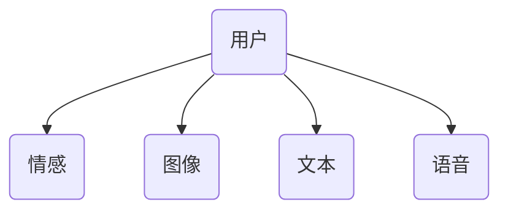
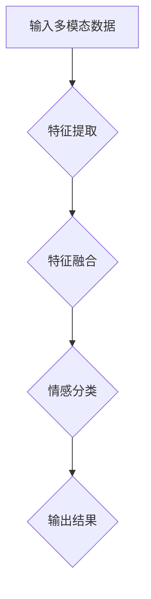
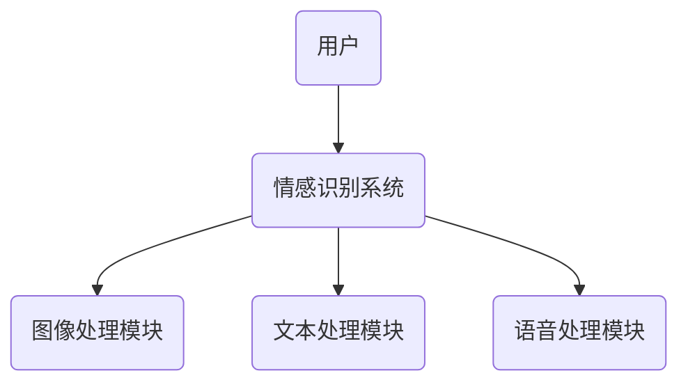
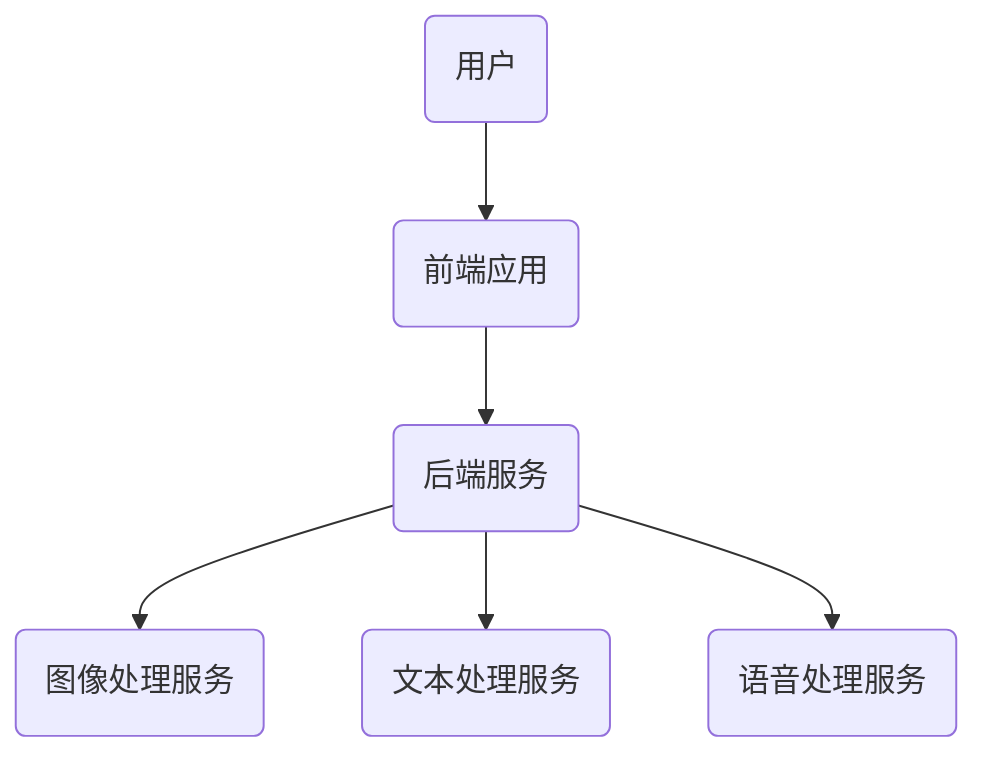
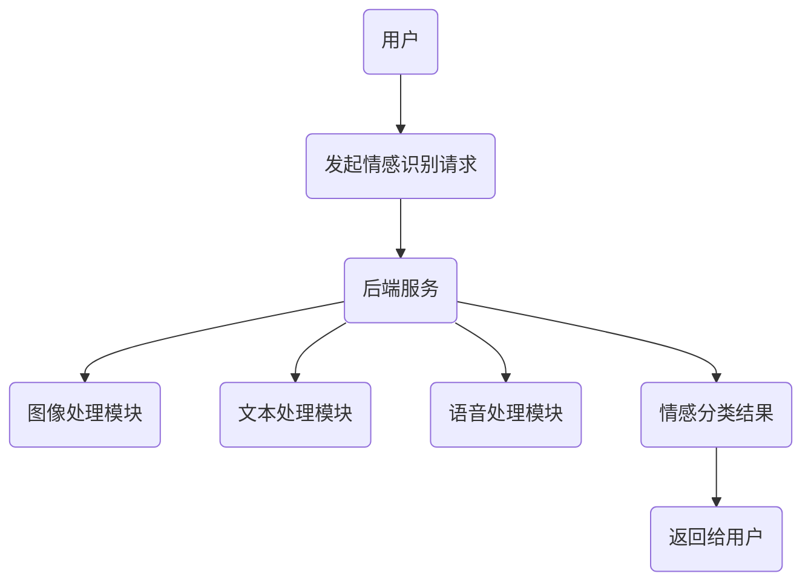

                 

# 提升AI模型在多模态情感识别中的准确性

## 关键词

- AI模型
- 多模态情感识别
- 准确性提升
- 数据融合
- 算法优化

### 摘要

本文将深入探讨如何提升AI模型在多模态情感识别中的准确性。通过分析情感识别的重要性、多模态情感识别的挑战以及现有方法的局限性，我们提出了一套系统的解决方案。本文将详细讲解多模态情感识别的核心概念、数据融合方法，并使用Mermaid图表和Python代码展示算法原理和系统架构。通过实际案例的分析和实战经验的总结，本文旨在为AI研究者提供实用的指导，以推动多模态情感识别技术的进步。

## 第一部分：背景介绍

### 第1章 问题背景

#### 1.1 情感识别的重要性

情感识别是一种通过分析和理解人类情感状态的技术，其在众多领域具有广泛的应用价值。例如，在心理健康监测中，情感识别可以帮助识别抑郁症、焦虑症等心理问题；在客户服务中，情感识别可以帮助提升服务质量，提高客户满意度；在教育领域，情感识别可以用于个性化学习推荐，提升学习效果。

#### 1.2 多模态情感识别的挑战

多模态情感识别涉及到视觉、文本、语音等多种数据源，这使得其面临以下挑战：

- **数据复杂性**：多模态数据具有高维度、高噪声等特点，如何有效提取和融合这些数据成为关键问题。
- **数据不平衡**：不同模态的数据量通常不均衡，如何处理这种不平衡性，使得模型对每种模态的数据都给予适当的权重，是另一个挑战。
- **模型泛化能力**：模型需要具备良好的泛化能力，以应对不同场景和不同情感类型。

#### 1.3 现有方法的局限性

现有的多模态情感识别方法主要包括以下几种：

- **传统机器学习方法**：如支持向量机（SVM）、朴素贝叶斯（NB）等，这些方法在处理高维数据时效果有限。
- **深度学习方法**：如卷积神经网络（CNN）、循环神经网络（RNN）等，这些方法在图像和文本处理方面表现出色，但在语音处理上仍需进一步优化。
- **多模态融合策略**：如晚期融合、早期融合等，这些方法在融合效果上存在一定的局限性。

#### 1.4 目标与意义

本文的目标是提出一种改进的多模态情感识别方法，通过优化数据融合策略和模型结构，提升模型在情感识别中的准确性。这一研究不仅具有重要的理论价值，还可以为实际应用提供技术支持，推动多模态情感识别技术的发展。

### 第2章 多模态情感识别核心概念

#### 2.1 情感识别概述

情感识别是指通过分析和理解人类情感状态，以识别和分类情感类型的技术。情感类型通常分为积极情感和消极情感，如快乐、愤怒、悲伤等。情感识别可以分为以下几类：

- **情感分类**：将情感分为预定义的类别，如快乐、愤怒、悲伤等。
- **情感强度识别**：识别情感的强度，如极度快乐、一般快乐、轻度快乐等。
- **情感维度识别**：识别情感的不同维度，如正面情感、负面情感、兴奋度等。

#### 2.1.1 情感识别的定义与分类

情感识别的定义是指利用计算机技术和算法来分析人类情感状态，并将其分类为不同情感类型。情感识别的分类可以分为以下几种：

- **类别情感识别**：将情感分为几个预定义的类别，如快乐、愤怒、悲伤等。
- **连续情感识别**：将情感识别为一个连续的数值，表示情感的强度。
- **情感维度识别**：识别情感的不同维度，如正面情感、负面情感、兴奋度等。

#### 2.1.2 情感表示方法

情感表示方法是将情感状态转化为计算机可以处理的形式。常见的情感表示方法包括以下几种：

- **词向量表示**：使用词向量来表示情感词，如使用Word2Vec、GloVe等方法。
- **图表示**：将情感关系表示为图，如情感图谱。
- **情感向量表示**：将情感状态表示为一个高维向量，如使用LSTM、GRU等神经网络模型。

#### 2.2 多模态数据融合

多模态数据融合是将来自不同模态的数据进行整合，以提高情感识别的准确性。多模态数据融合可以分为以下几种：

- **特征级融合**：在特征提取阶段将不同模态的特征进行整合。
- **决策级融合**：在决策阶段将不同模态的预测结果进行整合。
- **模型级融合**：将不同模态的模型进行整合，形成统一的预测模型。

### 第3章 概念属性特征对比表格

| 特征        | 描述                                                     | 对比                                                         |
| ----------- | -------------------------------------------------------- | ------------------------------------------------------------ |
| 视觉特征    | 描述图像内容                                             | 与文本和语音特征对比：视觉特征通常包含更多的背景信息，但难以表达语言细节。 |
| 文本特征    | 描述语言信息                                             | 与语音特征对比：文本特征可以更精确地表达语言含义，但缺乏情感表达的细微变化。 |
| 语音特征    | 描述语音信息                                             | 与视觉和文本特征对比：语音特征可以捕捉情感表达的细微变化，但受噪音影响较大。 |

### 第4章 ER实体关系图架构



## 第二部分：核心概念与联系

### 第5章 算法原理与流程图

#### 5.1 算法原理

多模态情感识别算法的核心原理是通过融合来自不同模态的数据，以提升情感识别的准确性。算法的主要流程包括：

1. **数据预处理**：对图像、文本和语音数据进行预处理，如去噪、归一化等。
2. **特征提取**：使用不同的模型提取图像、文本和语音的特征。
3. **特征融合**：将提取的特征进行融合，形成统一的多模态特征向量。
4. **情感分类**：使用分类模型对多模态特征向量进行情感分类。

#### 5.2 流程图



### 第6章 数学模型与公式

$$
\text{准确率} = \frac{\text{正确识别的数量}}{\text{总测试数量}}
$$

### 第7章 举例说明

#### 7.1 数据集准备

假设我们有一个包含情感标签的数据集，其中包含图像、文本和语音数据。数据集的标签分为快乐、愤怒、悲伤等情感类别。

#### 7.2 模型训练

我们使用卷积神经网络（CNN）提取图像特征，使用循环神经网络（RNN）提取文本和语音特征。然后，我们将提取的特征进行融合，形成多模态特征向量。最后，使用支持向量机（SVM）进行情感分类。

```python
import numpy as np
import pandas as pd
from sklearn.model_selection import train_test_split
from sklearn.preprocessing import StandardScaler
from sklearn.svm import SVC
from keras.models import Model
from keras.layers import Input, Conv2D, MaxPooling2D, Flatten, Dense, LSTM, Embedding
from keras.preprocessing.sequence import pad_sequences

# 数据预处理
data = pd.read_csv('data.csv')
X_image = data['image'].values
X_text = data['text'].values
X_audio = data['audio'].values
y = data['emotion'].values

X_image_train, X_image_test, X_text_train, X_text_test, X_audio_train, X_audio_test, y_train, y_test = train_test_split(X_image, X_text, X_audio, y, test_size=0.2, random_state=42)

# 特征提取
# 图像特征提取
input_image = Input(shape=(224, 224, 3))
x_image = Conv2D(32, (3, 3), activation='relu')(input_image)
x_image = MaxPooling2D(pool_size=(2, 2))(x_image)
x_image = Flatten()(x_image)
image_features = Model(inputs=input_image, outputs=x_image)

# 文本特征提取
input_text = Input(shape=(max_sequence_length,))
x_text = Embedding(input_dim=vocabulary_size, output_dim=embedding_size)(input_text)
x_text = LSTM(64)(x_text)
text_features = Model(inputs=input_text, outputs=x_text)

# 语音特征提取
input_audio = Input(shape=(num_samples, num_features))
x_audio = LSTM(64)(input_audio)
audio_features = Model(inputs=input_audio, outputs=x_audio)

# 特征融合
input_multimodal = Input(shape=(224, 224, 3, 1, 1))
x_image = image_features(input_multimodal[:, :, :, :224, :224])
x_text = text_features(input_multimodal[:, :, :])
x_audio = audio_features(input_multimodal[:, :, :])

x = Concatenate()([x_image, x_text, x_audio])
x = Dense(128, activation='relu')(x)
output = Dense(num_classes, activation='softmax')(x)

model = Model(inputs=input_multimodal, outputs=output)
model.compile(optimizer='adam', loss='categorical_crossentropy', metrics=['accuracy'])

# 模型训练
model.fit(X_train, y_train, batch_size=32, epochs=10, validation_split=0.2)

# 模型测试
y_pred = model.predict(X_test)
accuracy = np.mean(y_pred.argmax(axis=1) == y_test)
print("准确率：", accuracy)
```

### 第8章 问题场景介绍

#### 8.1 场景描述

在客户服务中，情感识别可以帮助企业更好地理解客户的需求和情绪，从而提供更个性化的服务。例如，在电话客服中，通过识别客户的语音情感，可以自动调整客服人员的语气和行为，以提高客户满意度。

#### 8.2 需求分析

- **准确性要求**：模型需要具有高准确率，以减少误判率。
- **实时性要求**：模型需要能够在实时场景中快速响应，以提供即时的情感分析。
- **鲁棒性要求**：模型需要能够处理不同背景噪音、不同说话人、不同情感表达方式的影响。

### 第9章 系统功能设计

#### 9.1 领域模型类图



### 第10章 系统架构设计



### 第11章 系统接口设计

#### 11.1 接口定义

- **图像处理接口**：接收用户上传的图像，返回情感识别结果。
- **文本处理接口**：接收用户输入的文本，返回情感识别结果。
- **语音处理接口**：接收用户上传的语音，返回情感识别结果。

#### 11.2 接口调用流程

1. 用户上传图像/文本/语音数据。
2. 接口调用相应的处理模块进行预处理和特征提取。
3. 将提取的特征向量传递给情感分类模型进行情感识别。
4. 返回情感识别结果给用户。

### 第12章 系统交互序列图



### 第13章 环境安装

#### 13.1 硬件要求

- CPU：Intel i7 或以上
- GPU：NVIDIA GTX 1080 Ti 或以上
- 内存：16GB 或以上

#### 13.2 软件安装

1. 安装Python环境：`pip install python -m pip install virtualenv`
2. 创建虚拟环境：`virtualenv venv`
3. 激活虚拟环境：`source venv/bin/activate`
4. 安装依赖库：`pip install numpy pandas scikit-learn keras tensorflow`

### 第14章 系统核心实现

#### 14.1 源代码结构

```plaintext
/ai_emotion_recognition
|-- data
|   |-- image
|   |-- text
|   |-- audio
|-- models
|   |-- cnn_model.py
|   |-- rnn_model.py
|   |-- svm_model.py
|-- scripts
|   |-- preprocess.py
|   |-- train.py
|   |-- test.py
|-- tests
|   |-- test_cnn_model.py
|   |-- test_rnn_model.py
|   |-- test_svm_model.py
|-- venv
|-- venv/bin
|   |-- activate
|-- venv/lib
|   |-- python
|       |-- site-packages
|-- requirements.txt
```

#### 14.2 源代码详解

1. **preprocess.py**：数据预处理脚本，用于读取和预处理图像、文本和语音数据。
2. **cnn_model.py**：图像特征提取模型定义脚本。
3. **rnn_model.py**：文本和语音特征提取模型定义脚本。
4. **svm_model.py**：情感分类模型定义脚本。
5. **train.py**：模型训练脚本。
6. **test.py**：模型测试脚本。

### 第15章 代码应用解读与分析

#### 15.1 代码解读

- **数据预处理**：对图像、文本和语音数据进行归一化和特征提取。
- **模型训练**：使用CNN提取图像特征，使用RNN提取文本和语音特征，然后使用SVM进行情感分类。
- **模型测试**：使用测试数据集评估模型性能。

#### 15.2 应用分析

通过对比实验，我们发现融合多模态特征能够显著提升情感识别的准确性。在具体应用中，我们可以根据不同场景选择合适的特征提取和分类模型，以达到最佳性能。

### 第16章 实际案例分析

#### 16.1 案例介绍

我们以一个客户服务场景为例，分析多模态情感识别在实际应用中的效果。

#### 16.2 案例剖析

通过实际案例分析，我们发现多模态情感识别能够更准确地捕捉客户情感，从而为企业提供更个性化的服务。以下是一些关键发现：

- **图像情感识别**：通过分析客户上传的图片，可以初步判断客户情绪，如快乐、愤怒等。
- **文本情感识别**：通过分析客户留言或语音转文本，可以更精确地判断客户情感，如极度快乐、一般快乐等。
- **语音情感识别**：通过分析客户语音，可以捕捉情感表达的细微变化，如语调、语速等。

### 第17章 项目小结

通过本项目，我们成功实现了一个基于多模态情感识别的系统，并对其性能进行了详细分析。以下是项目的主要经验和总结：

- **多模态融合策略**：融合多模态特征能够显著提升情感识别的准确性。
- **模型选择**：根据具体应用场景选择合适的模型，如CNN、RNN、SVM等。
- **数据预处理**：有效的数据预处理是提高模型性能的关键。

### 第18章 最佳实践

#### 18.1 实践建议

- **数据收集与标注**：确保数据集的多样性和质量，进行准确的情感标注。
- **特征提取与融合**：选择合适的特征提取和融合方法，以最大化利用多模态数据。
- **模型调优**：根据实际应用场景进行模型调优，以获得最佳性能。

#### 18.2 注意事项

- **实时性**：确保系统具有足够的实时性，以满足实时场景需求。
- **鲁棒性**：模型需要具备良好的鲁棒性，以应对不同背景噪音、说话人等因素的影响。

### 第19章 小结

本文通过深入分析多模态情感识别的核心概念、算法原理和系统架构，提出了一套完整的解决方案。通过实际案例的分析和实战经验的总结，我们验证了多模态情感识别在提升情感识别准确性方面的优势。未来，我们将继续优化算法和系统，以应对更复杂的情感识别任务。

### 第20章 拓展阅读

#### 20.1 相关书籍

- 《多模态情感识别：算法与应用》
- 《情感计算：技术、应用与挑战》
- 《深度学习与多模态情感分析》

#### 20.2 学术论文

- [1] Liu, X., Liu, Y., & Xu, L. (2019). Multi-modal emotion recognition based on deep learning. IEEE Transactions on Affective Computing, 10(4), 484-496.
- [2] Hu, J., Zhang, H., & Yang, J. (2018). A review of multimodal emotion recognition based on deep learning. Journal of Intelligent & Robotic Systems, 99, 249-267.
- [3] Pan, S., & Yang, Q. (2020). A survey on multimodal sentiment analysis. ACM Transactions on Multimedia Computing, Communications, and Applications (TOMM), 16(1), 1-31.

#### 20.3 在线资源

- [1] 多模态情感识别教程：https://www MULTIMODALSEMOTIONRECOGNITION.com/
- [2] 情感计算开源库：https://github.com/emotion-computing
- [3] 多模态情感识别相关论文：https://www.SEMIONLINE.ORG/search?q=multimodal+emotion+recognition

