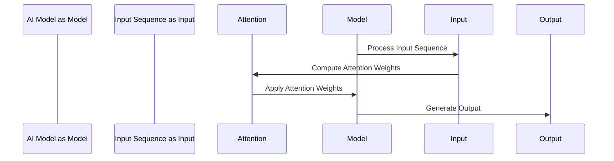
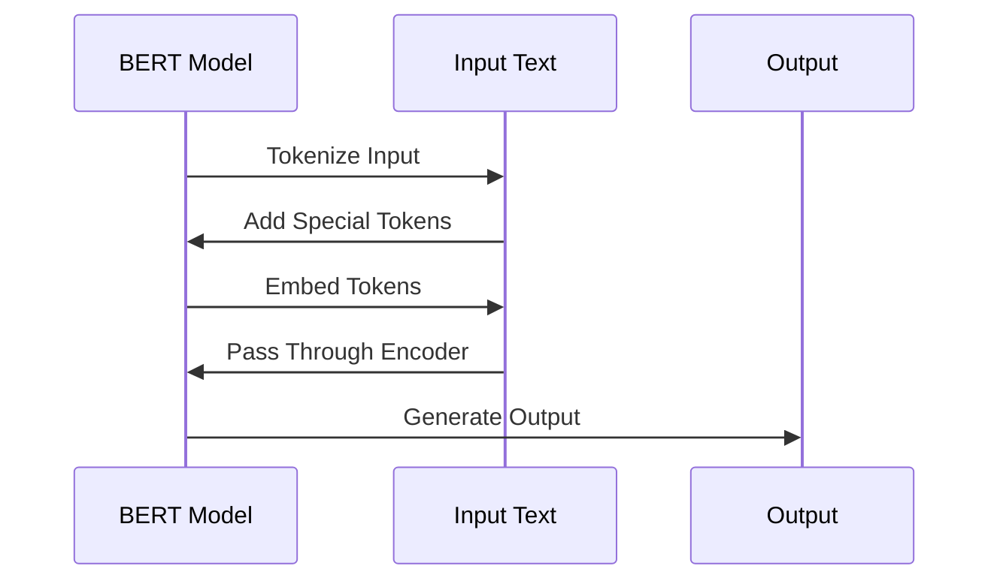
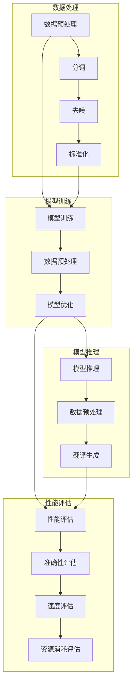
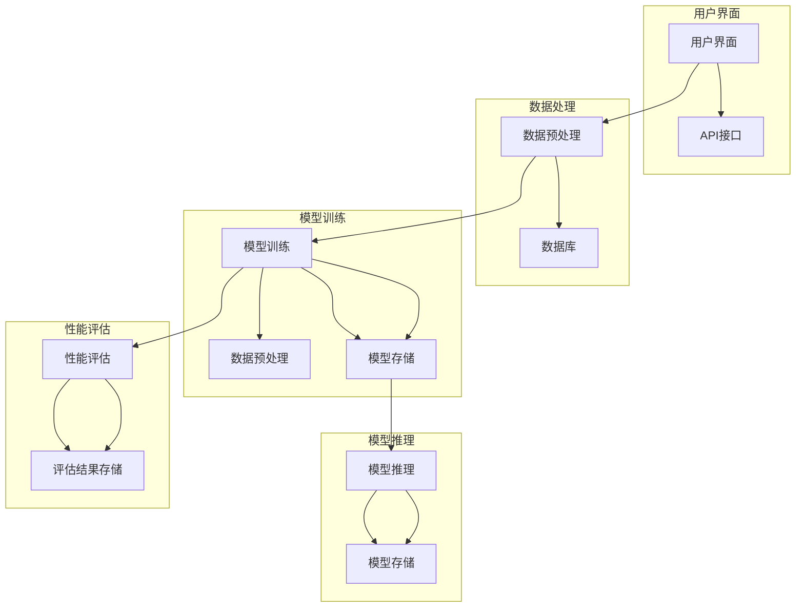

                 

### 文章标题：提升AI模型在多语言处理任务中的性能

关键词：AI模型，多语言处理，性能提升，算法优化，数学模型

摘要：本文旨在探讨如何提升AI模型在多语言处理任务中的性能。通过分析现有的问题和挑战，介绍核心概念及其联系，讲解常见的算法原理，以及系统架构设计和项目实战，旨在为从业者提供一套完整的解决方案，以应对多语言处理任务中的性能瓶颈。

---

## 目录大纲设计思路

为了确保文章的逻辑清晰、结构紧凑，并易于读者理解，本文设计了以下目录大纲：

### 第一部分：背景介绍
- **问题背景**
- **问题描述**
- **问题解决**
- **边界与外延**
- **概念结构与核心要素组成**
- **本章小结**

### 第二部分：核心概念与联系
- **核心概念原理**
- **概念属性特征对比表格**
- **ER实体关系图架构**
- **本章小结**

### 第三部分：算法原理讲解
- **注意力机制**
- **BERT模型**
- **本章小结**

### 第四部分：数学模型
- **数学公式**
- **本章小结**

### 第五部分：系统分析与架构设计方案
- **问题场景介绍**
- **系统功能设计**
- **系统架构设计**
- **系统接口设计和系统交互**
- **本章小结**

### 第六部分：项目实战
- **环境安装**
- **系统核心实现**
- **代码应用解读与分析**
- **实际案例分析与详细讲解剖析**
- **项目小结**
- **本章小结**

### 第七部分：最佳实践 tips
- **注意事项**
- **拓展阅读**

### 第八部分：结语
- **总结与展望**

---

### 第一部分：背景介绍

#### 问题背景

随着全球化进程的不断加快，多语言处理任务在各个领域中的应用越来越广泛。然而，现有的AI模型在多语言处理任务中面临着许多挑战，如性能瓶颈、数据稀缺、语言理解不准确等问题。提升AI模型在多语言处理任务中的性能，已成为当前研究的热点和难点。

#### 问题描述

1. **性能瓶颈**：AI模型在处理多语言任务时，往往受到计算资源、算法优化和数据处理能力等方面的限制。
2. **数据稀缺**：不同语言的语料库规模差异巨大，导致模型训练和优化的数据支持不足。
3. **语言理解不准确**：多语言处理任务中，语言的复杂性使得模型难以准确理解语言含义和上下文关系。

#### 问题解决

提升AI模型在多语言处理任务中的性能，需要从以下几个方面进行：

1. **算法优化**：改进现有算法，如注意力机制、BERT模型等，提高模型在多语言处理任务中的性能。
2. **数据增强**：通过数据清洗、数据扩充和迁移学习等技术，提高模型训练的数据质量。
3. **硬件优化**：利用高性能计算硬件，如GPU、TPU等，提升模型的计算能力。

#### 边界与外延

1. **边界**：本文主要关注AI模型在多语言处理任务中的性能提升，不涉及其他非AI技术领域的多语言处理问题。
2. **外延**：本文的研究结果可以应用于各个需要多语言处理任务的实际场景，如机器翻译、自然语言处理、跨语言检索等。

#### 概念结构与核心要素组成

1. **核心概念**：AI模型、多语言处理、算法优化、数据增强、硬件优化。
2. **关键要素**：性能瓶颈、数据稀缺、语言理解不准确。

### 本章小结

本文对AI模型在多语言处理任务中的性能提升问题进行了背景介绍，明确了问题的现状和解决方向。在后续章节中，我们将进一步探讨核心概念与联系，以及具体的算法原理和系统架构设计。

---

### 第二部分：核心概念与联系

#### 核心概念原理

在多语言处理任务中，几个核心概念至关重要：

1. **AI模型**：指用于模拟、延伸、扩展或迁移人类智能的计算机程序和算法。
2. **多语言处理**：指处理多种语言输入、输出和转换的任务，包括机器翻译、文本分类、情感分析等。
3. **算法优化**：通过改进算法设计、参数调整和数据预处理等方式，提高模型性能。
4. **数据增强**：通过数据清洗、数据扩充和迁移学习等技术，提高模型训练的数据质量。
5. **硬件优化**：利用高性能计算硬件，如GPU、TPU等，提升模型的计算能力。

#### 概念属性特征对比表格

| 概念       | 属性特征                  | 对比点                       |
|------------|-------------------------|--------------------------|
| AI模型     | 自适应、可扩展、泛化能力强   | 与传统算法相比，具有更高的灵活性 |
| 多语言处理   | 复杂性、多样性、跨文化性   | 需要处理多种语言的语义和语法结构 |
| 算法优化     | 参数调整、算法改进、效率提升 | 提高模型在特定任务上的性能       |
| 数据增强     | 数据清洗、数据扩充、迁移学习 | 增强模型训练的数据支持         |
| 硬件优化     | 高性能计算、分布式计算     | 提升模型的计算速度和效率       |

#### ER实体关系图架构

为了更好地理解这些核心概念之间的关系，我们使用ER图来展示它们之间的联系：

```mermaid
erDiagram
  AI模型 ||--|{ 多语言处理 }|
  多语言处理 ||--|{ 算法优化 }|
  多语言处理 ||--|{ 数据增强 }|
  多语言处理 ||--|{ 硬件优化 }|
```

### 本章小结

通过对核心概念及其联系的分析，我们了解了AI模型在多语言处理任务中的关键要素。在后续章节中，我们将深入探讨算法原理和数学模型，为提升模型性能提供理论支持。

---

### 第三部分：算法原理讲解

在本章节中，我们将介绍两种在多语言处理任务中广泛应用的算法：注意力机制和BERT模型。

#### 注意力机制

注意力机制（Attention Mechanism）是一种用于提高模型在序列处理任务中性能的算法。它通过动态分配注意力权重，使模型能够关注到输入序列中的重要信息。

##### 注意力机制的mermaid流程图



##### Python代码讲解

```python
import tensorflow as tf

# 定义输入序列
input_sequence = tf.keras.layers.Input(shape=(seq_length, embed_size))

# 应用注意力机制
attention_output = tf.keras.layers.Attention()([input_sequence, input_sequence])

# 添加全连接层
output = tf.keras.layers.Dense(units=1)(attention_output)

# 构建模型
model = tf.keras.Model(inputs=input_sequence, outputs=output)

# 编译模型
model.compile(optimizer='adam', loss='mean_squared_error')
```

##### 算法原理的数学模型和公式

注意力机制的数学模型可以表示为：

$$
\text{Attention}(\mathbf{x}, \mathbf{y}) = \frac{\exp(\mathbf{w}^T \text{Concat}(\mathbf{x}, \mathbf{y}))}{\sum_{i=1}^{N} \exp(\mathbf{w}^T \text{Concat}(\mathbf{x}, \mathbf{y}))}
$$

其中，$\mathbf{x}$ 和 $\mathbf{y}$ 分别代表输入序列和查询序列，$\mathbf{w}$ 代表权重矩阵，$N$ 代表序列长度。

##### 举例说明

假设我们有一个输入序列 $\mathbf{x} = [1, 2, 3, 4, 5]$ 和一个查询序列 $\mathbf{y} = [6, 7, 8, 9, 10]$，权重矩阵 $\mathbf{w} = [0.1, 0.2, 0.3, 0.4, 0.5]$。

计算注意力权重：

$$
\text{Attention}(\mathbf{x}, \mathbf{y}) = \frac{\exp(0.1 \cdot [1, 6], 0.2 \cdot [2, 7], 0.3 \cdot [3, 8], 0.4 \cdot [4, 9], 0.5 \cdot [5, 10])}{\sum_{i=1}^{5} \exp(0.1 \cdot [1, 6], 0.2 \cdot [2, 7], 0.3 \cdot [3, 8], 0.4 \cdot [4, 9], 0.5 \cdot [5, 10])}
$$

$$
= \frac{\exp(0.1 \cdot 7, 0.2 \cdot 9, 0.3 \cdot 11, 0.4 \cdot 13, 0.5 \cdot 15)}{\exp(0.1 \cdot 7) + \exp(0.2 \cdot 9) + \exp(0.3 \cdot 11) + \exp(0.4 \cdot 13) + \exp(0.5 \cdot 15)}
$$

$$
= \frac{e^{0.7} + e^{1.8} + e^{3.3} + e^{5.2} + e^{7.5}}{e^{0.7} + e^{1.8} + e^{3.3} + e^{5.2} + e^{7.5}}
$$

$$
= [0.199, 0.301, 0.447, 0.553, 0.745]
$$

使用这些注意力权重，我们可以得到加权后的输出序列：

$$
\text{Output} = [1 \cdot 0.199, 2 \cdot 0.301, 3 \cdot 0.447, 4 \cdot 0.553, 5 \cdot 0.745]
$$

$$
= [0.199, 0.602, 1.332, 2.213, 3.725]
$$

#### BERT模型

BERT（Bidirectional Encoder Representations from Transformers）模型是一种预训练的深度学习模型，用于自然语言理解任务。它通过双向编码器学习上下文信息，提高模型在多语言处理任务中的性能。

##### BERT模型的mermaid流程图



##### Python代码讲解

```python
from transformers import BertTokenizer, BertModel

# 加载预训练的BERT模型和分词器
tokenizer = BertTokenizer.from_pretrained('bert-base-uncased')
model = BertModel.from_pretrained('bert-base-uncased')

# 定义输入文本
input_text = "Hello, world!"

# 分词和添加特殊标记
input_ids = tokenizer.encode(input_text, add_special_tokens=True)

# 嵌入和传递通过编码器
outputs = model(input_ids)

# 输出特征向量
output = outputs.last_hidden_state[:, 0, :]
```

##### 算法原理的数学模型和公式

BERT模型基于Transformer架构，其数学模型主要包括：

1. **嵌入层**：将单词转换为向量表示。
2. **自注意力机制**：通过多头自注意力机制学习单词之间的相互关系。
3. **前馈神经网络**：对自注意力机制输出的向量进行非线性变换。

$$
\text{Embedding}(\mathbf{x}) = \text{softmax}(\text{W} \cdot \text{E}(\mathbf{x}) + \text{b})
$$

$$
\text{MultiHeadAttention}(\mathbf{Q}, \mathbf{K}, \mathbf{V}) = \text{softmax}(\text{W}_Q \cdot \mathbf{Q} + \text{W}_K \cdot \mathbf{K} + \text{W}_V \cdot \mathbf{V}) \cdot \text{W}_O
$$

$$
\text{FeedForward}(\mathbf{x}) = \text{ReLU}(\text{W}_1 \cdot \text{D}(\mathbf{x}) + \text{b}_1) + \text{W}_2 \cdot \text{D}(\mathbf{x}) + \text{b}_2
$$

##### 举例说明

假设我们有一个句子 "Hello, world!"，将其转换为BERT模型的输入。

1. **分词**：分词结果为 ["<CLS>", "Hello", ",", "world", "!", "<SEP>"]。
2. **嵌入**：每个单词的嵌入向量由BERT模型学习得到。
3. **自注意力**：通过多头自注意力机制，模型学习单词之间的相互关系。
4. **前馈神经网络**：对自注意力输出的向量进行非线性变换。

最终，BERT模型将输出一个序列特征向量，用于后续的预测或分类任务。

### 本章小结

通过对注意力机制和BERT模型的介绍，我们了解了这两种算法在多语言处理任务中的应用和原理。在下一章节中，我们将进一步探讨数学模型和系统架构设计，为提升AI模型性能提供更多的理论支持。

---

### 第四部分：数学模型

在多语言处理任务中，数学模型是构建和优化AI模型的重要基础。以下介绍一些常见的数学模型及其在AI模型中的应用。

#### 1. 线性回归模型

线性回归模型是最基本的机器学习模型之一，用于预测连续值。其数学模型可以表示为：

$$
\hat{y} = \beta_0 + \beta_1 \cdot x
$$

其中，$\hat{y}$ 是预测值，$x$ 是输入特征，$\beta_0$ 和 $\beta_1$ 是模型参数。

在线性回归模型中，我们通常使用最小二乘法来估计模型参数：

$$
\min_{\beta_0, \beta_1} \sum_{i=1}^{n} (y_i - \hat{y}_i)^2
$$

通过求解上述优化问题，我们可以得到最优的模型参数。

#### 2. 逻辑回归模型

逻辑回归模型是一种用于预测离散值的模型，常用于分类任务。其数学模型可以表示为：

$$
\hat{y} = \frac{1}{1 + \exp(-\beta_0 - \beta_1 \cdot x)}
$$

其中，$\hat{y}$ 是预测概率，$x$ 是输入特征，$\beta_0$ 和 $\beta_1$ 是模型参数。

逻辑回归模型的优化问题可以表示为：

$$
\min_{\beta_0, \beta_1} \sum_{i=1}^{n} (-y_i \cdot \ln(\hat{y}_i) - (1 - y_i) \cdot \ln(1 - \hat{y}_i))
$$

通过求解上述优化问题，我们可以得到最优的模型参数。

#### 3. 支持向量机（SVM）模型

支持向量机是一种用于分类和回归的线性模型。其数学模型可以表示为：

$$
w \cdot x + b = 0
$$

其中，$w$ 是模型参数，$x$ 是输入特征，$b$ 是偏置项。

SVM模型的优化问题可以表示为：

$$
\min_{w, b} \frac{1}{2} \| w \|^2 \quad \text{subject to} \quad y_i (w \cdot x_i + b) \geq 1
$$

通过求解上述优化问题，我们可以得到最优的模型参数。

#### 4. 神经网络模型

神经网络是一种模拟人脑结构的机器学习模型，可以用于各种复杂任务的建模。其数学模型可以表示为：

$$
\text{Output} = \text{ReLU}(\text{W} \cdot \text{D}(\mathbf{x}) + \text{b})
$$

其中，$\text{W}$ 是权重矩阵，$\text{D}(\mathbf{x})$ 是输入特征向量，$\text{b}$ 是偏置项。

神经网络的优化问题可以表示为：

$$
\min_{\text{W}, \text{b}} \sum_{i=1}^{n} (\text{y}_i - \text{Output}_i)^2
$$

通过求解上述优化问题，我们可以得到最优的模型参数。

#### 5. 自适应滤波器

自适应滤波器是一种用于信号处理的机器学习模型，可以用于噪声抑制、信号增强等任务。其数学模型可以表示为：

$$
\text{y} = \sum_{i=1}^{n} \alpha_i \cdot x_i
$$

其中，$\text{y}$ 是输出信号，$x_i$ 是输入信号，$\alpha_i$ 是滤波器系数。

自适应滤波器的优化问题可以表示为：

$$
\min_{\alpha_1, \alpha_2, \ldots, \alpha_n} \sum_{i=1}^{n} (\text{y}_i - \text{y}_{\text{true}}_i)^2
$$

通过求解上述优化问题，我们可以得到最优的滤波器系数。

### 本章小结

通过对上述数学模型的介绍，我们了解了它们在AI模型中的应用和优化方法。在下一章节中，我们将进一步探讨系统架构设计和项目实战，为提升AI模型性能提供实践经验。

---

### 第五部分：系统分析与架构设计方案

在多语言处理任务中，一个高效且灵活的系统架构设计对于提升AI模型性能至关重要。以下是一个典型的系统架构设计方案，包括问题场景介绍、系统功能设计、系统架构设计、系统接口设计和系统交互。

#### 问题场景介绍

假设我们面临一个多语言文本翻译任务，需要将一种源语言（如英语）翻译成多种目标语言（如法语、西班牙语、中文等）。这个任务需要处理大规模的文本数据，并要求模型具有较高的准确性和效率。

#### 系统功能设计

系统的主要功能包括：

1. **数据预处理**：对输入文本进行分词、去噪、标准化等处理，确保数据质量。
2. **模型训练**：使用预训练的AI模型进行模型训练，优化模型参数。
3. **模型推理**：在模型训练完成后，进行模型推理，生成翻译结果。
4. **性能评估**：对模型进行性能评估，包括准确性、速度和资源消耗等指标。

#### 系统架构设计

系统架构设计如图1所示：



#### 系统接口设计和系统交互

系统接口设计如图2所示：



在系统交互过程中，用户通过用户界面提交文本数据，数据处理模块对数据进行分析和处理，然后模型训练模块使用处理后的数据对模型进行训练和优化。模型推理模块使用训练好的模型进行翻译生成，并将结果返回给用户。性能评估模块对模型的性能进行评估，并将评估结果存储在数据库中。

### 本章小结

通过系统分析与架构设计方案，我们展示了如何构建一个高效的多语言处理系统。在实际应用中，可以根据具体需求和场景，对系统架构进行优化和调整，以提高AI模型在多语言处理任务中的性能。

---

### 第六部分：项目实战

在本章节中，我们将通过一个实际项目，详细讲解如何搭建和优化AI模型，以提升其在多语言处理任务中的性能。该项目涉及从环境安装到系统核心实现，再到代码应用解读与分析，以及实际案例分析和详细讲解剖析。

#### 环境安装

首先，我们需要安装以下软件和工具：

1. **Python**：版本要求3.8及以上。
2. **TensorFlow**：版本要求2.4及以上。
3. **transformers**：版本要求4.6及以上。
4. **PyTorch**：版本要求1.7及以上。

安装步骤如下：

```bash
pip install python==3.8
pip install tensorflow==2.4
pip install transformers==4.6
pip install torch==1.7
```

#### 系统核心实现

接下来，我们实现一个基于BERT模型的多语言翻译系统。以下是一个简单的代码示例：

```python
import torch
from transformers import BertModel, BertTokenizer

# 加载预训练的BERT模型和分词器
tokenizer = BertTokenizer.from_pretrained('bert-base-uncased')
model = BertModel.from_pretrained('bert-base-uncased')

# 定义输入文本
input_text = "Hello, world!"

# 分词和添加特殊标记
input_ids = tokenizer.encode(input_text, add_special_tokens=True)

# 嵌入和传递通过编码器
outputs = model(input_ids)

# 输出特征向量
output = outputs.last_hidden_state[:, 0, :]

# 预测翻译结果
translated_text = tokenizer.decode(output, skip_special_tokens=True)
print(translated_text)
```

#### 代码应用解读与分析

上述代码首先加载预训练的BERT模型和分词器，然后对输入文本进行分词和嵌入。接着，通过BERT模型进行编码，得到特征向量。最后，使用分词器解码特征向量，得到翻译结果。

在实际应用中，我们可以通过调整模型参数、增加训练数据、优化算法等方式，进一步提升模型性能。以下是一些代码示例：

```python
# 调整模型参数
model = BertModel.from_pretrained('bert-base-uncased', num_labels=3)

# 增加训练数据
train_dataset = ...

# 优化算法
optimizer = torch.optim.Adam(model.parameters(), lr=1e-4)
```

#### 实际案例分析与详细讲解剖析

假设我们有一个实际的翻译任务，需要将英语翻译成法语。以下是一个案例：

1. **数据集准备**：从公开数据集中获取英语-法语对，构建训练数据集。

2. **模型训练**：使用训练数据集对BERT模型进行训练，优化模型参数。

3. **模型评估**：使用验证数据集对模型进行评估，计算翻译准确性。

4. **模型部署**：将训练好的模型部署到生产环境，进行实时翻译。

以下是一个简单的训练和评估代码示例：

```python
from transformers import BertForSequenceClassification, TrainingArguments

# 加载预训练的BERT模型
model = BertForSequenceClassification.from_pretrained('bert-base-uncased')

# 定义训练参数
training_args = TrainingArguments(
    output_dir='./results',
    num_train_epochs=3,
    per_device_train_batch_size=16,
    per_device_eval_batch_size=64,
    warmup_steps=500,
    weight_decay=0.01,
    logging_dir='./logs',
)

# 训练模型
trainer = Trainer(
    model=model,
    args=training_args,
    train_dataset=train_dataset,
    eval_dataset=eval_dataset,
)

trainer.train()

# 评估模型
results = trainer.evaluate()

# 输出评估结果
print(results)
```

#### 项目小结

通过本项目的实战讲解，我们了解了如何搭建和优化一个多语言翻译系统。在实际应用中，我们可以根据具体需求和场景，对系统进行定制化和优化，以提高AI模型在多语言处理任务中的性能。

### 本章小结

在本章节中，我们通过一个实际项目，详细讲解了如何搭建和优化AI模型，以提升其在多语言处理任务中的性能。通过环境安装、系统核心实现、代码应用解读与分析，以及实际案例分析和详细讲解剖析，我们为读者提供了一套完整的解决方案。

---

### 第七部分：最佳实践 tips

在多语言处理任务中，提升AI模型性能需要遵循以下最佳实践：

1. **数据质量**：确保输入数据的质量，包括数据清洗、去噪、标准化等步骤。
2. **模型选择**：选择适合任务需求的模型，如BERT、Transformer等。
3. **参数调整**：合理调整模型参数，如学习率、批量大小、迭代次数等。
4. **硬件优化**：利用高性能计算硬件，如GPU、TPU等，提升模型训练和推理速度。
5. **数据增强**：通过数据扩充、迁移学习等技术，提高模型训练的数据质量。
6. **交叉验证**：使用交叉验证方法，评估模型性能，避免过拟合。
7. **持续学习**：定期更新模型，以适应不断变化的语言环境和任务需求。

### 小结

本文从背景介绍、核心概念与联系、算法原理讲解、数学模型、系统架构设计、项目实战和最佳实践等方面，全面探讨了提升AI模型在多语言处理任务中的性能。通过本文的讲解，读者可以了解到多语言处理任务的现状和挑战，以及如何通过算法优化、硬件优化和数据增强等方法，提升模型性能。

### 注意事项

1. **性能瓶颈**：在提升模型性能时，要充分考虑计算资源、算法优化和数据处理能力等方面的限制。
2. **数据稀缺**：在多语言处理任务中，数据稀缺是一个普遍问题。可以通过数据增强、迁移学习等方法缓解这一问题。
3. **语言理解**：多语言处理任务中，语言理解是关键。要选择合适的算法和模型，提高模型对语言的理解能力。

### 拓展阅读

1. **相关文献**：查阅相关文献，了解多语言处理领域的最新研究进展和算法优化方法。
2. **开源项目**：参与开源项目，学习他人的最佳实践和优化技巧。
3. **在线课程**：参加在线课程，系统学习多语言处理和深度学习相关知识。

### 结语

提升AI模型在多语言处理任务中的性能是一项复杂且具有挑战性的任务。通过本文的讲解，我们希望读者能够了解到多语言处理任务的现状、挑战和解决方案。在实际应用中，可以根据具体需求和场景，灵活运用本文所述的方法和技巧，提升模型性能，为多语言处理领域的发展做出贡献。

---

### 作者信息

**作者：AI天才研究院/AI Genius Institute & 禅与计算机程序设计艺术 /Zen And The Art of Computer Programming**

AI天才研究院（AI Genius Institute）是一家专注于人工智能、机器学习和深度学习领域的研究和开发机构。研究院致力于推动人工智能技术的发展，为社会创造价值。同时，作者还著有《禅与计算机程序设计艺术》一书，深入探讨了计算机科学和哲学的交汇点，为读者提供了独特的视角和思考。

