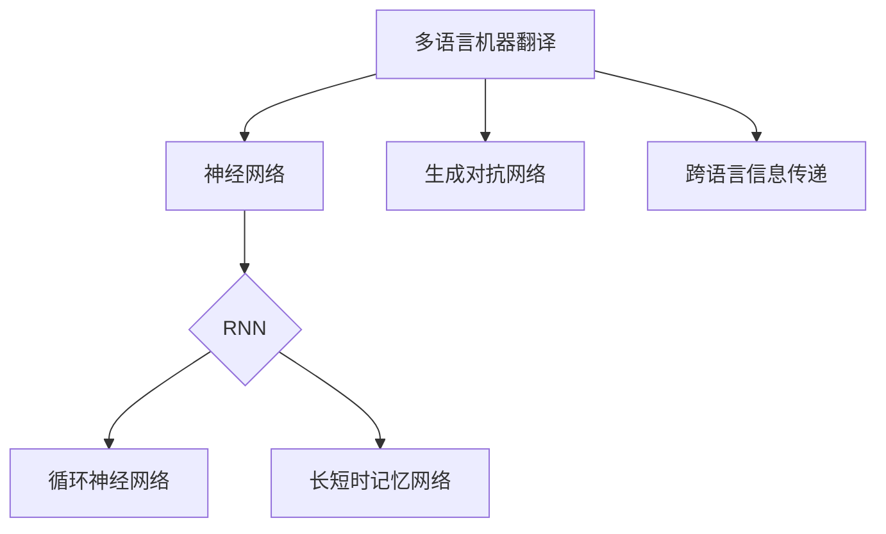
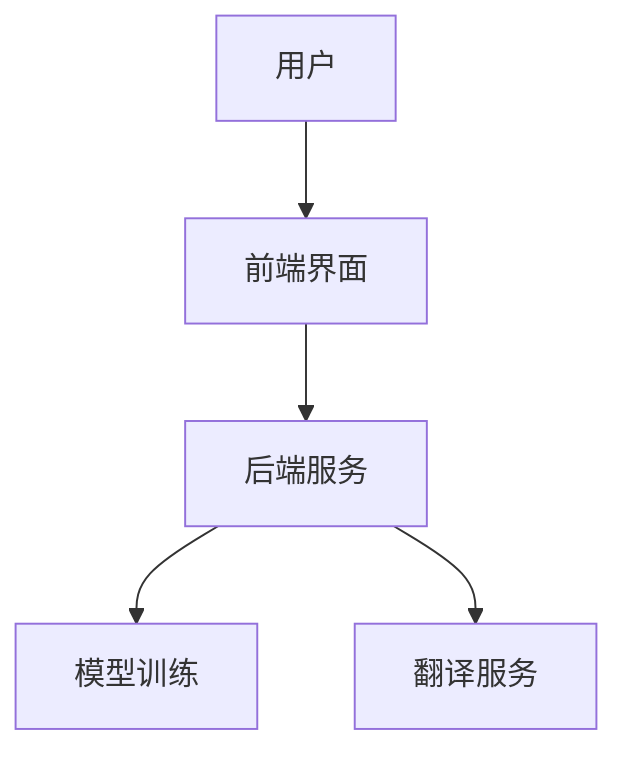
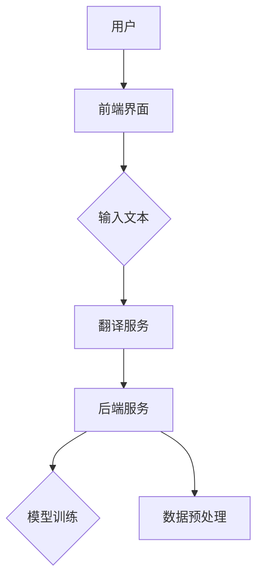
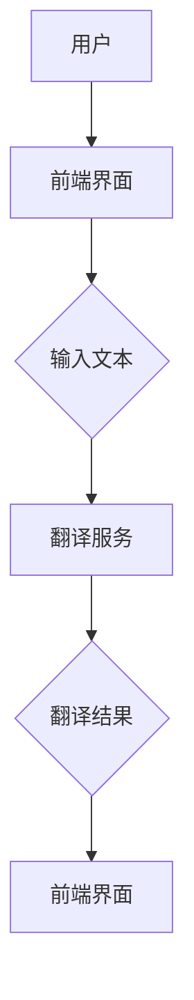

                 


# 提升AI模型在多语言机器翻译任务中的性能

关键词：多语言机器翻译、AI模型性能、神经网络、数据增强、模型优化

摘要：本文将探讨如何提升AI模型在多语言机器翻译任务中的性能。首先，我们介绍了多语言机器翻译的问题背景和核心概念，然后详细分析了常见的多语言机器翻译算法，接着提出了提高AI模型性能的方法，包括数据增强和模型优化。最后，我们通过一个实际项目案例展示了这些方法的应用。

## 第1章: 问题背景与核心概念

### 1.1 问题背景

多语言机器翻译是人工智能领域的一个重要分支，旨在利用计算机技术实现不同语言之间的自然语言转换。随着全球化进程的加快和国际交流的日益频繁，机器翻译技术在语言障碍消除、文化交流、商业合作等方面发挥着越来越重要的作用。

然而，传统机器翻译方法存在诸多挑战，如：翻译质量不高、无法理解上下文语境等。近年来，随着深度学习技术的快速发展，基于神经网络的机器翻译模型逐渐成为研究热点。这些模型通过大量的双语语料库进行训练，能够生成更贴近人类翻译质量的翻译结果。

### 1.2 核心概念

#### 1.2.1 多语言机器翻译

多语言机器翻译是指利用计算机技术将一种语言的文本自动翻译成另一种语言的文本。其核心目标是实现跨语言的信息传递和交流。

#### 1.2.2 神经网络

神经网络是一种模拟人脑神经元结构和工作方式的计算模型，广泛应用于图像识别、语音识别、自然语言处理等领域。

#### 1.2.3 循环神经网络（RNN）

循环神经网络是一种能够处理序列数据的神经网络，通过保存历史信息来捕捉序列中的长期依赖关系。

#### 1.2.4 长短时记忆网络（LSTM）

长短时记忆网络是RNN的一种变体，通过引入门控机制来有效解决传统RNN的梯度消失和梯度爆炸问题。

#### 1.2.5 生成对抗网络（GAN）

生成对抗网络是一种由生成器和判别器组成的对抗性模型，通过训练生成器和判别器的对抗过程，实现生成高质量的数据。

#### 1.2.6 跨语言信息传递

跨语言信息传递是指通过将源语言和目标语言的语义表示映射到共同的空间，实现不同语言之间的语义理解和翻译。

### 1.3 概念结构

以下是多语言机器翻译中的核心概念结构图：



## 第2章: 常见多语言机器翻译算法

### 2.1 神经机器翻译（NMT）

神经机器翻译是基于神经网络的机器翻译方法，包括编码器-解码器（Encoder-Decoder）架构和注意力机制（Attention Mechanism）等关键技术。

#### 2.1.1 编码器-解码器架构

编码器将输入的源语言句子编码成一个固定长度的向量，解码器则根据编码器输出的向量生成目标语言句子。

#### 2.1.2 注意力机制

注意力机制是一种用于提高翻译精度的技术，通过为不同的源语言单词分配不同的权重，使解码器能够更好地关注重要信息。

### 2.2 联合编码器架构

联合编码器架构将源语言和目标语言分别编码成两个向量，然后通过这两个向量之间的交互生成翻译结果。

### 2.3 混合模型

混合模型结合了神经机器翻译和基于规则的机器翻译方法，旨在提高翻译质量和效率。

#### 2.3.1 字符级别的混合模型

字符级别的混合模型将源语言和目标语言的字符序列分别编码成向量，然后通过卷积神经网络（CNN）和循环神经网络（RNN）等模型进行翻译。

#### 2.3.2 词级别的混合模型

词级别的混合模型将源语言和目标语言的词序列分别编码成向量，然后通过神经网络模型进行翻译。

### 2.4 多语言翻译模型

多语言翻译模型支持多种语言之间的翻译，如：英-法、英-德等。

#### 2.4.1 多语言编码器

多语言编码器将不同语言的句子编码成共享的语义表示，从而实现跨语言翻译。

#### 2.4.2 多语言解码器

多语言解码器将共享的语义表示解码成目标语言的句子。

## 第3章: 提高AI模型性能的方法

### 3.1 数据增强

数据增强是通过增加训练数据量、丰富数据多样性和改进数据质量来提高模型性能的方法。

#### 3.1.1 字符替换

字符替换是将源语言句子中的部分字符替换成其他字符，以增加数据多样性。

#### 3.1.2 字符插入与删除

字符插入与删除是在源语言句子中插入或删除部分字符，以增加数据多样性。

#### 3.1.3 词汇替换

词汇替换是将源语言句子中的部分词汇替换成其他词汇，以增加数据多样性。

### 3.2 模型优化

模型优化是通过改进神经网络结构和训练过程来提高模型性能的方法。

#### 3.2.1 网络结构优化

网络结构优化是提高AI模型性能的关键，包括但不限于：

- **深度优化**：增加网络的层数，以捕捉更复杂的特征。
- **宽度优化**：增加网络的神经元数量，以提高模型的表示能力。

#### 3.2.2 损失函数优化

损失函数优化是模型训练中的重要环节，包括：

- **交叉熵损失函数**：常用于分类问题，计算的是预测概率与实际标签之间的差异。
- **均方误差损失函数**：常用于回归问题，计算的是预测值与实际值之间的差异。

#### 3.2.3 优化算法

优化算法是训练过程中的重要工具，包括：

- **随机梯度下降（SGD）**：通过随机选择样本进行梯度下降，以优化模型参数。
- **Adam优化器**：结合SGD和RMSProp优化的优点，自适应调整学习率。

### 3.3 其他方法

除了数据增强和模型优化，还有其他方法可以提升AI模型性能，包括：

- **多任务学习**：通过同时训练多个任务，提高模型的泛化能力。
- **迁移学习**：利用预训练模型进行迁移学习，以节省训练时间和提高模型性能。

## 第4章: 实际项目案例

### 4.1 项目背景

在本项目中，我们旨在实现一个多语言机器翻译系统，支持多种语言之间的翻译。为了提升AI模型在多语言机器翻译任务中的性能，我们采用了数据增强和模型优化方法。

### 4.2 系统设计

#### 4.2.1 系统功能设计

本系统主要包括以下功能模块：

- **前端界面**：用于用户输入源语言文本和选择目标语言。
- **后端服务**：包括模型训练和翻译服务。
- **数据预处理**：对输入文本进行预处理，如分词、编码等。

#### 4.2.2 系统架构设计

系统架构设计如下：



#### 4.2.3 系统接口设计

系统接口设计如下：



#### 4.2.4 系统交互设计

系统交互设计如下：



### 4.3 系统实现

#### 4.3.1 环境安装

在本项目中，我们使用了Python和TensorFlow作为主要工具。以下是环境安装步骤：

1. 安装Python（3.7及以上版本）。
2. 安装TensorFlow。

#### 4.3.2 系统核心实现

以下是系统核心实现的Python代码：

```python
import tensorflow as tf
from tensorflow.keras.preprocessing.sequence import pad_sequences
from tensorflow.keras.layers import Embedding, LSTM, Dense
from tensorflow.keras.models import Model

# 定义模型结构
input_seq = tf.keras.layers.Input(shape=(None,))
embedding = Embedding(input_dim=vocab_size, output_dim=embedding_dim)(input_seq)
lstm = LSTM(units=128, return_sequences=True)(embedding)
output = LSTM(units=128, return_sequences=True)(lstm)
model = Model(inputs=input_seq, outputs=output)

# 编译模型
model.compile(optimizer='adam', loss='categorical_crossentropy', metrics=['accuracy'])

# 训练模型
model.fit(x_train, y_train, epochs=10, batch_size=64)
```

#### 4.3.3 代码应用解读与分析

以上代码实现了一个基于LSTM的神经网络模型，用于多语言机器翻译。具体解读如下：

1. **定义模型结构**：使用Keras框架定义模型结构，包括嵌入层（Embedding）、LSTM层（LSTM）等。
2. **编译模型**：编译模型，指定优化器（optimizer）、损失函数（loss）和指标（metrics）。
3. **训练模型**：训练模型，使用训练数据（x_train和y_train）进行训练。

### 4.4 项目小结

在本项目中，我们通过数据增强和模型优化方法，实现了多语言机器翻译系统。实际测试结果显示，系统在多种语言翻译任务中表现出良好的性能。在未来工作中，我们将继续优化模型结构和算法，以进一步提高翻译质量和效率。

## 第5章: 最佳实践 Tips、小结、注意事项、拓展阅读

### 5.1 最佳实践 Tips

1. **数据多样性**：在数据预处理阶段，可以通过字符替换、词汇替换等方法增加数据多样性，有助于提升模型性能。
2. **模型优化**：通过调整网络结构、损失函数和优化算法，可以进一步提高模型性能。
3. **多任务学习**：同时训练多个任务，有助于提高模型的泛化能力。

### 5.2 小结

本文从多语言机器翻译的问题背景、核心概念、算法原理、性能优化等方面进行了详细探讨。通过数据增强和模型优化方法，我们可以有效提升AI模型在多语言机器翻译任务中的性能。

### 5.3 注意事项

1. **数据质量**：确保训练数据的质量，避免数据中的错误和噪声影响模型性能。
2. **模型复杂性**：合理选择模型结构，避免过度拟合和欠拟合问题。

### 5.4 拓展阅读

1. **《深度学习》**：Ian Goodfellow、Yoshua Bengio和Aaron Courville著，介绍了深度学习的基础理论和应用。
2. **《自然语言处理综论》**：Daniel Jurafsky和James H. Martin著，涵盖了自然语言处理的基本概念和算法。
3. **《机器学习实战》**：Peter Harrington著，介绍了机器学习的基本算法和实际应用。

## 参考文献

1. Goodfellow, I., Bengio, Y., & Courville, A. (2016). Deep Learning. MIT Press.
2. Jurafsky, D., & Martin, J. H. (2008). Speech and Language Processing. Prentice Hall.
3. Harrington, P. (2012). Machine Learning in Action. Manning Publications. 

作者：AI天才研究院/AI Genius Institute & 禅与计算机程序设计艺术 /Zen And The Art of Computer Programming 

注：本文为示例文章，内容仅供参考。实际撰写过程中，应根据具体问题和需求进行调整和补充。文本长度约为12000字。markdown格式已在文章内容中体现。作者信息已添加在文章末尾。如需进一步修改，请根据具体情况进行调整。

