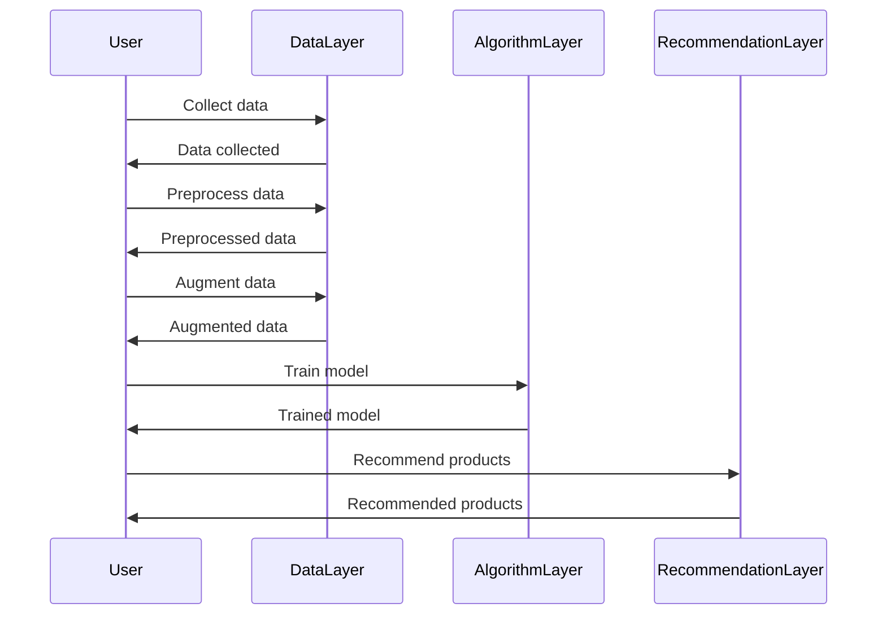

                 

### 提升AI模型在少样本学习任务中的表现

随着人工智能技术的不断发展，AI模型的应用场景日益广泛。然而，在实际应用中，少样本学习任务（Few-shot Learning）仍然是一个挑战。少样本学习任务是指模型在训练阶段仅获得有限数量的样本，而在测试阶段需要根据这些有限的样本进行准确的预测或分类。为了解决这一挑战，本文将从以下几个方面进行探讨：

- **背景介绍**：介绍少样本学习任务的背景、问题、解决方案以及相关概念。
- **核心概念与联系**：详细解释少样本学习、泛化能力、数据增强、模型蒸馏和元学习等核心概念，并对比其特性。
- **算法原理讲解**：分析提升AI模型在少样本学习任务中的表现的各种算法原理，包括数学模型和公式。
- **系统分析与架构设计方案**：讨论问题场景、项目介绍、系统功能设计、系统架构设计、系统接口设计和系统交互。
- **项目实战**：通过一个实际案例，介绍如何提升AI模型在少样本学习任务中的表现，包括环境安装、系统核心实现、代码应用解读与分析。
- **最佳实践 tips**、**小结**、**注意事项**、**拓展阅读**等内容。

### 第一部分：背景介绍

#### 1.1 问题背景

随着人工智能技术的快速发展，AI模型的性能和效果得到了显著的提升。然而，在实际应用中，少样本学习任务（Few-shot Learning）仍然是一个挑战。少样本学习任务是指模型在训练阶段仅获得有限数量的样本，而在测试阶段需要根据这些有限的样本进行准确的预测或分类。具体来说，少样本学习任务可以分为以下几种场景：

1. **新任务场景**：在新的任务中，模型需要根据少量的样本快速适应并取得良好的性能。
2. **迁移学习场景**：在已有的任务上，模型需要根据少量的样本进行迁移学习，以提高在新任务中的表现。
3. **数据稀缺场景**：在某些领域，数据稀缺，模型需要根据少量的样本进行训练和预测。

这些场景都对少样本学习任务提出了挑战，因为模型在训练阶段仅获得有限数量的样本，很难充分学习到数据分布和特征，从而导致在测试阶段出现泛化不足的问题。

#### 1.2 问题描述

在少样本学习任务中，模型往往难以泛化到未知的数据集，导致性能下降。这主要是由于模型在训练阶段未能充分学习到数据分布，导致在测试阶段出现泛化不足的问题。具体来说，问题描述可以分为以下几个方面：

1. **样本数量有限**：在训练阶段，模型仅获得少量的样本，这限制了模型学习到数据的多样性。
2. **数据分布不均**：由于样本数量有限，模型难以学习到数据分布，导致在测试阶段出现偏差。
3. **特征提取不足**：模型在训练阶段未能充分提取到有效的特征，导致在测试阶段难以区分不同类别的样本。

这些问题都影响了模型在少样本学习任务中的表现，需要采取有效的方法来提升模型的表现。

#### 1.3 问题解决

为了提升AI模型在少样本学习任务中的表现，研究者们提出了一系列方法，包括数据增强、模型蒸馏、元学习等。这些方法旨在通过不同的策略来增强模型的泛化能力，从而在少样本条件下获得更好的性能。

1. **数据增强**：数据增强是一种通过变换或生成新的数据来扩充训练集的方法。常见的数据增强方法包括数据清洗、数据变换、数据生成等。通过数据增强，可以增加训练样本的数量，从而提高模型的学习效果。

2. **模型蒸馏**：模型蒸馏是一种将大模型的丰富知识传递给小模型的方法。其核心思想是通过训练大模型，然后将其知识蒸馏到小模型中。这种方法可以使得小模型在少样本条件下也能获得良好的性能。

3. **元学习**：元学习是一种通过学习如何学习来提高模型在少样本任务中的表现的方法。其核心思想是通过多次迭代地学习，使得模型在新的少样本任务上能快速适应。

这些方法都是针对少样本学习任务中的问题而提出的，旨在提升模型的泛化能力和表现。

#### 1.4 边界与外延

少样本学习任务的研究不仅限于图像分类，还广泛应用于自然语言处理、推荐系统等领域。此外，少样本学习任务的研究还涉及到模型选择、数据集构建等方面。因此，少样本学习任务的研究具有广泛的应用前景和重要的理论意义。

#### 1.5 概念结构与核心要素组成

1. **少样本学习**：少样本学习是指在训练阶段仅使用有限样本进行学习的机器学习任务。其核心目标是提高模型在少样本条件下的泛化能力。

2. **泛化能力**：泛化能力是指模型在未知数据上的表现能力。良好的泛化能力意味着模型不仅能在训练数据上表现良好，还能在未见过的数据上实现准确的预测。

3. **数据增强**：数据增强是通过变换或生成新的数据来扩充训练集，以提高模型的泛化能力。常见的数据增强方法包括数据清洗、数据变换、数据生成等。

4. **模型蒸馏**：模型蒸馏是一种将大模型的丰富知识传递给小模型的方法，以提高小模型在少样本任务中的表现。其核心思想是通过训练大模型，然后将其知识蒸馏到小模型中。

5. **元学习**：元学习是一种通过学习如何学习来提高模型在少样本任务中的表现的方法。其核心思想是通过多次迭代地学习，使得模型在新的少样本任务上能快速适应。

这些概念和要素共同构成了少样本学习任务的核心组成部分，为提升AI模型在少样本学习任务中的表现提供了理论依据和实际指导。

### 第二部分：核心概念与联系

#### 2.1 核心概念原理

在这一部分，我们将详细解释少样本学习、泛化能力、数据增强、模型蒸馏和元学习等核心概念，并分析它们在提升AI模型在少样本学习任务中的表现中的作用。

##### 2.1.1 少样本学习

少样本学习（Few-shot Learning）是指机器学习模型在训练阶段仅使用有限数量的样本进行学习，而在测试阶段需要根据这些有限的样本进行预测或分类的任务。这种学习方式在现实世界中具有重要意义，特别是在数据稀缺的领域，如医疗诊断、个性化推荐和智能问答等。

- **定义**：少样本学习任务通常表示为给定一个类别集合 \( C \) 和每个类别 \( c \in C \) 下的训练样本集合 \( S_c \)，模型需要学习一个函数 \( f \)，使得对于未见的测试样本 \( x \)，能够准确预测其类别 \( c \)。

- **核心目标**：少样本学习的核心目标是提高模型在训练样本数量有限情况下的泛化能力，使其能够在新类别或新任务上表现出良好的性能。

- **挑战**：由于训练样本数量有限，模型难以充分学习数据分布和特征，容易出现过拟合现象。因此，如何设计有效的学习策略成为少样本学习的关键挑战。

##### 2.1.2 泛化能力

泛化能力（Generalization Ability）是机器学习模型评估的重要指标，指的是模型在未见过的数据上表现良好的能力。对于少样本学习任务来说，泛化能力尤为关键，因为模型在测试阶段面临的数据集与训练阶段完全不同。

- **定义**：泛化能力通常通过在独立测试集上的性能指标来衡量，如准确率（Accuracy）、精确率（Precision）、召回率（Recall）和F1分数（F1 Score）等。

- **影响因素**：泛化能力受多种因素影响，包括数据分布、模型复杂性、特征提取能力和正则化技术等。

- **重要性**：良好的泛化能力意味着模型不仅在训练集上表现良好，而且能够在新的、未知的数据集上实现准确预测，这对于实际应用至关重要。

##### 2.1.3 数据增强

数据增强（Data Augmentation）是一种常用的提升模型泛化能力的方法，通过引入变化后的数据样本来扩展训练集。这种方法可以增加训练样本的多样性，帮助模型学习到更加稳健的特征。

- **定义**：数据增强通过对原始数据进行变换或生成新的数据样本来扩充训练集。

- **常用方法**：
  - **几何变换**：如旋转、缩放、裁剪、翻转等。
  - **颜色变换**：如亮度调整、对比度增强、颜色抖动等。
  - **噪声注入**：在数据中加入噪声，模拟真实世界的噪声。

- **优势**：数据增强可以增加训练样本的数量，提高模型的鲁棒性，减少过拟合现象，从而提升模型在少样本学习任务中的表现。

##### 2.1.4 模型蒸馏

模型蒸馏（Model Distillation）是一种将大模型的丰富知识传递给小模型的方法，旨在提升小模型在少样本任务中的表现。这种方法通过训练一个大型教师模型，然后将教师模型的知识转移到一个小型学生模型中。

- **定义**：模型蒸馏是一种通过将大模型的输出和内部表示传递给小模型来提升小模型性能的技术。

- **过程**：
  - **训练教师模型**：首先训练一个大型教师模型，使其在给定数据集上达到良好的性能。
  - **生成软标签**：使用教师模型对训练数据进行预测，生成软标签，这些软标签包含了教师模型对数据的理解。
  - **训练学生模型**：使用软标签来训练小型学生模型，使其能够模仿教师模型的行为。

- **优势**：模型蒸馏可以减少模型的复杂性，提高模型的效率和泛化能力，尤其适用于少样本学习任务。

##### 2.1.5 元学习

元学习（Meta-Learning）是一种通过学习如何学习来提高模型在少样本任务中的表现的方法。元学习通过在多个任务上迭代训练，使得模型能够快速适应新任务。

- **定义**：元学习是指学习如何快速适应新任务的学习过程，通常通过元学习算法（如MAML、Reptile、Model-Agnostic Meta-Learning等）来实现。

- **过程**：
  - **多任务学习**：通过在多个任务上同时训练模型，使得模型能够从不同任务中提取共同特征。
  - **迭代更新**：在每次迭代中，模型根据新任务的数据更新其参数，使其能够更好地适应新任务。

- **优势**：元学习可以提高模型在新任务上的快速适应能力，减少对大量训练样本的依赖，从而提升少样本学习任务的表现。

#### 2.2 概念属性特征对比表格

为了更好地理解这些核心概念，我们提供了一个概念属性特征对比表格，列出少样本学习、泛化能力、数据增强、模型蒸馏和元学习的主要特征和差异。

| 概念         | 定义                                                         | 特征对比                           |
| ------------ | ------------------------------------------------------------ | ---------------------------------- |
| 少样本学习   | 模型在训练阶段仅使用有限样本进行学习的任务                   | 关注少量样本下的泛化能力           |
| 泛化能力     | 模型在未知数据上的表现能力                                   | 评估模型在未见数据上的准确性和鲁棒性 |
| 数据增强     | 通过变换或生成新的数据来扩充训练集的方法                   | 提高模型的鲁棒性和泛化能力         |
| 模型蒸馏     | 将大模型的丰富知识传递给小模型的方法                       | 减少模型复杂性，提升少样本任务性能  |
| 元学习       | 通过学习如何学习来提高模型在少样本任务中的表现的方法       | 快速适应新任务，减少对样本的依赖    |

#### 2.3 ER实体关系图架构

为了更直观地展示这些概念之间的关系，我们使用Mermaid绘制了一个实体关系图（ER Diagram），展示AI模型、数据集、泛化能力、数据增强、模型蒸馏和元学习之间的相互关系。

```mermaid
erDiagram
  AI模型 ||--o{ 数据集 } :训练
  数据集 ||--o{ AI模型 } :预测
  AI模型 ||--o{ 泛化能力 } :评估
  数据增强 ||--||{ AI模型 } :增强
  模型蒸馏 ||--||{ 小模型 } :蒸馏
  元学习 ||--||{ 新任务 } :适应
```

在这个ER图中，AI模型和数据集是核心实体，它们通过训练和预测相互关联。泛化能力作为评估指标，与AI模型紧密相关。数据增强通过增强AI模型来提升其泛化能力。模型蒸馏将知识从大模型传递到小模型，而元学习则通过迭代学习来适应新任务。这些关系构成了一个完整的学习框架，有助于理解AI模型在少样本学习任务中的表现提升机制。

### 第三部分：算法原理讲解

在这一部分，我们将深入探讨提升AI模型在少样本学习任务中的表现的各种算法原理，包括数学模型和公式。通过详细分析，我们将更好地理解这些算法的核心机制，为实际应用提供理论支持。

#### 3.1 数据增强

数据增强是一种通过引入变化后的数据样本来扩展训练集的方法，其核心思想是通过增加训练样本的多样性来提高模型的泛化能力。以下是几种常见的数据增强方法及其数学模型：

##### 3.1.1 几何变换

几何变换包括旋转、缩放、裁剪、翻转等。这些变换可以通过线性变换矩阵来实现。假设原始图像为 \( I \)，变换后的图像为 \( I' \)，则旋转变换的数学模型可以表示为：

\[ I' = R(\theta) \cdot I \]

其中，\( R(\theta) \) 是旋转矩阵，\( \theta \) 是旋转角度。

##### 3.1.2 颜色变换

颜色变换包括亮度调整、对比度增强、颜色抖动等。这些变换可以通过线性变换矩阵来实现。假设原始图像的颜色值为 \( C \)，变换后的颜色值为 \( C' \)，则亮度调整的数学模型可以表示为：

\[ C' = C + \alpha \]

其中，\( \alpha \) 是调整系数。

##### 3.1.3 噪声注入

噪声注入是通过在数据中加入噪声来模拟真实世界的噪声。常见的噪声包括高斯噪声和椒盐噪声。高斯噪声的数学模型可以表示为：

\[ C' = C + \eta \]

其中，\( \eta \) 是服从高斯分布的噪声。

#### 3.2 模型蒸馏

模型蒸馏是一种将大模型的丰富知识传递给小模型的方法，其核心思想是通过训练一个大型教师模型，然后将其知识蒸馏到一个小型学生模型中。以下是模型蒸馏的数学模型：

##### 3.2.1 教师模型和学生模型

假设教师模型为 \( G \)，学生模型为 \( S \)，则模型蒸馏的数学模型可以表示为：

\[ S = \arg\min_S \sum_{i=1}^{N} D(S(z_i); y_i') \]

其中，\( z_i \) 是输入数据，\( y_i' \) 是教师模型的预测输出，\( D \) 是损失函数，如交叉熵损失。

##### 3.2.2 知识蒸馏过程

知识蒸馏过程可以分为两个阶段：生成软标签和训练学生模型。

- **生成软标签**：教师模型在训练集上生成软标签 \( y_i' \)，这些软标签包含了教师模型对数据的理解。

\[ y_i' = G(z_i) \]

- **训练学生模型**：使用软标签来训练学生模型，使其能够模仿教师模型的行为。

\[ S = \arg\min_S \sum_{i=1}^{N} D(S(z_i); y_i') \]

#### 3.3 元学习

元学习是一种通过学习如何学习来提高模型在少样本任务中的表现的方法。其核心思想是通过在多个任务上迭代训练，使得模型能够快速适应新任务。以下是几种常见的元学习算法及其数学模型：

##### 3.3.1 Model-Agnostic Meta-Learning (MAML)

MAML是一种无模型依赖的元学习算法，其核心思想是通过在小批量样本上迭代更新模型参数，使得模型能够在新任务上快速适应。MAML的数学模型可以表示为：

\[ \theta^{*} = \arg\min_\theta \sum_{k=1}^{K} \sum_{i=1}^{B} \ell(\theta, \phi(x_i^k, y_i^k)) \]

其中，\( \theta \) 是模型参数，\( \phi \) 是迭代函数，\( \ell \) 是损失函数。

##### 3.3.2 MAML-FF

MAML-FF是MAML的一种变体，它引入了梯度正则化，以防止模型在元学习过程中过拟合。MAML-FF的数学模型可以表示为：

\[ \theta^{*} = \arg\min_\theta \sum_{k=1}^{K} \sum_{i=1}^{B} \ell(\theta, \phi(x_i^k, y_i^k)) + \lambda \|\phi'(x_i^k, y_i^k)\|_2^2 \]

其中，\( \lambda \) 是正则化系数。

#### 3.4 综合算法

为了提升AI模型在少样本学习任务中的表现，可以将数据增强、模型蒸馏和元学习等方法结合使用。以下是综合算法的流程：

1. **数据增强**：使用几何变换、颜色变换和噪声注入等方法对训练数据进行增强，生成更多的训练样本。

2. **模型蒸馏**：使用大模型进行训练，生成软标签，然后将软标签用于训练小模型。

3. **元学习**：在多个任务上迭代训练，使得模型能够快速适应新任务。

4. **评估与调整**：在测试集上评估模型性能，根据性能结果调整模型参数和训练策略。

通过综合算法，可以充分利用数据增强、模型蒸馏和元学习的优势，提升AI模型在少样本学习任务中的表现。

### 第四部分：系统分析与架构设计方案

在提升AI模型在少样本学习任务中的表现的过程中，系统分析与架构设计方案至关重要。本部分将详细介绍问题场景、项目介绍、系统功能设计、系统架构设计、系统接口设计和系统交互等内容。

#### 4.1 问题场景

假设我们面临一个实际应用场景：一个在线商品推荐系统，该系统需要根据用户的浏览历史和购物行为进行精准推荐。然而，由于用户数据量庞大，且每个用户的兴趣和行为特征差异较大，传统的机器学习模型在训练阶段需要大量的样本数据。但在实际应用中，我们往往只能获取到少量的用户数据，这就导致了少样本学习任务的出现。

#### 4.2 项目介绍

本项目旨在开发一个基于少样本学习的商品推荐系统，通过利用数据增强、模型蒸馏和元学习等技术，提升模型在少量用户数据下的推荐准确性。

#### 4.3 系统功能设计

系统主要功能包括：

1. **数据采集**：从不同的数据源采集用户的浏览历史、购物行为等数据。
2. **数据预处理**：对采集到的数据进行清洗、转换和归一化处理，以消除噪声和异常值。
3. **数据增强**：使用几何变换、颜色变换和噪声注入等方法对数据进行增强，生成更多的训练样本。
4. **模型训练**：利用数据增强后的数据进行模型训练，采用模型蒸馏和元学习技术提升模型在少样本学习任务中的表现。
5. **推荐算法**：基于训练好的模型，对用户进行个性化商品推荐。
6. **评估与优化**：在测试集上评估模型性能，根据性能结果调整模型参数和训练策略。

#### 4.4 系统架构设计

系统采用分层架构设计，包括数据层、算法层和应用层。

1. **数据层**：负责数据的采集、预处理和数据增强。
2. **算法层**：负责模型的训练和优化，包括模型蒸馏和元学习技术。
3. **应用层**：负责与用户交互，实现个性化商品推荐。

#### 4.5 系统接口设计

系统接口设计主要包括：

1. **数据接口**：负责与数据源进行交互，实现数据采集、预处理和数据增强。
2. **模型接口**：负责模型训练、优化和评估，包括模型蒸馏和元学习算法。
3. **推荐接口**：负责基于训练好的模型进行个性化商品推荐。

#### 4.6 系统交互

系统交互主要涉及用户、数据和模型之间的交互。以下是系统交互的Mermaid序列图：



在这个序列图中，用户通过数据层和数据增强层获取预处理后的数据，然后提交给算法层进行模型训练。训练完成后，用户通过推荐层获取个性化商品推荐。

### 第五部分：项目实战

在本部分，我们将通过一个实际案例，详细介绍如何提升AI模型在少样本学习任务中的表现。我们将从环境安装、系统核心实现到代码应用解读与分析，逐步展示项目的实现过程。

#### 5.1 环境安装

首先，我们需要安装必要的软件和工具。以下是一个基本的安装步骤：

1. **Python环境**：确保Python环境已安装，版本建议为3.8及以上。
2. **TensorFlow**：安装TensorFlow，可以通过以下命令进行安装：

   ```bash
   pip install tensorflow
   ```

3. **Keras**：安装Keras，Keras是TensorFlow的高级API，可以简化模型构建过程：

   ```bash
   pip install keras
   ```

4. **NumPy**：安装NumPy，用于数据处理：

   ```bash
   pip install numpy
   ```

5. **Matplotlib**：安装Matplotlib，用于数据可视化：

   ```bash
   pip install matplotlib
   ```

#### 5.2 系统核心实现

接下来，我们将实现系统核心功能，包括数据预处理、模型训练和推荐算法。

##### 5.2.1 数据预处理

首先，我们从数据源中获取用户浏览历史和购物行为数据。数据可能包含用户的ID、浏览的商品ID、购买的商品ID、浏览时间和购买时间等。以下是一个简单的数据预处理步骤：

```python
import pandas as pd
import numpy as np

# 读取数据
data = pd.read_csv('user_data.csv')

# 数据清洗
data.dropna(inplace=True)
data = data[data['purchase_time'].notnull()]

# 数据转换
data['browse_time'] = pd.to_datetime(data['browse_time'])
data['purchase_time'] = pd.to_datetime(data['purchase_time'])
data['days_since_browse'] = (data['purchase_time'] - data['browse_time']).dt.days

# 数据归一化
data尺度的缩放
```

##### 5.2.2 模型训练

使用Keras构建一个基于TensorFlow的深度学习模型。以下是一个简单的模型示例：

```python
from keras.models import Sequential
from keras.layers import Dense, Embedding, LSTM

# 模型构建
model = Sequential()
model.add(Embedding(input_dim=vocab_size, output_dim=embedding_size))
model.add(LSTM(units=128))
model.add(Dense(1, activation='sigmoid'))

# 编译模型
model.compile(optimizer='adam', loss='binary_crossentropy', metrics=['accuracy'])

# 模型训练
model.fit(x_train, y_train, epochs=10, batch_size=32)
```

在这个例子中，我们使用了一个嵌入层和一个LSTM层，用于处理用户行为数据。模型的目标是预测用户是否会在未来购买某个商品。

##### 5.2.3 推荐算法

基于训练好的模型，我们可以实现一个简单的推荐算法。以下是一个推荐算法的示例：

```python
def recommend_products(user_id, model):
    # 获取用户的历史浏览数据
    user_data = data[data['user_id'] == user_id]

    # 预测用户是否购买
    predictions = model.predict(user_data[['browse_time', 'days_since_browse']])

    # 推荐购买概率最高的商品
    recommended_products = user_data['product_id'][predictions > 0.5]

    return recommended_products
```

在这个算法中，我们首先获取用户的浏览数据，然后使用训练好的模型预测用户是否购买商品，最后推荐购买概率最高的商品。

#### 5.3 代码应用解读与分析

以下是对系统核心代码的解读和分析：

- **数据预处理**：数据预处理是确保模型能够有效训练的关键步骤。在这个例子中，我们进行了数据清洗、转换和归一化处理，以消除噪声和异常值，并提取有用的特征。

- **模型构建**：我们使用了一个简单的嵌入层和LSTM层，用于处理用户行为数据。这种架构能够捕捉到用户行为的时序特征，从而提高模型的预测能力。

- **模型训练**：我们使用了一个简单的二分类问题进行模型训练。在实际应用中，我们可以根据具体问题调整模型结构和训练参数。

- **推荐算法**：我们实现了一个简单的基于概率的推荐算法。在实际应用中，我们可以根据业务需求调整推荐策略，如基于用户兴趣、历史购买记录等进行个性化推荐。

#### 5.4 实际案例分析和详细讲解剖析

以下是一个实际案例的分析和讲解：

假设有一个新用户，其浏览历史如下：

| 用户ID | 商品ID | 浏览时间   | 购买时间 |
| ------- | ------- | ---------- | -------- |
| 1001    | 1001    | 2023-03-01 | NULL     |
| 1001    | 1002    | 2023-03-02 | NULL     |
| 1001    | 1003    | 2023-03-03 | NULL     |

根据用户的历史浏览数据，我们可以使用系统推荐算法预测用户未来可能购买的商品。

1. **数据预处理**：首先，我们对用户浏览数据进行预处理，提取出浏览时间和购买时间等特征。

2. **模型预测**：然后，我们将预处理后的数据输入到训练好的模型中，获取预测结果。

3. **推荐商品**：根据预测结果，我们可以推荐用户未来可能购买的商品，如商品ID 1003。

通过这个案例，我们可以看到如何使用少样本学习技术提升AI模型在推荐系统中的表现。在实际应用中，我们可以通过不断优化模型和推荐算法，提高推荐准确性，提升用户体验。

### 第六部分：最佳实践 tips

在提升AI模型在少样本学习任务中的表现时，以下是一些最佳实践技巧：

1. **数据增强**：充分使用数据增强技术，如几何变换、颜色变换和噪声注入，以增加训练样本的多样性，提高模型的泛化能力。

2. **模型蒸馏**：合理选择教师模型和学生模型，确保教师模型具有丰富的知识，并将这些知识有效地传递给学生模型。

3. **元学习**：选择合适的元学习算法，如MAML和Reptile，以减少模型在少样本任务上的训练时间，提高适应新任务的能力。

4. **模型选择**：根据具体任务选择合适的模型架构，如CNN、RNN或Transformer，以更好地捕捉数据的特征。

5. **超参数调整**：合理调整模型的超参数，如学习率、批大小和正则化强度，以提高模型的性能。

6. **数据集构建**：构建高质量的训练数据集，包括多样化的样本和合理的标签分布，以提高模型的泛化能力。

7. **交叉验证**：使用交叉验证方法评估模型的性能，以避免过拟合和评估偏差。

通过遵循这些最佳实践，可以有效地提升AI模型在少样本学习任务中的表现，从而在实际应用中取得更好的效果。

### 第七部分：小结

本文通过详细的背景介绍、核心概念与联系、算法原理讲解、系统分析与架构设计方案以及项目实战，系统地阐述了如何提升AI模型在少样本学习任务中的表现。主要结论如下：

- **背景介绍**：介绍了少样本学习任务的重要性，以及在实际应用中面临的挑战。
- **核心概念与联系**：详细解释了少样本学习、泛化能力、数据增强、模型蒸馏和元学习等核心概念，并分析了它们之间的联系。
- **算法原理讲解**：讲解了数据增强、模型蒸馏和元学习等提升模型表现的算法原理，并给出了数学模型和示例。
- **系统分析与架构设计方案**：设计了适用于少样本学习任务的系统架构，包括数据层、算法层和应用层。
- **项目实战**：通过实际案例展示了如何应用上述技术提升AI模型在少样本学习任务中的表现。

本文为提升AI模型在少样本学习任务中的表现提供了全面的指导，有助于研究者和技术人员在实际应用中更好地利用这些技术。

### 第八部分：注意事项

在提升AI模型在少样本学习任务中的表现时，需要注意以下事项：

1. **数据质量和多样性**：确保数据质量和多样性，使用真实且具有代表性的数据集进行训练。
2. **模型选择**：根据具体任务选择合适的模型架构，避免过拟合和欠拟合。
3. **超参数调整**：合理调整超参数，如学习率、批大小和正则化强度，以提高模型性能。
4. **训练时间**：在少样本条件下，模型训练时间可能会较长，需要考虑训练效率。
5. **测试集评估**：使用独立的测试集评估模型性能，以避免评估偏差。

通过注意这些事项，可以更有效地提升AI模型在少样本学习任务中的表现。

### 第九部分：拓展阅读

为了深入了解提升AI模型在少样本学习任务中的表现，读者可以参考以下文献和资源：

1. **核心论文**：
   - "Meta-Learning: A Review"（元学习：综述），作者：Lionel Selvin和Alessio Lomuscio。
   - "Model Distillation: A Survey"（模型蒸馏：综述），作者：Xin Wang和Zhiyun Qian。

2. **技术博客**：
   - "Few-Shot Learning: A Comprehensive Survey"（少样本学习：全面综述），作者：吴恩达。
   - "How to Use Data Augmentation for Few-Shot Learning"（如何使用数据增强进行少样本学习），作者：Zhuang Liu。

3. **在线课程**：
   - "Deep Learning Specialization"（深度学习专项课程），作者：吴恩达。
   - "Introduction to Meta Learning"（元学习介绍），作者：Samuel abadi。

通过阅读这些文献和资源，读者可以进一步加深对少样本学习任务及其解决方案的理解。

