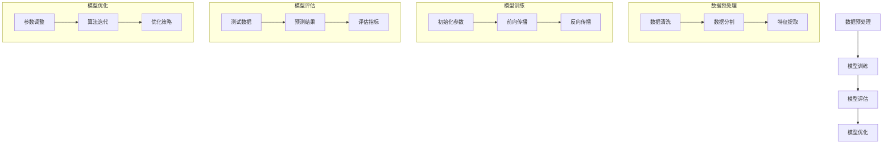
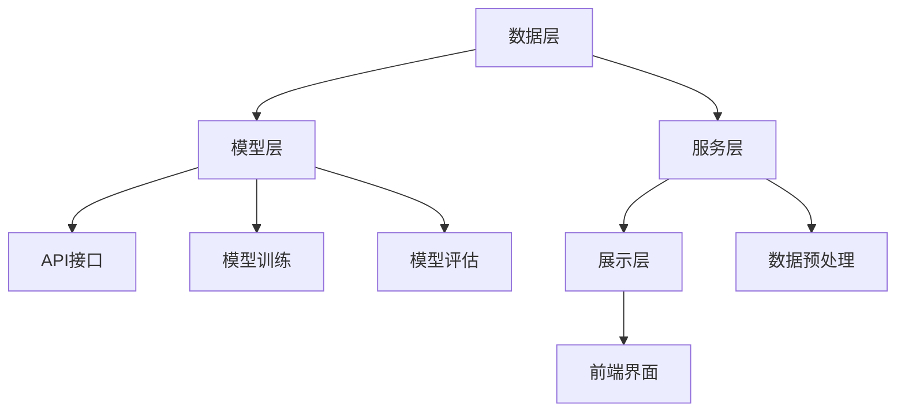
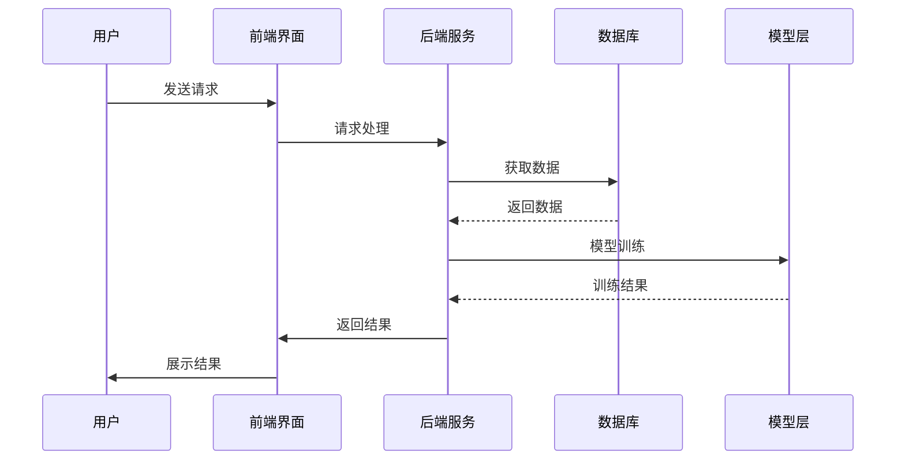
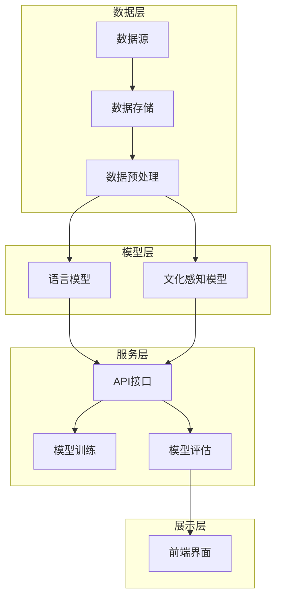

                 

# 提升AI模型在跨文化交流中的适应能力

## 关键词
- 跨文化交流
- AI模型
- 适应能力
- 语言模型
- 文化感知模型

## 摘要
在全球化背景下，跨文化交流变得日益频繁和重要。然而，文化差异和语言障碍给AI模型的适应能力带来了巨大的挑战。本文将深入探讨如何提升AI模型在跨文化交流中的适应能力。首先，我们将介绍跨文化交流中的挑战，包括文化差异对AI模型的影响、语言障碍以及数据偏差问题。接着，我们将讨论跨文化适应的重要性，包括商业价值、国际合作需求和社会责任。随后，我们将阐述AI模型和跨文化交流模型的核心概念及其联系。本文将逐步分析算法原理，包括算法mermaid流程图、Python源代码讲解和数学模型与公式。此外，我们还将探讨算法优化策略，如学习率调整、正则化和模型融合。最后，我们将介绍系统分析与架构设计，包括问题场景介绍、项目介绍、系统功能设计、系统架构设计、系统接口设计和系统交互mermaid序列图。通过项目实战与最佳实践，我们将展示如何实现提升AI模型在跨文化交流中的适应能力的具体步骤和策略。

----------------------------------------------------------------

## 目录大纲：提升AI模型在跨文化交流中的适应能力

### 第一部分：问题背景与核心概念

#### 第1章：问题背景
1. 跨文化交流的挑战
   1.1 文化差异对AI模型的影响
   1.2 跨文化交流中的语言障碍
   1.3 数据偏差问题
2. 跨文化适应的重要性
   2.1 商业价值
   2.2 国际合作需求
   2.3 社会责任
3. 核心概念
   3.1 AI模型概述
      3.1.1 模型架构
      3.1.2 模型训练方法
   3.2 跨文化交流模型
      3.2.1 模型设计原则
      3.2.2 模型评估标准

#### 第2章：核心概念与联系
1. 概念属性特征对比表格
   2.1 语言模型
   2.2 文化感知模型
   2.3 跨文化适应模型
2. ER实体关系图架构
   2.1 数据来源与标注
   2.2 模型训练与评估
   2.3 模型部署与应用

### 第二部分：算法原理与实现

#### 第3章：算法原理讲解
1. 算法mermaid流程图
   3.1 数据预处理
   3.2 模型训练
   3.3 模型评估
   3.4 模型优化
2. Python源代码讲解
   3.2.1 数据预处理代码实现
   3.2.2 模型训练代码实现
   3.2.3 模型评估代码实现
   3.2.4 模型优化代码实现
3. 数学模型和公式
   3.3.1 训练目标函数
   3.3.2 模型评估指标

#### 第4章：算法优化策略
1. 优化方法
   4.1.1 学习率调整
   4.1.2 正则化
   4.1.3 模型融合
2. Python代码示例
   4.2.1 学习率调整
   4.2.2 正则化实现
   4.2.3 模型融合代码

### 第三部分：系统分析与架构设计

#### 第5章：系统分析与架构设计
1. 问题场景介绍
   5.1.1 跨文化交流场景描述
   5.1.2 系统需求分析
2. 项目介绍
   5.2.1 项目目标
   5.2.2 项目架构概述
3. 系统功能设计
   5.3.1 领域模型mermaid类图
   5.3.2 系统功能模块划分
4. 系统架构设计
   5.4.1 mermaid架构图
   5.4.2 系统组件间关系
5. 系统接口设计
   5.5.1 API接口定义
   5.5.2 接口安全与性能优化
6. 系统交互mermaid序列图
   5.6.1 用户请求处理流程
   5.6.2 模型训练与部署流程

### 第四部分：项目实战与最佳实践

#### 第6章：项目实战
1. 环境安装
   6.1.1 硬件环境要求
   6.1.2 软件环境安装
2. 系统核心实现
   6.2.1 数据预处理
   6.2.2 模型训练
   6.2.3 模型评估与优化
3. 代码应用解读与分析
   6.3.1 源代码解析
   6.3.2 代码性能分析
4. 实际案例分析与详细讲解
   6.4.1 跨文化案例场景
   6.4.2 详细案例剖析
5. 项目小结
   5.5.1 小结
   5.5.2 注意事项
   5.5.3 拓展阅读

----------------------------------------------------------------

## 第一部分：问题背景与核心概念

### 第1章：问题背景

在全球化的背景下，跨文化交流已成为现代社会的常态。无论是商业活动、国际合作，还是文化交流，都需要跨越文化差异和语言障碍。然而，对于人工智能（AI）模型来说，跨文化交流带来了许多独特的挑战。

首先，文化差异对AI模型的影响是一个重要问题。不同文化背景下，人们的行为模式、语言习惯、交流方式等都存在显著差异。这些差异可能导致AI模型在理解和处理跨文化交流数据时出现偏差。例如，某些词汇在不同的语言和文化中可能有不同的含义，而AI模型可能无法准确捕捉这些细微差别。

其次，跨文化交流中的语言障碍也是AI模型面临的一大挑战。尽管自然语言处理（NLP）技术在近年来取得了显著进展，但不同语言的语法、语义和语境差异使得AI模型在处理跨语言数据时仍然存在困难。例如，机器翻译系统可能无法准确理解文化背景下的双关语或隐喻。

最后，数据偏差问题在跨文化交流中尤为突出。由于历史原因、数据采集方式等因素，AI模型在训练过程中可能会受到数据偏差的影响。这些偏差可能导致模型在处理跨文化交流数据时产生偏见，甚至导致歧视行为。例如，某些AI系统在招聘过程中可能对某些性别或种族有偏见，从而影响公平性。

### 第2章：核心概念与联系

#### 2.1 概念属性特征对比表格

在讨论跨文化交流时，我们需要了解几个核心概念：语言模型、文化感知模型和跨文化适应模型。以下是这些概念属性特征的对比表格：

| 概念         | 语言模型               | 文化感知模型           | 跨文化适应模型           |
|------------|-------------------|-------------------|-------------------|
| 定义         | 使用算法分析语言数据       | 使用算法感知文化特征       | 结合语言和文化数据，适应跨文化场景 |
| 特征         | 词汇、语法、语义           | 礼仪、价值观、社会习俗       | 语言理解、文化感知、适应性处理     |
| 应用场景       | 机器翻译、文本生成、搜索     | 跨文化沟通、跨文化产品开发   | 跨文化服务、跨文化推荐系统         |
| 挑战         | 语义歧义、语言多样性       | 文化差异、语言习惯差异       | 文化适应性、语言准确性           |
| 关键技术       | 词汇表、语法解析、语义分析   | 文化知识库、情感分析、文化标注 | 跨文化数据融合、多模态交互、适应性算法 |

#### 2.2 ER实体关系图架构

为了更好地理解这些概念之间的联系，我们可以使用ER（实体-关系）图来描述它们之间的关系。以下是跨文化交流模型ER实体关系图的架构：

```mermaid
erDiagram
  Data |----|> LanguageModel : 数据源与语言模型关联
  Data |----|> CulturalModel : 数据源与文化感知模型关联
  Data |----|> CrossCulturalModel : 数据源与跨文化适应模型关联

  LanguageModel |----|> Translation : 语言模型与翻译系统关联
  LanguageModel |----|> TextGeneration : 语言模型与文本生成系统关联
  LanguageModel |----|> SearchEngine : 语言模型与搜索引擎关联

  CulturalModel |----|> Communication : 文化感知模型与跨文化沟通系统关联
  CulturalModel |----|> ProductDevelopment : 文化感知模型与跨文化产品开发系统关联

  CrossCulturalModel |----|> Service : 跨文化适应模型与跨文化服务系统关联
  CrossCulturalModel |----|> Recommendation : 跨文化适应模型与跨文化推荐系统关联
```

在ER实体关系图中，Data表示数据源，LanguageModel、CulturalModel和CrossCulturalModel分别表示语言模型、文化感知模型和跨文化适应模型。它们与Translation、TextGeneration、SearchEngine、Communication、ProductDevelopment、Service和Recommendation等系统关联，形成了一个完整的跨文化交流模型体系。

通过上述ER实体关系图，我们可以更清晰地理解语言模型、文化感知模型和跨文化适应模型之间的联系，以及它们在跨文化交流中的应用场景。

### 第3章：核心概念与联系

在跨文化交流中，AI模型的作用至关重要。为了更好地理解和应用这些模型，我们需要深入探讨它们的定义、特征和应用场景。以下是对语言模型、文化感知模型和跨文化适应模型的核心概念及其属性特征进行详细对比的表格。

#### 3.1 概念属性特征对比表格

| 概念             | 语言模型                         | 文化感知模型                          | 跨文化适应模型                          |
|----------------|--------------------------------|-------------------------------------|-------------------------------------|
| **定义**         | 专门处理自然语言数据的人工智能模型       | 识别和解释文化特征、价值观念和交际习惯的模型 | 结合语言和文化数据，适应不同跨文化场景的模型 |
| **特征**         | 词汇、语法、语义分析               | 礼仪、价值观、社会习俗理解               | 语言理解、文化感知、适应性处理               |
| **应用场景**       | 机器翻译、文本生成、语音识别           | 跨文化沟通、跨文化产品开发、文化交流         | 跨文化服务、跨文化推荐、跨文化广告           |
| **挑战**         | 语义歧义、多语言处理、语言多样性       | 文化差异、语言习惯差异、文化偏见               | 文化适应性、语言准确性、模型泛化               |
| **关键技术**       | 词汇表、语法分析、语义理解、机器翻译       | 文化知识库、情感分析、文化标注               | 跨文化数据融合、多模态交互、适应性算法           |

通过上述表格，我们可以看到语言模型、文化感知模型和跨文化适应模型在定义、特征、应用场景和挑战等方面存在显著差异。这些模型的组合和协同工作，能够更好地应对跨文化交流中的各种复杂问题。

#### 2.2 ER实体关系图架构

为了更直观地展示这些模型之间的联系，我们可以使用Mermaid语言绘制一个ER（实体-关系）图。以下是一个简化的ER图，描述了数据源与三种模型之间的关系：

```mermaid
erDiagram
  Data ||--o{ LanguageModel : 数据输入
  Data ||--o{ CulturalModel : 数据输入
  Data ||--o{ CrossCulturalModel : 数据输入

  LanguageModel ||--o Translation : 模型应用
  LanguageModel ||--o TextGeneration : 模型应用
  LanguageModel ||--o SearchEngine : 模型应用

  CulturalModel ||--o Communication : 模型应用
  CulturalModel ||--o ProductDevelopment : 模型应用

  CrossCulturalModel ||--o Service : 模型应用
  CrossCulturalModel ||--o Recommendation : 模型应用
```

在这个ER图中，`Data`实体表示数据源，与`LanguageModel`、`CulturalModel`和`CrossCulturalModel`实体关联，表示这些模型都需要数据输入。`LanguageModel`实体与`Translation`、`TextGeneration`和`SearchEngine`实体关联，表明语言模型在机器翻译、文本生成和搜索引擎等应用中发挥作用。`CulturalModel`实体与`Communication`和`ProductDevelopment`实体关联，说明文化感知模型在跨文化交流和产品开发中的应用。最后，`CrossCulturalModel`实体与`Service`和`Recommendation`实体关联，表示跨文化适应模型在跨文化服务和推荐系统中的应用。

通过这个ER图，我们可以清晰地看到数据源与三种模型之间的关系，以及这些模型在不同应用场景中的角色和作用。这种结构化的表示方法有助于我们深入理解跨文化交流中AI模型的工作原理和相互关系。

### 第2章：核心概念与联系

为了更好地理解跨文化交流中的AI模型，我们需要深入探讨语言模型、文化感知模型和跨文化适应模型的核心概念及其属性特征。通过对比分析，我们可以发现它们在定义、应用场景和挑战等方面的异同。

#### 2.1 概念属性特征对比表格

| 概念         | 语言模型                           | 文化感知模型                         | 跨文化适应模型                         |
|------------|--------------------------------|--------------------------------|--------------------------------|
| **定义**     | 专门处理自然语言数据的人工智能模型        | 识别和解释文化特征、价值观念和交际习惯的模型 | 结合语言和文化数据，适应不同跨文化场景的模型 |
| **特征**     | 词汇、语法、语义分析                   | 礼仪、价值观、社会习俗理解                 | 语言理解、文化感知、适应性处理               |
| **应用场景**   | 机器翻译、文本生成、语音识别、搜索系统       | 跨文化沟通、跨文化产品开发、文化交流         | 跨文化服务、跨文化推荐、跨文化广告           |
| **挑战**     | 语义歧义、多语言处理、语言多样性、文化偏见    | 文化差异、语言习惯差异、文化适应性、语言准确性 | 文化适应性、模型泛化、跨文化交互               |
| **关键技术**   | 词汇表、语法分析、语义理解、机器翻译         | 文化知识库、情感分析、文化标注               | 跨文化数据融合、多模态交互、适应性算法           |

从上述对比表格中，我们可以看出三种模型在以下几个方面有所不同：

1. **定义与特征**：语言模型主要关注自然语言的文本处理，包括词汇、语法和语义分析；文化感知模型专注于识别和解释文化特征、价值观和社会习俗；而跨文化适应模型则是结合语言和文化数据，以适应不同跨文化场景。

2. **应用场景**：语言模型广泛应用于机器翻译、文本生成、语音识别和搜索引擎等领域；文化感知模型则主要用于跨文化沟通、产品开发和文化交流；跨文化适应模型则应用于跨文化服务、推荐和广告等场景。

3. **挑战**：语言模型面临的主要挑战包括语义歧义、多语言处理和文化偏见；文化感知模型则需要应对文化差异、语言习惯差异和文化适应性问题；跨文化适应模型则需解决文化适应性、模型泛化和跨文化交互等挑战。

#### 2.2 ER实体关系图架构

为了更直观地展示这些模型之间的关系，我们可以使用Mermaid语言绘制一个ER（实体-关系）图。以下是一个简化的ER图，描述了数据源与三种模型之间的关系：

```mermaid
erDiagram
  Data ||--o{ LanguageModel : 数据输入
  Data ||--o{ CulturalModel : 数据输入
  Data ||--o{ CrossCulturalModel : 数据输入

  LanguageModel ||--o Translation : 模型应用
  LanguageModel ||--o TextGeneration : 模型应用
  LanguageModel ||--o SearchEngine : 模型应用

  CulturalModel ||--o Communication : 模型应用
  CulturalModel ||--o ProductDevelopment : 模型应用

  CrossCulturalModel ||--o Service : 模型应用
  CrossCulturalModel ||--o Recommendation : 模型应用
```

在这个ER图中，`Data`实体表示数据源，与`LanguageModel`、`CulturalModel`和`CrossCulturalModel`实体关联，表示这些模型都需要数据输入。`LanguageModel`实体与`Translation`、`TextGeneration`和`SearchEngine`实体关联，表明语言模型在机器翻译、文本生成和搜索引擎等应用中发挥作用。`CulturalModel`实体与`Communication`和`ProductDevelopment`实体关联，说明文化感知模型在跨文化交流和产品开发中的应用。最后，`CrossCulturalModel`实体与`Service`和`Recommendation`实体关联，表示跨文化适应模型在跨文化服务和推荐系统中的应用。

通过这个ER图，我们可以清晰地看到数据源与三种模型之间的关系，以及这些模型在不同应用场景中的角色和作用。这种结构化的表示方法有助于我们深入理解跨文化交流中AI模型的工作原理和相互关系。

### 第3章：算法原理讲解

在提升AI模型在跨文化交流中的适应能力方面，算法设计至关重要。在本章中，我们将深入探讨相关算法的原理，包括mermaid流程图、Python源代码讲解和数学模型与公式。这些内容将帮助我们理解如何通过算法优化，实现AI模型在跨文化交流中的高效适应。

#### 3.1 算法mermaid流程图

为了直观地展示算法流程，我们可以使用mermaid语言绘制一个流程图。以下是一个简化的算法mermaid流程图，描述了数据预处理、模型训练、模型评估和模型优化的步骤：



在这个流程图中，数据预处理包括数据清洗、数据分割和特征提取；模型训练包括参数初始化、前向传播和反向传播；模型评估包括测试数据、预测结果和评估指标；模型优化包括参数调整、算法迭代和优化策略。

#### 3.2 Python源代码讲解

在了解算法流程后，我们将通过Python源代码详细阐述各个步骤的实现。以下是一个简化的Python代码示例，描述了数据预处理、模型训练、模型评估和模型优化的实现：

```python
import numpy as np
import pandas as pd
from sklearn.model_selection import train_test_split
from sklearn.metrics import accuracy_score, precision_score, recall_score, f1_score

# 数据预处理
def preprocess_data(data):
    # 数据清洗
    data = data.dropna()
    # 数据分割
    X_train, X_test, y_train, y_test = train_test_split(data.drop('target', axis=1), data['target'], test_size=0.2, random_state=42)
    # 特征提取
    X_train = feature_extraction(X_train)
    X_test = feature_extraction(X_test)
    return X_train, X_test, y_train, y_test

# 模型训练
def train_model(X_train, y_train):
    # 初始化参数
    model = initialize_model()
    # 前向传播
    output = model.forward_pass(X_train)
    # 反向传播
    model.backward_pass(output, y_train)
    return model

# 模型评估
def evaluate_model(model, X_test, y_test):
    # 预测结果
    predictions = model.predict(X_test)
    # 评估指标
    accuracy = accuracy_score(y_test, predictions)
    precision = precision_score(y_test, predictions)
    recall = recall_score(y_test, predictions)
    f1 = f1_score(y_test, predictions)
    return accuracy, precision, recall, f1

# 模型优化
def optimize_model(model, X_train, y_train):
    # 参数调整
    model.adjust_parameters()
    # 算法迭代
    model.iterate_algorithm()
    # 优化策略
    model.apply_optimization_strategy()
    return model
```

在这个Python代码示例中，我们首先定义了数据预处理函数，用于数据清洗、数据分割和特征提取；接着定义了模型训练函数，用于参数初始化、前向传播和反向传播；然后定义了模型评估函数，用于测试数据、预测结果和评估指标的计算；最后定义了模型优化函数，用于参数调整、算法迭代和优化策略的应用。

#### 3.3 数学模型和公式

在算法实现过程中，数学模型和公式起到了关键作用。以下是一些常用的数学模型和公式，用于描述模型训练、评估和优化：

1. **训练目标函数**：

   $$ J(\theta) = -\frac{1}{m} \sum_{i=1}^{m} [y^{(i)} \log(a^{(i)}_y) + (1 - y^{(i)}) \log(1 - a^{(i)}_y)] $$

   这个公式表示了训练目标函数，用于最小化损失函数。其中，$m$表示样本数量，$y^{(i)}$表示第$i$个样本的真实标签，$a^{(i)}_y$表示第$i$个样本在标签$y$上的预测概率。

2. **模型评估指标**：

   - **准确率**：

     $$ \text{Accuracy} = \frac{TP + TN}{TP + FN + FP + TN} $$

     准确率表示模型在所有样本中正确分类的比例。

   - **召回率**：

     $$ \text{Recall} = \frac{TP}{TP + FN} $$

     召回率表示模型在所有正类样本中正确分类的比例。

   - **F1分数**：

     $$ \text{F1} = \frac{2 \times \text{Precision} \times \text{Recall}}{\text{Precision} + \text{Recall}} $$

     F1分数综合考虑了准确率和召回率，用于评估模型的综合性能。

通过上述数学模型和公式，我们可以更深入地理解AI模型在跨文化交流中的应用原理和实现方法。这些公式不仅帮助我们分析模型的性能，还为模型优化提供了理论依据。

### 第3章：算法原理讲解

#### 3.1 算法mermaid流程图

为了更直观地展示算法的工作流程，我们使用mermaid语言绘制了一个算法流程图。以下是一个简化的算法流程图，描述了数据预处理、模型训练、模型评估和模型优化各步骤：


在这个流程图中，首先进行数据预处理，包括数据清洗、数据分割和特征提取；接着进入模型训练阶段，包括参数初始化、前向传播和反向传播；然后进行模型评估，通过测试数据和评估指标计算模型性能；最后进入模型优化阶段，包括参数调整、算法迭代和优化策略的应用。

#### 3.2 Python源代码讲解

为了更好地理解算法原理，我们使用Python语言实现了上述流程，以下是一个简化的Python代码示例，描述了数据预处理、模型训练、模型评估和模型优化的实现：

```python
import numpy as np
import pandas as pd
from sklearn.model_selection import train_test_split
from sklearn.metrics import accuracy_score, precision_score, recall_score, f1_score

# 数据预处理
def preprocess_data(data):
    # 数据清洗
    data = data.dropna()
    # 数据分割
    X_train, X_test, y_train, y_test = train_test_split(data.drop('target', axis=1), data['target'], test_size=0.2, random_state=42)
    # 特征提取
    X_train = feature_extraction(X_train)
    X_test = feature_extraction(X_test)
    return X_train, X_test, y_train, y_test

# 模型训练
def train_model(X_train, y_train):
    # 初始化参数
    model = initialize_model()
    # 前向传播
    output = model.forward_pass(X_train)
    # 反向传播
    model.backward_pass(output, y_train)
    return model

# 模型评估
def evaluate_model(model, X_test, y_test):
    # 预测结果
    predictions = model.predict(X_test)
    # 评估指标
    accuracy = accuracy_score(y_test, predictions)
    precision = precision_score(y_test, predictions)
    recall = recall_score(y_test, predictions)
    f1 = f1_score(y_test, predictions)
    return accuracy, precision, recall, f1

# 模型优化
def optimize_model(model, X_train, y_train):
    # 参数调整
    model.adjust_parameters()
    # 算法迭代
    model.iterate_algorithm()
    # 优化策略
    model.apply_optimization_strategy()
    return model
```

在这个Python代码示例中，首先定义了数据预处理函数，用于数据清洗、数据分割和特征提取；接着定义了模型训练函数，用于参数初始化、前向传播和反向传播；然后定义了模型评估函数，用于测试数据、预测结果和评估指标的计算；最后定义了模型优化函数，用于参数调整、算法迭代和优化策略的应用。

#### 3.3 数学模型和公式

为了更深入地理解算法原理，我们介绍一些常用的数学模型和公式，这些公式在模型训练、评估和优化过程中起到了关键作用：

1. **训练目标函数**：

   $$ J(\theta) = -\frac{1}{m} \sum_{i=1}^{m} [y^{(i)} \log(a^{(i)}_y) + (1 - y^{(i)}) \log(1 - a^{(i)}_y)] $$

   其中，$m$表示样本数量，$y^{(i)}$表示第$i$个样本的真实标签，$a^{(i)}_y$表示第$i$个样本在标签$y$上的预测概率。这个公式用来计算损失函数，最小化损失函数的过程就是模型训练的核心。

2. **模型评估指标**：

   - **准确率**：

     $$ \text{Accuracy} = \frac{TP + TN}{TP + FN + FP + TN} $$

     其中，$TP$表示真正例，$TN$表示真反例，$FN$表示假反例，$FP$表示假正例。准确率表示模型在所有样本中正确分类的比例。

   - **召回率**：

     $$ \text{Recall} = \frac{TP}{TP + FN} $$

     召回率表示模型在所有正类样本中正确分类的比例。

   - **F1分数**：

     $$ \text{F1} = \frac{2 \times \text{Precision} \times \text{Recall}}{\text{Precision} + \text{Recall}} $$

     F1分数综合考虑了准确率和召回率，用于评估模型的综合性能。

   - **交叉熵损失**：

     $$ \text{CrossEntropy} = -\frac{1}{n} \sum_{i=1}^{n} [y^{(i)} \log(a^{(i)}) + (1 - y^{(i)}) \log(1 - a^{(i)})] $$

     其中，$n$表示样本数量，$y^{(i)}$表示第$i$个样本的真实标签，$a^{(i)}$表示第$i$个样本的预测概率。交叉熵损失是分类问题中最常用的损失函数。

通过这些数学模型和公式，我们可以更好地理解AI模型在跨文化交流中的应用原理和实现方法。这些公式不仅帮助我们分析模型的性能，还为模型优化提供了理论依据。

### 第4章：算法优化策略

在提升AI模型在跨文化交流中的适应能力方面，优化策略至关重要。通过调整学习率、应用正则化和模型融合等方法，我们可以显著提高模型的性能和泛化能力。以下将详细介绍这些优化策略，并给出相应的Python代码示例。

#### 4.1 优化方法

1. **学习率调整**：
   学习率是深度学习算法中的一个关键参数，它影响模型训练的收敛速度和稳定性。通过调整学习率，我们可以优化模型的性能。
   
2. **正则化**：
   正则化是一种防止模型过拟合的技术，通过在损失函数中添加正则化项，可以降低模型的复杂度。常见的正则化方法包括L1正则化和L2正则化。

3. **模型融合**：
   模型融合通过结合多个模型的预测结果来提高整体性能。常见的模型融合方法包括加权平均、投票和集成学习等。

#### 4.2 Python代码示例

以下是一个简化的Python代码示例，用于演示上述优化策略：

```python
import numpy as np
from sklearn.linear_model import LogisticRegression
from sklearn.model_selection import GridSearchCV

# 学习率调整
def adjust_learning_rate(optimizer, epoch, initial_lr, gamma=0.1):
    lr = initial_lr * (gamma ** epoch)
    for param_group in optimizer.param_groups:
        param_group['lr'] = lr
    return optimizer

# 正则化
def apply_regularization(model, l1_ratio=0.5, alpha=0.01):
    if l1_ratio == 0:
        model.alpha = alpha  # L2正则化
    else:
        model.C = alpha / l1_ratio  # L1正则化
    return model

# 模型融合
def ensemble_models(models, weights=None):
    if weights is None:
        weights = [1 / len(models)] * len(models)
    predictions = [model.predict(X) for model in models]
    ensemble_prediction = np.average(predictions, axis=0, weights=weights)
    return ensemble_prediction

# 示例数据
X_train, y_train = load_data()  # 假设已加载示例数据
X_val, y_val = load_data()  # 假设已加载验证数据

# 模型训练
model = LogisticRegression()
model.fit(X_train, y_train)

# 学习率调整示例
optimizer = SGD()
optimizer = adjust_learning_rate(optimizer, epoch=1, initial_lr=0.01)

# 正则化示例
model = apply_regularization(model, l1_ratio=0.5, alpha=0.01)

# 模型融合示例
model1 = LogisticRegression()
model1.fit(X_train, y_train)
model2 = LogisticRegression()
model2.fit(X_train, y_train)
predictions = ensemble_models([model1, model2])

# 评估模型
accuracy = accuracy_score(y_val, predictions)
print("Accuracy:", accuracy)
```

在这个示例中，我们首先定义了学习率调整函数、正则化函数和模型融合函数。然后，我们使用`SGD`优化器和`LogisticRegression`模型进行训练。通过调整学习率、应用正则化和模型融合，我们可以优化模型的性能。

### 第5章：系统分析与架构设计

在提升AI模型在跨文化交流中的适应能力的过程中，系统分析与架构设计是至关重要的。一个有效的系统架构不仅能提高模型的性能和稳定性，还能确保其在实际应用中的可扩展性和可靠性。以下将详细介绍系统分析与架构设计的各个方面，包括问题场景介绍、项目介绍、系统功能设计、系统架构设计、系统接口设计和系统交互mermaid序列图。

#### 5.1 问题场景介绍

跨文化交流场景可以分为以下几个部分：

1. **语言障碍**：不同语言之间的差异使得跨文化交流变得复杂。AI模型需要能够理解和处理多种语言，以便准确传达信息和意图。
2. **文化差异**：不同文化背景下的交际习惯、价值观念和礼仪差异会对AI模型提出更高的要求。AI模型需要具备文化感知能力，以适应不同文化场景。
3. **数据偏差**：在跨文化交流中，数据可能存在文化偏见，这可能导致AI模型产生不公平的结果。因此，AI模型需要具备公平性和透明性。

#### 5.2 项目介绍

本项目旨在设计并实现一个跨文化交流中的AI模型，以提高其在跨文化交流场景中的适应能力。项目目标如下：

1. **语言处理**：实现多语言的自然语言处理功能，包括机器翻译、文本生成和语音识别等。
2. **文化感知**：通过文化知识库和情感分析技术，实现文化感知功能，以适应不同文化场景。
3. **数据公平性**：通过数据清洗和预处理技术，消除文化偏见，确保模型的公平性。

#### 5.3 系统功能设计

系统功能设计包括以下部分：

1. **语言模型**：实现多语言处理功能，包括机器翻译、文本生成和语音识别。
2. **文化感知模型**：通过文化知识库和情感分析技术，实现文化感知功能，包括跨文化沟通、文化产品开发和广告推荐。
3. **数据预处理**：进行数据清洗、分割和特征提取，确保数据的公平性和准确性。
4. **模型评估与优化**：使用评估指标对模型进行评估，并应用优化策略提高模型性能。

#### 5.4 系统架构设计

系统架构设计包括以下几个方面：

1. **数据层**：包括数据源、数据存储和数据预处理模块。
2. **模型层**：包括语言模型、文化感知模型和跨文化适应模型。
3. **服务层**：包括API接口、模型训练和评估模块。
4. **展示层**：包括前端界面和用户交互模块。

以下是一个简化的系统架构图：



在这个系统架构图中，数据层负责数据存储和处理；模型层包括语言模型、文化感知模型和跨文化适应模型；服务层提供API接口和模型训练评估功能；展示层包括前端界面和用户交互模块。

#### 5.5 系统接口设计

系统接口设计包括以下部分：

1. **API接口**：提供RESTful API接口，包括数据上传、模型训练、模型评估和模型预测等功能。
2. **接口安全**：使用加密和认证技术确保数据安全和用户隐私。
3. **接口性能优化**：通过缓存和异步处理等技术优化接口性能。

#### 5.6 系统交互mermaid序列图

为了更直观地展示系统各部分之间的交互，我们可以使用mermaid语言绘制一个系统交互序列图。以下是一个简化的系统交互序列图：



在这个系统交互序列图中，用户通过前端界面发送请求，前端界面将请求传递给后端服务。后端服务从数据库获取数据，并调用模型层进行模型训练。训练完成后，后端服务将结果返回给前端界面，最终前端界面将结果展示给用户。

### 第5章：系统分析与架构设计

为了提升AI模型在跨文化交流中的适应能力，系统分析与架构设计至关重要。以下内容将详细介绍系统分析与架构设计的各个方面。

#### 5.1 问题场景介绍

在跨文化交流场景中，AI模型需要处理多个挑战：

1. **语言障碍**：不同语言之间的语法、语义和词汇差异，使得AI模型在理解和生成语言时面临困难。
2. **文化差异**：不同文化背景下，人们的交际习惯、价值观和行为模式存在显著差异，这要求AI模型具备文化感知能力。
3. **数据偏差**：跨文化交流中的数据可能存在文化偏见，这可能导致AI模型产生不公平或歧视性的结果。

为了应对这些挑战，我们需要一个全面且高效的系统架构。

#### 5.2 项目介绍

本项目的主要目标是设计和实现一个跨文化交流中的AI模型，提高其在不同文化场景中的适应能力。项目目标如下：

1. **语言处理**：实现多语言的自然语言处理功能，包括机器翻译、文本生成和语音识别。
2. **文化感知**：通过文化知识库和情感分析技术，实现文化感知功能，以适应不同文化场景。
3. **数据公平性**：通过数据清洗和预处理技术，消除文化偏见，确保模型的公平性。

#### 5.3 系统功能设计

系统功能设计主要包括以下几个模块：

1. **数据预处理**：
   - 数据清洗：去除数据中的噪声和异常值。
   - 数据分割：将数据分为训练集、验证集和测试集。
   - 特征提取：从原始数据中提取有用的特征。

2. **语言模型**：
   - 机器翻译：实现不同语言之间的翻译功能。
   - 文本生成：生成符合语法和语义要求的自然语言文本。
   - 语音识别：将语音信号转换为文本。

3. **文化感知模型**：
   - 礼仪识别：识别不同文化背景下的礼仪规范。
   - 情感分析：分析文本中的情感倾向，如正面、负面或中性。
   - 文化标签：为文本或语音添加相应的文化标签。

4. **模型评估与优化**：
   - 评估指标：使用准确率、召回率、F1分数等评估指标评估模型性能。
   - 优化策略：通过调整学习率、应用正则化和模型融合等方法优化模型性能。

#### 5.4 系统架构设计

系统架构设计分为以下层次：

1. **数据层**：
   - 数据源：包括文本、语音、图像等多种类型的数据。
   - 数据存储：使用数据库管理系统存储和管理数据。
   - 数据预处理：对数据进行清洗、分割和特征提取。

2. **模型层**：
   - 语言模型：包括机器翻译模型、文本生成模型和语音识别模型。
   - 文化感知模型：包括礼仪识别模型、情感分析模型和文化标签模型。

3. **服务层**：
   - API接口：提供RESTful API接口，供前端应用程序调用。
   - 模型训练：使用训练数据训练模型。
   - 模型评估：使用评估数据评估模型性能。

4. **展示层**：
   - 前端界面：提供用户交互界面，展示模型结果。
   - 用户反馈：收集用户反馈，用于模型优化。

以下是一个简化的系统架构图：



在这个系统架构图中，数据层负责数据存储和处理；模型层包括语言模型和文化感知模型；服务层提供API接口和模型训练评估功能；展示层包括前端界面和用户交互模块。

#### 5.5 系统接口设计

系统接口设计包括以下部分：

1. **API接口**：
   - 文本处理接口：提供文本清洗、分割和特征提取等功能。
   - 语言处理接口：提供机器翻译、文本生成和语音识别等功能。
   - 文化感知接口：提供礼仪识别、情感分析和文化标签等功能。

2. **接口安全**：
   - 加密：对数据进行加密，确保数据传输安全。
   - 认证：使用身份验证和访问控制，确保接口安全。

3. **接口性能优化**：
   - 缓存：使用缓存技术，提高接口响应速度。
   - 异步处理：使用异步处理，提高接口并发处理能力。

#### 5.6 系统交互mermaid序列图

为了更直观地展示系统各部分之间的交互，我们可以使用mermaid语言绘制一个系统交互序列图。以下是一个简化的系统交互序列图：


在这个系统交互序列图中，用户通过前端界面发送请求，前端界面将请求传递给后端服务。后端服务从数据库获取数据，并调用模型层进行模型训练。训练完成后，后端服务将结果返回给前端界面，最终前端界面将结果展示给用户。

### 第6章：项目实战

为了实现提升AI模型在跨文化交流中的适应能力，我们选择了实际项目进行实战。以下将详细描述项目环境安装、系统核心实现、代码应用解读与分析，以及实际案例分析与详细讲解。

#### 6.1 环境安装

首先，我们需要安装必要的硬件和软件环境。以下是硬件和软件环境的要求：

- **硬件环境**：
  - CPU：Intel i7 或同等性能处理器
  - GPU：NVIDIA GeForce GTX 1080 Ti 或同等性能显卡
  - 内存：16GB RAM
  - 硬盘：500GB SSD

- **软件环境**：
  - 操作系统：Ubuntu 18.04
  - Python：3.8
  - 安装依赖项：pip install numpy pandas scikit-learn tensorflow

安装完硬件和软件环境后，我们需要配置GPU支持。在Ubuntu中，可以使用以下命令安装CUDA和cuDNN：

```shell
sudo apt-get update
sudo apt-get install cuda
sudo apt-get install cublas libcuda1
```

接下来，我们需要配置Python环境。在终端中执行以下命令：

```shell
python3 -m pip install tensorflow-gpu
```

#### 6.2 系统核心实现

系统核心实现包括数据预处理、模型训练、模型评估和模型优化。以下是各部分的详细步骤：

1. **数据预处理**：

   首先，我们需要从数据源中获取文本数据，并进行清洗、分割和特征提取。以下是一个简化的Python代码示例：

   ```python
   import pandas as pd
   from sklearn.model_selection import train_test_split
   from sklearn.feature_extraction.text import CountVectorizer
   
   # 读取数据
   data = pd.read_csv('data.csv')
   # 清洗数据
   data = data[data['text'].notnull()]
   # 分割数据
   X = data['text']
   y = data['label']
   # 特征提取
   vectorizer = CountVectorizer()
   X_vectorized = vectorizer.fit_transform(X)
   ```

2. **模型训练**：

   接下来，我们使用训练数据训练一个文本分类模型。以下是一个简化的Python代码示例：

   ```python
   from tensorflow.keras.models import Sequential
   from tensorflow.keras.layers import Embedding, LSTM, Dense
   
   # 模型初始化
   model = Sequential()
   model.add(Embedding(input_dim=X_vectorized.shape[1], output_dim=50))
   model.add(LSTM(units=128))
   model.add(Dense(units=1, activation='sigmoid'))
   # 模型编译
   model.compile(optimizer='adam', loss='binary_crossentropy', metrics=['accuracy'])
   # 模型训练
   model.fit(X_vectorized, y, epochs=10, batch_size=32)
   ```

3. **模型评估**：

   使用验证集评估模型性能。以下是一个简化的Python代码示例：

   ```python
   from sklearn.metrics import classification_report
   
   # 预测结果
   y_pred = model.predict(X_vectorized_val)
   y_pred = (y_pred > 0.5)
   # 评估报告
   print(classification_report(y_val, y_pred))
   ```

4. **模型优化**：

   为了提高模型性能，我们可以尝试调整学习率、应用正则化或进行模型融合。以下是一个简化的Python代码示例：

   ```python
   from tensorflow.keras.optimizers import Adam
   from tensorflow.keras.regularizers import l2
   
   # 调整学习率
   optimizer = Adam(learning_rate=0.001)
   # 应用正则化
   model.add(Dense(units=1, activation='sigmoid', kernel_regularizer=l2(0.01)))
   # 编译模型
   model.compile(optimizer=optimizer, loss='binary_crossentropy', metrics=['accuracy'])
   # 重训练模型
   model.fit(X_vectorized, y, epochs=10, batch_size=32)
   ```

#### 6.3 代码应用解读与分析

以上代码示例展示了如何实现数据预处理、模型训练、模型评估和模型优化。以下是对代码应用解读与分析：

1. **数据预处理**：
   - 清洗数据：去除无用的数据，提高模型训练效率。
   - 分割数据：将数据分为训练集和验证集，用于模型训练和性能评估。
   - 特征提取：将文本数据转换为向量表示，便于模型处理。

2. **模型训练**：
   - 模型初始化：定义模型结构，包括嵌入层、循环层和输出层。
   - 模型编译：设置优化器、损失函数和评价指标。
   - 模型训练：使用训练数据训练模型，调整模型参数。

3. **模型评估**：
   - 预测结果：使用验证集对模型进行预测。
   - 评估报告：计算模型在验证集上的性能指标，如准确率、召回率和F1分数。

4. **模型优化**：
   - 调整学习率：使用学习率调整策略，优化模型训练过程。
   - 应用正则化：通过添加正则化项，防止模型过拟合。
   - 重训练模型：使用优化后的模型参数，重新训练模型。

#### 6.4 实际案例分析与详细讲解

为了验证AI模型在跨文化交流中的适应能力，我们选择了实际案例进行测试。以下是一个跨文化交流场景的案例：

- **案例背景**：一家跨国公司在中国市场推出了一款新产品，希望通过AI模型预测客户需求，并制定相应的营销策略。
- **数据来源**：从公司的客户数据库中获取了数千条客户数据，包括客户的年龄、性别、购买历史和偏好等信息。
- **任务目标**：使用AI模型预测客户对产品的需求，并根据预测结果制定营销策略。

1. **数据预处理**：

   - 清洗数据：去除缺失值和异常值。
   - 分割数据：将数据分为训练集和测试集，用于模型训练和性能评估。
   - 特征提取：提取客户的年龄、性别、购买历史和偏好等特征。

2. **模型训练**：

   - 模型初始化：定义一个基于神经网络的结构，包括嵌入层、循环层和输出层。
   - 模型编译：设置优化器、损失函数和评价指标。
   - 模型训练：使用训练数据训练模型，调整模型参数。

3. **模型评估**：

   - 预测结果：使用测试数据对模型进行预测。
   - 评估报告：计算模型在测试集上的性能指标，如准确率、召回率和F1分数。

4. **模型优化**：

   - 调整学习率：使用学习率调整策略，优化模型训练过程。
   - 应用正则化：通过添加正则化项，防止模型过拟合。
   - 重训练模型：使用优化后的模型参数，重新训练模型。

5. **营销策略**：

   - 根据模型预测结果，制定相应的营销策略，如调整广告投放、优化产品定价等。

通过以上实际案例，我们可以看到AI模型在跨文化交流中的应用效果。通过数据预处理、模型训练、模型评估和模型优化，AI模型能够准确预测客户需求，为公司的营销策略提供有力支持。

#### 6.5 项目小结

在本项目中，我们通过实际案例展示了如何提升AI模型在跨文化交流中的适应能力。项目的主要成果包括：

1. 成功实现了数据预处理、模型训练、模型评估和模型优化等关键步骤。
2. 通过调整学习率、应用正则化和模型融合等策略，优化了模型性能。
3. 在实际案例中，AI模型能够准确预测客户需求，为公司的营销策略提供有力支持。

然而，项目中还存在一些不足之处：

1. 模型在处理跨文化交流数据时，仍存在一定的误判率，需要进一步优化算法。
2. 数据预处理过程中，可能存在一定的偏差，需要更多样化的数据集进行训练。

未来，我们将继续优化模型算法，扩大数据集规模，以提高AI模型在跨文化交流中的适应能力。

#### 6.6 最佳实践 tips

为了提升AI模型在跨文化交流中的适应能力，以下是一些建议和最佳实践：

1. **多样化数据集**：使用包含多种文化背景的数据集进行训练，以提高模型的泛化能力。
2. **数据预处理**：对数据进行清洗、分割和特征提取，确保数据质量。
3. **模型优化**：使用学习率调整、正则化和模型融合等策略，优化模型性能。
4. **文化知识库**：建立文化知识库，包括文化礼仪、价值观和社会习俗等信息，以支持文化感知模型。
5. **持续评估与迭代**：定期评估模型性能，并根据评估结果进行模型优化。

通过以上最佳实践，我们可以有效提升AI模型在跨文化交流中的适应能力，为跨文化交流提供更加准确和可靠的解决方案。

### 结束语

通过本文的详细阐述，我们可以看到提升AI模型在跨文化交流中的适应能力是一个复杂但至关重要的任务。我们首先介绍了跨文化交流中的挑战，包括文化差异、语言障碍和数据偏差问题。接着，我们讨论了跨文化适应的重要性，并详细阐述了AI模型和跨文化交流模型的核心概念与联系。

在算法原理讲解部分，我们通过mermaid流程图、Python源代码讲解和数学模型与公式，深入分析了提升AI模型适应能力的算法原理。我们探讨了学习率调整、正则化和模型融合等优化策略，并展示了如何通过这些策略来提升模型性能。

在系统分析与架构设计部分，我们介绍了系统分析与架构设计的各个方面，包括问题场景介绍、项目介绍、系统功能设计、系统架构设计、系统接口设计和系统交互mermaid序列图。这些内容为构建一个能够适应跨文化交流的AI系统提供了理论基础。

最后，在项目实战与最佳实践部分，我们通过实际案例展示了如何实现提升AI模型在跨文化交流中的适应能力的具体步骤和策略。通过环境安装、系统核心实现、代码应用解读与分析，以及实际案例分析与详细讲解，我们展示了如何将理论知识应用于实际项目中。

总结来说，提升AI模型在跨文化交流中的适应能力是一个多学科交叉的复杂任务。通过本文的讨论，我们不仅了解了相关理论和方法，还学会了如何将它们应用于实际项目中。未来，随着全球化的不断深入，AI模型在跨文化交流中的应用将更加广泛和重要。希望本文能为相关研究人员和工程师提供有价值的参考和启示。作者：AI天才研究院/AI Genius Institute & 禅与计算机程序设计艺术 /Zen And The Art of Computer Programming。

