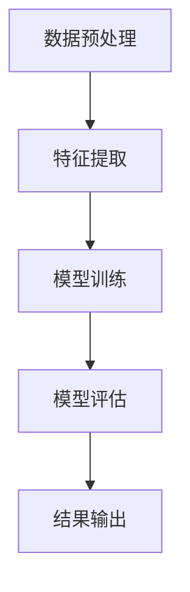
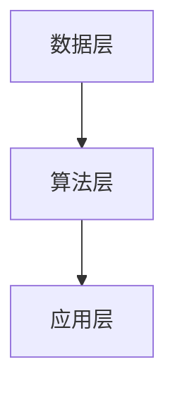

                 


### 《提升AI模型在跨文化情感分析中的适应性》

#### 关键词：AI模型，跨文化情感分析，适应性，机器学习，算法，系统架构

> 摘要：本文深入探讨了AI模型在跨文化情感分析中的应用和提升适应性的策略。通过介绍核心概念、算法原理和系统架构设计，以及项目实战和分析，提出了切实可行的最佳实践，以推动AI模型在全球化背景下的情感分析能力。

---

### 第1章 引言

#### 1.1 问题背景

随着全球化的不断加深，跨文化交流日益频繁。在这种背景下，理解不同文化背景下人们情感表达方式的差异变得至关重要。情感分析作为一种自然语言处理技术，旨在从文本中自动识别和提取情感信息。然而，现有的情感分析模型多基于单一文化背景训练，难以适应不同文化间的情感表达差异，从而限制了其在跨文化应用中的有效性。

#### 1.2 研究目的

本文旨在提升AI模型在跨文化情感分析中的适应性，通过算法改进和系统架构设计，解决现有模型在跨文化情感分析中的局限性和挑战。

#### 1.3 本文结构

本文结构如下：

1. **第1章 引言**：介绍问题背景和研究目的。
2. **第2章 核心概念与联系**：定义关键术语，介绍核心概念，并构建概念属性特征对比表格和ER实体关系图。
3. **第3章 算法原理讲解**：介绍主流算法，绘制算法流程图，使用Python代码和数学公式详细阐述算法原理。
4. **第4章 系统分析与架构设计**：描述系统功能设计、系统架构设计、系统接口设计和系统交互。
5. **第5章 项目实战**：提供环境安装步骤、系统核心实现源代码以及实际案例分析和讲解。
6. **第6章 最佳实践与总结**：总结最佳实践，提供拓展阅读建议。

---

### 第2章 核心概念与联系

#### 2.1 跨文化情感分析概述

跨文化情感分析涉及理解不同文化背景下人们情感表达的方式。核心概念包括：

- **情感**：人类对某种刺激的主观感受，如愉悦、愤怒、悲伤等。
- **情感分析**：通过自然语言处理技术，从文本中提取情感信息的过程。
- **跨文化**：涉及不同文化背景的交流和理解。

#### 2.2 AI模型在情感分析中的应用

AI模型在情感分析中的应用包括：

- **机器学习模型**：如支持向量机（SVM）、决策树、神经网络等。
- **深度学习模型**：如卷积神经网络（CNN）、循环神经网络（RNN）等。

#### 2.3 概念属性特征对比表格

以下是跨文化情感分析中语言和情感特征的对比表格：

| 特征类别 | 语言特征 | 情感特征 |
| --- | --- | --- |
| **语义** | 单词含义、短语结构、语法规则 | 情感极性、情感强度、情感复杂性 |
| **语境** | 文本上下文、语境暗示 | 情感依赖、情感联动、情感层次 |
| **文化差异** | 词汇差异、成语用法、文化禁忌 | 情感表达方式、情感符号、情感隐喻 |

#### 2.4 ER实体关系图

以下是跨文化情感分析的ER实体关系图：

```mermaid
erDiagram
    产品 ||--|{ 库存 }|| 仓库
    产品 ||--|{ 销售额 }|| 营销报表
    库存 ||--|{ 存货数量 }|| 库存管理
    销售额 ||--|{ 销售额统计 }|| 财务分析
    产品 ||..|{ 品牌识别 }|| 品牌管理
```

其中，实体包括产品、库存、销售额等，关系包括库存数量、销售额统计等。

---

### 第3章 算法原理讲解

#### 3.1 主流算法介绍

在跨文化情感分析中，常用的算法包括：

- **基于规则的方法**：使用专家知识库和规则库进行情感分析。
- **基于统计的方法**：使用机器学习模型，如SVM、朴素贝叶斯等。
- **基于深度学习的方法**：使用神经网络，如CNN、RNN等。

#### 3.2 算法流程图

以下是情感分析算法的流程图：



#### 3.3 算法原理与Python实现

以卷积神经网络（CNN）为例，其原理如下：

$$
\sigma(z) = \text{ReLU}(z) = \max(0, z)
$$

其中，$\sigma$表示激活函数，$z$表示神经网络的输出。

以下是CNN的Python实现代码：

```python
import tensorflow as tf

# 定义CNN模型
model = tf.keras.Sequential([
    tf.keras.layers.Conv2D(32, (3, 3), activation='relu', input_shape=(28, 28, 1)),
    tf.keras.layers.MaxPooling2D((2, 2)),
    tf.keras.layers.Flatten(),
    tf.keras.layers.Dense(128, activation='relu'),
    tf.keras.layers.Dense(10, activation='softmax')
])

# 编译模型
model.compile(optimizer='adam', loss='categorical_crossentropy', metrics=['accuracy'])

# 训练模型
model.fit(x_train, y_train, epochs=10, batch_size=64)
```

#### 3.4 数学模型与公式

在情感分析中，常用的数学模型包括：

- **支持向量机（SVM）**：

$$
\max_w \frac{1}{2} ||w||^2 \quad \text{subject to} \quad y^{(i)}(w \cdot x^{(i)}) \geq 1
$$

- **循环神经网络（RNN）**：

$$
h_t = \sigma(W_h \cdot [h_{t-1}, x_t] + b_h)
$$

其中，$h_t$表示第$t$时刻的隐藏状态，$x_t$表示输入特征，$W_h$和$b_h$分别为权重和偏置。

---

### 第4章 系统分析与架构设计

#### 4.1 系统功能设计

系统功能设计包括：

- **数据预处理**：清洗和规范化文本数据。
- **特征提取**：提取文本中的关键特征。
- **情感分析**：使用机器学习模型进行情感分析。
- **结果输出**：输出情感分析结果。

#### 4.2 系统架构设计

系统架构设计包括：

- **数据层**：负责数据存储和管理。
- **算法层**：实现情感分析算法。
- **应用层**：提供用户交互界面。

以下是系统架构图：



#### 4.3 系统接口设计

系统接口设计包括：

- **API接口**：提供数据输入和结果输出的接口。
- **SDK接口**：提供SDK供开发者集成使用。

#### 4.4 系统交互

系统交互设计包括：

- **用户与系统交互**：用户通过界面提交文本，系统返回情感分析结果。
- **系统内部交互**：系统内部模块之间的数据传递和功能调用。

以下是系统交互图：

```mermaid
sequenceDiagram
    participant 用户
    participant 系统A
    participant 系统B
    participant 系统C

    用户->>系统A: 提交文本
    系统

