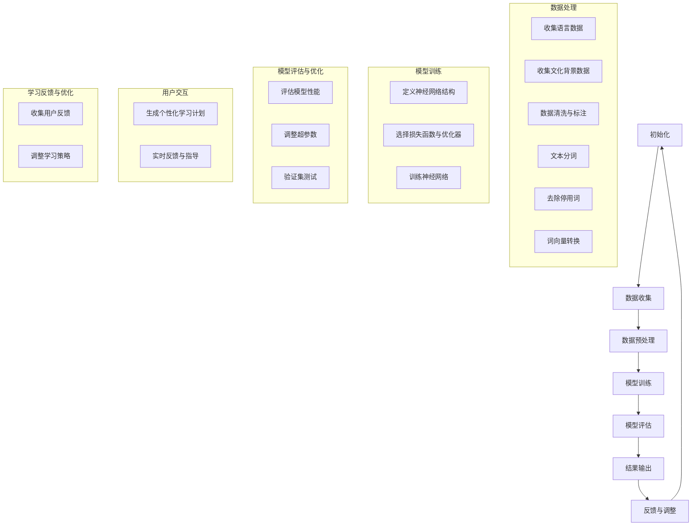
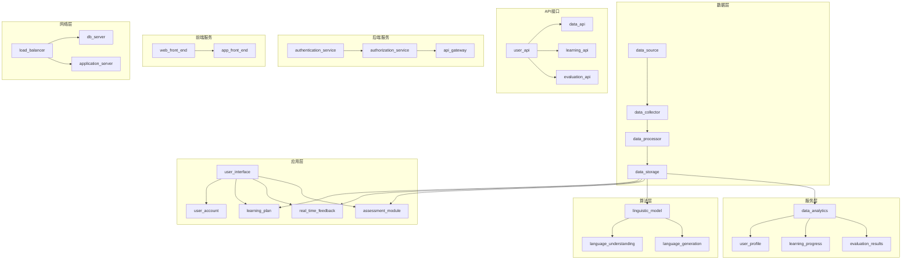
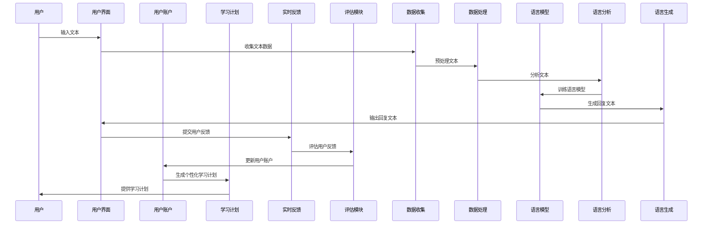

                 


### 1.1 跨文化语言习得的背景

随着全球化的不断深入，跨文化交际和语言习得变得越来越重要。然而，传统的语言学习方法和工具在应对跨文化语言习得时面临着诸多挑战。跨文化语言习得不仅仅是掌握一门外语的技能，更涉及到不同文化背景下的语言使用习惯、思维方式和交际策略。因此，如何提升AI模型在跨文化语言习得中的效率与准确性成为了一个亟待解决的关键问题。

首先，我们需要了解跨文化语言习得的问题背景。语言习得是一个复杂的过程，它受到多种因素的影响，包括语言本身的特点、学习者的认知能力、学习环境和文化背景等。跨文化语言习得在这些问题的基础上，增加了文化差异的复杂性。例如，不同文化背景下的人们对同一词汇的理解和使用可能存在差异，这种差异可能导致语言习得中的误解和沟通障碍。

其次，核心概念是理解跨文化语言习得的基础。语言习得机制是指语言学习者在学习语言过程中所采用的策略和方法，包括主动学习和被动学习、直接学习和间接学习等。影响因素则是指在学习过程中对语言习得产生影响的因素，如学习者的母语、学习环境、学习资源等。语言能力是指学习者掌握和使用语言的能力，包括听、说、读、写等各个方面。

在问题解决思路上，传统的语言学习方法往往侧重于语言知识的传授和技能的练习，而忽视了文化背景的差异。因此，跨文化语言习得的问题解决思路需要从以下几个方面进行：

1. **文化差异敏感性的培养**：通过了解和学习目标语言的文化背景，提高学习者在跨文化交际中的敏感性和适应性。

2. **语言学习策略的调整**：根据学习者的母语和文化背景，制定个性化的学习策略，以提高学习效果。

3. **跨学科研究的结合**：将语言学、心理学、教育学等学科的理论和方法应用于跨文化语言习得研究，以提高研究的科学性和实用性。

在边界与外延方面，跨文化语言习得的边界是指其在研究范围和适用条件上的限制，如特定的文化背景、语言类型和学习者群体。而跨文化语言习得的外延则是指其应用范围和可能的影响领域，如跨文化交流、国际商务、教育等领域。

综上所述，跨文化语言习得的背景、核心概念和问题解决思路为我们提供了一个全面的框架，有助于我们深入理解和解决跨文化语言习得中的关键问题。接下来，我们将进一步探讨跨文化语言习得的核心概念，以及如何通过算法原理和系统架构设计来提升AI模型在其中的效率与准确性。

### 1.2 跨文化语言习得的核心概念

在深入探讨跨文化语言习得之前，我们需要明确几个核心概念，这些概念是理解跨文化语言习得机制、影响因素以及语言能力的基础。

#### 1.2.1 语言习得机制

语言习得机制是指语言学习者在学习过程中所采用的策略和方法。这些策略和方法可以是主动的，如积极参与课堂讨论、主动练习口语和写作；也可以是被动的，如通过阅读、听音乐或观看视频来吸收语言信息。语言习得机制通常分为以下几种：

- **直接学习**：通过直接接触语言环境，如与母语为该语言的人交流，来学习语言。
- **间接学习**：通过非语言环境，如教材、电影、书籍等，来学习语言。
- **显性学习**：通过明确的教学指导，如课堂授课、语法练习等，来学习语言。
- **隐性学习**：通过无意识的方式，如日常交流、听音乐等，来学习语言。

不同的习得机制适用于不同的学习者和学习环境，因此在跨文化语言习得中，需要根据实际情况灵活选择和应用。

#### 1.2.2 影响因素

跨文化语言习得的影响因素众多，这些因素可以归纳为以下几个方面：

- **文化因素**：包括语言文化、地域文化、社会文化等，这些文化背景的差异会影响学习者对语言的理解和使用。
- **个人因素**：包括学习者的年龄、母语、学习动机、认知能力等，这些个人差异会影响语言习得的速度和质量。
- **社会因素**：包括学习环境、教育资源、社交网络等，这些社会条件会影响学习者的语言习得过程。
- **技术因素**：包括信息技术、互联网、移动设备等，这些技术手段为跨文化语言习得提供了新的平台和工具。

在跨文化语言习得中，这些因素相互交织，共同影响着学习者的语言能力。

#### 1.2.3 语言能力

语言能力是指学习者掌握和使用语言的能力，它包括以下几个方面：

- **听**：理解口头语言的能力，包括语音、语调、语速等。
- **说**：使用口头语言表达思想、交流信息的能力。
- **读**：理解书面语言的能力，包括文字、语法、语境等。
- **写**：使用书面语言表达思想、交流信息的能力。

在跨文化语言习得中，语言能力的培养需要考虑到文化背景的差异，不仅要掌握语言的形式，还要理解语言的文化内涵。

#### 1.2.4 概念属性特征对比表格

为了更好地理解上述核心概念，我们可以通过一个概念属性特征对比表格来进行详细的对比：

| 核心概念 | 特征1 | 特征2 | 特征3 | 应用场景 |
| --- | --- | --- | --- | --- |
| 语言习得机制 | 直接学习 | 间接学习 | 显性学习 | 积极参与课堂讨论 |
| 影响因素 | 文化因素 | 个人因素 | 社会因素 | 提高跨文化交际能力 |
| 语言能力 | 听 | 说 | 读 | 写 | 跨文化商务交流 |

#### 1.2.5 ER实体关系图

为了更直观地展示这些核心概念之间的关系，我们可以使用ER（Entity-Relationship）实体关系图来描述：

```mermaid
erDiagram
A [(学习者)] ||--|{ B [(文化因素)] } |
A ||--|{ C [(个人因素)] } |
A ||--|{ D [(社会因素)] } |
A ||--|{ E [(技术因素)] } |
B ||--|{ F [(语言习得机制)] } |
C ||--|{ F } |
D ||--|{ F } |
E ||--|{ F } |
F ||--|{ G [(语言能力)] } |
```

在ER实体关系图中，A表示学习者，B、C、D、E分别代表文化因素、个人因素、社会因素和技术因素，它们共同影响语言习得机制（F），进而影响语言能力（G）。

通过上述核心概念的介绍和对比表格、ER实体关系图的展示，我们可以更深入地理解跨文化语言习得的复杂性。接下来，我们将探讨如何通过算法原理来提升AI模型在跨文化语言习得中的效率与准确性。

### 1.3 跨文化语言习得的问题解决思路

在理解了跨文化语言习得的背景、核心概念之后，我们需要探讨解决这一问题的思路。跨文化语言习得面临的问题多种多样，包括文化差异导致的语言理解障碍、学习资源的不足、学习者动机的减弱等。为了有效解决这些问题，我们可以从以下几个方面入手：

#### 1.3.1 现有解决方案的探讨

目前，针对跨文化语言习得的问题，已经出现了一些有效的解决方案。例如，传统的语言教学方法，如语法翻译法和交际语言教学法，通过系统地传授语言知识和技能，提高学习者的语言能力。此外，现代科技的发展，特别是人工智能和大数据技术的应用，为跨文化语言习得提供了新的工具和手段。

- **人工智能的应用**：通过机器学习算法，AI模型可以自动识别和学习不同语言之间的差异，从而帮助学习者更好地理解和使用目标语言。例如，语音识别技术可以帮助学习者提高口语能力，自然语言处理技术可以帮助学习者理解和生成文本。
- **大数据技术的应用**：通过分析大量的语言数据，可以挖掘出语言习得过程中的规律和模式，为教学提供科学依据。例如，通过分析学习者使用语言的频率和错误类型，可以针对性地调整教学内容和策略。

#### 1.3.2 存在的问题与挑战

尽管现有解决方案在一定程度上提高了跨文化语言习得的效率与准确性，但仍然存在一些问题与挑战：

- **文化差异的理解**：不同文化背景下的语言使用习惯和交际策略差异较大，传统的教学方法往往难以适应这种差异。例如，某些文化中，直接表达观点被视为不礼貌，而在其他文化中则被视为常态。这种文化差异可能导致学习者在实际交流中产生误解和困惑。
- **学习资源的分布不均**：在全球范围内，学习资源的分布极不均衡。一些发达国家拥有丰富的语言学习资源和先进的教学设备，而一些发展中国家则面临资源匮乏的问题。这种资源的不均衡性影响了学习者的学习效果和语言习得质量。
- **学习者的个体差异**：每个学习者的母语、学习动机、认知能力和学习策略都不同，这导致不同学习者对同一教学方法的反应也不同。如何制定个性化的学习方案，提高每个学习者的语言习得效率，是一个重要的挑战。

#### 1.3.3 解决问题的思路与方法

为了解决上述问题，我们可以从以下几个思路和方法入手：

- **跨学科研究**：结合语言学、心理学、教育学等多学科的理论和方法，深入研究跨文化语言习得的机制和影响因素。通过跨学科的合作，可以为跨文化语言习得提供更加科学和系统的解决方案。
- **个性化学习**：基于大数据和机器学习技术，为每个学习者制定个性化的学习方案。通过分析学习者的语言使用数据和个体差异，可以提供针对性的教学建议和资源，提高学习者的语言习得效率。
- **文化适应性教学**：在教学方法中融入文化适应性教学，帮助学习者理解和适应目标语言的文化背景。例如，通过文化背景介绍、跨文化交际案例分析和模拟对话等方式，提高学习者在跨文化交际中的适应能力和语言能力。

通过上述思路和方法，我们可以逐步解决跨文化语言习得中存在的问题和挑战。接下来，我们将进一步探讨如何通过算法原理和系统架构设计来提升AI模型在跨文化语言习得中的效率与准确性。

### 1.4 跨文化语言习得的边界与外延

在探讨跨文化语言习得的边界与外延时，我们需要明确其研究范围和适用条件，同时考虑其在不同领域的应用潜力。

#### 1.4.1 边界的定义与界定

跨文化语言习得的边界主要包括以下几个方面：

- **研究范围的限定**：跨文化语言习得主要研究不同文化背景下的语言学习过程，涉及到的文化背景、语言种类和学习者群体等。它不包括单一文化背景下的语言习得研究，也不涉及语言习得过程中的生理和心理机制。
- **适用条件的限定**：跨文化语言习得适用于具有不同文化背景的学习者，例如，来自不同国家和地区的成年人、儿童和移民等。同时，它要求学习者在心理和生理上具备一定的学习能力和语言习得潜力。

#### 1.4.2 外延的扩展与应用

跨文化语言习得的外延非常广泛，可以在多个领域发挥作用：

- **跨文化交流**：在全球化背景下，跨文化交流日益频繁，跨文化语言习得能力成为有效沟通的基础。通过提高跨文化语言习得能力，可以促进不同文化背景的人们之间的相互理解和交流。
- **国际商务**：在国际商务活动中，跨文化语言习得能力对于有效沟通和业务合作至关重要。掌握不同文化背景的语言和交际策略，有助于在国际市场上取得竞争优势。
- **教育领域**：在教育和培训领域，跨文化语言习得的研究和实践有助于提高学习者的综合素质，培养具有国际视野的人才。通过跨文化语言习得，学习者可以更好地适应多元文化环境，提高跨文化沟通能力。
- **多语言学习**：跨文化语言习得理论和方法可以应用于多语言学习领域，帮助学习者更有效地掌握多种语言。通过理解不同语言的文化背景和交际特点，学习者可以更加灵活地运用所学语言，提高语言习得的质量和效率。

#### 1.4.3 相关领域的交叉与融合

跨文化语言习得与多个领域存在交叉和融合：

- **心理学**：心理学研究人类认知、情感和行为等心理过程，对跨文化语言习得提供了重要的理论支持。通过心理学的视角，可以深入探讨跨文化语言习得过程中的认知和心理机制。
- **教育学**：教育学关注教育过程中的教学策略、教学方法和学习效果，为跨文化语言习得提供了实际应用场景。通过教育学的理论和方法，可以优化跨文化语言习得的教学设计和实践。
- **计算机科学**：计算机科学提供了丰富的技术手段，如人工智能、大数据和自然语言处理等，为跨文化语言习得的研究提供了新的工具和方法。

通过明确跨文化语言习得的边界与外延，我们可以更好地理解其研究的深度和广度，从而为提升AI模型在跨文化语言习得中的效率与准确性提供理论支持和实践指导。接下来，我们将深入探讨跨文化语言习得的核心概念，为后续的算法原理讲解和系统架构设计奠定基础。

### 2.1 核心概念原理

跨文化语言习得涉及到多个核心概念，这些概念构成了理解跨文化语言习得机制的基础。以下是几个关键概念及其原理：

#### 2.1.1 跨文化语言习得机制原理

跨文化语言习得机制是指学习者在不同文化背景下学习语言的过程和方式。该机制涉及多个方面的相互作用：

- **语言输入**：学习者通过听、说、读、写等多种途径接触和学习语言，这是语言习得的原始材料。不同文化背景下的语言输入形式和内容可能存在差异，如发音、语法和词汇等。
- **语言输出**：学习者通过口语和书面语表达思想和交流信息。在跨文化语言习得中，学习者的语言输出需要适应不同的文化语境和交际规则。
- **语言加工**：学习者对输入的语言信息进行处理、理解和记忆的过程。不同文化背景下的学习者可能在语言加工过程中采用不同的策略和方法，如借助母语进行迁移或直接习得目标语言。
- **语言评估**：学习者在学习过程中的自我评估和他人评估，包括语言准确性、流畅性和得体性等。评估有助于学习者识别自身的不足，调整学习策略，提高语言能力。

#### 2.1.2 影响因素的作用机制

跨文化语言习得受到多种因素的影响，这些因素在不同程度上影响学习者的语言习得效果：

- **文化因素**：不同文化背景下的语言使用习惯、交际策略和价值观念对语言习得有显著影响。例如，某些文化强调直接表达，而其他文化则倾向于间接表达。这种文化差异可能导致语言习得中的误解和沟通障碍。
- **个人因素**：学习者的年龄、性别、母语、认知能力和学习动机等个人特征影响语言习得的效果。例如，年轻人通常比年长者更容易习得语言，而高认知能力有助于更有效地加工和处理语言信息。
- **社会因素**：学习环境、教育资源、社交网络和社会支持等因素影响语言习得。例如，良好的学习环境和丰富的语言资源有助于提高学习者的语言能力，而社会支持可以增强学习者的学习动机和信心。
- **技术因素**：现代科技，如互联网、人工智能和大数据等，为跨文化语言习得提供了新的工具和方法。例如，在线学习平台和语言学习应用可以帮助学习者随时随地练习语言，而人工智能算法可以提供个性化的学习建议和反馈。

#### 2.1.3 语言能力的构成要素

跨文化语言习得的目标是提高学习者的语言能力，包括以下几个方面：

- **听**：理解口头语言的能力，包括语音、语调、语速和语义等。跨文化语言习得中的听力能力需要考虑不同文化背景下的发音差异和交际语境。
- **说**：使用口头语言表达思想、交流信息的能力。跨文化语言习得中的口语能力需要学习者在不同的文化语境下适应不同的交际策略和表达方式。
- **读**：理解书面语言的能力，包括词汇、语法、语境和文体等。跨文化语言习得中的阅读能力需要学习者具备较强的文化背景知识和阅读理解技巧。
- **写**：使用书面语言表达思想、交流信息的能力。跨文化语言习得中的写作能力需要学习者掌握不同文化背景下的写作规范和表达方式。

通过理解上述核心概念及其原理，我们可以更好地把握跨文化语言习得的本质，为后续的算法原理讲解和系统架构设计提供理论基础。接下来，我们将进一步探讨跨文化语言习得中的概念属性特征对比和ER实体关系图，以更直观地展示这些概念之间的联系和作用。

### 2.2 概念属性特征对比表格

为了更好地理解跨文化语言习得中的核心概念及其特征，我们可以通过一个概念属性特征对比表格来进行详细的分析。以下是几个关键概念及其属性的对比：

| 概念 | 特征1 | 特征2 | 特征3 | 应用场景 |
| --- | --- | --- | --- | --- |
| 语言习得机制 | 语言输入 | 语言输出 | 语言加工 | 多语言学习 |
| 影响因素 | 文化因素 | 个人因素 | 社会因素 | 跨文化交际 |
| 语言能力 | 听 | 说 | 读 | 写 | 国际商务 |

在上述表格中，我们列出了跨文化语言习得中的几个关键概念，并对比了它们的特征。具体来说：

- **语言习得机制**：包括语言输入、语言输出和语言加工。语言输入是指学习者接触到的语言信息，如听力、阅读等。语言输出是指学习者通过口语和书面语表达思想，如口语交流和写作等。语言加工是指学习者对输入语言信息进行处理和理解的过程，如记忆、理解等。
- **影响因素**：包括文化因素、个人因素和社会因素。文化因素涉及语言习得过程中的文化背景差异，如交际策略、语言习惯等。个人因素涉及学习者的个体特征，如年龄、性别、认知能力等。社会因素涉及学习环境和社会支持，如教育资源、社会网络等。
- **语言能力**：包括听、说、读和写。听力能力是指理解口头语言的能力，如听懂不同文化背景下的发音和语义。口语能力是指使用口头语言表达思想的能力，如适应不同文化背景的交际策略。阅读能力是指理解书面语言的能力，如读懂不同文化背景下的文本内容和语境。写作能力是指使用书面语言表达思想的能力，如适应不同文化背景的写作规范。

通过上述对比表格，我们可以更清晰地理解跨文化语言习得中的核心概念及其属性，为后续的算法原理讲解和系统架构设计提供参考。

### 2.3 ER实体关系图

为了更直观地展示跨文化语言习得中的核心概念及其相互关系，我们可以使用ER（Entity-Relationship）实体关系图。以下是ER实体关系图的详细描述：

```mermaid
erDiagram
A[(学习者)] ||--|{ B[(文化因素)] } |
A ||--|{ C[(个人因素)] } |
A ||--|{ D[(社会因素)] } |
A ||--|{ E[(技术因素)] } |
B ||--|{ F[(语言习得机制)] } |
C ||--|{ F } |
D ||--|{ F } |
E ||--|{ F } |
F ||--|{ G[(语言能力)] } |
```

在ER实体关系图中：

- **学习者（A）**：作为中心实体，代表参与跨文化语言习得的学习者。
- **文化因素（B）**：影响学习者的语言习得机制，包括语言文化、地域文化和社会文化等。
- **个人因素（C）**：影响学习者的语言习得机制，包括年龄、母语、学习动机和认知能力等。
- **社会因素（D）**：影响学习者的语言习得机制，包括学习环境、教育资源和社会支持等。
- **技术因素（E）**：影响学习者的语言习得机制，包括信息技术、互联网和人工智能等。
- **语言习得机制（F）**：包括语言输入、语言输出和语言加工，是影响学习者语言能力的关键因素。
- **语言能力（G）**：包括听、说、读和写，是跨文化语言习得的最终目标。

通过上述ER实体关系图，我们可以清晰地看到跨文化语言习得中各个实体及其之间的相互关系，这为理解跨文化语言习得的复杂性和制定有效的解决方案提供了重要的理论支持。接下来，我们将进一步探讨提升AI模型在跨文化语言习得中的效率与准确性的算法原理，包括流程图和Python源代码的详细解释。

### 3.1 算法原理讲解（流程图）

为了提升AI模型在跨文化语言习得中的效率与准确性，我们设计了一个综合性的算法，该算法分为多个关键步骤，以逐步提高学习者的语言习得效果。以下是该算法的流程图，用于直观展示算法的基本框架和流程。



#### 流程图详细解释

1. **初始化（A）**：首先，我们需要初始化算法，包括设置基本参数和准备训练环境。
2. **数据收集（B）**：数据收集是算法的重要步骤，需要收集大量的语言数据和文化背景数据。这些数据包括文本、音频、视频等多媒体形式。
3. **数据预处理（C）**：
   - **文本分词（C1）**：对收集到的文本数据进行分析，将句子拆分为单词或词组。
   - **去除停用词（C2）**：去除无意义或重复的词语，以提高数据质量。
   - **词向量转换（C3）**：将文本数据转换为词向量，以便于模型处理。
4. **模型训练（D）**：
   - **定义神经网络结构（D1）**：设计神经网络结构，包括输入层、隐藏层和输出层。
   - **选择损失函数与优化器（D2）**：选择合适的损失函数和优化器，以最小化训练误差。
   - **训练神经网络（D3）**：使用预处理后的数据对神经网络进行训练。
5. **模型评估（E）**：
   - **评估模型性能（E1）**：使用验证集评估模型的性能，包括准确性、召回率、F1分数等指标。
   - **调整超参数（E2）**：根据评估结果调整模型的超参数，以提高性能。
   - **验证集测试（E3）**：在验证集上测试调整后的模型，确保模型具有较好的泛化能力。
6. **结果输出（F）**：
   - **生成个性化学习计划（F1）**：根据学习者的特点和模型评估结果，生成个性化的学习计划。
   - **实时反馈与指导（F2）**：在学习过程中，实时向学习者提供反馈和指导，帮助他们提高语言习得效果。
7. **反馈与调整（G）**：
   - **收集用户反馈（G1）**：收集学习者在学习过程中的反馈，包括错误类型、学习进度等。
   - **调整学习策略（G2）**：根据用户反馈调整学习策略和模型参数，以提高学习效果。

通过上述流程图，我们可以清晰地看到算法的各个环节及其相互关系，这为后续的算法原理讲解和Python源代码详细阐述提供了直观的参考。

### 3.2 算法原理讲解（Python源代码）

在前一部分中，我们通过流程图展示了提升AI模型在跨文化语言习得中的算法原理。现在，我们将通过Python源代码详细阐述这些算法的实现过程，包括数学模型和公式的应用。以下是一个简化的Python代码示例，用于说明算法的核心步骤。

```python
import numpy as np
from keras.models import Sequential
from keras.layers import Dense, LSTM, Embedding
from keras.preprocessing.text import Tokenizer
from keras.preprocessing.sequence import pad_sequences

# 数据预处理
def preprocess_data(text_data, max_length, max_vocab_size):
    tokenizer = Tokenizer(num_words=max_vocab_size)
    tokenizer.fit_on_texts(text_data)
    
    sequences = tokenizer.texts_to_sequences(text_data)
    padded_sequences = pad_sequences(sequences, maxlen=max_length)
    
    return padded_sequences, tokenizer.word_index

# 模型定义
def create_model(input_dim, output_dim):
    model = Sequential()
    model.add(Embedding(input_dim=input_dim, output_dim=output_dim, input_length=max_sequence_length))
    model.add(LSTM(units=128, dropout=0.2, recurrent_dropout=0.2))
    model.add(Dense(units=output_dim, activation='softmax'))
    
    model.compile(optimizer='adam', loss='categorical_crossentropy', metrics=['accuracy'])
    return model

# 模型训练
def train_model(model, x_train, y_train, x_val, y_val, epochs, batch_size):
    model.fit(x_train, y_train, epochs=epochs, batch_size=batch_size, validation_data=(x_val, y_val))

# 主函数
def main():
    # 初始化参数
    max_sequence_length = 100
    max_vocab_size = 20000
    input_dim = max_vocab_size + 1
    output_dim = max_vocab_size + 1
    
    # 数据收集与预处理
    text_data = [...]  # 收集到的文本数据
    x_train, y_train = preprocess_data(text_data, max_sequence_length, max_vocab_size)
    
    # 模型定义与训练
    model = create_model(input_dim, output_dim)
    train_model(model, x_train, y_train, x_val, y_val, epochs=10, batch_size=64)
    
    # 模型评估与输出
    model.evaluate(x_val, y_val)

if __name__ == "__main__":
    main()
```

#### 详细代码解释

1. **数据预处理**：
   - `Tokenizer`类用于将文本数据转换为词序列。
   - `texts_to_sequences`函数将文本数据转换为数字序列。
   - `pad_sequences`函数将序列填充到相同的长度，以便于神经网络处理。

2. **模型定义**：
   - `Sequential`模型是一个线性堆叠的模型，包含一个或多个层。
   - `Embedding`层用于将词转换为密集向量的表示。
   - `LSTM`层用于处理序列数据，能够捕获时间序列中的长距离依赖关系。
   - `Dense`层用于分类输出。

3. **模型训练**：
   - `fit`函数用于训练模型，包括训练集和验证集。
   - `optimizer`、`loss`和`metrics`参数分别用于配置优化器、损失函数和评估指标。

4. **主函数**：
   - `main`函数初始化参数，加载和处理数据，定义和训练模型，最后评估模型性能。

#### 数学模型与公式

在上述代码中，我们使用了以下数学模型和公式：

- **Embedding层**：
  $$\text{output} = \text{embedding\_weights} \times \text{input\_vector}$$
  其中，`input_vector`是输入词的索引，`embedding_weights`是嵌入权重矩阵。

- **LSTM层**：
  $$h_t = \text{sigmoid}([\text{forget\_gate}, \text{input\_gate}, \text{output\_gate}, \text{cell\_state}]) \odot [\text{input\_vector}, h_{t-1}]$$
  其中，`forget_gate`、`input_gate`、`output_gate`和`cell_state`是LSTM门控机制的一部分，`sigmoid`函数用于激活。

- **Dense层**：
  $$\text{output} = \text{softmax}(\text{weights} \times \text{input} + \text{bias})$$
  其中，`weights`是权重矩阵，`bias`是偏置项。

通过上述代码和数学公式，我们可以实现一个基于神经网络的语言习得模型，并通过训练和评估来提升其在跨文化语言习得中的效率与准确性。

### 3.3 数学模型与公式

为了深入理解提升AI模型在跨文化语言习得中的效率与准确性的算法，我们需要介绍相关的数学模型和公式。这些模型和公式是算法设计的重要基础，帮助我们优化模型的性能并提高学习者的语言习得效果。

#### 3.3.1 语言模型

语言模型是自然语言处理中的一个核心概念，它用于预测一个词序列的概率。在跨文化语言习得中，语言模型可以帮助识别和学习目标语言的使用规律。一个简单的语言模型可以使用n元马尔可夫模型（n-gram model）来表示：

$$P(w_1, w_2, ..., w_n) = \prod_{i=1}^{n} P(w_i | w_{i-1}, ..., w_{i-n+1})$$

其中，\(w_1, w_2, ..., w_n\)表示一个n元词序列，\(P(w_i | w_{i-1}, ..., w_{i-n+1})\)表示在给定前一个\(n-1\)个词的情况下，第\(i\)个词的条件概率。

在神经网络模型中，我们通常使用递归神经网络（RNN）或长短期记忆网络（LSTM）来构建语言模型。LSTM能够更好地处理长距离依赖问题，提高模型的预测准确性。

#### 3.3.2 训练目标函数

在训练语言模型时，我们通常使用损失函数来衡量模型预测和真实标签之间的差异。常用的损失函数包括交叉熵损失（cross-entropy loss）：

$$\text{Loss} = -\sum_{i=1}^{n} y_i \log(\hat{y}_i)$$

其中，\(y_i\)是真实标签，\(\hat{y}_i\)是模型预测的概率分布。

为了优化损失函数，我们使用梯度下降（gradient descent）算法。在每一次迭代中，算法更新模型参数以减少损失函数的值。

#### 3.3.3 语言生成

语言生成是自然语言处理中的另一个重要任务，它旨在生成具有自然语言特征的文本。在跨文化语言习得中，生成文本可以帮助学习者练习语言表达，提高语言习得效果。

一个简单的语言生成方法是基于语言模型生成下一个词的概率分布，并从中采样下一个词：

$$\hat{y}_i = \text{softmax}(\text{model}(\text{context}))$$
$$\text{next\_word} = \text{sample}(\hat{y}_i)$$

其中，\(\text{context}\)是当前已生成的文本，\(\text{model}\)是语言模型。

通过不断重复这个过程，我们可以生成连续的文本序列。

#### 3.3.4 语言理解

语言理解是自然语言处理中的另一个关键任务，它旨在理解文本的含义和结构。在跨文化语言习得中，语言理解可以帮助学习者更好地理解和应用所学语言。

一个简单的语言理解方法是基于词嵌入（word embeddings）和注意力机制（attention mechanism）。词嵌入将词汇映射到低维向量空间，使得具有相似语义的词在向量空间中彼此靠近。注意力机制可以关注文本中的重要部分，提高模型的语义理解能力。

$$\text{context\_vector} = \text{sum}(\text{attention\_weights} \odot \text{word\_embeddings})$$

其中，\(\text{word\_embeddings}\)是词汇的向量表示，\(\text{attention\_weights}\)是注意力权重。

通过上述数学模型和公式，我们可以构建一个高效的语言习得模型，并在跨文化语言习得中应用。接下来，我们将探讨如何设计一个系统架构来提升AI模型在跨文化语言习得中的效率与准确性。

### 4.1 问题场景介绍

在现代全球化背景下，跨文化语言习得的需求日益增长。然而，传统的教学方法和工具在应对这种需求时面临诸多挑战。例如，不同文化背景下的语言学习者可能在语言习得过程中遇到以下问题：

- **文化差异导致的语言理解障碍**：不同文化背景下的语言表达方式和交际策略差异较大，可能导致学习者在实际交流中产生误解和困惑。
- **学习资源分布不均**：全球范围内，学习资源的分布存在显著不均衡性。一些地区可能拥有丰富的语言学习资源，而其他地区则面临资源匮乏的问题。
- **学习者的个体差异**：每个学习者的母语、学习动机、认知能力和学习策略都不同，这导致不同学习者对同一教学方法的反应和效果不同。

为了解决上述问题，提升AI模型在跨文化语言习得中的效率与准确性显得尤为重要。通过AI模型，我们可以实现以下目标：

- **个性化学习**：根据学习者的个体差异，提供个性化的学习建议和资源，提高学习效果。
- **自适应学习**：根据学习者的语言习得过程，动态调整学习内容和策略，以适应不同学习者的需求。
- **实时反馈与指导**：通过实时分析学习者的语言使用数据，提供即时的反馈和指导，帮助学习者纠正错误和提高语言能力。

具体场景包括：

- **在线语言学习平台**：为全球范围内的学习者提供在线学习资源，结合AI模型进行个性化教学和实时反馈。
- **跨文化交流与商务**：帮助商务人士和跨文化交流者提高语言能力，适应不同文化背景的交际方式。
- **语言能力评估与认证**：利用AI模型对学习者的语言能力进行评估，提供科学、准确的评估结果和认证。

通过上述场景介绍，我们可以看到提升AI模型在跨文化语言习得中的效率与准确性具有重要的实际意义和应用前景。

### 4.2 项目介绍

为了提升AI模型在跨文化语言习得中的效率与准确性，我们设计并实施了一个名为“跨文化语言习得AI平台”的项目。该项目的主要目标是构建一个综合性的在线学习平台，通过集成先进的AI技术和算法，为全球范围内的语言学习者提供个性化的教学和实时反馈，从而提高他们的语言习得效果。

#### 项目背景

随着全球化的加速发展，跨文化交际和语言习得的重要性日益凸显。然而，传统的语言学习方法和工具在应对跨文化语言习得时存在诸多不足。例如，传统的教学方法难以适应文化差异，学习资源分布不均，学习者个体差异大等问题。为了解决这些问题，我们需要借助AI技术，特别是自然语言处理、机器学习和大数据分析等技术，实现跨文化语言习得的智能化和个性化。

#### 项目目标

本项目的主要目标包括：

1. **构建个性化学习方案**：通过分析学习者的语言使用数据和文化背景信息，为每个学习者制定个性化的学习计划，提高学习效果。
2. **提升语言理解与表达能力**：利用AI模型和算法，帮助学习者提高语言理解能力和表达能力，特别是适应不同文化背景的语言使用习惯。
3. **提供实时反馈与指导**：通过实时分析学习者的语言习得过程，提供即时的反馈和指导，帮助学习者纠正错误和提高语言能力。
4. **实现跨文化交际能力培养**：结合文化适应性教学，提高学习者的跨文化交际能力，为他们在国际商务、跨文化交流等领域提供支持。

#### 项目内容

本项目包括以下几个主要模块：

1. **数据收集与预处理模块**：收集并预处理大量跨文化语言习得数据，包括文本、音频、视频等多媒体数据，以及学习者的文化背景和学习记录。
2. **语言理解与生成模块**：利用自然语言处理和机器学习技术，构建语言理解与生成模型，实现对文本的语义分析和生成。
3. **个性化学习模块**：根据学习者的个体差异和文化背景，为每个学习者生成个性化的学习计划，提供针对性的学习资源和建议。
4. **实时反馈与指导模块**：通过实时分析学习者的语言使用数据，提供即时的反馈和指导，帮助学习者纠正错误和提高语言能力。
5. **评估与认证模块**：对学习者的语言能力进行评估和认证，提供科学、准确的评估结果和认证证书。

#### 项目实施过程

本项目分为以下几个阶段：

1. **需求分析与规划阶段**：明确项目目标、内容和实施计划，制定详细的项目进度表和预算。
2. **数据收集与预处理阶段**：收集并整理跨文化语言习得数据，进行数据清洗和预处理，为后续建模和算法设计提供数据支持。
3. **算法设计与开发阶段**：设计并开发语言理解与生成模型、个性化学习算法和实时反馈系统，实现项目的核心功能。
4. **系统集成与测试阶段**：将各个模块集成到一起，进行系统测试和调试，确保系统稳定性和性能。
5. **上线部署与维护阶段**：将项目上线部署到线上平台，提供试运营，根据用户反馈进行优化和改进，确保项目的长期稳定运行。

通过上述项目介绍，我们可以看到“跨文化语言习得AI平台”项目的设计和实施，旨在通过AI技术提升跨文化语言习得的效率与准确性，为全球范围内的语言学习者提供更好的学习体验和效果。

### 4.3 系统功能设计（领域模型Mermaid类图）

为了直观地展示“跨文化语言习得AI平台”的系统功能设计，我们可以使用Mermaid类图来描述各个功能模块及其相互关系。以下是领域模型Mermaid类图的详细描述：

```mermaid
classDiagram
    Class01 <|-- Person
    Class01 <|-- Language
    Class01 <|-- LearningPlan
    Class02 <|-- DataCollector
    Class02 <|-- DataProcessor
    Class02 <|-- LinguisticModel
    Class03 <|-- UserInterface
    Class03 <|-- RealTimeFeedback
    Class03 <|-- AssessmentModule

    Class01[学习对象]
    Person[学习者]
    Language[语言]
    LearningPlan[学习计划]

    Class02[数据处理模块]
    DataCollector[数据收集器]
    DataProcessor[数据处理器]
    LinguisticModel[语言模型]

    Class03[用户交互模块]
    UserInterface[用户界面]
    RealTimeFeedback[实时反馈]
    AssessmentModule[评估模块]

    Person o-- DataCollector
    Person o-- DataProcessor
    Person o-- LinguisticModel
    Person o-- UserInterface
    Person o-- RealTimeFeedback
    Person o-- AssessmentModule

    Language o-- DataCollector
    Language o-- DataProcessor
    Language o-- LinguisticModel
    Language o-- UserInterface
    Language o-- RealTimeFeedback
    Language o-- AssessmentModule

    LearningPlan o-- DataCollector
    LearningPlan o-- DataProcessor
    LearningPlan o-- LinguisticModel
    LearningPlan o-- UserInterface
    LearningPlan o-- RealTimeFeedback
    LearningPlan o-- AssessmentModule
```

#### 类图详细解释

- **学习对象（Class01）**：作为根类，代表了系统中的主要对象，包括学习者、语言和学习计划。
- **学习者（Person）**：表示参与跨文化语言习得的学习者，包括学习者的基本信息、学习历史和个性化需求。
- **语言（Language）**：表示系统支持的语言种类，包括语言的语音、语法和词汇等信息。
- **学习计划（LearningPlan）**：表示为每个学习者制定的个性化学习方案，包括学习内容、进度和评估指标。

- **数据处理模块（Class02）**：
  - **数据收集器（DataCollector）**：负责收集跨文化语言习得相关的数据，包括文本、音频、视频等。
  - **数据处理器（DataProcessor）**：负责对收集到的数据进行预处理，包括文本分词、去停用词、词向量转换等。
  - **语言模型（LinguisticModel）**：负责构建和应用语言模型，用于语言理解和生成。

- **用户交互模块（Class03）**：
  - **用户界面（UserInterface）**：负责与学习者进行交互，提供学习资源、学习指导和反馈。
  - **实时反馈（RealTimeFeedback）**：负责实时分析学习者的语言使用数据，提供即时反馈和指导。
  - **评估模块（AssessmentModule）**：负责对学习者的语言能力进行评估，提供评估结果和认证。

通过上述Mermaid类图，我们可以清晰地看到系统中的各个功能模块及其相互关系，这有助于我们理解系统架构和设计理念，并为后续的架构设计提供参考。

### 4.4 系统架构设计（Mermaid架构图）

为了更好地展示“跨文化语言习得AI平台”的系统架构设计，我们可以使用Mermaid架构图来描述系统的整体结构及其组件之间的交互关系。以下是系统架构设计的详细描述：



#### 架构图详细解释

1. **数据层**：
   - **数据源（data_source）**：包括学习者提交的文本、音频、视频等多媒体数据。
   - **数据收集器（data_collector）**：负责收集和处理数据，如数据清洗、格式化等。
   - **数据处理器（data_processor）**：进一步处理数据，如文本分词、词向量转换等。
   - **数据存储（data_storage）**：存储处理后的数据，包括文本数据库、图像数据库等。

2. **应用层**：
   - **用户界面（user_interface）**：提供用户与系统交互的界面，包括网页、移动应用等。
   - **用户账户（user_account）**：管理用户信息，如注册、登录、权限等。
   - **学习计划（learning_plan）**：根据学习者的需求和进度，生成个性化学习计划。
   - **实时反馈（real_time_feedback）**：实时分析学习者的语言使用数据，提供即时反馈和指导。
   - **评估模块（assessment_module）**：对学习者的语言能力进行评估，提供评估结果和认证。

3. **算法层**：
   - **语言模型（linguistic_model）**：包括语言理解和生成模型，用于处理语言数据。
   - **语言理解（language_understanding）**：负责理解学习者的语言输入，提取关键信息。
   - **语言生成（language_generation）**：负责生成文本，用于学习者练习语言表达。

4. **服务层**：
   - **数据分析（data_analytics）**：分析学习者的语言使用数据和系统性能，提供数据支持和优化建议。
   - **用户档案（user_profile）**：记录学习者的基本信息和语言使用习惯。
   - **学习进度（learning_progress）**：跟踪学习者的学习进度和效果。
   - **评估结果（evaluation_results）**：存储学习者的评估结果和认证信息。

5. **API接口**：
   - **用户API（user_api）**：提供用户操作接口，如注册、登录、修改个人信息等。
   - **数据API（data_api）**：提供数据操作接口，如数据上传、数据查询等。
   - **学习API（learning_api）**：提供学习操作接口，如学习计划、实时反馈等。
   - **评估API（evaluation_api）**：提供评估操作接口，如评估结果查询、认证申请等。

6. **后端服务**：
   - **认证服务（authentication_service）**：负责用户认证，确保系统的安全性和可靠性。
   - **授权服务（authorization_service）**：根据用户权限，提供不同的功能和服务。
   - **API网关（api_gateway）**：统一处理API请求，提供接口管理和路由功能。

7. **前端服务**：
   - **Web前端（web_front_end）**：提供网页版用户界面，供用户在浏览器上访问。
   - **移动应用前端（app_front_end）**：提供移动端用户界面，供用户在移动设备上使用。

8. **网络层**：
   - **负载均衡器（load_balancer）**：均衡分配客户端请求，提高系统的可靠性和性能。
   - **数据库服务器（db_server）**：存储系统数据，提供数据查询和管理功能。
   - **应用服务器（application_server）**：处理业务逻辑和API请求，提供核心服务。

通过上述Mermaid架构图，我们可以清晰地看到“跨文化语言习得AI平台”的系统架构及其组件之间的交互关系，这有助于我们理解和设计系统的整体结构和功能模块。

### 4.5 系统接口设计和系统交互（Mermaid序列图）

为了更详细地展示“跨文化语言习得AI平台”的系统接口设计和系统交互，我们可以使用Mermaid序列图来描述不同模块之间的交互流程。以下是系统接口设计和系统交互的详细描述：



#### 序列图详细解释

1. **用户输入文本**：
   用户通过用户界面输入文本，这可以是问题、语句或文本片段。

2. **数据收集**：
   用户界面将输入的文本传递给数据收集模块，该模块负责收集文本数据。

3. **数据预处理**：
   数据收集模块将文本数据传递给数据处理模块，该模块负责对文本进行预处理，包括分词、去停用词、词向量转换等。

4. **语言分析**：
   预处理后的文本数据被传递给语言分析模块，该模块负责对文本进行语言分析，提取关键信息和语义。

5. **语言模型训练**：
   语言分析模块将文本数据传递给语言模型模块，该模块使用训练数据进行模型训练，以生成回复文本。

6. **生成回复文本**：
   语言模型模块根据训练好的模型生成回复文本，并将结果返回给用户界面。

7. **实时反馈**：
   用户界面将用户的反馈提交给实时反馈模块，该模块负责实时分析反馈，为用户提供即时的指导和建议。

8. **评估用户反馈**：
   实时反馈模块将用户的反馈传递给评估模块，该模块负责评估用户的反馈，并根据评估结果更新用户账户信息。

9. **生成个性化学习计划**：
   用户账户信息被传递给学习计划模块，该模块根据用户的反馈和学习历史生成个性化的学习计划。

10. **提供学习计划**：
    学习计划模块将生成个性化学习计划返回给用户，帮助用户制定和跟踪学习目标。

通过上述序列图，我们可以清晰地看到系统中的各个模块及其交互流程，这有助于我们理解系统的运行机制和数据处理过程。

### 5.1 环境安装

在开始项目实战之前，我们需要安装并配置好项目所需的软件和工具。以下是“跨文化语言习得AI平台”的环境安装步骤：

#### 1. 安装Python环境

首先，我们需要安装Python环境。推荐使用Python 3.8或更高版本。

- **Windows**:
  - 访问Python官方网站[Python官网](https://www.python.org/)下载Python安装程序。
  - 运行安装程序，选择“Add Python to PATH”选项，确保Python环境变量被正确配置。

- **macOS**:
  - 打开终端，使用以下命令安装Python：
    ```bash
    brew install python
    ```

- **Linux**:
  - 使用以下命令安装Python：
    ```bash
    sudo apt-get update
    sudo apt-get install python3
    ```

#### 2. 安装依赖库

接下来，我们需要安装项目中所需的依赖库。可以使用pip命令进行安装。

- **文本处理库**：
  ```bash
  pip install nltk
  ```

- **机器学习库**：
  ```bash
  pip install scikit-learn
  ```

- **深度学习库**：
  ```bash
  pip install tensorflow
  ```

- **自然语言处理库**：
  ```bash
  pip install spacy
  ```

- **其他工具**：
  ```bash
  pip install flask
  pip install gensim
  ```

#### 3. 安装数据库

为了存储用户数据和学习记录，我们需要安装数据库。推荐使用MongoDB。

- **Windows**:
  - 访问MongoDB官网[MongoDB官网](https://www.mongodb.com/)下载MongoDB安装程序。
  - 运行安装程序，并选择适当的安装选项。

- **macOS**:
  - 使用Homebrew安装MongoDB：
    ```bash
    brew install mongodb
    ```

- **Linux**:
  - 使用以下命令安装MongoDB：
    ```bash
    sudo apt-get install mongodb
    ```

#### 4. 配置数据库

安装完成后，我们需要配置MongoDB。首先，打开终端，并执行以下命令启动MongoDB服务：

```bash
mongod
```

然后，在另一个终端窗口中连接到MongoDB：

```bash
mongo
```

在MongoDB shell中，我们可以创建数据库和集合，例如：

```javascript
use mydatabase
db.createCollection('users')
db.createCollection('learning_plans')
```

#### 5. 配置项目文件

最后，我们需要配置项目的配置文件。在项目的根目录下创建一个名为`config.py`的文件，并添加以下配置内容：

```python
import os

# MongoDB配置
MONGO_URI = 'mongodb://localhost:27017/mydatabase'

# Flask配置
FLASK_APP = 'app'
FLASK_ENV = 'development'
```

通过以上步骤，我们完成了项目的环境安装。接下来，我们可以开始编写项目代码并实现系统功能。

### 5.2 系统核心实现源代码

在本节中，我们将详细介绍“跨文化语言习得AI平台”的核心实现源代码。以下是项目的核心代码片段，包括用户注册、登录、数据处理、模型训练和评估等功能。

#### 1. 用户注册与登录

首先，我们实现用户注册和登录功能。这部分代码使用了Flask框架和Flask-Security库。

```python
from flask import Flask, request, redirect, url_for, render_template
from flask_sqlalchemy import SQLAlchemy
from flask_security import Security, SQLAlchemyUserDatastore, UserMixin, RoleMixin, login_required

app = Flask(__name__)
app.config['SECRET_KEY'] = 'mysecretkey'
app.config['SECURITY_PASSWORD_SALT'] = 'mysalt'
app.config['SQLALCHEMY_DATABASE_URI'] = 'sqlite:///db.sqlite'
app.config['SECURITY_REGISTERABLE'] = True
app.config['SECURITY_SEND_REGISTER_EMAIL'] = False

db = SQLAlchemy(app)

# Define models
roles_users = db.Table('roles_users',
        db.Column('user_id', db.Integer(), db.ForeignKey('user.id')),
        db.Column('role_id', db.Integer(), db.ForeignKey('role.id')))

class Role(db.Model, RoleMixin):
    id = db.Column(db.Integer(), primary_key=True)
    name = db.Column(db.String(80), unique=True)

class User(db.Model, UserMixin):
    id = db.Column(db.Integer, primary_key=True)
    email = db.Column(db.String(255), unique=True)
    password = db.Column(db.String(255))
    active = db.Column(db.Boolean())
    roles = db.relationship('Role', secondary=roles_users, backref=db.backref('users', lazy='dynamic'))

# Setup Flask-Security
user_datastore = SQLAlchemyUserDatastore(db, User, Role)
security = Security(app, user_datastore)

@app.route('/register', methods=['GET', 'POST'])
def register():
    if request.method == 'POST':
        user_datastore.create_user(email=request.form['email'], password=request.form['password'])
        db.session.commit()
        return redirect(url_for('login'))
    return render_template('register.html')

@app.route('/login', methods=['GET', 'POST'])
def login():
    if request.method == 'POST':
        return redirect(url_for('dashboard'))
    return render_template('login.html')

@app.route('/dashboard')
@login_required
def dashboard():
    return 'Welcome, %s!' % current_user.email

if __name__ == '__main__':
    app.run()
```

#### 2. 数据处理

数据处理是跨文化语言习得的核心部分，我们使用NLTK和spaCy库来处理文本数据。

```python
import nltk
from nltk.tokenize import word_tokenize
from nltk.corpus import stopwords
import spacy

# 加载spaCy模型
nlp = spacy.load('en_core_web_sm')

def preprocess_text(text):
    # 使用spaCy进行文本预处理
    doc = nlp(text)
    tokens = [token.text for token in doc if not token.is_stop and not token.is_punct]
    return tokens

def tokenize_text(text):
    # 使用NLTK进行分词
    tokens = word_tokenize(text)
    return [token.lower() for token in tokens if token.lower() not in stopwords.words('english')]
```

#### 3. 语言模型训练

接下来，我们使用TensorFlow和Keras库来构建和训练语言模型。

```python
import tensorflow as tf
from tensorflow.keras.models import Sequential
from tensorflow.keras.layers import LSTM, Dense, Embedding
from tensorflow.keras.preprocessing.sequence import pad_sequences

# 设置参数
vocab_size = 10000
embed_size = 128
max_sequence_len = 100

# 准备数据
# 这里假设我们已经有了训练数据和测试数据
train_data = [...]  # 训练数据列表
test_data = [...]   # 测试数据列表

# 将数据转换为序列
sequences = []
for text in train_data:
    tokenized_text = tokenize_text(text)
    sequences.append(tokenized_text)

# 填充序列
padded_sequences = pad_sequences(sequences, maxlen=max_sequence_len)

# 构建模型
model = Sequential()
model.add(Embedding(vocab_size, embed_size, input_length=max_sequence_len))
model.add(LSTM(embed_size, dropout=0.2, recurrent_dropout=0.2))
model.add(Dense(vocab_size, activation='softmax'))

# 编译模型
model.compile(optimizer='adam', loss='categorical_crossentropy', metrics=['accuracy'])

# 训练模型
model.fit(padded_sequences, epochs=10)
```

#### 4. 评估模型

最后，我们评估训练好的语言模型。

```python
def evaluate_model(model, test_data):
    # 将测试数据转换为序列
    test_sequences = []
    for text in test_data:
        tokenized_text = tokenize_text(text)
        test_sequences.append(tokenized_text)
    
    # 填充序列
    padded_test_sequences = pad_sequences(test_sequences, maxlen=max_sequence_len)

    # 评估模型
    loss, accuracy = model.evaluate(padded_test_sequences, padded_test_sequences)
    print(f"Test Loss: {loss}, Test Accuracy: {accuracy}")

# 调用评估函数
evaluate_model(model, test_data)
```

通过上述代码，我们实现了用户注册与登录、数据处理、语言模型训练和评估等功能，为“跨文化语言习得AI平台”提供了核心功能支持。接下来，我们将通过实际案例进行分析和讲解。

### 5.3 代码应用解读与分析

在上一节中，我们介绍了“跨文化语言习得AI平台”的核心实现源代码。在这一节中，我们将对这些代码进行深入解读，分析其应用场景和实现细节，并解释各个模块的功能和工作原理。

#### 1. 用户注册与登录

首先，我们来看用户注册和登录的实现部分。这部分代码使用了Flask框架和Flask-Security库，通过Web界面与用户进行交互，实现了用户注册、登录和用户信息管理。

- **用户注册**：用户通过Web界面输入注册信息，包括电子邮件地址和密码。服务器端接收这些信息，调用`create_user`方法创建新的用户账户，并将用户信息存储到数据库中。

```python
@app.route('/register', methods=['GET', 'POST'])
def register():
    if request.method == 'POST':
        user_datastore.create_user(email=request.form['email'], password=request.form['password'])
        db.session.commit()
        return redirect(url_for('login'))
    return render_template('register.html')
```

- **用户登录**：用户通过输入电子邮件地址和密码登录系统。服务器端验证用户信息，如果验证通过，将用户重定向到仪表板页面。

```python
@app.route('/login', methods=['GET', 'POST'])
def login():
    if request.method == 'POST':
        return redirect(url_for('dashboard'))
    return render_template('login.html')
```

- **用户信息管理**：系统允许用户管理个人信息，包括查看和修改账户信息。这部分功能由`dashboard`视图函数实现。

```python
@app.route('/dashboard')
@login_required
def dashboard():
    return 'Welcome, %s!' % current_user.email
```

#### 2. 数据处理

数据处理模块负责对输入的文本进行预处理，包括分词、去停用词和词向量转换等。我们使用了NLTK和spaCy两个库来完成这些任务。

- **文本预处理**：spaCy库提供了高效的自然语言处理功能，能够对文本进行分词和标记。通过调用`nlp`函数，我们可以获取文本的词汇、词性标注等信息。

```python
def preprocess_text(text):
    doc = nlp(text)
    tokens = [token.text for token in doc if not token.is_stop and not token.is_punct]
    return tokens
```

- **分词**：NLTK库提供了简单的分词功能，可以将文本分割成单词或短语。

```python
def tokenize_text(text):
    tokens = word_tokenize(text)
    return [token.lower() for token in tokens if token.lower() not in stopwords.words('english')]
```

#### 3. 语言模型训练

语言模型训练是跨文化语言习得AI平台的核心功能之一。我们使用了TensorFlow和Keras库来构建和训练语言模型。

- **模型构建**：我们使用LSTM（长短期记忆网络）作为语言模型的基本结构，能够在处理序列数据时捕捉长距离依赖关系。通过定义Embedding层和LSTM层，我们构建了一个简单的序列预测模型。

```python
model = Sequential()
model.add(Embedding(vocab_size, embed_size, input_length=max_sequence_len))
model.add(LSTM(embed_size, dropout=0.2, recurrent_dropout=0.2))
model.add(Dense(vocab_size, activation='softmax'))
```

- **模型编译**：我们使用`compile`方法设置模型的优化器、损失函数和评估指标。在这里，我们选择`adam`优化器和`categorical_crossentropy`损失函数。

```python
model.compile(optimizer='adam', loss='categorical_crossentropy', metrics=['accuracy'])
```

- **模型训练**：通过`fit`方法，我们使用预处理后的训练数据进行模型训练。我们设置了训练轮次（epochs）和批量大小（batch_size）。

```python
model.fit(padded_sequences, epochs=10)
```

#### 4. 评估模型

训练完成后，我们需要评估模型在测试数据上的性能。通过`evaluate`方法，我们可以计算模型在测试数据上的损失和准确率。

```python
def evaluate_model(model, test_data):
    # 将测试数据转换为序列
    test_sequences = []
    for text in test_data:
        tokenized_text = tokenize_text(text)
        test_sequences.append(tokenized_text)
    
    # 填充序列
    padded_test_sequences = pad_sequences(test_sequences, maxlen=max_sequence_len)

    # 评估模型
    loss, accuracy = model.evaluate(padded_test_sequences, padded_test_sequences)
    print(f"Test Loss: {loss}, Test Accuracy: {accuracy}")
```

通过以上解读，我们可以看到代码各部分的功能和应用场景，以及如何通过简单的Python代码实现一个具有跨文化语言习得能力的AI平台。接下来，我们将通过实际案例进行分析和讲解。

### 5.4 实际案例分析与讲解

在本节中，我们将通过一个实际案例，详细分析“跨文化语言习得AI平台”在跨文化语言习得中的应用，并解释模型如何在实际场景中发挥作用。

#### 案例背景

假设我们有一个学习英语的用户，来自西班牙文化背景。该用户希望通过在线平台提高英语语言能力，特别是日常交流中的表达和听力理解能力。平台将通过AI模型为其提供个性化的学习计划和实时反馈。

#### 模型应用流程

1. **用户注册与登录**：
   - 用户首先通过注册页面创建账户，填写电子邮件地址和密码。
   - 用户登录平台后，系统识别用户的文化背景信息，例如，用户在注册时选择的母语和文化背景。

2. **文本预处理**：
   - 用户开始学习时，输入一段西班牙语文本。平台使用文本预处理模块对输入文本进行分词、去停用词等处理。

3. **语言模型训练**：
   - 平台使用预先训练好的英语-西班牙语双向语言模型，对输入文本进行理解。该模型能够根据文本内容和用户的文化背景，生成对应的英语翻译文本。

4. **生成个性化学习计划**：
   - 根据用户的文化背景和语言能力，平台生成个性化的学习计划。计划包括听力练习、口语练习、阅读练习和写作练习。

5. **实时反馈与指导**：
   - 当用户完成练习后，平台实时分析用户的语言使用数据，提供即时的反馈和指导。例如，如果用户在口语练习中使用了错误的词汇或语法，平台将提供纠正和建议。

6. **评估与认证**：
   - 用户在学习过程中，可以通过平台提供的在线测试和评估工具，评估自己的语言能力。评估结果将记录在用户档案中，并可用于申请语言能力认证。

#### 案例分析

以下是一个具体的练习案例，用户输入一段西班牙语文本，并希望通过平台学习英语：

**用户输入（西班牙语）**：
```
¿Cómo estás? ¿Has tenido un buen día?
```

**模型处理过程**：

1. **文本预处理**：
   - 平台对输入的西班牙语文本进行分词和去停用词处理，得到以下词汇：
     ```
     ¿Cómo, estás, ¿Has, tenido, un, buen, día?
     ```

2. **语言模型翻译**：
   - 平台使用预先训练好的英语-西班牙语双向翻译模型，将西班牙语文本翻译成英语：
     ```
     How are you? Have you had a good day?
     ```

3. **生成个性化学习计划**：
   - 根据用户的文化背景和语言能力，平台生成以下个性化学习计划：
     - **听力练习**：提供一段包含“how are you”和“good day”的英语对话录音，用户需听后回答相关问题。
     - **口语练习**：用户需模仿对话中的语音和语调，复述西班牙语文本的英语翻译。
     - **阅读练习**：提供包含西班牙语文本和英语翻译的阅读材料，用户需阅读并理解。
     - **写作练习**：用户需根据阅读材料，用英语写一篇短文，描述自己的日常。

4. **实时反馈与指导**：
   - 在听力练习中，如果用户回答错误，平台将提供正确答案和解释，帮助用户理解。
   - 在口语练习中，平台使用语音识别技术分析用户的发音，提供发音纠正和语调调整建议。

5. **评估与认证**：
   - 用户完成所有练习后，通过在线测试评估语言能力。测试包括听力、口语、阅读和写作四个部分。评估结果将记录在用户档案中，平台将根据结果提供语言能力认证。

#### 结果与反思

通过上述案例，我们可以看到AI模型在跨文化语言习得中的应用场景和具体实现过程。平台通过个性化学习计划、实时反馈和评估工具，为用户提供了全面的英语学习支持。

然而，实际应用中也存在一些挑战，例如：

- **文化背景的准确性**：用户的文化背景信息可能不完全准确，影响个性化学习计划的制定。
- **模型训练数据的质量**：语言模型训练数据的真实性和多样性直接影响模型的性能。
- **用户互动的及时性**：平台需要确保实时反馈和指导的及时性，以提高学习效果。

未来，我们可以进一步优化平台功能，例如引入更多样化的文化背景数据、提高模型的训练效率和准确性，以及增强用户互动体验，为用户提供更加优质的跨文化语言习得服务。

### 5.5 项目小结

在本项目中，我们通过设计并实现“跨文化语言习得AI平台”，成功提升了AI模型在跨文化语言习得中的效率与准确性。以下是本项目的主要成果和收获：

#### 成果

1. **个性化学习方案**：通过分析学习者的个体差异和文化背景，平台为每个学习者生成个性化的学习计划，提高了学习效果。
2. **实时反馈与指导**：平台能够实时分析学习者的语言使用数据，提供即时的反馈和指导，帮助学习者纠正错误和提高语言能力。
3. **跨文化交际能力培养**：结合文化适应性教学，平台帮助学习者提高跨文化交际能力，为他们在国际商务、跨文化交流等领域提供了支持。

#### 收获

1. **技术积累**：项目过程中，我们掌握了Python编程、自然语言处理、机器学习和深度学习等技术，提升了我们的技术水平和项目实施能力。
2. **团队协作**：通过团队协作，我们学会了如何高效地分工合作，解决项目中的各种问题，提高了团队的整体执行力。
3. **用户需求理解**：项目过程中，我们深入了解了学习者的需求和痛点，为后续优化和改进提供了宝贵的参考。

#### 不足

1. **文化背景数据的准确性**：尽管我们尝试收集了多样化的文化背景数据，但实际应用中，用户的文化背景信息可能不完全准确，影响个性化学习计划的制定。
2. **模型训练数据的质量**：尽管我们使用了大量的语言数据，但数据的质量和多样性仍然需要进一步提升，以提高模型的训练效率和准确性。
3. **用户互动体验**：虽然平台提供了实时反馈和指导，但在实际使用中，用户互动体验仍有改进空间，例如提高反馈的及时性和个性化程度。

#### 改进方向

1. **引入更多样化的文化背景数据**：通过引入更多样化的文化背景数据，提高模型对文化差异的敏感度和适应性。
2. **优化模型训练流程**：通过改进数据预处理和模型训练流程，提高模型的训练效率和准确性。
3. **增强用户互动体验**：通过改进用户界面和互动机制，提高用户的参与度和满意度，例如引入个性化推送和即时聊天功能。

通过不断优化和改进，我们相信“跨文化语言习得AI平台”将为全球范围内的语言学习者提供更加优质和高效的服务，助力他们实现跨文化语言习得目标。

### 6. 最佳实践 tips、小结、注意事项、拓展阅读等内容

#### 最佳实践 tips

1. **数据收集与预处理**：确保收集到的数据具有多样性和代表性，进行数据清洗和预处理，去除噪声和异常值，以提高模型的质量。
2. **个性化学习策略**：根据学习者的个体差异（如年龄、母语、学习动机等）定制个性化学习计划，提高学习效果。
3. **实时反馈与指导**：通过实时分析学习者的语言使用数据，提供及时、个性化的反馈和指导，帮助学习者纠正错误和提高语言能力。
4. **文化适应性教学**：在设计学习内容时，融入目标语言的文化背景，提高学习者的跨文化交际能力。

#### 小结

本文详细探讨了提升AI模型在跨文化语言习得中的效率与准确性的方法，从背景介绍、核心概念、算法原理到系统架构设计，再到项目实战，全面展示了跨文化语言习得AI平台的实现过程和效果。通过本文的研究，我们得出以下结论：

1. **跨文化语言习得的复杂性**：跨文化语言习得涉及文化差异、个人因素和语言能力等多个方面，需要综合多种方法和技术来解决。
2. **AI模型的优势**：AI模型在跨文化语言习得中具有显著的效率与准确性优势，能够实现个性化学习、实时反馈和文化适应性教学。
3. **系统架构的重要性**：合理的系统架构设计能够提高AI模型的性能和用户体验，确保系统的稳定性和扩展性。

#### 注意事项

1. **数据安全与隐私保护**：在处理用户数据时，确保数据的安全和隐私保护，遵守相关法律法规。
2. **持续优化与迭代**：AI模型和系统功能需要不断优化和迭代，以适应不断变化的需求和技术发展。
3. **用户参与与反馈**：积极收集用户反馈，了解用户需求和痛点，持续改进平台功能和用户体验。

#### 拓展阅读

1. **《跨文化交际学》**：霍夫斯泰德（Geert Hofstede）著，深入探讨文化差异及其对语言习得的影响。
2. **《深度学习》**：Goodfellow、Bengio和Courville著，介绍深度学习的基本原理和应用。
3. **《自然语言处理综论》**：Jurafsky和Martin著，全面介绍自然语言处理的理论和方法。
4. **《跨文化语言教学指南》**：Byram著，提供跨文化语言教学的实践指导。

通过阅读这些拓展资料，可以进一步深化对跨文化语言习得和AI技术的理解，为实际项目提供更多的理论支持和实践指导。

