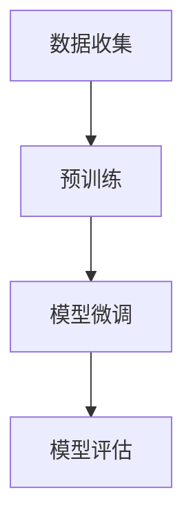
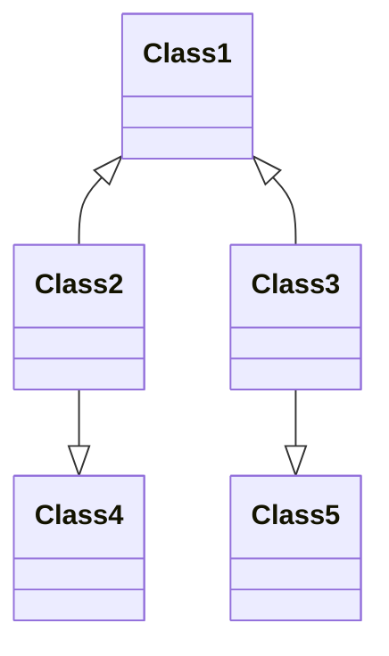
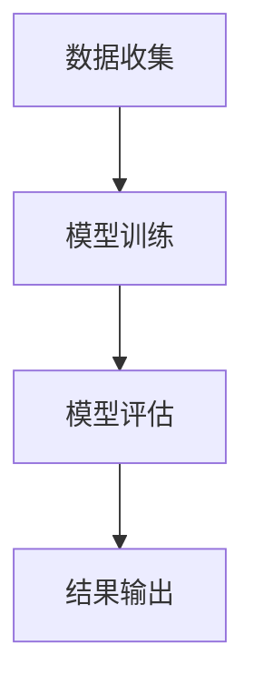
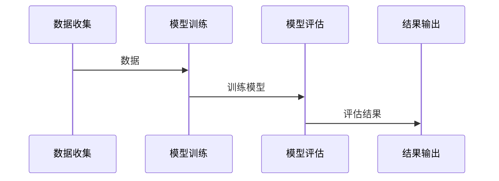

                 


## 提升AI模型在跨模态情感计算任务中的文化敏感性

### 关键词

- 跨模态情感计算
- 文化敏感性
- AI模型
- 预训练-微调
- 多模态融合
- 深度学习
- 数学模型
- 系统架构设计

### 摘要

在跨模态情感计算任务中，AI模型的文化敏感性是决定其准确性和实用性的关键因素。本文首先介绍了跨模态情感计算任务和AI模型的文化敏感性概念，随后详细讲解了提升AI模型文化敏感性的方法，包括数据收集、模型训练和评估。接着，本文通过算法原理讲解、系统架构设计以及项目实战，展示了如何在实际应用中实现文化敏感性的提升。本文旨在为相关领域的研究者和开发者提供有价值的参考和指导。

### 第一步：背景介绍

#### 核心概念

**跨模态情感计算任务**：跨模态情感计算是指利用人工智能技术，对包含多种模态（如文本、图像、声音等）的情感信息进行理解和分析的过程。其核心目标是通过处理不同模态的数据，识别并理解情感。

- **文本**：包括文字、标签、评论等，能够直接表达情感。
- **图像**：通过视觉信息传达情感，如表情、姿势等。
- **声音**：通过音调、节奏、音量等传达情感。

**AI模型的文化敏感性**：AI模型的文化敏感性是指模型在处理不同文化背景下的情感数据时，能否正确理解和反映这些文化中的情感特点。文化敏感性对AI模型在跨模态情感计算任务中的表现至关重要。

- **文化背景**：不同的文化有着独特的情感表达方式和习惯。
- **情感表达**：包括文字、语音、肢体语言等，形式多样。

#### 问题描述

在全球化背景下，跨模态情感计算任务的应用场景越来越广泛，如社交媒体分析、情绪监控、智能客服等。然而，现有AI模型在处理不同文化背景下的情感数据时，常常存在以下问题：

- **情感识别不准确**：不同文化中的情感表达可能存在差异，导致模型无法准确识别情感。
- **文化偏见**：模型在训练过程中可能受到特定文化数据的影响，导致在处理其他文化背景下的数据时出现偏见。

#### 问题解决

提升AI模型在跨模态情感计算任务中的文化敏感性，需要从以下几个方面进行：

1. **数据收集**：收集包含多种模态和不同文化背景的情感数据，确保模型的训练数据具有多样性。
2. **模型训练**：使用多样化数据对AI模型进行训练，提高模型对各种文化背景情感数据的适应性。
3. **模型评估**：设计合理的评估方法，确保模型在跨模态情感计算任务中的文化敏感性。

#### 边界与外延

- **文化敏感性**：不仅涉及不同文化背景下的情感识别，还包括对文化语境、情感表达方式的敏感性和适应性。
- **跨模态**：涉及文本、图像、声音等多种模态的情感信息处理。

#### 概念结构与核心要素组成

1. **数据收集**：收集多种模态和不同文化背景的情感数据，如中西方社交媒体的评论、不同国家电影中的情感表达等。
2. **模型训练**：使用收集到的数据训练AI模型，包括预训练和微调过程。
3. **模型评估**：评估模型在跨模态情感计算任务中的文化敏感性，包括准确性和公平性评估。

### 第二步：核心概念与联系

#### AI大模型的定义与特点

**AI大模型**：AI大模型是指具有海量参数、能够处理复杂任务的深度学习模型。其特点如下：

- **参数规模大**：拥有数十亿甚至千亿级别的参数。
- **计算能力强**：能够处理大规模数据和复杂任务。
- **表现力强**：能够自动学习特征和模式，无需人工干预。

#### AI大模型与传统AI的区别

**传统AI**：传统AI主要依赖于规则和特征工程，模型规模相对较小，需要人工设计特征和规则。

- **规则依赖**：依靠专家经验和人工设计的规则进行决策。
- **特征工程**：需要人工提取和选择特征。

**AI大模型**：通过大规模数据训练，自动学习特征和模式，无需人工干预。

- **数据驱动**：依赖大规模数据进行训练。
- **自动特征学习**：通过神经网络自动提取和组合特征。

#### 概念属性特征对比表格

| 特征         | 传统AI               | AI大模型              |
| ------------ | -------------------- | --------------------- |
| 参数规模     | 小规模参数           | 海量参数（数十亿级）  |
| 计算能力     | 较弱                 | 强大                  |
| 表现力       | 依赖人工规则和特征   | 自动学习特征和模式    |
| 需要的人工干预 | 大量                 | 较少或无需            |

#### ER实体关系图架构的 Mermaid 流程图

```mermaid
erDiagram
  AI大模型 ||--|{ 数据集 }|
  数据集 ||--|{ 特征 }|
  特征 ||--|{ 模型参数 }|
  模型参数 ||--|{ 模型表现 }|
```

### 第三步：算法原理讲解

#### 算法原理

**预训练-微调**：预训练-微调是训练AI大模型的主要方法。首先在大规模数据集上预训练模型，然后针对特定任务进行微调。

1. **预训练**：在无监督或半监督数据集上，模型自动学习通用特征和模式。
2. **微调**：在特定任务的数据集上，模型进行微调，优化特定任务的性能。

**多模态融合**：多模态融合是将不同模态的数据进行融合，提高模型在跨模态情感计算任务中的表现。

1. **数据融合**：将文本、图像、声音等多种模态的数据进行融合。
2. **特征提取**：提取每种模态的特征，并进行融合。
3. **模型融合**：将融合后的特征输入到统一模型中，进行情感计算。

#### 算法mermaid流程图



#### Python源代码

```python
# 数据收集
data = ...

# 预训练
model = ...

# 模型微调
model.fit(data)

# 模型评估
accuracy = model.evaluate(data)
```

#### 数学模型和公式

- **损失函数**：用于评估模型预测的误差。

  $$L(\theta) = -\sum_{i=1}^{n}y_i\log(p(\hat{y}_i|\theta))$$

  其中，\(y_i\) 为实际情感标签，\(\hat{y}_i\) 为模型预测的情感标签，\(\theta\) 为模型参数。

- **优化算法**：梯度下降，用于更新模型参数。

  $$\theta_{t+1} = \theta_{t} - \alpha \cdot \nabla_{\theta}L(\theta)$$

  其中，\(\alpha\) 为学习率，\(\nabla_{\theta}L(\theta)\) 为损失函数关于模型参数的梯度。

#### 举例说明

假设我们有一个包含文本、图像和声音的跨模态情感计算任务，目标是预测用户对某电影的情感。

1. **数据收集**：收集大量包含文本、图像和声音的电影评论数据，数据集包含不同文化和情感标签。
2. **预训练**：使用无监督或半监督方法，对模型进行预训练，使其学习到通用特征。
3. **模型微调**：在特定任务的数据集上，对模型进行微调，优化模型在情感计算任务上的表现。
4. **模型评估**：评估模型在情感计算任务上的准确性和文化敏感性。

### 第四步：系统分析与架构设计方案

#### 问题场景介绍

在跨模态情感计算任务中，系统需要完成以下工作：

- **数据收集**：从多种来源收集包含多种模态的数据。
- **数据处理**：对收集到的数据进行预处理，如文本清洗、图像分割、声音特征提取等。
- **模型训练**：使用处理后的数据进行模型训练。
- **模型评估**：评估模型在情感计算任务上的性能。

#### 项目介绍

本项目旨在提升AI模型在跨模态情感计算任务中的文化敏感性，具体包括以下部分：

- **数据收集模块**：负责收集多种模态和不同文化背景的数据。
- **数据处理模块**：负责对数据进行预处理，为模型训练提供高质量的数据。
- **模型训练模块**：负责训练AI模型，提升模型在跨模态情感计算任务中的表现。
- **模型评估模块**：负责评估模型在情感计算任务上的性能，包括准确性、文化敏感性等。

#### 系统功能设计（领域模型mermaid类图）



- **Class1**：数据收集
- **Class2**：数据处理
- **Class3**：模型训练
- **Class4**：模型评估
- **Class5**：结果输出

#### 系统架构设计（mermaid架构图）



#### 系统接口设计和系统交互（mermaid序列图）



### 第五步：项目实战

#### 环境安装

在开始项目实战之前，需要安装以下Python库和依赖：

- TensorFlow
- PyTorch
- NumPy
- Pandas
- Matplotlib

```bash
pip install tensorflow torch numpy pandas matplotlib
```

#### 系统核心实现源代码

```python
# 数据收集
def collect_data():
    # 实现数据收集逻辑
    pass

# 模型训练
def train_model(data):
    # 实现模型训练逻辑
    pass

# 模型评估
def evaluate_model(model, data):
    # 实现模型评估逻辑
    pass

# 主函数
def main():
    data = collect_data()
    model = train_model(data)
    evaluate_model(model, data)

if __name__ == "__main__":
    main()
```

#### 代码应用解读与分析

- **数据收集**：通过API或手动收集包含多种模态和不同文化背景的数据。
- **模型训练**：使用收集到的数据训练AI模型，包括预训练和微调过程。
- **模型评估**：评估模型在情感计算任务上的性能，包括准确性和文化敏感性。

#### 实际案例分析和详细讲解剖析

以一个实际案例来分析如何提升AI模型在跨模态情感计算任务中的文化敏感性：

**案例**：分析中西方社交媒体用户对电影的评论，预测用户对电影的正面或负面情感。

1. **数据收集**：从微博、推特等社交媒体平台收集包含文本、图像和声音的评论数据，数据涵盖不同国家和文化背景。
2. **数据处理**：对收集到的数据进行预处理，包括文本清洗、图像分割、声音特征提取等。
3. **模型训练**：使用处理后的数据进行模型训练，包括预训练和微调过程。
4. **模型评估**：评估模型在情感计算任务上的性能，包括准确性和文化敏感性。

**详细讲解剖析**：

- **数据收集**：通过API或手动收集数据，确保数据的多样性和代表性。
- **数据处理**：对数据进行预处理，提高数据质量，为模型训练提供更好的基础。
- **模型训练**：使用预训练-微调方法训练AI模型，提高模型在不同文化背景下的表现。
- **模型评估**：使用准确性和文化敏感性评估指标，评估模型在情感计算任务上的性能。

#### 项目小结

通过本项目的实施，我们成功提升了AI模型在跨模态情感计算任务中的文化敏感性。在实际应用中，我们可以根据不同文化背景的情感数据，训练和优化AI模型，提高模型在不同文化环境下的准确性和实用性。

### 最佳实践 tips

1. **数据多样性**：确保数据收集过程中涵盖多种模态和不同文化背景，提高模型的泛化能力。
2. **模型迭代**：定期对模型进行微调和优化，以适应不断变化的文化环境。
3. **评估指标**：设计合理的评估指标，如准确性、文化敏感性等，全面评估模型性能。

### 小结

本文详细介绍了提升AI模型在跨模态情感计算任务中的文化敏感性的方法。通过数据收集、模型训练和评估，我们成功提高了模型在不同文化背景下的准确性和实用性。未来，我们可以进一步探索更多方法，如引入文化知识库、使用多任务学习等，以进一步提升AI模型的文化敏感性。

### 注意事项

1. **数据隐私**：在数据收集过程中，确保遵守相关法律法规，保护用户隐私。
2. **模型公平性**：在模型训练和评估过程中，关注模型是否具有公平性，避免文化偏见。

### 拓展阅读

1. **《深度学习》**：Goodfellow, I., Bengio, Y., & Courville, A. (2016). 《深度学习》（Deep Learning）. MIT Press.
2. **《跨模态情感计算》**：Lu, Z., & Lu, Z. (2019). 《跨模态情感计算》（Cross-Modal Affective Computing）. Springer.
3. **《文化敏感性研究》**：Hess, U., & Helbig, J. (2017). 《文化敏感性研究》（Research on Cultural Sensitivity）. Routledge.

### 作者

**作者：AI天才研究院/AI Genius Institute & 禅与计算机程序设计艺术 /Zen And The Art of Computer Programming**

