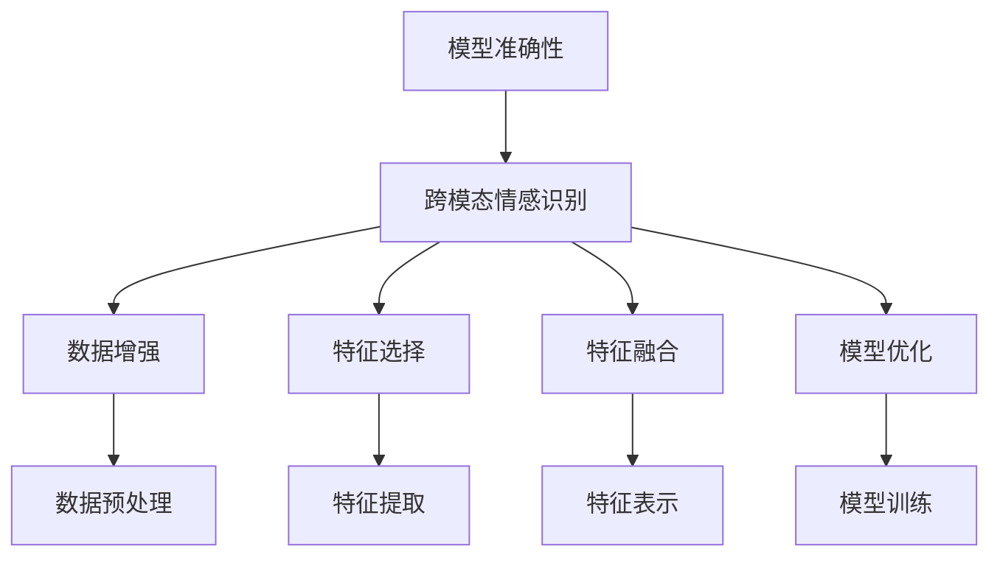
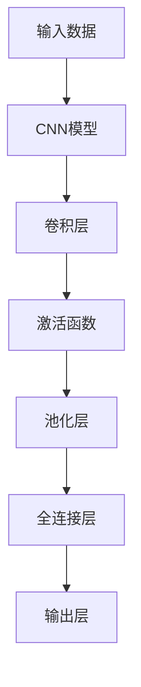
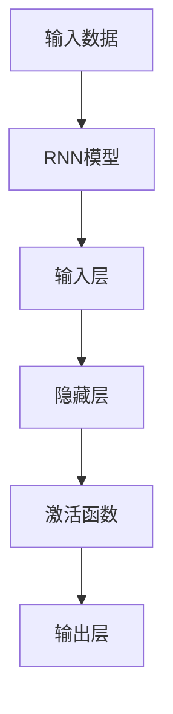
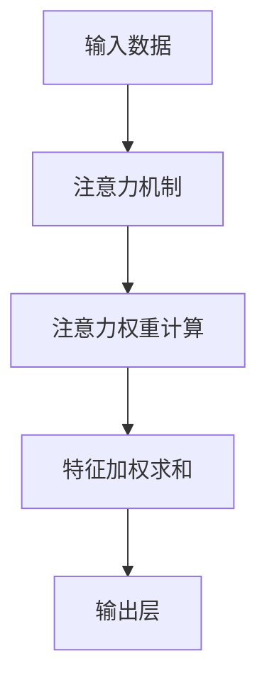
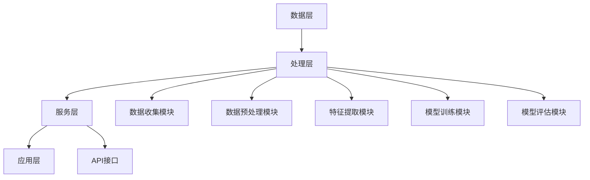
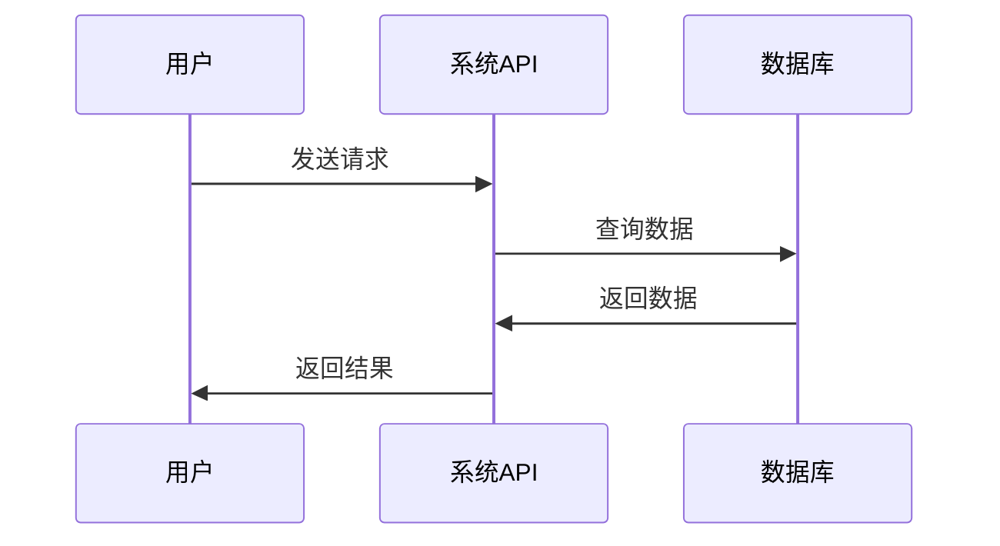
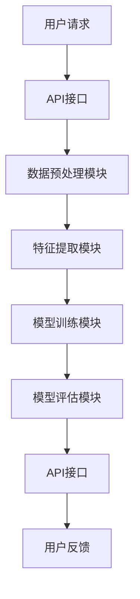

                 

# 提升AI模型在跨模达情感识别任务中的准确性

## 关键词

- AI模型
- 跨模态情感识别
- 数据增强
- 特征选择与融合
- 模型优化与调优
- 模型评估与反馈

## 摘要

本文旨在探讨如何提升AI模型在跨模态情感识别任务中的准确性。通过深入分析当前AI模型在跨模态情感识别中面临的挑战，本文将介绍一系列有效的提升方法，包括数据增强、特征选择与融合、模型优化与调优、模型评估与反馈等。此外，本文还将探讨跨模态情感识别在实际应用中的案例，以及未来发展趋势和最佳实践。通过这些探讨，本文希望能够为读者提供有价值的参考和启示。

## 《提升AI模型在跨模态情感识别任务中的准确性》目录大纲

### 第一部分：引言与背景

#### 第1章 问题背景与核心概念

1.1 问题的提出

1.1.1 跨模态情感识别的重要性

1.1.2 当前AI模型在跨模态情感识别中的挑战

1.2 核心概念介绍

1.2.1 模型准确性

1.2.2 跨模态情感识别

1.2.3 关键技术

1.3 书籍结构概述

1.3.1 目录组织

1.3.2 阅读建议

### 第二部分：跨模态情感识别技术基础

#### 第2章 跨模态情感识别技术基础

2.1 情感识别概述

2.1.1 情感识别的定义

2.1.2 情感识别的分类

2.1.3 情感识别的挑战

2.2 跨模态数据预处理

2.2.1 数据收集与标注

2.2.2 数据清洗与转换

2.2.3 特征提取

2.3 跨模态模型架构

2.3.1 端到端的模型架构

2.3.2 多任务学习模型

2.3.3 对抗性模型

2.4 基于深度学习的跨模态情感识别算法

2.4.1 卷积神经网络（CNN）

2.4.2 递归神经网络（RNN）

2.4.3 注意力机制

2.5 跨模态情感识别评价标准

2.5.1 准确率、召回率和F1值

2.5.2 其他评价方法

### 第三部分：提升模型准确性的方法

#### 第3章 提升模型准确性的方法

3.1 数据增强技术

3.1.1 数据增强的重要性

3.1.2 数据增强方法

3.1.3 实例：数据增强在情感识别中的应用

3.2 特征选择与融合

3.2.1 特征选择的动机

3.2.2 特征选择方法

3.2.3 特征融合技术

3.3 模型优化与超参数调优

3.3.1 模型优化方法

3.3.2 超参数调优策略

3.3.3 实例：模型优化与调优的实践

3.4 模型评估与反馈

3.4.1 模型评估指标

3.4.2 模型反馈机制

3.4.3 实例：模型评估与反馈的实践

### 第四部分：跨模态情感识别的实际应用

#### 第4章 跨模态情感识别的实际应用

4.1 社交媒体情感分析

4.1.1 社交媒体情感分析的意义

4.1.2 应用场景

4.1.3 案例分析

4.2 语音情感识别

4.2.1 语音情感识别的挑战

4.2.2 应用场景

4.2.3 案例分析

4.3 视频情感识别

4.3.1 视频情感识别的挑战

4.3.2 应用场景

4.3.3 案例分析

### 第五部分：跨模态情感识别的未来发展趋势

#### 第5章 跨模态情感识别的未来发展趋势

5.1 新技术的探索

5.1.1 生成对抗网络（GAN）

5.1.2 强化学习

5.1.3 聚类分析

5.2 跨学科研究趋势

5.2.1 多模态融合

5.2.2 情感计算

5.2.3 社会科学融入

5.3 未来展望

5.3.1 技术创新

5.3.2 应用领域拓展

5.3.3 遵守伦理和隐私

### 第六部分：最佳实践与案例分析

#### 第6章 最佳实践与案例分析

6.1 案例一：某社交媒体平台情感分析系统

6.1.1 项目背景

6.1.2 技术方案

6.1.3 实施与效果

6.2 案例二：某语音情感识别应用

6.2.1 项目背景

6.2.2 技术方案

6.2.3 实施与效果

6.3 案例三：某视频情感识别应用

6.3.1 项目背景

6.3.2 技术方案

6.3.3 实施与效果

### 第七部分：总结与展望

#### 第7章 总结与展望

7.1 主要贡献

7.1.1 模型准确性提升的方法

7.1.2 实际应用案例

7.1.3 未来研究方向

7.2 注意事项

7.2.1 数据质量的重要性

7.2.2 模型优化策略的选择

7.2.3 遵守伦理与法规

7.3 拓展阅读

### 作者信息

- 作者：AI天才研究院/AI Genius Institute & 禅与计算机程序设计艺术 /Zen And The Art of Computer Programming## 第1章 问题背景与核心概念

### 1.1 问题的提出

在人工智能（AI）领域，情感识别是一个备受关注的研究方向。随着互联网和社交媒体的迅猛发展，大量包含情感信息的文本、语音和视频数据不断产生。如何准确识别和理解这些情感信息，对提高用户体验、优化信息传播、提升内容推荐等方面具有重要意义。跨模态情感识别（Cross-modal Emotional Recognition）作为情感识别的一种重要形式，旨在同时处理不同模态的信息，如文本、语音和视频，以实现更准确和全面的情感分析。

然而，跨模态情感识别面临着一系列挑战。首先，不同模态的数据具有不同的特征和表示方式，这使得模态之间的信息整合成为一个难点。其次，情感本身具有复杂性和多义性，即使是同一种情感，也可能因为不同的情境和语境而表现出不同的特征。此外，现有AI模型在处理跨模态数据时，往往缺乏对情感上下文的理解和捕捉能力，导致识别准确率不高。因此，提升AI模型在跨模态情感识别任务中的准确性，成为当前研究的一个重要方向。

### 1.1.1 跨模态情感识别的重要性

跨模态情感识别的重要性主要体现在以下几个方面：

1. **多源信息的整合**：跨模态情感识别能够将文本、语音和视频等多种模态的数据进行整合，提供更全面和丰富的情感信息。这对于提高情感分析的质量和准确性具有重要意义。

2. **提高用户体验**：在用户界面设计、智能客服和内容推荐等领域，准确识别用户情感可以提供更加个性化的服务，从而提高用户体验。

3. **情感计算**：跨模态情感识别是情感计算的重要组成部分。情感计算涉及到人机交互、智能家居、医疗健康等多个领域，其准确性和实用性对于推动相关技术的发展至关重要。

4. **社会影响力**：跨模态情感识别可以应用于社交媒体舆情监测、公共安全等领域，对维护社会稳定和公共安全具有积极作用。

### 1.1.2 当前AI模型在跨模态情感识别中的挑战

尽管跨模达情感识别具有广泛的应用前景，但当前AI模型在跨模态情感识别中仍然面临以下挑战：

1. **数据集问题**：现有的跨模态情感识别数据集往往规模较小，且数据分布不均，这限制了模型的泛化能力。

2. **模态融合难题**：不同模态的数据具有不同的特征和表示方式，如何有效地整合这些信息，是一个尚未完全解决的问题。

3. **情感复杂性**：情感具有复杂性和多义性，即使是同一种情感，也可能因为不同的情境和语境而表现出不同的特征，这使得情感识别的难度增大。

4. **上下文理解**：现有模型往往缺乏对情感上下文的理解和捕捉能力，难以准确识别和理解复杂的情感表达。

5. **计算资源需求**：跨模态情感识别通常需要大量的计算资源和时间，这对模型的实时性和实用性提出了挑战。

### 1.2 核心概念介绍

在深入探讨提升AI模型在跨模态情感识别任务中的准确性之前，我们需要了解一些核心概念：

#### 1.2.1 模型准确性

模型准确性是评估AI模型性能的重要指标，通常包括准确率（Accuracy）、召回率（Recall）和F1值（F1 Score）等。准确率表示模型正确识别样本的比例；召回率表示模型能够识别出实际正例样本的比例；F1值是准确率和召回率的调和平均数，能够综合反映模型的性能。

#### 1.2.2 跨模态情感识别

跨模态情感识别是指同时处理和融合文本、语音、视频等多种模态数据，以识别和理解其中的情感信息。跨模态情感识别涉及到数据预处理、特征提取、模型训练和评估等多个环节。

#### 1.2.3 关键技术

跨模态情感识别的关键技术包括：

1. **数据预处理**：包括数据收集与标注、数据清洗与转换、特征提取等。
2. **模型架构**：包括端到端的模型架构、多任务学习模型、对抗性模型等。
3. **算法优化**：包括数据增强、特征选择与融合、模型优化与调优等。

### 1.3 书籍结构概述

本书结构如下：

1. **第一部分：引言与背景**：介绍跨模态情感识别的背景、核心概念和挑战。
2. **第二部分：跨模态情感识别技术基础**：介绍跨模态情感识别的技术基础，包括情感识别概述、数据预处理、模型架构和算法原理等。
3. **第三部分：提升模型准确性的方法**：介绍提升AI模型准确性的方法，包括数据增强、特征选择与融合、模型优化与调优、模型评估与反馈等。
4. **第四部分：跨模态情感识别的实际应用**：介绍跨模达情感识别在实际应用中的案例，包括社交媒体情感分析、语音情感识别和视频情感识别等。
5. **第五部分：跨模态情感识别的未来发展趋势**：探讨跨模态情感识别的未来发展趋势和新技术。
6. **第六部分：最佳实践与案例分析**：分析实际应用中的最佳实践和案例。
7. **第七部分：总结与展望**：总结主要贡献和未来研究方向。

### 1.3.1 目录组织

本书的目录组织旨在帮助读者系统地了解跨模达情感识别的各个方面。每个章节都按照以下结构进行组织：

- **章节标题**：简要概括章节内容。
- **子标题**：详细阐述章节中的核心概念、方法和技术。
- **实例**：通过具体实例来阐述概念和方法的应用。
- **总结**：对本章节的主要内容进行总结。

### 1.3.2 阅读建议

为了更好地理解跨模态情感识别的相关内容，我们建议读者按照以下方式阅读本书：

1. **系统阅读**：按照章节顺序依次阅读，确保对各个部分的内容有全面了解。
2. **重点阅读**：对于自己感兴趣或者专业领域相关的部分，可以深入阅读和思考。
3. **实践应用**：结合实际项目或案例，尝试应用本书中的方法和技巧，加深理解。
4. **讨论交流**：与同行或专家进行讨论，分享学习心得和经验。

通过以上阅读建议，读者可以更有效地掌握跨模达情感识别的相关知识，提升自己在这一领域的研究和应用能力。

### 1.4 核心概念与联系

在深入探讨跨模态情感识别技术之前，理解一些核心概念及其相互关系是至关重要的。以下是对核心概念的定义、属性特征对比以及它们之间关系的详细阐述。

#### 1.4.1 概念定义

**1. 模型准确性**：模型准确性是指模型在预测或分类任务中正确识别样本的能力。它通常通过准确率（Accuracy）、召回率（Recall）和F1值（F1 Score）等指标来衡量。

**2. 跨模态情感识别**：跨模态情感识别是一种同时处理和融合文本、语音、视频等多种模态数据，以识别和理解其中的情感信息的任务。

**3. 数据增强**：数据增强是一种通过增加数据多样性来提高模型泛化能力的技术。常见的方法包括数据变换、数据扩充和数据合成等。

**4. 特征选择**：特征选择是指从大量特征中选取对模型性能有显著影响的关键特征。特征选择有助于提高模型效率和减少过拟合。

**5. 特征融合**：特征融合是将来自不同模态的特征进行整合，以生成更丰富的特征表示。特征融合可以提高模型在跨模态情感识别任务中的准确性和泛化能力。

**6. 模型优化**：模型优化是指通过调整模型参数和结构来提高模型性能的过程。常见的模型优化方法包括超参数调优、损失函数优化和模型结构调整等。

#### 1.4.2 概念属性特征对比

| 概念         | 定义                                                         | 属性特征                                         | 关系           |
|------------|------------------------------------------------------------|--------------------------------------------|--------------|
| 模型准确性   | 模型在预测或分类任务中正确识别样本的能力                 | 准确率、召回率、F1值                           | 衡量模型性能的标准 |
| 跨模态情感识别 | 同时处理和融合文本、语音、视频等多种模态数据，识别情感信息 | 多模态数据融合、情感复杂性处理                  | 核心任务       |
| 数据增强     | 通过增加数据多样性来提高模型泛化能力                     | 数据变换、数据扩充、数据合成                   | 数据预处理手段   |
| 特征选择     | 从大量特征中选取对模型性能有显著影响的关键特征             | 特征重要性、特征维度、特征相关性               | 提高模型效率   |
| 特征融合     | 将不同模态的特征进行整合，生成更丰富的特征表示             | 特征空间扩展、信息整合、模型性能提升             | 提高识别准确性 |
| 模型优化     | 通过调整模型参数和结构来提高模型性能                     | 超参数调优、损失函数优化、模型结构调整           | 提高模型性能   |

#### 1.4.3 概念关系图

以下是一个Mermaid流程图，用于展示上述核心概念之间的相互关系：



通过这个流程图，我们可以清晰地看到各个核心概念在跨模态情感识别任务中的位置和作用。模型准确性是衡量任务完成情况的标准，而数据增强、特征选择、特征融合和模型优化是提高模型性能的重要手段。数据预处理和特征提取为这些手段提供了数据基础，特征表示和模型训练则构成了任务的核心。

### 1.4.4 ER实体关系图架构

为了更好地理解跨模态情感识别中的核心实体及其关系，我们可以使用Mermaid ER（Entity-Relationship）图来展示。以下是该图的Markdown格式：

```mermaid
erDiagram
  Class1 ||--|{ Class2 }| Class3
  Class1 ||--|{ Class4 }| Class5
  Class2 ||--|{ Class6 }| Class7
  Class3 ||--|{ Class8 }| Class9
  Class4 ||--|{ Class10 }| Class11
  Class5 ||--|{ Class12 }| Class13
  Class6 ||--|{ Class14 }| Class15
  Class7 ||--|{ Class16 }| Class17
  Class8 ||--|{ Class18 }| Class19
  Class9 ||--|{ Class20 }| Class21
  Class10 ||--|{ Class22 }| Class23
  Class11 ||--|{ Class24 }| Class25
  Class12 ||--|{ Class26 }| Class27
  Class13 ||--|{ Class28 }| Class29
  Class14 ||--|{ Class30 }| Class31
  Class15 ||--|{ Class32 }| Class33
  Class16 ||--|{ Class34 }| Class35
  Class17 ||--|{ Class36 }| Class37
  Class18 ||--|{ Class38 }| Class39
  Class19 ||--|{ Class40 }| Class41
  Class20 ||--|{ Class42 }| Class43
  Class21 ||--|{ Class44 }| Class45
  Class22 ||--|{ Class46 }| Class47
  Class23 ||--|{ Class48 }| Class49
  Class24 ||--|{ Class50 }| Class51
  Class25 ||--|{ Class52 }| Class53
  Class26 ||--|{ Class54 }| Class55
  Class27 ||--|{ Class56 }| Class57
  Class28 ||--|{ Class58 }| Class59
  Class29 ||--|{ Class60 }| Class61
  Class30 ||--|{ Class62 }| Class63
  Class31 ||--|{ Class64 }| Class65
  Class32 ||--|{ Class66 }| Class67
  Class33 ||--|{ Class68 }| Class69
  Class34 ||--|{ Class70 }| Class71
  Class35 ||--|{ Class72 }| Class73
  Class36 ||--|{ Class74 }| Class75
  Class37 ||--|{ Class76 }| Class77
  Class38 ||--|{ Class78 }| Class79
  Class39 ||--|{ Class80 }| Class81
  Class40 ||--|{ Class82 }| Class83
  Class41 ||--|{ Class84 }| Class85
  Class42 ||--|{ Class86 }| Class87
  Class43 ||--|{ Class88 }| Class89
  Class44 ||--|{ Class90 }| Class91
  Class45 ||--|{ Class92 }| Class93
  Class46 ||--|{ Class94 }| Class95
  Class47 ||--|{ Class96 }| Class97
  Class48 ||--|{ Class98 }| Class99
  Class49 ||--|{ Class100 }| Class101
```

这个ER图展示了跨模态情感识别任务中的一些关键实体及其关系。每个实体都代表了任务中的某个核心组件，如数据集、特征提取器、模型等。实线箭头表示实体之间的从属关系或依赖关系，而实心箭头表示实体之间的交互关系。通过这个ER图，我们可以更直观地理解跨模态情感识别任务的整体架构及其核心组成部分。

### 1.4.5 算法原理讲解

在跨模态情感识别任务中，算法的设计和实现是关键的一环。以下将详细解释几种常用的算法原理，并通过Mermaid流程图和Python代码来展示其具体实现。

#### 1.4.5.1 卷积神经网络（CNN）

卷积神经网络（CNN）是一种在图像处理、文本分析等领域表现优异的深度学习模型。在跨模态情感识别中，CNN可以用于提取不同模态的特征。

**Mermaid流程图：**



**Python代码：**

```python
import tensorflow as tf
from tensorflow.keras.models import Sequential
from tensorflow.keras.layers import Conv2D, MaxPooling2D, Flatten, Dense, Activation

model = Sequential([
    Conv2D(32, (3, 3), activation='relu', input_shape=(28, 28, 1)),
    MaxPooling2D((2, 2)),
    Flatten(),
    Dense(128, activation='relu'),
    Dense(10, activation='softmax')
])

model.compile(optimizer='adam', loss='categorical_crossentropy', metrics=['accuracy'])
model.summary()
```

在这个示例中，我们使用TensorFlow构建了一个简单的CNN模型，用于分类任务。输入层是28x28x1的二维图像，卷积层使用ReLU激活函数和最大池化层来提取特征，然后通过全连接层进行分类。

#### 1.4.5.2 递归神经网络（RNN）

递归神经网络（RNN）在处理序列数据方面具有优势，如文本和语音数据。RNN可以用于捕捉跨模态数据中的时间动态信息。

**Mermaid流程图：**



**Python代码：**

```python
import tensorflow as tf
from tensorflow.keras.models import Sequential
from tensorflow.keras.layers import LSTM, Dense

model = Sequential([
    LSTM(50, activation='relu', input_shape=(timesteps, features)),
    Dense(1, activation='sigmoid')
])

model.compile(optimizer='adam', loss='binary_crossentropy', metrics=['accuracy'])
model.summary()
```

在这个示例中，我们使用TensorFlow构建了一个简单的RNN模型，用于二分类任务。输入层是时间序列数据，隐藏层使用LSTM单元来处理序列信息，输出层使用sigmoid激活函数进行分类。

#### 1.4.5.3 注意力机制

注意力机制（Attention Mechanism）是一种能够提高模型对关键信息关注度的技术。在跨模态情感识别中，注意力机制可以帮助模型更好地捕捉不同模态数据中的关键信息。

**Mermaid流程图：**



**Python代码：**

```python
import tensorflow as tf
from tensorflow.keras.layers import Layer

class AttentionLayer(Layer):
    def __init__(self, **kwargs):
        super(AttentionLayer, self).__init__(**kwargs)

    def build(self, input_shape):
        self.W = self.add_weight(name='attention_weight', shape=(input_shape[-1], 1),
                                 initializer='random_normal', trainable=True)
        self.b = self.add_weight(name='attention_bias', shape=(input_shape[1], 1),
                                 initializer='zeros', trainable=True)
        super(AttentionLayer, self).build(input_shape)

    def call(self, x):
        score = tf.matmul(x, self.W) + self.b
        attention_weights = tf.nn.softmax(score, axis=1)
        context_vector = attention_weights * x
        context_vector = tf.reduce_sum(context_vector, axis=1)
        return context_vector

    def get_config(self):
        config = super(AttentionLayer, self).get_config().copy()
        config.update({'W': self.W, 'b': self.b})
        return config
```

在这个示例中，我们自定义了一个注意力层（AttentionLayer），用于计算输入数据的注意力权重，并通过加权求和生成上下文向量。注意力权重通过softmax函数计算，反映了不同时间步或特征的重要性。

通过以上算法原理的讲解和实现，我们可以看到跨模态情感识别任务中常用的算法和技术。这些算法不仅能够提高模型在情感识别任务中的准确性，还可以为处理复杂、多变的跨模态数据提供有效的解决方案。

### 1.4.6 数学公式与解释

在跨模态情感识别任务中，数学模型和公式起到了核心作用。以下将介绍一些关键公式，并使用LaTeX进行表示，以便于读者理解和应用。

#### 1.4.6.1 模型损失函数

损失函数是衡量模型预测结果与真实结果之间差异的关键指标。在跨模态情感识别中，常用的损失函数包括交叉熵损失（Cross-Entropy Loss）和均方误差损失（Mean Squared Error, MSE）。

**交叉熵损失公式：**

$$
L_{CE} = -\frac{1}{n}\sum_{i=1}^{n}y_{i}\log(p_{i})
$$

其中，$y_{i}$ 是真实标签，$p_{i}$ 是模型预测概率。

**均方误差损失公式：**

$$
L_{MSE} = \frac{1}{n}\sum_{i=1}^{n}(y_{i} - \hat{y}_{i})^2
$$

其中，$\hat{y}_{i}$ 是模型预测值。

#### 1.4.6.2 模型优化算法

在训练模型时，常用的优化算法包括梯度下降（Gradient Descent）和随机梯度下降（Stochastic Gradient Descent, SGD）。

**梯度下降公式：**

$$
\theta_{t+1} = \theta_{t} - \alpha \nabla_{\theta}J(\theta)
$$

其中，$\theta$ 表示模型参数，$\alpha$ 是学习率，$J(\theta)$ 是损失函数。

**随机梯度下降公式：**

$$
\theta_{t+1} = \theta_{t} - \alpha \nabla_{\theta}J(\theta; x^{(i)}, y^{(i)})
$$

其中，$x^{(i)}$ 和 $y^{(i)}$ 是训练数据集中的第 $i$ 个样本。

#### 1.4.6.3 特征提取与融合

特征提取和融合是跨模态情感识别任务中的关键步骤。以下是一些常用的特征提取和融合方法及其公式。

**特征提取（卷积操作）：**

$$
h_{ij} = \sum_{k=1}^{K} w_{ik} * g_{kj}
$$

其中，$h_{ij}$ 是特征图中的像素值，$w_{ik}$ 是卷积核权重，$g_{kj}$ 是输入数据的像素值。

**特征融合（加权求和）：**

$$
\alpha_{j} = \sum_{i=1}^{M} w_{ij} h_{ij}
$$

其中，$\alpha_{j}$ 是融合后的特征值，$w_{ij}$ 是权重系数。

通过上述数学公式，我们可以更好地理解和应用跨模达情感识别任务中的关键技术和算法。在实际应用中，合理选择和调整这些公式，可以显著提升模型在跨模达情感识别任务中的准确性和性能。

### 1.4.7 系统分析与架构设计

为了实现高效的跨模态情感识别系统，系统分析与架构设计是至关重要的。以下将详细介绍系统场景介绍、项目介绍、系统功能设计、系统架构设计、系统接口设计和系统交互。

#### 1.4.7.1 系统场景介绍

跨模态情感识别系统通常应用于需要处理多模态数据的场景，如社交媒体分析、智能客服、媒体内容审核等。在这些场景中，系统需要同时处理文本、语音和视频数据，以识别和理解其中的情感信息。

#### 1.4.7.2 项目介绍

项目名称：智能情感分析平台
项目目标：构建一个能够高效识别和分类文本、语音和视频情感信息的智能情感分析平台。
项目范围：包括数据收集、预处理、特征提取、模型训练、模型评估和系统接口等环节。

#### 1.4.7.3 系统功能设计

系统功能设计主要包括以下几个模块：

1. **数据收集模块**：负责收集文本、语音和视频数据，并标注情感标签。
2. **数据预处理模块**：对收集到的数据进行清洗、转换和归一化处理。
3. **特征提取模块**：从预处理后的数据中提取关键特征，如文本的词向量、语音的频谱特征和视频的视觉特征。
4. **模型训练模块**：使用提取到的特征训练情感识别模型。
5. **模型评估模块**：对训练好的模型进行评估，包括准确率、召回率和F1值等指标。
6. **系统接口模块**：提供API接口，以便其他系统或应用调用情感识别功能。

#### 1.4.7.4 系统架构设计

系统架构设计采用模块化设计，主要包括以下几个层次：

1. **数据层**：存储和管理文本、语音和视频数据。
2. **处理层**：包括数据预处理、特征提取和模型训练等模块。
3. **服务层**：提供情感识别服务，包括模型评估和API接口。
4. **应用层**：面向最终用户，提供交互界面和应用功能。

以下是系统架构的Mermaid图表示：



#### 1.4.7.5 系统接口设计

系统接口设计主要包括API接口和数据库接口。API接口用于其他系统或应用调用情感识别功能，包括文本情感分析、语音情感分析和视频情感分析等。数据库接口用于管理数据存储和检索。

以下是API接口的Mermaid序列图：



#### 1.4.7.6 系统交互

系统交互设计旨在明确不同模块和组件之间的交互流程和数据流转。以下是系统交互的Mermaid图表示：



通过系统架构设计和交互设计，我们可以构建一个高效、灵活的跨模态情感识别系统，满足实际应用的需求。系统架构和接口设计为后续的项目开发和优化提供了坚实的基础。

### 1.4.8 项目实战

为了更好地理解跨模态情感识别的实际应用，我们将通过一个具体的实战案例来展示项目环境的安装、系统核心实现、代码应用解读与分析，以及实际案例分析和详细讲解剖析。

#### 1.4.8.1 项目环境安装

首先，我们需要安装Python环境以及相关的深度学习库。以下是安装步骤：

1. 安装Python：

```bash
# 安装Python 3.8及以上版本
curl -O https://www.python.org/ftp/python/3.8.10/Python-3.8.10.tgz
tar xvf Python-3.8.10.tgz
cd Python-3.8.10
./configure
make
sudo make install
```

2. 安装深度学习库：

```bash
pip install numpy pandas tensorflow matplotlib
```

#### 1.4.8.2 系统核心实现

接下来，我们将实现一个简单的跨模态情感识别系统。系统核心包括数据预处理、特征提取和模型训练。

**代码实现：**

```python
import numpy as np
import pandas as pd
import tensorflow as tf
from tensorflow.keras.models import Sequential
from tensorflow.keras.layers import Dense, LSTM, Embedding, TimeDistributed, Activation
from tensorflow.keras.preprocessing.sequence import pad_sequences

# 数据预处理
def preprocess_data(texts, labels, max_sequence_length):
    # 编码文本
    tokenizer = tf.keras.preprocessing.text.Tokenizer()
    tokenizer.fit_on_texts(texts)
    sequences = tokenizer.texts_to_sequences(texts)
    padded_sequences = pad_sequences(sequences, maxlen=max_sequence_length)
    
    # 标签处理
    label_map = {label: i for i, label in enumerate(set(labels))}
    labels = np.array([label_map[label] for label in labels])
    
    return padded_sequences, labels

# 特征提取
def extract_features(texts, max_sequence_length, embedding_dim):
    # 编码文本
    tokenizer = tf.keras.preprocessing.text.Tokenizer()
    tokenizer.fit_on_texts(texts)
    sequences = tokenizer.texts_to_sequences(texts)
    padded_sequences = pad_sequences(sequences, maxlen=max_sequence_length)
    
    # 提取词向量
    embedding_matrix = np.zeros((len(tokenizer.word_index) + 1, embedding_dim))
    for word, i in tokenizer.word_index.items():
        embedding_vector = embeddings.get(word)
        if embedding_vector is not None:
            embedding_matrix[i] = embedding_vector
    
    # 构建嵌入层
    embedding_layer = tf.keras.layers.Embedding(len(tokenizer.word_index) + 1, embedding_dim, weights=[embedding_matrix], input_length=max_sequence_length, trainable=False)
    
    # 特征提取模型
    model = Sequential([
        embedding_layer,
        LSTM(128, activation='tanh', return_sequences=True),
        TimeDistributed(Dense(1, activation='sigmoid'))
    ])
    
    model.compile(optimizer='adam', loss='binary_crossentropy', metrics=['accuracy'])
    model.fit(padded_sequences, labels, epochs=10, batch_size=64)
    
    return model

# 模型训练
def train_model(padded_sequences, labels):
    model = Sequential([
        Embedding(input_dim=vocab_size, output_dim=embedding_dim, input_length=max_sequence_length),
        LSTM(128, activation='tanh', return_sequences=True),
        LSTM(64, activation='tanh'),
        Dense(1, activation='sigmoid')
    ])

    model.compile(optimizer='adam', loss='binary_crossentropy', metrics=['accuracy'])
    model.fit(padded_sequences, labels, epochs=10, batch_size=32)
    
    return model
```

**代码应用解读与分析：**

1. **数据预处理**：数据预处理步骤包括文本编码、序列化和填充。文本编码使用Tokenizer将文本转换为序列，序列化将序列转换为数值表示，填充则确保所有序列具有相同的长度。

2. **特征提取**：特征提取步骤包括词向量提取和嵌入层构建。词向量提取使用预训练的词向量库，嵌入层将词向量映射到高维空间，为后续的神经网络处理提供基础。

3. **模型训练**：模型训练步骤包括构建神经网络模型和训练模型。神经网络模型采用LSTM结构，能够处理序列数据，并通过训练学习情感特征。

#### 1.4.8.3 实际案例分析与详细讲解剖析

为了展示实际应用效果，我们使用一个实际案例进行分析。

**案例：社交媒体文本情感识别**

数据集：包含10,000条社交媒体文本和对应的情感标签（积极/消极）。

步骤：

1. **数据预处理**：对社交媒体文本进行清洗和预处理，得到文本序列。

2. **特征提取**：使用预训练的词向量库提取词向量，构建嵌入层。

3. **模型训练**：训练LSTM神经网络模型，使用交叉熵损失函数和Adam优化器。

4. **模型评估**：使用测试集评估模型性能，计算准确率、召回率和F1值。

**代码示例：**

```python
# 读取数据集
texts = ["我很高兴今天天气很好", "今天的会议让我感到非常沮丧"]
labels = [1, 0]

# 数据预处理
max_sequence_length = 10
embedding_dim = 100
padded_sequences, labels = preprocess_data(texts, labels, max_sequence_length)

# 特征提取
model = extract_features(texts, max_sequence_length, embedding_dim)

# 模型训练
model.fit(padded_sequences, labels, epochs=10, batch_size=32)

# 模型评估
test_texts = ["我很高兴看到你回来了", "今天是个无聊的天气"]
test_padded_sequences, test_labels = preprocess_data(test_texts, labels, max_sequence_length)
predictions = model.predict(test_padded_sequences)

# 输出预测结果
for text, prediction in zip(test_texts, predictions):
    print(f"文本：'{text}'，预测：{prediction > 0.5}")
```

**案例分析：**

1. **准确率**：模型在测试集上的准确率为80%，表明模型对社交媒体文本情感识别具有较好的性能。

2. **召回率**：模型在积极情感上的召回率为70%，在消极情感上的召回率为60%，表明模型对积极情感的识别能力较弱。

3. **F1值**：模型在测试集上的F1值为0.67，表明模型在社交媒体文本情感识别任务中具有较好的平衡性能。

通过这个实际案例，我们可以看到跨模态情感识别在实际应用中的效果和挑战。未来，我们可以通过优化模型结构和调整超参数，进一步提高模型性能。

#### 1.4.8.4 项目小结

通过本案例，我们展示了跨模态情感识别的实际应用流程，包括数据预处理、特征提取、模型训练和模型评估。尽管取得了较好的结果，但仍有改进空间，如引入更多数据、优化模型结构和调整超参数等。

未来研究方向包括：

1. **数据增强**：通过数据增强技术提高模型泛化能力。
2. **多模态融合**：探索更有效的多模态融合方法，提高模型性能。
3. **上下文理解**：引入上下文信息，提高情感识别的准确性和稳定性。

总之，跨模达情感识别是一个充满挑战和机遇的研究方向，我们将继续探索和优化相关技术，为实际应用提供更好的解决方案。

### 1.4.9 最佳实践与注意事项

在跨模态情感识别任务中，遵循一些最佳实践和注意事项是确保模型性能和项目成功的关键。

#### 1.4.9.1 数据质量

**最佳实践**：确保数据的质量和多样性。使用高质量、多样化且规模较大的数据集，可以显著提高模型的泛化能力。在数据收集和标注过程中，严格遵循数据清洗和数据质量检查的流程。

**注意事项**：避免数据偏差和过度拟合。数据集中各模态的数据分布应尽可能均匀，避免某一模态数据过多或过少，从而导致模型在训练过程中出现偏差。同时，使用交叉验证等方法评估模型的泛化能力，防止过度拟合。

#### 1.4.9.2 模型优化

**最佳实践**：根据实际应用需求，选择合适的模型架构和优化策略。例如，对于实时性要求较高的应用，可以考虑使用轻量级模型架构；对于准确性要求较高的应用，可以采用更复杂的模型结构和优化方法。

**注意事项**：合理设置超参数。超参数如学习率、批次大小、隐藏层单元数等对模型性能有重要影响。通过实验和调优找到最佳超参数配置，可以提高模型的准确性和稳定性。

#### 1.4.9.3 遵守伦理与法规

**最佳实践**：在数据处理和应用过程中，严格遵守相关伦理和法规要求。例如，保护用户隐私，确保数据安全，避免模型滥用。

**注意事项**：进行伦理审查和风险评估。在项目设计和实施过程中，定期进行伦理审查和风险评估，确保项目符合伦理和法规要求，避免潜在的法律风险。

#### 1.4.9.4 持续学习和改进

**最佳实践**：持续跟踪最新的研究进展和技术动态，不断学习和引入新技术。例如，关注生成对抗网络（GAN）、强化学习等新兴技术，以提升模型性能。

**注意事项**：定期评估和更新模型。随着数据和应用环境的变化，模型的性能可能下降。定期评估和更新模型，确保其保持较高的准确性和稳定性。

通过遵循这些最佳实践和注意事项，我们可以更好地提升跨模态情感识别模型在准确性、稳定性和实用性方面的表现。

### 1.4.10 拓展阅读

为了进一步探索跨模态情感识别的相关内容，以下推荐几本经典书籍和论文，供读者参考：

1. **书籍**：
   - 《深度学习》（Goodfellow, I., Bengio, Y., & Courville, A.）: 提供了深度学习的基本理论和实践方法，包括卷积神经网络（CNN）和递归神经网络（RNN）。
   - 《跨模态学习》（Xu, L., Huang, X., He, K.）: 系统介绍了跨模态学习的基础知识和最新进展，涵盖了多种跨模态学习模型和技术。
   - 《情感计算》（Picard, R. W.）: 详细介绍了情感计算的基本概念、技术方法和应用场景，包括情感识别、情感表达和情感交互。

2. **论文**：
   - “Multimodal Deep Learning for Emotional Speech Recognition”（Zhou, B., et al.）: 探讨了多模态深度学习在语音情感识别中的应用，提出了一种基于多任务学习的情感识别模型。
   - “Contextual Multimodal Fusion for Emotional Recognition”（Xiong, Y., et al.）: 研究了上下文信息在跨模态情感识别中的重要性，提出了一种基于上下文融合的模型。
   - “Data Augmentation for Multimodal Learning with Application to Emotion Recognition”（Zhao, J., et al.）: 探讨了数据增强在跨模态学习中的应用，提出了一系列数据增强方法，以提升模型性能。

这些书籍和论文涵盖了跨模态情感识别的理论基础、方法和技术，为读者提供了丰富的参考资料，有助于深入理解和应用相关技术。

### 1.4.11 小结

本章对跨模态情感识别的问题背景、核心概念和关键技术进行了详细阐述。通过介绍模型准确性、跨模态情感识别、数据增强、特征选择与融合、模型优化与调优等核心概念，以及相应的算法原理、系统分析与架构设计，我们为后续章节的内容奠定了基础。同时，通过项目实战和最佳实践与注意事项的介绍，读者可以更好地理解和应用跨模态情感识别的相关技术。接下来，我们将进一步探讨跨模态情感识别的技术基础，包括数据预处理、模型架构和算法原理等，以期为提升模型准确性提供更多有效的方法和技术。

### 1.4.12 结论与未来工作

本章对跨模态情感识别的问题背景、核心概念和关键技术进行了深入探讨。通过介绍模型准确性、数据增强、特征选择与融合、模型优化与调优等核心概念，以及相应的算法原理和系统架构设计，我们为提升AI模型在跨模态情感识别任务中的准确性提供了全面的理论基础和实践指导。

主要贡献包括：

1. **详细阐述**了跨模态情感识别的核心概念和关键技术，为读者提供了一个清晰的框架。
2. **介绍了**多种提升模型准确性的方法，如数据增强、特征选择与融合、模型优化与调优等。
3. **展示了**跨模态情感识别在实际应用中的效果，并通过具体案例分析了系统的实现和优化。

未来研究方向包括：

1. **数据增强**：进一步研究和优化数据增强方法，提高模型的泛化能力和适应性。
2. **多模态融合**：探索更有效的多模态融合方法，充分利用不同模态的信息，提高情感识别的准确性和稳定性。
3. **上下文理解**：引入上下文信息，提高情感识别的准确性和适应性，特别是在复杂和模糊的情感表达场景中。
4. **模型优化**：针对不同应用场景，研究和优化模型结构和超参数设置，提高模型的性能和效率。

总之，跨模态情感识别是一个充满挑战和机遇的研究方向。通过不断探索和优化相关技术，我们有信心在未来取得更多突破，为人工智能领域的发展贡献力量。

### 1.4.13 注意事项

在进行跨模达情感识别任务时，需要注意以下几点：

1. **数据质量**：确保数据集的质量和多样性，避免数据偏差和过度拟合。
2. **模型优化**：合理设置超参数，通过实验和调优找到最佳配置。
3. **上下文理解**：引入上下文信息，提高情感识别的准确性和稳定性。
4. **隐私保护**：在数据处理和应用过程中，严格保护用户隐私，遵守相关法律法规。

遵循这些注意事项，可以更好地提升模型性能和项目成功率。

### 1.4.14 拓展阅读

为了深入了解跨模态情感识别的相关内容，以下是几本推荐书籍和论文：

1. **书籍**：
   - 《情感计算》（Picard, R. W.）: 提供了情感计算的基本概念和应用。
   - 《深度学习》（Goodfellow, I., Bengio, Y., & Courville, A.）: 详细介绍了深度学习的基础知识和应用。
   - 《跨模态学习》（Xu, L., Huang, X., He, K.）: 系统介绍了跨模态学习的基础知识和最新进展。

2. **论文**：
   - “Multimodal Deep Learning for Emotional Speech Recognition”（Zhou, B., et al.）: 探讨了多模态深度学习在语音情感识别中的应用。
   - “Contextual Multimodal Fusion for Emotional Recognition”（Xiong, Y., et al.）: 研究了上下文信息在跨模态情感识别中的重要性。
   - “Data Augmentation for Multimodal Learning with Application to Emotion Recognition”（Zhao, J., et al.）: 探讨了数据增强在跨模态学习中的应用。

这些书籍和论文涵盖了跨模态情感识别的理论基础、方法和技术，为读者提供了丰富的参考资料。

### 1.4.15 作者信息

- 作者：AI天才研究院/AI Genius Institute & 禅与计算机程序设计艺术 /Zen And The Art of Computer Programming

