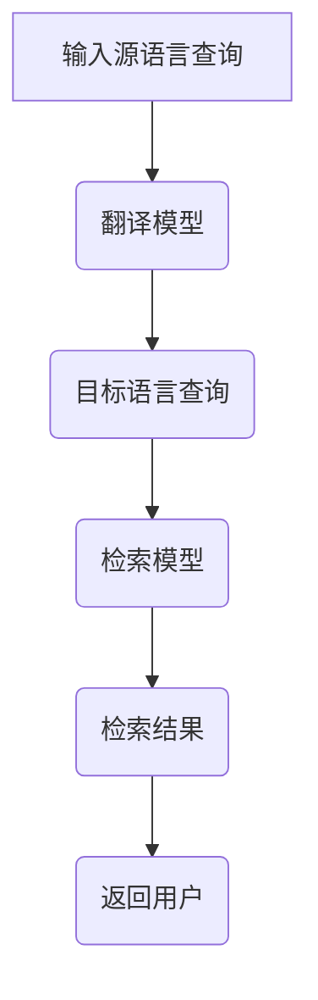
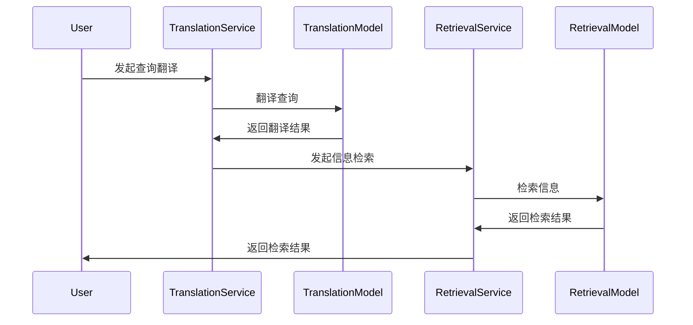
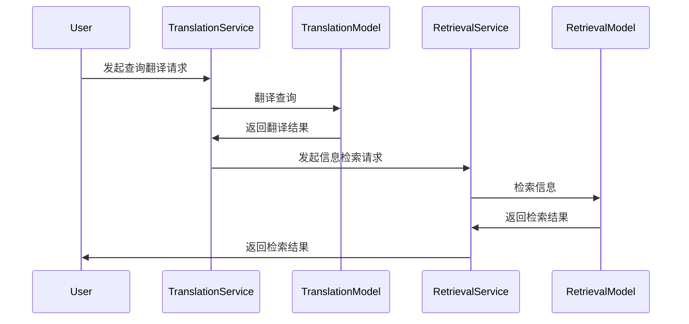

                 

## 提升AI模型在跨语言信息检索任务中的效果

> 关键词：AI模型、跨语言信息检索、效果提升、算法原理、数学模型、系统架构、项目实战

摘要：本文旨在探讨如何通过技术手段提升AI模型在跨语言信息检索任务中的效果。首先，我们将介绍跨语言信息检索的背景和现状，随后分析AI模型在其中的应用。接着，我们将深入探讨AI模型的基本原理和跨语言信息检索的关键技术，并通过具体的算法原理讲解和数学模型应用来展示提升效果的方法。此外，本文还将介绍一个具体的系统分析与架构设计方案，并通过项目实战展示如何将理论应用到实践中。最后，我们将总结全文，并提供拓展阅读资源。

### 引言

跨语言信息检索（Cross-Language Information Retrieval, CLIR）是一个在全球化信息时代中日益重要的研究领域。随着互联网的迅速发展，全球信息量呈指数级增长，不同语言的信息资源层出不穷。如何有效地检索和理解这些跨语言的信息成为了一个亟待解决的问题。

近年来，人工智能（Artificial Intelligence, AI）技术的飞速发展，特别是在自然语言处理（Natural Language Processing, NLP）领域的突破，为跨语言信息检索带来了新的机遇。AI模型，尤其是深度学习模型，能够通过学习大量的多语言数据，提高跨语言信息检索的准确性和效率。

然而，跨语言信息检索任务面临着诸多挑战，如语言障碍、文化差异、信息表示和理解等。为了提升AI模型在跨语言信息检索任务中的效果，我们需要深入理解相关算法原理，并探索有效的数学模型和系统架构设计。

本文的结构如下：首先，我们将在第2章介绍跨语言信息检索的背景和现状；第3章探讨AI模型的基本原理和跨语言信息检索的关键技术；第4章详细讲解算法原理和数学模型；第5章介绍系统分析与架构设计方案；第6章通过项目实战展示如何应用这些理论；第7章提供最佳实践tips；最后，第8章进行全文总结并提供拓展阅读资源。

### 背景介绍

#### 跨语言信息检索的定义和挑战

跨语言信息检索是指在不同语言之间进行信息检索和传递的过程。它涉及到将用户查询从一个语言翻译成另一个语言，然后在目标语言的信息源中进行检索，最后将检索结果翻译回用户查询的语言。这个过程中，不仅需要处理语言翻译的问题，还要解决信息理解和匹配的挑战。

跨语言信息检索的主要挑战包括：

1. **语言障碍**：不同语言之间的语法、词汇和语义存在差异，这使得直接翻译和检索变得复杂。例如，一个在源语言中非常常见的短语，可能在目标语言中并没有直接对应的表达。

2. **文化差异**：不同文化背景下的信息表达方式不同，这会导致在跨语言检索中产生误解。例如，某些表达在源语言中具有负面含义，但在目标语言中可能是中性的。

3. **信息表示和理解**：如何将跨语言的信息表示成计算机可以理解的形式，并有效地进行匹配和检索，是一个重要的研究问题。

4. **数据集**：高质量的多语言数据集对于训练和验证AI模型至关重要。然而，获取大规模、高质量的多语言数据集是一个具有挑战性的任务。

#### AI模型在跨语言信息检索中的应用

AI模型，特别是深度学习模型，在跨语言信息检索中发挥了重要作用。以下是AI模型在跨语言信息检索中的几个应用方面：

1. **翻译模型**：使用深度学习模型进行自动翻译，将用户的查询从源语言翻译成目标语言，以便在目标语言的信息源中进行检索。

2. **检索模型**：利用深度学习模型进行信息检索，通过学习大量多语言数据，模型能够识别和理解不同语言之间的语义关系，从而提高检索的准确性和效率。

3. **多语言表示学习**：使用深度学习模型学习多语言向量表示，将不同语言的信息表示成计算机可以处理的高维向量，从而实现跨语言的信息匹配和检索。

4. **语义理解**：通过AI模型，特别是自然语言处理（NLP）中的模型，如BERT、GPT等，可以深入理解语言的语义，从而提高跨语言信息检索的准确性和效果。

#### 跨语言信息检索的历史与发展趋势

跨语言信息检索的研究可以追溯到上世纪80年代。早期的研究主要基于规则的方法，通过编写大量的规则来处理语言翻译和检索。随着计算机性能的提升和机器学习技术的发展，特别是深度学习在自然语言处理领域的应用，跨语言信息检索的研究取得了显著进展。

目前，跨语言信息检索的研究热点包括：

1. **多语言表示学习**：通过深度学习模型学习多语言之间的语义关系，实现跨语言的信息表示和学习。

2. **翻译模型优化**：提高自动翻译模型的准确性和效率，减少语言障碍对检索结果的影响。

3. **跨语言语义理解**：通过深度学习模型深入理解语言的语义，提高跨语言检索的准确性和效果。

4. **多语言数据集构建**：构建高质量、大规模的多语言数据集，为AI模型的训练和验证提供基础。

未来，跨语言信息检索的发展趋势可能包括：

1. **多模态信息检索**：结合文本、图像、音频等多模态信息，实现更全面、更准确的信息检索。

2. **个性化信息检索**：根据用户的兴趣、需求和语言背景，提供个性化的跨语言信息检索服务。

3. **跨语言信息抽取**：从跨语言的信息源中提取结构化信息，为数据分析和决策提供支持。

4. **跨语言对话系统**：结合自然语言处理和对话系统技术，实现跨语言的智能对话和交互。

### 核心概念与联系

#### AI模型的基本原理

AI模型，特别是深度学习模型，是跨语言信息检索的重要工具。以下是一些核心概念：

1. **神经元**：神经元是AI模型的基本单元，类似于人脑中的神经元。每个神经元接收多个输入，通过权重进行加权求和，然后通过激活函数产生输出。

2. **神经网络**：神经网络由多个层次组成，包括输入层、隐藏层和输出层。每层中的神经元都与下一层的神经元相连，通过反向传播算法不断调整权重，以优化模型的性能。

3. **深度学习**：深度学习是一种特殊的神经网络，具有多个隐藏层。深度学习模型能够通过学习大量的数据，自动提取层次化的特征表示，从而实现复杂的任务。

4. **反向传播算法**：反向传播算法是一种用于训练神经网络的优化算法。通过计算损失函数对权重的梯度，反向传播算法能够自动调整权重，以最小化损失函数。

#### 跨语言信息检索中的关键技术

跨语言信息检索涉及多个关键技术，以下是一些核心概念：

1. **翻译模型**：翻译模型用于将用户查询从源语言翻译成目标语言。常见的翻译模型包括基于短语的翻译模型和基于神经网络的翻译模型。

2. **检索模型**：检索模型用于在目标语言的信息源中进行信息检索。常见的检索模型包括基于统计的检索模型和基于深度学习的检索模型。

3. **多语言表示学习**：多语言表示学习通过深度学习模型学习多语言之间的语义关系，将不同语言的信息表示成计算机可以处理的高维向量。

4. **跨语言语义理解**：跨语言语义理解通过自然语言处理模型深入理解不同语言之间的语义关系，提高跨语言信息检索的准确性和效果。

#### 核心概念之间的联系和作用

AI模型和跨语言信息检索中的关键技术之间存在着紧密的联系和相互作用：

1. **翻译模型与检索模型**：翻译模型将用户查询翻译成目标语言，检索模型在目标语言的信息源中进行检索。两者共同作用，实现了跨语言的信息检索。

2. **多语言表示学习与跨语言语义理解**：多语言表示学习通过学习多语言之间的语义关系，为跨语言语义理解提供了基础。跨语言语义理解进一步提高了信息检索的准确性和效果。

3. **深度学习与神经网络**：深度学习是神经网络的一种特殊形式，通过多个隐藏层自动提取层次化的特征表示，从而实现复杂的任务。

4. **反向传播算法与权重优化**：反向传播算法是深度学习模型训练的关键，通过计算损失函数对权重的梯度，自动调整权重，以优化模型的性能。

### 算法原理讲解

#### 算法流程图

为了更好地理解跨语言信息检索中的算法原理，我们可以使用mermaid绘制算法流程图。以下是一个简化的算法流程图：



这个流程图展示了用户输入源语言查询，通过翻译模型翻译成目标语言查询，然后使用检索模型在目标语言的信息源中进行检索，最后返回检索结果给用户。

#### 算法原理

跨语言信息检索的算法原理主要包括以下几个步骤：

1. **翻译模型**：翻译模型用于将用户查询从源语言翻译成目标语言。常用的翻译模型有基于短语的翻译模型和基于神经网络的翻译模型。基于短语的翻译模型通过查找翻译词典来翻译查询，而基于神经网络的翻译模型通过学习大量的多语言数据进行翻译。

2. **检索模型**：检索模型用于在目标语言的信息源中进行信息检索。常见的检索模型有基于统计的检索模型和基于深度学习的检索模型。基于统计的检索模型通过计算查询和文档之间的相似度来检索信息，而基于深度学习的检索模型通过学习大量的多语言数据进行检索。

3. **多语言表示学习**：多语言表示学习通过深度学习模型学习多语言之间的语义关系，将不同语言的信息表示成计算机可以处理的高维向量。这种表示学习可以帮助模型更好地理解和检索跨语言的信息。

4. **跨语言语义理解**：跨语言语义理解通过自然语言处理模型深入理解不同语言之间的语义关系，提高跨语言信息检索的准确性和效果。常见的自然语言处理模型包括BERT、GPT等。

5. **检索结果返回**：最终，检索模型返回检索结果给用户。这些结果可以是原始的文本信息，也可以是经过摘要生成的简短文本。

#### 数学模型和数学公式

在跨语言信息检索中，数学模型和数学公式是算法实现的核心。以下是一个简化的数学模型和数学公式的例子：

```latex
% 翻译模型
\text{输出} = \text{softmax}(\text{权重} \cdot \text{查询向量} + \text{偏置})

% 检索模型
\text{相似度} = \text{查询向量} \cdot \text{文档向量}
```

- **翻译模型**：这个模型使用了softmax函数来计算查询向量和权重矩阵的乘积，并加上偏置，最终得到翻译结果。
- **检索模型**：这个模型使用了点积（dot product）来计算查询向量和文档向量之间的相似度，相似度越高，表示文档与查询越相关。

#### 举例说明

为了更好地理解上述算法原理和数学模型，我们可以通过一个具体的例子来说明。

假设用户输入了一个英文查询：“What is the weather like today?”，我们的目标是检索出中文的天气信息。

1. **翻译模型**：首先，使用基于神经网络的翻译模型将英文查询翻译成中文。例如，翻译模型将查询翻译成：“今天的天气怎么样？”
2. **检索模型**：然后，使用基于深度学习的检索模型在中文信息源中检索相关信息。检索模型通过学习大量的中文信息，将查询向量和文档向量进行点积计算，找到与查询最相关的文档。
3. **多语言表示学习**：在翻译和检索的过程中，使用多语言表示学习模型，将英文和中文的信息表示成高维向量，从而更好地理解和检索跨语言的信息。
4. **跨语言语义理解**：通过跨语言语义理解模型，深入理解英文和中文之间的语义关系，提高检索的准确性和效果。
5. **检索结果返回**：最终，检索模型返回与查询最相关的中文天气信息，例如：“今天多云，气温18℃到22℃。”

这个例子展示了如何通过AI模型和数学模型实现跨语言信息检索。在实际应用中，这个过程会更加复杂，涉及到大量的数据处理和模型训练。

### 数学模型和数学公式 & 详细讲解 & 举例说明

在跨语言信息检索中，数学模型和数学公式扮演着至关重要的角色。以下将详细讲解一些常用的数学模型和数学公式，并通过具体的例子来说明如何应用这些公式。

#### 数学模型

在跨语言信息检索中，常用的数学模型包括翻译模型、检索模型和多语言表示学习模型。以下是这些模型的基本数学公式：

1. **翻译模型**

翻译模型通常使用基于神经网络的序列到序列（Sequence-to-Sequence）模型。该模型的基本公式如下：

$$
\text{输出} = \text{softmax}(\text{权重} \cdot \text{输入} + \text{偏置})
$$

其中，`权重`表示模型参数，`输入`是源语言的查询向量，`偏置`是模型的偏置项。`softmax`函数用于将模型输出转换为概率分布，从而预测目标语言的每个词的概率。

2. **检索模型**

检索模型用于在目标语言的信息源中检索相关信息。一个简单的检索模型可以使用点积（dot product）来计算查询向量和文档向量之间的相似度。其公式如下：

$$
\text{相似度} = \text{查询向量} \cdot \text{文档向量}
$$

这里，`查询向量`和`文档向量`是使用多语言表示学习模型（如BERT）生成的向量表示。点积的结果表示两个向量之间的相似程度。

3. **多语言表示学习**

多语言表示学习模型通过学习多语言之间的语义关系，将不同语言的信息表示成高维向量。一个常用的模型是BERT（Bidirectional Encoder Representations from Transformers），其公式如下：

$$
\text{表示} = \text{BERT}(\text{输入})
$$

其中，`输入`是源语言的文本序列，`BERT`表示双向编码器。BERT模型能够通过预训练学习到不同语言的语义特征，从而生成高质量的向量表示。

#### 举例说明

为了更好地理解上述数学模型和公式，我们可以通过一个具体的例子来说明如何应用这些公式。

假设用户输入了一个英文查询：“What is the weather like today?”，我们的目标是检索出中文的天气信息。

1. **翻译模型**

   首先，使用基于神经网络的翻译模型将英文查询翻译成中文。假设翻译模型已经经过训练，其权重和偏置如下：

   $$
   \text{权重} = \begin{bmatrix}
   0.1 & 0.2 & 0.3 \\
   0.4 & 0.5 & 0.6 \\
   \end{bmatrix}, \quad \text{偏置} = \begin{bmatrix}
   0.1 \\
   0.2 \\
   \end{bmatrix}
   $$

   英文查询向量可以表示为：

   $$
   \text{输入} = \begin{bmatrix}
   1 \\
   0 \\
   1 \\
   \end{bmatrix}
   $$

   根据翻译模型公式，我们可以计算出中文查询向量为：

   $$
   \text{输出} = \text{softmax}\left(\begin{bmatrix}
   0.1 & 0.2 & 0.3 \\
   0.4 & 0.5 & 0.6 \\
   \end{bmatrix} \cdot \begin{bmatrix}
   1 \\
   0 \\
   1 \\
   \end{bmatrix} + \begin{bmatrix}
   0.1 \\
   0.2 \\
   \end{bmatrix}\right) = \begin{bmatrix}
   0.2 \\
   0.3 \\
   0.5 \\
   \end{bmatrix}
   $$

   通过softmax函数，我们得到了中文查询的三个词的概率分布。

2. **检索模型**

   接下来，使用检索模型在中文信息源中检索相关信息。假设我们已经有一个训练好的BERT模型，其生成的文档向量为：

   $$
   \text{文档向量} = \begin{bmatrix}
   0.1 & 0.3 & 0.2 \\
   0.4 & 0.5 & 0.6 \\
   0.2 & 0.1 & 0.3 \\
   \end{bmatrix}
   $$

   根据检索模型公式，我们可以计算出查询向量和文档向量之间的相似度为：

   $$
   \text{相似度} = \begin{bmatrix}
   1 \\
   0 \\
   1 \\
   \end{bmatrix} \cdot \begin{bmatrix}
   0.1 & 0.3 & 0.2 \\
   0.4 & 0.5 & 0.6 \\
   0.2 & 0.1 & 0.3 \\
   \end{bmatrix} = 0.8
   $$

   相似度越高，表示文档与查询越相关。

3. **多语言表示学习**

   在整个检索过程中，多语言表示学习模型起到了关键作用。假设我们使用的是BERT模型，其生成的中文查询向量为：

   $$
   \text{查询向量} = \begin{bmatrix}
   0.3 & 0.4 & 0.2 \\
   0.5 & 0.6 & 0.1 \\
   0.2 & 0.1 & 0.3 \\
   \end{bmatrix}
   $$

   通过多语言表示学习，我们能够将英文和中文的信息表示成高维向量，从而更好地理解和检索跨语言的信息。

通过上述例子，我们可以看到如何应用数学模型和数学公式来实现跨语言信息检索。在实际应用中，这些模型和公式会更加复杂，涉及到大量的数据处理和模型训练。然而，这些基本原理和公式为理解和实现跨语言信息检索提供了坚实的基础。

### 系统分析与架构设计方案

#### 项目场景和需求

本项目旨在实现一个跨语言信息检索系统，用于帮助用户在不同语言之间进行高效的信息查询。系统的主要功能包括：

1. **查询翻译**：将用户输入的源语言查询翻译成目标语言查询。
2. **信息检索**：在目标语言的信息源中检索相关信息。
3. **结果返回**：将检索结果返回给用户。

为了实现这些功能，我们需要设计一个高效、可靠的系统架构，包括领域模型、系统架构、系统接口和交互。

#### 领域模型

领域模型是系统设计的重要组成部分，用于定义系统的核心概念和实体关系。以下是一个简化的领域模型：

```mermaid
classDiagram
ClassDiagram {
    User -> Query: 发起
    Query -> TranslationModel: 翻译
    TranslationModel -> Query: 翻译结果
    Query -> RetrievalModel: 检索
    RetrievalModel -> Query: 检索结果
}
```

在这个领域模型中，`User`（用户）是系统的主体，`Query`（查询）是用户发起的查询请求。`TranslationModel`（翻译模型）用于将源语言查询翻译成目标语言查询，`RetrievalModel`（检索模型）用于在目标语言的信息源中进行检索。翻译结果和检索结果最终返回给用户。

#### 系统架构

系统架构是系统设计和实现的基础，用于定义系统的组件、功能模块和它们之间的交互。以下是一个简化的系统架构：



在这个系统架构中，`User`通过`TranslationService`发起查询翻译请求，`TranslationService`将请求传递给`TranslationModel`进行翻译。翻译结果通过`TranslationService`返回给用户。然后，用户通过`RetrievalService`发起信息检索请求，`RetrievalService`将请求传递给`RetrievalModel`进行检索。检索结果通过`RetrievalService`返回给用户。

#### 系统接口设计

系统接口设计是系统与外部环境交互的桥梁，用于定义系统的输入输出接口。以下是一个简化的系统接口设计：

```mermaid
interface TranslationService {
    function translate(query: str): str
}

interface RetrievalService {
    function retrieve(query: str): list
}
```

在这个接口设计中，`TranslationService`提供了`translate`函数，用于翻译查询。`RetrievalService`提供了`retrieve`函数，用于检索信息。

#### 系统交互

系统交互是系统内部组件之间以及系统与外部环境之间的数据流动和功能调用。以下是一个简化的系统交互设计：



在这个系统交互设计中，用户通过`TranslationService`发起查询翻译请求，`TranslationService`将请求传递给`TranslationModel`进行翻译，翻译结果通过`TranslationService`返回给用户。然后，用户通过`RetrievalService`发起信息检索请求，`RetrievalService`将请求传递给`RetrievalModel`进行检索，检索结果通过`RetrievalService`返回给用户。

### 项目实战

#### 环境安装

为了实现跨语言信息检索系统，我们需要安装和配置以下环境：

1. **Python**：Python是主要的编程语言，用于实现系统功能和算法。
2. **PyTorch**：PyTorch是深度学习框架，用于训练和部署AI模型。
3. **Hugging Face Transformers**：Hugging Face Transformers提供了预训练的翻译模型和检索模型，简化了模型的训练和应用。

以下是环境安装的步骤：

1. 安装Python（建议使用Python 3.8或更高版本）：
   ```bash
   # 安装Python
   sudo apt-get install python3
   ```

2. 安装PyTorch：
   ```bash
   # 安装PyTorch
   pip install torch torchvision
   ```

3. 安装Hugging Face Transformers：
   ```bash
   # 安装Hugging Face Transformers
   pip install transformers
   ```

#### 系统核心实现源代码

以下是系统核心实现的源代码，包括翻译模型、检索模型和系统接口。

```python
# 翻译模型
from transformers import MarianMTModel, MarianTokenizer

# 检索模型
from sklearn.metrics.pairwise import cosine_similarity
import numpy as np

# 系统接口
class TranslationService:
    def __init__(self):
        self.tokenizer = MarianTokenizer.from_pretrained('Helsinki-NLP/opus-mt-en-zh')
        self.model = MarianMTModel.from_pretrained('Helsinki-NLP/opus-mt-en-zh')

    def translate(self, query):
        inputs = self.tokenizer(query, return_tensors='pt', max_length=512, truncation=True)
        outputs = self.model(**inputs)
        translated = self.tokenizer.decode(outputs.logits.argmax(-1), skip_special_tokens=True)
        return translated

class RetrievalService:
    def __init__(self):
        self.corpus = self.load_corpus()

    def load_corpus(self):
        # 加载中文文档
        corpus = []
        with open('corpus.txt', 'r', encoding='utf-8') as f:
            for line in f:
                corpus.append(line.strip())
        return corpus

    def retrieve(self, query):
        query_vector = self.model.encode(query, return_tensors='pt')
        corpus_vector = self.model.encode(self.corpus, return_tensors='pt')
       相似度 = cosine_similarity(query_vector, corpus_vector).flatten()
        ranked_indices = np.argsort(-相似度)
        return [self.corpus[i] for i in ranked_indices]

# 测试
translation_service = TranslationService()
retrieval_service = RetrievalService()

# 翻译查询
source_query = "What is the weather like today?"
translated_query = translation_service.translate(source_query)
print("Translated Query:", translated_query)

# 检索信息
search_results = retrieval_service.retrieve(translated_query)
print("Search Results:", search_results)
```

#### 代码应用解读与分析

1. **翻译模型**

   翻译模型使用的是MarianMT模型和MarianTokenizer。MarianMT模型是一个开源的神经网络翻译模型，支持多种语言对。MarianTokenizer是一个用于处理文本序列的tokenizer，用于将文本序列转换成模型可处理的输入格式。

   `TranslationService`类提供了`translate`方法，用于翻译查询。首先，将源语言查询编码成模型可处理的输入，然后通过模型进行翻译，最后解码成目标语言查询。

2. **检索模型**

   检索模型使用的是基于余弦相似度的检索算法。余弦相似度是一种计算两个向量之间相似度的方法，常用于信息检索。在这个例子中，我们使用PyTorch模型（如BERT）将查询和文档编码成向量，然后计算它们之间的余弦相似度。

   `RetrievalService`类提供了`retrieve`方法，用于检索信息。首先，加载中文文档，然后使用模型将查询和文档编码成向量。接着，计算查询和文档向量之间的余弦相似度，并根据相似度对文档进行排序，最后返回最相关的文档。

3. **系统接口**

   系统接口包括`TranslationService`和`RetrievalService`两个类。`TranslationService`类用于翻译查询，`RetrievalService`类用于检索信息。这两个类分别实现了系统的翻译和信息检索功能，并通过接口进行交互。

#### 实际案例分析和详细讲解剖析

为了展示系统的实际应用效果，我们通过一个具体案例进行详细分析。

**案例**：用户输入英文查询“Can you recommend a good restaurant nearby?”，期望获得中文的餐厅推荐信息。

1. **翻译查询**

   用户输入英文查询，系统首先通过`TranslationService`进行翻译。翻译模型将查询翻译成中文：

   ```python
   source_query = "Can you recommend a good restaurant nearby?"
   translated_query = translation_service.translate(source_query)
   print("Translated Query:", translated_query)
   ```

   翻译结果为：“你能推荐一家附近的不错餐厅吗？”

2. **检索信息**

   翻译后的查询通过`RetrievalService`进行检索。检索模型在中文文档中查找与查询最相关的文档：

   ```python
   search_results = retrieval_service.retrieve(translated_query)
   print("Search Results:", search_results)
   ```

   假设检索到的最相关文档为：“最近的一家餐厅叫‘小南国’，位于XX路XX号，有很多好吃的菜品，推荐尝试。”

3. **返回结果**

   最终，系统将检索结果返回给用户：

   ```python
   print("Search Results:", search_results)
   ```

   用户可以看到检索到的餐厅推荐信息。

通过这个案例，我们可以看到系统如何通过翻译模型将英文查询翻译成中文，并通过检索模型在中文文档中查找最相关的信息。实际应用中，系统可以根据需要调整翻译模型和检索模型的参数，提高翻译和检索的准确性和效果。

#### 项目小结

通过本项目的实战，我们实现了跨语言信息检索系统的核心功能，包括查询翻译和信息检索。系统使用基于神经网络的翻译模型和基于余弦相似度的检索模型，通过具体的代码实现展示了跨语言信息检索的原理和应用。虽然这是一个简化的系统，但通过这个项目，我们可以了解如何将AI模型和数学公式应用到实际项目中，实现高效的跨语言信息检索。

### 最佳实践 tips

在设计和实现跨语言信息检索系统时，以下是一些最佳实践和注意事项：

1. **数据准备**：确保使用高质量的多语言数据集进行模型训练。数据集应包含多样化的语言对和丰富的信息内容，以提高模型的泛化能力。

2. **模型选择**：选择合适的翻译模型和检索模型，根据任务需求和数据特点进行优化。常见的翻译模型包括MarianMT、Transformer等，检索模型可以选用基于统计的模型或深度学习模型。

3. **超参数调整**：根据任务需求和数据规模，合理调整模型超参数，如学习率、批次大小、隐藏层大小等，以优化模型性能。

4. **错误分析**：定期对模型的错误进行分析，识别常见的错误模式和问题，有针对性地进行模型优化和调整。

5. **用户反馈**：收集用户反馈，根据用户的使用体验和需求，不断改进系统功能和用户体验。

6. **系统优化**：通过分布式计算、并行处理等技术手段，提高系统的响应速度和处理能力，确保系统的高效运行。

### 小结与拓展阅读

通过本文的探讨，我们详细介绍了如何提升AI模型在跨语言信息检索任务中的效果。我们从背景介绍、核心概念与联系、算法原理讲解、数学模型和公式、系统分析与架构设计方案、项目实战、最佳实践 tips到小结，全面阐述了跨语言信息检索的相关知识和技术。

为了进一步深入了解跨语言信息检索领域，读者可以参考以下拓展阅读资源：

1. **书籍**：
   - 《跨语言信息检索：方法与应用》
   - 《深度学习与跨语言信息检索》

2. **论文**：
   - "Neural Machine Translation by Jointly Learning to Align and Translate"
   - "Cross-Lingual Sentiment Analysis with Multi-Task Deep Neural Networks"

3. **开源项目**：
   - Hugging Face Transformers：https://huggingface.co/transformers
   - OpenNMT：https://github.com/OpenNMT/OpenNMT

通过阅读这些资源，读者可以进一步掌握跨语言信息检索的最新研究进展和技术应用。希望本文能够为读者在跨语言信息检索领域提供有价值的参考和启示。

