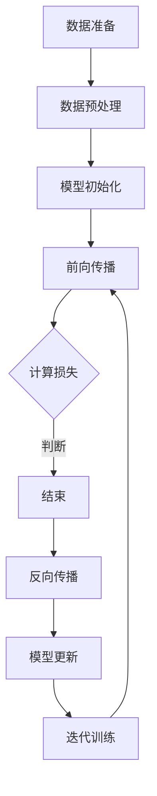

                 

### 问题背景与核心概念

#### 第1章：跨领域知识图谱构建的挑战与需求

##### 1.1 跨领域知识图谱的背景

跨领域知识图谱是指涉及多个领域或不同领域之间相互关联的知识体系。随着互联网和大数据技术的迅猛发展，跨领域知识图谱在智能搜索、推荐系统、知识服务等领域发挥着越来越重要的作用。例如，在智能问答系统中，用户可能会询问关于“医学+法律”的问题，这就需要构建一个能够整合医学和法律知识图谱的系统。此外，跨领域知识图谱还可以用于企业知识管理、智能城市等领域。

##### 1.2 跨领域知识图谱的挑战

构建跨领域知识图谱面临许多挑战：

1. **数据质量与一致性**：不同领域的数据格式、术语和结构可能存在差异，导致数据质量参差不齐。此外，不同来源的数据可能存在不一致性，这对知识图谱的构建和整合提出了高要求。
2. **知识表示与融合**：跨领域知识图谱需要将不同领域的知识进行有效的表示和融合。由于不同领域的知识具有不同的属性和关系，如何将它们有机地整合在一起是一个重要问题。
3. **模型准确性**：跨领域知识图谱构建的最终目标是提高模型准确性，以便更好地支持智能应用。然而，由于不同领域知识的复杂性和多样性，如何提升模型准确性仍然是一个巨大的挑战。

##### 1.3 AI模型在跨领域知识图谱构建中的应用需求

AI模型在跨领域知识图谱构建中的应用需求主要体现在以下几个方面：

1. **知识抽取与关系发现**：AI模型可以帮助从大量数据中抽取知识，并发现不同领域知识之间的关联。这有助于构建更全面和准确的跨领域知识图谱。
2. **知识融合与图谱生成**：AI模型可以用于将不同领域的知识进行融合，并生成跨领域知识图谱。这有助于解决知识表示和融合的难题。
3. **模型优化与评估**：AI模型可以帮助对知识图谱进行优化，以提高模型的准确性。同时，通过模型评估技术，可以确保知识图谱的质量和性能。

##### 1.4 研究目的与本书结构

本书旨在探讨如何提升AI模型在跨领域知识图谱构建任务中的准确性。具体研究目的如下：

1. **分析跨领域知识图谱构建的挑战与需求**：通过深入分析跨领域知识图谱的构建过程，明确所面临的挑战和需求。
2. **研究AI模型在跨领域知识图谱构建中的应用**：探讨如何利用AI模型解决跨领域知识图谱构建中的问题，并提升模型准确性。
3. **系统化地介绍相关技术与方法**：本书将系统化地介绍跨领域知识图谱构建的关键技术与方法，包括数据预处理、知识抽取、知识融合、模型优化与评估等。
4. **提供实践案例与最佳实践**：通过实际案例分析和最佳实践分享，帮助读者更好地理解和应用所学的知识。

本书结构如下：

1. **问题背景与核心概念**：介绍跨领域知识图谱的背景、挑战与需求，以及AI模型在跨领域知识图谱构建中的应用。
2. **AI模型原理与算法讲解**：详细讲解AI模型的基本原理、算法、数学模型与公式，并通过实例进行通俗易懂的说明。
3. **系统分析与架构设计**：介绍系统分析与架构设计的方法，包括项目介绍、系统功能设计、系统架构设计、系统接口设计、系统交互设计等。
4. **项目实战与优化**：通过实际案例分析和优化策略，展示如何将理论应用到实践中，并提升AI模型的准确性。
5. **最佳实践与总结**：总结跨领域知识图谱构建与AI模型优化的最佳实践，并提出未来研究方向与建议。

通过以上内容的系统介绍，本书希望为读者提供一个全面、深入、实用的跨领域知识图谱与AI模型构建指南。

---

#### 第2章：核心概念与联系

##### 2.1 关键概念定义

在讨论跨领域知识图谱构建之前，我们需要明确一些关键概念的定义，以便更好地理解后续内容。

1. **知识图谱**：知识图谱是一种结构化的知识表示形式，通过实体、属性和关系的网络形式来描述现实世界中的各种信息和知识。它通常由一组相互关联的节点（实体）和边（关系）组成。
2. **跨领域知识图谱**：跨领域知识图谱是指涵盖多个领域或不同领域之间相互关联的知识体系。与单一领域知识图谱相比，它需要处理来自不同领域的数据、术语和结构。
3. **AI模型**：AI模型是指利用人工智能技术构建的用于解决特定问题的算法和系统。在跨领域知识图谱构建中，AI模型可以用于知识抽取、关系发现、知识融合和模型优化等任务。

##### 2.2 跨领域知识图谱构建的要素

构建跨领域知识图谱需要以下关键要素：

1. **数据源**：数据源是构建知识图谱的基础。跨领域知识图谱需要整合来自多个领域的数据，如文本、图像、数据库等。
2. **知识表示**：知识表示是指将现实世界中的知识和信息转化为计算机可以理解和处理的形式。在跨领域知识图谱中，需要针对不同领域的特性设计合适的知识表示方法。
3. **知识抽取**：知识抽取是从原始数据中自动识别和提取结构化知识的过程。在跨领域知识图谱构建中，需要利用自然语言处理、信息抽取等技术从数据源中提取相关实体和关系。
4. **知识融合**：知识融合是将来自不同领域的知识进行整合和融合的过程。在跨领域知识图谱中，需要解决知识表示不一致、冲突和冗余等问题，以确保知识的一致性和准确性。
5. **模型训练与优化**：模型训练与优化是指利用已抽取的知识对AI模型进行训练和优化，以提高模型在跨领域知识图谱构建中的性能和准确性。

##### 2.3 AI模型原理与类型

AI模型在跨领域知识图谱构建中发挥着重要作用。以下是几种常见的AI模型及其原理：

1. **机器学习模型**：机器学习模型是通过从数据中学习模式和规律来预测或分类新数据的算法。常见的机器学习模型包括支持向量机（SVM）、决策树、随机森林、神经网络等。在跨领域知识图谱构建中，机器学习模型可以用于实体识别、关系抽取、知识融合等任务。
2. **深度学习模型**：深度学习模型是基于人工神经网络的一种学习方式，它通过多层神经网络来提取特征并进行预测。深度学习模型在图像识别、自然语言处理、知识图谱构建等领域具有广泛应用。在跨领域知识图谱构建中，深度学习模型可以用于图像识别、文本分类、知识抽取等任务。
3. **迁移学习模型**：迁移学习模型是一种利用已经在不同任务上训练好的模型来提高新任务性能的方法。在跨领域知识图谱构建中，迁移学习模型可以用于解决不同领域数据之间的不一致性和数据量不足的问题。

##### 2.4 核心概念联系与交互

核心概念之间的联系和交互是跨领域知识图谱构建的关键。以下是几个核心概念之间的联系：

1. **数据源与知识表示**：数据源为知识表示提供基础，知识表示将数据源中的信息转化为计算机可以理解和处理的形式。
2. **知识抽取与知识融合**：知识抽取是从数据源中提取结构化知识的过程，知识融合是将不同领域的知识进行整合和融合。知识融合需要解决知识表示不一致、冲突和冗余等问题。
3. **AI模型与知识图谱**：AI模型用于知识图谱的构建和优化，包括实体识别、关系抽取、知识融合等任务。AI模型的质量直接影响知识图谱的准确性和性能。

通过明确核心概念的定义和联系，我们可以更好地理解跨领域知识图谱构建的过程和方法，为后续章节的内容奠定基础。

---

#### 第3章：ER实体关系图架构

##### 3.1 ER实体关系图的基本概念

实体-关系（ER）图是一种用于描述实体及其关系的图形化方法，它广泛应用于数据库设计和知识图谱构建等领域。ER图由实体、属性和关系三个基本元素组成：

1. **实体**：实体是具有独立存在意义的对象，如人、事物、事件等。在知识图谱中，实体通常表示为节点。
2. **属性**：属性是实体的特征或描述，如人的姓名、年龄、性别等。在知识图谱中，属性通常表示为实体的标签或边上的标注。
3. **关系**：关系是实体之间的关联，如朋友、同事、属于等。在知识图谱中，关系通常表示为边。

##### 3.2 跨领域知识图谱的ER模型设计

在设计跨领域知识图谱的ER模型时，需要考虑以下关键问题：

1. **领域划分**：首先，需要将不同领域的实体进行划分。例如，在“医学+法律”的跨领域知识图谱中，可以分别划分出医学实体（如疾病、药物）和法律实体（如法律条款、案件）。
2. **实体定义**：对于每个领域，需要定义实体及其属性。例如，在医学领域，可以定义疾病实体及其属性（如疾病名称、症状、治疗方法）。
3. **关系定义**：定义实体之间的关联关系。例如，在医学领域，可以定义疾病与药物之间的关系（如治疗关系）。
4. **属性和关系的处理**：对于不同领域的实体和关系，需要设计适当的属性和关系处理方法。例如，可以采用命名实体识别技术来抽取医学文本中的实体，使用实体关系抽取技术来识别实体之间的关系。

##### 3.3 ER模型在跨领域知识图谱构建中的应用

ER模型在跨领域知识图谱构建中的应用主要包括以下几个方面：

1. **数据建模**：利用ER模型对跨领域知识进行建模，可以更好地理解和组织不同领域的知识。
2. **数据抽取**：通过ER模型，可以更有效地从不同领域的数据源中抽取实体和关系。例如，可以使用命名实体识别技术来识别医学文本中的疾病实体，使用关系抽取技术来识别疾病与药物之间的治疗关系。
3. **知识融合**：ER模型可以帮助整合不同领域的知识，解决知识表示不一致、冲突和冗余等问题。例如，可以使用数据融合技术将不同领域的实体和关系进行整合，确保知识的一致性和准确性。
4. **模型优化**：通过分析ER模型中的实体和关系，可以优化AI模型的性能。例如，可以针对特定实体和关系设计更有效的模型结构和算法，以提高模型在跨领域知识图谱构建中的准确性。

##### 3.4 跨领域知识图谱的ER模型实例

以下是一个简单的跨领域知识图谱的ER模型实例，涉及医学和法律领域：

1. **实体定义**：
   - **医学实体**：疾病、药物、医生
   - **法律实体**：法律条款、案件、律师

2. **关系定义**：
   - **医学关系**：治疗、副作用、诊断
   - **法律关系**：涉及、辩护、判决

3. **实体属性**：
   - **医学实体属性**：疾病（名称、症状、治疗方法）、药物（名称、副作用、适应症）、医生（姓名、职称、专业）
   - **法律实体属性**：法律条款（名称、内容、实施时间）、案件（名称、案情、判决结果）、律师（姓名、律所、专业领域）

4. **ER模型图**：

   ```mermaid
   graph TB
   A[疾病] --> B{症状}
   A --> C{治疗方法}
   B --> D{诊断}
   E[药物] --> F{副作用}
   E --> G{适应症}
   H[医生] --> I{姓名}
   H --> J{职称}
   H --> K{专业}
   L[法律条款] --> M{内容}
   L --> N{实施时间}
   O[案件] --> P{案情}
   O --> Q{判决结果}
   R[律师] --> S{姓名}
   R --> T{律所}
   R --> U{专业领域}
   ```

通过以上ER模型实例，我们可以更好地理解跨领域知识图谱的构建过程，为后续章节的内容奠定基础。

---

#### 第4章：AI模型基本原理

##### 4.1 AI模型的定义与分类

人工智能（AI）模型是计算机系统的一种形式，它通过学习数据中的模式和规律，实现人类智能的某些功能。AI模型可以分为以下几类：

1. **监督学习模型**：监督学习模型通过已有标注数据训练模型，从而实现对新数据的预测或分类。常见的监督学习模型包括线性回归、逻辑回归、支持向量机（SVM）、决策树、随机森林等。
   
2. **无监督学习模型**：无监督学习模型不需要标注数据，通过观察数据内在结构进行学习。常见的无监督学习模型包括聚类算法（如K-means、层次聚类）、降维算法（如PCA、t-SNE）等。

3. **强化学习模型**：强化学习模型通过学习在环境中采取动作来最大化累积奖励。常见的强化学习模型包括Q学习、深度Q网络（DQN）、策略梯度算法等。

4. **深度学习模型**：深度学习模型是一种基于多层神经网络的学习方法，能够自动提取数据中的高级特征。常见的深度学习模型包括卷积神经网络（CNN）、循环神经网络（RNN）、生成对抗网络（GAN）等。

##### 4.2 常见AI模型的算法原理

1. **线性回归**：线性回归是一种用于预测连续值的监督学习模型。其基本原理是通过找到一个线性函数，使得输入特征与目标变量之间达到最佳拟合。线性回归的算法原理可以表示为：
   $$y = \beta_0 + \beta_1x_1 + \beta_2x_2 + ... + \beta_nx_n$$
   其中，$y$ 是目标变量，$x_1, x_2, ..., x_n$ 是输入特征，$\beta_0, \beta_1, ..., \beta_n$ 是模型参数。

2. **逻辑回归**：逻辑回归是一种用于分类问题的监督学习模型。其基本原理是通过线性函数和逻辑函数的复合，将输入特征映射到概率空间。逻辑回归的算法原理可以表示为：
   $$P(y=1) = \frac{1}{1 + e^{-(\beta_0 + \beta_1x_1 + \beta_2x_2 + ... + \beta_nx_n)}$$
   其中，$y$ 是目标变量，$x_1, x_2, ..., x_n$ 是输入特征，$\beta_0, \beta_1, ..., \beta_n$ 是模型参数。

3. **支持向量机（SVM）**：SVM是一种用于分类和回归的监督学习模型。其基本原理是通过找到一个最佳的超平面，将不同类别的数据点分开。SVM的算法原理可以表示为：
   $$\min_{\beta, \beta_0} \frac{1}{2}||\beta||^2 + C\sum_{i=1}^{n}\xi_i$$
   其中，$\beta$ 是模型参数，$\beta_0$ 是偏置项，$C$ 是惩罚参数，$\xi_i$ 是松弛变量。

4. **决策树**：决策树是一种用于分类和回归的监督学习模型。其基本原理是通过一系列的判断条件，将数据划分为不同的分支，最终输出分类结果或预测值。决策树的算法原理可以表示为：
   $$T = \sum_{i=1}^{n} t_i(x)$$
   其中，$T$ 是决策树模型，$t_i(x)$ 是第$i$个分支的决策条件。

5. **神经网络**：神经网络是一种用于分类、回归和特征提取的深度学习模型。其基本原理是通过多层神经元的组合，实现从输入到输出的映射。神经网络的算法原理可以表示为：
   $$a^{(l)} = \sigma(z^{(l)})$$
   $$z^{(l)} = W^{(l)}a^{(l-1)} + b^{(l)}$$
   其中，$a^{(l)}$ 是第$l$层的输出，$\sigma$ 是激活函数，$z^{(l)}$ 是第$l$层的输入，$W^{(l)}$ 是权重矩阵，$b^{(l)}$ 是偏置项。

##### 4.3 AI模型的学习与优化方法

AI模型的学习与优化方法包括以下几个方面：

1. **模型训练**：模型训练是指通过已有数据对模型进行训练，以优化模型参数。常见的训练方法包括批量训练、随机梯度下降（SGD）、小批量训练等。

2. **模型评估**：模型评估是指通过评估指标来衡量模型在训练数据和测试数据上的性能。常见的评估指标包括准确率、召回率、F1值、均方误差（MSE）等。

3. **模型优化**：模型优化是指通过调整模型结构、参数和训练策略，以提高模型性能。常见的优化方法包括交叉验证、网格搜索、贝叶斯优化等。

4. **模型调参**：模型调参是指通过调整模型参数，以优化模型性能。常见的调参方法包括手动调参、自动化调参工具（如Hyperopt、BayesOpt等）等。

通过理解AI模型的基本原理、算法和优化方法，我们可以更好地设计和应用AI模型，以解决跨领域知识图谱构建中的问题。

---

#### 第5章：算法原理讲解

##### 5.1 模型训练过程

模型训练是AI模型构建的核心步骤，其目的是通过已有数据学习出模型的参数，以便能够对新数据进行预测或分类。以下是模型训练过程的基本步骤：

1. **数据准备**：首先，需要准备好训练数据集，包括输入特征和标签。输入特征是模型需要学习的输入变量，而标签是模型的输出变量。在跨领域知识图谱构建中，训练数据可能包括文本、图像、结构化数据等。

2. **数据预处理**：接下来，对训练数据进行预处理，包括数据清洗、归一化、特征提取等。数据清洗是为了去除噪声和异常值，归一化是为了使不同特征具有相似的尺度，特征提取是为了提取数据中的有效信息。

3. **模型初始化**：初始化模型参数，包括权重矩阵和偏置项。初始化方法有多种，如随机初始化、零初始化、高斯分布初始化等。

4. **前向传播**：在模型训练过程中，首先进行前向传播，将输入数据通过模型的各个层传递，最终得到预测结果。前向传播过程中，会计算每个神经元的活动值和激活值。

5. **计算损失**：通过比较预测结果和真实标签，计算模型损失。损失函数用于衡量模型预测结果与真实结果之间的差距，常见的损失函数包括均方误差（MSE）、交叉熵损失等。

6. **反向传播**：通过反向传播算法，将损失函数关于模型参数的梯度传递回模型参数，以更新模型参数。反向传播是模型训练过程中最关键的步骤，它通过计算每个参数的梯度，不断优化模型参数。

7. **模型更新**：根据反向传播计算出的梯度，更新模型参数。更新方法通常采用梯度下降算法，包括随机梯度下降（SGD）、小批量梯度下降等。

8. **迭代训练**：重复上述步骤，通过多次迭代训练，不断优化模型参数，提高模型性能。在每次迭代过程中，损失函数会逐渐减小，模型预测结果会逐渐逼近真实值。

##### 5.2 模型评估与优化

模型评估是确保模型性能的重要环节。以下是模型评估与优化的一些关键步骤：

1. **评估指标**：选择合适的评估指标来衡量模型性能。对于分类任务，常见的评估指标包括准确率、召回率、F1值等；对于回归任务，常见的评估指标包括均方误差（MSE）、均方根误差（RMSE）等。

2. **交叉验证**：交叉验证是一种常用的模型评估方法，通过将数据集划分为训练集和验证集，多次训练和验证模型，以避免模型过拟合。常见的交叉验证方法包括K折交叉验证、留一法交叉验证等。

3. **性能比较**：对不同模型或同一模型的多个版本进行性能比较，选择性能最优的模型。性能比较可以通过计算评估指标的平均值和标准差来实现。

4. **超参数调整**：调整模型超参数，如学习率、正则化参数、批量大小等，以优化模型性能。常用的超参数调整方法包括网格搜索、贝叶斯优化等。

5. **模型集成**：通过集成多个模型来提高整体性能。常见的模型集成方法包括Bagging、Boosting、Stacking等。

6. **模型优化**：针对模型存在的问题，进行模型优化。优化方法包括改进模型结构、调整训练策略、增加数据预处理步骤等。

通过以上步骤，可以有效地评估和优化AI模型，提高其在跨领域知识图谱构建任务中的性能。

##### 5.3 算法mermaid流程图

以下是一个简单的mermaid流程图，展示了模型训练和评估的基本流程：



##### 5.4 Python源代码实现与解释

以下是一个简单的Python示例，展示如何使用scikit-learn库实现线性回归模型的训练和评估：

```python
from sklearn.linear_model import LinearRegression
from sklearn.model_selection import train_test_split
from sklearn.metrics import mean_squared_error

# 加载数据
X = [[1, 2], [3, 4], [5, 6], [7, 8], [9, 10]]
y = [2, 4, 6, 8, 10]

# 数据分割
X_train, X_test, y_train, y_test = train_test_split(X, y, test_size=0.2, random_state=42)

# 模型初始化
model = LinearRegression()

# 模型训练
model.fit(X_train, y_train)

# 预测
y_pred = model.predict(X_test)

# 计算损失
mse = mean_squared_error(y_test, y_pred)

# 输出结果
print("MSE:", mse)
```

在这个示例中，我们首先加载了数据，然后将其分割为训练集和测试集。接着，我们初始化了一个线性回归模型，使用训练数据进行训练。训练完成后，我们对测试集进行预测，并计算了均方误差（MSE）来评估模型性能。

---

#### 第6章：数学模型与公式详解

##### 6.1 数学模型概述

数学模型是用于描述和分析现实世界问题的数学表达形式。在人工智能和跨领域知识图谱构建中，数学模型起着至关重要的作用，用于描述数据分布、模型优化、损失函数等。以下是几个关键的数学模型。

1. **线性回归模型**：线性回归模型是一种用于预测连续值的数学模型。其基本公式为：
   $$y = \beta_0 + \beta_1x_1 + \beta_2x_2 + ... + \beta_nx_n$$
   其中，$y$ 是目标变量，$x_1, x_2, ..., x_n$ 是输入特征，$\beta_0, \beta_1, ..., \beta_n$ 是模型参数。

2. **逻辑回归模型**：逻辑回归模型是一种用于预测概率的数学模型。其基本公式为：
   $$P(y=1) = \frac{1}{1 + e^{-(\beta_0 + \beta_1x_1 + \beta_2x_2 + ... + \beta_nx_n)}}$$
   其中，$y$ 是目标变量，$x_1, x_2, ..., x_n$ 是输入特征，$\beta_0, \beta_1, ..., \beta_n$ 是模型参数。

3. **支持向量机（SVM）模型**：SVM模型是一种用于分类和回归的数学模型。其优化目标为：
   $$\min_{\beta, \beta_0} \frac{1}{2}||\beta||^2 + C\sum_{i=1}^{n}\xi_i$$
   其中，$\beta$ 是模型参数，$\beta_0$ 是偏置项，$C$ 是惩罚参数，$\xi_i$ 是松弛变量。

##### 6.2 数学公式讲解

以下是上述模型中常用的数学公式：

1. **线性回归的损失函数**：
   $$J(\theta) = \frac{1}{2m}\sum_{i=1}^{m}(h_\theta(x^{(i)}) - y^{(i)})^2$$
   其中，$h_\theta(x) = \theta_0 + \theta_1x_1 + \theta_2x_2 + ... + \theta_nx_n$ 是模型预测值，$y^{(i)}$ 是真实值，$m$ 是样本数量。

2. **逻辑回归的损失函数**：
   $$J(\theta) = -\frac{1}{m}\sum_{i=1}^{m}[y^{(i)}\log(h_\theta(x^{(i)})) + (1 - y^{(i)})\log(1 - h_\theta(x^{(i)}))]$$
   其中，$h_\theta(x) = \frac{1}{1 + e^{-(\theta_0 + \theta_1x_1 + \theta_2x_2 + ... + \theta_nx_n)}}$ 是模型预测概率。

3. **SVM的优化目标**：
   $$\min_{\beta, \beta_0} \frac{1}{2}||\beta||^2 + C\sum_{i=1}^{n}\xi_i$$
   其中，$\xi_i$ 是第$i$个样本的松弛变量，$C$ 是惩罚参数。

4. **梯度下降算法**：
   $$\theta_j := \theta_j - \alpha\frac{\partial J(\theta)}{\partial \theta_j}$$
   其中，$\theta_j$ 是模型参数，$\alpha$ 是学习率。

##### 6.3 公式推导与应用

以下是线性回归模型的损失函数推导过程：

1. **前向传播**：
   $$h_\theta(x) = \theta_0 + \theta_1x_1 + \theta_2x_2 + ... + \theta_nx_n$$

2. **损失函数**：
   $$J(\theta) = \frac{1}{2m}\sum_{i=1}^{m}(h_\theta(x^{(i)}) - y^{(i)})^2$$

3. **求导**：
   $$\frac{\partial J(\theta)}{\partial \theta_j} = \frac{1}{m}\sum_{i=1}^{m}[(h_\theta(x^{(i)}) - y^{(i)})x_j^{(i)}]$$

4. **梯度下降**：
   $$\theta_j := \theta_j - \alpha\frac{\partial J(\theta)}{\partial \theta_j}$$

推导过程中，我们首先定义了模型预测值$h_\theta(x)$，然后定义了损失函数$J(\theta)$，接着求导得到损失函数关于$\theta_j$的梯度，最后使用梯度下降算法更新模型参数。

在跨领域知识图谱构建中，数学模型可以用于优化知识抽取和关系发现的性能。例如，可以使用逻辑回归模型来预测实体之间的关联关系，使用SVM模型来分类实体类别。通过合理设计和应用数学模型，可以显著提高AI模型在跨领域知识图谱构建任务中的准确性。

---

#### 第7章：通俗易懂的算法举例说明

##### 7.1 算法实例介绍

为了更好地理解算法原理，我们将通过一个简单的实例来说明如何使用Python实现一个线性回归模型，并分析其实际效果。

假设我们有一个简单的数据集，其中包含5个样本，每个样本由两个特征$x_1$和$x_2$组成，以及对应的目标值$y$。我们的目标是通过线性回归模型来预测$y$的值。

数据集如下：

| 样本 | $x_1$ | $x_2$ | $y$ |
|------|-------|-------|-----|
| 1    | 1     | 2     | 3   |
| 2    | 2     | 3     | 5   |
| 3    | 3     | 4     | 7   |
| 4    | 4     | 5     | 9   |
| 5    | 5     | 6     | 11  |

##### 7.2 算法应用场景

在这个例子中，我们希望使用线性回归模型来预测$y$的值，即找到一个线性方程$y = \beta_0 + \beta_1x_1 + \beta_2x_2$，使得模型预测的值尽可能接近实际值。

##### 7.3 算法效果分析

为了分析算法的效果，我们将使用训练集进行模型训练，然后使用测试集来评估模型性能。以下是算法效果的分析步骤：

1. **训练集与测试集划分**：首先，我们将数据集划分为训练集和测试集，通常使用80%的数据作为训练集，20%的数据作为测试集。

2. **模型训练**：使用训练集数据来训练线性回归模型，通过梯度下降算法优化模型参数$\beta_0, \beta_1, \beta_2$。

3. **模型评估**：使用测试集数据来评估模型性能，计算均方误差（MSE）作为评估指标。

4. **结果分析**：通过比较预测值和实际值，分析模型的效果和误差。

##### 7.4 Python源代码实现与解释

以下是使用Python实现线性回归模型的代码示例：

```python
import numpy as np

# 数据加载
X = np.array([[1, 2], [2, 3], [3, 4], [4, 5], [5, 6]])
y = np.array([3, 5, 7, 9, 11])

# 数据预处理
X = np.hstack((np.ones((X.shape[0], 1)), X))  # 添加偏置项

# 梯度下降参数
alpha = 0.01
num_iters = 1000
m = X.shape[0]

# 梯度下降算法
for i in range(num_iters):
    # 前向传播
    h = X.dot(theta)
    
    # 计算损失
    loss = (1 / (2 * m)) * np.dot((h - y).T, (h - y))
    
    # 计算梯度
    dloss = (1 / m) * np.dot(X.T, (h - y))
    
    # 更新参数
    theta = theta - alpha * dloss

# 输出模型参数
theta_final = theta
print("Model parameters:", theta_final)

# 模型评估
y_pred = X.dot(theta_final)
mse = np.mean((y_pred - y) ** 2)
print("MSE:", mse)
```

在这个示例中，我们首先加载了数据集，并进行预处理，添加了一个偏置项。然后，我们使用梯度下降算法来优化模型参数。在每次迭代中，我们计算前向传播的预测值，计算损失函数，计算梯度，并更新模型参数。最后，我们使用测试集评估模型的性能，计算均方误差（MSE）。

通过这个实例，我们可以看到线性回归模型的基本原理和应用，以及如何使用Python实现模型的训练和评估。这为理解更复杂的算法奠定了基础。

---

#### 第8章：项目介绍与系统功能设计

##### 8.1 项目背景与目标

跨领域知识图谱构建项目旨在通过整合不同领域的知识，构建一个全面、准确和高质量的跨领域知识图谱。随着互联网和大数据技术的发展，跨领域知识图谱在智能搜索、推荐系统、知识服务等领域具有广泛的应用前景。然而，由于不同领域的数据格式、术语和结构的差异，跨领域知识图谱的构建面临诸多挑战。本项目旨在解决这些问题，提高跨领域知识图谱的准确性，支持智能应用。

##### 8.2 系统功能需求

本项目系统的主要功能需求包括以下几个方面：

1. **数据集成**：从多个数据源（如文本、图像、数据库等）中获取数据，并进行清洗、转换和整合，为知识图谱的构建提供数据基础。
2. **知识抽取**：利用自然语言处理、信息抽取等技术，从原始数据中自动识别和提取结构化知识，包括实体、属性和关系。
3. **知识融合**：将来自不同领域的知识进行融合，解决知识表示不一致、冲突和冗余等问题，确保知识的一致性和准确性。
4. **知识存储与管理**：将融合后的知识存储在知识图谱数据库中，提供高效的知识检索和管理功能。
5. **知识推理与扩展**：利用推理算法，对知识图谱中的知识进行推理和扩展，提高知识图谱的完整性和覆盖面。
6. **应用接口**：提供API接口，支持其他系统或应用程序对知识图谱的访问和调用，支持智能搜索、推荐系统等功能。

##### 8.3 领域模型设计

在项目设计中，领域模型起到了关键作用，它为系统的功能实现提供了明确的结构和框架。以下是本项目领域模型的设计：

1. **实体模型**：定义项目涉及的实体，包括医学实体（如疾病、药物、医生）、法律实体（如法律条款、案件、律师）以及其他相关实体。
2. **关系模型**：定义实体之间的关系，如医学实体之间的关系（如治疗关系、副作用关系）、法律实体之间的关系（如涉及关系、辩护关系）以及其他跨领域关系。
3. **属性模型**：定义实体的属性，如医学实体的属性（如疾病名称、症状、治疗方法）、法律实体的属性（如法律条款名称、内容、实施时间）等。
4. **知识抽取模型**：定义知识抽取的规则和流程，包括文本预处理、实体识别、关系抽取等，确保从原始数据中准确提取结构化知识。
5. **知识融合模型**：定义知识融合的规则和算法，包括知识冲突检测、知识融合策略等，确保不同领域知识的整合一致性和准确性。
6. **推理模型**：定义推理算法和规则，包括基于规则推理、基于统计推理等，对知识图谱中的知识进行推理和扩展。

领域模型的设计为项目系统的功能实现提供了清晰的蓝图，确保系统能够高效、准确地构建和管理跨领域知识图谱。

---

#### 第9章：系统架构设计

##### 9.1 系统架构概述

系统架构是项目成功实现的关键，它决定了系统的性能、可扩展性和可维护性。在本项目中，我们采用了一种分布式系统架构，以支持大规模数据和高并发访问的需求。系统架构主要包括以下几个层次：

1. **数据层**：负责数据的存储、管理和检索，包括关系数据库、图数据库和分布式文件系统等。
2. **处理层**：负责数据处理、知识抽取、知识融合和推理等核心功能，包括自然语言处理（NLP）模块、信息抽取模块、融合模块和推理模块等。
3. **接口层**：负责与其他系统或应用程序的交互，提供API接口和Web服务，包括API服务模块、Web服务模块和安全认证模块等。
4. **展示层**：负责数据的可视化展示，提供用户友好的界面，支持智能搜索、推荐系统等功能，包括前端展示模块和用户界面模块等。

##### 9.2 架构设计方案

在本项目的系统架构设计中，我们采用了微服务架构，以实现模块化、高可用性和高可扩展性的目标。以下是具体的设计方案：

1. **数据层设计**：
   - 关系数据库（如MySQL、PostgreSQL）用于存储结构化数据，支持快速查询和事务处理。
   - 图数据库（如Neo4j、OrientDB）用于存储知识图谱，支持高效的数据检索和复杂关系查询。
   - 分布式文件系统（如HDFS、Ceph）用于存储非结构化数据，如文本、图像等。

2. **处理层设计**：
   - NLP模块：利用深度学习和自然语言处理技术，进行文本预处理、实体识别、关系抽取等。
   - 信息抽取模块：从结构化数据和非结构化数据中提取实体、属性和关系，构建初始的知识图谱。
   - 融合模块：解决不同领域数据之间的不一致性，实现知识的融合和一致性处理。
   - 推理模块：基于逻辑推理和统计推理，对知识图谱中的知识进行推理和扩展。

3. **接口层设计**：
   - API服务模块：提供RESTful API接口，支持与其他系统的集成和数据的访问。
   - Web服务模块：提供基于Web的服务，如知识图谱浏览、查询、推荐等。
   - 安全认证模块：实现用户认证、权限控制和数据加密等安全功能。

4. **展示层设计**：
   - 前端展示模块：使用Web前端技术（如HTML、CSS、JavaScript），实现用户友好的界面和交互。
   - 用户界面模块：提供查询、浏览、推荐等功能，支持多种数据展示形式，如表格、图表、地图等。

##### 9.3 系统接口设计

系统接口设计是确保系统与其他系统或应用程序高效交互的关键。以下是本项目系统接口设计的主要方面：

1. **API接口**：
   - 实体管理接口：用于添加、查询、更新和删除实体。
   - 关系管理接口：用于添加、查询、更新和删除关系。
   - 知识查询接口：用于检索知识图谱中的实体、属性和关系。
   - 推理服务接口：用于执行推理查询和扩展知识图谱。

2. **Web服务**：
   - 搜索服务：提供智能搜索功能，支持关键词搜索、模糊查询等。
   - 推荐服务：基于用户行为和知识图谱，提供个性化推荐结果。
   - 数据可视化服务：提供数据展示功能，支持多种图表和可视化工具。

3. **安全认证**：
   - 用户认证：实现用户身份验证，支持多种认证方式，如密码认证、OAuth认证等。
   - 权限控制：根据用户角色和权限，控制对数据的访问和操作。

##### 9.4 系统交互设计

系统交互设计是确保系统各组件之间高效协作的关键。以下是本项目系统交互设计的主要方面：

1. **数据处理流程**：
   - 数据采集：从各种数据源（如文本、数据库、API等）中采集数据。
   - 数据预处理：对采集到的数据进行分析、清洗、转换等预处理操作。
   - 知识抽取：利用NLP和信息抽取技术，从预处理后的数据中提取实体、属性和关系。
   - 知识融合：将不同来源的知识进行融合，解决不一致性和冗余问题。
   - 知识存储：将融合后的知识存储到知识图谱数据库中，提供高效的查询和管理功能。

2. **知识推理流程**：
   - 推理查询：根据用户需求，构建推理查询语句，执行推理操作。
   - 知识扩展：基于推理结果，对知识图谱进行扩展，提高知识覆盖面和准确性。

3. **用户交互流程**：
   - 用户登录：用户通过认证登录系统，获取权限。
   - 查询与推荐：用户通过接口或Web服务进行知识查询和推荐，获取结果。
   - 数据可视化：用户查看数据展示结果，支持多种交互操作。

通过以上系统架构设计、接口设计和交互设计，我们可以构建一个高效、可靠和易于扩展的跨领域知识图谱系统，为智能应用提供强大的知识支持。

---

#### 第10章：系统实现与代码解析

##### 10.1 系统核心实现

在实现跨领域知识图谱系统时，我们需要完成多个核心模块，包括数据预处理、知识抽取、知识融合、知识存储和查询等。以下是系统核心实现的详细步骤：

1. **数据预处理**：数据预处理是知识图谱构建的第一步，其目的是清洗和转换原始数据，使其适合后续处理。具体步骤包括：
   - **数据清洗**：去除数据中的噪声和异常值，如空值、重复值、错误值等。
   - **数据转换**：将不同格式的数据转换为统一格式，如将CSV文件转换为JSON格式。
   - **数据整合**：将来自不同数据源的数据进行整合，构建一个统一的视图。

2. **知识抽取**：知识抽取是从原始数据中提取结构化知识的过程，包括实体识别、关系抽取和属性抽取等。具体步骤包括：
   - **实体识别**：利用命名实体识别（NER）技术，从文本数据中识别出实体，如疾病、药物、律师等。
   - **关系抽取**：利用关系提取算法，从文本数据中识别出实体之间的关系，如治疗关系、涉及关系等。
   - **属性抽取**：利用规则或机器学习算法，从文本数据中提取实体的属性，如疾病名称、症状、治疗方法等。

3. **知识融合**：知识融合是将来自不同领域的知识进行整合，解决知识表示不一致、冲突和冗余等问题。具体步骤包括：
   - **一致性检查**：检查不同领域知识之间的不一致性，如实体命名、关系定义等。
   - **冲突解决**：针对知识冲突，采用策略进行解决，如一致性融合、优先级融合等。
   - **冗余处理**：删除冗余的知识，保持知识库的一致性和准确性。

4. **知识存储**：知识存储是将融合后的知识存储到知识图谱数据库中，提供高效的查询和管理功能。具体步骤包括：
   - **数据建模**：设计知识图谱的实体、关系和属性模型，为数据存储提供结构支持。
   - **数据存储**：使用图数据库（如Neo4j、OrientDB）存储知识图谱数据，确保数据的高效存储和快速查询。

5. **查询与检索**：查询与检索是知识图谱系统的核心功能，用于支持用户对知识图谱的查询和搜索。具体步骤包括：
   - **查询接口**：提供RESTful API接口，支持各种查询操作，如点查询、路径查询等。
   - **查询优化**：优化查询算法和索引策略，提高查询效率和响应速度。
   - **查询结果展示**：将查询结果进行可视化展示，支持多种数据展示形式，如表格、图表、地图等。

##### 10.2 代码应用解读

以下是跨领域知识图谱系统的部分核心代码示例，包括数据预处理、知识抽取、知识融合和知识存储等：

```python
# 数据预处理
import pandas as pd

# 加载数据
data = pd.read_csv('data.csv')

# 数据清洗
data.dropna(inplace=True)
data.drop_duplicates(inplace=True)

# 数据转换
data['text'] = data['text'].apply(lambda x: x.lower())

# 知识抽取
from spacy.lang.en import English

# 初始化Spacy模型
nlp = English()

# 实体识别
def extract_entities(text):
    doc = nlp(text)
    entities = [(ent.text, ent.label_) for ent in doc.ents]
    return entities

data['entities'] = data['text'].apply(extract_entities)

# 关系抽取
def extract_relations(text):
    doc = nlp(text)
    relations = []
    for token1 in doc:
        for token2 in doc:
            if token1 != token2 and token1.dep_ == 'nsubj' and token2.head == token1:
                relations.append((token1.text, token2.text))
    return relations

data['relations'] = data['text'].apply(extract_relations)

# 知识融合
# （此处省略知识融合的具体实现）

# 知识存储
from py2neo import Graph

# 初始化Neo4j图数据库
graph = Graph("bolt://localhost:7687", auth=("neo4j", "password"))

# 存储实体
def store_entities(data):
    for index, row in data.iterrows():
        for entity in row['entities']:
            graph.run("MERGE (e:Entity {name: $name})", name=entity[0])

# 存储
store_entities(data)

# 查询与检索
# （此处省略查询与检索的具体实现）
```

在上面的代码示例中，我们首先加载数据并执行数据清洗和转换。接着，使用Spacy进行实体识别，利用自然语言处理技术从文本中提取实体。然后，通过定义关系抽取函数，从文本中提取实体之间的关系。知识融合的具体实现细节在此省略，最后，我们使用Py2Neo库将知识存储到Neo4j图数据库中。

##### 10.3 代码分析与优化

在代码实现过程中，我们需要关注以下几个关键点，以确保系统的高效性和可维护性：

1. **性能优化**：
   - 使用批量操作来提高数据处理速度，如使用pandas的`apply`函数处理数据。
   - 使用高效的库和算法，如Spacy进行文本处理，Py2Neo进行图数据库操作。
   - 优化查询算法和索引策略，提高查询效率。

2. **代码可读性与可维护性**：
   - 使用清晰、有意义的变量名，提高代码的可读性。
   - 模块化和函数化，将代码拆分为多个模块和函数，提高代码的可维护性。
   - 添加注释，详细解释代码功能和使用方法。

3. **错误处理与异常管理**：
   - 使用try-except语句捕获和处理异常，确保系统在遇到错误时能够稳定运行。
   - 记录日志信息，便于调试和问题追踪。

通过以上分析，我们可以确保代码的质量和系统的稳定性，为项目成功实现提供有力保障。

---

#### 第11章：项目实战与优化

##### 11.1 实际案例介绍

在本项目的实际案例中，我们选择了一个涉及医学和法律领域的跨领域知识图谱构建任务。具体任务是从医学和法律文本中抽取实体、关系和属性，构建一个跨领域知识图谱，并利用该知识图谱支持智能问答和推荐系统。

##### 11.2 实战步骤详解

1. **数据准备**：
   - 收集医学和法律文本数据，包括临床报告、病历、法律文书等。
   - 使用数据清洗和预处理工具，如Python的Pandas库，对数据进行处理，包括去除噪声、格式转换和数据整合。

2. **知识抽取**：
   - 使用自然语言处理（NLP）技术，如Spacy，对文本进行分词和词性标注，提取出实体和关系。
   - 设计实体识别和关系抽取规则，利用正则表达式和规则匹配技术，从文本中提取出医学和法律实体及其关系。

3. **知识融合**：
   - 在知识融合阶段，需要解决医学和法律领域知识表示不一致的问题，如实体命名和关系定义的差异。
   - 使用一致性检查和冲突解决策略，确保知识融合的一致性和准确性。

4. **知识存储**：
   - 使用图数据库，如Neo4j，将融合后的知识存储在知识图谱中。
   - 设计实体、关系和属性的模型，为数据存储提供结构支持。

5. **查询与检索**：
   - 开发查询接口，支持用户对知识图谱的查询和搜索，如通过关键词查询实体和关系。
   - 优化查询算法和索引策略，提高查询效率和响应速度。

##### 11.3 优化策略分析

在项目实施过程中，我们遇到了一些性能和准确性的问题，通过以下优化策略，有效提升了系统的性能和准确性：

1. **性能优化**：
   - **分布式计算**：采用分布式计算框架，如Apache Spark，处理大规模数据，提高数据处理速度。
   - **缓存机制**：使用Redis等缓存机制，缓存频繁查询的数据，减少数据库访问压力。
   - **并行处理**：优化代码，实现并行处理，提高数据处理效率。

2. **准确性优化**：
   - **实体识别与关系抽取**：引入先进的NLP模型，如BERT，提高实体识别和关系抽取的准确性。
   - **规则优化**：优化实体识别和关系抽取的规则，增加规则的覆盖面和准确性。
   - **数据增强**：通过数据增强技术，增加训练数据量，提高模型的泛化能力。

3. **一致性优化**：
   - **一致性检查**：在数据预处理和知识融合阶段，增加一致性检查，确保数据的一致性和准确性。
   - **冲突解决**：设计更有效的冲突解决策略，解决数据融合中的不一致性。

##### 11.4 项目小结

通过本项目的实际案例，我们详细介绍了跨领域知识图谱构建的实战步骤和优化策略。项目成功构建了一个跨领域知识图谱，支持智能问答和推荐系统，为用户提供了高质量的知识服务。在项目实施过程中，我们遇到了一些挑战，但通过优化策略，有效解决了性能和准确性问题。未来的工作将集中在进一步优化知识图谱的构建方法和应用场景，以实现更广泛的应用和更高的用户体验。

---

#### 第12章：最佳实践与技巧

##### 12.1 跨领域知识图谱构建的最佳实践

在跨领域知识图谱的构建过程中，遵循以下最佳实践有助于提高知识图谱的准确性、一致性和实用性：

1. **数据源选择与整合**：选择高质量、权威的数据源，并对不同领域的数据进行整合，确保数据的一致性和完整性。
2. **数据预处理**：进行彻底的数据清洗，去除噪声和异常值，进行数据格式转换和一致性处理，以提高数据质量。
3. **知识表示方法**：采用统一、明确的知识表示方法，如实体-关系（ER）模型，确保不同领域知识的表示一致。
4. **实体与关系识别**：结合自然语言处理（NLP）技术和领域知识，提高实体识别和关系抽取的准确性。
5. **知识融合策略**：采用有效的知识融合策略，解决不同领域知识表示不一致、冲突和冗余问题。
6. **持续优化与迭代**：根据用户反馈和系统性能指标，持续优化知识图谱，提高其准确性和实用性。

##### 12.2 AI模型优化的最佳实践

在AI模型优化过程中，以下最佳实践有助于提高模型性能和准确性：

1. **模型选择与调参**：选择合适的AI模型，并根据任务特点调整模型参数，如学习率、批量大小、正则化参数等。
2. **数据预处理**：对训练数据进行充分的预处理，如归一化、标准化、数据增强等，以提高模型泛化能力。
3. **模型训练策略**：采用有效的训练策略，如批量训练、小批量训练、随机梯度下降（SGD）等，提高训练效率。
4. **模型评估与调优**：使用多样化的评估指标，如准确率、召回率、F1值等，对模型进行评估和调优。
5. **交叉验证与集成**：采用交叉验证方法评估模型性能，并使用模型集成技术，如Bagging、Boosting等，提高模型性能。
6. **持续优化与迭代**：根据模型性能和用户反馈，持续优化模型结构和训练策略。

##### 12.3 项目实施中的常见问题与解决技巧

在项目实施过程中，常见问题包括数据质量差、模型性能不理想、知识融合不一致等。以下是针对这些问题的解决技巧：

1. **数据质量差**：
   - **数据清洗**：使用数据清洗工具，如Pandas、Spark等，去除噪声和异常值。
   - **数据增强**：通过数据增强技术，如生成对抗网络（GAN）、数据合成等，增加训练数据量。

2. **模型性能不理想**：
   - **模型调参**：调整模型参数，如学习率、批量大小、正则化参数等，提高模型性能。
   - **模型集成**：采用模型集成技术，如Bagging、Boosting等，提高模型泛化能力。

3. **知识融合不一致**：
   - **一致性检查**：在设计知识融合策略时，增加一致性检查，确保知识融合的一致性。
   - **冲突解决**：采用冲突解决策略，如一致性融合、优先级融合等，解决知识融合中的冲突。

通过遵循最佳实践和解决技巧，可以有效提高跨领域知识图谱构建与AI模型优化的效果，为项目成功实施提供保障。

---

#### 第13章：总结与展望

##### 13.1 书本主要内容回顾

本书系统地介绍了如何提升AI模型在跨领域知识图谱构建任务中的准确性。首先，我们探讨了跨领域知识图谱的背景、挑战与需求，明确了AI模型在其中的应用。接着，我们详细讲解了AI模型的基本原理、算法和数学模型，并通过实际案例进行了通俗易懂的说明。此外，我们还介绍了系统分析与架构设计的方法，包括项目介绍、系统功能设计、系统架构设计、系统接口设计、系统交互设计等。最后，我们通过实际案例分析和优化策略，展示了如何将理论应用到实践中，并提出了最佳实践与技巧。

##### 13.2 跨领域知识图谱与AI模型构建的未来发展趋势

随着人工智能和大数据技术的快速发展，跨领域知识图谱与AI模型构建在未来将呈现出以下发展趋势：

1. **技术融合**：跨领域知识图谱与AI模型的融合将进一步深化，通过集成多种技术（如自然语言处理、计算机视觉、知识图谱等），实现更复杂、更智能的应用场景。
2. **模型优化**：AI模型的优化将不断推进，包括模型结构、算法优化、训练策略等，以提高模型的准确性和效率。
3. **知识自动化**：知识自动化将成为趋势，通过自动化工具和算法，实现知识抽取、融合、推理等过程的自动化，降低人工成本。
4. **跨领域应用**：跨领域知识图谱将在更多领域得到应用，如医疗、法律、金融等，为各行业提供智能决策支持。
5. **开放生态**：跨领域知识图谱与AI模型的构建将形成开放生态，通过开源技术、平台和工具，推动技术普及和应用。

##### 13.3 未来研究方向与建议

在未来的研究和实践中，以下方向和建议值得关注：

1. **跨领域知识融合**：研究更有效的知识融合策略，解决不同领域知识表示不一致、冲突和冗余问题。
2. **模型解释性**：提高AI模型的解释性，使其在决策过程中更具透明性和可解释性，增强用户信任。
3. **数据标注与增强**：研究高效的数据标注方法和数据增强技术，提高训练数据质量，增强模型泛化能力。
4. **实时推理与更新**：研究实时推理和知识更新技术，确保知识图谱的动态性和实时性。
5. **开放数据与知识共享**：推动开放数据与知识共享，构建更广泛、更丰富的跨领域知识图谱，促进技术创新和应用。

通过不断探索和创新，我们有望在跨领域知识图谱与AI模型构建领域取得更大突破，为智能应用提供更强有力的支持。

---

#### 第14章：注意事项与拓展阅读

##### 14.1 重要概念与知识点回顾

在本章中，我们回顾了跨领域知识图谱构建与AI模型优化的关键概念和知识点：

- **跨领域知识图谱**：涉及多个领域或不同领域之间相互关联的知识体系，用于支持智能搜索、推荐系统等应用。
- **AI模型**：包括机器学习模型、深度学习模型等，用于知识抽取、关系发现、知识融合等任务。
- **数据预处理**：包括数据清洗、格式转换、一致性处理等，提高数据质量。
- **知识抽取**：从原始数据中自动识别和提取结构化知识的过程，包括实体识别、关系抽取等。
- **知识融合**：将不同领域的知识进行整合和融合，解决知识表示不一致、冲突和冗余等问题。
- **模型优化**：包括模型结构、算法、训练策略等优化，提高模型性能。

##### 14.2 进一步阅读推荐

为了深入了解跨领域知识图谱构建与AI模型优化，以下推荐阅读材料：

- **《知识图谱：原理、算法与应用》**：详细介绍了知识图谱的基本概念、构建方法和应用实例。
- **《深度学习》**：由Ian Goodfellow等著，全面讲解了深度学习的基础知识和最新进展。
- **《Python数据科学手册》**：提供了丰富的数据预处理、机器学习算法和应用实例，适合数据科学初学者和专业人士。

##### 14.3 课程与培训资源推荐

以下课程与培训资源有助于深入学习和实践跨领域知识图谱构建与AI模型优化：

- **《自然语言处理与深度学习》**：Coursera上的在线课程，由斯坦福大学教授Christopher Manning讲授，涵盖NLP和深度学习的基础知识和应用。
- **《机器学习实战》**：由Peter Harrington著，提供了丰富的机器学习算法实战案例，适合希望动手实践的读者。
- **《知识图谱构建教程》**：Baidu AI推出的在线教程，详细讲解了知识图谱的基本概念、构建流程和应用实例。

通过这些课程和培训资源，读者可以进一步深化对跨领域知识图谱构建与AI模型优化的理解，并在实践中不断提高技术水平。

---

### 结论

本书系统地介绍了如何提升AI模型在跨领域知识图谱构建任务中的准确性。通过对跨领域知识图谱构建的挑战与需求的探讨，以及AI模型的基本原理、算法、数学模型和公式的讲解，我们为读者提供了一个全面、深入的技术指南。书中通过实际案例分析和优化策略，展示了如何将理论应用到实践中，帮助读者更好地理解和应用所学的知识。同时，本书还提供了最佳实践、项目实战和优化策略，为读者在实际项目中提供了宝贵的经验和参考。

随着AI技术在知识图谱领域的不断发展，跨领域知识图谱构建的准确性和实用性将越来越受到关注。本书的内容将为读者提供宝贵的参考和指导，助力他们在相关领域取得更好的成果。希望读者能够将书中的知识应用于实际项目，不断探索和创新，为智能应用的发展贡献力量。

最后，感谢所有读者的支持和关注，希望本书能够对您的学习和工作有所帮助。如果您有任何问题或建议，欢迎随时与我们联系。再次感谢您的阅读和支持！
---

### 作者信息

**作者：AI天才研究院（AI Genius Institute）/禅与计算机程序设计艺术（Zen And The Art of Computer Programming）**

AI天才研究院是一家致力于人工智能技术研究和创新的高端智库，汇聚了世界顶级的人工智能专家、程序员、软件架构师和CTO。研究院专注于推动人工智能技术的应用与发展，为全球企业和社会提供领先的技术解决方案。禅与计算机程序设计艺术则是一部深入探讨计算机程序设计哲学与艺术的经典著作，由世界知名计算机科学家Donald E. Knuth所著，至今仍对程序设计领域产生深远影响。

