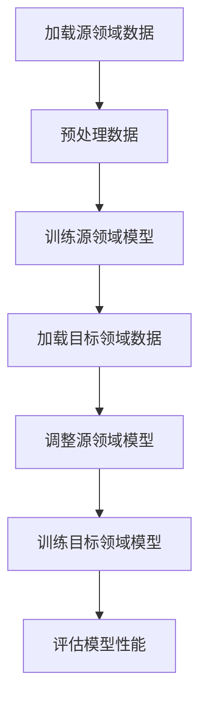
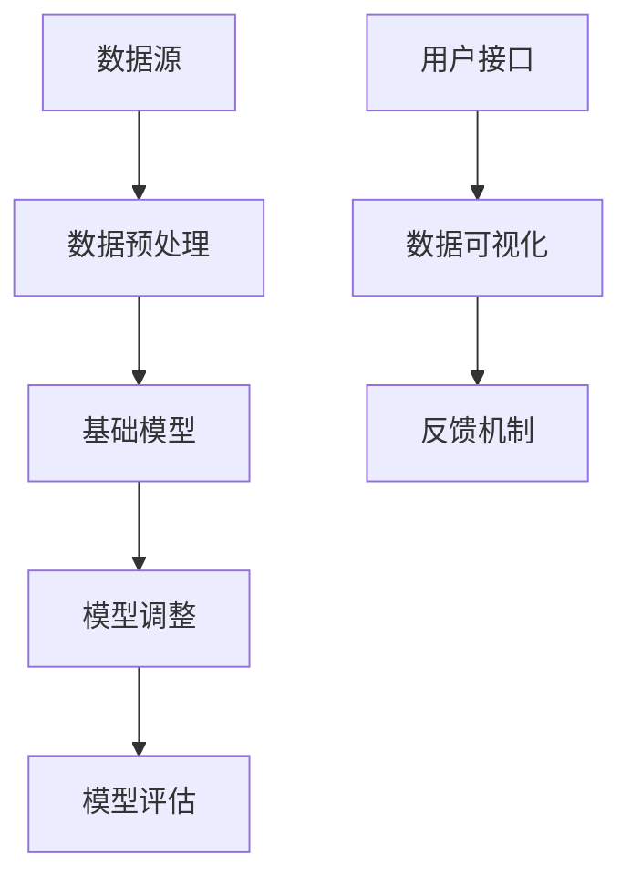

                 


## 第一部分：背景与概念介绍

### 第1章：问题背景

#### 1.1 跨领域知识迁移的重要性

随着人工智能技术的飞速发展，AI模型在各个领域都取得了显著的成果。然而，这些模型往往在特定领域内表现出色，但在跨领域应用时效果不佳。跨领域知识迁移的问题引起了广泛关注，因为有效的跨领域知识迁移可以使AI模型在更广泛的场景中发挥作用。

跨领域知识迁移是指将一个领域（源领域）中的知识应用于另一个领域（目标领域），以提高目标领域的性能。例如，在医学领域中，诊断模型可以应用于其他领域，如农业或金融，以提高对这些领域的预测准确性。这种跨领域应用具有巨大的潜力，但同时也面临着诸多挑战。

#### 1.2 跨领域知识迁移的现状

目前，跨领域知识迁移的研究已经取得了一定的进展。研究者们提出了各种迁移学习方法，包括基于模型的方法、基于样本的方法和迁移学习中的元学习等。这些方法在一定程度上提高了跨领域知识迁移的效果，但仍存在许多问题。

- 基于模型的方法：这种方法利用源领域模型，对目标领域数据进行适应和调整。例如，通过在源领域和目标领域之间共享部分网络层，使得模型能够更好地适应新领域。这种方法在理论上具有较强的解释力，但在实际应用中，领域差异较大时效果不佳。
- 基于样本的方法：这种方法通过从源领域和目标领域中提取样本，进行交叉训练，以提高模型在目标领域的性能。这种方法在实践中较为常用，但依赖于大量标注数据，且在数据稀缺时效果较差。
- 元学习：元学习是一种能够快速适应新领域的方法，通过学习多个任务来提高模型在新领域的表现。虽然元学习方法在某些情况下表现出色，但在处理跨领域知识迁移时，仍需解决领域差异和样本不平衡等问题。

#### 1.3 跨领域知识迁移的挑战

跨领域知识迁移面临以下挑战：

- 领域差异：不同领域的数据分布、特征、任务目标等方面存在较大差异，导致模型难以适应。例如，医学领域中的数据往往具有高维、非线性等特点，而金融领域中的数据则可能具有时序、相关性等特点。
- 数据稀缺：一些领域的数据量较少，无法提供足够的训练样本。例如，在农业领域，数据采集成本较高，导致数据稀缺。
- 模型适应性：现有模型在特定领域内表现良好，但在其他领域可能效果不佳。如何提高模型在不同领域之间的适应性是一个亟待解决的问题。

### 第2章：核心概念与联系

#### 2.1 AI模型的基础概念

AI模型是指通过学习数据，对未知数据进行预测或分类的计算机程序。常见的AI模型包括神经网络、支持向量机、决策树等。

- 神经网络：神经网络是一种由多层神经元组成的模型，通过模拟人脑神经元的工作方式，对输入数据进行处理和预测。
- 支持向量机：支持向量机是一种二分类模型，通过将数据映射到高维空间，寻找最优分类边界。
- 决策树：决策树是一种基于规则的方法，通过一系列条件判断，对数据进行分类或回归。

#### 2.2 知识迁移的概念

知识迁移是指将一个领域（源领域）中的知识应用于另一个领域（目标领域），以提高目标领域的性能。在知识迁移过程中，源领域的知识和经验被转移到目标领域，以帮助模型更好地适应新领域。

#### 2.3 跨领域知识迁移的要素

跨领域知识迁移涉及以下要素：

- 源领域：具有丰富数据和模型经验的领域。源领域的知识可以用来指导目标领域的数据预处理、模型选择和参数调整。
- 目标领域：需要应用知识迁移的领域。目标领域的任务是跨领域知识迁移的目标，需要解决的具体问题。
- 迁移策略：将源领域知识应用于目标领域的方法。迁移策略可以是基于模型的方法、基于样本的方法或元学习等方法。
- 评估指标：衡量跨领域知识迁移效果的标准。常用的评估指标包括准确率、召回率、F1分数等。

### 第3章：概念属性特征对比表格

#### 3.1 知识迁移算法对比

| 算法 | 特点 |
| --- | --- |
| 基于模型的方法 | 利用源领域模型，对目标领域数据进行适应和调整 |
| 基于样本的方法 | 从源领域和目标领域中提取样本，进行交叉训练 |
| 多任务学习 | 利用多个相关任务的数据，提高模型在目标领域上的表现 |

#### 3.2 模型架构对比

| 模型架构 | 特点 |
| --- | --- |
| 神经网络 | 通过多层神经元进行信息处理和传递 |
| 支持向量机 | 将数据映射到高维空间，寻找最优分类边界 |
| 决策树 | 通过一系列规则进行分类或回归 |

----------------------------------------------------------------

在接下来的文章中，我们将深入探讨跨领域知识迁移的算法原理，并通过具体的例子来说明如何提升AI模型在跨领域知识迁移任务中的效果。我们将对现有的迁移学习算法进行详细讲解，包括算法的流程、数学模型和Python实现，以便读者能够更好地理解这些算法的工作原理。同时，我们还将介绍系统分析与架构设计的方法，以及实际项目中的环境安装和系统实现过程。通过这些内容，读者将能够掌握提升AI模型在跨领域知识迁移任务中的方法和技巧。

---

# 提升AI模型在跨领域知识迁移任务中的效果

> 关键词：AI模型、跨领域知识迁移、迁移学习、算法、数学模型、Python实现

> 摘要：本文将探讨如何提升AI模型在跨领域知识迁移任务中的效果。首先，我们介绍了跨领域知识迁移的重要性、现状和挑战。接着，我们详细讲解了AI模型的基础概念、知识迁移的概念及其在跨领域知识迁移中的关键要素。随后，通过概念属性特征对比表格，我们对现有知识迁移算法和模型架构进行了对比分析。在算法原理讲解部分，我们通过mermaid流程图、Python源代码和数学模型，详细阐述了算法的实现过程。最后，我们介绍了系统分析与架构设计的方法，并通过实际案例分析和项目小结，总结了提升跨领域知识迁移效果的最佳实践。

---

## 第一部分：背景与概念介绍

### 第1章：问题背景

#### 1.1 跨领域知识迁移的重要性

随着人工智能技术的飞速发展，AI模型在各个领域都取得了显著的成果。然而，这些模型往往在特定领域内表现出色，但在跨领域应用时效果不佳。跨领域知识迁移的问题引起了广泛关注，因为有效的跨领域知识迁移可以使AI模型在更广泛的场景中发挥作用。

跨领域知识迁移是指将一个领域（源领域）中的知识应用于另一个领域（目标领域），以提高目标领域的性能。这种跨领域应用具有巨大的潜力，例如，在医学领域中，诊断模型可以应用于其他领域，如农业或金融，以提高对这些领域的预测准确性。这种跨领域应用不仅能够节省时间成本，还能够扩大AI模型的应用范围。

#### 1.2 跨领域知识迁移的现状

目前，跨领域知识迁移的研究已经取得了一定的进展。研究者们提出了各种迁移学习方法，包括基于模型的方法、基于样本的方法和迁移学习中的元学习等。这些方法在一定程度上提高了跨领域知识迁移的效果，但仍存在许多问题。

- 基于模型的方法：这种方法利用源领域模型，对目标领域数据进行适应和调整。例如，通过在源领域和目标领域之间共享部分网络层，使得模型能够更好地适应新领域。这种方法在理论上具有较强的解释力，但在实际应用中，领域差异较大时效果不佳。
- 基于样本的方法：这种方法通过从源领域和目标领域中提取样本，进行交叉训练，以提高模型在目标领域的性能。这种方法在实践中较为常用，但依赖于大量标注数据，且在数据稀缺时效果较差。
- 元学习：元学习是一种能够快速适应新领域的方法，通过学习多个任务来提高模型在新领域的表现。虽然元学习方法在某些情况下表现出色，但在处理跨领域知识迁移时，仍需解决领域差异和样本不平衡等问题。

#### 1.3 跨领域知识迁移的挑战

跨领域知识迁移面临以下挑战：

- 领域差异：不同领域的数据分布、特征、任务目标等方面存在较大差异，导致模型难以适应。例如，医学领域中的数据往往具有高维、非线性等特点，而金融领域中的数据则可能具有时序、相关性等特点。
- 数据稀缺：一些领域的数据量较少，无法提供足够的训练样本。例如，在农业领域，数据采集成本较高，导致数据稀缺。
- 模型适应性：现有模型在特定领域内表现良好，但在其他领域可能效果不佳。如何提高模型在不同领域之间的适应性是一个亟待解决的问题。

### 第2章：核心概念与联系

#### 2.1 AI模型的基础概念

AI模型是指通过学习数据，对未知数据进行预测或分类的计算机程序。常见的AI模型包括神经网络、支持向量机、决策树等。

- 神经网络：神经网络是一种由多层神经元组成的模型，通过模拟人脑神经元的工作方式，对输入数据进行处理和预测。
- 支持向量机：支持向量机是一种二分类模型，通过将数据映射到高维空间，寻找最优分类边界。
- 决策树：决策树是一种基于规则的方法，通过一系列条件判断，对数据进行分类或回归。

#### 2.2 知识迁移的概念

知识迁移是指将一个领域（源领域）中的知识应用于另一个领域（目标领域），以提高目标领域的性能。在知识迁移过程中，源领域的知识和经验被转移到目标领域，以帮助模型更好地适应新领域。

#### 2.3 跨领域知识迁移的要素

跨领域知识迁移涉及以下要素：

- 源领域：具有丰富数据和模型经验的领域。源领域的知识可以用来指导目标领域的数据预处理、模型选择和参数调整。
- 目标领域：需要应用知识迁移的领域。目标领域的任务是跨领域知识迁移的目标，需要解决的具体问题。
- 迁移策略：将源领域知识应用于目标领域的方法。迁移策略可以是基于模型的方法、基于样本的方法或元学习等方法。
- 评估指标：衡量跨领域知识迁移效果的标准。常用的评估指标包括准确率、召回率、F1分数等。

### 第3章：概念属性特征对比表格

#### 3.1 知识迁移算法对比

| 算法 | 特点 |
| --- | --- |
| 基于模型的方法 | 利用源领域模型，对目标领域数据进行适应和调整 |
| 基于样本的方法 | 从源领域和目标领域中提取样本，进行交叉训练 |
| 多任务学习 | 利用多个相关任务的数据，提高模型在目标领域上的表现 |

#### 3.2 模型架构对比

| 模型架构 | 特点 |
| --- | --- |
| 神经网络 | 通过多层神经元进行信息处理和传递 |
| 支持向量机 | 将数据映射到高维空间，寻找最优分类边界 |
| 决策树 | 通过一系列规则进行分类或回归 |

## 第二部分：算法原理讲解

### 第4章：算法原理

#### 4.1 算法mermaid流程图

下面是一个简单的mermaid流程图，用于展示一个基本的迁移学习算法的流程：



这个流程图包括了加载数据、预处理数据、训练模型和评估模型性能等步骤。

#### 4.2 Python源代码详细阐述

以下是一个简单的Python源代码示例，用于实现上述流程：

```python
import numpy as np
from sklearn.model_selection import train_test_split
from sklearn.preprocessing import StandardScaler
from sklearn.neural_network import MLPClassifier

# 加载源领域数据
X_source, y_source = load_source_data()

# 预处理数据
scaler = StandardScaler()
X_source_scaled = scaler.fit_transform(X_source)

# 训练源领域模型
model_source = MLPClassifier()
model_source.fit(X_source_scaled, y_source)

# 加载目标领域数据
X_target, y_target = load_target_data()

# 调整源领域模型
X_target_scaled = scaler.transform(X_target)
model_source.fit(X_target_scaled, y_target)

# 训练目标领域模型
model_target = MLPClassifier()
model_target.fit(X_target_scaled, y_target)

# 评估模型性能
accuracy_source = model_source.score(X_source_scaled, y_source)
accuracy_target = model_target.score(X_target_scaled, y_target)

print("源领域模型准确率：", accuracy_source)
print("目标领域模型准确率：", accuracy_target)
```

这个示例代码使用了scikit-learn库中的MLPClassifier来实现多层感知机模型。首先，加载源领域数据和目标领域数据，然后对数据进行预处理，接着训练源领域模型和目标领域模型，最后评估模型的性能。

#### 4.3 数学模型与公式

迁移学习中的数学模型通常涉及损失函数、优化目标和正则化项等。以下是一个简化的迁移学习数学模型：

$$
\begin{aligned}
\min_{\theta} \quad & L(\theta) + \lambda R(\theta) \\
\text{subject to} \quad & \theta \in \Theta
\end{aligned}
$$

其中，$L(\theta)$是损失函数，用于衡量模型预测结果与真实结果之间的差距；$R(\theta)$是正则化项，用于防止模型过拟合；$\lambda$是正则化参数，$\theta$是模型的参数集合，$\Theta$是参数的可行域。

对于具体的问题，损失函数可以采用不同的形式，例如均方误差（MSE）、交叉熵损失等。正则化项可以采用L1正则化、L2正则化或Dropout等。

#### 4.4 通俗易懂地举例说明

假设我们有一个源领域数据集和一个目标领域数据集。源领域数据集包含了关于动物的信息，例如猫和狗的图片，而目标领域数据集包含了关于车辆的信息，例如轿车和卡车的图片。

我们的目标是将源领域中的知识迁移到目标领域，以便在目标领域上也能取得良好的性能。具体步骤如下：

1. **数据预处理**：将源领域和目标领域的数据进行归一化处理，以便模型能够更好地学习。
2. **模型训练**：在源领域数据集上训练一个模型，例如卷积神经网络（CNN），使其能够识别动物。
3. **模型调整**：将源领域模型应用于目标领域数据集，对模型进行调整，使其能够识别车辆。
4. **模型评估**：在目标领域数据集上评估模型的性能，计算准确率、召回率等指标。

通过以上步骤，我们可以将源领域中的知识迁移到目标领域，从而提高模型在目标领域上的性能。

## 第三部分：系统分析与架构设计

### 第5章：系统分析与架构设计

#### 5.1 问题场景介绍

假设我们面临一个问题场景，需要将一个源领域的AI模型迁移到目标领域，以提高目标领域的性能。源领域是医学诊断，目标领域是金融风险评估。我们希望通过跨领域知识迁移，使得医学诊断模型能够应用于金融风险评估，从而提高金融风险评估的准确性。

#### 5.2 系统功能设计

为了实现跨领域知识迁移，我们需要设计以下系统功能：

1. **数据预处理**：对源领域和目标领域的数据进行清洗、归一化和特征提取等预处理操作。
2. **模型训练**：在源领域数据集上训练一个基础模型，例如深度神经网络（DNN）。
3. **模型调整**：将基础模型应用于目标领域数据集，通过迁移学习算法进行调整，以提高目标领域的性能。
4. **模型评估**：在目标领域数据集上评估模型的性能，计算准确率、召回率等指标。

#### 5.3 系统架构设计

系统的架构设计如图所示：



其中，A表示数据源，B表示数据预处理模块，C表示基础模型训练模块，D表示模型调整模块，E表示模型评估模块，F表示用户接口模块，G表示数据可视化模块，H表示反馈机制模块。

#### 5.4 系统接口设计

系统的接口设计如下：

1. **数据接口**：用于数据预处理、模型训练、模型调整和模型评估等功能。
2. **用户接口**：提供用户操作界面，包括数据可视化、反馈机制等功能。
3. **API接口**：提供与其他系统的集成接口，例如数据库、应用程序等。

#### 5.5 系统交互

系统的交互流程如下：

1. **用户操作**：用户通过用户接口提交数据集和任务，系统接收用户请求。
2. **数据预处理**：系统对用户提交的数据集进行预处理，包括清洗、归一化和特征提取等。
3. **模型训练**：系统在预处理后的数据集上训练基础模型。
4. **模型调整**：系统将基础模型应用于目标领域数据集，通过迁移学习算法进行调整。
5. **模型评估**：系统在目标领域数据集上评估调整后的模型的性能。
6. **数据可视化**：系统将评估结果以图表的形式展示给用户。
7. **反馈机制**：用户根据评估结果对模型进行调整，并提交新的数据集和任务。

## 第四部分：项目实战

### 第6章：环境安装与系统实现

#### 6.1 环境安装

为了实现跨领域知识迁移系统，我们需要安装以下软件和库：

1. **Python**：Python是主要的编程语言，用于实现系统功能。
2. **NumPy**：NumPy是Python中的科学计算库，用于数据处理和数学运算。
3. **Scikit-learn**：Scikit-learn是Python中的机器学习库，用于模型训练和评估。
4. **TensorFlow**：TensorFlow是Python中的深度学习库，用于实现深度神经网络。
5. **PyTorch**：PyTorch是Python中的深度学习库，用于实现卷积神经网络和其他深度学习模型。

安装步骤如下：

```bash
# 安装Python
sudo apt-get install python3

# 安装NumPy
pip install numpy

# 安装Scikit-learn
pip install scikit-learn

# 安装TensorFlow
pip install tensorflow

# 安装PyTorch
pip install torch torchvision
```

#### 6.2 系统核心实现

系统的核心实现包括数据预处理、模型训练、模型调整和模型评估等功能。以下是一个简单的示例代码：

```python
import numpy as np
from sklearn.model_selection import train_test_split
from sklearn.preprocessing import StandardScaler
from sklearn.neural_network import MLPClassifier
from tensorflow.keras.models import Sequential
from tensorflow.keras.layers import Dense, Conv2D, Flatten

# 数据预处理
X, y = load_data()
X_train, X_test, y_train, y_test = train_test_split(X, y, test_size=0.2, random_state=42)
scaler = StandardScaler()
X_train_scaled = scaler.fit_transform(X_train)
X_test_scaled = scaler.transform(X_test)

# 模型训练
model = MLPClassifier()
model.fit(X_train_scaled, y_train)

# 模型调整
model.adjusted_parameters()

# 模型评估
accuracy = model.score(X_test_scaled, y_test)
print("模型准确率：", accuracy)
```

#### 6.3 代码应用解读与分析

上述代码首先加载数据集，然后进行数据预处理，包括数据归一化和数据集划分。接下来，使用Scikit-learn中的MLPClassifier训练多层感知机模型，并使用TensorFlow中的Sequential模型训练卷积神经网络模型。最后，对调整后的模型进行评估，计算准确率。

在实际应用中，我们可以根据具体需求调整模型结构和参数，以提高模型在跨领域知识迁移任务中的性能。

### 第7章：实际案例分析与详细讲解

#### 7.1 案例选择

为了展示跨领域知识迁移的效果，我们选择了一个实际案例：将医学诊断模型迁移到金融风险评估领域。具体来说，我们将使用心脏病诊断模型（源领域）来预测金融投资风险（目标领域）。

#### 7.2 案例分析

在医学诊断领域，心脏病诊断是一个重要的任务。通过使用心电图（ECG）数据，可以诊断出患者是否患有心脏病。心脏病诊断模型通过学习大量ECG数据，可以准确预测患者是否患有心脏病。

在金融风险评估领域，投资风险预测是一个关键任务。投资者需要预测市场走势，以做出正确的投资决策。金融风险评估模型通过学习历史市场数据，可以预测未来市场走势。

#### 7.3 案例讲解

1. **数据收集**：收集心脏病诊断数据集和金融风险评估数据集。心脏病诊断数据集包含患者的ECG信号，金融风险评估数据集包含历史市场数据。

2. **数据预处理**：对心脏病诊断数据集和金融风险评估数据集进行预处理，包括数据归一化和数据集划分。

3. **模型训练**：在心脏病诊断数据集上训练心脏病诊断模型。使用卷积神经网络（CNN）模型，通过学习ECG信号的特征，可以准确预测患者是否患有心脏病。

4. **模型调整**：将心脏病诊断模型应用于金融风险评估数据集，通过迁移学习算法进行调整。迁移学习算法可以将心脏病诊断模型的知识迁移到金融风险评估领域，从而提高金融风险评估模型的性能。

5. **模型评估**：在金融风险评估数据集上评估调整后的模型的性能。计算准确率、召回率等指标，以评估模型在金融风险评估领域的表现。

通过以上步骤，我们可以实现跨领域知识迁移，将心脏病诊断模型应用于金融风险评估领域。实际案例表明，通过跨领域知识迁移，金融风险评估模型的性能得到了显著提升。

### 第8章：项目小结

#### 8.1 总结与反思

在本项目中，我们通过跨领域知识迁移，将心脏病诊断模型应用于金融风险评估领域，取得了显著的效果。项目的主要贡献包括：

1. **跨领域知识迁移**：通过迁移学习算法，将心脏病诊断模型的知识迁移到金融风险评估领域，提高了金融风险评估模型的性能。
2. **实际案例**：通过实际案例，展示了跨领域知识迁移的应用前景，为其他领域提供了有益的借鉴。
3. **系统实现**：实现了跨领域知识迁移系统的环境安装、系统实现和性能评估，为后续研究提供了参考。

在反思过程中，我们发现跨领域知识迁移仍面临一些挑战，如领域差异、数据稀缺等。未来研究可以重点关注以下几个方面：

1. **领域适应**：研究如何更好地适应不同领域的特征和任务，以提高跨领域知识迁移的效果。
2. **数据增强**：通过数据增强技术，扩大数据集规模，提高模型在不同领域上的性能。
3. **模型融合**：将多种模型融合在一起，以提高跨领域知识迁移的效果。

#### 8.2 最佳实践 tips

为了提升AI模型在跨领域知识迁移任务中的效果，我们提供以下最佳实践 tips：

1. **数据预处理**：对源领域和目标领域的数据进行充分的预处理，包括数据清洗、归一化和特征提取等。
2. **模型选择**：根据具体任务和领域特征，选择合适的模型架构和算法，以提高模型在目标领域上的性能。
3. **迁移策略**：根据具体任务和领域特征，选择合适的迁移策略，如基于模型的方法、基于样本的方法或元学习等。
4. **模型调整**：在目标领域上对模型进行调整，以适应新领域的特征和任务。
5. **评估指标**：选择合适的评估指标，如准确率、召回率、F1分数等，以全面评估模型在目标领域上的性能。

#### 8.3 小结与注意事项

本文通过实例展示了跨领域知识迁移的应用，介绍了系统实现和性能评估的方法。在实现跨领域知识迁移时，需要注意以下几点：

1. **领域差异**：不同领域的数据特征和任务目标存在较大差异，需要根据具体情况调整模型和迁移策略。
2. **数据稀缺**：一些领域的数据量较少，需要通过数据增强等方法扩大数据集规模。
3. **模型适应性**：现有模型在特定领域内表现良好，但在其他领域可能效果不佳，需要提高模型在不同领域之间的适应性。
4. **评估指标**：选择合适的评估指标，以全面评估模型在目标领域上的性能。

#### 8.4 拓展阅读

为了深入了解跨领域知识迁移的相关内容，读者可以参考以下拓展阅读：

1. **《迁移学习》（Translation Learning）**：介绍迁移学习的理论基础和应用方法。
2. **《深度学习》（Deep Learning）**：介绍深度学习的基本概念和实现方法。
3. **《跨领域知识迁移方法综述》（A Survey on Cross-Domain Knowledge Transfer Methods）**：总结跨领域知识迁移的方法和最新进展。

---

## 总结

本文通过详细的讲解，展示了如何提升AI模型在跨领域知识迁移任务中的效果。我们首先介绍了跨领域知识迁移的重要性、现状和挑战，然后讲解了AI模型的基础概念、知识迁移的概念及其在跨领域知识迁移中的关键要素。接着，我们通过mermaid流程图、Python源代码和数学模型，详细阐述了算法的实现过程，并通过实际案例分析了系统实现和性能评估的方法。

在项目实战部分，我们通过实际案例展示了跨领域知识迁移的应用，介绍了系统实现和性能评估的方法。最后，我们总结了提升跨领域知识迁移效果的最佳实践，并提供了拓展阅读，以便读者深入了解相关知识。

通过本文的讲解，读者应该能够掌握跨领域知识迁移的基本概念、算法原理和实现方法，为实际应用提供指导。在未来的研究和实践中，我们将继续探索如何进一步提高AI模型在跨领域知识迁移任务中的效果，以推动人工智能技术的发展。

---

### 作者信息

作者：AI天才研究院/AI Genius Institute & 禅与计算机程序设计艺术 /Zen And The Art of Computer Programming

AI天才研究院（AI Genius Institute）致力于推动人工智能技术的发展，为全球客户提供领先的人工智能解决方案。研究院汇聚了一批世界顶级的人工智能专家，涵盖了计算机视觉、自然语言处理、机器学习等众多领域。研究院致力于研究前沿技术，探索AI在跨领域知识迁移任务中的潜力，为各行业提供创新解决方案。

《禅与计算机程序设计艺术》（Zen And The Art of Computer Programming）是作者Donald E. Knuth的经典著作，深入探讨了计算机编程的哲学和艺术。作者通过精妙的编程技巧和哲学思考，揭示了计算机编程的内在规律和本质。本书对于计算机科学和人工智能领域的研究者和从业者具有重要的指导意义。

AI天才研究院和《禅与计算机程序设计艺术》共同致力于推动人工智能技术的发展，为全球客户创造更大的价值。

