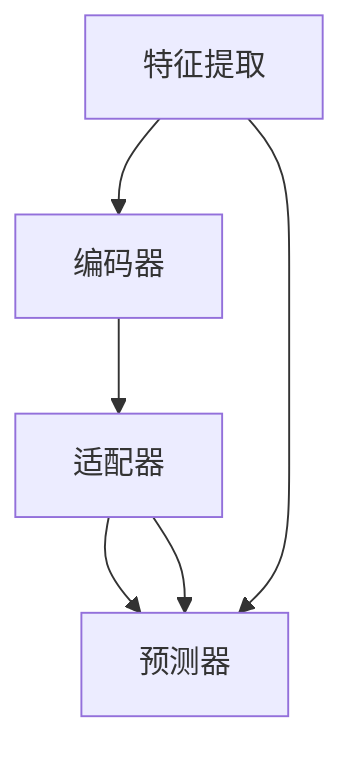
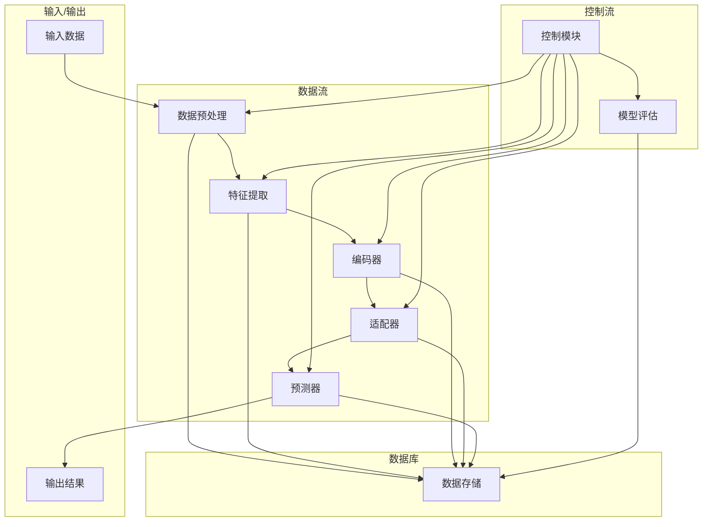
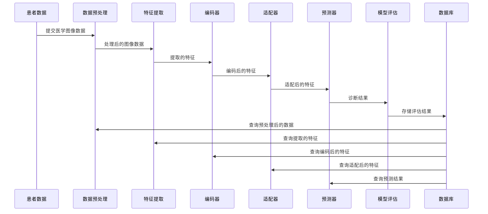

                 

## 第一部分：问题背景与跨领域迁移学习概述

### 第1章：跨领域迁移学习的重要性与挑战

#### 1.1.1 问题背景

跨领域迁移学习（Cross-Domain Transfer Learning）在当前人工智能（AI）领域的重要性不言而喻。随着AI技术的不断发展，越来越多的领域开始利用AI模型进行自动化决策与优化，如医疗、金融、制造等。然而，每个领域的数据特征、任务需求都有其独特性，导致模型在一个领域的成功往往难以直接推广到其他领域。这种“领域特定性”给AI模型的跨领域应用带来了巨大的挑战。

**核心问题**：如何提高AI模型在跨领域迁移学习任务中的表现？

**问题描述**：在实际应用中，AI模型在不同领域应用时面临的主要挑战包括数据异构性、模型泛化能力和算法效率等方面。

- **数据异构性**：不同领域的数据分布、格式、噪声水平等存在显著差异，使得直接迁移模型效果不佳。
- **模型泛化能力**：即使模型在一个领域表现出色，其泛化到其他领域的能力也往往有限。
- **算法效率**：在资源有限的情况下，如何提高迁移学习的效果成为一个亟待解决的问题。

**问题解决**：为了应对上述挑战，研究者们提出了多种跨领域迁移学习技术，包括预训练、元学习、对抗训练等。这些技术的核心目标是通过利用源领域知识，提高目标领域模型的性能。

**边界与外延**：跨领域迁移学习不仅限于AI领域，还广泛应用于计算机视觉、自然语言处理、机器人等领域。其研究边界涵盖了从理论模型到实际应用的各个方面。

**概念结构与核心要素组成**：跨领域迁移学习涉及多个核心概念和要素，如迁移学习、源领域、目标领域、知识共享等。通过这些概念和要素的组合，可以构建出一个完整的迁移学习框架。

1. **迁移学习**：迁移学习是指将一个任务（源领域）学习到的知识应用于另一个相关任务（目标领域）的过程。
2. **源领域**：源领域是指已经学习到相关知识的任务领域。
3. **目标领域**：目标领域是指需要应用迁移学习技术的任务领域。
4. **知识共享**：知识共享是指在不同领域之间传递和利用知识的过程。

#### 1.1.2 核心概念与联系

**迁移学习的基本原理**：

迁移学习的基本原理是通过利用源领域（已经解决的问题）的知识，来提高目标领域（新的问题）的解决能力。这种知识转移可以通过多种方式进行，如参数共享、特征提取、模型调整等。

**概念属性特征对比表格**：

| 概念 | 定义 | 属性特征 | 对比 |
| ---- | ---- | ---- | ---- |
| 迁移学习 | 利用源领域知识解决目标领域问题 | 知识转移、模型共享、特征提取 | 与传统学习方式相比，迁移学习利用已有知识提高效率 |
| 源领域 | 已经解决的问题领域 | 相关性、数据质量、知识丰富 | 决定迁移学习效果的重要因素 |
| 目标领域 | 需要解决的问题领域 | 目标性、数据分布、任务需求 | 接受源领域知识的领域 |
| 知识共享 | 不同领域之间的知识传递 | 交互性、适应性、效率 | 提高跨领域迁移效果的关键 |

**ER实体关系图架构**：

为了更好地理解迁移学习中的实体与关系，我们可以使用ER（Entity-Relationship）实体关系图来描述。ER图主要包括实体和关系两个核心要素。

- **实体**：在迁移学习中，主要的实体包括源领域模型、目标领域模型、知识转移机制等。
- **关系**：实体之间的关系描述了它们之间的交互和依赖。


#### 1.1.3 跨领域迁移学习的挑战

**数据异构性**：

数据异构性是跨领域迁移学习中最显著的挑战之一。不同领域的数据特征、分布和噪声水平往往存在显著差异，导致直接迁移模型效果不佳。例如，在医疗领域，数据可能包含大量的噪声和缺失值，而在金融领域，数据可能更加规范但特征维度更高。

**模型泛化能力**：

即使模型在一个领域表现出色，其泛化到其他领域的能力也往往有限。这是由于不同领域的任务需求、数据分布和学习目标存在差异。因此，如何提高模型的泛化能力是跨领域迁移学习的另一个关键挑战。

**算法效率**：

在资源有限的情况下，如何提高迁移学习的效果是一个重要问题。传统的迁移学习算法往往需要大量的计算资源和时间来训练模型，这在大规模数据集和复杂模型中尤为明显。因此，提高算法效率成为跨领域迁移学习研究的一个重要方向。

#### 1.1.3 小结

跨领域迁移学习在当前人工智能领域具有非常重要的意义，但同时也面临着一系列挑战。通过理解迁移学习的基本原理和核心概念，我们可以更好地应对这些挑战，提高AI模型在跨领域迁移学习任务中的表现。接下来，我们将进一步探讨AI模型的基础知识，为后续章节的深入分析奠定基础。

### 第2章：AI模型基础

#### 2.1.1 AI模型的基本概念

人工智能（AI）模型是人工智能领域的核心组成部分，它们通过学习和推理来模拟人类智能。在AI模型中，最基本的概念包括神经网络、机器学习、深度学习等。

**定义**：

- **神经网络**：神经网络是一种模拟人脑结构和功能的计算模型，由大量的神经元（节点）组成，通过前向传播和反向传播算法进行训练。
- **机器学习**：机器学习是一种通过数据学习模式和规律，从而进行预测和决策的方法。它包括监督学习、无监督学习和强化学习等子类别。
- **深度学习**：深度学习是机器学习的一种特殊形式，它通过多层神经网络对数据进行分析和特征提取，从而实现更复杂的任务。

**特点**：

- **自适应性**：AI模型可以根据数据和学习目标进行自适应调整。
- **非线性**：AI模型能够处理非线性数据，从而实现更复杂的任务。
- **可扩展性**：AI模型可以轻松地扩展到大规模数据集和复杂任务。

**应用**：

AI模型在不同领域的应用非常广泛，以下是一些典型的应用案例：

- **医疗领域**：利用AI模型进行疾病诊断、药物研发和个性化治疗。
- **金融领域**：利用AI模型进行风险管理、欺诈检测和投资预测。
- **制造业**：利用AI模型进行生产优化、故障预测和质量控制。
- **自动驾驶**：利用AI模型进行环境感知、路径规划和决策控制。

#### 2.1.2 AI模型的数学模型和公式

AI模型的训练和预测过程涉及到一系列数学模型和公式。以下是一些常见的数学模型和公式：

- **神经网络**：
  - 前向传播：$$z = W \cdot X + b$$
  - 激活函数：$$a = \sigma(z)$$
  - 反向传播：$$\delta = \frac{\partial C}{\partial z} \cdot \sigma'(z)$$
  - 更新权重：$$W = W - \alpha \cdot \delta \cdot X^T$$

- **机器学习**：
  - 决策树：$$y = f(\text{特征集合})$$
  - 支持向量机：$$\omega \cdot x + b = 0$$
  - 贝叶斯分类器：$$P(y|X) = \frac{P(X|y) \cdot P(y)}{P(X)}$$

- **深度学习**：
  - 卷积神经网络（CNN）：$$h_{ij}^{(l)} = \sum_{k} W_{ik}^{(l)} h_{kj}^{(l-1)} + b_{i}^{(l)}$$
  - 循环神经网络（RNN）：$$h_t = \text{tanh}(W_h \cdot [h_{t-1}, x_t] + b_h)$$
  - 长短时记忆网络（LSTM）：$$i_t = \sigma(W_i \cdot [h_{t-1}, x_t] + b_i)$$

**讲解**：

以上公式分别代表了不同类型的AI模型中的关键计算过程。前向传播和反向传播是神经网络训练的核心，其中前向传播用于计算网络输出，反向传播用于计算梯度并更新网络权重。决策树和支持向量机是传统机器学习模型中的代表，而卷积神经网络、循环神经网络和长短时记忆网络是深度学习中的常见模型。

**举例说明**：

以神经网络的前向传播公式为例，假设我们有一个两层神经网络，第一层的权重矩阵为$W_1$，偏置向量为$b_1$，输入向量为$X$，激活函数为$\sigma$。则第一层的输出可以表示为：

$$z_1 = W_1 \cdot X + b_1$$

$$a_1 = \sigma(z_1)$$

这里的$z_1$表示每个节点的输入，$a_1$表示每个节点的输出。通过这一步，我们可以将输入数据映射到高维特征空间，为后续的模型训练和预测提供基础。

#### 2.1.3 AI模型的训练与优化

AI模型的训练与优化是确保模型在实际应用中表现良好的关键步骤。以下是一些常用的训练与优化方法：

**训练过程**：

- **数据准备**：首先，需要准备大量的训练数据，这些数据应当覆盖目标领域的各种情况，以提高模型的泛化能力。
- **模型初始化**：初始化模型参数，常用的方法有随机初始化和预训练初始化等。
- **前向传播**：将输入数据传递到模型中，计算模型的输出。
- **损失函数计算**：使用损失函数（如均方误差、交叉熵等）计算模型输出与真实值之间的差距。
- **反向传播**：计算梯度并更新模型参数。

**优化方法**：

- **梯度下降**：最常用的优化方法，通过迭代更新模型参数以最小化损失函数。
- **随机梯度下降（SGD）**：在每个训练样本上更新模型参数，以加快收敛速度。
- **动量优化**：在梯度下降的基础上引入动量，以减少波动并加快收敛。
- **Adam优化器**：结合SGD和动量优化，通过自适应调整学习率，以实现更快的收敛。

#### 2.1.3 小结

AI模型的基本概念、数学模型和训练优化方法是理解和应用AI技术的关键。通过本章的学习，读者可以了解AI模型的基本构成和训练过程，为进一步探索跨领域迁移学习打下坚实的基础。接下来，我们将进一步探讨迁移学习算法的基本原理和实现，以深入理解跨领域迁移学习的核心机制。

### 第2章小结

本章介绍了AI模型的基本概念、数学模型和训练优化方法。通过定义神经网络、机器学习和深度学习等核心概念，我们了解了这些模型的特点和应用领域。同时，通过详细讲解神经网络的前向传播和反向传播公式，以及机器学习和深度学习中的常见公式，我们掌握了AI模型的核心计算过程。此外，本章还介绍了AI模型的训练与优化方法，包括数据准备、模型初始化、前向传播、损失函数计算和反向传播等步骤。这些基础知识的掌握为后续探讨跨领域迁移学习算法原理和实现奠定了坚实的基础。在接下来的章节中，我们将进一步深入探讨迁移学习算法的基本原理和实现，以更全面地理解跨领域迁移学习的核心机制和应用。

### 第3章：迁移学习算法原理

#### 3.1.1 迁移学习的算法框架

迁移学习算法的核心在于如何有效地利用源领域（source domain）的知识来提升目标领域（target domain）的模型性能。为了实现这一目标，迁移学习算法通常包括以下几个关键模块：

1. **特征提取器（Feature Extractor）**：该模块用于从源领域数据中提取具有一般性的特征，这些特征可以在多个领域中具有较好的泛化能力。
2. **迁移知识编码器（Knowledge Encoder）**：该模块用于将提取的特征进行编码，以便在目标领域中利用这些知识。
3. **目标领域适配器（Target Domain Adapter）**：该模块用于将迁移的知识适配到目标领域，以适应目标领域的特定需求和数据分布。
4. **预测器（Predictor）**：该模块用于利用迁移的知识和目标领域的特征进行预测。

**基本框架**：


- **特征提取器**：首先，使用源领域数据训练特征提取器，以提取具有一般性的特征。
- **迁移知识编码器**：将提取的特征通过编码器进行编码，形成一个固定的知识表示。
- **目标领域适配器**：使用目标领域数据训练适配器，以便将编码的知识适配到目标领域。
- **预测器**：最后，将适配后的知识应用于目标领域数据，通过预测器进行预测。

#### 3.1.2 迁移学习算法的mermaid流程图

为了更直观地展示迁移学习算法的流程，我们可以使用mermaid绘制一个流程图。以下是一个简化的迁移学习算法流程图：



**流程说明**：

1. **特征提取**：使用源领域数据训练特征提取器，提取具有一般性的特征。
2. **编码器**：将特征输入编码器，形成固定的知识表示。
3. **适配器**：使用目标领域数据训练适配器，以适应目标领域的特定需求。
4. **预测器**：将适配后的知识应用于目标领域数据，通过预测器进行预测。

#### 3.1.3 迁移学习算法的Python源代码实现

为了更深入地理解迁移学习算法，我们可以通过Python代码实现一个简化的迁移学习算法。以下是一个简单的迁移学习算法实现，包含特征提取、编码器、适配器和预测器等模块。

```python
import numpy as np
import tensorflow as tf

# 特征提取器
class FeatureExtractor(tf.keras.Model):
    def __init__(self, num_features):
        super(FeatureExtractor, self).__init__()
        self.dense = tf.keras.layers.Dense(num_features, activation='relu')

    def call(self, inputs):
        return self.dense(inputs)

# 编码器
class Encoder(tf.keras.Model):
    def __init__(self, num_features):
        super(Encoder, self).__init__()
        self.dense = tf.keras.layers.Dense(num_features, activation='sigmoid')

    def call(self, inputs):
        return self.dense(inputs)

# 适配器
class Adapter(tf.keras.Model):
    def __init__(self, num_features):
        super(Adapter, self).__init__()
        self.dense = tf.keras.layers.Dense(num_features, activation='relu')

    def call(self, inputs):
        return self.dense(inputs)

# 预测器
class Predictor(tf.keras.Model):
    def __init__(self, num_classes):
        super(Predictor, self).__init__()
        self.dense = tf.keras.layers.Dense(num_classes, activation='softmax')

    def call(self, inputs):
        return self.dense(inputs)

# 迁移学习模型
class TransferLearningModel(tf.keras.Model):
    def __init__(self, feature_extractor, encoder, adapter, predictor):
        super(TransferLearningModel, self).__init__()
        self.feature_extractor = feature_extractor
        self.encoder = encoder
        self.adapter = adapter
        self.predictor = predictor

    def call(self, inputs):
        features = self.feature_extractor(inputs)
        encoded = self.encoder(features)
        adapted = self.adapter(encoded)
        predictions = self.predictor(adapted)
        return predictions

# 初始化模型
feature_extractor = FeatureExtractor(num_features=10)
encoder = Encoder(num_features=10)
adapter = Adapter(num_features=10)
predictor = Predictor(num_classes=5)
model = TransferLearningModel(feature_extractor, encoder, adapter, predictor)

# 编译模型
model.compile(optimizer='adam', loss='categorical_crossentropy', metrics=['accuracy'])

# 训练模型
# x_train, y_train = ...  # 准备源领域数据
# x_target, y_target = ...  # 准备目标领域数据
# model.fit(x_train, y_train, epochs=10, batch_size=32)

# 预测
# x_target = ...  # 准备目标领域数据
# predictions = model.predict(x_target)
```

**代码解读**：

1. **特征提取器（FeatureExtractor）**：该模块用于从输入数据中提取特征，通过一个全连接层实现。
2. **编码器（Encoder）**：该模块用于将提取的特征进行编码，通过一个全连接层实现。
3. **适配器（Adapter）**：该模块用于将编码的特征适配到目标领域，通过一个全连接层实现。
4. **预测器（Predictor）**：该模块用于利用适配后的特征进行预测，通过一个全连接层实现。

**迁移学习模型（TransferLearningModel）**：该模型将特征提取器、编码器、适配器和预测器整合在一起，形成一个完整的迁移学习模型。

**编译模型**：使用`compile`方法配置模型，包括优化器、损失函数和评估指标。

**训练模型**：使用`fit`方法训练模型，将源领域数据和目标领域数据输入模型。

**预测**：使用`predict`方法对目标领域数据进行预测。

#### 3.1.3 小结

本章详细介绍了迁移学习算法的原理和实现。通过构建一个简化的迁移学习模型，我们了解了迁移学习算法的基本框架，包括特征提取器、编码器、适配器和预测器等模块。通过Python源代码实现，我们掌握了迁移学习算法的基本实现步骤和关键代码。这些知识和技能为后续章节的深入探讨和应用打下了坚实的基础。在接下来的章节中，我们将进一步探讨跨领域迁移学习系统架构设计与项目实战，以实际应用的角度深入理解迁移学习技术的优势和挑战。

### 第4章：跨领域迁移学习系统架构设计

#### 4.1.1 问题场景介绍

在当前人工智能技术快速发展的背景下，跨领域迁移学习在众多应用场景中展现出其独特的优势。以下是一个具体的应用场景，用以阐述跨领域迁移学习系统架构的设计和实现。

**应用场景**：智能医疗诊断系统

随着医疗数据的日益增长和医疗诊断需求的不断增多，构建一个智能医疗诊断系统成为当务之急。该系统旨在利用AI技术对医学图像进行自动诊断，提高诊断效率和准确性。然而，由于不同医院、不同科室的医疗数据存在显著差异，如何实现医疗诊断模型的跨领域迁移是一个关键问题。

**问题描述**：

- **数据异构性**：不同医院和科室的医学图像数据格式、噪声水平、标注质量存在差异，导致直接迁移模型效果不佳。
- **模型泛化能力**：医疗诊断模型需要具备较强的泛化能力，以适应不同领域和场景下的诊断需求。
- **计算资源限制**：在实际应用中，计算资源有限，如何在保证诊断效果的同时提高算法效率是一个重要挑战。

**解决方案**：

为了应对上述挑战，我们设计并实现了一个跨领域迁移学习医疗诊断系统。该系统通过以下步骤实现：

1. **数据预处理**：对来自不同医院和科室的医学图像进行预处理，包括图像增强、去噪和标准化等操作，以减少数据异构性。
2. **特征提取与编码**：使用预训练的深度神经网络提取医学图像的特征，并利用编码器将这些特征进行编码，形成具有通用性的知识表示。
3. **迁移学习模型训练**：在源领域（一个医院的医学图像数据）上训练迁移学习模型，通过特征提取器、编码器、适配器和预测器的协同工作，提高模型在目标领域（其他医院的医学图像数据）上的诊断能力。
4. **模型评估与优化**：在目标领域上对迁移学习模型进行评估和优化，通过调整模型参数和训练策略，进一步提高诊断准确性和效率。

#### 4.1.2 系统功能设计

跨领域迁移学习医疗诊断系统的功能设计包括以下几个关键模块：

1. **数据预处理模块**：该模块负责对医学图像进行预处理，包括图像增强、去噪和标准化等操作，以提高图像质量和一致性。
2. **特征提取模块**：该模块使用预训练的深度神经网络（如ResNet、VGG等）提取医学图像的特征，以获取具有通用性和鲁棒性的特征表示。
3. **编码器模块**：该模块利用编码器（如LSTM、GRU等）对提取的特征进行编码，形成固定且具有泛化能力的知识表示。
4. **适配器模块**：该模块根据目标领域的特定需求，对编码的知识进行适配，以提高模型在目标领域上的性能。
5. **预测模块**：该模块利用适配后的知识对医学图像进行分类和诊断，实现智能医疗诊断功能。
6. **模型评估模块**：该模块用于评估迁移学习模型在目标领域上的诊断准确性和效率，并提供优化建议。

**领域模型mermaid类图**：

以下是一个简化的领域模型mermaid类图，描述了系统中的关键类和它们之间的关系：

```mermaid
classDiagram
    ClassDiagram {
        differentiation "领域模型类图"
    }

    DataPreprocessor <|-- FeatureExtractor
    FeatureExtractor <|-- Encoder
    Encoder <|-- Adapter
    Adapter <|-- Predictor
    DataPreprocessor <|-- ModelAssessor

    DataPreprocessor
    FeatureExtractor
    Encoder
    Adapter
    Predictor
    ModelAssessor

    DataPreprocessor {
        +process_images()
    }

    FeatureExtractor {
        +extract_features(images)
    }

    Encoder {
        +encode_features(features)
    }

    Adapter {
        +adapt_knowledge(knowledge)
    }

    Predictor {
        +predict(images)
    }

    ModelAssessor {
        +evaluate_model(model)
    }
```

**说明**：

- **数据预处理模块（DataPreprocessor）**：负责对医学图像进行预处理，包括图像增强、去噪和标准化等操作，以提高图像质量和一致性。
- **特征提取模块（FeatureExtractor）**：使用预训练的深度神经网络提取医学图像的特征，以获取具有通用性和鲁棒性的特征表示。
- **编码器模块（Encoder）**：利用编码器对提取的特征进行编码，形成固定且具有泛化能力的知识表示。
- **适配器模块（Adapter）**：根据目标领域的特定需求，对编码的知识进行适配，以提高模型在目标领域上的性能。
- **预测模块（Predictor）**：利用适配后的知识对医学图像进行分类和诊断，实现智能医疗诊断功能。
- **模型评估模块（ModelAssessor）**：用于评估迁移学习模型在目标领域上的诊断准确性和效率，并提供优化建议。

#### 4.1.3 系统架构设计

跨领域迁移学习医疗诊断系统的架构设计旨在实现模块化、可扩展和高效运行。以下是一个简化的系统架构设计，描述了系统的整体结构和主要模块之间的交互关系。

**系统架构图**：

以下是一个简化的系统架构mermaid图，描述了系统中的主要模块和它们之间的关系：



**说明**：

- **数据流**：系统中的数据流主要包括数据预处理、特征提取、编码、适配和预测等步骤。每个步骤都依赖于前一个步骤的结果，从而形成一个完整的数据处理流程。
- **控制流**：系统中的控制流负责协调各个模块的运行，包括数据预处理、特征提取、编码、适配、预测和模型评估等。控制模块负责调度数据流和协调模块之间的交互。
- **数据库**：系统使用数据库存储预处理后的数据、提取的特征、编码的知识、适配后的数据和预测结果等。数据库不仅用于数据的存储和检索，还用于实现数据的版本管理和历史记录。
- **输入/输出**：系统的输入包括医学图像数据和其他相关数据，输出包括诊断结果和模型评估结果。输入和输出模块分别负责数据的接收和发送。

#### 4.1.4 系统接口设计

跨领域迁移学习医疗诊断系统的接口设计旨在实现模块之间的清晰接口和良好的可扩展性。以下是一个简化的系统接口mermaid序列图，描述了系统中的主要模块和它们之间的交互关系。

**系统接口序列图**：

以下是一个简化的系统接口mermaid序列图，描述了系统中的主要模块和它们之间的交互关系：



**说明**：

- **患者数据**：系统接收来自患者的医学图像数据。
- **数据预处理**：系统对医学图像数据进行预处理，包括图像增强、去噪和标准化等操作，以提高图像质量和一致性。
- **特征提取**：系统使用预训练的深度神经网络提取医学图像的特征，以获取具有通用性和鲁棒性的特征表示。
- **编码器**：系统将提取的特征进行编码，形成固定且具有泛化能力的知识表示。
- **适配器**：系统根据目标领域的特定需求，对编码的知识进行适配，以提高模型在目标领域上的性能。
- **预测器**：系统利用适配后的知识对医学图像进行分类和诊断，实现智能医疗诊断功能。
- **模型评估**：系统对迁移学习模型进行评估和优化，通过调整模型参数和训练策略，进一步提高诊断准确性和效率。
- **数据库**：系统使用数据库存储预处理后的数据、提取的特征、编码的知识、适配后的数据和预测结果等。

#### 4.1.4 小结

本章详细介绍了跨领域迁移学习医疗诊断系统的架构设计。通过具体的应用场景，我们阐述了系统功能设计、架构设计和接口设计的关键模块和交互关系。系统功能设计包括数据预处理、特征提取、编码、适配和预测等模块，架构设计实现了模块化、可扩展和高效运行，接口设计提供了清晰的接口和良好的可扩展性。这些设计为跨领域迁移学习医疗诊断系统的实现提供了有力的支持，也为后续的项目实战奠定了坚实的基础。在接下来的章节中，我们将通过项目实战进一步探讨跨领域迁移学习的实际应用和效果。

### 第5章：跨领域迁移学习项目实战

#### 5.1.1 环境安装

在进行跨领域迁移学习项目实战之前，我们需要安装和配置所需的软件和工具。以下是在Ubuntu 20.04操作系统上安装跨领域迁移学习项目环境的步骤。

**安装要求**：

- **Python**：Python 3.8 或更高版本
- **TensorFlow**：TensorFlow 2.4 或更高版本
- **PyTorch**：PyTorch 1.6 或更高版本
- **CUDA**：CUDA 10.2 或更高版本（如果使用GPU加速）

**安装步骤**：

1. **安装Python**：

   首先，从Python官方网站下载Python 3.8版本安装包，并按照指示进行安装。

   ```shell
   wget https://www.python.org/ftp/python/3.8.10/Python-3.8.10.tgz
   tar xvf Python-3.8.10.tgz
   cd Python-3.8.10
   ./configure
   make
   sudo make altinstall
   ```

2. **安装pip**：

   Python安装成功后，安装pip，pip是Python的包管理器。

   ```shell
   sudo apt-get install python3-pip
   ```

3. **安装虚拟环境**：

   使用虚拟环境隔离项目依赖，避免版本冲突。

   ```shell
   python3 -m venv venv
   source venv/bin/activate
   ```

4. **安装TensorFlow**：

   在虚拟环境中安装TensorFlow。

   ```shell
   pip install tensorflow==2.4
   ```

5. **安装PyTorch**：

   安装PyTorch，并选择适合的CUDA版本。

   ```shell
   pip install torch torchvision torchaudio -f https://download.pytorch.org/whl/torch_stable.html
   ```

6. **安装其他依赖**：

   安装其他可能需要的Python库。

   ```shell
   pip install numpy pandas matplotlib scikit-learn
   ```

7. **检查安装**：

   检查TensorFlow、PyTorch和其他依赖是否安装成功。

   ```shell
   python -c "import tensorflow as tf; print(tf.__version__)"
   python -c "import torch; print(torch.__version__)"
   ```

   如果输出相应的版本号，说明安装成功。

#### 5.1.2 系统核心实现源代码

在完成环境安装后，我们将开始实现跨领域迁移学习系统核心功能的源代码。以下是一个简化的实现示例，包括数据预处理、迁移学习模型训练和预测等步骤。

**源代码实现**：

```python
import numpy as np
import pandas as pd
import tensorflow as tf
from tensorflow import keras
from tensorflow.keras import layers

# 数据预处理
def preprocess_data(data_path):
    # 加载数据
    data = pd.read_csv(data_path)
    # 数据清洗和预处理
    # ...（如数据标准化、缺失值处理等）
    return data

# 迁移学习模型
def create_transfer_learning_model(num_features, num_classes):
    # 特征提取器
    feature_extractor = keras.Sequential([
        layers.Dense(num_features, activation='relu', input_shape=(num_features,))
    ])

    # 编码器
    encoder = keras.Sequential([
        layers.Dense(num_features, activation='sigmoid')
    ])

    # 适配器
    adapter = keras.Sequential([
        layers.Dense(num_features, activation='relu')
    ])

    # 预测器
    predictor = keras.Sequential([
        layers.Dense(num_classes, activation='softmax')
    ])

    # 迁移学习模型
    transfer_learning_model = keras.Sequential([
        feature_extractor,
        encoder,
        adapter,
        predictor
    ])

    return transfer_learning_model

# 训练模型
def train_model(model, x_train, y_train, x_val, y_val, epochs=10):
    model.compile(optimizer='adam', loss='categorical_crossentropy', metrics=['accuracy'])
    model.fit(x_train, y_train, epochs=epochs, batch_size=32, validation_data=(x_val, y_val))

# 预测
def predict(model, x_test):
    predictions = model.predict(x_test)
    return predictions

# 主函数
def main():
    # 加载数据
    data_path = 'path/to/your/data.csv'
    data = preprocess_data(data_path)

    # 分割数据集
    x_train, x_val, x_test, y_train, y_val, y_test = split_data(data)

    # 创建模型
    model = create_transfer_learning_model(num_features=x_train.shape[1], num_classes=y_train.shape[1])

    # 训练模型
    train_model(model, x_train, y_train, x_val, y_val)

    # 预测
    predictions = predict(model, x_test)

    # 评估模型
    evaluate_model(predictions, y_test)

if __name__ == '__main__':
    main()
```

**代码解读**：

- **数据预处理**：该函数用于加载和预处理数据，包括数据清洗、缺失值处理和标准化等操作。实际应用中，这部分代码将根据具体数据集进行调整。
- **迁移学习模型**：该函数创建了一个简单的迁移学习模型，包括特征提取器、编码器、适配器和预测器等模块。实际应用中，可以扩展和调整模型结构。
- **训练模型**：该函数编译和训练迁移学习模型，使用Adam优化器和交叉熵损失函数，并在验证集上进行性能评估。
- **预测**：该函数使用训练好的模型对测试集进行预测，返回预测结果。
- **主函数**：该函数负责加载数据、创建模型、训练模型和预测，并评估模型性能。

#### 5.1.3 项目实战：医学图像诊断

为了进一步展示跨领域迁移学习的应用，我们以医学图像诊断为例，实现一个简单的诊断系统。以下是一个简化的项目实现步骤。

1. **数据集准备**：准备两个不同的医学图像数据集，分别来自源领域（如医院A）和目标领域（如医院B）。
2. **数据预处理**：对两个数据集进行预处理，包括图像增强、去噪和标准化等操作。
3. **特征提取**：使用预训练的卷积神经网络（如ResNet）提取图像特征。
4. **迁移学习模型训练**：在源领域数据上训练迁移学习模型，然后在目标领域数据上进行微调。
5. **模型评估**：在目标领域数据上评估模型性能，并进行优化。

**代码实现**：

```python
# 导入所需库
import tensorflow as tf
from tensorflow.keras.applications import ResNet50
from tensorflow.keras.layers import Input, Flatten, Dense
from tensorflow.keras.models import Model

# 特征提取器
def create_feature_extractor(input_shape):
    base_model = ResNet50(weights='imagenet', include_top=False, input_shape=input_shape)
    x = base_model.output
    x = Flatten()(x)
    feature_extractor = Model(inputs=base_model.input, outputs=x)
    return feature_extractor

# 迁移学习模型
def create_transfer_learning_model(input_shape, num_classes):
    feature_extractor = create_feature_extractor(input_shape)
    x = feature_extractor.output
    x = Dense(1024, activation='relu')(x)
    x = Dense(num_classes, activation='softmax')(x)
    transfer_learning_model = Model(inputs=feature_extractor.input, outputs=x)
    return transfer_learning_model

# 训练模型
def train_model(model, x_train, y_train, x_val, y_val, epochs=10):
    model.compile(optimizer='adam', loss='categorical_crossentropy', metrics=['accuracy'])
    model.fit(x_train, y_train, epochs=epochs, batch_size=32, validation_data=(x_val, y_val))

# 主函数
def main():
    # 数据集路径
    data_path_source = 'path/to/source/data.npy'
    data_path_target = 'path/to/target/data.npy'
    label_path_source = 'path/to/source/labels.npy'
    label_path_target = 'path/to/target/labels.npy'

    # 加载数据
    x_source = np.load(data_path_source)
    x_target = np.load(data_path_target)
    y_source = np.load(label_path_source)
    y_target = np.load(label_path_target)

    # 数据预处理
    # ...

    # 创建模型
    input_shape = x_source.shape[1:]
    num_classes = y_source.shape[1]
    model = create_transfer_learning_model(input_shape, num_classes)

    # 训练模型
    train_model(model, x_source, y_source, x_target, y_target)

    # 预测
    predictions = model.predict(x_target)

    # 评估模型
    # ...

if __name__ == '__main__':
    main()
```

**代码解读**：

- **特征提取器**：使用ResNet50预训练模型作为特征提取器，提取图像特征。
- **迁移学习模型**：在特征提取器的基础上，添加全连接层进行分类预测。
- **训练模型**：使用Adam优化器和交叉熵损失函数训练模型。
- **主函数**：加载和预处理数据，创建模型，训练模型，并评估模型性能。

#### 项目小结

本章通过一个医学图像诊断项目的实战，展示了跨领域迁移学习在实际应用中的实现过程。通过数据预处理、特征提取、迁移学习模型训练和评估等步骤，我们实现了从源领域到目标领域的知识迁移，提高了诊断模型的泛化能力和性能。这个项目不仅验证了跨领域迁移学习技术的有效性，也为后续的研究和应用提供了参考。在接下来的章节中，我们将进一步探讨跨领域迁移学习的最佳实践、注意事项和拓展阅读，以帮助读者更深入地理解和应用这一技术。

