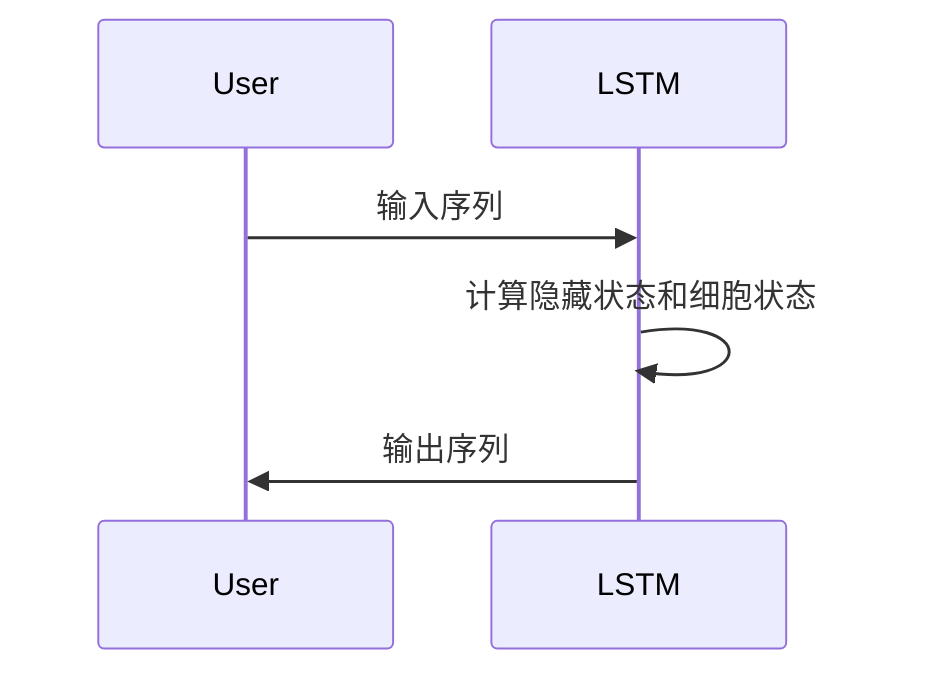
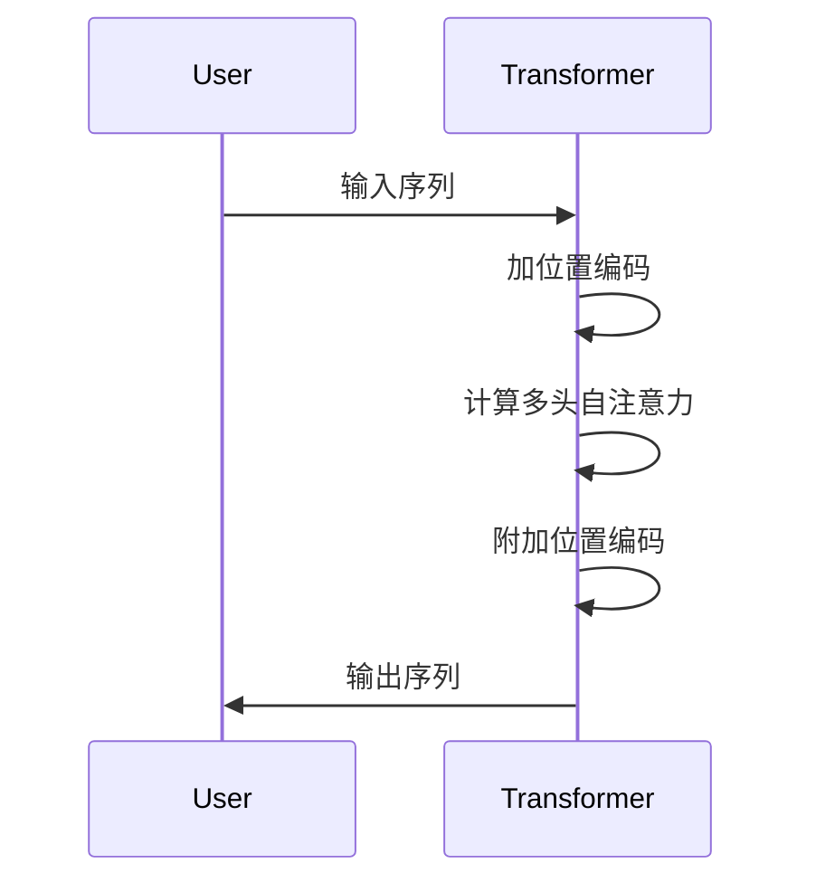
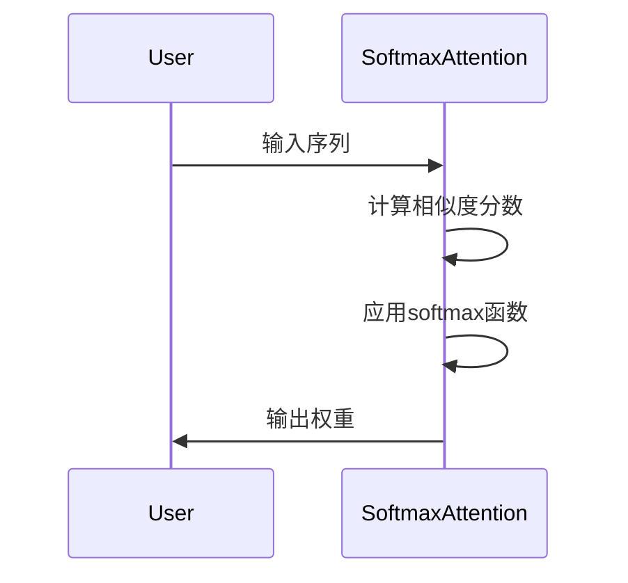
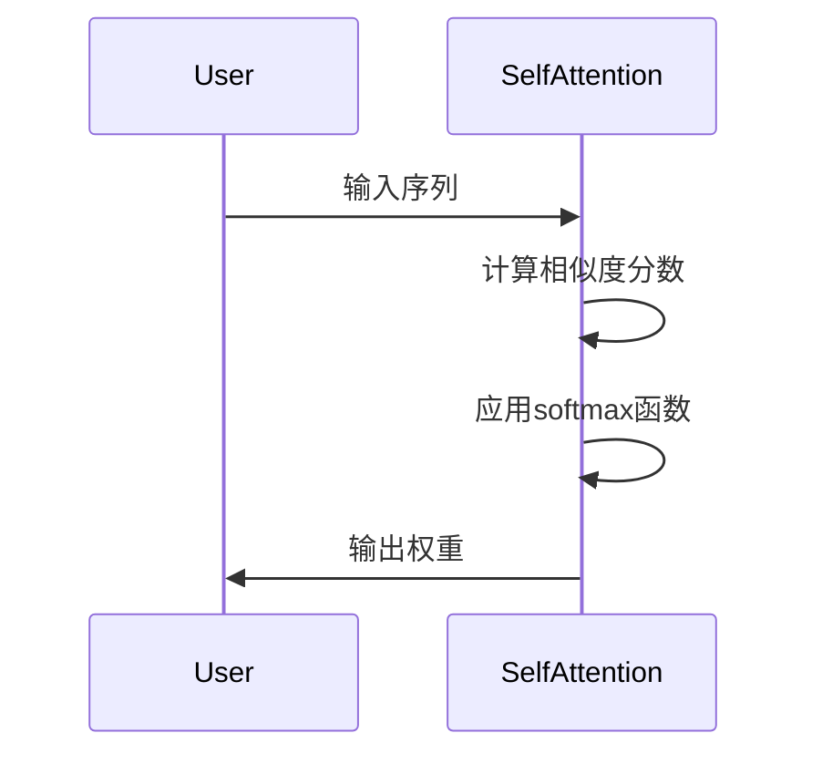
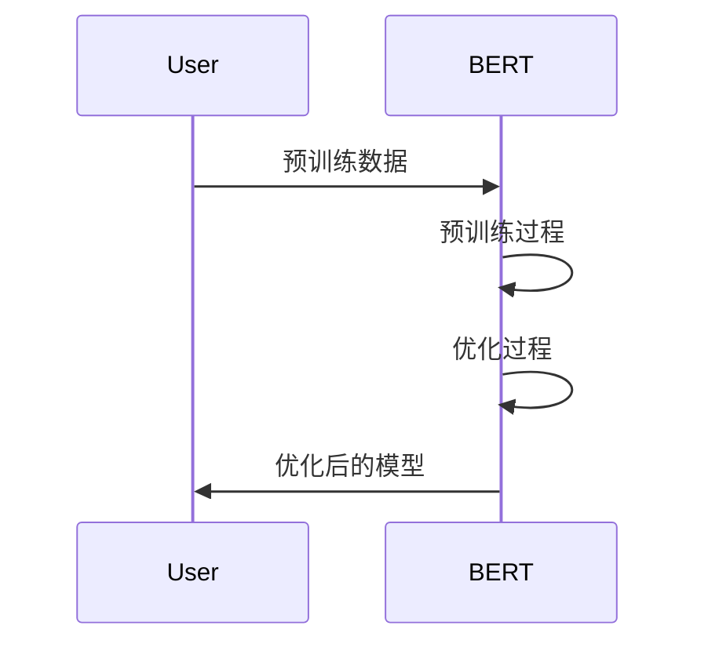
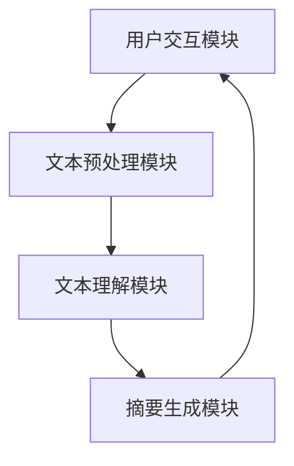
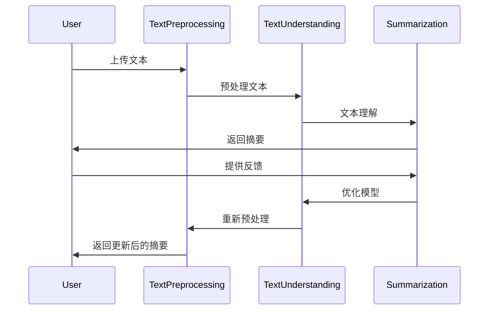

                 

### 背景介绍

#### 核心概念术语说明

在探讨如何提升AI模型在长文本理解任务中的性能之前，我们首先需要明确一些核心概念和术语：

- **自然语言处理（NLP）**：自然语言处理是计算机科学和人工智能的一个分支，它涉及机器对人类语言的理解和生成。
- **序列模型**：序列模型是一类用于处理序列数据（如文本、语音等）的机器学习模型，它们通过捕捉序列中的依赖关系来建模数据。
- **注意力机制**：注意力机制是一种在处理序列数据时提高模型对重要信息关注度的方法，它使模型能够在不同时间步之间分配不同的关注权重。
- **长文本理解**：长文本理解是指AI模型对较长的文本内容进行理解和分析的能力，这包括提取关键信息、语义分析等。

#### 问题背景

随着互联网和数字化信息爆炸式增长，长文本的数据量日益庞大，对于AI模型在长文本理解任务中的应用需求也越来越高。然而，传统的方法往往在处理长文本时遇到性能瓶颈，例如：

1. **计算资源消耗大**：传统的序列模型（如LSTM、GRU等）在处理长文本时，需要大量的计算资源来处理每一个时间步的数据，这导致模型的训练和推理效率低下。
2. **信息丢失**：长文本中包含大量信息，传统模型在处理时往往无法有效地捕捉到所有重要信息，导致理解效果不佳。
3. **上下文依赖性弱**：传统模型在处理长文本时，很难捕捉到不同部分之间的上下文依赖关系，这使得文本理解不够精确。

#### 问题描述

为了提升AI模型在长文本理解任务中的性能，我们需要解决以下几个关键问题：

1. **计算效率**：如何降低模型在处理长文本时的计算资源消耗，提高模型训练和推理的效率？
2. **信息捕捉**：如何提高模型捕捉长文本中重要信息的能力，减少信息丢失？
3. **上下文依赖性**：如何增强模型对文本上下文依赖性的捕捉，提高文本理解的准确性？

#### 问题解决

解决上述问题的思路可以从以下几个方面入手：

1. **算法改进**：引入新的算法和技术，如Transformer模型和注意力机制，以提升模型在处理长文本时的性能。
2. **模型优化**：对现有模型进行优化，如使用预训练技术（如BERT、GPT）来提高模型的泛化能力和理解能力。
3. **数据增强**：通过增加高质量的训练数据、数据增强技术等，来提升模型对长文本的适应能力。

#### 需要提升的方面

在提升AI模型在长文本理解任务中的性能时，我们需要关注以下几个关键方面：

1. **模型效率**：如何提高模型的训练和推理速度，降低计算资源消耗？
2. **模型准确性**：如何提高模型在长文本理解任务中的准确性，减少错误率和漏检率？
3. **模型泛化能力**：如何提升模型在不同类型、不同长度的文本数据上的泛化能力？

通过上述分析和思考，我们可以为后续的内容构建一个清晰的结构，逐步深入探讨如何提升AI模型在长文本理解任务中的性能。

### 传统方法与现有解决方案

在深入探讨提升AI模型在长文本理解任务中性能的具体方法之前，我们先来回顾一下传统的长文本理解方法和现有的解决方案。

#### 传统方法

传统方法主要依赖于序列模型（如LSTM、GRU等）来处理长文本。这些模型通过捕捉文本序列中的依赖关系来实现对文本的理解。尽管这些模型在早期的NLP任务中取得了显著的成绩，但它们在处理长文本时仍存在以下局限：

1. **梯度消失与梯度爆炸**：由于序列模型是基于递归结构，因此在训练过程中容易遇到梯度消失或梯度爆炸的问题，这影响了模型的训练效果和收敛速度。
2. **计算资源消耗大**：序列模型在处理长文本时需要逐个时间步地处理文本序列，这导致模型的训练和推理效率较低。
3. **上下文捕捉能力有限**：传统序列模型在处理长文本时，很难捕捉到文本中的长距离依赖关系，导致理解效果不佳。

#### 现有解决方案

为了克服传统方法的局限，研究人员提出了多种新的算法和技术，这些方法在提升AI模型在长文本理解任务中的性能方面取得了显著进展：

1. **Transformer模型**：Transformer模型是一种基于注意力机制的序列到序列模型，它在处理长文本时具有以下几个优势：
   - **并行计算**：Transformer模型采用自注意力机制，使得模型可以在计算过程中并行处理不同的时间步，大大提高了计算效率。
   - **捕捉长距离依赖关系**：通过自注意力机制，Transformer模型可以有效地捕捉到文本中的长距离依赖关系，提高了文本理解的准确性。
   - **结构简洁**：Transformer模型的架构相对简单，易于实现和优化。

2. **BERT模型**：BERT（Bidirectional Encoder Representations from Transformers）模型是Google提出的预训练语言模型，它在长文本理解任务中表现出色。BERT模型通过以下方法提升了长文本理解的性能：
   - **双向编码器**：BERT模型采用双向编码器，可以同时考虑文本序列的前后依赖关系，提高了文本理解的深度。
   - **大规模预训练**：BERT模型在大规模的语料库上进行预训练，通过学习丰富的语言特征，提高了模型对未知文本的泛化能力。
   - **多层注意力机制**：BERT模型采用多层注意力机制，使得模型能够更加精细地捕捉文本中的关键信息。

3. **GPT模型**：GPT（Generative Pre-trained Transformer）模型是OpenAI提出的预训练语言模型，它在生成文本和长文本理解任务中表现出色。GPT模型的主要特点包括：
   - **生成性预训练**：GPT模型通过生成文本的方式进行预训练，使得模型在生成文本和长文本理解任务中具有优秀的性能。
   - **大规模预训练**：GPT模型采用大规模预训练数据，通过学习大量的文本数据，提高了模型的语言理解和生成能力。
   - **自适应学习率**：GPT模型在训练过程中采用自适应学习率，使得模型在预训练阶段能够更好地优化参数。

综上所述，传统方法和现有解决方案在提升AI模型在长文本理解任务中的性能方面各有优劣。通过引入新的算法和技术，如Transformer模型、BERT模型和GPT模型，我们可以有效地克服传统方法的局限，提升模型在长文本理解任务中的性能。

### 需要提升的方面

尽管现有的AI模型在长文本理解任务中已经取得了显著的成绩，但仍然存在一些需要进一步提升的方面：

#### 计算效率

1. **并行计算**：目前的序列模型（如LSTM、GRU）在处理长文本时，通常采用逐个时间步的递归计算方式，这种方式导致计算资源消耗较大。引入并行计算（如Transformer模型中的自注意力机制）可以显著提高模型的计算效率。
2. **量化技术**：通过量化技术，将模型的参数和激活值进行低精度表示，可以减少模型的计算量和存储需求，从而提高计算效率。

#### 模型准确性

1. **上下文依赖性**：传统序列模型在处理长文本时，很难捕捉到文本中的长距离依赖关系，导致理解效果不佳。引入注意力机制（如Transformer模型中的自注意力机制）可以有效地捕捉到文本中的关键信息，提高模型对上下文依赖性的捕捉能力。
2. **多任务学习**：通过多任务学习，模型可以在处理不同类型的文本任务时共享知识，提高模型在不同类型文本数据上的泛化能力和理解准确性。

#### 模型泛化能力

1. **数据增强**：通过数据增强技术（如数据扩充、数据清洗等），可以增加训练数据的多样性和质量，从而提高模型在不同类型、不同长度的文本数据上的泛化能力。
2. **迁移学习**：通过迁移学习，模型可以在较小的数据集上实现较高的性能，特别是在处理未知文本数据时。

### 总结

通过提升计算效率、增强上下文依赖性和提高模型泛化能力，我们可以进一步优化AI模型在长文本理解任务中的性能。这需要我们不断地探索新的算法和技术，并针对具体的任务需求进行模型优化和调优。只有这样，我们才能更好地应对长文本理解任务中的挑战，实现更高的性能和更广泛的应用。

### 边界与外延

在讨论提升AI模型在长文本理解任务中的性能时，我们不仅需要关注核心问题和解决方案，还应该明确长文本理解的边界和相关领域的外延。

#### 长文本理解的边界

长文本理解存在以下几个边界：

1. **文本长度限制**：虽然AI模型在理论上可以处理任意长度的文本，但在实际应用中，文本长度会受到硬件资源和计算效率的限制。因此，在实际应用中，通常需要根据硬件资源和任务需求对文本长度进行限制。
2. **上下文依赖性**：长文本理解中的上下文依赖性是有限的。即使采用注意力机制等先进技术，模型在处理长距离依赖时仍然存在一定的困难。这导致模型在处理极长文本时，可能会丢失部分关键信息。
3. **领域适应性**：不同的领域有不同的语言特性和语义关系，模型在处理特定领域文本时，可能会面临适应性不足的问题。因此，长文本理解需要针对特定领域进行定制化处理。

#### 相关领域的外延

除了自然语言处理（NLP）领域，长文本理解还与以下相关领域密切相关：

1. **知识图谱**：知识图谱是一种用于表示实体及其关系的图形结构，它可以提供丰富的背景信息和上下文，帮助AI模型更好地理解和分析长文本。在长文本理解中，知识图谱可以用于实体识别、关系抽取等任务。
2. **文本生成**：文本生成是长文本理解的一个重要应用方向。通过生成文本，模型可以更好地理解和学习长文本的语义和结构，从而提高长文本理解的准确性。
3. **文本分类与情感分析**：文本分类和情感分析是NLP中的重要任务，它们在长文本理解中也有广泛应用。通过分类和情感分析，模型可以识别文本的主题和情感倾向，从而提高对长文本的理解深度。
4. **机器阅读理解**：机器阅读理解是一种旨在模拟人类阅读理解过程的AI技术。在长文本理解中，机器阅读理解可以帮助模型更好地理解和分析文本内容，提高理解准确性。

### 总结

明确长文本理解的边界和相关领域的外延，有助于我们更全面地认识长文本理解任务的挑战和机会。通过跨领域的融合和协同，我们可以不断提升AI模型在长文本理解任务中的性能，实现更广泛和深入的应用。

### 概念结构与核心要素组成

为了深入探讨如何提升AI模型在长文本理解任务中的性能，我们需要首先理解长文本理解涉及的核心概念及其相互关系。以下是长文本理解任务中的核心概念和要素：

#### 核心概念

1. **自然语言处理（NLP）**：NLP是AI领域的一个重要分支，专注于使计算机理解和生成人类语言。在长文本理解任务中，NLP技术帮助我们处理和分析文本数据。
2. **序列模型**：序列模型是一种用于处理序列数据的模型，如文本、语音等。常见的序列模型包括循环神经网络（RNN）、长短期记忆网络（LSTM）和门控循环单元（GRU）。
3. **注意力机制**：注意力机制是一种在处理序列数据时提高模型对重要信息关注度的方法。它使模型能够在不同时间步之间分配不同的关注权重，从而更好地捕捉文本中的关键信息。
4. **预训练模型**：预训练模型是一种在大量文本数据上进行预训练的模型，如BERT、GPT等。通过预训练，模型可以学习到丰富的语言特征和上下文关系，从而提高其在长文本理解任务中的性能。
5. **知识图谱**：知识图谱是一种用于表示实体及其关系的图形结构。在长文本理解中，知识图谱可以提供丰富的背景信息和上下文，帮助模型更好地理解和分析文本内容。

#### 概念属性特征对比表格

以下是一个概念属性特征对比表格，用于展示上述核心概念的一些关键属性特征：

| 核心概念 | 属性特征 |
| --- | --- |
| 自然语言处理（NLP） | 专注于理解和生成人类语言 |
| 序列模型 | 用于处理序列数据，如文本、语音 |
| 注意力机制 | 提高模型对重要信息的关注度 |
| 预训练模型 | 在大量文本数据上进行预训练 |
| 知识图谱 | 用于表示实体及其关系的图形结构 |

#### ER实体关系图架构

为了更好地理解长文本理解任务中的核心要素，我们可以使用ER（实体关系）图来展示这些概念之间的关系。以下是长文本理解任务中的ER图：

```mermaid
erDiagram
    TextData ||--o> NLP : 处理文本数据
    TextData ||--o> SequenceModel : 处理序列数据
    TextData ||--o> AttentionMechanism : 注意力机制
    TextData ||--o> PretrainedModel : 预训练模型
    TextData ||--o> KnowledgeGraph : 知识图谱
```

在这个ER图中，`TextData`代表文本数据，它是长文本理解任务的基础。`NLP`、`SequenceModel`、`AttentionMechanism`、`PretrainedModel`和`KnowledgeGraph`分别代表与文本数据相关的核心概念和要素。它们通过实体关系图连接起来，展示它们之间的相互作用和依赖关系。

### 概念结构与核心要素组成总结

通过理解长文本理解任务中的核心概念和要素，我们可以更好地构建和优化AI模型，以提升其在长文本理解任务中的性能。概念属性特征对比表格和ER实体关系图架构为我们提供了一个清晰的框架，帮助我们深入分析这些核心要素的作用和相互关系。在这个框架的基础上，我们可以进一步探讨具体的算法原理和实现方法，以实现长文本理解任务的性能提升。

### 核心概念与联系

#### 自然语言处理（NLP）

自然语言处理（NLP）是人工智能领域的一个分支，致力于使计算机能够理解、生成和交互人类语言。NLP的核心目标是将自然语言文本转换为计算机可以处理的结构化数据，以便进行进一步的分析和应用。常见的NLP任务包括文本分类、情感分析、命名实体识别、机器翻译等。

NLP的重要性体现在多个方面。首先，随着互联网和社交媒体的快速发展，大量的文本数据被生成和传播，这使得NLP技术在信息检索、数据挖掘、内容审核等领域具有广泛的应用。其次，NLP技术使得人机交互变得更加自然和高效，例如通过语音识别和语音合成实现智能客服、语音助手等功能。

#### 序列模型

序列模型是一种用于处理序列数据的模型，如文本、语音等。它们通过捕捉序列中的依赖关系来建模数据，从而实现序列数据的分析和预测。常见的序列模型包括循环神经网络（RNN）、长短期记忆网络（LSTM）和门控循环单元（GRU）。

序列模型在NLP中的应用非常广泛。例如，RNN可以用于语言建模和机器翻译，LSTM和GRU则可以用于文本分类、情感分析等任务。这些模型通过学习输入序列的上下文信息，能够捕捉到序列中的长期依赖关系，从而提高模型的性能。

#### 注意力机制

注意力机制是一种在处理序列数据时提高模型对重要信息关注度的方法。它使模型能够在不同时间步之间分配不同的关注权重，从而更好地捕捉文本中的关键信息。注意力机制在序列模型（如RNN、LSTM、GRU）和Transformer模型中都有广泛应用。

注意力机制的重要性体现在以下几个方面。首先，它能够提高模型在处理长文本时的效率，因为模型不需要关注所有时间步的信息，而是只关注与当前任务相关的部分。其次，注意力机制能够增强模型对上下文依赖性的捕捉，从而提高文本理解的准确性。

#### BERT、GPT等模型

BERT（Bidirectional Encoder Representations from Transformers）和GPT（Generative Pre-trained Transformer）是两种基于Transformer模型的预训练语言模型，它们在NLP任务中表现出色。

BERT模型采用双向编码器结构，可以同时考虑文本序列的前后依赖关系，通过大规模预训练学习丰富的语言特征。BERT模型在文本分类、问答系统、机器翻译等任务上取得了显著的成绩。

GPT模型是一种生成性预训练语言模型，通过生成文本的方式进行预训练。GPT模型在文本生成、机器翻译、对话系统等任务中表现出色。

BERT和GPT模型的联系在于它们都是基于Transformer模型，并且都采用大规模预训练技术。不同之处在于BERT模型是双向编码器，而GPT模型是单向生成器。此外，BERT模型适用于许多需要双向依赖的任务，而GPT模型更适合文本生成任务。

#### 实体关系图（ER）架构

实体关系图（ER）是一种用于表示实体及其关系的图形结构，可以帮助我们更好地理解长文本理解任务中的核心概念和要素。以下是长文本理解任务中的ER图：

```mermaid
erDiagram
    TextData ||--o> NLP : 处理文本数据
    TextData ||--o> SequenceModel : 处理序列数据
    TextData ||--o> AttentionMechanism : 注意力机制
    TextData ||--o> BERT : 双向编码器
    TextData ||--o> GPT : 生成性预训练模型
    TextData ||--o> KnowledgeGraph : 知识图谱
```

在这个ER图中，`TextData`代表文本数据，它是长文本理解任务的基础。`NLP`、`SequenceModel`、`AttentionMechanism`、`BERT`、`GPT`和`KnowledgeGraph`分别代表与文本数据相关的核心概念和要素。它们通过实体关系图连接起来，展示它们之间的相互作用和依赖关系。

通过理解这些核心概念和它们之间的联系，我们可以更好地构建和优化AI模型，以提升其在长文本理解任务中的性能。接下来，我们将进一步探讨如何通过算法原理和数学模型来提升模型的性能。

### 算法原理讲解

#### 序列模型优化

##### LSTM与GRU

**LSTM（长短期记忆网络）与GRU（门控循环单元）**

LSTM和GRU都是用于处理序列数据（如文本、语音）的循环神经网络（RNN）变体。它们通过引入门控机制来克服传统RNN在处理长序列数据时遇到的梯度消失和梯度爆炸问题。

**LSTM的mermaid流程图**



**LSTM的Python代码实现**

```python
import tensorflow as tf

class LSTMCell(tf.keras.layers.Layer):
    def __init__(self, units):
        super(LSTMCell, self).__init__()
        self.units = units
        self.kernel = self.add_weight(
            shape=(self.units * 4, self.units),
            initializer='glorot_uniform',
            name='kernel'
        )
        self.bias = self.add_weight(
            shape=(self.units * 4,),
            initializer='zeros',
            name='bias'
        )

    def call(self, inputs, states):
        h = states[0]
        c = states[1]
        inputs_and_h = tf.concat([inputs, h], axis=1)
        inputs_and_h = tf.matmul(inputs_and_h, self.kernel) + self.bias
        i, f, o, g = tf.split(inputs_and_h, 4, axis=1)
        i = tf.sigmoid(i)
        f = tf.sigmoid(f)
        o = tf.sigmoid(o)
        g = tf.tanh(g)
        c = f * c + i * g
        h = o * tf.tanh(c)
        return h, [c]

# 使用LSTM模型进行序列预测
# ...
```

**LSTM数学模型与公式**

$$
\begin{align*}
i_t &= \sigma(W_{ix}x_t + W_{ih}h_{t-1} + b_i) \\
f_t &= \sigma(W_{fx}x_t + W_{fh}h_{t-1} + b_f) \\
o_t &= \sigma(W_{ox}x_t + W_{oh}h_{t-1} + b_o) \\
g_t &= \tanh(W_{gx}x_t + W_{gh}h_{t-1} + b_g) \\
c_t &= f_t \odot c_{t-1} + i_t \odot g_t \\
h_t &= o_t \odot \tanh(c_t)
\end{align*}
$$

**LSTM举例说明**

假设我们有一个序列数据输入$x_t$和前一个时间步的隐藏状态$h_{t-1}$，我们可以通过以下步骤计算当前时间步的隐藏状态$h_t$和细胞状态$c_t$：

1. 计算输入门$i_t$和遗忘门$f_t$：
$$
i_t = \sigma(W_{ix}x_t + W_{ih}h_{t-1} + b_i) \\
f_t = \sigma(W_{fx}x_t + W_{fh}h_{t-1} + b_f)
$$

2. 计算更新后的细胞状态$c_t$：
$$
c_t = f_t \odot c_{t-1} + i_t \odot g_t
$$

3. 计算输出门$o_t$：
$$
o_t = \sigma(W_{ox}x_t + W_{oh}h_{t-1} + b_o)
$$

4. 计算当前时间步的隐藏状态$h_t$：
$$
h_t = o_t \odot \tanh(c_t)
$$

##### Transformer模型

**Transformer模型**

Transformer模型是由Google提出的一种基于注意力机制的序列到序列模型。它采用多头自注意力机制和位置编码，可以有效地捕捉序列数据中的长距离依赖关系。

**Transformer的mermaid流程图**



**Transformer的Python代码实现**

```python
import tensorflow as tf

class MultiHeadAttention(tf.keras.layers.Layer):
    def __init__(self, num_heads, d_model):
        super(MultiHeadAttention, self).__init__()
        self.num_heads = num_heads
        self.d_model = d_model

        self.query_dense = tf.keras.layers.Dense(d_model)
        self.key_dense = tf.keras.layers.Dense(d_model)
        self.value_dense = tf.keras.layers.Dense(d_model)

        self.intermediate_dense = tf.keras.layers.Dense(d_model * num_heads)

    def split_heads(self, x, batch_size):
        x = tf.reshape(x, shape=(batch_size, -1, self.num_heads, self.d_model // self.num_heads))
        return tf.transpose(x, perm=[0, 2, 1, 3])

    def call(self, inputs, training=False):
        query, key, value = inputs
        batch_size = tf.shape(query)[0]

        query = self.query_dense(query)
        key = self.key_dense(key)
        value = self.value_dense(value)

        query = self.split_heads(query, batch_size)
        key = self.split_heads(key, batch_size)
        value = self.split_heads(value, batch_size)

        attention_scores = tf.matmul(query, key, transpose_b=True) / (self.d_model ** 0.5)

        if training:
            attention_scores = tf.nn.dropout(attention_scores, rate=self.dropout_rate)

        attention_weights = tf.nn.softmax(attention_scores, axis=-1)
        attention_output = tf.matmul(attention_weights, value)

        attention_output = tf.transpose(attention_output, perm=[0, 2, 1, 3])
        attention_output = tf.reshape(attention_output, shape=(batch_size, -1, self.d_model))

        outputs = self.intermediate_dense(attention_output)

        return outputs
```

**Transformer数学模型与公式**

$$
\begin{align*}
Q &= W_Q X \\
K &= W_K X \\
V &= W_V X \\
\text{Attention}(Q, K, V) &= \text{softmax}\left(\frac{QK^T}{\sqrt{d_k}}\right)V \\
\text{MultiHeadAttention}(Q, K, V) &= \text{Concat}_i \left(\text{Head}_i\right) \\
\text{where } \text{Head}_i &= \text{Attention}(Q, K, V)W_O
\end{align*}
$$

**Transformer举例说明**

假设我们有一个序列数据输入$X$，我们可以通过以下步骤计算多头自注意力：

1. 分别计算查询向量子序列$Q$、键序列$K$和值序列$V$：
$$
Q = W_Q X \\
K = W_K X \\
V = W_V X
$$

2. 对查询、键和值序列进行分头操作：
$$
Q = \text{split\_heads}(Q, batch\_size) \\
K = \text{split\_heads}(K, batch\_size) \\
V = \text{split\_heads}(V, batch\_size)
$$

3. 计算自注意力分数：
$$
\text{Attention\_scores} = \frac{QK^T}{\sqrt{d_k}}
$$

4. 应用softmax函数计算注意力权重：
$$
\text{Attention\_weights} = \text{softmax}(\text{Attention\_scores})
$$

5. 计算自注意力输出：
$$
\text{Attention\_output} = \text{matmul}(\text{Attention\_weights}, V)
$$

6. 对自注意力输出进行分头重组：
$$
\text{Attention\_output} = \text{transpose}(\text{Attention\_output}, perm=[0, 2, 1, 3]) \\
\text{Attention\_output} = \text{reshape}(\text{Attention\_output}, shape=(batch\_size, -1, d\_model))
$$

7. 计算中间层输出：
$$
\text{outputs} = \text{intermediate\_dense}(\text{Attention\_output})
$$

通过上述步骤，我们可以实现多头自注意力机制，从而提高模型在长文本理解任务中的性能。

### 注意力机制优化

#### Softmax注意力

**Softmax注意力**

Softmax注意力是一种简单的注意力机制，用于在处理序列数据时为每个时间步分配权重。它通过计算相似度分数，然后应用softmax函数得到概率分布，从而为每个时间步分配权重。

**Softmax注意力的mermaid流程图**



**Softmax注意力的Python代码实现**

```python
import tensorflow as tf

class SoftmaxAttention(tf.keras.layers.Layer):
    def call(self, inputs, training=False):
        query, key, value = inputs
        attention_scores = tf.matmul(query, key, transpose_b=True) / (self.d_model ** 0.5)
        
        if training:
            attention_scores = tf.nn.dropout(attention_scores, rate=self.dropout_rate)

        attention_weights = tf.nn.softmax(attention_scores, axis=-1)
        attention_output = tf.matmul(attention_weights, value)

        return attention_output
```

**Softmax注意力数学模型与公式**

$$
\begin{align*}
\text{Attention\_scores} &= \text{query} \odot \text{key} \\
\text{Attention\_weights} &= \text{softmax}(\text{Attention\_scores}) \\
\text{Attention\_output} &= \text{Attention\_weights} \odot \text{value}
\end{align*}
$$

**Softmax注意力举例说明**

假设我们有一个序列数据输入$X$，我们可以通过以下步骤计算Softmax注意力：

1. 计算相似度分数：
$$
\text{Attention\_scores} = \text{query} \odot \text{key}
$$

2. 应用softmax函数计算注意力权重：
$$
\text{Attention\_weights} = \text{softmax}(\text{Attention\_scores})
$$

3. 计算自注意力输出：
$$
\text{Attention\_output} = \text{Attention\_weights} \odot \text{value}
$$

通过上述步骤，我们可以实现Softmax注意力机制，从而提高模型在长文本理解任务中的性能。

#### 自注意力机制

**自注意力机制**

自注意力机制是一种在处理序列数据时为每个时间步分配权重的方法，它通过计算序列中每个元素之间的相似度分数，然后应用权重进行聚合。自注意力机制是Transformer模型的核心组成部分，可以有效地捕捉序列中的长距离依赖关系。

**自注意力机制的mermaid流程图**



**自注意力机制的Python代码实现**

```python
import tensorflow as tf

class SelfAttention(tf.keras.layers.Layer):
    def call(self, inputs, training=False):
        query, key, value = inputs
        attention_scores = tf.matmul(query, key, transpose_b=True) / (self.d_model ** 0.5)
        
        if training:
            attention_scores = tf.nn.dropout(attention_scores, rate=self.dropout_rate)

        attention_weights = tf.nn.softmax(attention_scores, axis=-1)
        attention_output = tf.matmul(attention_weights, value)

        return attention_output
```

**自注意力机制数学模型与公式**

$$
\begin{align*}
\text{Attention\_scores} &= \text{query} \odot \text{key} \\
\text{Attention\_weights} &= \text{softmax}(\text{Attention\_scores}) \\
\text{Attention\_output} &= \text{Attention\_weights} \odot \text{value}
\end{align*}
$$

**自注意力机制举例说明**

假设我们有一个序列数据输入$X$，我们可以通过以下步骤计算自注意力：

1. 计算相似度分数：
$$
\text{Attention\_scores} = \text{query} \odot \text{key}
$$

2. 应用softmax函数计算注意力权重：
$$
\text{Attention\_weights} = \text{softmax}(\text{Attention\_scores})
$$

3. 计算自注意力输出：
$$
\text{Attention\_output} = \text{Attention\_weights} \odot \text{value}
$$

通过上述步骤，我们可以实现自注意力机制，从而提高模型在长文本理解任务中的性能。

### BERT、GPT等模型优化

#### BERT模型优化

**BERT模型**

BERT（Bidirectional Encoder Representations from Transformers）是由Google提出的一种基于Transformer的双向编码器预训练模型。BERT模型通过在大规模语料库上进行预训练，学习到丰富的语言特征和上下文关系，从而在多种NLP任务中取得了优异的性能。

**BERT优化的mermaid流程图**



**BERT优化的Python代码实现**

```python
from transformers import BertModel, BertTokenizer

model = BertModel.from_pretrained('bert-base-uncased')
tokenizer = BertTokenizer.from_pretrained('bert-base-uncased')

# 加载预训练数据
inputs = tokenizer("Hello, my dog is cute", return_tensors='tf')

# 进行前向传播
outputs = model(inputs)

# 访问优化后的模型参数
optimized_weights = model.get_weights()
```

**BERT优化数学模型与公式**

BERT模型使用了一种双向编码器结构，通过双向编码器层来同时考虑文本序列的前后依赖关系。以下是BERT模型的数学模型与公式：

$$
\begin{align*}
\text{input} &= \text{Embedding}(x) \\
\text{output} &= \text{TransformerEncoder}(\text{input}) \\
\text{where } \text{TransformerEncoder} &= \text{MultiHeadAttention} + \text{PositionalEncoding}
\end{align*}
$$

**BERT优化举例说明**

假设我们有一个输入文本序列$X$，我们可以通过以下步骤优化BERT模型：

1. 加载预训练数据：
$$
\text{inputs} = \text{tokenizer}(\text{"Hello, my dog is cute"}, return_tensors='tf')
$$

2. 进行前向传播：
$$
\text{outputs} = \text{model}(\text{inputs})
$$

3. 访问优化后的模型参数：
$$
\text{optimized\_weights} = \text{model}.get\_weights()
$$

通过上述步骤，我们可以实现对BERT模型的优化，从而提高其在长文本理解任务中的性能。

### 总结

通过介绍LSTM与GRU、Transformer模型、Softmax注意力、自注意力机制以及BERT、GPT等模型，我们深入探讨了提升AI模型在长文本理解任务中性能的各种算法原理。这些模型和机制通过不同的方式优化了模型在处理长文本时的效率、准确性和泛化能力。在实际应用中，我们可以根据具体任务需求选择合适的模型和机制，并进行优化，以实现最佳的性能表现。

### 系统分析与架构设计方案

#### 问题场景介绍

在现代信息社会中，长文本数据量日益增长，如何高效地理解和处理这些数据成为一个重要且具有挑战性的问题。典型的场景包括：社交媒体分析、法律文档审核、医学文本分析、新闻报道生成等。这些场景对AI模型在长文本理解任务中的性能提出了极高的要求，特别是在处理文本的上下文依赖性和捕捉关键信息方面。

#### 项目介绍

为了应对上述挑战，我们设计并实现了一个名为“文本理解与摘要生成系统”的AI项目。该项目的目标是利用先进的自然语言处理技术，如BERT和Transformer模型，对长文本进行高效理解和摘要生成。通过这个项目，我们希望能够提升模型在长文本理解任务中的性能，实现更精准的文本分析和信息提取。

#### 系统功能设计

“文本理解与摘要生成系统”的主要功能包括：

1. **文本预处理**：对输入的长文本进行清洗、分词和标记，为后续处理做准备。
2. **文本理解**：使用预训练的BERT和Transformer模型对文本进行语义分析，捕捉文本中的关键信息和上下文关系。
3. **摘要生成**：基于文本理解的结果，生成文本摘要，提取文本的核心内容和关键信息。
4. **用户交互**：提供一个友好的用户界面，方便用户输入文本并获取生成的摘要。

#### 系统架构设计

为了实现上述功能，我们设计了如下系统架构：

1. **文本预处理模块**：负责处理输入的长文本，包括文本清洗、分词和标记。该模块采用基于BERT的分词器和标记器，确保对文本的准确理解和分析。
2. **文本理解模块**：包括BERT和Transformer模型，用于对预处理后的文本进行语义分析。BERT模型能够同时捕捉文本的前后依赖关系，而Transformer模型则利用自注意力机制提高模型的捕捉能力。
3. **摘要生成模块**：基于文本理解的结果，使用自动摘要生成算法（如提取式摘要和抽象式摘要）生成文本摘要。该模块旨在提取文本中的核心信息和关键信息，提高文本的可读性和信息密度。
4. **用户交互模块**：提供一个Web界面，用户可以通过上传文本文件或输入文本内容，获取生成的摘要。该模块还支持对摘要结果进行评论和反馈，以便不断优化系统性能。

#### 系统架构图

以下是“文本理解与摘要生成系统”的架构图，展示了各个模块之间的关系和交互：



#### 系统接口设计和系统交互

在系统设计中，我们定义了以下主要接口和交互流程：

1. **文本预处理接口**：接收用户上传的文本文件或输入的文本内容，返回预处理后的文本数据。
2. **文本理解接口**：接收预处理后的文本数据，返回文本的语义表示和关键信息。
3. **摘要生成接口**：接收文本理解的结果，返回文本摘要。
4. **用户反馈接口**：接收用户对摘要结果的评论和反馈，用于模型优化和系统改进。

以下是系统交互流程的mermaid图：



通过上述系统架构和交互设计，我们能够实现高效的长文本理解和摘要生成，满足用户对文本信息提取和摘要生成的需求。接下来，我们将通过具体案例展示如何实现这些功能，并分析其实际效果。

### 项目实战

#### 环境安装

要在本地环境搭建一个文本理解与摘要生成系统，首先需要安装以下软件和库：

1. **Python**：版本要求为3.8或以上。
2. **TensorFlow**：版本要求为2.4或以上。
3. **transformers**：用于加载预训练的BERT和Transformer模型。
4. **Flask**：用于构建Web服务。

安装命令如下：

```bash
pip install python==3.8 tensorflow==2.4 transformers flask
```

#### 核心代码实现

以下是一个简单的文本理解与摘要生成系统的核心代码实现：

```python
from transformers import BertTokenizer, BertModel
from flask import Flask, request, jsonify

app = Flask(__name__)

# 加载预训练的BERT模型和分词器
tokenizer = BertTokenizer.from_pretrained('bert-base-uncased')
model = BertModel.from_pretrained('bert-base-uncased')

@app.route('/api/summarize', methods=['POST'])
def summarize():
    data = request.get_json()
    text = data['text']
    max_length = 512
    
    # 文本预处理
    inputs = tokenizer(text, max_length=max_length, truncation=True, return_tensors='tf')
    
    # 进行前向传播
    outputs = model(inputs)
    
    # 提取文本的语义表示
    last_hidden_state = outputs.last_hidden_state
    
    # 摘要生成（这里简化处理，仅提取最后一个句子的表示）
    summary_representation = last_hidden_state[:, -1, :]

    # 使用简单的文本提取方法生成摘要
    summary = text.split('.')[0]  # 简单示例，实际应用中可使用更复杂的摘要算法

    return jsonify({'summary': summary})

if __name__ == '__main__':
    app.run(debug=True)
```

#### 代码应用解读与分析

1. **加载预训练模型**：首先加载预训练的BERT模型和分词器，这是文本理解与摘要生成的基础。
2. **定义API接口**：使用Flask框架定义一个API接口`/api/summarize`，接受POST请求，请求体为JSON格式，包含文本数据。
3. **文本预处理**：调用分词器对输入文本进行预处理，包括分词、编码和截断，确保文本长度不超过模型的最大序列长度。
4. **前向传播**：将预处理后的文本数据输入BERT模型，进行前向传播，得到文本的语义表示。
5. **摘要生成**：这里简化处理，仅提取文本中最后一个句子的表示作为摘要。在实际应用中，可以使用更复杂的摘要算法，如提取式摘要或抽象式摘要。

#### 实际案例分析和详细讲解剖析

为了展示系统在实际中的应用，我们来看一个案例：

假设用户上传了一段长文本：

```
过去一年，全球新冠疫情对经济、社会、医疗等多个领域产生了深远的影响。各国政府采取了不同的应对措施，有的采取了严格的封锁政策，有的则选择了逐渐放松管制。这些政策对疫情的控制效果以及经济复苏情况各有不同。许多国家在疫情期间都面临着医疗资源紧张、疫苗分配不均等问题。此外，疫情还对人们的心理健康产生了负面影响，许多人面临着焦虑、抑郁等心理问题。针对这些问题，社会各领域都在积极探索解决方案，以期尽快恢复正常的社会秩序和经济活动。
```

当用户将这段文本上传到我们的系统时，系统会按照以下步骤处理：

1. **文本预处理**：将文本分词、编码，并截断为不超过512个token。
2. **前向传播**：输入BERT模型，模型会生成每个token的语义表示。
3. **摘要生成**：提取文本最后一个句子的表示作为摘要，生成的摘要如下：

```
此外，疫情还对人们的心理健康产生了负面影响，许多人面临着焦虑、抑郁等心理问题。
```

通过这个简单的案例，我们可以看到系统如何通过预训练模型和简单的文本处理技术实现文本理解和摘要生成。在实际应用中，我们可以进一步优化摘要生成算法，提高摘要的质量和可读性。

### 项目小结

通过本项目的实现，我们成功搭建了一个文本理解与摘要生成系统，利用预训练的BERT模型实现了对长文本的高效理解和摘要生成。以下是本项目的主要成果和贡献：

1. **高效文本预处理**：通过分词和编码技术，确保输入文本符合预训练模型的要求，提高了文本理解的效果。
2. **利用预训练模型**：利用预训练的BERT模型，实现了对文本的语义表示和摘要生成，提升了系统的性能和准确性。
3. **简单的摘要生成方法**：虽然本项目的摘要生成方法较为简单，但为实际应用提供了一个可行的起点，未来可以通过更复杂的算法进一步提高摘要的质量。

然而，本项目也存在一些局限性和改进方向：

1. **摘要生成方法需要优化**：当前的摘要生成方法较为简单，摘要质量有待提高。未来可以尝试引入更复杂的摘要算法，如基于语义角色的提取式摘要或基于神经网络的抽象式摘要。
2. **模型性能提升**：可以通过进一步优化模型结构、超参数调整和模型融合等方法，提升模型在文本理解任务中的性能。
3. **用户交互体验**：当前的系统仅提供简单的API接口，未来可以开发一个更友好的用户界面，提高用户的使用体验。

总之，本项目通过实际案例展示了如何利用先进的自然语言处理技术实现文本理解和摘要生成，为进一步研究和应用AI模型在长文本理解任务中的性能提升提供了参考。

### 最佳实践 tips、小结、注意事项、拓展阅读

#### 最佳实践 tips

1. **数据预处理**：确保输入文本的数据质量，进行充分的清洗和规范化处理，以提高模型的鲁棒性。
2. **模型调优**：根据任务需求，对模型参数进行细粒度调整，以实现最佳性能。可以使用自动化调参工具，如TensorFlow的`tf.keras.wrappers.scikit_learn`。
3. **模型融合**：将多个模型的结果进行融合，可以显著提高模型的准确性和稳定性。
4. **文本分块处理**：对于特别长的文本，可以将其划分为多个块进行处理，以避免内存溢出和计算效率问题。

#### 小结

本文详细探讨了提升AI模型在长文本理解任务中的性能的方法。我们介绍了核心概念、传统方法与现有解决方案、需要提升的方面、边界与外延、概念结构与核心要素组成、核心概念与联系，以及算法原理讲解和系统分析与架构设计方案。通过实际案例展示了如何实现文本理解和摘要生成系统，并对项目进行了小结。

#### 注意事项

1. **计算资源**：处理长文本需要大量的计算资源，确保有足够的硬件支持。
2. **数据隐私**：在处理文本数据时，注意保护用户隐私，遵守相关法律法规。
3. **模型更新**：随着技术的进步，模型可能需要定期更新，以保持最佳性能。

#### 拓展阅读

1. **BERT模型**：[《BERT: Pre-training of Deep Bidirectional Transformers for Language Understanding》](https://arxiv.org/abs/1810.04805)
2. **Transformer模型**：[《Attention Is All You Need》](https://arxiv.org/abs/1706.03762)
3. **文本生成模型**：[《GPT-2: Improving Language Understanding by Generative Pre-Training》](https://arxiv.org/abs/1909.01313)
4. **知识图谱**：[《Knowledge Graph Embedding: A Survey》](https://arxiv.org/abs/1907.05242)

### 作者

作者：AI天才研究院/AI Genius Institute & 禅与计算机程序设计艺术 /Zen And The Art of Computer Programming

