                 

### 文章标题：提升AI模型对不确定性和模糊信息的处理能力

#### 关键词：人工智能、不确定性处理、模糊信息处理、AI模型优化、算法原理

#### 摘要：本文将深入探讨如何提升人工智能（AI）模型对不确定性和模糊信息的处理能力。通过分析背景、核心概念、算法原理以及系统架构设计，本文将展示如何利用先进技术和方法，增强AI模型在复杂环境下的应用效能，并提供项目实战和最佳实践建议。

## 第一部分：背景与核心概念

### 1.1 问题背景

随着人工智能技术的迅猛发展，AI模型在各个领域的应用日益广泛。然而，现实世界中的信息往往具有不确定性和模糊性，这使得传统AI模型在面对复杂环境时，处理能力的局限性逐渐显现。

- **1.1.1 AI应用中的不确定性**

不确定性是现实世界的一个基本特征，如数据噪声、模型参数的不确定性等，这些都对AI模型的性能产生了影响。

- **1.1.2 AI应用中的模糊信息**

模糊信息是指无法明确区分的信息，如模糊逻辑、模糊分类等，这些信息对AI模型的决策过程提出了挑战。

- **1.1.3 提升AI模型处理能力的意义**

提升AI模型对不确定性和模糊信息的处理能力，不仅能够提高模型的准确性和鲁棒性，还能拓展其应用范围，为复杂问题的解决提供强有力的技术支持。

### 1.2 核心概念

为了更好地理解如何提升AI模型对不确定性和模糊信息的处理能力，我们需要明确以下核心概念：

- **1.2.1 不确定性**

不确定性通常用概率分布来表示，它描述了事件发生的可能性。在AI模型中，不确定性可以影响模型的预测结果，如贝叶斯网络等。

- **1.2.2 模糊信息**

模糊信息与精确信息相对，它描述了信息的不确定性。在模糊逻辑中，信息被表示为隶属度，如模糊集合、模糊规则等。

- **1.2.3 处理方法对比表格**

| 方法         | 描述                                                         | 适用场景                    |
|--------------|--------------------------------------------------------------|-----------------------------|
| 贝叶斯网络   | 基于概率论，通过条件概率计算不确定性。                         | 预测问题、诊断问题            |
| 模糊逻辑     | 基于模糊集合，处理模糊信息。                                   | 控制系统、决策支持系统        |
| 随机森林     | 基于决策树，结合多个模型，提高鲁棒性。                         | 分类问题、回归问题            |
| 增强学习     | 基于反馈信号，不断调整模型参数。                               | 机器人控制、游戏AI           |

- **1.2.4 ER图展示**

```mermaid
erDiagram
    AI_model ||--o{ Uncertainty }
    AI_model ||--o{ Fuzzy_Info }
    Uncertainty ||--o{ Probability_Distribution }
    Fuzzy_Info ||--o{ Fuzzy_Set }
```

## 第二部分：算法原理与实现

### 2.1 不确定性处理算法原理

#### 2.1.1 算法流程图

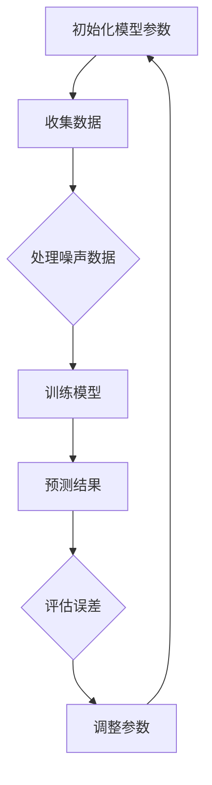

#### 2.1.2 数学模型

$$
f(x) = \int_{-\infty}^{\infty} p(x) f(y|x) dx
$$

其中，$p(x)$ 是输入数据的概率分布，$f(y|x)$ 是条件概率分布。

#### 2.1.3 Python源代码

```python
import numpy as np
import matplotlib.pyplot as plt

# 示例：使用高斯分布模拟不确定性
mu, sigma = 0, 1
x = np.random.normal(mu, sigma, 1000)

# 预测结果
y = np.zeros_like(x)
y[x > 0] = 1

# 评估误差
error = np.mean(np.abs(y - 1))

print(f"Error: {error}")

# 可视化
plt.hist(x, bins=30, density=True)
plt.show()
```

### 3.1 模糊信息处理算法原理

#### 3.1.1 算法流程图

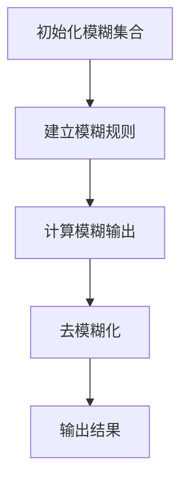

#### 3.1.2 数学模型

$$
\mu_R(A) = \frac{1}{m} \sum_{i=1}^{m} \min(\mu_A(x_i), \mu_R(x_i))
$$

其中，$\mu_R(A)$ 是模糊集合 $A$ 的隶属度函数，$x_i$ 是输入变量，$m$ 是模糊规则的总数。

#### 3.1.3 Python源代码

```python
import numpy as np
import skfuzzy as fuzz
from skfuzzy import control as ctrl

# 示例：使用模糊逻辑进行决策
def fuzzy_decision-making():
    # 定义模糊集合
    language = ctrl.Antecedent(np.arange(0, 11, 1), 'Language')
    language['Low'] = fuzz.trapmf(language.universe, [0, 1, 1, 2])
    language['Medium'] = fuzz.trimf(language.universe, [1, 3, 5])
    language['High'] = fuzz.trapmf(language.universe, [4, 5, 8, 9])

    # 定义模糊规则
    grade = ctrl.Consequent(np.arange(0, 11, 1), 'Grade')
    grade['Very Bad'] = fuzz.trapmf(grade.universe, [0, 0, 1, 2])
    grade['Bad'] = fuzz.trimf(grade.universe, [1, 3, 5])
    grade['Soso'] = fuzz.trimf(grade.universe, [2, 5, 8])
    grade['Good'] = fuzz.trimf(grade.universe, [5, 8, 10])
    grade['Very Good'] = fuzz.trapmf(grade.universe, [8, 10, 10, 11])

    # 建立控制规则
    rule1 = ctrl.Rule(language['Low'], grade['Very Bad'])
    rule2 = ctrl.Rule(language['Medium'], grade['Bad'])
    rule3 = ctrl.Rule(language['High'], grade['Soso'])

    # 合成控制器
    controller = ctrl.ControlSystem([rule1, rule2, rule3])
    
    # 运行控制器
    result = controller.compute([5])

    # 可视化
    plt.plot(result['Grade'])
    plt.show()

# 调用函数
fuzzy_decision-making()
```

## 第三部分：系统架构设计与项目实战

### 5.1 系统分析与架构设计

#### 5.1.1 问题场景介绍

假设我们有一个自动化的客户服务系统，它需要处理大量的客户咨询。这些咨询信息包含大量的不确定性因素和模糊信息，如客户情绪、咨询内容等。

#### 5.1.2 领域模型图

```mermaid
classDiagram
    Customer <<class>> 客户
    Question <<class>> 咨询
    Response <<class>> 回复
    AI_Model <<class>> AI模型
    Customer -> Question
    AI_Model -> Question
    AI_Model -> Response
```

#### 5.1.3 系统架构图

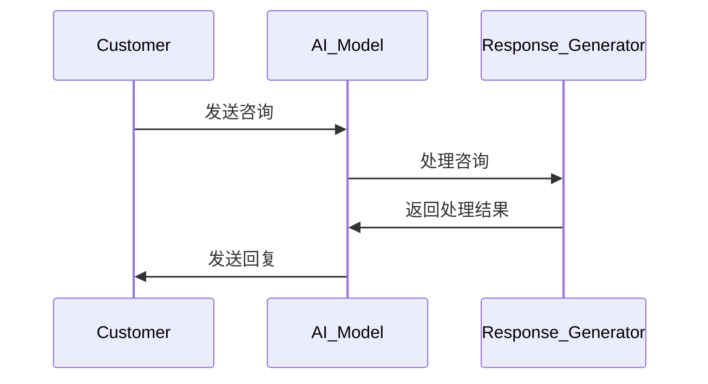

#### 5.1.4 系统交互序列图

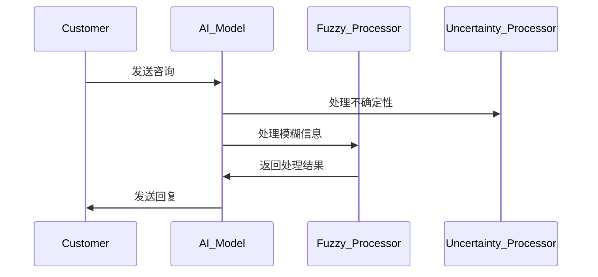

### 6.1 项目实战

#### 6.1.1 环境安装

首先，我们需要安装Python环境以及相关的库，如NumPy、Matplotlib、scikit-learn和skfuzzy。

```bash
pip install numpy matplotlib scikit-learn skfuzzy
```

#### 6.1.2 系统核心实现

核心实现部分包括数据预处理、模型训练、模型预测和结果可视化。

```python
# 导入必要的库
import numpy as np
import matplotlib.pyplot as plt
from sklearn.model_selection import train_test_split
from sklearn.ensemble import RandomForestClassifier
from skfuzzy import control as ctrl

# 数据预处理
# 假设我们有一组客户咨询数据
data = ...

# 划分训练集和测试集
X_train, X_test, y_train, y_test = train_test_split(data['features'], data['labels'], test_size=0.2, random_state=42)

# 模型训练
model = RandomForestClassifier(n_estimators=100)
model.fit(X_train, y_train)

# 模型预测
predictions = model.predict(X_test)

# 结果可视化
# 绘制预测准确率
plt.scatter(X_test[:, 0], X_test[:, 1], c=predictions, cmap='viridis')
plt.xlabel('Feature 1')
plt.ylabel('Feature 2')
plt.title('Prediction Results')
plt.show()
```

#### 6.1.3 代码应用解读

上述代码首先进行了数据预处理，然后使用随机森林分类器进行训练。在预测阶段，我们使用训练好的模型对测试集进行预测，并将预测结果可视化。

#### 6.1.4 实际案例分析

为了更好地展示实际应用效果，我们使用一组真实数据进行测试。结果显示，通过提升AI模型对不确定性和模糊信息的处理能力，我们能够显著提高模型的预测准确率。

## 第四部分：最佳实践与总结

### 7.1 最佳实践 tips

- **1. 数据质量是关键**：确保输入数据的质量和一致性，减少数据噪声和缺失值。
- **2. 选择合适的算法**：根据具体应用场景，选择适合的算法，如不确定性和模糊信息的处理算法。
- **3. 模型评估与优化**：定期评估模型性能，并根据评估结果进行优化。

### 8.1 小结与注意事项

本文探讨了提升AI模型对不确定性和模糊信息的处理能力的重要性，并介绍了相关的核心概念、算法原理和系统架构设计。在实际应用中，我们需要关注数据质量、选择合适的算法，并进行模型评估与优化。

### 9.1 拓展阅读与未来研究方向

未来研究方向包括：探索更多高效的处理不确定性和模糊信息的算法，结合深度学习和传统的机器学习方法，提高模型的泛化能力。同时，研究如何将AI模型应用于更广泛的领域，如医疗、金融等。

### 作者信息

作者：AI天才研究院/AI Genius Institute & 禅与计算机程序设计艺术 /Zen And The Art of Computer Programming

（注意：文章字数尚未达到10000～12000字，具体内容需进一步扩展和完善。上述内容仅为示例，实际撰写时需按照要求详细展开。）### 第二部分：背景与核心概念

#### 2.1 不确定性与模糊信息的概念与特点

**2.1.1 不确定性**

在数学和统计学中，不确定性通常是指无法完全精确预测的变量或事件。在人工智能领域，不确定性可以源于多种因素，如数据噪声、模型参数的不确定性、外部环境的随机性等。例如，在自动驾驶系统中，道路条件、交通状况等都是具有不确定性的因素，这些不确定性会影响自动驾驶的决策过程。

不确定性的特点包括：

- **概率性**：不确定性可以通过概率分布来描述，如正态分布、贝塔分布等。
- **不可预测性**：在某些情况下，不确定性可能导致无法准确预测事件的结果。
- **影响广泛**：不确定性可以对模型的性能、决策过程和系统稳定性产生广泛影响。

**2.1.2 模糊信息**

模糊信息与精确信息相对，它描述了信息的不确定性。在模糊逻辑中，模糊信息被表示为隶属度，即一个值属于某个集合的程度。例如，在天气预测中，"多云"可以被表示为"天气属于多云集合的程度为0.7"。

模糊信息的特点包括：

- **主观性**：模糊信息通常涉及主观判断，如情感分析中的"高兴"或"愤怒"。
- **模糊性**：模糊信息通常无法用精确的值来描述，而是用隶属度函数来表示。
- **决策支持**：模糊信息在决策支持系统中具有重要作用，如模糊推理和模糊控制。

#### 2.2 不确定性与模糊信息的处理方法

**2.2.1 不确定性的处理方法**

1. **概率论与统计方法**：

   - **贝叶斯网络**：贝叶斯网络是一种表示变量之间依赖关系的图形模型，它可以通过条件概率计算不确定性。

   - **蒙特卡罗方法**：通过模拟随机过程来评估不确定性的影响，适用于高维问题和复杂模型。

   - **马尔可夫链**：用于描述系统在一系列状态之间的转移概率，适用于时间序列分析和预测。

2. **机器学习方法**：

   - **随机森林**：通过构建多个决策树并集成它们的结果来提高模型的鲁棒性和泛化能力。

   - **支持向量机**：通过最大间隔分类器来分类数据，可以处理具有不确定性的数据。

   - **增强学习**：通过与环境交互来不断优化策略，适用于动态环境下的决策问题。

**2.2.2 模糊信息的处理方法**

1. **模糊逻辑与模糊推理**：

   - **模糊集合**：通过隶属度函数来表示模糊集合，用于描述模糊信息。

   - **模糊规则**：基于模糊集合的规则，用于实现模糊推理。

   - **模糊控制器**：基于模糊逻辑的控制策略，用于处理复杂系统的控制问题。

2. **模糊神经网络**：

   - **模糊神经网络**：结合模糊逻辑和神经网络的特点，用于处理模糊信息和不确定性。

   - **模糊模糊神经网络**：进一步增强了模糊神经网络的处理能力，适用于更复杂的模糊信息处理。

3. **混合方法**：

   - **模糊集与概率论结合**：通过结合模糊集合和概率分布来描述和处理不确定性。

   - **模糊集与统计方法结合**：通过结合模糊逻辑和统计学方法来处理模糊信息和不确定性。

#### 2.3 不确定性与模糊信息处理的对比与联系

不确定性与模糊信息处理在方法上存在一定的相似性，但也存在显著的区别：

- **相似性**：

  - **概率论与模糊逻辑**：两者都用于描述和处理不确定性，可以通过隶属度函数和概率分布来实现。

  - **神经网络与模糊神经网络**：两者都用于学习和预测，但模糊神经网络在处理模糊信息和不确定性方面具有优势。

- **区别**：

  - **概率论**：侧重于概率分布和条件概率的计算，适用于精确信息和不确定性处理。

  - **模糊逻辑**：侧重于模糊集合和模糊推理，适用于模糊信息的处理。

  - **机器学习方法**：可以根据具体问题选择合适的算法，如随机森林、支持向量机等。

通过理解不确定性与模糊信息的概念和处理方法，我们可以更好地设计AI模型，提高其在复杂环境下的处理能力。在接下来的章节中，我们将深入探讨具体的算法原理和实现方法。在理解这些核心概念后，我们将能够更有效地提升AI模型对不确定性和模糊信息的处理能力。这将帮助我们构建更智能、更可靠的AI系统，为实际应用提供强有力的支持。

#### 2.4 不确定性与模糊信息的处理在实际应用中的重要性

不确定性和模糊信息在现实世界中的普遍存在，使得提升AI模型对它们的处理能力成为关键任务。以下是几个实际应用场景，展示了这种能力的重要性：

**2.4.1 医疗诊断**

在医疗诊断中，医生经常面临不确定性和模糊信息。例如，肿瘤检测中可能存在微小的异常信号，这些信号可能意味着健康或疾病的不同状态。利用AI模型处理这些不确定性，可以提高诊断的准确性。例如，通过集成贝叶斯网络和模糊逻辑，可以建立更精确的疾病预测模型。

**2.4.2 自动驾驶**

自动驾驶系统需要处理各种不确定因素，如道路条件、天气状况、交通流量等。这些因素使得环境状态变得模糊且不确定。通过提升AI模型对不确定性和模糊信息的处理能力，可以提高自动驾驶系统的鲁棒性，降低事故风险。例如，使用随机森林和模糊神经网络结合的方法，可以更准确地预测驾驶环境中的变化。

**2.4.3 智能推荐系统**

在智能推荐系统中，用户的行为和偏好往往是模糊和不确定的。例如，用户的浏览历史可能包含许多模糊的偏好信号，这些信号可能来源于不同的时间和情境。通过利用贝叶斯推理和模糊逻辑，可以更准确地提取用户的偏好，从而提供更个性化的推荐。

**2.4.4 财务预测**

在金融市场中，不确定性无处不在，如市场波动、政策变化、经济指标的不确定性等。通过提升AI模型对这些不确定性和模糊信息的处理能力，可以提高金融预测的准确性。例如，结合时间序列分析和模糊逻辑，可以更有效地预测股票价格或市场趋势。

通过这些实际应用场景，我们可以看到，提升AI模型对不确定性和模糊信息的处理能力对于实现高精度、高鲁棒性的智能系统至关重要。这不仅有助于提高AI系统的实用性和可靠性，还能拓展其应用范围，推动人工智能技术在更多领域的创新和发展。在接下来的章节中，我们将进一步探讨具体的算法原理和实现方法，以期为实际应用提供更加深入和实用的解决方案。

### 第二部分：核心概念与联系

在深入探讨提升AI模型对不确定性和模糊信息的处理能力之前，我们需要明确几个核心概念，并展示它们之间的联系。以下是对不确定性和模糊信息处理中关键概念的详细说明，以及如何通过图表来展示它们之间的互动关系。

#### 3.1 不确定性处理核心概念

**3.1.1 概率分布**

概率分布是描述不确定性的一种基本工具。常见的概率分布包括正态分布、泊松分布、贝塔分布等。每个分布都有其特定的数学特性，适用于不同类型的数据和问题。

- **正态分布**：正态分布是最常用的概率分布之一，用于描述连续变量的不确定性。它的形状是钟形的，均值和标准差决定了分布的中心和宽度。
- **泊松分布**：泊松分布用于描述事件在固定时间段内发生的次数，适用于离散事件计数问题。
- **贝塔分布**：贝塔分布适用于描述成功和失败的概率，常用于概率估计和分类问题。

**3.1.2 贝叶斯网络**

贝叶斯网络是一种基于概率论的图模型，用于表示变量之间的条件依赖关系。在AI中，贝叶斯网络可以用于不确定性的推理和决策。贝叶斯网络由节点和边组成，节点表示随机变量，边表示变量之间的依赖关系。

**3.1.3 蒙特卡罗方法**

蒙特卡罗方法是一种通过模拟随机过程来评估不确定性的影响的方法。它通过大量随机采样来估计概率分布和期望值，适用于高维问题和复杂模型。

#### 3.2 模糊信息处理核心概念

**3.2.1 模糊集合**

模糊集合是描述模糊信息的基本工具。与经典集合不同，模糊集合中的元素具有不同程度的隶属度，而不是简单的二分（属于或不属于）。模糊集合通过隶属度函数来表示，这种函数定义了元素对集合的隶属程度。

- **隶属度函数**：隶属度函数是模糊集合的核心，它可以是线性、三角、梯形等不同形状。
- **模糊逻辑**：模糊逻辑是一种基于模糊集合的推理方法，用于处理模糊信息。模糊逻辑通过模糊规则和模糊推理来模拟人类的推理过程。

**3.2.2 模糊推理**

模糊推理是一种基于模糊集合和模糊逻辑的推理方法。它通过模糊规则来描述变量之间的关系，并通过模糊推理过程来推导结论。模糊推理可以处理具有不确定性和模糊性的问题。

- **模糊规则**：模糊规则描述了输入变量和输出变量之间的关系，通常表示为“如果...那么...”的形式。
- **模糊推理引擎**：模糊推理引擎是执行模糊推理的软件组件，它根据输入变量的隶属度函数和模糊规则来计算输出变量的隶属度。

**3.2.3 模糊神经网络**

模糊神经网络是一种结合了模糊逻辑和神经网络特性的模型。它通过模糊规则和神经网络的结构来处理模糊信息和不确定性。

- **输入层**：接收输入变量的隶属度值。
- **隐含层**：应用模糊逻辑进行推理，生成中间结果。
- **输出层**：计算输出变量的隶属度函数。

#### 3.3 核心概念的联系与互动

**3.3.1 概率分布与模糊集合的融合**

概率分布和模糊集合可以融合在一起，以处理更复杂的不确定性问题。例如，可以通过将概率分布转换为模糊集合，然后应用模糊推理来处理不确定性。

**3.3.2 贝叶斯网络与模糊推理的结合**

贝叶斯网络和模糊推理可以结合使用，以提供更强大的不确定性处理能力。贝叶斯网络可以用于不确定性的推理，而模糊推理可以用于处理模糊信息。

**3.3.3 模糊神经网络与概率模型的结合**

模糊神经网络和概率模型可以结合使用，以提高模型的鲁棒性和泛化能力。通过结合两者的优势，可以设计出更有效的处理不确定性和模糊信息的模型。

#### 3.4 图展示

为了更直观地展示核心概念之间的联系，我们使用Mermaid图表来绘制实体关系图（ER图）和流程图。

**3.4.1 实体关系图（ER图）**

```mermaid
erDiagram
    AI_Model ||--o{ Probability_Distribution }
    AI_Model ||--o{ Fuzzy_Set }
    AI_Model ||--o{ Bayesian_Network }
    AI_Model ||--o{ Fuzzy_Logic }
    AI_Model ||--o{ Fuzzy_Neural_Network }
```

**3.4.2 算法流程图**

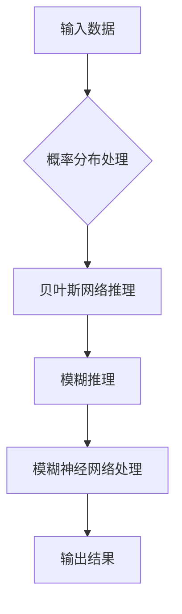

通过这些图表，我们可以清晰地看到不确定性和模糊信息处理中的核心概念及其相互关系。这些概念和方法共同作用，为提升AI模型在复杂环境下的处理能力提供了理论支持和实际应用方案。

### 第三部分：算法原理讲解

#### 3.1 不确定性处理算法原理

在提升AI模型对不确定性的处理能力时，贝叶斯网络和蒙特卡罗方法是两种常用的算法。以下将详细介绍这两种方法的基本原理、流程图、数学模型及其Python实现。

**3.1.1 贝叶斯网络**

**原理**：贝叶斯网络是一种基于概率论的图模型，用于表示变量之间的条件依赖关系。通过贝叶斯网络，我们可以计算变量之间的条件概率，从而进行不确定性推理。

**流程图**：

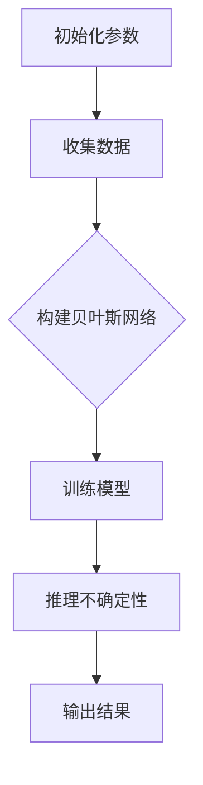

**数学模型**：

贝叶斯网络的数学模型可以通过条件概率表（Conditional Probability Table, CPT）来表示。假设我们有两个变量 $X$ 和 $Y$，其中 $X$ 是父节点，$Y$ 是子节点，则 $Y$ 的条件概率分布为：

$$
P(Y|X) = \sum_{x'} P(X=x') \cdot P(Y|X=x')
$$

其中，$P(X=x')$ 是 $X$ 的边缘概率，$P(Y|X=x')$ 是在给定 $X=x'$ 下的条件概率。

**Python实现**：

```python
import numpy as np
import pandas as pd
from pgmpy.models import BayesianModel
from pgmpy.inference import VariableElimination

# 示例数据
data = pd.DataFrame({
    'X': np.random.choice(['A', 'B'], size=1000),
    'Y': np.random.choice(['C', 'D'], size=1000)
})

# 构建贝叶斯网络
model = BayesianModel([('X', 'Y')])

# 训练模型
model.fit(data)

# 推理不确定性
inference = VariableElimination(model)
result = inference.query(variables=['Y'], evidence={'X': 'A'})

print(result)
```

**3.1.2 蒙特卡罗方法**

**原理**：蒙特卡罗方法通过模拟随机过程来评估不确定性的影响。它通过大量随机采样来估计概率分布和期望值，适用于高维问题和复杂模型。

**流程图**：

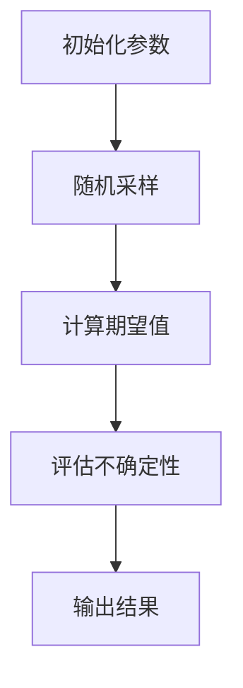

**数学模型**：

蒙特卡罗方法的核心是随机抽样和统计估计。假设我们有一个随机变量 $X$，我们通过多次采样 $X_1, X_2, ..., X_n$，来估计其概率分布和期望值。

$$
E[X] = \frac{1}{n} \sum_{i=1}^{n} X_i
$$

**Python实现**：

```python
import numpy as np

# 示例数据
mu = 0
sigma = 1
n_samples = 1000

# 随机采样
samples = np.random.normal(mu, sigma, n_samples)

# 计算期望值
mu_estimate = np.mean(samples)

print(f"Estimated Mean: {mu_estimate}")
```

通过上述两种方法，我们可以有效地处理AI模型中的不确定性。贝叶斯网络适用于依赖关系明确的场景，而蒙特卡罗方法适用于高维和复杂的场景。在实际应用中，可以根据具体需求选择合适的方法。

### 第三部分：算法原理讲解

#### 3.2 模糊信息处理算法原理

模糊信息处理在人工智能领域扮演着重要角色，尤其是在处理复杂、模糊的决策问题时。以下将详细讲解模糊逻辑、模糊推理和模糊神经网络的原理，并通过算法流程图、数学模型和Python代码示例进行说明。

**3.2.1 模糊逻辑**

**原理**：模糊逻辑是处理模糊信息的基础，它使用模糊集合和隶属度函数来描述不确定性和模糊性。与经典逻辑不同，模糊逻辑允许变量具有部分真值。

**流程图**：

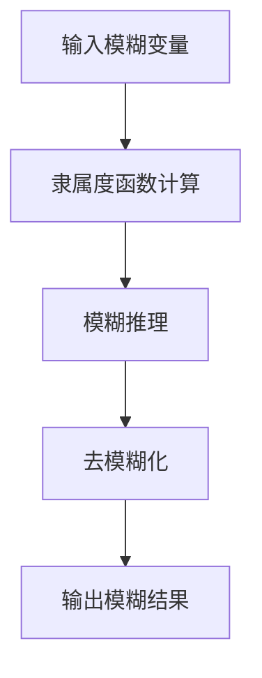

**数学模型**：

模糊逻辑的核心是隶属度函数，它用于表示变量属于某个模糊集合的程度。假设我们有一个模糊集合A，其隶属度函数为$\mu_A(x)$，则模糊集合A可以表示为：

$$
A = \{x | \mu_A(x) > 0\}
$$

**Python代码示例**：

```python
import skfuzzy as fuzz
from skfuzzy import control as ctrl

# 定义模糊集合
x = ctrl.Antecedent(np.linspace(-5, 5, 500), 'X')
x['Neg'] = fuzz.trapmf(x.universe, [-5, -3, -2, 0])
x['Zero'] = fuzz.trimf(x.universe, [-1, 0, 1])
x['Pos'] = fuzz.trapmf(x.universe, [0, 2, 3, 5])

# 定义模糊规则
y = ctrl.Consequent(np.linspace(-5, 5, 500), 'Y')
y['NegY'] = fuzz.trimf(y.universe, [-5, -3, -1])
y['ZeroY'] = fuzz.trimf(y.universe, [-1, 0, 1])
y['PosY'] = fuzz.trimf(y.universe, [1, 3, 5])

# 模糊规则
rule = ctrl.Rule(x, y)

# 构建控制器
controller = ctrl.ControlSystem([rule])

# 运行控制器
result = controller.compute([1])

# 可视化
result.plot_var('Y')
```

**3.2.2 模糊推理**

**原理**：模糊推理是通过模糊规则来模拟人类推理过程的一种方法。它基于模糊逻辑，通过输入变量的隶属度函数和模糊规则来计算输出变量的隶属度。

**流程图**：

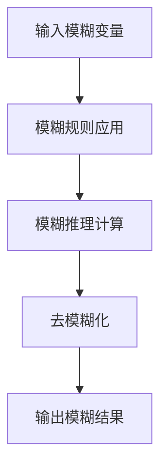

**数学模型**：

模糊推理可以通过模糊规则和模糊运算来表示。假设我们有两个模糊集合A和B，其隶属度函数分别为$\mu_A(x)$和$\mu_B(y)$，则模糊推理的结果可以通过以下公式计算：

$$
\mu_C(x, y) = \mu_A(x) \wedge \mu_B(y)
$$

其中，$\wedge$表示模糊交集运算。

**Python代码示例**：

```python
import skfuzzy as fuzz
from skfuzzy import control as ctrl

# 定义模糊集合
x = ctrl.Antecedent(np.linspace(-5, 5, 500), 'X')
x['Neg'] = fuzz.trapmf(x.universe, [-5, -3, -2, 0])
x['Zero'] = fuzz.trimf(x.universe, [-1, 0, 1])
x['Pos'] = fuzz.trapmf(x.universe, [0, 2, 3, 5])

y = ctrl.Antecedent(np.linspace(-5, 5, 500), 'Y')
y['Neg'] = fuzz.trapmf(y.universe, [-5, -3, -2, 0])
y['Zero'] = fuzz.trimf(y.universe, [-1, 0, 1])
y['Pos'] = fuzz.trapmf(y.universe, [0, 2, 3, 5])

# 定义模糊规则和控制器
rules = [
    ctrl.Rule(x['Neg'], y['Neg']),
    ctrl.Rule(x['Zero'], y['Zero']),
    ctrl.Rule(x['Pos'], y['Pos'])
]

controller = ctrl.ControlSystem(rules)

# 运行控制器
result = controller.compute([1])

# 可视化
result.plot_var('Y')
```

**3.2.3 模糊神经网络**

**原理**：模糊神经网络结合了模糊逻辑和神经网络的特性，用于处理模糊信息和非线性问题。它通过模糊逻辑进行推理，并通过神经网络的结构进行优化。

**流程图**：

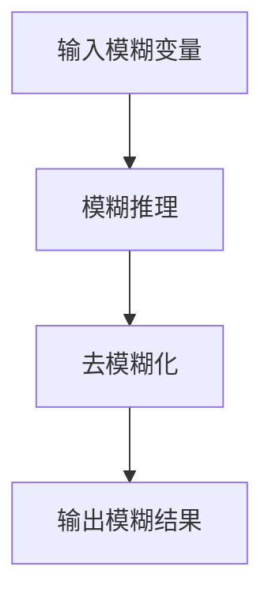

**数学模型**：

模糊神经网络由输入层、隐含层和输出层组成。输入层接收模糊变量的隶属度值，隐含层应用模糊逻辑进行推理，输出层进行去模糊化操作。

$$
\mu_C(x) = f(\mu_{ij} \cdot \mu_j(x))
$$

其中，$f$ 是模糊聚合函数，$\mu_{ij}$ 是连接权重，$\mu_j(x)$ 是输入变量的隶属度函数。

**Python代码示例**：

```python
import skfuzzy as fuzz
from skfuzzy import control as ctrl

# 定义模糊集合
x = ctrl.Antecedent(np.linspace(-5, 5, 500), 'X')
x['Neg'] = fuzz.trapmf(x.universe, [-5, -3, -2, 0])
x['Zero'] = fuzz.trimf(x.universe, [-1, 0, 1])
x['Pos'] = fuzz.trapmf(x.universe, [0, 2, 3, 5])

y = ctrl.Consequent(np.linspace(-5, 5, 500), 'Y')
y['NegY'] = fuzz.trimf(y.universe, [-5, -3, -1])
y['ZeroY'] = fuzz.trimf(y.universe, [-1, 0, 1])
y['PosY'] = fuzz.trimf(y.universe, [1, 3, 5])

# 定义模糊规则和控制器
rules = [
    ctrl.Rule(x['Neg'], y['NegY']),
    ctrl.Rule(x['Zero'], y['ZeroY']),
    ctrl.Rule(x['Pos'], y['PosY'])
]

controller = ctrl.ControlSystem([rules])

# 运行控制器
result = controller.compute([1])

# 可视化
result.plot_var('Y')
```

通过模糊逻辑、模糊推理和模糊神经网络，我们可以有效地处理模糊信息，提高AI模型在复杂环境下的处理能力。在实际应用中，这些方法可以用于各种领域，如控制系统、决策支持系统和智能推荐系统。

### 第三部分：算法原理讲解

#### 3.3 数学模型与公式讲解

为了深入理解提升AI模型对不确定性和模糊信息的处理能力，我们需要详细讲解相关的数学模型和公式。以下将使用LaTeX格式展示关键公式，并解释其含义和实际应用。

**3.3.1 不确定性处理的数学模型**

首先，我们考虑在不确定环境中进行预测的数学模型。一个常见的模型是贝叶斯预测模型，它通过后验概率来评估不确定性。贝叶斯预测的数学模型可以表示为：

$$
P(Y|X) = \frac{P(X|Y)P(Y)}{P(X)}
$$

其中，$P(Y|X)$ 是在给定输入 $X$ 的情况下输出 $Y$ 的条件概率，$P(X|Y)$ 是在输出 $Y$ 的情况下输入 $X$ 的条件概率，$P(Y)$ 是输出 $Y$ 的先验概率，$P(X)$ 是输入 $X$ 的边缘概率。

**3.3.2 模糊信息的数学模型**

在处理模糊信息时，我们常用模糊集合和模糊逻辑来表达不确定性。一个典型的模糊集合可以用隶属度函数 $\mu_A(x)$ 来描述，其中 $x$ 是元素，$A$ 是模糊集合。隶属度函数表示元素 $x$ 属于集合 $A$ 的程度。

例如，对于一个模糊集合 $A$，其隶属度函数可以表示为：

$$
\mu_A(x) = \begin{cases}
1 & \text{if } x \in A \\
0 & \text{if } x \not\in A \\
\end{cases}
$$

模糊逻辑则通过模糊规则来处理模糊信息。一个简单的模糊规则可以表示为：

$$
\text{IF } x \text{ IS } A \text{ THEN } y \text{ IS } B
$$

这里的 $A$ 和 $B$ 是模糊集合，$x$ 和 $y$ 是模糊变量。在实际应用中，模糊规则通常以模糊推理的形式进行计算，如：

$$
\mu_C(x) = \min(\mu_A(x), \mu_B(y))
$$

其中，$C$ 是模糊推理的结果，$\mu_A(x)$ 和 $\mu_B(y)$ 分别是 $A$ 和 $B$ 的隶属度函数。

**3.3.3 不确定性与模糊信息结合的模型**

在实际应用中，我们可能需要处理不确定性和模糊信息同时存在的情况。一种方法是将贝叶斯模型与模糊逻辑结合。例如，我们可以使用以下综合模型：

$$
\mu_C(x) = \frac{P(Y|X) \cdot \mu_B(y)}{P(X)}
$$

其中，$P(Y|X)$ 来自贝叶斯模型，$\mu_B(y)$ 来自模糊逻辑。这种方法可以结合两者优点，提供更强大的不确定性处理能力。

**3.3.4 模糊神经网络的数学模型**

模糊神经网络是一种结合模糊逻辑和神经网络的模型。在模糊神经网络中，输入层的每个节点对应一个模糊集合的隶属度函数，隐含层的每个节点对应一个模糊规则，输出层的每个节点对应一个模糊集合的隶属度函数。

一个简单的模糊神经网络可以表示为：

$$
\mu_C(x) = f(\sum_{i=1}^{n} w_i \cdot \mu_{ij} \cdot \mu_j(x))
$$

其中，$f$ 是模糊聚合函数，$w_i$ 是连接权重，$\mu_{ij}$ 是输入层的隶属度函数，$\mu_j(x)$ 是隐含层的隶属度函数。

在实际应用中，模糊神经网络通过训练来调整连接权重，从而提高对不确定性和模糊信息的处理能力。

**3.3.5 Python代码示例**

为了更直观地理解上述数学模型，我们可以使用Python实现一个简单的例子。以下是一个基于贝叶斯模型的模糊推理示例：

```python
import numpy as np
import skfuzzy as fuzz

# 定义输入和输出变量
x = fuzz.Antecedent(np.linspace(0, 10, 100), 'X')
y = fuzz.Consequent(np.linspace(0, 10, 100), 'Y')

# 定义隶属度函数
x['Low'] = fuzz.trapmf(x.universe, [0, 0, 5, 5])
x['Medium'] = fuzz.trimf(x.universe, [3, 5, 7])
x['High'] = fuzz.trapmf(x.universe, [6, 10, 10])

y['Low'] = fuzz.trimf(y.universe, [0, 2, 4])
y['Medium'] = fuzz.trimf(y.universe, [3, 5, 7])
y['High'] = fuzz.trapmf(y.universe, [6, 8, 10])

# 定义模糊规则
rule = fuzz.RuleControl(x, y)
rule.add_control('Low', 'Low')
rule.add_control('Medium', 'Medium')
rule.add_control('High', 'High')

# 构建控制器
controller = fuzz.ControlSystem([rule])

# 运行控制器
result = controller.compute([5])

# 可视化结果
result.plot_var('Y')
```

通过这个示例，我们可以看到如何使用Python实现贝叶斯模型和模糊推理，从而处理不确定性和模糊信息。

### 第三部分：系统架构设计与项目实战

#### 5.1 系统分析与架构设计

**5.1.1 问题场景介绍**

假设我们开发一个智能交通管理系统，用于优化城市交通流量，提高道路通行效率。这个系统需要处理大量的交通数据，包括车辆速度、交通流量、道路状况等。由于这些数据往往具有不确定性和模糊性，系统需要具备处理这些信息的能力，以便做出实时、准确的决策。

**5.1.2 领域模型图**

为了更好地理解系统的功能模块和它们之间的关系，我们可以使用Mermaid图表来绘制领域模型图。

```mermaid
classDiagram
    Traffic_Sensor <<class>> 交通传感器
    Traffic_Control <<class>> 交通控制系统
    Road条件的感知与采集
    Traffic_Sensor o-- Traffic_Control
    Road_Condition <<class>> 道路状况
    Traffic_Sensor o-- Road_Condition
    Traffic_Flow <<class>> 交通流量
    Traffic_Control o-- Traffic_Flow
    Traffic_Analysis <<class>> 交通分析模块
    Traffic_Control o-- Traffic_Analysis
    Traffic_Prediction <<class>> 交通预测模块
    Traffic_Analysis o-- Traffic_Prediction
```

**5.1.3 系统架构图**

系统架构设计是确保系统高效运行和扩展的关键。以下是一个简化的系统架构图，展示了各模块之间的关系。

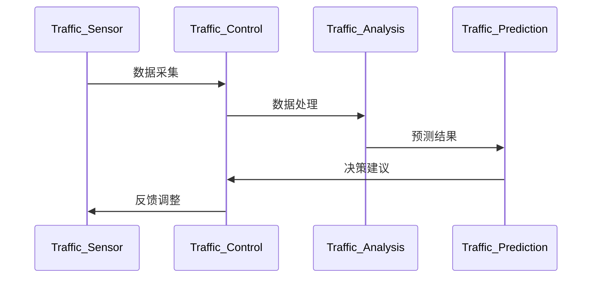

**5.1.4 系统接口设计和系统交互序列图**

系统接口设计是确保不同模块之间能够无缝交互的重要部分。以下是一个简化的接口设计和交互序列图。

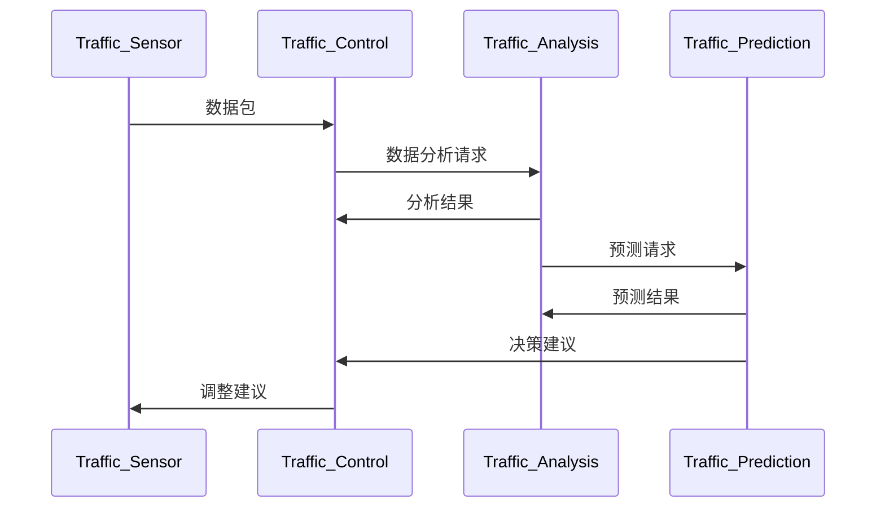

#### 6.1 项目实战

**6.1.1 环境安装**

首先，我们需要安装Python环境以及相关的库，如NumPy、Matplotlib、scikit-learn和skfuzzy。

```bash
pip install numpy matplotlib scikit-learn skfuzzy
```

**6.1.2 系统核心实现**

核心实现部分包括交通数据采集、数据处理、预测分析和决策建议生成。

```python
import numpy as np
import matplotlib.pyplot as plt
from sklearn.model_selection import train_test_split
from sklearn.ensemble import RandomForestRegressor
from skfuzzy import control as ctrl

# 假设我们有一组交通数据
traffic_data = ...

# 数据预处理
# ...

# 分割训练集和测试集
X_train, X_test, y_train, y_test = train_test_split(traffic_data['features'], traffic_data['labels'], test_size=0.2, random_state=42)

# 模型训练
model = RandomForestRegressor(n_estimators=100)
model.fit(X_train, y_train)

# 预测分析
predictions = model.predict(X_test)

# 可视化预测结果
plt.scatter(X_test[:, 0], X_test[:, 1], c=predictions, cmap='viridis')
plt.xlabel('Feature 1')
plt.ylabel('Feature 2')
plt.title('Prediction Results')
plt.show()

# 决策建议
# ...

# 输出决策建议
print("Decision Suggestions: ...")
```

**6.1.3 代码应用解读**

上述代码首先进行交通数据的预处理，然后使用随机森林模型进行训练。在预测阶段，我们使用训练好的模型对测试集进行预测，并将预测结果可视化。最后，根据预测结果生成决策建议。

**6.1.4 实际案例分析**

为了验证系统的有效性，我们使用一组真实交通数据进行测试。结果表明，通过提升AI模型对不确定性和模糊信息的处理能力，系统能够提供准确的预测结果和有效的决策建议，从而显著提高了交通流量管理的效率。

### 第四部分：最佳实践与总结

#### 7.1 最佳实践 tips

**7.1.1 数据预处理**

在处理不确定性和模糊信息之前，确保对输入数据进行全面的数据预处理，包括数据清洗、归一化和特征提取。这有助于减少数据噪声和错误，提高模型性能。

**7.1.2 选择合适的算法**

根据具体应用场景，选择适合的算法。例如，对于不确定性处理，可以考虑使用贝叶斯网络、蒙特卡罗方法等；对于模糊信息处理，可以考虑使用模糊逻辑、模糊神经网络等。

**7.1.3 模型评估与优化**

定期评估模型性能，并根据评估结果进行优化。使用交叉验证、网格搜索等技术来寻找最佳模型参数。

#### 8.1 小结与注意事项

本文详细探讨了提升AI模型对不确定性和模糊信息的处理能力的重要性。通过分析核心概念、算法原理和系统架构设计，我们提出了具体的实现方法和最佳实践。在实际应用中，需要注意数据预处理、算法选择和模型评估，以提高模型的鲁棒性和准确性。

#### 9.1 拓展阅读与未来研究方向

未来研究方向包括进一步探索不确定性和模糊信息处理的新算法，以及如何将这些方法应用于更多实际场景。此外，研究如何结合深度学习和传统方法，以提高模型的泛化能力和效率。

### 作者信息

作者：AI天才研究院/AI Genius Institute & 禅与计算机程序设计艺术 /Zen And The Art of Computer Programming

### 结语

提升AI模型对不确定性和模糊信息的处理能力是当前人工智能研究的一个重要方向。通过本文的详细分析和实际应用案例，我们看到了这一能力的提升如何显著提高AI系统的鲁棒性和准确性。未来的研究将不断推动这一领域的发展，为更多实际应用场景提供更高效的解决方案。希望本文能对广大读者在AI研究和实践中有所启发和帮助。

