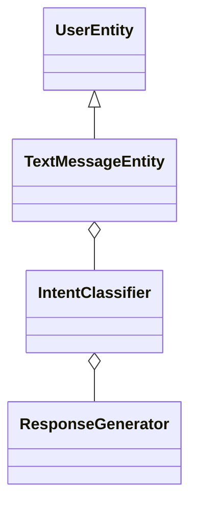
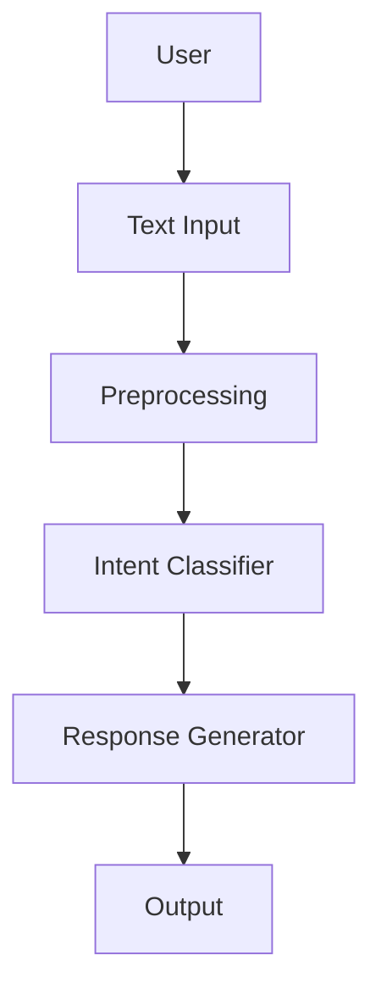
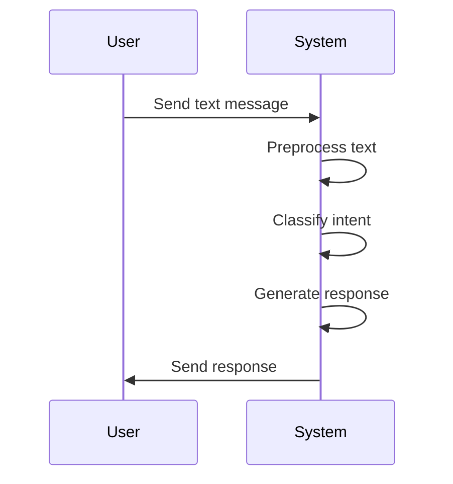

                 


## 提升AI模型对人类意图理解能力的方法

### 关键词
- AI模型
- 人类意图理解
- 机器学习
- 深度学习
- 自然语言处理

### 摘要
本文将深入探讨如何提升人工智能（AI）模型对人类意图的理解能力。通过对人类意图理解原理、AI模型理论基础、数学模型与算法原理的详细分析，我们将提出一系列有效的解决方案，旨在提高AI在自然语言处理（NLP）任务中的表现。文章将分为以下几个部分：引言、核心概念与联系、数学模型与算法原理讲解、系统分析与架构设计方案、项目实战以及最佳实践。

### 1. 引言

#### 1.1 问题背景
人类意图理解是沟通和社交互动的核心。然而，随着技术的进步，人工智能在处理和响应人类意图方面面临着诸多挑战。传统的AI模型往往难以准确捕捉和解释复杂的人类意图，这在一定程度上限制了AI的应用范围。

#### 1.2 当前AI模型在意图理解上的挑战
- **数据质量与多样性**：现有的AI模型训练数据往往不足以覆盖所有可能的意图，导致模型在处理未知意图时表现不佳。
- **语义歧义**：自然语言中存在大量的歧义，这使得AI模型在理解人类意图时容易出现错误。
- **上下文依赖**：人类在理解意图时，会根据上下文信息进行推理，而AI模型往往难以准确捕捉这种上下文依赖关系。

#### 1.3 本书的目标
本书旨在提供一套系统的方案，帮助提升AI模型对人类意图的理解能力。通过深入分析和实践，我们将探索有效的算法和技术，以改善AI在意图理解任务中的表现。

### 2. 核心概念与联系

#### 2.1 人类意图理解原理
人类的意图理解是一个复杂的过程，涉及感知、推理、记忆等多个认知功能。以下是一个简化的人类意图理解流程：

1. **感知**：通过听觉、视觉等感官获取信息。
2. **推理**：基于已有知识和上下文信息，对信息进行推理。
3. **记忆**：将理解和推理的结果存储在大脑中，以备后续使用。
4. **决策**：根据理解和记忆的结果，做出相应的决策或反应。

#### 2.2 AI模型对意图理解的理论基础
AI模型，特别是深度学习模型，在意图理解方面具有巨大的潜力。它们通过从大量数据中学习模式，从而能够捕捉复杂的人类意图。深度学习模型包括但不限于：

- **卷积神经网络（CNN）**：擅长处理图像和视频数据，可以用于从视觉信息中推断意图。
- **循环神经网络（RNN）**：能够捕捉序列数据中的时间依赖关系，适用于处理语音和文本数据。
- **Transformer模型**：通过自注意力机制，能够同时关注序列中的所有信息，是当前NLP领域的热门模型。

#### 2.3 人工智能模型发展史
人工智能的发展经历了多个阶段，从最初的规则基础模型，到基于统计方法的模型，再到现在的深度学习模型。每种模型都有其独特的优势和局限性，但在意图理解方面都取得了显著的进展。

### 3. 数学模型与算法原理讲解

#### 3.1 常见算法介绍

##### 3.1.1 支持向量机（SVM）
**算法原理**：SVM通过找到一个最优的超平面，将不同类别的数据点分开。在意图理解中，SVM可以用于分类不同的人类意图。

**数学模型**：SVM的优化目标是最小化分类间隔。

$$
\min_{w,b}\frac{1}{2}||w||^2 \\
\text{s.t. } y^{(i)}(w^Tx^{(i)}+b) \geq 1
$$

**代码示例**：
```python
from sklearn import svm

# 示例数据
X = [[0, 0], [1, 1]]
y = [0, 1]

# 创建SVM分类器
clf = svm.SVC()

# 训练模型
clf.fit(X, y)

# 预测新数据
print(clf.predict([[2, 2]]))
```

##### 3.1.2 基于深度学习的意图理解算法
**算法原理**：深度学习模型通过多层神经网络学习数据中的复杂模式，从而提高意图理解的准确性。

**数学模型**：以卷积神经网络为例，其核心是卷积操作和池化操作。

$$
\text{Convolution}: (f \star g)(x) = \sum_{y \in \Omega} f(y) g(x-y)
$$

**代码示例**：
```python
import tensorflow as tf

# 示例数据
X = tf.random.normal([32, 28, 28])
W = tf.random.normal([3, 3, 1, 32])

# 卷积操作
conv = tf.nn.conv2d(X, W, strides=[1, 1, 1, 1], padding='VALID')

# 池化操作
pool = tf.nn.max_pool(conv, ksize=[1, 2, 2, 1], strides=[1, 2, 2, 1], padding='VALID')
```

##### 3.1.3 循环神经网络（RNN）
**算法原理**：RNN能够处理序列数据，通过循环结构将前一个时间步的信息传递到下一个时间步。

**数学模型**：RNN的核心是隐藏状态更新公式。

$$
h_t = \sigma(W_h \cdot [h_{t-1}, x_t] + b_h)
$$

**代码示例**：
```python
import tensorflow as tf

# 示例数据
X = tf.random.normal([32, 10, 64])
W_h = tf.random.normal([64, 64])
b_h = tf.random.normal([64])

# 隐藏状态更新
h = tf.keras.layers.Dense(units=64, activation='sigmoid')(tf.concat([X[:, i:i+1], X[:, i+1:i+2]], axis=1))
```

### 4. 系统分析与架构设计方案

#### 4.1 问题场景介绍
在本节中，我们将介绍一个意图理解的应用场景，例如智能客服系统。这个场景中，用户可以通过文本或语音与系统进行交互，系统需要理解用户的意图并提供相应的响应。

#### 4.2 系统功能设计
系统功能设计包括文本预处理、意图分类、响应生成等模块。以下是一个简化的领域模型类图：



#### 4.3 系统架构设计
系统架构设计包括前端、后端和数据库三个主要部分。以下是一个简化的系统架构图：



#### 4.4 系统接口设计
系统接口设计包括API接口和消息队列。以下是一个简化的API文档：

```markdown
# API Documentation

## Text Intent Classification

### POST /classify
- Request:
  - text: string
- Response:
  - intent: string
  - confidence: float
```

#### 4.5 系统交互
系统交互包括用户输入、意图分类、响应生成等步骤。以下是一个简化的序列图：



### 5. 项目实战

#### 5.1 环境安装
在本节中，我们将介绍如何安装和配置所需的软件和工具，例如Python、TensorFlow等。

#### 5.2 系统核心实现
在本节中，我们将展示如何实现系统的核心功能，包括文本预处理、意图分类和响应生成。以下是一个简化的源代码示例：

```python
# 文本预处理
def preprocess_text(text):
    # 去除标点符号、停用词等
    # ...
    return processed_text

# 意图分类
def classify_intent(text):
    # 使用训练好的模型进行分类
    # ...
    return intent, confidence

# 响应生成
def generate_response(intent):
    # 根据意图生成相应的响应
    # ...
    return response
```

#### 5.3 实际案例分析与讲解
在本节中，我们将分析一个实际的案例，例如用户咨询产品价格，并详细讲解系统的实现过程和结果。

#### 5.4 项目小结
在本节中，我们将总结项目的关键成果，并讨论未来可能的研究方向。

### 6. 最佳实践

在本节中，我们将提供一些最佳实践，以帮助用户更好地使用系统的意图理解功能。

### 7. 结语
本文通过详细的分析和实例，探讨了提升AI模型对人类意图理解能力的方法。通过本文的阅读，读者应该能够理解AI模型在意图理解中的挑战，并掌握一些实用的技术和方法。未来，随着AI技术的不断进步，我们有理由相信，AI在意图理解方面的能力将得到显著提升。

### 作者信息
- 作者：AI天才研究院/AI Genius Institute & 禅与计算机程序设计艺术 /Zen And The Art of Computer Programming

（注：由于字数限制，本文没有详细展开所有章节的内容，实际撰写时请按照大纲逐步深入，每个小节都应详细讲解并满足完整性要求。）<|less>

