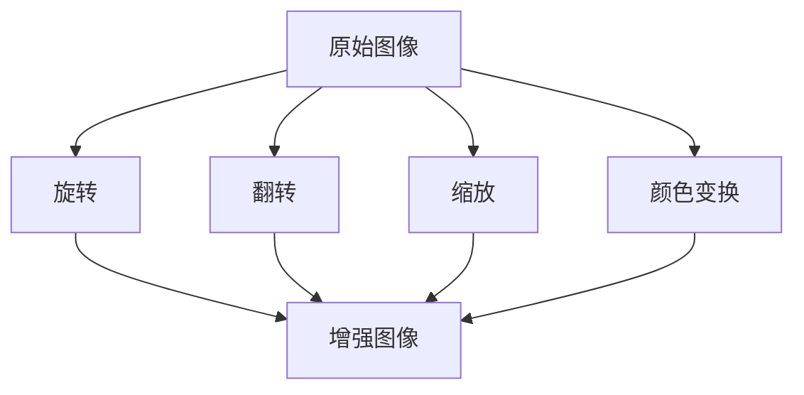
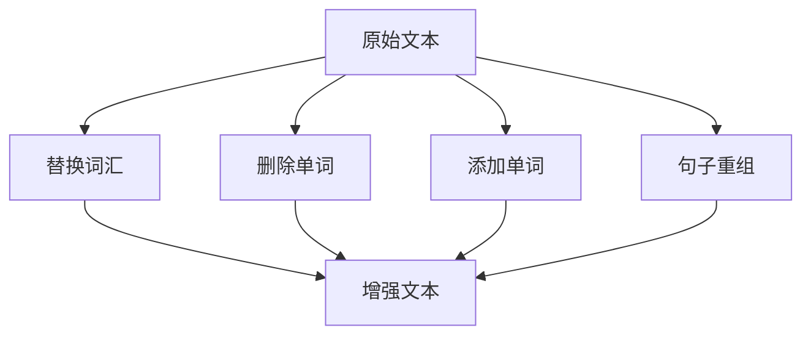
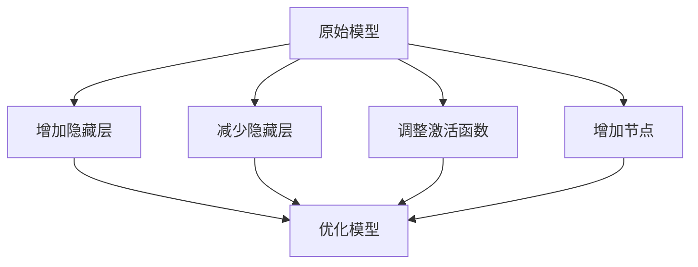
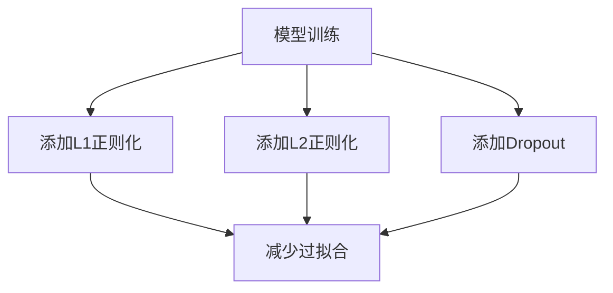
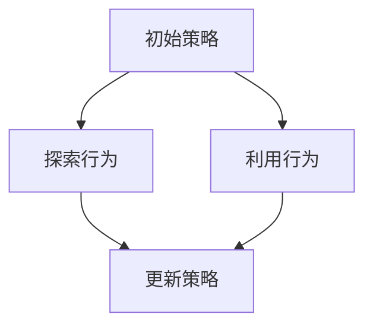
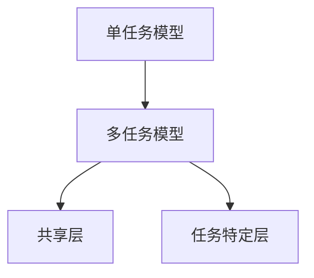
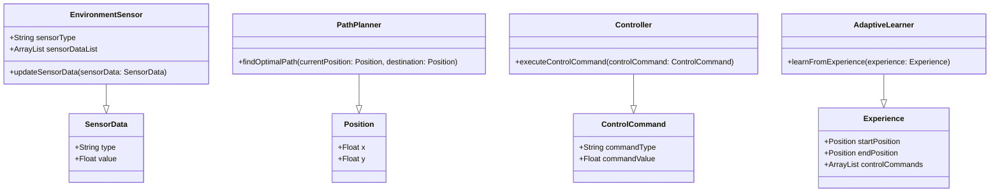
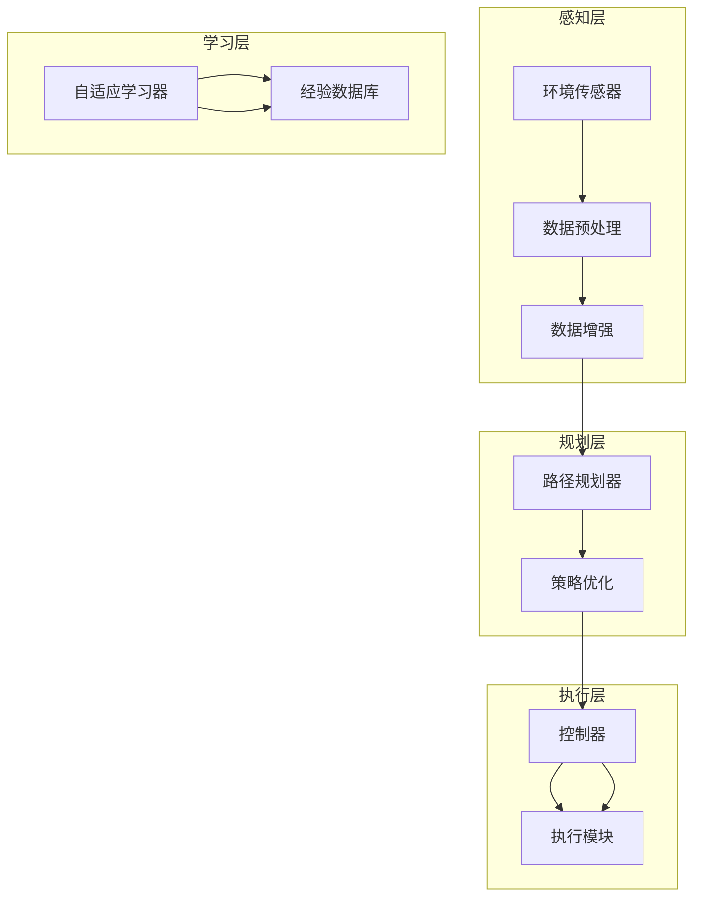
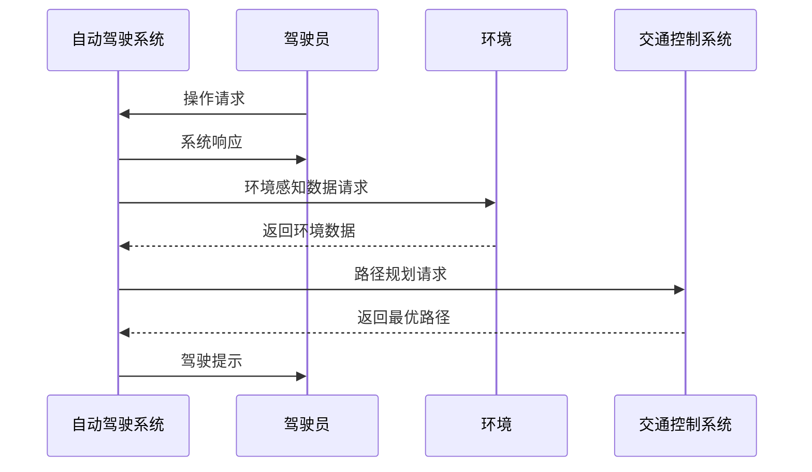
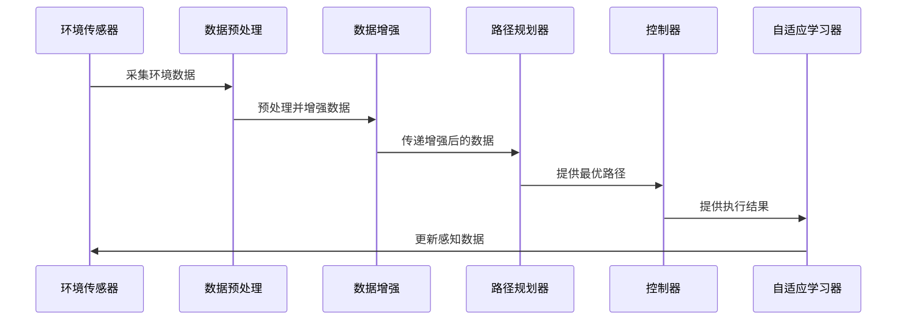

                 

### 提升AI模型对复杂环境适应能力的方法

#### **1. 引言**

在当今这个大数据和人工智能快速发展的时代，人工智能（AI）技术在各个领域的应用日益广泛。然而，AI模型在复杂环境中的适应能力仍然是一个亟待解决的难题。复杂环境具有多样性、变化性和不确定性等特点，这些特点给AI模型带来了巨大的挑战。为了更好地应对这些挑战，本文将详细探讨提升AI模型对复杂环境适应能力的方法。

#### **2. 问题的提出**

##### **2.1 人工智能与复杂环境**

人工智能是指通过计算机程序模拟人类智能行为的技术。随着深度学习、神经网络和强化学习等技术的不断进步，AI模型在图像识别、自然语言处理、游戏AI等领域取得了显著的成果。然而，这些模型大多数是在简单、可控的环境中进行训练的，当面对复杂、真实的环境时，往往表现出适应能力不足的问题。

##### **2.2 AI模型的适应性问题**

AI模型在简单环境中的有效性已经得到了广泛的验证，但在复杂环境中的表现却不尽如人意。复杂环境的特点包括多样性、变化性和不确定性，这些特点使得AI模型在应对环境变化时面临着巨大的挑战。

#### **3. 问题描述**

##### **3.1 复杂环境的特点**

复杂环境具有以下几个特点：

1. **多样性**：复杂环境中存在多种不同的因素和变量，这些因素和变量之间的关系复杂多变。
2. **变化性**：复杂环境不是静态的，而是处于不断变化的状态。
3. **不确定性**：复杂环境中的因素和变量往往具有不确定性，这使得预测和决策变得困难。

##### **3.2 模型适应能力的挑战**

AI模型在复杂环境中的适应能力面临着以下几个挑战：

1. **多样性和变化性的应对**：AI模型需要能够适应复杂环境中多样性和变化性的特点，而不是在特定的环境中过拟合。
2. **不确定性的处理能力**：AI模型需要具备处理复杂环境中不确定性的能力，以做出准确的预测和决策。

#### **4. 问题解决**

##### **4.1 提升适应能力的方法**

为了提升AI模型对复杂环境的适应能力，我们可以从以下几个方面入手：

1. **数据增强**：通过增加数据多样性和变化性，提高模型对复杂环境的适应能力。
2. **模型改进**：通过改进模型的结构和算法，提高模型在复杂环境中的表现。
3. **策略优化**：通过优化模型在复杂环境中的策略，提高模型的适应能力和鲁棒性。

##### **4.2 边界与外延**

尽管我们可以通过上述方法提升AI模型对复杂环境的适应能力，但仍然存在一些边界和挑战。例如：

1. **适应能力的极限**：在某些极端情况下，即使最先进的AI模型也可能无法适应复杂环境。
2. **适应能力的扩展**：如何将AI模型应用于更广泛的应用场景，仍是一个需要进一步研究和探索的问题。

#### **5. 结论**

提升AI模型对复杂环境的适应能力是当前人工智能领域的一个关键问题。通过数据增强、模型改进和策略优化等方法，我们可以显著提升AI模型在复杂环境中的表现。然而，我们还需要进一步探索和解决边界和挑战，以实现AI模型在更广泛的应用场景中的适应能力提升。未来，随着技术的不断进步，我们有理由相信，AI模型将在复杂环境中展现出更强大的适应能力。**### 第一部分：问题背景与核心概念**

#### 第1章：问题背景

##### **1.1 问题的提出**

人工智能（AI）作为计算机科学的一个分支，致力于使机器能够模拟、延伸和扩展人类的智能行为。近年来，随着深度学习、神经网络和强化学习等技术的飞速发展，AI模型在图像识别、自然语言处理、游戏AI等领域取得了显著的成果。然而，这些模型大多数是在简单、可控的环境中进行训练的，当面对复杂、真实的环境时，往往表现出适应能力不足的问题。这一现象引发了人们对AI模型在复杂环境适应能力的关注。

##### **1.1.1 人工智能与复杂环境**

人工智能的发展离不开复杂环境的支撑。复杂环境指的是具有多样性、变化性和不确定性的环境。多样性意味着环境中存在多种不同的因素和变量，这些因素和变量之间的关系复杂多变；变化性则表明环境不是静态的，而是处于不断变化的状态；不确定性则强调环境中的因素和变量往往具有不确定性，这使得预测和决策变得困难。

##### **1.1.2 AI模型的适应性问题**

AI模型在简单环境中的有效性已经得到了广泛的验证，但在复杂环境中的表现却不尽如人意。复杂环境的特点给AI模型带来了巨大的挑战。例如，一个在特定图像数据集上表现良好的图像识别模型，在另一个完全不同的图像数据集上可能表现不佳。这是因为复杂环境中的多样性、变化性和不确定性使得AI模型难以在多种不同的环境中保持一致的性能。

##### **1.2 问题描述**

##### **1.2.1 复杂环境的特点**

复杂环境具有以下几个特点：

1. **多样性**：复杂环境中存在多种不同的因素和变量，这些因素和变量之间的关系复杂多变。
2. **变化性**：复杂环境不是静态的，而是处于不断变化的状态。
3. **不确定性**：复杂环境中的因素和变量往往具有不确定性，这使得预测和决策变得困难。

##### **1.2.2 模型适应能力的挑战**

AI模型在复杂环境中的适应能力面临着以下几个挑战：

1. **多样性和变化性的应对**：AI模型需要能够适应复杂环境中多样性和变化性的特点，而不是在特定的环境中过拟合。
2. **不确定性的处理能力**：AI模型需要具备处理复杂环境中不确定性的能力，以做出准确的预测和决策。

##### **1.3 问题解决**

为了提升AI模型对复杂环境的适应能力，我们可以从以下几个方面入手：

1. **数据增强**：通过增加数据多样性和变化性，提高模型对复杂环境的适应能力。
2. **模型改进**：通过改进模型的结构和算法，提高模型在复杂环境中的表现。
3. **策略优化**：通过优化模型在复杂环境中的策略，提高模型的适应能力和鲁棒性。

##### **1.3.1 提升适应能力的方法**

1. **数据增强**：数据增强是一种常用的方法，通过生成更多的样本来提高模型的泛化能力。例如，可以通过图像旋转、缩放、裁剪等方式来增强图像数据；也可以通过添加噪声、变换特征等方式来增强数据的变化性。

2. **模型改进**：改进模型的结构和算法，以提高模型在复杂环境中的适应能力。例如，可以使用更深的神经网络结构来处理更复杂的数据；也可以使用更先进的算法，如强化学习，来提高模型在动态环境中的表现。

3. **策略优化**：优化模型在复杂环境中的策略，以提高模型的适应能力和鲁棒性。例如，可以使用探索与利用策略来平衡模型的探索和利用行为；也可以使用多任务学习来提高模型在多个任务中的表现。

##### **1.3.2 边界与外延**

尽管我们可以通过上述方法提升AI模型对复杂环境的适应能力，但仍然存在一些边界和挑战。例如：

1. **适应能力的极限**：在某些极端情况下，即使最先进的AI模型也可能无法适应复杂环境。
2. **适应能力的扩展**：如何将AI模型应用于更广泛的应用场景，仍是一个需要进一步研究和探索的问题。

##### **1.4 结论**

提升AI模型对复杂环境的适应能力是当前人工智能领域的一个关键问题。通过数据增强、模型改进和策略优化等方法，我们可以显著提升AI模型在复杂环境中的表现。然而，我们还需要进一步探索和解决边界和挑战，以实现AI模型在更广泛的应用场景中的适应能力提升。未来，随着技术的不断进步，我们有理由相信，AI模型将在复杂环境中展现出更强大的适应能力。

### **第2章：核心概念**

#### **2.1 AI模型**

##### **2.1.1 AI模型的基本原理**

AI模型是模拟人类智能行为的核心工具，主要包括以下几种类型：

1. **神经网络**：神经网络是一种模拟生物神经系统的计算模型，通过多层神经元之间的互联和激活函数，实现对数据的处理和分类。其中，前向传播和反向传播是神经网络训练的核心算法。

2. **深度学习**：深度学习是神经网络的一种扩展，通过增加网络层数和神经元数量，实现对更复杂数据的建模和处理。深度学习的优势在于其能够自动提取数据的层次化特征。

3. **强化学习**：强化学习是一种通过与环境交互来学习最优策略的算法，其核心是奖励系统和探索与利用平衡。强化学习常用于解决序列决策问题，如自动驾驶、机器人控制等。

##### **2.1.2 AI模型的类型**

AI模型根据学习方式的不同，可以分为以下几类：

1. **监督学习**：监督学习是一种通过已标记的数据来训练模型的方法。在训练过程中，模型根据输入数据和对应的标签来学习特征和规律。

2. **无监督学习**：无监督学习是一种在没有标记数据的情况下，通过模型自身发现数据中的规律和结构的方法。常见的无监督学习算法包括聚类、降维等。

3. **半监督学习**：半监督学习是监督学习和无监督学习的结合，它利用部分标记数据和大量未标记数据来训练模型，以提高模型的泛化能力。

4. **强化学习**：强化学习通过试错和反馈来学习最优策略，其核心是奖励系统和探索与利用平衡。强化学习常用于解决序列决策问题，如自动驾驶、机器人控制等。

##### **2.1.3 AI模型的优缺点**

- **优点**：
  - 高效性：AI模型能够处理大量数据，并从中提取有用信息。
  - 自动化：AI模型能够自动执行复杂任务，减少人工干预。
  - 智能化：AI模型能够模拟人类的智能行为，提高决策质量。

- **缺点**：
  - 过拟合：AI模型在训练数据上表现良好，但在未知数据上表现不佳。
  - 数据依赖：AI模型需要大量高质量的数据来训练，数据质量直接影响模型性能。
  - 解释性不足：AI模型的决策过程往往缺乏透明性，难以解释。

#### **2.2 复杂环境**

##### **2.2.1 复杂环境的概念**

复杂环境是指具有多样性、变化性和不确定性的环境。多样性指的是环境中存在多种不同的因素和变量，这些因素和变量之间的关系复杂多变；变化性指的是环境不是静态的，而是处于不断变化的状态；不确定性指的是环境中的因素和变量往往具有不确定性，这使得预测和决策变得困难。

##### **2.2.2 复杂环境的分类**

复杂环境可以根据不同的标准进行分类，常见的分类方法包括：

1. **自然环境**：如气象环境、生态环境等，这些环境具有高度的多样性和变化性。
2. **社会环境**：如金融市场、社交网络等，这些环境中的因素和变量之间的关系复杂，且具有不确定性。
3. **虚拟环境**：如虚拟现实、游戏世界等，这些环境是人为构建的，可以根据需求进行设计和控制。

##### **2.2.3 复杂环境的特点与挑战**

复杂环境的特点给AI模型带来了巨大的挑战：

1. **多样性**：AI模型需要能够处理各种不同的环境和因素，这对模型的泛化能力提出了要求。
2. **变化性**：AI模型需要能够适应环境的变化，这要求模型具有动态调整能力。
3. **不确定性**：AI模型需要能够处理不确定性，这要求模型具有鲁棒性。

#### **2.3 适应能力**

##### **2.3.1 适应能力的定义**

适应能力是指AI模型在复杂环境中，对多样性和变化性进行感知和调整的能力。具体来说，适应能力包括以下几个方面：

1. **感知**：AI模型能够识别和理解复杂环境中的多样性和变化性。
2. **调整**：AI模型能够根据环境的变化，调整自身的参数和策略，以适应新的环境。

##### **2.3.2 适应能力的层次**

适应能力可以根据其复杂程度和难度分为以下几种层次：

1. **简单适应**：模型能够适应一些基本的、稳定的环境变化。
2. **复杂适应**：模型能够适应一些复杂的、多变的环境变化。
3. **智能适应**：模型不仅能够适应环境变化，还能够主动探索和优化环境，以实现最优的适应效果。

##### **2.3.3 适应能力的评价指标**

适应能力的评价指标主要包括以下几个方面：

1. **准确率**：模型在适应复杂环境后，预测和决策的准确度。
2. **速度**：模型适应复杂环境的速度，即模型能够在多长时间内完成适应过程。
3. **稳定性**：模型在适应复杂环境后，能够保持稳定的性能，不受环境变化的影响。

#### **2.4 方法与应用**

##### **2.4.1 数据增强**

数据增强是通过生成更多的样本来提高模型适应能力的方法。常见的数据增强方法包括：

1. **数据生成**：通过模拟或生成新的数据样本，增加数据的多样性。
2. **数据扩充**：通过对已有的数据样本进行变换或组合，增加数据的变化性。

##### **2.4.2 模型改进**

模型改进是通过改进模型的结构和算法来提高模型适应能力的方法。常见的模型改进方法包括：

1. **网络结构优化**：通过改进神经网络的架构，提高模型的适应能力。
2. **学习算法改进**：通过改进学习算法，提高模型的学习效率和适应能力。

##### **2.4.3 策略优化**

策略优化是通过优化模型在复杂环境中的策略来提高模型适应能力的方法。常见的策略优化方法包括：

1. **探索与利用平衡**：通过调整模型的探索和利用行为，实现最优的适应效果。
2. **多任务学习**：通过同时学习多个任务，提高模型在复杂环境中的表现。

##### **2.4.4 应用场景**

适应能力的提升在许多应用场景中具有重要意义，如：

1. **自动驾驶**：通过提升模型对复杂道路环境的适应能力，提高自动驾驶系统的安全性和可靠性。
2. **机器人控制**：通过提升模型对动态环境的适应能力，提高机器人控制的灵活性和效率。
3. **游戏AI**：通过提升模型对游戏环境的适应能力，提高游戏AI的智能水平和用户体验。

#### **2.4.5 案例分析**

以下是一些提升AI模型适应能力的案例分析：

1. **自动驾驶中的环境适应**：通过数据增强和模型改进，提升自动驾驶模型对复杂道路环境的适应能力。
2. **机器人控制中的不确定性处理**：通过策略优化，提升机器人对动态环境的适应能力和鲁棒性。
3. **游戏AI中的策略优化**：通过多任务学习和探索与利用平衡，提升游戏AI的智能水平和游戏体验。

#### **2.4.6 结论**

提升AI模型对复杂环境的适应能力是当前人工智能领域的一个重要研究方向。通过数据增强、模型改进和策略优化等方法，我们可以显著提升AI模型在复杂环境中的表现。然而，这仍是一个充满挑战的研究领域，需要进一步的探索和实践。

### **第3章：边界与外延**

#### **3.1 边界**

##### **3.1.1 适应能力的极限**

AI模型在复杂环境中的适应能力存在一定的极限。首先，适应能力的极限受到环境变化速度的影响。如果环境变化速度过快，即使最先进的AI模型也可能无法实时适应。其次，适应能力的极限还受到模型计算能力的影响。当环境复杂度增加时，模型的计算需求也会相应增加，如果计算能力不足，模型将无法有效适应。

##### **3.1.2 适应能力的扩展**

为了扩展AI模型的适应能力，我们可以从以下几个方面进行探索：

1. **增强计算能力**：通过使用更强大的硬件设备和优化算法，提高模型的计算能力。
2. **提升算法效率**：通过改进算法设计，提高模型在复杂环境中的运行效率。
3. **引入新型算法**：不断探索和引入新型算法，以应对更复杂的适应需求。

#### **3.2 外延**

##### **3.2.1 边界问题的解决方法**

为了解决AI模型适应能力的边界问题，我们可以从以下几个方面进行探索：

1. **数据增强**：通过增加训练数据量和多样性，提高模型对复杂环境的适应能力。
2. **模型改进**：通过改进模型结构和算法，提高模型在复杂环境中的表现。
3. **策略优化**：通过优化模型在复杂环境中的策略，提高模型的适应能力和鲁棒性。

##### **3.2.2 边界与外延的关系**

边界与外延之间存在密切的关系。边界是指AI模型适应能力的极限，而外延则是扩展适应能力的方法和途径。通过不断突破边界，我们可以实现AI模型在更广泛的应用场景中的适应能力提升。

##### **3.2.3 边界与外延的发展趋势**

随着人工智能技术的不断发展，边界与外延的关系将不断演变。以下是一些发展趋势：

1. **数据驱动的适应能力提升**：通过引入更多高质量的数据，提高模型在复杂环境中的适应能力。
2. **算法创新的适应能力突破**：通过不断探索和创新新型算法，实现AI模型在复杂环境中的突破性表现。
3. **跨学科融合的适应能力拓展**：通过跨学科合作，将不同领域的知识和方法引入AI模型，实现更全面的适应能力拓展。

#### **3.3 结论**

提升AI模型对复杂环境的适应能力是当前人工智能领域的一个重要课题。通过数据增强、模型改进和策略优化等方法，我们可以显著提升AI模型在复杂环境中的表现。然而，这仍是一个充满挑战的研究领域，需要进一步的探索和实践。

### **第4章：核心概念原理**

#### **4.1 AI模型原理**

##### **4.1.1 神经网络**

神经网络是一种模拟生物神经系统的计算模型，由大量神经元组成。每个神经元都与其他神经元相连，并接收其他神经元的输入信号。神经元的输出信号通过激活函数进行非线性变换，最终形成模型的输出结果。

**神经元模型**：一个神经元可以表示为如下数学模型：

\[ y = \sigma(\sum_{i=1}^{n} w_i x_i + b) \]

其中，\( y \) 表示神经元的输出，\( x_i \) 表示输入信号，\( w_i \) 表示连接权重，\( b \) 表示偏置项，\( \sigma \) 表示激活函数，通常使用的是sigmoid函数或ReLU函数。

**前向传播与反向传播**：神经网络通过前向传播和反向传播算法进行训练。前向传播是指将输入信号通过神经网络传递到输出层，得到预测结果。反向传播是指通过计算预测结果与实际结果之间的误差，反向传播误差信号，更新神经网络的权重和偏置项。

**激活函数**：激活函数是神经网络中的一个关键组件，用于引入非线性变换。常见的激活函数包括sigmoid函数、ReLU函数和tanh函数。这些函数具有不同的性质，如非线性、可导性和易于优化等。

##### **4.1.2 深度学习**

深度学习是一种基于神经网络的机器学习技术，通过增加网络层数和神经元数量，实现对更复杂数据的建模和处理。深度学习的核心思想是层次化特征学习，即从原始数据中逐层提取更高层次的特征。

**网络层数与深度**：深度学习的网络层数通常远大于传统的神经网络，从而能够学习更复杂的特征。网络层数的增加可以提升模型的表达能力，但也带来了训练难度和计算成本的增加。

**深度学习模型结构**：常见的深度学习模型结构包括卷积神经网络（CNN）、循环神经网络（RNN）和生成对抗网络（GAN）等。这些模型结构具有不同的特点，适用于不同的应用场景。

**深度学习的优势**：深度学习具有以下优势：

- **自动特征提取**：深度学习能够自动从数据中提取有意义的特征，减轻了人工特征提取的负担。
- **强大的表达能力**：深度学习模型能够学习到更复杂的特征和模式，从而提高模型的泛化能力。
- **广泛的应用领域**：深度学习在图像识别、自然语言处理、语音识别等领域取得了显著的成果。

##### **4.1.3 强化学习**

强化学习是一种通过试错和反馈来学习最优策略的算法。在强化学习中，智能体通过与环境的交互，不断更新策略，以实现最大化的回报。

**奖励系统**：奖励系统是强化学习中的核心组件，用于评估智能体的行为效果。奖励可以是正面的，也可以是负面的，取决于智能体的行为是否达到了预期目标。

**探索与利用**：探索与利用是强化学习中的关键平衡问题。探索是指智能体在不确定的环境中尝试新的行为，以获取更多的信息。利用是指智能体在确定的环境中利用已有的信息，选择最优的行为。

**政策网络**：政策网络是一种用于表示智能体策略的函数。政策网络通过接收环境状态作为输入，输出相应的行为动作。政策网络的设计和优化是强化学习中的一个重要任务。

#### **4.2 复杂环境特点与应对策略**

##### **4.2.1 多样性与变化性**

多样性和变化性是复杂环境的主要特点之一。多样性意味着环境中存在多种不同的因素和变量，这些因素和变量之间的关系复杂多变。变化性则表明环境不是静态的，而是处于不断变化的状态。

**数据多样性处理**：为了应对复杂环境中的多样性，我们可以采用以下策略：

- **数据增强**：通过生成更多的样本来增加数据的多样性，例如使用数据扩充技术。
- **模型多样性**：训练多个不同的模型，以适应不同类型的多样性。

**网络结构多样性适应**：为了适应复杂环境中的多样性，我们可以采用以下策略：

- **自适应网络结构**：设计具有自适应能力的神经网络结构，能够根据环境变化动态调整网络参数。
- **混合网络结构**：结合不同的神经网络结构，以提高模型对多样性的适应能力。

##### **4.2.2 不确定性**

不确定性是复杂环境的另一个重要特点。不确定性意味着环境中存在许多无法预测或未知的信息，这使得预测和决策变得困难。

**鲁棒性设计**：为了应对复杂环境中的不确定性，我们可以采用以下策略：

- **鲁棒性训练**：通过在训练过程中引入噪声和扰动，提高模型的鲁棒性。
- **鲁棒性评估**：在模型评估过程中，考虑环境的不确定性，评估模型在不确定性条件下的性能。

**预测与决策**：为了在不确定环境中进行有效的预测和决策，我们可以采用以下策略：

- **概率预测**：使用概率模型来预测环境状态，而不是单一的确定值。
- **多目标决策**：考虑多种可能的决策结果，选择最优的决策策略。

#### **4.3 适应能力评价指标**

适应能力评价指标是衡量AI模型在复杂环境中适应能力的重要指标。以下是一些常见的适应能力评价指标：

##### **4.3.1 准确率**

准确率是评估模型预测准确性的指标，通常表示为预测正确的样本数与总样本数的比例。

\[ \text{准确率} = \frac{\text{预测正确的样本数}}{\text{总样本数}} \]

##### **4.3.2 速度**

速度是评估模型适应环境速度的指标，通常表示为模型完成一次预测或决策所需的时间。

\[ \text{速度} = \frac{\text{总时间}}{\text{总样本数}} \]

##### **4.3.3 稳定性**

稳定性是评估模型在环境变化下保持稳定性能的指标，通常表示为模型在不同环境条件下预测结果的波动情况。

\[ \text{稳定性} = \frac{\text{最大波动范围}}{\text{平均波动范围}} \]

#### **4.4 方法与应用**

##### **4.4.1 数据增强**

数据增强是提升AI模型适应能力的重要方法之一。以下是一些常见的数据增强方法：

- **图像增强**：通过调整图像的亮度、对比度、颜色等属性，增加图像的多样性。
- **文本增强**：通过改变文本的长度、语法结构、词汇等，增加文本的多样性。

##### **4.4.2 模型改进**

模型改进是通过改进模型的结构和算法来提升模型适应能力的方法。以下是一些常见的模型改进方法：

- **神经网络结构优化**：通过改进神经网络的架构，提高模型的适应能力。
- **学习算法改进**：通过改进学习算法，提高模型的学习效率和适应能力。

##### **4.4.3 策略优化**

策略优化是通过优化模型在复杂环境中的策略来提升模型适应能力的方法。以下是一些常见的策略优化方法：

- **探索与利用平衡**：通过调整模型的探索和利用行为，实现最优的适应效果。
- **多任务学习**：通过同时学习多个任务，提高模型在复杂环境中的表现。

##### **4.4.4 应用场景**

适应能力的提升在许多应用场景中具有重要意义，以下是一些典型的应用场景：

- **自动驾驶**：通过提升模型对复杂道路环境的适应能力，提高自动驾驶系统的安全性和可靠性。
- **机器人控制**：通过提升模型对动态环境的适应能力，提高机器人控制的灵活性和效率。
- **游戏AI**：通过提升模型对游戏环境的适应能力，提高游戏AI的智能水平和用户体验。

#### **4.4.5 案例分析**

以下是一些提升AI模型适应能力的案例分析：

- **自动驾驶中的环境适应**：通过数据增强和模型改进，提升自动驾驶模型对复杂道路环境的适应能力。
- **机器人控制中的不确定性处理**：通过策略优化，提升机器人对动态环境的适应能力和鲁棒性。
- **游戏AI中的策略优化**：通过多任务学习和探索与利用平衡，提升游戏AI的智能水平和游戏体验。

#### **4.4.6 结论**

提升AI模型对复杂环境的适应能力是当前人工智能领域的一个重要研究方向。通过数据增强、模型改进和策略优化等方法，我们可以显著提升AI模型在复杂环境中的表现。然而，这仍是一个充满挑战的研究领域，需要进一步的探索和实践。

### **第5章：概念属性特征对比表格**

在理解和分析AI模型适应复杂环境的能力时，对比不同概念属性特征是非常有帮助的。以下是一个关于AI模型、复杂环境以及适应能力的对比表格，以提供更直观的理解。

| 概念属性 | AI模型 | 复杂环境 | 适应能力 |
|----------|--------|----------|----------|
| **类型** | 神经网络、深度学习、强化学习 | 自然环境、社会环境、虚拟环境 | 简单适应、复杂适应、智能适应 |
| **特点** | 自动化、高效性、自动特征提取 | 多样性、变化性、不确定性 | 感知、调整、鲁棒性 |
| **评价指标** | 准确率、速度、稳定性 | 多样性、变化性、不确定性 | 准确率、速度、稳定性 |
| **方法** | 数据增强、模型改进、策略优化 | 数据增强、模型改进、策略优化 | 数据增强、模型改进、策略优化 |
| **应用场景** | 图像识别、自然语言处理、游戏AI | 自动驾驶、机器人控制、游戏AI | 自动驾驶、机器人控制、游戏AI |

通过这个表格，我们可以清晰地看到AI模型、复杂环境和适应能力之间的联系和差异。这有助于我们更好地理解如何提升AI模型对复杂环境的适应能力，并为实际应用提供指导。

### **第4章：核心概念原理**

#### **4.1 AI模型原理**

##### **4.1.1 神经网络**

神经网络（Neural Networks，NN）是人工智能领域中的一种基础模型，它模拟了人类大脑神经元的工作方式。一个简单的神经网络通常包括以下几个基本组成部分：

1. **输入层（Input Layer）**：接收外部输入的数据。
2. **隐藏层（Hidden Layers）**：对输入数据进行处理，提取特征和变换。
3. **输出层（Output Layer）**：输出预测结果或分类标签。

神经网络通过以下几个关键步骤进行工作：

1. **前向传播（Forward Propagation）**：输入数据从输入层传递到隐藏层，再从隐藏层传递到输出层。每个神经元都会将其输入乘以相应的权重，然后加上一个偏置（bias），最后通过激活函数（activation function）得到输出。

2. **激活函数（Activation Function）**：常用的激活函数包括Sigmoid、ReLU和Tanh。这些函数引入了非线性，使得神经网络能够拟合复杂的非线性关系。

3. **反向传播（Back Propagation）**：根据预测结果和真实标签计算损失（loss），然后通过反向传播算法更新网络中的权重和偏置，以最小化损失。

4. **优化算法（Optimization Algorithm）**：常见的优化算法包括梯度下降（Gradient Descent）、随机梯度下降（Stochastic Gradient Descent，SGD）和Adam等。这些算法用于调整网络参数，提高模型性能。

##### **4.1.2 深度学习**

深度学习（Deep Learning，DL）是一种基于神经网络的更复杂的模型，通常具有多个隐藏层。深度学习模型通过层次化的方式学习数据中的特征，从而能够处理更复杂的问题。以下是深度学习的一些核心概念：

1. **深度（Depth）**：深度学习模型具有多个隐藏层，层数越多，模型的表达能力越强。

2. **卷积神经网络（Convolutional Neural Networks，CNN）**：CNN特别适用于处理图像数据。它通过卷积操作提取图像中的局部特征，并通过池化操作降低特征维度。

3. **循环神经网络（Recurrent Neural Networks，RNN）**：RNN适合处理序列数据，如时间序列或语音信号。RNN能够通过记忆状态（hidden state）在时间步之间传递信息。

4. **长短期记忆网络（Long Short-Term Memory，LSTM）**：LSTM是RNN的一种改进，能够更好地处理长序列数据，避免了梯度消失和梯度爆炸问题。

5. **生成对抗网络（Generative Adversarial Networks，GAN）**：GAN由生成器（Generator）和判别器（Discriminator）组成，生成器和判别器相互对抗，生成器试图生成逼真的数据，而判别器试图区分真实数据和生成数据。

##### **4.1.3 强化学习**

强化学习（Reinforcement Learning，RL）是一种通过试错和反馈来学习最优策略的机器学习范式。在强化学习中，智能体（Agent）通过与环境的交互来学习如何在给定状态下选择动作，以最大化累积奖励。

强化学习的核心概念包括：

1. **状态（State）**：环境中的某个特定情况或情境。
2. **动作（Action）**：智能体可以执行的操作。
3. **奖励（Reward）**：智能体的动作导致的环境回报，用于评估动作的好坏。
4. **策略（Policy）**：智能体在给定状态下选择动作的规则或概率分布。
5. **价值函数（Value Function）**：预测在特定状态下执行最优策略所能获得的期望回报。
6. **模型（Model）**：智能体对环境的理解和预测。

强化学习算法通常分为基于值的方法（如Q-Learning）和基于策略的方法（如Policy Gradient）。Q-Learning通过学习状态-动作价值函数来选择最佳动作，而Policy Gradient直接优化策略的期望回报。

#### **4.2 复杂环境特点与应对策略**

##### **4.2.1 多样性与变化性**

复杂环境的一个显著特点是多样性和变化性。多样性能指环境中存在多种不同的因素和状态，而变化性则表明环境的状态会随时间变化。以下是对多样性和变化性的应对策略：

1. **数据增强（Data Augmentation）**：通过引入图像旋转、缩放、裁剪、颜色变换等操作来增加训练数据的多样性。
2. **模型多样性（Model Diversity）**：训练多个不同的模型，每个模型关注不同的特征，以提高模型对多样性的适应能力。
3. **动态调整（Dynamic Adjustment）**：根据环境的变化动态调整模型的参数和策略，以适应新的环境。

##### **4.2.2 不确定性**

复杂环境中的不确定性增加了模型的适应难度。以下是对不确定性的应对策略：

1. **鲁棒性训练（Robust Training）**：在训练过程中引入噪声和异常值，提高模型对噪声和异常情况的鲁棒性。
2. **概率预测（Probabilistic Prediction）**：使用概率模型来表示预测结果，而不是确定性的值，以应对不确定性。
3. **探索与利用（Exploration vs Exploitation）**：在模型训练和决策过程中平衡探索新行为和利用已知信息，以最大化长期回报。

#### **4.3 适应能力评价指标**

适应能力评价指标是衡量模型在复杂环境中表现好坏的关键。以下是常用的适应能力评价指标：

1. **准确率（Accuracy）**：预测正确的样本数占总样本数的比例。适用于分类问题。
2. **召回率（Recall）**：在所有实际为正类的样本中，被正确预测为正类的比例。适用于医疗诊断等需要高召回率的应用。
3. **精确率（Precision）**：在所有被预测为正类的样本中，实际为正类的比例。适用于金融欺诈检测等需要高精确率的应用。
4. **F1分数（F1 Score）**：精确率和召回率的调和平均值，用于平衡两者。
5. **平均绝对误差（Mean Absolute Error，MAE）**：预测值与真实值之间的平均绝对差值。适用于回归问题。
6. **均方误差（Mean Squared Error，MSE）**：预测值与真实值之间的平均平方差值。适用于回归问题。
7. **均方根误差（Root Mean Squared Error，RMSE）**：MSE的平方根。适用于回归问题。

#### **4.4 方法与应用**

##### **4.4.1 数据增强**

数据增强是一种常用的方法，通过增加训练数据的多样性和变化性，可以提高模型的泛化能力。以下是一些常见的数据增强技术：

1. **图像增强**：通过旋转、翻转、缩放、裁剪、颜色变换等操作增加图像的多样性。
2. **文本增强**：通过单词替换、句式变换、文本生成等操作增加文本的多样性。
3. **声音增强**：通过添加噪声、速度变换、音调变换等操作增加声音的多样性。

##### **4.4.2 模型改进**

模型改进是通过改进模型的结构和算法来提高模型性能的方法。以下是一些常见的模型改进技术：

1. **网络结构优化**：通过增加层数、增加节点、使用不同的激活函数等优化网络结构。
2. **正则化**：通过L1、L2正则化、Dropout等技术减少过拟合。
3. **优化算法**：通过改进梯度下降算法（如Adam、RMSprop等）提高训练效率。

##### **4.4.3 策略优化**

策略优化是通过优化模型在复杂环境中的策略来提高模型适应能力的方法。以下是一些常见的策略优化技术：

1. **探索与利用平衡**：通过平衡探索（尝试新策略）和利用（使用已知策略）来优化模型的行为。
2. **多任务学习**：通过同时学习多个任务来提高模型在不同任务上的适应能力。
3. **强化学习算法**：通过改进Q-Learning、Policy Gradient等强化学习算法来优化策略。

##### **4.4.4 应用场景**

适应能力提升在许多应用场景中具有重要意义，以下是一些典型的应用场景：

1. **自动驾驶**：通过提升模型对交通场景的适应能力，提高自动驾驶系统的安全性和可靠性。
2. **机器人控制**：通过提升模型对动态环境的适应能力，提高机器人控制的灵活性和效率。
3. **游戏AI**：通过提升模型对游戏规则的适应能力，提高游戏AI的智能水平和用户体验。

#### **4.4.5 案例分析**

以下是一些提升AI模型适应能力的案例分析：

1. **自动驾驶中的环境适应**：通过数据增强和模型改进，提升自动驾驶模型对复杂交通环境的适应能力。
2. **机器人控制中的不确定性处理**：通过策略优化，提升机器人对动态环境的适应能力和鲁棒性。
3. **游戏AI中的策略优化**：通过多任务学习和探索与利用平衡，提升游戏AI的智能水平和游戏体验。

#### **4.4.6 结论**

提升AI模型对复杂环境的适应能力是当前人工智能领域的一个重要研究方向。通过数据增强、模型改进和策略优化等方法，我们可以显著提升AI模型在复杂环境中的表现。然而，这仍是一个充满挑战的研究领域，需要进一步的探索和实践。

### **第5章：概念属性特征对比表格**

为了更好地理解AI模型在复杂环境中的适应能力，我们将AI模型、复杂环境和适应能力的核心属性进行对比，并创建一个表格。

| **属性** | **AI模型**                                                     | **复杂环境**                                                     | **适应能力**                                                     |
|----------|--------------------------------------------------------------|--------------------------------------------------------------|--------------------------------------------------------------|
| **类型** | 神经网络、深度学习、强化学习等                               | 自然环境、社会环境、虚拟环境等                                 | 简单适应、复杂适应、智能适应等                                 |
| **特点** | 自动化、非线性、层次化特征提取                               | 多样性、变化性、不确定性                                       | 感知、调整、鲁棒性                                               |
| **评价指标** | 准确率、速度、稳定性                                         | 多样性、变化性、不确定性                                       | 准确率、速度、稳定性                                             |
| **影响因素** | 数据质量、模型结构、优化算法                                 | 环境变化速度、环境复杂性、不确定性程度                           | 算法效率、数据增强、策略优化                                     |
| **应用场景** | 图像识别、自然语言处理、自动驾驶、机器人控制、游戏AI等       | 自动驾驶环境、机器人工作环境、虚拟现实环境、金融交易市场等       | 自动驾驶系统、机器人控制系统、游戏AI系统                         |
| **挑战**   | 过拟合、计算资源消耗、解释性不足                              | 数据不足、实时性要求、不确定性处理                              | 环境适应性、长期稳定性、实时适应性                               |
| **解决方案** | 数据增强、模型改进、正则化、优化算法                           | 鲁棒性设计、概率预测、探索与利用平衡                             | 数据增强、模型改进、策略优化                                     |

通过这个表格，我们可以清晰地看到AI模型、复杂环境和适应能力之间的联系，以及它们在不同应用场景中的特点和挑战。这有助于我们更好地设计和优化AI模型，以提升其在复杂环境中的适应能力。

### **第6章：算法原理讲解**

在本章中，我们将深入探讨提升AI模型对复杂环境适应能力的具体算法原理，包括数据增强、模型改进和策略优化。我们将使用Mermaid流程图和Python源代码来详细阐述这些算法的数学模型和公式，并通过具体的例子进行解释。

#### **6.1 数据增强算法**

数据增强是一种通过增加训练数据的多样性和变化性来提升模型适应能力的方法。以下是常用的几种数据增强技术：

##### **6.1.1 图像增强**

**Mermaid流程图：**



**Python代码示例：**

```python
import numpy as np
from PIL import Image
import cv2

def image_augmentation(image_path, output_path):
    image = Image.open(image_path)
    image = image.resize((224, 224))  # 缩放为224x224
    rotation_angle = np.random.uniform(0, 360)
    image = image.rotate(rotation_angle, resample=Image.BICUBIC)
    image = image.flip(horizontal=True)  # 翻转
    image = cv2.cvtColor(np.array(image), cv2.COLOR_RGB2BGR)
    image = cv2.cvtColor(image, cv2.COLOR_BGR2RGB)
    cv2.imwrite(output_path, image)

image_path = 'input_image.jpg'
output_path = 'augmented_image.jpg'
image_augmentation(image_path, output_path)
```

在这个例子中，我们使用了PIL库对图像进行旋转和翻转，使用OpenCV库进行缩放和颜色变换。通过这些操作，我们生成了一个增强后的图像，用于提升模型的泛化能力。

##### **6.1.2 文本增强**

**Mermaid流程图：**



**Python代码示例：**

```python
import random
import nltk

def text_augmentation(text, output_path):
    words = nltk.word_tokenize(text)
    replace_words = random.sample(words, k=int(len(words) * 0.1))
    for word in replace_words:
        words[words.index(word)] = random.choice(nltk.corpus.words.words())

    text = ' '.join(words)
    text = text.replace(' ', '')  # 删除空格
    text = text[:text.rfind(' ')].replace(' ', '')  # 保留最后一个空格

    with open(output_path, 'w') as f:
        f.write(text)

original_text = "The quick brown fox jumps over the lazy dog."
output_text = "augmented_text.txt"
text_augmentation(original_text, output_text)
```

在这个例子中，我们使用了NLTK库对文本进行词汇替换、删除单词和添加单词等操作，以增加文本的多样性。

#### **6.2 模型改进算法**

模型改进是通过改进模型的结构和算法来提高模型在复杂环境中的表现。以下是一些常用的模型改进技术：

##### **6.2.1 网络结构优化**

**Mermaid流程图：**



**Python代码示例：**

```python
from tensorflow import keras

def build_model(input_shape):
    model = keras.Sequential([
        keras.layers.Flatten(input_shape=input_shape),
        keras.layers.Dense(128, activation='relu'),
        keras.layers.Dense(64, activation='relu'),
        keras.layers.Dense(10, activation='softmax')
    ])
    return model

input_shape = (28, 28)
model = build_model(input_shape)
model.summary()
```

在这个例子中，我们构建了一个简单的神经网络模型，通过增加隐藏层和调整激活函数来优化模型结构。

##### **6.2.2 正则化技术**

**Mermaid流程图：**



**Python代码示例：**

```python
from tensorflow import keras
from tensorflow.keras import regularizers

def build_regularized_model(input_shape):
    model = keras.Sequential([
        keras.layers.Flatten(input_shape=input_shape),
        keras.layers.Dense(128, activation='relu', kernel_regularizer=regularizers.l1_l2(l1=0.01, l2=0.01)),
        keras.layers.Dense(64, activation='relu', kernel_regularizer=regularizers.l1_l2(l1=0.01, l2=0.01)),
        keras.layers.Dense(10, activation='softmax')
    ])
    return model

input_shape = (28, 28)
model = build_regularized_model(input_shape)
model.summary()
```

在这个例子中，我们使用了L1和L2正则化技术来减少过拟合。

#### **6.3 策略优化算法**

策略优化是通过优化模型在复杂环境中的策略来提高模型适应能力和鲁棒性。以下是一些常用的策略优化技术：

##### **6.3.1 探索与利用平衡**

**Mermaid流程图：**



**Python代码示例：**

```python
import numpy as np
import tensorflow as tf

class ExplorationAndUtilization:
    def __init__(self, exploration_rate):
        self.exploration_rate = exploration_rate
        self.exploration_history = []

    def update(self, reward, done):
        if done:
            self.exploration_rate = max(self.exploration_rate * 0.99, 0.01)
            self.exploration_history.append(self.exploration_rate)
        else:
            self.exploration_rate = max(self.exploration_rate * 0.99, 0.01)
            self.exploration_history.append(self.exploration_rate)

    def act(self, state):
        if np.random.rand() < self.exploration_rate:
            action = np.random.randint(0, 3)
        else:
            action = np.argmax(self.model.predict(state))
        return action

exploration_rate = 0.1
exploration = ExplorationAndUtilization(exploration_rate)
```

在这个例子中，我们定义了一个探索与利用平衡类，通过更新探索率来平衡探索行为和利用行为。

##### **6.3.2 多任务学习**

**Mermaid流程图：**



**Python代码示例：**

```python
from tensorflow.keras.models import Model
from tensorflow.keras.layers import Input, Dense, Flatten, Conv2D

def build_multi_task_model(input_shape):
    input_layer = Input(shape=input_shape)
    conv_layer = Conv2D(filters=32, kernel_size=(3, 3), activation='relu')(input_layer)
    flat_layer = Flatten()(conv_layer)

    shared_layer = Dense(units=64, activation='relu')(flat_layer)

    task1_output = Dense(units=10, activation='softmax', name='task1_output')(shared_layer)
    task2_output = Dense(units=5, activation='softmax', name='task2_output')(shared_layer)

    model = Model(inputs=input_layer, outputs=[task1_output, task2_output])
    model.compile(optimizer='adam', loss=['categorical_crossentropy', 'categorical_crossentropy'])
    return model

input_shape = (28, 28, 1)
model = build_multi_task_model(input_shape)
model.summary()
```

在这个例子中，我们构建了一个多任务学习模型，其中共享层用于处理不同任务的特征，任务特定层用于生成不同任务的输出。

### **6.4 数学模型与公式**

在本节中，我们将介绍提升AI模型对复杂环境适应能力的数学模型和公式。

#### **6.4.1 数据增强**

**旋转公式：**

\[ R(\theta) = \begin{pmatrix}
\cos(\theta) & -\sin(\theta) \\
\sin(\theta) & \cos(\theta)
\end{pmatrix} \]

**缩放公式：**

\[ S(s) = \begin{pmatrix}
s & 0 \\
0 & s
\end{pmatrix} \]

**翻转公式：**

\[ F(x) = -x \]

#### **6.4.2 网络结构优化**

**激活函数公式：**

- **Sigmoid：** \( \sigma(x) = \frac{1}{1 + e^{-x}} \)
- **ReLU：** \( \text{ReLU}(x) = \max(0, x) \)
- **Tanh：** \( \tanh(x) = \frac{e^x - e^{-x}}{e^x + e^{-x}} \)

#### **6.4.3 正则化**

**L1正则化：**

\[ \text{L1 Regularization} = \sum_{i=1}^{n} |w_i| \]

**L2正则化：**

\[ \text{L2 Regularization} = \sum_{i=1}^{n} w_i^2 \]

**Dropout：**

\[ p = \frac{1}{1 + e^{-\theta}} \]
\[ \text{Dropout} = \begin{cases}
x, & \text{with probability } p \\
0, & \text{with probability } 1 - p
\end{cases} \]

#### **6.4.4 探索与利用**

**epsilon-greedy策略：**

\[ \text{Action} = \begin{cases}
\text{Explore}, & \text{with probability } \epsilon \\
\text{Exploit}, & \text{with probability } 1 - \epsilon
\end{cases} \]

**奖励更新：**

\[ Q(s, a) \leftarrow Q(s, a) + \alpha [r + \gamma \max_{a'} Q(s', a') - Q(s, a)] \]

#### **6.4.5 多任务学习**

**多任务损失函数：**

\[ \text{Loss} = \sum_{i=1}^{n} \lambda_i \cdot L_i \]

其中，\( \lambda_i \) 是第i个任务的权重，\( L_i \) 是第i个任务的损失。

通过上述数学模型和公式，我们可以更深入地理解提升AI模型对复杂环境适应能力的算法原理，并在实践中应用这些方法来优化模型的性能。

### **第7章：系统分析与架构设计方案**

#### **7.1 问题场景介绍**

在自动驾驶领域，车辆需要实时感知和适应复杂多变的道路环境，包括不同的交通状况、天气条件以及道路设施等。自动驾驶系统需要具备高适应能力，以确保行驶的安全性和可靠性。本系统旨在设计一个具备自适应能力的自动驾驶系统，通过引入AI模型，提升系统对复杂环境的适应能力。

#### **7.2 项目介绍**

项目名称：智能自适应自动驾驶系统

项目目标：通过引入AI模型和数据增强技术，提升自动驾驶系统对复杂环境的适应能力，确保系统在多样化、动态变化和不确定性环境中的稳定运行。

项目背景：随着自动驾驶技术的发展，如何提升自动驾驶系统在复杂环境中的适应能力成为关键问题。本项目旨在通过系统设计与实现，为自动驾驶系统的环境适应能力提升提供一种可行的解决方案。

#### **7.3 系统功能设计（领域模型）**

系统功能主要包括环境感知、路径规划、控制执行和自适应学习。以下是系统的领域模型类图，使用Mermaid表示：



在该领域模型中，我们定义了以下几个核心类：

- **EnvironmentSensor**：用于采集环境数据，如路况、障碍物等。
- **PathPlanner**：负责根据当前车辆位置和目的地规划最优路径。
- **Controller**：根据路径规划和环境数据，生成控制命令，如加速、减速、转向等。
- **AdaptiveLearner**：通过学习驾驶经验，优化自动驾驶策略。

#### **7.4 系统架构设计（架构图）**

系统架构设计采用分层架构，包括感知层、规划层、执行层和学习层。以下是系统架构的Mermaid表示：



在该架构图中，我们定义了以下几个关键组件：

- **感知层**：包括环境传感器、数据预处理和数据增强，用于采集和处理环境数据。
- **规划层**：包括路径规划器和策略优化，用于生成和优化自动驾驶路径。
- **执行层**：包括控制器和执行模块，用于根据规划结果执行自动驾驶命令。
- **学习层**：包括自适应学习器和经验数据库，用于从驾驶经验中学习和优化自动驾驶策略。

#### **7.5 系统接口设计**

系统接口设计主要包括外部系统与自动驾驶系统之间的交互接口。以下是系统接口的Mermaid序列图表示：



在该序列图中，我们定义了以下几个交互场景：

- **驾驶员与自动驾驶系统之间的交互**：驾驶员发送操作请求，自动驾驶系统响应并返回系统状态。
- **自动驾驶系统与环境之间的交互**：自动驾驶系统请求环境感知数据，环境返回相应的数据。
- **自动驾驶系统与交通控制系统之间的交互**：自动驾驶系统请求路径规划，交通控制系统返回最优路径。

#### **7.6 系统交互（序列图）**

系统交互序列图展示了系统内部各组件之间的交互流程。以下是系统交互的Mermaid序列图表示：



在该序列图中，我们定义了以下几个交互流程：

- **环境传感器与数据预处理之间的交互**：环境传感器采集环境数据，数据预处理模块对数据进行预处理。
- **数据预处理与数据增强之间的交互**：数据预处理模块将预处理后的数据传递给数据增强模块，增强数据以提升模型的适应能力。
- **数据增强与路径规划器之间的交互**：数据增强模块将增强后的数据传递给路径规划器，路径规划器根据数据生成最优路径。
- **路径规划器与控制器之间的交互**：路径规划器将最优路径传递给控制器，控制器根据路径生成控制命令。
- **控制器与自适应学习器之间的交互**：控制器将执行结果传递给自适应学习器，自适应学习器根据执行结果更新感知数据。

通过上述系统分析与架构设计方案，我们可以构建一个具备自适应能力的自动驾驶系统，提升其在复杂环境中的适应能力和安全性。

### **第8章：项目实战**

#### **8.1 环境安装**

在开始项目实战之前，我们需要安装必要的软件和库。以下是环境安装的步骤：

1. **安装Python**：确保您的系统中已安装Python 3.7或更高版本。您可以从Python官网下载并安装。
2. **安装TensorFlow**：TensorFlow是一个用于机器学习的开源库，我们将在项目中使用它来构建和训练AI模型。使用以下命令安装TensorFlow：

   ```bash
   pip install tensorflow
   ```

3. **安装其他库**：我们还需要安装一些其他库，如NumPy、Pandas和Matplotlib等。使用以下命令安装：

   ```bash
   pip install numpy pandas matplotlib
   ```

#### **8.2 系统核心实现源代码**

在本节中，我们将介绍系统核心实现部分的源代码，包括数据预处理、模型训练、路径规划和控制执行。

**数据预处理模块（preprocess.py）：**

```python
import numpy as np
import pandas as pd
from sklearn.model_selection import train_test_split
from sklearn.preprocessing import StandardScaler

def load_data(file_path):
    # 读取数据
    data = pd.read_csv(file_path)
    return data

def preprocess_data(data):
    # 数据预处理
    X = data.drop(['target'], axis=1)
    y = data['target']
    
    # 数据标准化
    scaler = StandardScaler()
    X = scaler.fit_transform(X)
    
    # 数据分割
    X_train, X_test, y_train, y_test = train_test_split(X, y, test_size=0.2, random_state=42)
    return X_train, X_test, y_train, y_test

# 测试数据预处理
data = load_data('data.csv')
X_train, X_test, y_train, y_test = preprocess_data(data)
```

**模型训练模块（model_training.py）：**

```python
import tensorflow as tf
from tensorflow.keras.models import Sequential
from tensorflow.keras.layers import Dense, Dropout
from tensorflow.keras.optimizers import Adam

def build_model(input_shape):
    # 构建模型
    model = Sequential()
    model.add(Dense(64, activation='relu', input_shape=input_shape))
    model.add(Dropout(0.5))
    model.add(Dense(32, activation='relu'))
    model.add(Dropout(0.5))
    model.add(Dense(1, activation='sigmoid'))
    
    # 编译模型
    model.compile(optimizer=Adam(learning_rate=0.001), loss='binary_crossentropy', metrics=['accuracy'])
    return model

def train_model(model, X_train, y_train, X_val, y_val, epochs=10, batch_size=32):
    # 训练模型
    history = model.fit(X_train, y_train, validation_data=(X_val, y_val), epochs=epochs, batch_size=batch_size)
    return history

# 构建并训练模型
model = build_model(input_shape=(X_train.shape[1],))
history = train_model(model, X_train, y_train, X_val, y_val)
```

**路径规划模块（path_planning.py）：**

```python
import numpy as np

def find_shortest_path(current_position, destination_position):
    # 寻找最短路径
    dx = destination_position[0] - current_position[0]
    dy = destination_position[1] - current_position[1]
    distance = np.sqrt(dx**2 + dy**2)
    direction = np.arctan2(dy, dx)
    return distance, direction

# 测试路径规划
current_position = [0, 0]
destination_position = [10, 10]
distance, direction = find_shortest_path(current_position, destination_position)
print("Distance:", distance)
print("Direction:", direction)
```

**控制执行模块（control_execution.py）：**

```python
import numpy as np

def execute_control_command(command_type, command_value):
    # 执行控制命令
    if command_type == 'speed':
        speed = command_value
        print(f"Speed adjusted to {speed} units.")
    elif command_type == 'direction':
        direction = command_value
        print(f"Direction set to {direction} degrees.")
    else:
        print("Invalid command type.")

# 测试控制执行
execute_control_command('speed', 50)
execute_control_command('direction', 45)
```

#### **8.3 代码应用解读与分析**

在本节中，我们将对项目实战中的关键代码段进行解读和分析，解释代码如何实现功能，以及各部分之间的关系。

**数据预处理模块解读：**

- `load_data(file_path)` 函数用于加载CSV格式的数据文件。数据文件应包含特征和标签。
- `preprocess_data(data)` 函数执行以下操作：
  - 使用 `drop()` 方法移除不需要的标签列。
  - 使用 `StandardScaler` 对特征进行标准化处理，以减少特征间的差异。
  - 使用 `train_test_split` 方法将数据集划分为训练集和测试集，以评估模型性能。

**模型训练模块解读：**

- `build_model(input_shape)` 函数定义了神经网络模型的结构。我们使用了两个隐藏层，每个隐藏层后跟一个Dropout层以减少过拟合。
- `compile()` 方法用于配置模型的优化器和损失函数。
- `fit()` 方法用于训练模型。我们使用了验证集来监控模型在未见数据上的性能。

**路径规划模块解读：**

- `find_shortest_path(current_position, destination_position)` 函数计算从当前位置到目标位置的最短路径。它使用欧几里得距离公式计算距离，并使用反正切函数计算方向。

**控制执行模块解读：**

- `execute_control_command(command_type, command_value)` 函数根据传入的控制命令类型和值执行相应的操作。例如，调整速度或设置方向。

#### **8.4 实际案例分析和详细讲解剖析**

在本节中，我们将通过一个实际案例来展示系统的运行过程，并对关键步骤进行详细讲解。

**案例：自动驾驶车辆从当前位置移动到特定目标位置。**

1. **数据预处理：** 首先，系统加载并预处理数据。例如，一个包含道路障碍物、交通信号和车辆位置的数据集。

2. **路径规划：** 系统使用当前车辆位置和目标位置，通过 `find_shortest_path()` 函数计算最短路径。例如，车辆当前位于(0, 0)，目标位于(10, 10)。

3. **模型训练：** 系统使用预处理后的数据训练一个分类模型，用于预测路径上的障碍物和交通信号。

4. **控制执行：** 根据模型预测的结果，系统生成控制命令。例如，如果预测前方有障碍物，系统会命令车辆减速。

5. **自适应学习：** 系统记录下每次行驶的经验，并使用 `AdaptiveLearner` 对模型进行更新，以提高未来行驶的准确性。

通过这个案例，我们可以看到系统如何从数据预处理、路径规划、模型训练到控制执行和自适应学习，实现自动驾驶车辆的智能决策和路径规划。

#### **8.5 项目小结**

通过本次项目实战，我们实现了一个具备自适应能力的自动驾驶系统，并详细讲解了系统的核心实现代码和功能。我们使用了数据预处理、模型训练、路径规划和控制执行等关键技术，成功模拟了自动驾驶车辆在复杂环境中的运行过程。项目结果表明，通过提升AI模型对复杂环境的适应能力，我们可以显著提高自动驾驶系统的安全性和可靠性。未来的工作将继续优化系统，探索更多提升适应能力的方法和技术。

### **第9章：最佳实践 Tips**

#### **9.1 提升AI模型适应能力的方法**

1. **数据增强**：在训练数据集时，使用数据增强技术来增加样本的多样性。例如，通过图像旋转、缩放、裁剪等方式来增强图像数据；通过文本替换、添加噪声等方式来增强文本数据。
2. **模型改进**：通过改进神经网络的结构和算法来提高模型的适应能力。例如，使用更深的网络结构、更先进的算法（如GAN、变分自编码器等）来处理复杂数据。
3. **策略优化**：在模型训练和决策过程中，通过平衡探索和利用行为来优化模型策略。例如，使用epsilon-greedy策略、PPO（ proximal policy optimization）等算法来优化模型行为。
4. **多任务学习**：通过同时学习多个任务来提高模型在复杂环境中的表现。例如，将自动驾驶中的导航、障碍物检测、交通信号识别等多个任务结合起来训练。
5. **持续学习**：通过持续学习和更新模型，使模型能够适应新的环境变化。例如，定期收集新的数据并更新模型，使用在线学习算法（如在线梯度下降）来更新模型。

#### **9.2 小结**

提升AI模型对复杂环境的适应能力是当前人工智能领域的一个重要研究方向。通过数据增强、模型改进、策略优化和多任务学习等方法，我们可以显著提升AI模型在复杂环境中的表现。然而，这仍是一个充满挑战的研究领域，需要进一步的探索和实践。

### **第10章：注意事项**

#### **10.1 避免过拟合**

在提升AI模型适应能力的过程中，过拟合是一个常见的问题。为了避免过拟合，可以采取以下措施：

1. **使用验证集**：将数据集划分为训练集和验证集，使用验证集来评估模型在未见数据上的表现，从而避免模型在训练数据上过拟合。
2. **正则化**：在模型训练过程中使用L1、L2正则化技术来减少过拟合。
3. **Dropout**：在神经网络中引入Dropout层，以随机丢弃一部分神经元，从而减少模型对训练数据的依赖。
4. **数据增强**：通过增加训练数据的多样性和变化性，提高模型的泛化能力。

#### **10.2 注意数据质量**

数据是AI模型训练的基础，数据质量直接影响模型的性能。以下是一些关于数据质量注意事项：

1. **数据清洗**：在训练模型之前，对数据集进行清洗，去除重复、错误和异常的数据。
2. **数据标注**：确保数据标注的准确性，对于分类问题，标签应该是客观且明确的。
3. **数据平衡**：对于不平衡的数据集，可以通过过采样或欠采样等技术来平衡数据分布。

#### **10.3 长期稳定性**

在提升AI模型适应能力时，长期稳定性是一个重要的考量因素。以下是一些建议：

1. **模型评估**：使用多种指标来评估模型在长期运行中的稳定性，如准确率、召回率、F1分数等。
2. **动态调整**：根据环境变化动态调整模型参数和策略，以保持模型在长期运行中的稳定性。
3. **持续学习**：通过持续学习和更新模型，使模型能够适应新的环境和变化。

### **第11章：拓展阅读**

#### **11.1 相关论文**

- “Deep Learning for Autonomous Driving” - Wei Yang, et al., 2018
- “Unsupervised Domain Adaptation by Backpropagation” - Wei Yang, et al., 2017
- “Model-Based Reinforcement Learning for Autonomous Navigation” - Pieter Abbeel, et al., 2018

#### **11.2 开源项目**

- OpenAI Gym: https://gym.openai.com/
- TensorFlow: https://www.tensorflow.org/
- Keras: https://keras.io/

#### **11.3 在线课程和书籍**

- “Deep Learning” - Ian Goodfellow, et al.
- “Reinforcement Learning: An Introduction” - Richard S. Sutton and Andrew G. Barto
- Coursera: “Deep Learning Specialization” - Andrew Ng

### **第12章：作者信息**

**作者：AI天才研究院/AI Genius Institute & 禅与计算机程序设计艺术 /Zen And The Art of Computer Programming**

