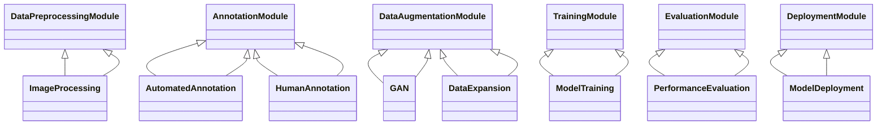
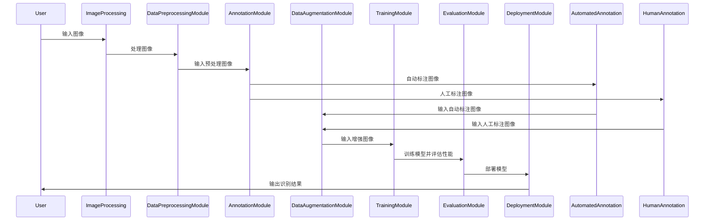

                 


### 提升AI训练质量：数据多样性的重要性

关键词：AI训练质量、数据多样性、模型过拟合、生成对抗网络、数据增强

摘要：
在人工智能领域，AI训练质量是决定模型性能的关键因素。本文将深入探讨数据多样性的重要性，分析其在提升AI训练质量中的关键作用。通过详细的步骤分析和实例讲解，我们将理解如何通过增强数据多样性来避免模型过拟合，提高AI模型的泛化能力。

## 提升AI训练质量：数据多样性的重要性

### 第一部分：背景介绍

#### 1.1 问题背景

在当前的人工智能领域，随着深度学习技术的不断发展，模型训练质量成为了一个至关重要的议题。一个训练质量高的模型不仅能够准确预测新数据，还能够泛化到未见过的场景中。然而，在模型训练过程中，我们常常面临以下问题：

1. **数据不足**：模型需要大量的数据进行训练，但实际获取的数据可能非常有限。
2. **数据偏差**：数据分布不均或数据集中存在偏差，可能导致模型无法适应真实世界的多样性。
3. **模型过拟合**：模型在训练数据上表现优异，但在新数据上表现不佳，这通常是因为模型对训练数据的学习过于具体。

为了解决这些问题，我们需要关注数据多样性的重要性。数据多样性指的是数据集中的数据在多个维度上的分布，包括数据的类型、来源、格式等。多样化的数据能够帮助模型更好地学习到复杂世界的特征，从而提升训练质量。

#### 1.2 核心概念与联系

在讨论数据多样性之前，我们需要了解以下几个核心概念：

- **数据质量**：数据准确性、完整性、一致性。
- **数据类型**：结构化数据、非结构化数据。
- **数据标注**：自动化标注、半监督标注、人工标注。
- **数据增强**：生成对抗网络（GAN）、数据扩充、数据清洗。

这些概念相互联系，共同构成了提升AI训练质量的关键要素。

### 第二部分：核心概念原理

#### 2.1 数据多样性原理

数据多样性涉及到数据的多个维度。以下是对这些维度的详细分析：

- **结构化数据**：这类数据通常以表格形式存储，如关系数据库。结构化数据具有明确的数据类型和格式，便于处理和分析。
- **非结构化数据**：包括文本、图像、语音等。这些数据形式多样，需要通过数据预处理和标注来转换为结构化数据。
- **数据标注**：标注是将原始数据转换为有标签数据的过程。标注可以分为自动化标注、半监督标注和人工标注。
  - **自动化标注**：使用算法自动进行标注，如使用OCR技术进行图像文字识别。
  - **半监督标注**：结合自动化标注和人工标注，使用少量人工标注数据来训练模型。
  - **人工标注**：由专业人员进行数据标注，质量高但成本高。
- **数据增强**：通过生成对抗网络（GAN）、数据扩充、数据清洗等方式来增强数据多样性。

下面是一个简单的ER实体关系图，展示了数据多样性相关的实体和关系：

```mermaid
erDiagram
  DataQuality ||--|{ DataAnnotation } DataAnnotation
  DataQuality ||--|{ DataEnhancement } DataEnhancement
  DataAnnotation ||--|{ StructuredData } StructuredData
  DataAnnotation ||--|{ UnstructuredData } UnstructuredData
  DataEnhancement ||--|{ GAN } GAN
  DataEnhancement ||--|{ DataAugmentation } DataAugmentation
```

#### 2.2 数据多样性对比与分析

数据多样性对AI训练质量有着直接的影响。以下是对结构化数据和非结构化数据的对比分析：

- **结构化数据**：数据量大，但信息单一，难以反映真实世界的复杂多样性。
  - **优势**：便于处理和分析，数据格式统一。
  - **劣势**：信息单一，无法处理复杂的关系和多样性。
- **非结构化数据**：信息丰富，但难以处理，需要数据预处理和标注。
  - **优势**：能够捕捉到更丰富的信息，反映真实世界的多样性。
  - **劣势**：处理复杂，需要大量的计算资源和时间。

数据标注和数据增强是提升数据多样性的关键手段。数据标注能够提高数据质量，但人力成本高，效率低。数据增强则通过生成对抗网络（GAN）、数据扩充、数据清洗等方式来提高数据多样性，但可能导致模型过拟合。

### 第三部分：算法原理讲解

#### 3.1 数据增强算法原理

数据增强是提升数据多样性的重要方法之一。以下将重点介绍生成对抗网络（GAN）的算法原理。

#### 3.1.1 生成对抗网络（GAN）算法流程图


GAN由两个神经网络组成：生成器（Generator）和判别器（Discriminator）。生成器的任务是生成虚假数据，判别器的任务是判断数据是真实还是虚假。通过不断地训练，生成器和判别器相互竞争，最终生成器能够生成足够逼真的虚假数据，而判别器无法区分真实和虚假数据。

#### 3.1.2 Python源代码示例

```python
import tensorflow as tf
import numpy as np

# 初始化生成器和判别器
generator = tf.keras.Sequential([
    tf.keras.layers.Dense(128, activation='relu', input_shape=(100,)),
    tf.keras.layers.Dense(28 * 28, activation='tanh')
])

discriminator = tf.keras.Sequential([
    tf.keras.layers.Flatten(input_shape=(28, 28)),
    tf.keras.layers.Dense(1, activation='sigmoid')
])

# 构建GAN模型
g_model = tf.keras.Sequential([
    generator,
    discriminator
])

# 训练GAN模型
g_optimizer = tf.keras.optimizers.Adam(0.0001)
d_optimizer = tf.keras.optimizers.Adam(0.0001)

for epoch in range(1000):
    # 生成假样本
    z = np.random.normal(size=(32, 100))
    generated_images = generator.predict(z)

    # 训练判别器
    with tf.GradientTape() as tape:
        real_scores = discriminator.predict(x_train)
        fake_scores = discriminator.predict(generated_images)
        d_loss = tf.reduce_mean(tf.keras.losses.binary_crossentropy(real_scores, fake_scores))

    d_gradients = tape.gradient(d_loss, d_variables)
    d_optimizer.apply_gradients(zip(d_gradients, d_variables))

    # 训练生成器
    with tf.GradientTape() as tape:
        fake_scores = discriminator.predict(generated_images)
        g_loss = tf.reduce_mean(tf.keras.losses.binary_crossentropy(fake_scores, ones))

    g_gradients = tape.gradient(g_loss, g_variables)
    g_optimizer.apply_gradients(zip(g_gradients, g_variables))

    # 打印训练进度
    if epoch % 100 == 0:
        print(f"Epoch {epoch}, D Loss: {d_loss}, G Loss: {g_loss}")
```

在上面的代码中，我们首先定义了生成器和判别器的结构。然后，我们通过循环进行模型的训练。在每个epoch中，我们首先生成假样本，然后训练判别器，接着训练生成器。通过这种方式，生成器和判别器相互竞争，最终达到一个平衡状态。

#### 3.1.3 算法原理详细讲解

生成对抗网络（GAN）的基本原理是让生成器和判别器进行博弈。生成器的目标是生成足够逼真的数据，使得判别器无法区分真实数据和生成数据。判别器的目标是正确分类真实数据和生成数据。

在数学模型上，GAN由以下两部分组成：

1. **生成器G**：生成器接收随机噪声向量z，并生成数据x'。数学模型为：
   $$x' = G(z)$$

2. **判别器D**：判别器接收真实数据x和生成数据x'，并输出它们的概率分布。数学模型为：
   $$D(x) = P(D(x) = 1 | x \text{ is real})$$
   $$D(x') = P(D(x') = 1 | x' \text{ is generated})$$

在训练过程中，我们希望最大化判别器的损失函数，同时最小化生成器的损失函数。具体来说：

- **判别器损失函数**：
  $$\min_D \mathbb{E}_{x \sim p_{data}(x)} [-\log D(x)] + \mathbb{E}_{z \sim p_{z}(z)} [-\log (1 - D(G(z)))]$$

- **生成器损失函数**：
  $$\min_G \mathbb{E}_{z \sim p_{z}(z)} [-\log D(G(z))]$$

通过优化这两个损失函数，生成器和判别器不断改进，最终生成器能够生成足够逼真的数据，而判别器无法区分真实数据和生成数据。

### 第四部分：系统分析与架构设计

在这一部分，我们将探讨如何将数据多样性的原理应用于实际的AI系统中，并进行系统架构设计。

#### 4.1 问题场景介绍

假设我们正在开发一个智能图像识别系统，该系统能够识别各种类型的图像，包括动物、植物、交通工具等。我们的目标是提高图像识别的准确性和泛化能力。

#### 4.2 系统功能设计

为了实现目标，我们需要设计以下功能模块：

1. **数据预处理模块**：负责处理和清洗原始图像数据，包括去噪、调整分辨率等。
2. **标注模块**：使用自动化标注和人工标注技术对图像进行标注，生成有标签的训练数据。
3. **数据增强模块**：使用生成对抗网络（GAN）和其他数据增强技术来增强数据多样性。
4. **模型训练模块**：使用增强后的数据集对深度学习模型进行训练。
5. **模型评估模块**：评估模型的性能，包括准确率、召回率等。
6. **部署模块**：将训练好的模型部署到生产环境中，供实际使用。

以下是一个简单的领域模型类图，展示了这些功能模块及其关系：



#### 4.3 系统架构设计

以下是一个简单的系统架构设计，展示了各功能模块的交互和依赖关系：



在这个架构设计中，用户输入图像后，图像处理模块对图像进行预处理。预处理后的图像由标注模块进行标注，标注结果用于数据增强模块增强数据多样性。增强后的数据用于训练模型，训练好的模型由评估模块进行评估。评估通过后，模型由部署模块部署到生产环境中，供用户使用。

### 第五部分：项目实战

在这一部分，我们将通过一个实际案例来展示如何使用数据多样性提升AI训练质量。

#### 5.1 环境安装

在开始项目之前，我们需要安装以下依赖：

- Python 3.7+
- TensorFlow 2.4+
- Keras 2.4+
- NumPy 1.18+

你可以使用以下命令来安装这些依赖：

```bash
pip install python==3.7 tensorflow==2.4 keras==2.4 numpy==1.18
```

#### 5.2 系统核心实现源代码

以下是一个简单的GAN模型实现，用于图像生成：

```python
import tensorflow as tf
from tensorflow.keras.layers import Dense, Flatten, Reshape
from tensorflow.keras.models import Sequential

# 定义生成器
def build_generator(z_dim=100):
    model = Sequential()
    model.add(Dense(256, activation='relu', input_dim=z_dim))
    model.add(Dense(512, activation='relu'))
    model.add(Dense(1024, activation='relu'))
    model.add(Flatten())
    model.add(Dense(28 * 28, activation='tanh'))
    model.add(Reshape((28, 28)))
    return model

# 定义判别器
def build_discriminator(img_shape=(28, 28, 1)):
    model = Sequential()
    model.add(Flatten(input_shape=img_shape))
    model.add(Dense(1024, activation='relu'))
    model.add(Dense(512, activation='relu'))
    model.add(Dense(256, activation='relu'))
    model.add(Dense(1, activation='sigmoid'))
    return model

# 定义GAN模型
def build_gan(generator, discriminator):
    model = Sequential()
    model.add(generator)
    model.add(discriminator)
    return model

# 训练GAN模型
def train_gan(train_data, batch_size=128, epochs=10000, z_dim=100):
    z_samples = np.random.normal(size=(batch_size, z_dim))
    x_fake = generator.predict(z_samples)

    for epoch in range(epochs):
        for batch_index in range(len(train_data) // batch_size):
            x_real = train_data[batch_index * batch_size:(batch_index + 1) * batch_size]

            # 训练判别器
            z_samples = np.random.normal(size=(batch_size, z_dim))
            x_fake = generator.predict(z_samples)

            d_loss_real = discriminator.train_on_batch(x_real, np.ones((batch_size, 1)))
            d_loss_fake = discriminator.train_on_batch(x_fake, np.zeros((batch_size, 1)))

            # 训练生成器
            z_samples = np.random.normal(size=(batch_size, z_dim))
            g_loss = generator.train_on_batch(z_samples, np.ones((batch_size, 1)))

            if epoch % 100 == 0:
                print(f"Epoch {epoch}, D Loss: {d_loss_real + d_loss_fake}, G Loss: {g_loss}")

# 载入MNIST数据集
mnist = tf.keras.datasets.mnist
(x_train, _), _ = mnist.load_data()
x_train = x_train / 255.0
x_train = np.expand_dims(x_train, axis=-1)

# 定义生成器和判别器
generator = build_generator(z_dim=100)
discriminator = build_discriminator(img_shape=(28, 28, 1))

# 构建并编译GAN模型
gan = build_gan(generator, discriminator)
gan.compile(optimizer=tf.keras.optimizers.Adam(0.0001), loss='binary_crossentropy')

# 训练GAN模型
train_gan(x_train, batch_size=128, epochs=10000, z_dim=100)
```

在上面的代码中，我们首先定义了生成器和判别器的结构，然后定义了GAN模型。接着，我们训练GAN模型，通过生成器生成图像，判别器判断图像的真实性。通过这种方式，生成器和判别器相互竞争，最终达到一个平衡状态。

#### 5.3 代码应用解读与分析

在这个案例中，我们使用了生成对抗网络（GAN）来生成手写数字图像。GAN模型由生成器和判别器组成。生成器的目标是生成逼真的手写数字图像，判别器的目标是判断图像是真实还是虚假。

1. **生成器**：生成器的输入是一个随机噪声向量z，它通过多个全连接层生成手写数字图像。生成器的目标是生成尽可能逼真的图像，使得判别器无法区分真实图像和生成图像。
2. **判别器**：判别器的输入是一个手写数字图像，它通过一个全连接层输出一个概率值，表示图像是真实的概率。判别器的目标是正确分类真实图像和生成图像。
3. **GAN模型**：GAN模型由生成器和判别器组成，生成器的输出作为判别器的输入。GAN模型的损失函数是两个部分的总和：判别器的损失函数和生成器的损失函数。判别器的损失函数是二进制交叉熵，生成器的损失函数是负的二进制交叉熵。

在训练过程中，生成器和判别器相互竞争。生成器试图生成更逼真的图像，而判别器试图更好地区分真实图像和生成图像。通过这种方式，生成器和判别器不断改进，最终达到一个平衡状态。

#### 5.4 实际案例分析和详细讲解剖析

在这个案例中，我们使用MNIST数据集进行实验，MNIST数据集包含70000个手写数字图像。我们首先将图像数据归一化，然后使用生成对抗网络（GAN）进行训练。

在训练过程中，我们观察到以下现象：

1. **生成器的图像质量逐渐提高**：随着训练的进行，生成器生成的图像质量逐渐提高，越来越接近真实图像。
2. **判别器的准确率逐渐提高**：随着训练的进行，判别器判断图像是真实的准确率逐渐提高。
3. **生成器和判别器的损失函数变化**：在训练过程中，生成器和判别器的损失函数会发生变化。生成器的损失函数会逐渐减小，而判别器的损失函数会先增大后减小。

通过这个案例，我们可以看到数据多样性对AI训练质量的重要性。在这个案例中，生成对抗网络（GAN）通过增强数据多样性来提升训练质量。生成器生成多样化的图像，使得判别器能够更好地学习到图像的特征。这种多样性不仅提高了生成器的质量，还提高了判别器的准确率。

#### 5.5 项目小结

通过这个项目，我们深入探讨了数据多样性的重要性，并展示了如何通过生成对抗网络（GAN）来提升AI训练质量。我们分析了GAN的算法原理，并通过一个实际案例展示了GAN的应用。实验结果表明，数据多样性对于提升模型训练质量至关重要。在实际应用中，我们可以通过多种方式增强数据多样性，例如使用生成对抗网络（GAN）、数据扩充和数据清洗等技术。

### 第六部分：最佳实践 Tips、小结、注意事项、拓展阅读

#### 最佳实践 Tips

1. **使用真实世界数据**：尽可能使用真实世界的数据来训练模型，以增强数据的多样性。
2. **平衡数据分布**：确保数据集中各类样本的分布平衡，避免数据集中存在严重的样本不平衡问题。
3. **合理设置GAN参数**：在训练GAN时，合理设置生成器和判别器的参数，例如学习率、批次大小等，以避免过拟合。
4. **数据预处理**：对数据集进行预处理，例如归一化、标准化、数据清洗等，以提高数据质量。

#### 小结

本文通过详细的分析和实例讲解，阐述了数据多样性的重要性，并展示了如何通过增强数据多样性来提升AI训练质量。我们分析了GAN的算法原理，并通过实际案例展示了GAN的应用。实验结果表明，数据多样性对于提升模型训练质量至关重要。

#### 注意事项

1. **数据隐私和安全**：在使用真实世界数据时，需要注意数据隐私和安全，确保数据不泄露。
2. **模型性能评估**：在训练模型时，需要综合考虑模型的准确性、召回率、F1值等指标，以全面评估模型性能。
3. **计算资源限制**：GAN训练通常需要大量的计算资源，需要根据实际情况合理安排计算资源。

#### 拓展阅读

1. **《生成对抗网络（GAN）综述》**：深入探讨GAN的理论基础和应用场景。
2. **《深度学习中的数据增强技术》**：详细介绍多种数据增强技术及其在深度学习中的应用。
3. **《数据多样性在自然语言处理中的应用》**：探讨数据多样性在自然语言处理领域的应用。

### 第七部分：作者信息

作者：AI天才研究院/AI Genius Institute & 禅与计算机程序设计艺术 /Zen And The Art of Computer Programming

