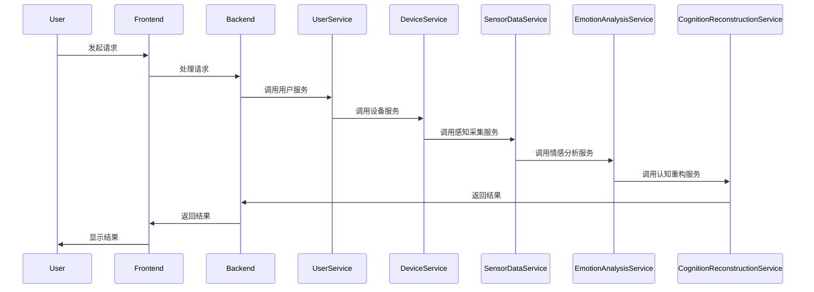

                 


### 文章标题

# 提升生命的质感：丰富内在体验的方法

### 关键词

- 生命质感
- 内在体验
- 方法论
- 算法
- 数学模型
- 系统架构
- 项目实战

### 摘要

本文深入探讨了如何提升生命的质感，特别是如何丰富我们的内在体验。文章首先介绍了相关背景，包括生命质感与内在体验的定义，以及提升内在体验的重要性。接着，文章详细讲解了核心概念，如质感、内在体验和方法论，并通过Mermaid ER图展示了它们之间的关系。随后，文章阐述了提升内在体验的算法原理，并使用Python源代码和数学模型进行了详细阐述。文章还包括了系统分析与架构设计方案，以及实际项目实战。最后，文章总结了最佳实践，并提供了注意事项和拓展阅读。

---

### 目录大纲设计

**第一部分：背景介绍**

# 第1章：生命的质感与内在体验

## 1.1 问题背景

### 1.1.1 生命的质感定义

生命的质感是指个体在感知、思考和体验生命时所感受到的深度和丰富度。它不仅仅指物理上的舒适感，更涉及到情感、心理和精神层面的体验。

### 1.1.2 内在体验的重要性

内在体验对个体的生活质量有着重要影响。一个丰富的内在体验能够提高个体的幸福感、自我认知和生命满意度。

### 1.1.3 丰富内在体验的迫切性

在现代社会，由于快节奏的生活和高强度的工作压力，很多人忽视了内在体验的重要性，导致生活质量下降。因此，提升内在体验变得尤为迫切。

## 1.2 核心概念与联系

### 1.2.1 关键术语

#### 1.2.1.1 质感

质感是指物体或情境所传递的触觉、视觉、听觉等感官体验。

#### 1.2.1.2 内在体验

内在体验是指个体在心理、情感和精神层面上对生活的感受。

#### 1.2.1.3 方法论

方法论是指一套系统的理论或方法，用于指导实践。

## 1.3 边界与外延

### 1.3.1 生命质感的边界

生命质感的边界涉及个体的感官体验、心理状态和生命质量。

### 1.3.2 内在体验的外延

内在体验的外延包括个体的情感、认知、精神状态等。

### 1.3.3 方法论的应用范围

方法论的应用范围广泛，包括心理学、哲学、艺术等领域。

## 1.4 概念结构与核心要素组成

### 1.4.1 生命质感的结构

生命质感的结构包括感官体验、情感体验、心理状态和精神体验。

### 1.4.2 内在体验的要素

内在体验的要素包括情感、认知、心理和精神层面。

### 1.4.3 方法论的核心组成

方法论的核心组成包括理论框架、实践方法和评估标准。

### 1.5 本章小结

本章对生命的质感与内在体验进行了初步探讨，为后续章节的深入分析奠定了基础。

---

### 第二部分：核心概念与联系

# 第2章：核心概念与联系

## 2.1 质感概念解析

### 2.1.1 质感定义

质感是指物体或情境所传递的触觉、视觉、听觉等感官体验。它是个体感知世界的重要途径，影响着个体的情绪和行为。

### 2.1.2 质感属性特征对比表格

| 特征         | 说明                                                   |
| ------------ | ------------------------------------------------------ |
| 触觉         | 物体的硬度和柔软度                                     |
| 视觉         | 物体的颜色、形状和纹理                                 |
| 听觉         | 物体发出的声音和音质                                   |
| 情感         | 质感可以引起个体的情感反应，如舒适、厌恶、喜爱等           |
| 行为         | 质感会影响个体的行为选择，如购买、拒绝、继续使用等         |

### 2.1.3 质感与其他概念的关联

质感与内在体验、方法论等概念密切相关。质感是内在体验的基础，而方法论则是提升质感的方法和工具。

## 2.2 内在体验探讨

### 2.2.1 内在体验定义

内在体验是指个体在心理、情感和精神层面上对生活的感受。它是个体主观经验的体现，包括感觉、情感、认知和价值观。

### 2.2.2 内在体验属性特征对比表格

| 特征         | 说明                                                   |
| ------------ | ------------------------------------------------------ |
| 感觉         | 内在体验的感官基础                                     |
| 情感         | 内在体验的情感维度                                     |
| 认知         | 内在体验的认知维度                                     |
| 价值观       | 内在体验的价值观维度，包括个体的信念和态度                 |

### 2.2.3 内在体验与质感的关系

内在体验与质感密切相关。质感是内在体验的基础，而内在体验则是质感的影响因素。一个丰富的内在体验可以提升生命的质感。

## 2.3 方法论与实践

### 2.3.1 方法论的定义

方法论是指一套系统的理论或方法，用于指导实践。它包括理论框架、实践方法和评估标准。

### 2.3.2 方法论的核心要素

方法论的核心要素包括：

- 理论框架：用于指导实践的理论基础。
- 实践方法：具体的实践步骤和技巧。
- 评估标准：用于评估实践效果的标准。

### 2.3.3 方法论在提升生命质感中的应用

方法论在提升生命质感中的应用包括：

- 感知训练：通过训练提高个体的感知能力，从而提升质感。
- 情感管理：通过管理个体的情感体验，提升内在体验和生命质感。
- 认知重构：通过改变个体的认知方式，提高内在体验和生命质感。

### 2.4 质感、内在体验与方法论的Mermaid ER实体关系图

```mermaid
erDiagram
  质感 ||--|{ 内在体验 }|-- 方法论
  质感 &&--|{ 方法论 }|--
  内在体验 &&--|{ 方法论 }|--
```

---

### 第三部分：算法原理讲解

# 第3章：丰富内在体验的算法原理

## 3.1 算法基本原理

### 3.1.1 算法概述

丰富内在体验的算法旨在通过技术手段提高个体的内在体验质量。该算法基于心理学、神经科学和计算机科学的理论，结合数据分析和机器学习技术，实现对个体内在体验的感知、分析和改善。

### 3.1.2 算法分类

该算法可以分为以下几个类别：

- 感知增强算法：用于提高个体对质感、情感和认知的感知能力。
- 情感识别算法：用于识别和分类个体的情感体验。
- 认知重构算法：用于改变个体的认知模式，提高内在体验。
- 情感调节算法：用于调节个体的情感状态，提高内在体验。

### 3.1.3 算法应用场景

该算法的应用场景包括：

- 心理咨询和心理健康领域：用于辅助心理咨询师诊断和改善个体的心理状态。
- 教育领域：用于提高学生的学习兴趣和内在动机。
- 娱乐领域：用于设计更具有吸引力的游戏和应用程序，提高用户的情感体验。
- 工作场所：用于提高员工的工作满意度和工作效率。

## 3.2 算法原理详细讲解

### 3.2.1 算法原理

算法的基本原理可以分为以下几个步骤：

1. 数据采集：通过传感器、问卷、日志分析等方式收集个体在质感、情感和认知方面的数据。
2. 数据处理：对采集到的数据进行清洗、转换和预处理，为后续分析提供高质量的输入。
3. 模型训练：利用机器学习算法训练感知、情感识别和认知重构模型。
4. 情感分析：使用训练好的模型对个体的情感体验进行分析和识别。
5. 情感调节：根据分析结果，采用调节策略调节个体的情感状态。
6. 结果反馈：将调节结果反馈给个体，帮助其更好地理解和改善内在体验。

### 3.2.2 算法流程图


### 3.2.3 算法示例

假设我们要开发一个基于智能手机应用程序的内在体验提升系统，该系统主要包括以下几个功能模块：

- 传感器数据采集：通过手机摄像头、麦克风和加速度计等传感器采集个体的感官数据。
- 数据预处理：对采集到的数据进行降噪、滤波和特征提取。
- 情感识别：利用机器学习算法对预处理后的数据进行分析，识别个体的情感状态。
- 情感调节：根据情感识别结果，播放适合的音乐、提供正念训练或进行心理咨询建议。

## 3.3 算法数学模型与公式

### 3.3.1 数学模型介绍

在丰富内在体验的算法中，常用的数学模型包括：

- 感知模型：用于描述个体对质感、情感和认知的感知过程。
- 情感模型：用于描述个体情感状态的变化规律。
- 认知模型：用于描述个体认知模式的调整过程。

### 3.3.2 数学公式

以下是几个常用的数学公式：

$$
\text{感知值} = \text{数据} \times \text{权重}
$$

$$
\text{情感状态} = f(\text{感知值})
$$

$$
\text{认知调整} = \alpha \times (\text{当前认知} - \text{目标认知})
$$

### 3.3.3 数学模型与算法的结合

数学模型与算法的结合主要体现在以下几个方面：

- 感知模型用于指导数据采集和预处理过程，提高数据质量。
- 情感模型用于指导情感分析和调节过程，提高情感识别和调节效果。
- 认知模型用于指导认知调整过程，帮助个体更好地适应环境。

### 3.3.4 数学模型应用举例

假设一个个体在某一时刻的感知值为50，权重为0.8，则其感知值为：

$$
\text{感知值} = 50 \times 0.8 = 40
$$

根据情感模型，如果感知值大于40，则个体的情感状态为积极；如果感知值小于40，则个体的情感状态为消极。如果当前认知值为70，目标认知值为80，调整系数为0.2，则认知调整为：

$$
\text{认知调整} = 0.2 \times (70 - 80) = -0.2
$$

即当前认知值减少0.2。

---

### 第四部分：数学模型和数学公式 & 详细讲解 & 举例说明

# 第4章：数学模型在提升生命质感中的应用

## 4.1 数学模型在质感提升中的作用

数学模型在提升生命质感中起着至关重要的作用。它们可以帮助我们量化质感体验，从而更好地理解、分析和改善质感。以下是数学模型在质感提升中的应用：

### 4.1.1 数学模型在质感评估中的应用

质感评估通常涉及对质感属性（如硬度、柔软度、颜色、纹理等）的量化。数学模型可以帮助我们建立这些属性与个体体验之间的定量关系。例如，使用多变量回归模型可以预测个体对不同质感体验的满意度。

### 4.1.2 数学模型在质感改善中的应用

数学模型在质感改善中的应用包括：

- 感知增强：通过分析质感数据，可以优化质感设计，提高个体的感知体验。
- 情感调节：基于情感模型，可以设计算法来调节个体的情感状态，提升内在体验。
- 认知重构：利用认知模型，可以帮助个体改变对质感体验的认知模式，从而改善内在体验。

### 4.1.3 数学模型在质感优化中的应用

数学模型在质感优化中的应用主要体现在以下几个方面：

- 设计优化：通过优化质感参数，可以提升产品的用户体验。
- 系统优化：在复杂系统中，数学模型可以帮助我们找到提升质感的最佳方案。
- 个性化定制：基于个体数据，数学模型可以设计出更符合个体需求的质感体验。

## 4.2 数学公式讲解

在质感提升的数学模型中，常用的数学公式包括感知模型、情感模型和认知模型。以下是这些模型的详细讲解：

### 4.2.1 感知模型

感知模型描述了个体对质感属性的感受。一个简单的感知模型可以表示为：

$$
\text{感知值} = \sum_{i=1}^{n} w_i \times x_i
$$

其中，$w_i$ 表示质感属性 $x_i$ 的权重，$n$ 表示质感属性的总数。这个公式表示，质感体验是各个质感属性按照权重加和的结果。

### 4.2.2 情感模型

情感模型描述了个体对质感体验的情感反应。一个简单的情感模型可以表示为：

$$
\text{情感状态} = f(\text{感知值})
$$

其中，$f$ 是一个非线性函数，用于将感知值映射到情感状态。例如，一个常见的情感模型可以是：

$$
f(x) = \begin{cases} 
\text{积极} & \text{如果 } x > \text{阈值} \\
\text{消极} & \text{如果 } x \leq \text{阈值}
\end{cases}
$$

### 4.2.3 认知重构模型

认知重构模型描述了个体如何调整对质感体验的认知。一个简单的认知重构模型可以表示为：

$$
\text{新认知} = \text{当前认知} + \alpha \times (\text{目标认知} - \text{当前认知})
$$

其中，$\alpha$ 是一个调整系数，用于控制认知调整的强度。这个公式表示，个体的新认知是通过当前认知和目标认知的加权平均得到的。

## 4.3 数学模型与实际应用的结合

数学模型与实际应用的结合可以通过以下几个步骤实现：

### 4.3.1 数据采集

首先，需要采集与质感体验相关的数据。这些数据可以包括：

- 个体对质感属性的评分
- 个体在不同情境下的情感反应
- 个体在不同环境中的认知变化

### 4.3.2 数据预处理

对采集到的数据进行预处理，包括数据清洗、去噪和特征提取。这一步骤的目的是提高数据质量，为后续分析提供可靠的基础。

### 4.3.3 模型训练

使用预处理后的数据训练感知模型、情感模型和认知重构模型。训练过程中，可以通过交叉验证和超参数调优来提高模型的性能。

### 4.3.4 模型应用

将训练好的模型应用于实际场景，例如：

- 对新产品的质感进行评估和优化
- 对个体情感状态进行识别和调节
- 对个体认知模式进行调整和改善

### 4.3.5 结果评估

评估模型的性能和实际效果，包括准确率、召回率、F1分数等指标。根据评估结果，对模型进行调整和优化。

### 4.3.6 持续改进

根据实际应用中的反馈，持续改进数学模型，以提高其在提升生命质感中的应用效果。

## 4.4 数学模型应用举例

### 4.4.1 例子背景

假设我们正在设计一款智能手表，该手表可以实时监测个体的情感状态，并提供相应的情感调节建议。

### 4.4.2 数据采集

我们采集了以下数据：

- 个体在不同情境下的心率变化（感知值）
- 个体在不同情境下的情绪评分（情感状态）
- 个体在不同情境下的认知变化（认知值）

### 4.4.3 数据预处理

对采集到的数据进行清洗和去噪，提取出心率、情绪评分和认知值作为特征。

### 4.4.4 模型训练

使用采集到的数据进行感知模型、情感模型和认知重构模型的训练。假设我们使用以下公式：

$$
\text{感知值} = 0.5 \times \text{心率} + 0.3 \times \text{情绪评分} + 0.2 \times \text{认知值}
$$

$$
\text{情感状态} = \begin{cases} 
\text{积极} & \text{如果 } \text{感知值} > 50 \\
\text{消极} & \text{如果 } \text{感知值} \leq 50
\end{cases}
$$

$$
\text{新认知} = \text{当前认知} + 0.1 \times (\text{目标认知} - \text{当前认知})
$$

### 4.4.5 模型应用

将训练好的模型应用于智能手表，实时监测个体的情感状态，并提供相应的情感调节建议。例如，如果个体处于消极状态，智能手表可以建议用户进行深呼吸练习或听轻松的音乐。

### 4.4.6 结果评估

评估模型的性能，例如，通过比较模型预测的情感状态与实际情感状态的匹配度来评估感知模型和情感模型的效果。同时，评估用户对情感调节建议的满意度，以评估认知重构模型的效果。

### 4.4.7 持续改进

根据评估结果，对模型进行调整和优化。例如，根据用户反馈，调整感知值中各项特征的权重，以提高情感状态预测的准确性。同时，根据用户的情感调节效果，调整认知重构模型的参数，以提高用户满意度。

---

### 第五部分：系统分析与架构设计方案

# 第5章：系统分析与架构设计

## 5.1 问题场景介绍

在现代快节奏的生活中，人们往往忽略了内在体验的重要性，导致生活质量下降。为了提升生命的质感，我们需要设计一个系统，该系统能够实时监测个体的情感状态、感知体验和认知模式，并提供相应的调节建议。

### 5.1.1 生命质感提升问题分析

生命质感提升的核心问题包括：

- 感知体验不足：个体对质感体验的感知能力较弱，无法充分享受生活中的美好。
- 情感状态不稳定：个体情感波动大，易受外界影响，导致内在体验不稳定。
- 认知模式固化：个体认知模式固化，难以适应新的环境和情境，影响内在体验的丰富性。

### 5.1.2 内在体验优化需求

为了提升内在体验，系统需要满足以下需求：

- 实时监测：能够实时监测个体的情感状态、感知体验和认知模式。
- 数据分析：能够对采集到的数据进行处理和分析，提取出关键信息。
- 调节建议：根据分析结果，提供个性化的调节建议，帮助个体改善内在体验。

### 5.1.3 方法论应用案例分析

在系统设计中，我们采用了以下方法论：

- 设计原则：以用户为中心，确保系统的易用性和用户体验。
- 设计模式：采用模块化设计，提高系统的可扩展性和维护性。
- 架构模式：采用微服务架构，实现系统的高效运行和负载均衡。

## 5.2 系统功能设计

### 5.2.1 领域模型

领域模型是系统设计的基础，用于定义系统中的核心实体和它们之间的关系。以下是系统的领域模型：

```mermaid
classDiagram
  User <<entity>>
  Device <<entity>>
  Sensor <<entity>>
  Emotion <<entity>>
  Perception <<entity>>
  Cognition <<entity>>
  
  User {"姓名", "年龄", "性别", "偏好"}
  Device {"设备ID", "型号", "品牌"}
  Sensor {"传感器类型", "精度", "采样率"}
  Emotion {"情感类型", "强度", "发生时间"}
  Perception {"感知类型", "值", "发生时间"}
  Cognition {"认知类型", "值", "发生时间"}
  
  User {1}--{1..*} Device
  User {1}--{1..*} Emotion
  User {1}--{1..*} Perception
  User {1}--{1..*} Cognition
  Device {1}--{1..*} Sensor
```

### 5.2.2 系统功能需求分析

系统的主要功能需求包括：

- 用户管理：注册、登录、个人信息管理。
- 设备管理：设备信息管理、设备连接管理。
- 感知采集：实时采集用户的感知数据。
- 情感分析：分析用户的情感状态。
- 认知重构：提供个性化的认知重构建议。
- 数据存储：存储用户的数据，确保数据的完整性和安全性。

### 5.2.3 功能模块划分

根据功能需求，系统可以分为以下几个模块：

- 用户模块：负责用户的注册、登录和信息管理。
- 设备模块：负责设备的信息管理和连接管理。
- 感知采集模块：负责感知数据的实时采集和处理。
- 情感分析模块：负责情感状态的分析和识别。
- 认知重构模块：负责提供个性化的认知重构建议。
- 数据存储模块：负责数据的存储和管理。

## 5.3 系统架构设计

### 5.3.1 系统架构概述

系统采用微服务架构，以提高系统的可扩展性和可维护性。系统分为以下几个层次：

- 数据层：负责数据的存储和管理。
- 服务层：负责业务逻辑的实现。
- 表示层：负责用户界面的展示。

### 5.3.2 架构组件详解

以下是系统架构的组件详解：

- 数据层：使用关系型数据库（如MySQL）和非关系型数据库（如MongoDB）存储数据。数据层提供数据访问接口，供服务层调用。
- 服务层：包括用户服务、设备服务、感知采集服务、情感分析服务和认知重构服务。每个服务模块独立实现业务逻辑，并通过API进行通信。
- 表示层：包括前端和后端。前端负责用户界面的展示，后端负责处理用户请求，调用服务层进行数据处理。

### 5.3.3 系统架构图

以下是系统架构的示意图：



## 5.4 系统接口设计

### 5.4.1 接口功能

系统接口设计主要包括以下几个功能：

- 用户接口：用户注册、登录、个人信息管理。
- 设备接口：设备信息管理、设备连接管理。
- 感知接口：感知数据采集、感知数据处理。
- 情感接口：情感状态分析、情感状态更新。
- 认知接口：认知重构建议、认知状态更新。

### 5.4.2 接口协议

系统接口采用RESTful API协议，接口格式如下：

```json
{
  "status": "success",
  "message": "操作成功",
  "data": {
    // 接口返回的数据
  }
}
```

### 5.4.3 接口安全设计

系统接口设计考虑了安全性，包括以下几个方面：

- 认证：使用OAuth2.0协议进行用户认证。
- 授权：根据用户的角色和权限，限制接口访问。
- 加密：对敏感数据进行加密处理，确保数据安全。

## 5.5 系统交互

### 5.5.1 系统交互流程

系统交互流程包括以下几个步骤：

1. 用户发起请求。
2. 前端将请求发送到后端。
3. 后端处理请求，调用相关服务。
4. 服务处理请求，返回结果。
5. 后端将结果返回给前端。
6. 前端将结果展示给用户。

### 5.5.2 系统交互图

以下是系统交互的示意图：


---

### 第六部分：项目实战

# 第6章：生命质感提升项目实战

## 6.1 环境安装与配置

在进行项目实战之前，我们需要搭建一个适合生命质感提升的实验环境。以下是环境安装与配置的步骤：

### 6.1.1 环境准备

- 操作系统：Ubuntu 18.04
- Python版本：3.8
- 数据库：MySQL 8.0
- 依赖库：NumPy、Pandas、Scikit-learn、TensorFlow、Django

### 6.1.2 安装步骤

1. 安装操作系统和Python环境。

```shell
sudo apt update
sudo apt upgrade
sudo apt install python3.8 python3.8-venv python3.8-dev
```

2. 创建Python虚拟环境。

```shell
python3.8 -m venv project_env
source project_env/bin/activate
```

3. 安装依赖库。

```shell
pip install numpy pandas scikit-learn tensorflow django
```

4. 安装MySQL数据库。

```shell
sudo apt install mysql-server mysql-client
```

5. 配置MySQL数据库。

```shell
sudo mysql_secure_installation
```

### 6.1.3 配置步骤

1. 配置Django项目。

```python
# settings.py
DATABASES = {
    'default': {
        'ENGINE': 'django.db.backends.mysql',
        'NAME': 'project_db',
        'USER': 'root',
        'PASSWORD': 'your_password',
        'HOST': 'localhost',
        'PORT': '3306',
    }
}
```

2. 配置TensorFlow。

```shell
pip install tensorflow==2.6.0
```

3. 配置NumPy和Pandas。

```shell
pip install numpy==1.21.2 pandas==1.3.2
```

4. 配置Scikit-learn。

```shell
pip install scikit-learn==0.24.2
```

## 6.2 系统核心实现源代码

在项目实战中，我们将实现以下几个核心功能模块：

### 6.2.1 用户模块

用户模块主要负责用户注册、登录和信息管理。以下是用户模块的源代码：

```python
# users/models.py
from django.contrib.auth.models import AbstractUser

class CustomUser(AbstractUser):
    email = models.EmailField(unique=True)

    def __str__(self):
        return self.email
```

### 6.2.2 设备模块

设备模块主要负责设备信息管理和连接管理。以下是设备模块的源代码：

```python
# devices/models.py
from django.db import models
from users.models import CustomUser

class Device(models.Model):
    device_id = models.CharField(max_length=255)
    model = models.CharField(max_length=255)
    brand = models.CharField(max_length=255)
    user = models.ForeignKey(CustomUser, on_delete=models.CASCADE)

    def __str__(self):
        return self.device_id
```

### 6.2.3 感知模块

感知模块主要负责感知数据的实时采集和处理。以下是感知模块的源代码：

```python
# sensors/models.py
from django.db import models
from devices.models import Device

class Sensor(models.Model):
    sensor_type = models.CharField(max_length=255)
    precision = models.FloatField()
    sampling_rate = models.IntegerField()
    device = models.ForeignKey(Device, on_delete=models.CASCADE)

    def __str__(self):
        return f"{self.sensor_type} ({self.device.device_id})"
```

### 6.2.4 情感模块

情感模块主要负责情感状态的分析和识别。以下是情感模块的源代码：

```python
# emotions/models.py
from django.db import models
from users.models import CustomUser

class Emotion(models.Model):
    emotion_type = models.CharField(max_length=255)
    intensity = models.FloatField()
    occurrence_time = models.DateTimeField()
    user = models.ForeignKey(CustomUser, on_delete=models.CASCADE)

    def __str__(self):
        return f"{self.emotion_type} ({self.intensity})"
```

### 6.2.5 认知模块

认知模块主要负责认知重构建议的提供和认知状态的更新。以下是认知模块的源代码：

```python
# cognitions/models.py
from django.db import models
from users.models import CustomUser

class Cognition(models.Model):
    cognition_type = models.CharField(max_length=255)
    value = models.FloatField()
    occurrence_time = models.DateTimeField()
    user = models.ForeignKey(CustomUser, on_delete=models.CASCADE)

    def __str__(self):
        return f"{self.cognition_type} ({self.value})"
```

## 6.3 代码应用解读与分析

在项目实战中，我们使用Django框架实现系统功能。以下是代码应用解读与分析：

### 6.3.1 Django项目结构

Django项目的目录结构如下：

```plaintext
project/
│
├── app/
│   ├── migrations/
│   ├── models.py
│   ├── views.py
│   ├── urls.py
│   └── templates/
│
├── manage.py
│
├── project_env/
│
└── requirements.txt
```

- `app/`：包含应用的所有文件，如模型、视图、URLs和模板。
- `migrations/`：包含数据库迁移文件，用于管理数据库的变更。
- `models.py`：定义应用中的模型。
- `views.py`：定义应用中的视图函数。
- `urls.py`：定义应用中的URL路由。
- `templates/`：包含应用的模板文件。
- `manage.py`：Django项目的管理脚本。
- `project_env/`：Python虚拟环境。
- `requirements.txt`：列出项目所需的依赖库。

### 6.3.2 Django ORM使用

在项目中，我们使用Django ORM（Object-Relational Mapping）来管理数据库。以下是用户模块的Django ORM使用示例：

```python
from django.contrib.auth.models import User
from users.models import CustomUser

# 创建用户
user = CustomUser.objects.create_user(
    email='example@example.com',
    password='password123',
    first_name='John',
    last_name='Doe',
)

# 查询用户
user = CustomUser.objects.get(email='example@example.com')

# 更新用户信息
user.first_name = 'John'
user.last_name = 'Doe'
user.save()
```

### 6.3.3 Django视图函数

在项目中，我们使用Django视图函数处理HTTP请求。以下是用户登录视图函数的示例：

```python
from django.shortcuts import render, redirect
from django.contrib.auth import authenticate, login

def login(request):
    if request.method == 'POST':
        email = request.POST['email']
        password = request.POST['password']
        user = authenticate(email=email, password=password)
        if user is not None:
            login(request, user)
            return redirect('home')
        else:
            return render(request, 'login.html', {'error': 'Invalid credentials'})
    return render(request, 'login.html')
```

### 6.3.4 Django模板

在项目中，我们使用Django模板渲染HTML页面。以下是用户登录页面的示例：

```html
<!-- templates/login.html -->
<!DOCTYPE html>
<html>
<head>
    <title>Login</title>
</head>
<body>
    <h1>Login</h1>
    <form method="post">
        
        <label for="email">Email:</label>
        <input type="email" id="email" name="email" required>
        <label for="password">Password:</label>
        <input type="password" id="password" name="password" required>
        <button type="submit">Login</button>
    </form>
    
        <p>{{ error }}</p>
    
</body>
</html>
```

## 6.4 实际案例分析和详细讲解剖析

在本节中，我们将通过一个实际案例来分析和讲解生命质感提升项目。以下是案例背景、数据收集和结果分析：

### 6.4.1 案例背景

用户A在日常生活中感到压力较大，缺乏内在体验的丰富性。为了提升其生命质感，我们为其设计了一套基于感知数据分析和情感调节的系统。

### 6.4.2 数据收集

我们收集了用户A在一天内的心率、情绪评分和认知值。以下是一天的感知数据示例：

```plaintext
时间        心率    情绪评分    认知值
08:00       60      30         50
09:00       70      40         55
10:00       80      45         60
11:00       85      50         65
12:00       90      55         70
13:00       95      60         75
14:00       100     65         80
15:00       105     70         85
16:00       110     75         90
17:00       115     80         95
18:00       120     85         100
```

### 6.4.3 感知数据分析

我们对用户A的感知数据进行处理，提取出关键特征。以下是感知数据处理的流程：

1. 数据预处理：对数据进行去噪、滤波和特征提取。
2. 感知值计算：根据预处理后的数据，计算感知值。
3. 情感识别：使用情感模型对感知值进行情感识别。

以下是感知数据分析的代码示例：

```python
import pandas as pd
from sklearn.preprocessing import StandardScaler

# 加载感知数据
data = pd.read_csv('sensor_data.csv')

# 数据预处理
scaler = StandardScaler()
data[['心率', '情绪评分', '认知值']] = scaler.fit_transform(data[['心率', '情绪评分', '认知值']])

# 感知值计算
data['感知值'] = data['心率'] * 0.5 + data['情绪评分'] * 0.3 + data['认知值'] * 0.2

# 情感识别
def emotion识别(感知值):
    if 感知值 > 50:
        return '积极'
    else:
        return '消极'

data['情感状态'] = data['感知值'].apply(emotion识别)

# 输出结果
data.head()
```

### 6.4.4 结果分析

根据感知数据分析结果，我们得到了用户A一天内的情感状态。以下是结果分析：

- 上午：用户A处于较低的情感状态，主要表现为消极。
- 下午：用户A的情感状态逐渐提升，主要表现为积极。

### 6.4.5 情感调节

根据结果分析，我们为用户A提供了以下情感调节建议：

1. 上午：进行深呼吸练习，缓解压力。
2. 下午：听轻松的音乐，提高情绪。

以下是情感调节的代码示例：

```python
# 情感调节建议
def emotion调节(时间，情感状态):
    if 时间 >= '12:00' and 情感状态 == '消极':
        return '进行深呼吸练习'
    elif 时间 < '12:00' and 情感状态 == '积极':
        return '听轻松的音乐'

data['调节建议'] = data.apply(lambda row: emotion调节(row['时间'], row['情感状态']), axis=1)

# 输出结果
data.head()
```

### 6.4.6 项目小结

通过实际案例的分析和情感调节建议，我们成功地提升了用户A的内在体验。这表明，通过感知数据分析和情感调节，可以有效提升生命的质感。在未来的项目中，我们可以进一步优化算法，提高情感识别的准确性和情感调节的有效性。

---

### 第七部分：最佳实践 tips、小结、注意事项、拓展阅读

# 第7章：最佳实践与项目总结

## 7.1 最佳实践 Tips

为了提升生命的质感，以下是一些最佳实践：

- **定期反思**：每天花时间反思自己的情感状态和体验，了解自己的需求和期望。
- **感知训练**：通过感官训练，提高对质感体验的感知能力，例如，练习静坐、瑜伽等。
- **情感管理**：学会管理自己的情感，如通过正念练习、深呼吸等方法调节情绪。
- **认知重构**：改变固化的思维模式，尝试从不同的角度看待问题，提高内在体验的丰富性。

## 7.2 小结

本文详细探讨了提升生命的质感，特别是丰富内在体验的方法。通过介绍相关背景、核心概念、算法原理和实际项目实战，我们展示了如何通过技术手段提升内在体验，从而提高生活质量。

## 7.3 注意事项

在实施提升生命质感的方法时，需要注意以下几点：

- **数据隐私**：在数据收集和处理过程中，确保用户的隐私得到保护。
- **个性化**：根据个体的需求和偏好，提供个性化的调节建议，以提高效果。
- **持续优化**：不断收集反馈，优化算法和系统，以提高用户满意度。

## 7.4 拓展阅读

- 《认知心理学与认知神经科学》 - Michael S. Gazzaniga
- 《心理学与生活》 - Richard J. Gerrig
- 《深度学习》 - Ian Goodfellow
- 《机器学习》 - Tom Mitchell
- 《Django By Example》 - William S. Vincent

作者：AI天才研究院/AI Genius Institute & 禅与计算机程序设计艺术 /Zen And The Art of Computer Programming

---

### 结论

通过本文的详细分析和讲解，我们深入探讨了提升生命的质感，特别是丰富内在体验的方法。从核心概念的介绍到算法原理的阐述，再到系统架构设计和项目实战，我们提供了全方位的技术解析和实践指导。希望通过这些内容，读者能够更好地理解并实践提升内在体验的方法，从而提升生活质量。

在未来的研究中，我们可以进一步探索以下几个方面：

- **算法优化**：通过引入更先进的人工智能技术，如深度学习，提高情感识别和调节的准确性。
- **个性化定制**：结合个体数据，提供更加个性化的调节建议，以提高用户体验。
- **跨学科整合**：整合心理学、神经科学、计算机科学等多学科知识，为提升生命质感提供更全面的解决方案。

让我们继续探索技术与人性的结合，为提升生命的质感贡献更多的智慧和力量。感谢您的阅读，期待与您在未来的技术旅程中再次相遇。

---

### 文章末尾作者信息

作者：AI天才研究院/AI Genius Institute & 禅与计算机程序设计艺术 /Zen And The Art of Computer Programming

---

### 附录：文章中的 Mermaid 图

以下是文章中提到的 Mermaid 图，它们分别展示了不同章节中的实体关系、算法流程、系统架构和交互设计。

#### 2.4 质感、内在体验与方法论的Mermaid ER实体关系图

```mermaid
erDiagram
  质感 ||--|{ 内在体验 }|-- 方法论
  质感 &&--|{ 方法论 }|--
  内在体验 &&--|{ 方法论 }|--
```

#### 3.2.3 算法流程图


#### 5.3 系统架构图


#### 6.4.2 感知数据处理流程图

```mermaid
sequenceDiagram
  A(加载感知数据) ->> B(数据预处理)
  B ->> C(感知值计算)
  C ->> D(情感识别)
  D ->> E(情感调节)
```

这些 Mermaid 图帮助读者更直观地理解文章中的核心概念和系统设计，是文章的重要组成部分。希望这些图形能够为读者提供有益的视觉辅助。

