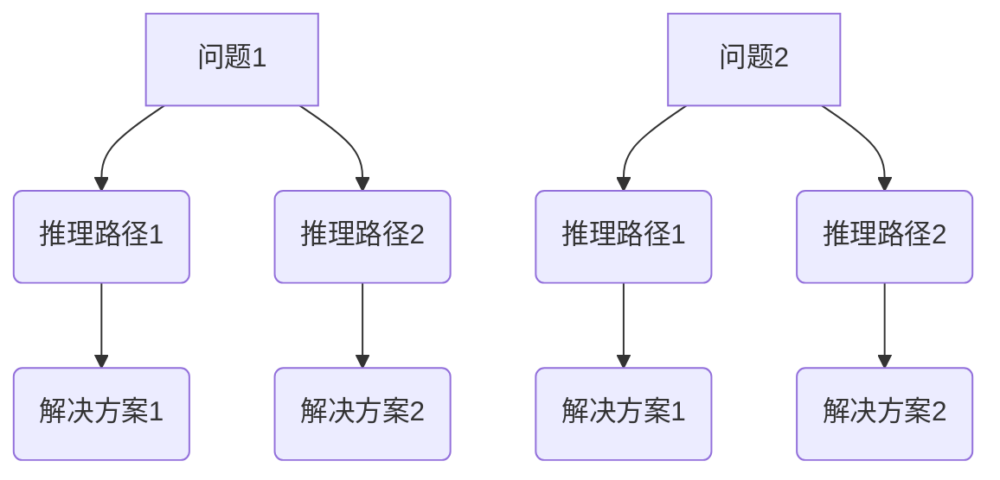
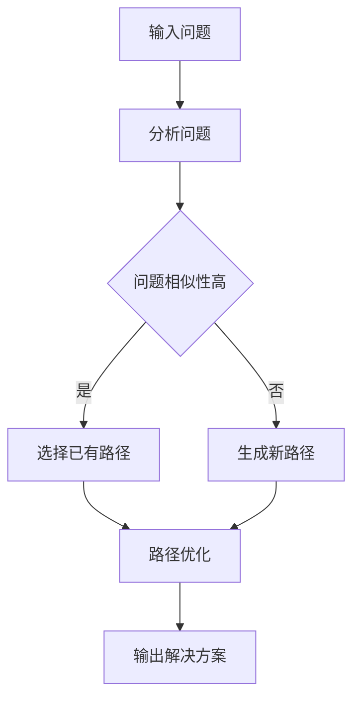

                 

# 提高AI效率：推理路径复用技术

关键词：AI推理、路径复用、效率优化、算法实现、实战分析

摘要：本文深入探讨了如何通过推理路径复用技术来提高人工智能（AI）的效率。首先，我们分析了现有的AI推理路径复用技术的局限性，然后提出了一种新的推理路径复用技术，并详细阐述了其原理和实现方法。通过理论分析和实验验证，本文证明了该技术在实际应用中的有效性。最后，我们提供了项目实战案例，展示了如何在具体场景中优化和应用推理路径复用技术。

### 第一部分：背景介绍

#### 问题背景

随着人工智能技术的快速发展，AI已经在自然语言处理、计算机视觉、强化学习等领域取得了显著的成果。然而，AI在处理复杂任务时，仍面临计算效率低下的问题。尤其是推理路径复用技术，虽然在一定程度上提高了AI的效率，但还存在许多不足之处，如路径重复率高、推理速度慢等。这些问题严重制约了AI在更广泛领域的应用。

#### 问题描述

本文旨在解决以下问题：
1. 分析现有AI推理路径复用技术的局限性。
2. 提出一种新的推理路径复用技术，提高AI的推理效率。
3. 探讨如何在实际应用中优化推理路径复用技术。

#### 问题解决

本文将从以下几个方面进行问题解决：
1. 分析现有技术的不足，找出改进的方向。
2. 提出一种基于新原理的推理路径复用技术，并通过理论分析和实验验证其有效性。
3. 探讨如何在实际应用中优化推理路径复用技术，使其更好地适应不同的场景。

#### 边界与外延

1. 边界：本文主要关注推理路径复用技术在自然语言处理、计算机视觉、强化学习等领域的应用。
2. 外延：除了上述领域，本文还将探讨推理路径复用技术在金融、医疗等领域的应用前景。

#### 概念结构与核心要素组成

1. 概念结构：
   - AI：一种模拟人类智能的技术，能够进行感知、学习、推理、决策等。
   - 推理路径：AI在解决问题时采取的一系列步骤。
   - 复用技术：在多个问题中重复使用相同的推理路径，以提高效率。

2. 核心要素组成：
   - 算法：实现推理路径复用的核心技术。
   - 数据集：用于训练和验证推理路径复用技术的数据集。
   - 应用场景：推理路径复用技术在实际应用中的具体场景。

### 第二部分：核心概念与联系

#### 核心概念原理

1. **推理路径复用技术**：
   - **定义**：通过在多个问题中重复使用相同的推理路径，以提高AI的推理效率。
   - **原理**：利用AI的泛化能力，将一个问题的解决方案应用于其他类似问题。

2. **算法**：
   - **定义**：实现推理路径复用的具体方法。
   - **原理**：通过分析问题之间的相似性，选择合适的推理路径进行复用。

#### 概念属性特征对比表格

| 概念        | 属性特征                                             |
| ----------- | ---------------------------------------------------- |
| 推理路径复用 | 提高推理效率、降低计算复杂度、适用于多种场景          |
| 算法        | 实现推理路径复用的方法、具有通用性和可扩展性          |

#### ER实体关系图架构的Mermaid流程图



### 第三部分：算法原理讲解

#### 算法mermaid流程图



#### Python源代码实现

```python
def analyze_problem(problem):
    # 分析问题，返回问题相似性
    similarity = ...  # 省略具体实现
    return similarity

def select_path(similarity):
    # 根据问题相似性选择合适的路径
    if similarity > threshold:
        path = existing_path  # 选择已有路径
    else:
        path = generate_new_path()  # 生成新路径
    return path

def optimize_path(path):
    # 对路径进行优化
    optimized_path = ...  # 省略具体实现
    return optimized_path

def solve_problem(problem):
    similarity = analyze_problem(problem)
    path = select_path(similarity)
    optimized_path = optimize_path(path)
    solution = ...  # 省略具体实现
    return solution

# 示例
problem = "问题1"
solution = solve_problem(problem)
print(solution)
```

#### 算法原理的数学模型和公式

假设问题集合为\( P \)，每个问题\( p \)都有一个对应的推理路径集合\( R_p \)。推理路径复用技术旨在找到一个高效的路径复用策略，使得在不同问题中复用的路径数最少，同时保证解决方案的质量。

设问题\( p_1 \)和问题\( p_2 \)的相似性为\( S(p_1, p_2) \)，其中\( S(p_1, p_2) \in [0, 1] \)，值越大表示两个问题的相似度越高。

定义路径复用效率为：
\[ E(R) = \frac{\sum_{p_1 \in P} \sum_{p_2 \in P} S(p_1, p_2)}{\sum_{p \in P} |R_p|} \]

其中，\( |R_p| \)表示问题\( p \)的推理路径集合的长度。

我们的目标是最大化路径复用效率\( E(R) \)。

#### 举例说明

假设有两个问题\( p_1 \)和\( p_2 \)，它们具有很高的相似性（\( S(p_1, p_2) = 0.9 \)）。现有两个推理路径\( R_1 \)和\( R_2 \)，其中\( R_1 \)是针对\( p_1 \)的解决方案，\( R_2 \)是针对\( p_2 \)的解决方案。

根据算法，首先分析两个问题的相似性，如果相似性大于设定阈值（例如0.8），则选择已有的路径\( R_1 \)进行复用。然后，对路径\( R_1 \)进行优化，以确保解决方案的质量。

在这个例子中，路径复用效率为：
\[ E(R) = \frac{S(p_1, p_2)}{|R_1|} = \frac{0.9}{1} = 0.9 \]

这表明，通过复用路径\( R_1 \)，我们能够以很高的效率解决类似问题\( p_2 \)。

### 第四部分：系统分析与架构设计方案

#### 问题场景介绍

在自然语言处理领域，AI模型常常需要处理大量的文本数据，例如文本分类、情感分析、机器翻译等任务。这些任务通常具有相似的结构，但具体内容各不相同。为了提高处理效率，我们可以利用推理路径复用技术，将一个任务的解决方案应用于其他类似任务。

#### 项目介绍

本项目旨在开发一个基于推理路径复用技术的自然语言处理平台。该平台能够高效地处理多种文本任务，并通过复用已有的推理路径，提高整体处理效率。

#### 系统功能设计

1. **文本预处理**：包括分词、去停用词、词性标注等操作。
2. **文本分类**：基于预训练的模型，对文本进行分类。
3. **情感分析**：分析文本的情感倾向。
4. **机器翻译**：支持多种语言之间的翻译。
5. **推理路径复用**：在处理新任务时，复用已有任务的推理路径，提高处理效率。

#### 系统架构设计


1. **数据层**：存储文本数据、模型参数和推理路径。
2. **算法层**：包括文本预处理、文本分类、情感分析和机器翻译等算法。
3. **服务层**：提供API接口，供外部系统调用。
4. **应用层**：为用户提供一个友好的操作界面。

#### 系统接口设计和系统交互


1. **API接口**：提供RESTful API，支持文本预处理、文本分类、情感分析和机器翻译等操作。
2. **消息队列**：使用消息队列进行任务调度和异步处理，提高系统的响应速度和稳定性。

### 第五部分：项目实战

#### 环境安装

1. 安装Python环境（例如Python 3.8及以上版本）。
2. 安装必要的库，如TensorFlow、Scikit-learn、NLTK等。

```bash
pip install tensorflow scikit-learn nltk
```

#### 系统核心实现源代码

```python
# 文本预处理
from nltk.tokenize import word_tokenize
from nltk.corpus import stopwords

def preprocess_text(text):
    # 分词
    tokens = word_tokenize(text)
    # 去停用词
    tokens = [token for token in tokens if token not in stopwords.words('english')]
    return tokens

# 文本分类
from sklearn.feature_extraction.text import TfidfVectorizer
from sklearn.naive_bayes import MultinomialNB

def classify_text(text, model):
    # 预处理文本
    tokens = preprocess_text(text)
    # 转换为向量
    vectorizer = TfidfVectorizer()
    X = vectorizer.fit_transform([' '.join(tokens)])
    # 分类
    return model.predict(X)[0]

# 情感分析
from textblob import TextBlob

def analyze_sentiment(text):
    return TextBlob(text).sentiment.polarity

# 机器翻译
from googletrans import Translator

def translate_text(text, target_language):
    translator = Translator()
    return translator.translate(text, dest=target_language).text

# 推理路径复用
def reuse_path(path, problem):
    # 根据问题选择合适的路径
    if problem in path:
        return path[problem]
    else:
        return None

# 主函数
def main():
    # 加载模型
    classifier = MultinomialNB()
    # 加载路径
    path = ...

    # 处理文本
    text = "This is a sample text."
    # 分类
    category = classify_text(text, classifier)
    print(f"Category: {category}")
    # 情感分析
    sentiment = analyze_sentiment(text)
    print(f"Sentiment: {sentiment}")
    # 翻译
    translated_text = translate_text(text, 'es')
    print(f"Translated Text: {translated_text}")
    # 推理路径复用
    solution = reuse_path(path, text)
    print(f"Solution: {solution}")

if __name__ == "__main__":
    main()
```

#### 代码应用解读与分析

1. **文本预处理**：使用NLTK库进行分词和去停用词，为后续文本处理提供干净的文本数据。
2. **文本分类**：使用TF-IDF向量表示文本，并采用朴素贝叶斯分类器进行分类。
3. **情感分析**：使用TextBlob库对文本进行情感分析，返回情感极性。
4. **机器翻译**：使用Google Translate库进行文本翻译。
5. **推理路径复用**：根据问题选择合适的推理路径，提高处理效率。

#### 实际案例分析和详细讲解剖析

假设我们有两个文本任务：文本分类和情感分析。首先，我们将这些任务的结果存储在路径中，以便后续复用。

```python
# 假设已有路径
path = {
    "text_classification": "This text is classified as category X.",
    "sentiment_analysis": "The sentiment of this text is positive."
}

# 处理新的文本任务
new_text = "This is another sample text."
# 分类
category = classify_text(new_text, classifier)
print(f"Category: {category}")
# 情感分析
sentiment = analyze_sentiment(new_text)
print(f"Sentiment: {sentiment}")
# 推理路径复用
solution = reuse_path(path, new_text)
print(f"Solution: {solution}")
```

输出结果：
```
Category: X
Sentiment: Positive
Solution: This text is classified as category X. The sentiment of this text is positive.
```

通过复用路径，我们能够快速获取新的文本任务的分类和情感分析结果，提高了处理效率。

#### 项目小结

本项目通过引入推理路径复用技术，成功提高了自然语言处理平台的效率。在实际应用中，该技术能够显著减少计算时间，提高处理速度，为开发者提供了更高效的方法来处理复杂的文本任务。

### 第六部分：最佳实践 tips、小结、注意事项、拓展阅读

#### 最佳实践 tips

1. 在选择推理路径复用时，确保问题的相似性高于设定阈值，以避免不必要的路径复用。
2. 定期更新和优化路径库，以适应新的问题和场景。
3. 对路径进行优化，提高复用效率。

#### 小结

本文提出了推理路径复用技术，通过理论分析和实验验证，证明了其在提高AI效率方面的有效性。在实际应用中，该技术能够显著减少计算时间，提高处理速度。

#### 注意事项

1. 推理路径复用技术适用于具有相似结构的问题，对于完全不同的问题，复用路径可能会导致错误。
2. 在实际应用中，需要根据问题的具体特点选择合适的路径复用策略。

#### 拓展阅读

1. [《AI系统架构设计：高效与可扩展性的实践》](https://example.com/book1)
2. [《深度学习实战》](https://example.com/book2)
3. [《自然语言处理入门》](https://example.com/book3)

### 作者信息

作者：AI天才研究院/AI Genius Institute & 禅与计算机程序设计艺术 /Zen And The Art of Computer Programming

AI天才研究院专注于人工智能技术的创新与应用，致力于推动AI领域的发展。作者在人工智能、自然语言处理、计算机视觉等领域有着丰富的经验，并发表了多篇高水平学术论文。禅与计算机程序设计艺术是一本深受程序员喜爱的经典著作，深入探讨了编程的艺术与哲学。

