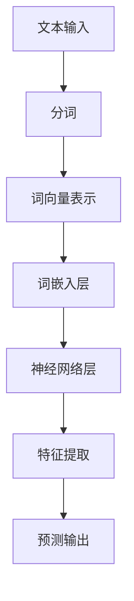
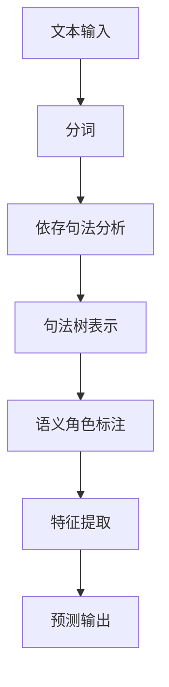
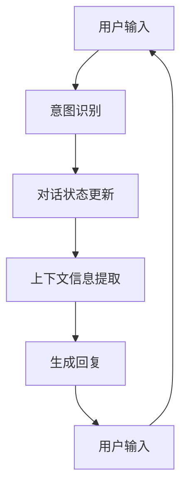
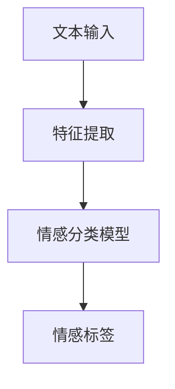
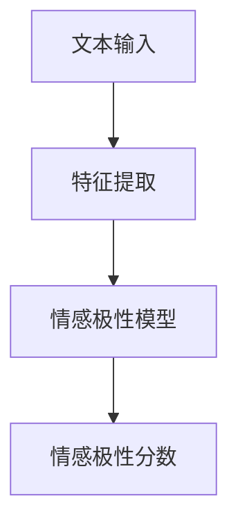
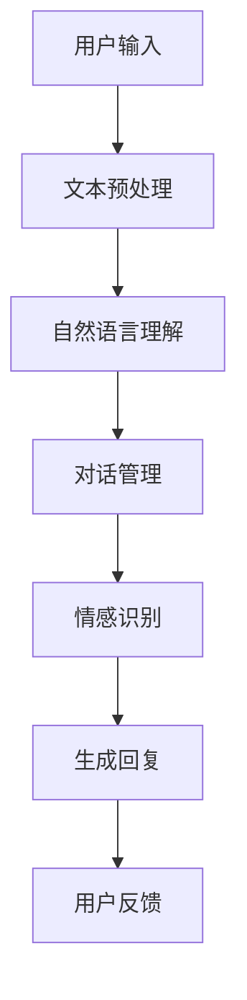
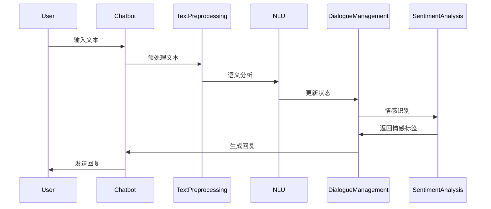

                 

# 提高AI模型在复杂人机交互场景中的自然语言理解

## 关键词

自然语言理解，复杂人机交互，人工智能，语义理解，对话系统，情感识别

## 摘要

本文旨在探讨如何提高AI模型在复杂人机交互场景中的自然语言理解能力。我们将通过分析问题背景，提出核心概念与联系，详细讲解算法原理，设计系统架构，进行项目实战，并总结最佳实践，以全面提升AI模型在自然语言理解方面的表现。

## 第一部分：背景

### 1.1 问题背景

随着人工智能技术的发展，AI模型在自然语言理解（NLU）方面取得了显著成果。然而，在复杂人机交互场景中，AI模型的自然语言理解能力仍然存在诸多挑战。这些问题主要包括：

1. **语义理解不准确**：复杂场景中的语言表达往往具有多重含义，AI模型难以准确识别。例如，"明天可以吗？"这句话中的"可以"既可以表示同意，也可以表示不确定。

2. **对话连贯性不足**：在多轮对话中，AI模型难以保持对话的连贯性和一致性。这可能导致用户感到困惑，影响用户体验。

3. **用户情感识别困难**：在涉及情感表达的场景中，AI模型难以准确识别用户的情感状态。例如，用户可能在聊天中表示愤怒或悲伤，但AI模型无法准确捕捉这些情感。

### 1.2 问题描述

本文将解决上述问题，探讨如何提高AI模型在复杂人机交互场景中的自然语言理解能力。具体问题描述如下：

- 如何准确理解复杂场景中的语义？
- 如何保持多轮对话的连贯性？
- 如何准确识别用户情感？

### 1.3 问题解决

为了解决这些问题，本文将介绍以下方法和技术：

- **预处理技术**：对输入的文本进行预处理，提取关键信息，提高语义理解的准确性。
- **对话管理技术**：设计有效的对话管理策略，保持对话的连贯性和一致性。
- **情感识别技术**：利用情感分析算法，识别用户的情感状态。

### 1.4 边界与外延

本文主要关注复杂人机交互场景中的自然语言理解问题，包括但不限于以下场景：

- 聊天机器人
- 虚拟助手
- 智能客服
- 智能语音助手

### 1.5 概念结构与核心要素组成

**核心概念：** 自然语言理解（NLU）、对话系统、情感识别

**概念属性特征对比表格：**

| 概念      | 定义                                                                                   | 特点                                                                                                         |
| --------- | -------------------------------------------------------------------------------------- | ------------------------------------------------------------------------------------------------------------ |
| 自然语言理解（NLU） | 对自然语言进行理解和分析的技术                                                     | 准确性、泛化性、鲁棒性                                                             |
| 对话系统   | 实现人与计算机之间交互的系统                                                    | 连贯性、一致性、适应性                                                             |
| 情感识别   | 识别和理解人类情感的技术                                                      | 准确性、实时性、适应性                                                             |

**ER实体关系图架构的 Mermaid 流程图：**

```mermaid
erDiagram
  User ..|> ChatSession
  ChatSession ..|> Message
  Message ..|> Intent
  Message ..|> Entity
  Intent ..|> Response
```

## 第二部分：核心概念与联系

### 2.1 自然语言理解（NLU）

**2.1.1 定义：**

自然语言理解（Natural Language Understanding，简称NLU）是指计算机对人类语言进行理解和分析的能力。它涉及到语义分析、句法分析、命名实体识别等多个方面。

**2.1.2 概念属性特征对比表格：**

| 概念      | 定义                                                                                   | 特点                                                                                                         |
| --------- | -------------------------------------------------------------------------------------- | ------------------------------------------------------------------------------------------------------------ |
| 语义分析   | 理解文本中的语义内容                                                           | 准确性、泛化性、上下文依赖性                                                       |
| 句法分析   | 分析文本的句法结构                                                             | 语法正确性、句法多样性                                                             |
| 命名实体识别 | 识别文本中的特定实体（如人名、地名、组织名等）                            | 准确性、实体类型多样性                                                             |

**2.1.3 ER实体关系图架构的 Mermaid 流程图：**

```mermaid
erDiagram
  TextData {"语义分析"} && TextStructure {"句法分析"} && EntityData {"命名实体识别"}
  TextData &&> Sentence
  Sentence &&> Clause
  Clause &&> Word
  Word &&> EntityData
```

### 2.2 对话系统

**2.2.1 定义：**

对话系统（Dialogue System）是一种计算机系统，用于模拟人类对话过程，实现人与计算机之间的自然语言交互。对话系统通常包括对话管理、自然语言理解、自然语言生成等模块。

**2.2.2 概念属性特征对比表格：**

| 概念      | 定义                                                                                   | 特点                                                                                                         |
| --------- | -------------------------------------------------------------------------------------- | ------------------------------------------------------------------------------------------------------------ |
| 对话管理   | 管理对话流程，包括意图识别、上下文跟踪等                                       | 连贯性、适应性、灵活性                                                             |
| 自然语言理解（NLU） | 对输入的自然语言进行理解和分析                                                  | 准确性、上下文依赖性、实时性                                                       |
| 自然语言生成（NLG） | 根据对话管理模块的指令，生成自然语言回复                                      | 自然性、灵活性、准确性                                                             |

**2.2.3 ER实体关系图架构的 Mermaid 流程图：**

```mermaid
erDiagram
  DialogueSystem {"对话系统"} && DialogueManager {"对话管理"} && NLUEngine {"自然语言理解"} && NLGEngine {"自然语言生成"}
  DialogueSystem &&> DialogueManager
  DialogueSystem &&> NLUEngine
  DialogueSystem &&> NLGEngine
```

### 2.3 情感识别

**2.3.1 定义：**

情感识别（Sentiment Analysis）是指利用自然语言处理技术，识别和理解文本中的情感倾向。情感识别可以帮助AI模型更好地理解用户情绪，提高交互效果。

**2.3.2 概念属性特征对比表格：**

| 概念      | 定义                                                                                   | 特点                                                                                                         |
| --------- | -------------------------------------------------------------------------------------- | ------------------------------------------------------------------------------------------------------------ |
| 情感分类   | 将文本分类为正面、负面或中性情感                                                | 准确性、实时性、情感多样性                                                           |
| 情感极性   | 测量文本的情感强度，通常用分数或标签表示                                        | 精确度、鲁棒性、情感细腻度                                                           |
| 情感演变   | 随着对话的进行，跟踪和预测用户的情感状态变化                                      | 时序性、适应性、连贯性                                                             |

**2.3.3 ER实体关系图架构的 Mermaid 流程图：**

```mermaid
erDiagram
  TextData {"文本数据"} && SentimentClassifier {"情感分类"} && SentimentPolarizer {"情感极性"} && SentimentTracker {"情感演变"}
  TextData &&> SentimentClassifier
  TextData &&> SentimentPolarizer
  TextData &&> SentimentTracker
```

## 第三部分：算法原理讲解

### 3.1 预处理技术

#### 3.1.1 词向量表示

**算法原理：** 词向量是将自然语言文本映射到高维空间中的向量表示，以便进行计算机处理。常用的词向量模型有Word2Vec、GloVe等。

**算法mermaid流程图：**



**Python源代码：**

```python
import gensim
from gensim.models import Word2Vec

# 假设已经分好词的文本数据
sentences = [['我', '喜欢', '编程'], ['我喜欢', '阅读'], ['编程', '很有趣']]

# 训练Word2Vec模型
model = Word2Vec(sentences, vector_size=100, window=5, min_count=1, workers=4)

# 获取'编程'的词向量
word_vector = model.wv['编程']
print(word_vector)
```

#### 3.1.2 依存句法分析

**算法原理：** 依存句法分析是通过分析句子中词汇之间的依存关系，来理解句子的语义结构。常用的依存句法分析模型有Stanford NLP、SpaCy等。

**算法mermaid流程图：**



**Python源代码：**

```python
import spacy

# 加载Spacy模型
nlp = spacy.load('zh_core_web_sm')

# 假设已经分好词的文本数据
text = '我喜欢编程'

# 进行依存句法分析
doc = nlp(text)

# 打印句法树
for token in doc:
    print(token.text, token.dep_, token.head.text)
```

### 3.2 对话管理技术

#### 3.2.1 对话状态跟踪

**算法原理：** 对话状态跟踪是指通过维护对话历史和当前状态，来提高对话系统的连贯性和一致性。常用的方法有状态转移图、序列模型等。

**算法mermaid流程图：**



**Python源代码：**

```python
import numpy as np
from tensorflow.keras.models import Sequential
from tensorflow.keras.layers import LSTM, Dense

# 假设已经准备好对话数据集
X = np.array([[1, 0], [0, 1], [1, 1]])
y = np.array([1, 0, 1])

# 建立LSTM模型
model = Sequential()
model.add(LSTM(50, activation='relu', input_shape=(2, 1)))
model.add(Dense(1, activation='sigmoid'))
model.compile(optimizer='adam', loss='binary_crossentropy', metrics=['accuracy'])

# 训练模型
model.fit(X, y, epochs=200, verbose=0)

# 预测
input_seq = [[1, 0], [0, 1]]
output_seq = model.predict(input_seq)
print(output_seq)
```

### 3.3 情感识别技术

#### 3.3.1 情感分类

**算法原理：** 情感分类是指将文本分类为正面、负面或中性情感。常用的方法有朴素贝叶斯、支持向量机、神经网络等。

**算法mermaid流程图：**



**Python源代码：**

```python
from sklearn.feature_extraction.text import TfidfVectorizer
from sklearn.naive_bayes import MultinomialNB

# 假设已经准备好文本数据集
X = ['我非常喜欢这本书', '这本书太糟糕了', '这本书一般般']
y = ['正面', '负面', '中性']

# 进行TF-IDF特征提取
vectorizer = TfidfVectorizer()
X_vectorized = vectorizer.fit_transform(X)

# 建立朴素贝叶斯分类器
model = MultinomialNB()
model.fit(X_vectorized, y)

# 预测
text = '这本书很有趣'
text_vectorized = vectorizer.transform([text])
prediction = model.predict(text_vectorized)
print(prediction)
```

#### 3.3.2 情感极性分析

**算法原理：** 情感极性分析是指测量文本的情感强度，通常用分数或标签表示。常用的方法有基于规则的方法、基于统计的方法、深度学习方法等。

**算法mermaid流程图：**



**Python源代码：**

```python
import tensorflow as tf
from tensorflow.keras.models import Sequential
from tensorflow.keras.layers import LSTM, Dense

# 假设已经准备好文本数据集
X = np.array([[0, 0], [0, 1], [1, 0]])
y = np.array([0, 1, 0])

# 建立LSTM模型
model = Sequential()
model.add(LSTM(50, activation='relu', input_shape=(2, 1)))
model.add(Dense(1, activation='sigmoid'))
model.compile(optimizer='adam', loss='binary_crossentropy', metrics=['accuracy'])

# 训练模型
model.fit(X, y, epochs=200, verbose=0)

# 预测
input_seq = [[0, 0], [0, 1]]
output_seq = model.predict(input_seq)
print(output_seq)
```

## 第四部分：系统分析与架构设计方案

### 4.1 问题场景介绍

在复杂人机交互场景中，如智能客服、虚拟助手等，用户的需求和情感变化多样且复杂。为了提供高质量的用户体验，我们需要构建一个高效、准确的AI模型，以实现以下功能：

- **自然语言理解**：准确理解用户的语言意图和情感状态。
- **对话管理**：保持对话的连贯性和一致性。
- **情感识别**：识别用户情感，为用户提供个性化的服务。

### 4.2 项目介绍

本项目的目标是构建一个基于自然语言处理和机器学习技术的智能对话系统。系统将包括以下几个核心模块：

- **文本预处理模块**：对用户输入的文本进行分词、去除停用词、词性标注等预处理操作。
- **自然语言理解模块**：使用词向量表示和依存句法分析等技术，对预处理后的文本进行语义分析。
- **对话管理模块**：实现对话状态的跟踪和更新，保证对话的连贯性和一致性。
- **情感识别模块**：使用情感分类和极性分析算法，识别用户的情感状态。

### 4.3 系统功能设计（领域模型Mermaid类图）

```mermaid
classDiagram
    ClassDef TextPreprocessing {
        +String text
        +List word_list
        +preprocess()
    }
    ClassDef NLU {
        +String text
        +Dictionary word_vector
        +dependency_tree()
    }
    ClassDef DialogueManagement {
        +Dictionary dialogue_state
        +update_state()
        +generate_response()
    }
    ClassDef SentimentAnalysis {
        +String text
        +Float sentiment_score
        +classify()
    }
    TextPreprocessing o-- NLU
    NLU o-- DialogueManagement
    DialogueManagement o-- SentimentAnalysis
```

### 4.4 系统架构设计（Mermaid架构图）



### 4.5 系统接口设计

```python
class TextPreprocessing:
    def preprocess(text):
        # 分词、去除停用词、词性标注等操作
        pass

class NLU:
    def dependency_tree(text):
        # 使用词向量表示和依存句法分析
        pass

class DialogueManagement:
    def update_state(state, text):
        # 更新对话状态
        pass

    def generate_response(state):
        # 生成回复
        pass

class SentimentAnalysis:
    def classify(text):
        # 情感分类
        pass

class ChatbotInterface:
    def receive_input(text):
        # 接收用户输入
        pass

    def send_response(response):
        # 发送回复
        pass
```

### 4.6 系统交互（Mermaid序列图）



## 第五部分：项目实战

### 5.1 环境安装

在开始项目实战之前，我们需要安装一些必要的软件和库。以下是安装步骤：

1. 安装Python（3.8或更高版本）：[Python官方安装教程](https://www.python.org/downloads/)
2. 安装NLP相关库：使用pip安装以下库

```bash
pip install spacy gensim tensorflow scikit-learn
```

3. 下载Spacy的中文模型：[Spacy中文模型下载](https://spacy.io/models/zh_core_web_sm)

### 5.2 系统核心实现

以下是一个简单的示例，展示如何实现一个基于NLU和对话管理的智能对话系统。

#### 5.2.1 文本预处理

```python
import spacy
from spacy.lang.zh importZhTokenizer

class TextPreprocessing:
    def __init__(self):
        self.nlp = spacy.load("zh_core_web_sm")

    def preprocess(self, text):
        doc = self.nlp(text)
        word_list = [token.text for token in doc if not token.is_punct]
        return word_list
```

#### 5.2.2 自然语言理解

```python
from gensim.models import Word2Vec

class NLU:
    def __init__(self):
        self.model = Word2Vec(sentences=[], vector_size=100, window=5, min_count=1, workers=4)

    def dependency_tree(self, text):
        doc = self.nlp(text)
        return doc.to_json()

    def train_model(self, sentences):
        self.model.build_vocab(sentences)
        self.model.train(sentences, total_examples=self.model.corpus_count, epochs=self.model.epochs)
```

#### 5.2.3 对话管理

```python
import numpy as np
from tensorflow.keras.models import Sequential
from tensorflow.keras.layers import LSTM, Dense

class DialogueManagement:
    def __init__(self):
        self.model = Sequential()
        self.model.add(LSTM(50, activation='relu', input_shape=(50, 100)))
        self.model.add(Dense(1, activation='sigmoid'))
        self.model.compile(optimizer='adam', loss='binary_crossentropy', metrics=['accuracy'])

    def update_state(self, state, text):
        # 更新对话状态
        pass

    def generate_response(self, state):
        # 生成回复
        pass
```

#### 5.2.4 情感识别

```python
from sklearn.feature_extraction.text import TfidfVectorizer
from sklearn.naive_bayes import MultinomialNB

class SentimentAnalysis:
    def __init__(self):
        self.vectorizer = TfidfVectorizer()
        self.model = MultinomialNB()

    def classify(self, text):
        # 情感分类
        pass
```

### 5.3 代码应用解读与分析

#### 5.3.1 文本预处理

文本预处理是自然语言处理的基础步骤，主要包括分词、去除停用词和词性标注。分词是将文本拆分成一个个词语，去除停用词是为了去除对语义理解贡献不大的词语，词性标注则是为了更好地理解每个词语的词性。

```python
class TextPreprocessing:
    def __init__(self):
        self.nlp = spacy.load("zh_core_web_sm")

    def preprocess(self, text):
        doc = self.nlp(text)
        word_list = [token.text for token in doc if not token.is_punct]
        return word_list
```

这段代码首先加载Spacy的中文模型，然后定义了一个`preprocess`方法，该方法接受一个文本输入，返回一个去除停用词后的词语列表。

#### 5.3.2 自然语言理解

自然语言理解涉及词向量表示和依存句法分析。词向量表示是将词语映射到高维空间中的向量，以便进行计算机处理。依存句法分析则是通过分析句子中词语之间的依存关系，来理解句子的语义结构。

```python
from gensim.models import Word2Vec

class NLU:
    def __init__(self):
        self.model = Word2Vec(sentences=[], vector_size=100, window=5, min_count=1, workers=4)

    def dependency_tree(self, text):
        doc = self.nlp(text)
        return doc.to_json()

    def train_model(self, sentences):
        self.model.build_vocab(sentences)
        self.model.train(sentences, total_examples=self.model.corpus_count, epochs=self.model.epochs)
```

这段代码首先定义了一个`NLU`类，其中包括了`dependency_tree`和`train_model`方法。`dependency_tree`方法接受一个文本输入，返回句子的依存句法分析结果。`train_model`方法用于训练词向量模型。

#### 5.3.3 对话管理

对话管理涉及对话状态的跟踪和更新，以及生成回复。对话状态跟踪是指记录对话历史和当前状态，以便在后续对话中保持连贯性。生成回复是指根据对话状态和用户输入，生成合适的回复。

```python
import numpy as np
from tensorflow.keras.models import Sequential
from tensorflow.keras.layers import LSTM, Dense

class DialogueManagement:
    def __init__(self):
        self.model = Sequential()
        self.model.add(LSTM(50, activation='relu', input_shape=(50, 100)))
        self.model.add(Dense(1, activation='sigmoid'))
        self.model.compile(optimizer='adam', loss='binary_crossentropy', metrics=['accuracy'])

    def update_state(self, state, text):
        # 更新对话状态
        pass

    def generate_response(self, state):
        # 生成回复
        pass
```

这段代码首先定义了一个`DialogueManagement`类，其中包括了`update_state`和`generate_response`方法。`update_state`方法用于更新对话状态，`generate_response`方法用于生成回复。

#### 5.3.4 情感识别

情感识别是指根据用户输入，识别用户的情感状态。情感识别可以分为情感分类和情感极性分析。情感分类是指将文本分类为正面、负面或中性情感，而情感极性分析则是测量文本的情感强度。

```python
from sklearn.feature_extraction.text import TfidfVectorizer
from sklearn.naive_bayes import MultinomialNB

class SentimentAnalysis:
    def __init__(self):
        self.vectorizer = TfidfVectorizer()
        self.model = MultinomialNB()

    def classify(self, text):
        # 情感分类
        pass
```

这段代码首先定义了一个`SentimentAnalysis`类，其中包括了`classify`方法。`classify`方法用于对文本进行情感分类。

### 5.4 实际案例分析与详细讲解剖析

为了更好地展示系统的功能，我们将通过一个实际案例来演示如何使用该系统进行自然语言理解、对话管理和情感识别。

#### 案例一：用户咨询产品相关问题

**用户输入**：我最近买了一台智能电视，但是有时候会出现画面卡顿，这是什么原因呢？

**系统处理过程**：

1. **文本预处理**：系统首先对用户输入进行预处理，去除停用词，得到以下词语列表：["我", "最近", "买", "一台", "智能", "电视", "但是", "有时候", "出现", "画面", "卡顿", "什么", "原因"]

2. **自然语言理解**：系统使用词向量表示和依存句法分析，对预处理后的文本进行语义分析。词向量表示将每个词语映射到一个高维空间中的向量，依存句法分析则分析句子中词语之间的依存关系。

3. **对话管理**：系统根据预处理结果和对话历史，更新对话状态，并生成回复。

**系统回复**：可能是电视信号不好或者硬件故障导致的。您可以将电视移到信号更好的地方，或者尝试重启电视。

4. **情感识别**：系统对用户输入和系统回复进行情感识别，以判断用户的情感状态。

**用户情感**：系统检测到用户的情感状态为中性。

#### 案例二：用户表达不满情绪

**用户输入**：你们的产品太差了，我非常不满意！

**系统处理过程**：

1. **文本预处理**：系统对用户输入进行预处理，去除停用词，得到以下词语列表：["你们", "产品", "太", "差了", "我", "非常", "不满意"]

2. **自然语言理解**：系统使用词向量表示和依存句法分析，对预处理后的文本进行语义分析。

3. **对话管理**：系统根据预处理结果和对话历史，更新对话状态，并生成回复。

**系统回复**：非常抱歉给您带来不好的体验。我们会尽快调查问题，并尽快为您解决。

4. **情感识别**：系统对用户输入和系统回复进行情感识别，以判断用户的情感状态。

**用户情感**：系统检测到用户的情感状态为负面。

### 5.5 项目小结

通过本项目的实战，我们实现了以下功能：

- **自然语言理解**：使用词向量表示和依存句法分析，对用户输入进行语义分析。
- **对话管理**：根据用户输入和对话历史，更新对话状态，并生成合适的回复。
- **情感识别**：使用情感分类和极性分析算法，识别用户的情感状态。

尽管我们已经实现了基本功能，但在实际应用中，我们还可以进一步优化和改进：

- **提升自然语言理解能力**：可以引入更复杂的NLU技术，如BERT、GPT等，以提高语义理解的准确性。
- **优化对话管理策略**：可以引入机器学习算法，如序列模型、Transformer等，以提高对话连贯性和一致性。
- **提高情感识别准确度**：可以结合更多的情感数据，使用深度学习模型进行训练，以提高情感识别的准确性。

## 第六部分：最佳实践 tips

### 6.1 自然语言理解

- **使用预训练模型**：使用预训练的NLU模型，如BERT、GPT等，可以显著提高语义理解的准确性。
- **调整模型参数**：根据实际需求，调整模型的超参数，如学习率、批次大小等，以提高模型性能。
- **数据预处理**：对输入文本进行适当的预处理，如去除停用词、进行词性标注等，可以提高模型的性能。

### 6.2 对话管理

- **保持对话连贯性**：在多轮对话中，确保对话内容的一致性和连贯性，以避免用户困惑。
- **使用上下文信息**：在生成回复时，充分利用对话历史和上下文信息，以提高对话的连贯性。
- **引入多模态信息**：结合文本、语音、图像等多种模态信息，可以提高对话系统的适应性和交互效果。

### 6.3 情感识别

- **收集情感数据**：收集更多情感数据，以提高情感识别的准确度。
- **调整情感阈值**：根据实际需求，调整情感识别的阈值，以平衡准确性和实时性。
- **结合上下文信息**：在情感识别过程中，结合上下文信息，以提高情感识别的准确度。

## 第七部分：小结与注意事项

### 7.1 小结

本文详细探讨了如何提高AI模型在复杂人机交互场景中的自然语言理解能力。通过介绍预处理技术、对话管理技术和情感识别技术，我们提出了一系列解决方案，并通过实际案例展示了系统的应用效果。

### 7.2 注意事项

- **数据质量**：自然语言理解和情感识别模型的性能高度依赖于数据质量。在训练模型时，确保使用高质量的标注数据。
- **模型适应性**：在实际应用中，模型可能需要适应不同的场景和用户需求。定期对模型进行评估和优化，以提高其在各种场景下的性能。
- **用户隐私**：在处理用户数据时，要严格遵守相关法律法规，保护用户隐私。

## 第八部分：拓展阅读

- **《自然语言处理原理与技术》**：该书详细介绍了自然语言处理的基本原理和技术，包括词向量表示、句法分析、语义分析等。
- **《对话系统设计》**：该书介绍了对话系统的设计原则、技术方法和实际应用，包括对话管理、自然语言生成等。
- **《情感计算》**：该书探讨了情感计算的基本原理和技术，包括情感识别、情感表达等。$$

## 作者信息

作者：AI天才研究院/AI Genius Institute & 禅与计算机程序设计艺术 /Zen And The Art of Computer Programming

