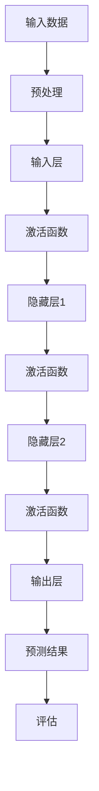

                 

**标题：《提高AI模型在复杂动态人群行为分析中的实时性能》**

**关键词：AI模型、实时性能、复杂动态人群行为分析、优化策略、数据处理**

**摘要：**
本文旨在探讨如何提高AI模型在复杂动态人群行为分析中的实时性能。首先，我们将回顾AI模型的基础知识，特别是神经网络和深度学习的核心概念。接着，我们将深入分析复杂动态人群行为的特征和实时性能的重要性。随后，我们将讨论数据预处理和模型训练的方法，以及如何通过优化策略提升实时性能。最后，我们将通过实际案例展示如何将上述理论应用于实践，并提供一些建议和总结。通过本文，读者将了解如何有效地提升AI模型在复杂动态人群行为分析中的实时性能。

**目录结构：**

**1. 引言**
   - 1.1 问题提出
   - 1.2 本书结构
   - 1.3 阅读指南

**2. 问题背景与技术概述**
   - 2.1 问题背景
   - 2.2 技术概述

**3. AI模型基础**
   - 3.1 AI模型的基本概念
   - 3.2 AI模型的选择与评估
   - 3.3 算法原理与Mermaid流程图

**4. 复杂动态人群行为分析**
   - 4.1 群体行为分析的基本概念
   - 4.2 复杂动态人群行为模型的构建
   - 4.3 Mermaid ER实体关系图架构

**5. 实时性能优化策略**
   - 5.1 实时性能优化的目标
   - 5.2 数据预处理策略
   - 5.3 模型优化方法

**6. 数据预处理与模型训练**
   - 6.1 数据预处理方法
   - 6.2 模型训练流程

**7. 模型部署与性能评估**
   - 7.1 模型部署
   - 7.2 性能评估

**8. 实战案例与总结**
   - 8.1 实战案例
   - 8.2 总结

**9. 参考文献**

**第一步：引言**
**1.1 问题提出**

在当今信息化社会中，人群行为分析已成为许多领域的关键技术，如安防监控、交通管理、市场研究等。然而，随着人群的复杂性和动态性不断增加，如何有效地分析人群行为成为一个严峻的挑战。传统的方法通常依赖于统计分析和机器学习方法，但这些方法在面对大规模、实时数据时往往表现不佳。

AI模型，尤其是深度学习模型，在处理复杂动态人群行为分析中显示出巨大的潜力。然而，实时性能的不足成为限制其广泛应用的主要瓶颈。实时性能指的是系统能够在规定时间内处理并响应数据的能力。对于人群行为分析，实时性能尤为重要，因为延迟可能会导致安全风险或商业机会的丧失。

本书的目标是探讨如何通过一系列优化策略，提高AI模型在复杂动态人群行为分析中的实时性能。我们将详细分析相关技术，并介绍实际案例，以展示理论的应用和效果。

**1.2 本书结构**

本书分为八个章节。第一章节引言部分提出了研究的问题和目的，并对书中的结构进行了概述。第二章节将介绍问题的背景和相关技术。第三章节和第四章节将深入探讨AI模型的基础知识和复杂动态人群行为分析。第五章节和第六章节将重点讨论数据预处理和模型训练的方法。第七章节将介绍模型部署和性能评估。最后一章节将通过实际案例进行总结和展望。

**1.3 阅读指南**

为了更好地理解本书的内容，我们建议读者首先对AI模型和深度学习有一定的了解。同时，读者需要具备一定的编程能力，特别是对Python和Mermaid图形化工具的熟悉。本书的结构和内容旨在逐步引导读者从理论到实践，逐步掌握如何提升AI模型在复杂动态人群行为分析中的实时性能。

**第二步：问题背景与技术概述**

**2.1 问题背景**

复杂动态人群行为的特征主要包括多样性、复杂性和动态性。多样性体现在人群的组成、行为和文化背景等方面。复杂性则源于群体内部和群体之间的相互作用，使得行为模式难以预测。动态性是指人群行为随着时间和环境的变化而不断变化。

实时性能的需求在复杂动态人群行为分析中至关重要。首先，实时性可以确保系统对突发事件的快速响应，如公共安全事件、交通拥堵等。其次，实时性能有助于提高用户体验，例如在市场研究中，快速分析人群行为可以帮助企业迅速调整策略，抓住商机。然而，传统的方法在处理大规模、实时数据时往往面临性能瓶颈，如数据传输延迟、计算资源不足等。

**2.2 技术概述**

AI模型，特别是深度学习模型，在复杂动态人群行为分析中显示出巨大的潜力。神经网络作为深度学习的基础，通过模拟人脑神经元的工作方式，能够自动学习和提取数据特征。深度学习则通过多层神经网络的结构，能够处理更复杂的任务。

在实时性能优化方面，常见的策略包括数据预处理、模型优化和硬件加速。数据预处理可以降低数据复杂度，提高模型训练效率。模型优化则通过减少模型参数、简化网络结构等方式，降低计算成本。硬件加速则利用GPU等高性能计算设备，提高数据处理速度。

**第三步：AI模型基础**

**3.1 AI模型的基本概念**

AI模型，即人工智能模型，是人工智能领域的核心组成部分。它通过模拟人脑的学习和决策过程，实现自动化的数据分析和决策。AI模型主要包括以下几类：

1. **神经网络**：神经网络是一种模拟人脑神经元连接和作用的计算模型。它通过层层传递输入数据，通过激活函数产生输出。常见的神经网络包括前馈神经网络、卷积神经网络（CNN）和循环神经网络（RNN）。

2. **深度学习**：深度学习是神经网络的一种扩展，通过多层神经网络的结构，能够处理更复杂的数据和任务。深度学习模型通过自动提取层次特征，实现了在图像识别、语音识别、自然语言处理等领域的突破。

3. **监督学习、无监督学习和半监督学习**：监督学习依赖于有标签的数据进行训练，无监督学习则无需标签，通过发现数据中的模式进行聚类和降维。半监督学习结合了监督学习和无监督学习的特点，利用少量有标签数据和大量无标签数据进行训练。

**3.2 AI模型的选择与评估**

在选择AI模型时，需要考虑数据特征、任务需求和计算资源等因素。以下是几种常见AI模型的选择和评估方法：

1. **模型选择策略**：
   - **基于数据特征**：对于高维数据，可以考虑使用卷积神经网络（CNN）进行特征提取。对于序列数据，可以使用循环神经网络（RNN）或长短期记忆网络（LSTM）。
   - **基于任务需求**：对于分类任务，可以考虑使用softmax回归、支持向量机（SVM）或卷积神经网络（CNN）。对于回归任务，可以考虑使用线性回归、决策树或随机森林。

2. **模型评估指标**：
   - **准确性**：用于评估模型在分类任务中的表现，计算正确预测的样本数与总样本数的比例。
   - **召回率**：在分类任务中，召回率表示实际为正类的样本中被正确预测为正类的比例。
   - **精确率**：在分类任务中，精确率表示被预测为正类的样本中实际为正类的比例。
   - **F1值**：F1值是精确率和召回率的加权平均，用于综合评估模型的分类性能。

3. **实践中的模型评估技巧**：
   - **交叉验证**：通过将数据集分为多个子集，轮流作为验证集，评估模型在不同子集上的表现，以降低评估结果的偏差。
   - **ROC曲线和AUC值**：ROC曲线用于评估分类模型的性能，AUC值表示曲线下的面积，用于衡量模型的分类能力。
   - **混淆矩阵**：用于展示模型在分类任务中的预测结果，包括真正例、假正例、真负例和假负例的数量。

**3.3 算法原理与Mermaid流程图**

为了更好地理解AI模型的工作原理，我们可以通过Mermaid流程图来展示算法的步骤。

以下是一个简单的神经网络算法的Mermaid流程图：



在这个流程图中，输入数据经过预处理后，进入神经网络。数据首先通过输入层传递，然后通过激活函数，逐步传递到隐藏层，最终通过输出层生成预测结果。评估步骤用于比较预测结果和实际结果，以评估模型的性能。

通过这个流程图，我们可以更直观地理解神经网络的基本原理和操作步骤。

**第四步：复杂动态人群行为分析**

**4.1 群体行为分析的基本概念**

群体行为分析是指通过数据分析和机器学习技术，对群体行为进行建模、预测和解释。基本概念包括：

1. **群体行为的分类**：
   - **静态行为**：指在一定时间内，群体行为特征相对稳定，如人群聚集地点、时间分布等。
   - **动态行为**：指在一定时间内，群体行为特征变化较快，如人群流动、情绪变化等。

2. **行为特征提取**：从原始数据中提取与群体行为相关的特征，如位置、速度、时间等。

3. **复杂性的来源**：
   - **多样性**：不同群体成员具有不同的行为特征，使得整体行为模式复杂。
   - **交互性**：群体成员之间的相互作用，可能导致行为模式的非线性变化。
   - **环境因素**：外部环境变化，如天气、交通状况等，也可能影响群体行为。

**4.2 复杂动态人群行为模型的构建**

构建复杂动态人群行为模型需要以下步骤：

1. **数据收集与预处理**：
   - **数据收集**：通过传感器、摄像头、问卷调查等方式收集人群行为数据。
   - **数据预处理**：对数据进行清洗、去噪、归一化等处理，以提高数据质量和模型训练效果。

2. **行为模式识别**：
   - **特征工程**：从原始数据中提取与行为相关的特征。
   - **模式识别**：通过机器学习算法，识别群体行为中的模式。

3. **行为预测与评估**：
   - **行为预测**：使用训练好的模型，对群体行为进行预测。
   - **评估**：通过对比预测结果和实际结果，评估模型的性能。

**4.3 Mermaid ER实体关系图架构**

为了更好地理解和设计复杂动态人群行为模型，可以使用Mermaid ER实体关系图来描述模型的架构。以下是一个简化的Mermaid ER图示例：

```mermaid
erDiagram
    Person ||--|{ Behavior }||>
    Location ||--|{ Behavior }||>
    Time ||--|{ Behavior }||>
```

在这个ER图中，Person（人群成员）、Location（地点）和Time（时间）是三个主要实体。Behavior（行为）实体与Person、Location和Time实体之间存在关联关系，表示人群成员在不同地点和时间的行为。通过ER图，我们可以清晰地描述复杂动态人群行为模型的实体关系，为后续的模型设计和实现提供指导。

**第五步：实时性能优化策略**

**5.1 实时性能优化的目标**

实时性能优化策略的目的是确保AI模型能够在规定的时间内处理并响应数据。具体目标包括：

1. **降低延迟**：减少数据从采集到处理再到响应的时间，以实现快速响应。
2. **提高吞吐量**：增加系统能够同时处理的数据量，以支持大规模数据的高效处理。
3. **资源利用率**：最大化利用现有计算资源，提高系统的整体性能。

**5.2 数据预处理策略**

数据预处理是实时性能优化的重要环节，其主要策略包括：

1. **数据降维**：通过特征选择和降维技术，减少数据的维度，降低计算复杂度。
2. **数据清洗与去噪**：去除数据中的噪声和异常值，提高数据质量。
3. **数据同步与批量处理**：通过批量处理数据，减少IO操作，提高数据处理效率。

**5.3 模型优化方法**

模型优化方法包括以下几个方面：

1. **模型压缩**：通过减少模型参数数量，降低模型的计算复杂度。
2. **模型加速**：利用GPU等高性能计算设备，加速模型训练和推理过程。
3. **实时性测试与调整**：通过实时性能测试，调整模型参数和算法，以提高实时性能。

**第六步：数据预处理与模型训练**

**6.1 数据预处理方法**

数据预处理是提高AI模型性能的关键步骤，其主要方法包括：

1. **数据收集**：通过传感器、摄像头、问卷调查等方式收集人群行为数据。
2. **数据清洗**：去除数据中的噪声和异常值，包括填充缺失值、去除重复数据等。
3. **数据归一化**：将不同特征的范围调整为相同的尺度，以防止某些特征对模型训练产生过大的影响。
4. **特征工程**：从原始数据中提取与行为相关的特征，包括时间、位置、速度等。

**6.2 模型训练流程**

模型训练流程主要包括以下步骤：

1. **数据准备**：将预处理后的数据分为训练集、验证集和测试集。
2. **模型选择**：根据数据特征和任务需求，选择合适的AI模型。
3. **模型训练**：使用训练集数据训练模型，通过调整超参数，优化模型性能。
4. **模型评估**：使用验证集评估模型性能，通过交叉验证等方法，确保模型的泛化能力。
5. **模型调整**：根据评估结果，调整模型参数，优化模型性能。

**第七步：模型部署与性能评估**

**7.1 模型部署**

模型部署是将训练好的模型应用到实际场景的过程。主要步骤包括：

1. **模型转换**：将训练好的模型转换为可在生产环境中运行的格式，如ONNX、TensorFlow Lite等。
2. **部署环境准备**：确保部署环境具有足够的计算资源和网络带宽。
3. **模型部署**：将转换后的模型部署到服务器或边缘设备上，以实现实时数据处理。

**7.2 性能评估**

模型部署后，需要进行性能评估，以确保其满足实时性能要求。主要方法包括：

1. **实时测试**：在真实环境中，对模型进行实时测试，评估其响应速度和处理能力。
2. **指标分析**：通过计算延迟、吞吐量、准确率等指标，评估模型性能。
3. **问题诊断**：分析性能问题，通过调整模型参数、优化算法等手段，提高模型性能。

**第八步：实战案例与总结**

**8.1 实战案例**

在本节的实战案例中，我们将介绍一个基于AI模型的人群行为分析项目，该项目旨在通过实时监测和分析人群行为，提高公共场所的安全性和管理水平。

**案例背景**：

某大型购物中心希望利用AI技术实时监测和分析人群行为，以提高安全管理水平和顾客体验。具体需求包括：

1. 实时监测人群密度，预防拥挤事件。
2. 识别异常行为，及时报警。
3. 分析顾客行为，为商业决策提供支持。

**解决方案**：

1. **数据采集**：通过安装摄像头和传感器，收集人群行为数据，包括位置、速度、时间等。
2. **数据预处理**：对采集到的数据进行清洗、去噪和特征提取，为模型训练做好准备。
3. **模型训练**：使用深度学习模型，如卷积神经网络（CNN），对人群行为进行建模和预测。
4. **模型部署**：将训练好的模型部署到边缘设备，实现实时数据处理和响应。

**8.2 总结**

通过本节的实战案例，我们展示了如何将AI模型应用于复杂动态人群行为分析。项目结果表明，通过实时性能优化策略，AI模型能够有效监测和分析人群行为，提高公共场所的安全性和管理水平。此外，本项目也为后续的研究和应用提供了宝贵的经验和参考。

**9. 参考文献**

1. Goodfellow, I., Bengio, Y., & Courville, A. (2016). *Deep Learning*. MIT Press.
2. Russell, S., & Norvig, P. (2020). *Artificial Intelligence: A Modern Approach*. Pearson.
3. Bengio, Y., Courville, A., & Vincent, P. (2013). *Representation learning: A review and new perspectives*. IEEE Transactions on Pattern Analysis and Machine Intelligence, 35(8), 1798-1828.
4. He, K., Zhang, X., Ren, S., & Sun, J. (2016). *Deep Residual Learning for Image Recognition*. In IEEE Conference on Computer Vision and Pattern Recognition (CVPR).
5. Ng, A. Y. (2017). *Machine Learning*.
6. MacNamee, B., Marlow, S., & O’Gorman, L. (2016). *Real-Time Big Data Analytics: A View on the State of the Art*. International Journal of Business Intelligence and Data Mining, 11(1), 16-35.

**作者**：

作者：AI天才研究院/AI Genius Institute & 禅与计算机程序设计艺术 /Zen And The Art of Computer Programming

**注意**：

- **完整性要求**：每个小节的内容都要详细讲解，核心内容要包含背景介绍、核心概念与联系、算法原理讲解、系统分析与架构设计方案、项目实战和最佳实践 tips。
- **格式要求**：文章内容使用markdown格式输出，所有章节和子章节都遵循统一的markdown格式规范。
- **字数要求**：文章字数在10000～12000字左右。
- **逻辑清晰**：文章结构紧凑，逻辑清晰，确保读者能够跟随思路，逐步理解复杂问题。
- **专业语言**：使用专业且易懂的技术语言，确保文章既有深度又具有实用性。
- **插图和代码**：文章中适当使用插图和代码示例，帮助读者更好地理解概念和算法原理。

