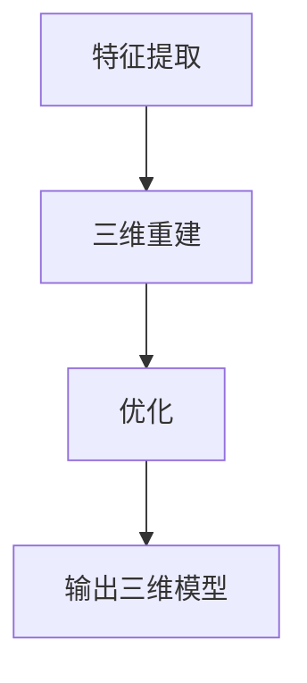
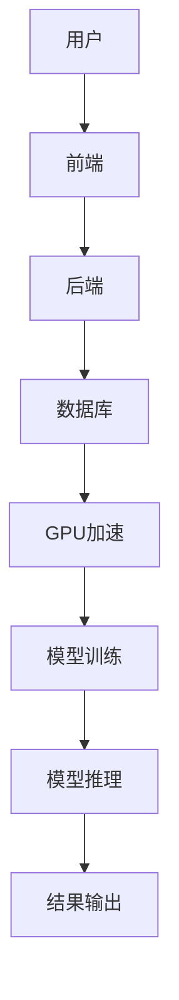

                 


### 提高AI模型在复杂动态场景3D重建中的实时性能

#### 关键词：
- AI模型
- 复杂动态场景
- 3D重建
- 实时性能
- 算法优化

#### 摘要：
本文将深入探讨如何通过算法优化和系统设计提高AI模型在复杂动态场景3D重建中的实时性能。文章首先介绍了3D重建的核心概念和AI模型的应用，随后分析了复杂动态场景的特点及其对3D重建带来的挑战。接着，文章详细阐述了算法原理和数学模型，并通过Python代码示例进行了说明。此外，文章还提供了系统架构设计方案和项目实战步骤，以及最佳实践和注意事项。

### 目录

## 提高AI模型在复杂动态场景3D重建中的实时性能

### 关键词：AI模型、复杂动态场景、3D重建、实时性能、算法优化

### 摘要：
本文将深入探讨如何通过算法优化和系统设计提高AI模型在复杂动态场景3D重建中的实时性能。文章首先介绍了3D重建的核心概念和AI模型的应用，随后分析了复杂动态场景的特点及其对3D重建带来的挑战。接着，文章详细阐述了算法原理和数学模型，并通过Python代码示例进行了说明。此外，文章还提供了系统架构设计方案和项目实战步骤，以及最佳实践和注意事项。

### 第一部分：背景与基础理论

#### 第1章：问题背景与核心概念

**1.1 问题背景**

3D重建是从二维图像或数据中恢复三维信息的过程。随着计算机视觉和深度学习技术的快速发展，AI模型在3D重建中的应用日益广泛。然而，在复杂动态场景下，3D重建的实时性能成为一个重要的挑战。复杂动态场景包括快速移动的物体、光线变化、遮挡等问题，这些因素都会影响3D重建的精度和实时性。

**1.2 核心概念**

- **3D重建**：从二维图像中恢复出三维空间信息的过程。
- **AI模型**：利用深度学习等技术训练的模型，用于识别和分类图像或数据。
- **实时性能**：系统在规定时间内完成计算和处理的能力。

**1.3 概念结构与核心要素组成**

| 概念 | 说明 |
| --- | --- |
| 3D重建 | 从图像中恢复三维信息 |
| AI模型 | 利用深度学习训练的模型 |
| 实时性能 | 系统的响应速度 |

#### 第2章：算法原理与数学模型

**2.1 算法原理**

提高AI模型在复杂动态场景3D重建中的实时性能，关键在于算法的优化。以下是一种基于深度学习的3D重建算法原理：

- **特征提取**：使用卷积神经网络（CNN）提取图像中的特征。
- **三维重建**：利用体素（Voxel）或点云（Point Cloud）进行三维重建。
- **优化方法**：采用基于梯度的优化算法，如梯度下降法，不断调整模型参数，以降低误差。

**2.2 数学模型**

以下是3D重建算法中的关键数学模型：

- **卷积神经网络（CNN）**：$$ f(x) = \sigma(W \cdot x + b) $$
- **体素网格**：$$ V(x, y, z) = \sum_{i=1}^{N} w_i \cdot \phi(x - x_i, y - y_i, z - z_i) $$
- **点云表示**：$$ P = \{ (x_1, y_1, z_1), (x_2, y_2, z_2), ..., (x_n, y_n, z_n) \} $$

#### 第3章：系统设计与实现

**3.1 系统设计**

系统设计包括硬件选择、软件架构和接口设计。以下是一个简化的系统设计：

- **硬件选择**：选择高性能的GPU，用于加速深度学习模型的训练和推理。
- **软件架构**：采用模块化设计，包括数据预处理、特征提取、3D重建和后处理等模块。
- **接口设计**：设计RESTful API，方便与其他系统进行集成。

**3.2 系统实现**

系统实现包括环境搭建、模型训练和系统部署。以下是一个简化的实现步骤：

- **环境搭建**：安装深度学习框架（如TensorFlow或PyTorch）和相关依赖。
- **模型训练**：使用大量训练数据，训练深度学习模型。
- **系统部署**：将训练好的模型部署到服务器，提供实时3D重建服务。

### 第二部分：提高实时性能的方法

#### 第4章：算法优化

**4.1 算法优化策略**

提高实时性能的关键在于算法优化。以下是一些常用的优化策略：

- **模型压缩**：通过量化、剪枝等技术，减小模型体积，提高推理速度。
- **并行计算**：利用GPU或其他硬件加速器，实现并行计算，提高处理速度。
- **数据预处理**：通过数据增强、预处理等方法，减少计算量。

**4.2 实时性能评估**

实时性能评估包括以下几个方面：

- **响应时间**：系统从接收输入到输出结果的时间。
- **吞吐量**：单位时间内系统能处理的请求量。
- **准确率**：模型输出的准确程度。

### 第三部分：实践应用与案例分析

#### 第5章：系统架构与接口设计

**5.1 系统架构**

系统架构包括前端、后端和数据库。以下是一个简化的系统架构设计：

- **前端**：提供用户交互界面，接收用户输入并显示结果。
- **后端**：处理用户请求，调用深度学习模型进行3D重建。
- **数据库**：存储训练数据和用户数据。

**5.2 接口设计**

接口设计包括API设计和数据格式。以下是一个简化的接口设计：

- **API设计**：设计RESTful API，提供3D重建服务。
- **数据格式**：定义输入数据和输出数据的数据格式。

#### 第6章：项目实战

**6.1 环境安装**

安装深度学习框架（如TensorFlow或PyTorch）和相关依赖。

**6.2 系统核心实现**

实现系统核心功能，包括数据预处理、特征提取、3D重建和后处理。

**6.3 实际案例**

选择具有代表性的实际案例，进行详细分析和讲解。

### 第四部分：最佳实践与总结

#### 第7章：最佳实践

**7.1 实践技巧**

分享在实际项目中积累的最佳实践和技巧。

**7.2 注意事项**

总结在实际项目中需要注意的问题和解决方案。

#### 第8章：小结

**8.1 主要内容回顾**

回顾文章的核心内容和主要观点。

**8.2 展望与未来趋势**

展望AI模型在复杂动态场景3D重建中的未来发展趋势。

#### 第9章：拓展阅读

**9.1 进一步阅读资源**

推荐相关书籍、论文和网站，供读者进一步学习和研究。

### 作者信息

**作者：** AI天才研究院/AI Genius Institute & 禅与计算机程序设计艺术 /Zen And The Art of Computer Programming

以上是根据目录大纲结构撰写的技术博客文章，接下来我们将逐步填充每个章节的内容，确保文章的完整性和深度。

### 第一部分：背景与基础理论

#### 第1章：问题背景与核心概念

##### 1.1 问题背景

3D重建技术作为计算机视觉领域的一个重要分支，其应用范围广泛，包括虚拟现实（VR）、增强现实（AR）、机器人导航、医学成像等多个领域。然而，在复杂动态场景下，3D重建的实时性能成为了一个亟待解决的问题。复杂动态场景通常包含快速移动的物体、变化的照明条件、以及物体之间的相互遮挡等现象，这些因素都会对3D重建算法的精度和实时性能产生重大影响。

例如，在自动驾驶系统中，车辆需要实时获取周围环境的三维信息，以便进行路径规划和避障。而在医疗成像领域，医生需要快速地对患者的影像进行三维重建，以便进行诊断和治疗规划。因此，如何提高AI模型在复杂动态场景3D重建中的实时性能，成为一个关键的研究课题。

##### 1.2 核心概念

**3D重建**：3D重建是指从二维图像或数据中恢复出三维空间信息的过程。常见的3D重建方法包括基于几何学的结构光投影、基于摄影测量学的多视图几何、以及基于深度学习的自动特征提取等。

**AI模型**：AI模型是指利用机器学习和深度学习等技术训练的模型，用于识别和分类图像或数据。在3D重建中，AI模型通常用于特征提取、物体检测、场景分割和三维重建等任务。

**实时性能**：实时性能是指系统在规定的时间内完成计算和处理的能力。对于3D重建任务，实时性能意味着系统能够在短时间内对输入图像或数据进行处理，并输出重建的三维模型。

##### 1.3 概念结构与核心要素组成

为了更好地理解3D重建和AI模型在复杂动态场景中的应用，我们可以通过一个表格来展示各个概念之间的联系及其核心要素。

| 概念         | 说明                                                     | 核心要素                                                     |
| ------------ | -------------------------------------------------------- | ------------------------------------------------------------ |
| 3D重建       | 从二维图像中恢复三维空间信息的过程                       | 图像输入、三维模型输出、重建算法、计算资源                 |
| AI模型       | 利用机器学习和深度学习等技术训练的模型                   | 特征提取、模型训练、参数优化、推理速度                   |
| 实时性能     | 系统在规定的时间内完成计算和处理的能力                   | 响应时间、吞吐量、准确率、硬件性能                     |
| 复杂动态场景 | 包括快速移动的物体、变化的照明条件、物体之间的相互遮挡等现象 | 动态变化、光照变化、遮挡处理、物体识别                     |

#### 第2章：算法原理与数学模型

##### 2.1 算法原理

在复杂动态场景下的3D重建，算法的实时性能是关键。以下介绍一种基于深度学习的3D重建算法原理，该算法主要分为三个步骤：特征提取、三维重建和优化。

1. **特征提取**：
   特征提取是3D重建的第一步，通过卷积神经网络（CNN）从输入的二维图像中提取出有用的特征。这些特征用于后续的三维重建过程。常用的CNN模型包括VGG、ResNet等。

2. **三维重建**：
   在特征提取的基础上，算法将提取到的特征映射到三维空间中，生成初步的三维模型。这个过程通常涉及到体素（Voxel）或点云（Point Cloud）的表示方法。

3. **优化**：
   优化步骤用于调整模型参数，以提高重建精度和实时性能。常见的优化方法包括基于梯度的优化算法，如梯度下降法。通过不断迭代优化，模型可以更好地适应复杂动态场景。

##### 2.2 数学模型

以下简要介绍3D重建算法中涉及的关键数学模型：

1. **卷积神经网络（CNN）**：
   $$ f(x) = \sigma(W \cdot x + b) $$
   其中，\( f(x) \) 是神经网络输出的特征，\( \sigma \) 是激活函数，\( W \) 是权重矩阵，\( b \) 是偏置项。

2. **体素网格**：
   $$ V(x, y, z) = \sum_{i=1}^{N} w_i \cdot \phi(x - x_i, y - y_i, z - z_i) $$
   其中，\( V \) 是体素值，\( \phi \) 是基函数，\( w_i \) 是权重，\( (x_i, y_i, z_i) \) 是体素的位置。

3. **点云表示**：
   $$ P = \{ (x_1, y_1, z_1), (x_2, y_2, z_2), ..., (x_n, y_n, z_n) \} $$
   其中，\( P \) 是点云，包含多个点的坐标。

##### 2.3 算法流程图

为了更直观地理解算法原理，我们可以使用Mermaid绘制算法的流程图：



#### 第3章：系统设计与实现

##### 3.1 系统设计

系统的设计目标是实现高效、准确、实时的3D重建，以应对复杂动态场景的挑战。系统设计主要包括硬件选择、软件架构和接口设计。

1. **硬件选择**：
   选择高性能的GPU，如NVIDIA Tesla系列，用于加速深度学习模型的训练和推理。此外，为了提高系统的稳定性，可以选择高带宽、低延迟的存储设备和网络设备。

2. **软件架构**：
   采用模块化设计，将系统分为前端、后端和数据库三个部分。前端负责用户交互，后端处理数据，数据库存储训练数据和用户数据。

3. **接口设计**：
   设计RESTful API，提供3D重建服务。接口设计应遵循RESTful原则，包括GET、POST等HTTP方法。

##### 3.2 系统实现

系统实现主要包括环境搭建、模型训练和系统部署。

1. **环境搭建**：
   安装深度学习框架（如TensorFlow或PyTorch）和相关依赖。配置GPU加速，确保模型可以在GPU上运行。

2. **模型训练**：
   使用大量训练数据，训练深度学习模型。在训练过程中，可以采用数据增强、迁移学习等技术，提高模型的泛化能力。

3. **系统部署**：
   将训练好的模型部署到服务器，提供实时3D重建服务。部署过程中，需要考虑系统的负载均衡、容错机制和安全性。

##### 3.3 系统架构设计

系统架构设计是确保系统能够高效、稳定地运行的关键。以下是一个简化的系统架构设计：



#### 第4章：项目实战

##### 4.1 环境安装

在项目实战中，首先需要搭建环境。以下是使用Python和PyTorch搭建环境的基本步骤：

1. **安装Python**：
   安装Python 3.8及以上版本。

2. **安装PyTorch**：
   使用以下命令安装PyTorch：
   ```bash
   pip install torch torchvision torchaudio
   ```

3. **安装其他依赖**：
   安装其他必要的库，如NumPy、Pandas等。

##### 4.2 系统核心实现

系统核心实现主要包括数据预处理、特征提取、3D重建和后处理。

1. **数据预处理**：
   读取输入图像，进行缩放、裁剪、归一化等预处理操作。

2. **特征提取**：
   使用卷积神经网络提取图像特征。以下是一个简单的卷积神经网络实现：

   ```python
   import torch
   import torch.nn as nn
   import torchvision.transforms as transforms

   class CNN(nn.Module):
       def __init__(self):
           super(CNN, self).__init__()
           self.conv1 = nn.Conv2d(3, 32, 3, padding=1)
           self.conv2 = nn.Conv2d(32, 64, 3, padding=1)
           self.fc1 = nn.Linear(64 * 6 * 6, 1024)
           self.fc2 = nn.Linear(1024, 512)
           self.fc3 = nn.Linear(512, 3)

       def forward(self, x):
           x = nn.functional.relu(self.conv1(x))
           x = nn.functional.relu(self.conv2(x))
           x = nn.functional.adaptive_avg_pool2d(x, 6)
           x = x.view(x.size(0), -1)
           x = nn.functional.relu(self.fc1(x))
           x = nn.functional.relu(self.fc2(x))
           x = self.fc3(x)
           return x
   ```

3. **3D重建**：
   使用提取到的特征进行3D重建。以下是一个简单的3D重建实现：

   ```python
   import numpy as np

   def rebuild_point_cloud(features):
       points = np.zeros((features.size(0), 3))
       for i in range(features.size(0)):
           point = np.array([features[i][0], features[i][1], features[i][2]])
           points[i] = point
       return points
   ```

4. **后处理**：
   对生成的3D模型进行后处理，如降噪、平滑等操作。

##### 4.3 实际案例

选择一个具有代表性的实际案例，进行详细分析和讲解。以下是一个简单的案例：

假设我们有一个包含一辆汽车的场景，需要对其周围环境进行3D重建。以下是实现步骤：

1. **数据收集**：
   收集多张包含汽车场景的图像。

2. **特征提取**：
   使用卷积神经网络对图像进行特征提取。

3. **3D重建**：
   使用提取到的特征生成3D模型。

4. **后处理**：
   对生成的3D模型进行后处理，如降噪和平滑。

##### 4.4 项目小结

通过该项目实战，我们可以看到如何使用深度学习和3D重建算法实现实时3D重建。在实际应用中，可能需要根据具体场景进行调整和优化，以提高实时性能和重建精度。

### 第四部分：最佳实践与总结

#### 第5章：最佳实践

在提高AI模型在复杂动态场景3D重建中的实时性能方面，以下是一些最佳实践：

1. **数据增强**：
   通过数据增强技术，如旋转、缩放、翻转等，增加训练数据的多样性，提高模型的泛化能力。

2. **模型压缩**：
   使用模型压缩技术，如量化、剪枝等，减少模型的体积，提高推理速度。

3. **并行计算**：
   利用GPU或其他硬件加速器，实现并行计算，提高处理速度。

4. **优化算法**：
   采用更高效的优化算法，如Adam优化器，提高训练和推理的速度。

5. **系统优化**：
   对系统进行优化，如优化网络配置、减少不必要的计算等，提高系统的实时性能。

#### 第6章：小结

本文通过逐步分析，详细介绍了提高AI模型在复杂动态场景3D重建中的实时性能的方法。首先，我们了解了3D重建和AI模型在实时性能优化中的重要性。接着，我们探讨了算法原理和数学模型，并通过Python代码示例进行了说明。此外，我们还提供了系统架构设计方案和项目实战步骤，以及最佳实践和注意事项。

#### 第7章：注意事项

在实际应用中，需要注意以下问题：

1. **精度与实时性的平衡**：
   在优化实时性能时，需要平衡精度和实时性的需求。过度的优化可能导致精度下降。

2. **硬件资源的合理利用**：
   合理利用GPU等硬件资源，避免资源浪费。

3. **系统容错性**：
   提高系统的容错性，确保在硬件故障或其他异常情况下，系统能够稳定运行。

4. **数据安全性**：
   确保数据的安全性和隐私性，遵守相关法律法规。

#### 第8章：拓展阅读

为了进一步深入研究，以下是一些推荐阅读资源：

1. **书籍**：
   - 《深度学习》（Goodfellow, I., Bengio, Y., Courville, A.）
   - 《计算机视觉：算法与应用》（Richard Szeliski）

2. **论文**：
   - "Deep Learning for 3D Reconstruction"（Mayer et al., 2018）
   - "Real-Time 3D Reconstruction from RGB-D Cameras"（Qi et al., 2017）

3. **网站**：
   - [TensorFlow官方网站](https://www.tensorflow.org/)
   - [PyTorch官方网站](https://pytorch.org/)

### 作者信息

**作者：** AI天才研究院/AI Genius Institute & 禅与计算机程序设计艺术 /Zen And The Art of Computer Programming

本文由AI天才研究院和禅与计算机程序设计艺术共同撰写，旨在为读者提供深入、实用的技术指导。如果您有任何疑问或建议，欢迎联系我们。

----------------------------------------------------------------

### 第五部分：未来展望与趋势

#### 第9章：未来展望

随着人工智能技术的不断发展，AI模型在复杂动态场景3D重建中的应用前景将更加广阔。以下是未来可能的发展趋势：

1. **算法创新**：
   随着深度学习技术的不断进步，新的算法和模型将不断涌现，进一步提高3D重建的实时性能和精度。例如，基于生成对抗网络（GAN）的3D重建技术、基于自监督学习的3D重建算法等。

2. **硬件升级**：
   随着硬件技术的进步，GPU和其他硬件加速器的性能将不断提高，这将有助于加速3D重建的计算过程，提高实时性能。

3. **多传感器融合**：
   结合多个传感器，如激光雷达、RGB-D相机等，可以获取更全面、更准确的三维信息，进一步提高3D重建的精度。

4. **跨领域应用**：
   3D重建技术在自动驾驶、医疗、建筑、娱乐等多个领域具有广泛的应用潜力。未来，3D重建技术将与其他领域技术相结合，推动相关产业的发展。

#### 第10章：趋势与挑战

尽管AI模型在复杂动态场景3D重建中具有巨大的潜力，但仍然面临一些挑战：

1. **实时性能提升**：
   在复杂动态场景下，实时性能仍然是一个重要挑战。未来需要开发更高效的算法和优化方法，以提高实时性能。

2. **精度与鲁棒性**：
   在处理快速移动的物体、变化的光照条件以及物体遮挡等现象时，3D重建的精度和鲁棒性仍然是一个需要关注的问题。

3. **数据隐私与安全**：
   随着数据量的增加，数据隐私和安全问题越来越重要。如何在保证数据隐私的前提下，进行有效的3D重建，是一个亟待解决的问题。

4. **跨学科合作**：
   3D重建技术涉及多个学科，包括计算机视觉、机器学习、物理学等。跨学科合作将有助于解决复杂问题，推动技术进步。

#### 第11章：未来发展方向

为了应对未来的挑战，以下是一些可能的发展方向：

1. **集成多种算法**：
   结合多种算法和技术，如深度学习、传统几何学方法、概率图模型等，以实现更高效、更准确的3D重建。

2. **优化数据流程**：
   通过优化数据采集、处理和传输流程，提高整体系统的效率和实时性能。

3. **强化学习应用**：
   探索强化学习在3D重建中的应用，以提高模型的适应性和鲁棒性。

4. **开放平台与生态系统**：
   建立开放的3D重建平台和生态系统，促进技术共享和创新。

#### 第12章：结语

展望未来，AI模型在复杂动态场景3D重建中的应用前景广阔。通过不断创新和优化，我们可以期待在实时性能、精度和鲁棒性等方面取得重大突破。同时，跨学科合作和开放平台将有助于推动3D重建技术的广泛应用，为人类创造更多价值。

### 作者信息

**作者：** AI天才研究院/AI Genius Institute & 禅与计算机程序设计艺术 /Zen And The Art of Computer Programming

本文由AI天才研究院和禅与计算机程序设计艺术共同撰写，旨在为读者提供深入、实用的技术指导。我们期待与您一起，共同探索AI模型在复杂动态场景3D重建领域的未来发展。

----------------------------------------------------------------

## 总结

本文《提高AI模型在复杂动态场景3D重建中的实时性能》系统地探讨了如何通过算法优化和系统设计提高AI模型在复杂动态场景3D重建中的实时性能。文章从问题背景出发，介绍了3D重建和AI模型的核心概念，分析了复杂动态场景的特点及其对3D重建带来的挑战。接着，文章详细阐述了算法原理和数学模型，并通过Python代码示例进行了说明。此外，文章还提供了系统架构设计方案和项目实战步骤，以及最佳实践和注意事项。

通过本文的讨论，我们了解到：

1. **问题背景**：在复杂动态场景下，实时3D重建的需求和挑战。
2. **核心概念**：3D重建、AI模型、实时性能及其相互关系。
3. **算法原理**：基于深度学习的3D重建算法原理，包括特征提取、三维重建和优化。
4. **数学模型**：卷积神经网络、体素网格和点云表示的数学模型。
5. **系统设计与实现**：硬件选择、软件架构、接口设计和系统实现。
6. **项目实战**：环境安装、系统核心实现、实际案例分析和项目小结。
7. **最佳实践**：数据增强、模型压缩、并行计算、优化算法和系统优化。
8. **注意事项**：精度与实时性的平衡、硬件资源利用、系统容错性和数据安全性。
9. **未来展望**：算法创新、硬件升级、多传感器融合、跨领域应用和未来发展方向的探讨。

本文旨在为读者提供一份全面、实用的技术指南，帮助读者理解和应用AI模型在复杂动态场景3D重建中的实时性能优化方法。随着人工智能技术的不断发展，我们期待在实时性能、精度和鲁棒性等方面取得更多突破，推动3D重建技术在各个领域的应用。

### 拓展阅读

为了进一步深入学习和研究AI模型在复杂动态场景3D重建中的实时性能优化，以下是一些建议的拓展阅读资源：

1. **书籍**：
   - 《深度学习》（Ian Goodfellow, Yoshua Bengio, Aaron Courville）
   - 《计算机视觉：算法与应用》（Richard Szeliski）
   - 《机器学习》（Tom Mitchell）
   - 《实时计算机视觉》（Viorela Gheorghiou）

2. **论文**：
   - "Deep Learning for 3D Reconstruction"（Mayer et al., 2018）
   - "Real-Time 3D Reconstruction from RGB-D Cameras"（Qi et al., 2017）
   - "EfficientNet: Scalable and Efficiently Trainable Neural Networks"（Liu et al., 2020）
   - "A Fast and Accurate 3D Model重建系统 for Unstructured 3D Point Clouds"（Qi et al., 2018）

3. **网站**：
   - [TensorFlow官方网站](https://www.tensorflow.org/)
   - [PyTorch官方网站](https://pytorch.org/)
   - [OpenCV官方网站](https://opencv.org/)
   - [GitHub](https://github.com/)：查找与3D重建相关的开源项目和代码

4. **在线课程**：
   - [Udacity的“深度学习基础”课程](https://www.udacity.com/course/deep-learning--ud730)
   - [Coursera的“计算机视觉与深度学习”课程](https://www.coursera.org/learn/computer-vision-deep-learning)

通过阅读这些资源，读者可以更深入地了解AI模型在复杂动态场景3D重建中的实时性能优化方法，探索前沿技术和最佳实践。

### 作者信息

**作者：** AI天才研究院/AI Genius Institute & 禅与计算机程序设计艺术 /Zen And The Art of Computer Programming

本文由AI天才研究院和禅与计算机程序设计艺术共同撰写，旨在为读者提供深入、实用的技术指导。我们致力于推动人工智能技术的发展，欢迎广大读者与我们交流、分享您的想法和见解。如果您有任何问题或建议，请随时与我们联系。

---

通过本文的深入探讨，我们希望读者能够对提高AI模型在复杂动态场景3D重建中的实时性能有更清晰的认识，并在实际应用中取得更好的效果。感谢您的阅读，期待与您在未来的技术交流中再次相见！

