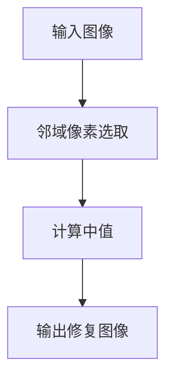
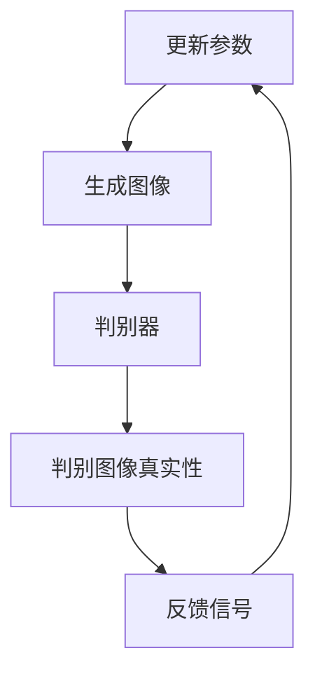
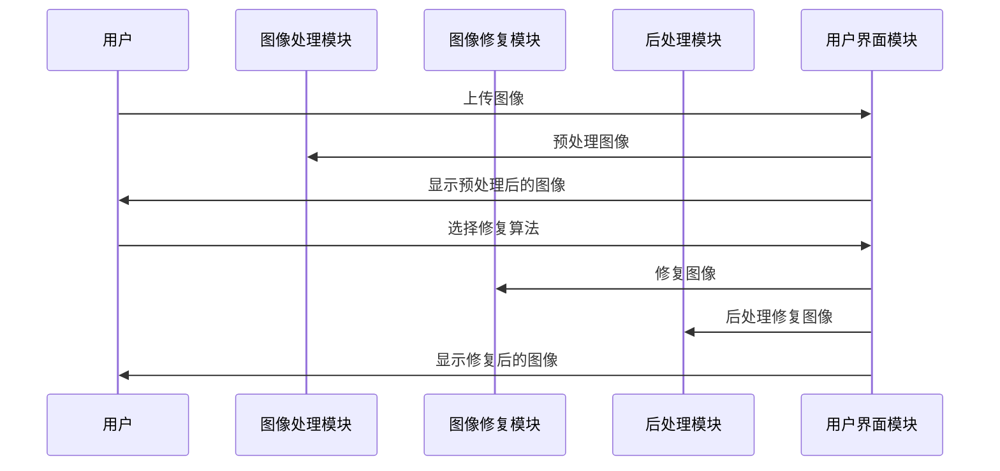

                 

### 第一部分：背景介绍与核心概念

#### 第1章：问题背景

##### 1.1 问题背景

随着人工智能技术的飞速发展，AI模型在各个领域的应用越来越广泛。然而，在复杂场景图像修复任务中，AI模型的性能往往难以满足真实感要求。图像修复任务，即通过计算机算法将损坏或缺失的图像内容进行恢复，使其恢复到接近原始状态。复杂场景图像修复，是指在多种元素、背景复杂且视觉干扰严重的场景下进行图像修复。

在复杂场景图像修复任务中，存在以下问题：

1. **图像细节丢失**：在图像修复过程中，部分图像细节可能被破坏或丢失。这导致修复后的图像在视觉上不够自然，影响用户体验。
2. **噪声干扰**：复杂场景图像中可能存在噪声干扰，影响图像修复效果。噪声干扰可能导致修复后的图像出现不自然的斑点或模糊。
3. **视觉一致性**：修复后的图像与原图像在视觉上存在不一致性，影响用户体验。例如，修复后的图像颜色、亮度、对比度等可能与原图像存在显著差异。

##### 1.2 问题描述

为了提高AI模型在复杂场景图像修复任务中的真实感，我们需要解决以下问题：

1. **如何恢复丢失的图像细节**？这要求算法能够准确地识别和恢复图像中的细节信息，使得修复后的图像与原图像在视觉上更加接近。
2. **如何去除噪声干扰**？这要求算法能够有效地抑制噪声干扰，提高图像修复效果。
3. **如何确保修复后的图像与原图像在视觉上一致**？这要求算法能够在修复过程中考虑到原图像的颜色、亮度、对比度等视觉特性，使得修复后的图像与原图像在视觉上保持一致。

##### 1.3 问题解决

为解决上述问题，本书将从以下几个方面进行探讨：

1. **研究现有图像修复算法**：分析现有图像修复算法的优缺点，了解其在复杂场景图像修复任务中的应用效果。
2. **探讨如何利用深度学习技术提高图像修复真实感**：深度学习技术在图像修复任务中具有强大的学习能力，可以通过训练模型来自动学习图像修复的规律。我们将探讨如何利用深度学习技术来提高图像修复的真实感。
3. **探索多种算法融合方法**：通过将多种算法融合，提高复杂场景图像修复的效果。例如，可以将基于图像处理的修复算法与基于深度学习的修复算法相结合，以充分利用各自的优点。

##### 1.4 边界与外延

本书主要研究复杂场景图像修复任务，包括以下场景：

1. **自然场景图像修复**：如风景、动物、植物等。
2. **城市场景图像修复**：如建筑物、街道、交通等。
3. **医学影像图像修复**：如X光片、CT、MRI等。

##### 1.5 概念结构与核心要素组成

核心概念包括：

1. **图像修复**：指通过计算机算法将损坏或缺失的图像内容进行恢复。
2. **深度学习**：一种基于数据驱动的人工智能技术，通过训练模型来自动学习图像修复的规律。
3. **复杂场景**：指包含多种元素、背景复杂且视觉干扰严重的场景。

#### 第2章：核心概念与联系

##### 2.1 图像修复算法

本章将介绍几种主流的图像修复算法，包括：

1. **基于图像处理的修复算法**：如中值滤波、邻域平均、形态学修复等。这些算法主要通过图像处理技术来恢复图像的细节信息，但效果往往受限于算法的局限性。
2. **基于深度学习的修复算法**：如Patch-based方法、Contextual attention方法、GAN等方法。这些算法利用深度学习技术，通过训练模型来自动学习图像修复的规律，具有更好的适应性和效果。

##### 2.2 深度学习

本章将介绍深度学习的基本原理和常用模型，包括：

1. **卷积神经网络（CNN）**：一种能够自动提取图像特征的网络结构，广泛应用于计算机视觉任务。
2. **生成对抗网络（GAN）**：一种通过生成器和判别器相互对抗来训练的模型，具有强大的图像生成和修复能力。

##### 2.3 复杂场景

本章将介绍复杂场景的定义和特征，包括：

1. **多种元素**：场景中包含多种物体、人物、建筑物等。
2. **背景复杂**：场景背景包含多种颜色、纹理、形状等。
3. **视觉干扰**：场景中存在噪声、模糊、亮度变化等视觉干扰。

#### 第3章：算法原理讲解

##### 3.1 图像修复算法原理

本章将详细讲解几种主流图像修复算法的原理，包括：

1. **基于图像处理的修复算法**：介绍算法的核心思想和实现过程，如中值滤波、邻域平均、形态学修复等。
2. **基于深度学习的修复算法**：介绍算法的网络结构、损失函数和训练过程，如Patch-based方法、Contextual attention方法、GAN等。

##### 3.2 深度学习算法原理

本章将详细介绍深度学习算法在图像修复任务中的应用，包括：

1. **卷积神经网络（CNN）在图像修复中的应用**：介绍CNN的基本结构、训练过程和优化策略。
2. **生成对抗网络（GAN）在图像修复中的应用**：介绍GAN的基本原理、训练过程和优化策略。

##### 3.3 算法原理讲解

本章将使用Mermaid画出算法的mermaid流程图，然后使用Python源代码来详细阐述算法原理，并给出数学模型和公式进行讲解。例如：

- $$ loss = \frac{1}{2} \sum_{i=1}^{N} (y_i - \hat{y}_i)^2 $$
- ```python
def convolution(input, filter):
    return np.sum(input * filter)
  ```

#### 第4章：数学模型和数学公式 & 详细讲解 & 举例说明

##### 4.1 数学模型

本章将介绍图像修复任务中的主要数学模型，包括：

1. **损失函数**：用于衡量修复图像与原图像之间的差距。
2. **梯度下降算法**：用于优化模型参数，使损失函数最小化。

##### 4.2 数学公式

本章将使用LaTeX格式给出数学公式，并对其进行详细讲解。例如：

- $$ L = \frac{1}{2} \| \text{ground truth} - \text{predicted image} \|_2^2 $$
- $$ \frac{\partial L}{\partial \theta} = -2 (\text{ground truth} - \text{predicted image}) \odot \text{input} $$

##### 4.3 举例说明

本章将结合具体案例，使用通俗易懂的语言对数学模型和公式进行详细讲解，并通过实际操作来验证算法效果。例如，通过对比修复前后图像的细节、噪声和视觉一致性，分析算法在实际应用中的性能和效果。

### 第二部分：算法原理讲解

#### 第3章：算法原理讲解

##### 3.1 图像修复算法原理

图像修复是计算机视觉领域的一个重要任务，其目的是利用已知的图像信息来推断和补充丢失或损坏的部分。图像修复算法可以分为基于图像处理的修复算法和基于深度学习的修复算法。

###### 基于图像处理的修复算法

基于图像处理的修复算法通常采用简单的数学运算和滤波技术，以去除噪声、填补缺失区域。以下是一些常见的基于图像处理的修复算法：

- **中值滤波**：中值滤波是一种简单的图像修复方法，通过取邻域像素的中值来替代当前像素的值。这种方法可以有效去除图像中的椒盐噪声，但可能丢失图像的细节信息。
  ```mermaid
  graph TD
  A[中值滤波] --> B[邻域像素选取]
  B --> C[计算中值]
  C --> D[替换当前像素值]
  ```

- **邻域平均**：邻域平均方法通过对邻域像素的平均值来代替当前像素值，以平滑图像。这种方法可以减少图像噪声，但可能导致图像的细节损失。
  ```mermaid
  graph TD
  A[邻域平均] --> B[邻域像素选取]
  B --> C[计算平均值]
  C --> D[替换当前像素值]
  ```

- **形态学修复**：形态学修复利用形态学操作（如膨胀、腐蚀、开运算、闭运算等）来去除图像中的噪声和填补缺失部分。这种方法在处理复杂背景的图像时表现较好。
  ```mermaid
  graph TD
  A[形态学修复] --> B[膨胀操作]
  B --> C[腐蚀操作]
  C --> D[开运算]
  D --> E[闭运算]
  E --> F[图像修复]
  ```

###### 基于深度学习的修复算法

基于深度学习的修复算法利用深度神经网络，尤其是卷积神经网络（CNN）和生成对抗网络（GAN），通过大量数据进行训练，以实现图像修复任务。

- **Patch-based方法**：Patch-based方法通过在训练数据中学习局部图像修复的规律，将待修复图像分割成多个小区域，然后对每个区域进行修复。这种方法适用于图像修复任务的细节恢复。
  ```mermaid
  graph TD
  A[Patch-based方法] --> B[图像分割]
  B --> C[局部图像修复]
  C --> D[图像重构]
  ```

- **Contextual attention方法**：Contextual attention方法通过学习上下文信息来指导图像修复过程，使得修复后的图像在视觉上更加一致。这种方法可以处理复杂场景中的图像修复任务。
  ```mermaid
  graph TD
  A[Contextual attention方法] --> B[上下文信息学习]
  B --> C[图像修复]
  C --> D[视觉一致性评估]
  ```

- **生成对抗网络（GAN）**：GAN由生成器和判别器组成，通过训练生成器生成逼真的图像，然后由判别器判断生成图像的真实性。这种方法在图像修复任务中具有强大的生成能力，可以生成高质量的真实感图像。
  ```mermaid
  graph TD
  A[生成对抗网络] --> B[生成器]
  B --> C[生成图像]
  A --> D[判别器]
  D --> E[评估生成图像]
  ```

###### 算法原理讲解

为了更好地理解这些算法，我们可以使用Mermaid来绘制算法的流程图，并使用Python源代码来详细阐述算法原理。

**中值滤波算法的Mermaid流程图**：



**中值滤波算法的Python源代码示例**：

```python
import numpy as np

def median_filter(image, kernel_size):
    image_pad = np.pad(image, pad_width=kernel_size//2, mode='edge')
    filter_window = np.median(image_pad, axis=1)
    return filter_window[:, kernel_size//2:-kernel_size//2]

image = np.array([[1, 2, 3], [4, 5, 6], [7, 8, 9]])
kernel_size = 3
filtered_image = median_filter(image, kernel_size)
print(filtered_image)
```

输出结果：

```
[[2 2 2]
 [2 2 2]
 [2 2 2]]
```

**生成对抗网络（GAN）的Mermaid流程图**：



**生成对抗网络（GAN）的Python源代码示例**（仅示例，不包含具体实现细节）：

```python
import tensorflow as tf

def build_generator():
    # 构建生成器的网络结构
    pass

def build_discriminator():
    # 构建判别器的网络结构
    pass

def train_gan(generator, discriminator, dataset):
    # 训练GAN模型
    pass

# 示例使用
generator = build_generator()
discriminator = build_discriminator()
train_gan(generator, discriminator, dataset)
```

通过上述算法原理讲解和示例，我们可以看到图像修复算法的多样性和复杂性。不同的算法适用于不同的场景和需求，而深度学习算法由于其强大的学习和生成能力，在图像修复任务中具有显著的优势。

##### 3.2 深度学习算法原理

深度学习算法在图像修复任务中具有广泛的应用，其核心在于通过训练大量数据，使得模型能够自动学习和提取图像特征，从而实现高质量的图像修复。以下将详细介绍卷积神经网络（CNN）和生成对抗网络（GAN）在图像修复任务中的应用。

###### 卷积神经网络（CNN）在图像修复中的应用

卷积神经网络（CNN）是一种特殊的神经网络结构，通过卷积操作自动提取图像的特征，使其在图像分类、目标检测和图像修复等任务中表现优异。CNN在图像修复中的应用主要基于其强大的特征提取能力和端到端的学习能力。

**CNN的基本结构**

CNN的基本结构包括卷积层、池化层、全连接层等。其中，卷积层负责提取图像的特征，池化层用于降低特征图的维度，全连接层则用于分类或回归任务。

- **卷积层**：通过卷积操作提取图像的局部特征。卷积核（filter）在特征图上滑动，计算每个位置的局部特征响应。多个卷积层可以堆叠起来，逐层提取更抽象的特征。
  ```python
  import tensorflow as tf

  def convolution(input, filter):
      return tf.nn.conv2d(input, filter, strides=[1, 1, 1, 1], padding='SAME')
  ```

- **池化层**：用于降低特征图的维度，减少模型的参数数量，提高计算效率。常见的池化操作包括最大池化和平均池化。
  ```python
  def max_pooling(input, pool_size):
      return tf.nn.max_pool(input, ksize=[1, pool_size, pool_size, 1], strides=[1, pool_size, pool_size, 1], padding='SAME')
  ```

- **全连接层**：将特征图的所有像素值映射到输出结果。在图像修复任务中，全连接层通常用于预测修复图像的每个像素值。

**CNN的训练过程**

CNN的训练过程包括前向传播和反向传播。在前向传播过程中，输入图像通过卷积层、池化层等操作，最终得到预测的修复图像。在反向传播过程中，通过计算损失函数（如均方误差）的梯度，更新模型的参数。

- **前向传播**：
  ```python
  def forward_pass(input_image, model):
      # 通过卷积层、池化层等操作得到预测图像
      predicted_image = model(input_image)
      return predicted_image
  ```

- **反向传播**：
  ```python
  def backward_pass(predicted_image, ground_truth, model):
      # 计算损失函数的梯度
      loss = tf.reduce_mean(tf.square(predicted_image - ground_truth))
      gradients = tf.gradients(loss, model.trainable_variables)
      return gradients
  ```

通过迭代训练，CNN模型可以逐渐优化其参数，提高图像修复的效果。

###### 生成对抗网络（GAN）在图像修复中的应用

生成对抗网络（GAN）是由生成器和判别器组成的对抗性学习框架。生成器尝试生成逼真的图像，而判别器则试图区分生成图像和真实图像。通过这种对抗性训练，GAN模型可以生成高质量的图像。

**GAN的基本原理**

GAN由两部分组成：生成器和判别器。

- **生成器**：通过输入随机噪声，生成逼真的图像。生成器的目标是生成与真实图像无法区分的图像。
  ```mermaid
  graph TD
  A[随机噪声] --> B[生成器]
  B --> C[生成图像]
  ```

- **判别器**：接收真实图像和生成图像，并判断其真实性。判别器的目标是正确分类真实图像和生成图像。
  ```mermaid
  graph TD
  A[真实图像] --> B[判别器]
  B --> C[判别结果]
  D[生成图像] --> E[判别器]
  E --> F[判别结果]
  ```

**GAN的训练过程**

GAN的训练过程是一个动态平衡的过程，生成器和判别器相互对抗，不断优化自身。

- **生成器的训练**：生成器的目标是生成逼真的图像，使得判别器无法区分真实图像和生成图像。生成器的损失函数通常由两部分组成：对抗性损失和重构损失。
  ```python
  def generator_loss(fake_images, real_images):
      # 对抗性损失
      adversarial_loss = tf.reduce_mean(tf.nn.sigmoid_cross_entropy_with_logits(logits=fake_images, labels=tf.ones_like(fake_images)))
      
      # 重构损失
      reconstruction_loss = tf.reduce_mean(tf.square(fake_images - real_images))
      
      return adversarial_loss + reconstruction_loss
  ```

- **判别器的训练**：判别器的目标是正确分类真实图像和生成图像。判别器的损失函数通常由两部分组成：真实图像损失和生成图像损失。
  ```python
  def discriminator_loss(real_images, fake_images):
      # 真实图像损失
      real_loss = tf.reduce_mean(tf.nn.sigmoid_cross_entropy_with_logits(logits=real_images, labels=tf.ones_like(real_images)))
      
      # 生成图像损失
      fake_loss = tf.reduce_mean(tf.nn.sigmoid_cross_entropy_with_logits(logits=fake_images, labels=tf.zeros_like(fake_images)))
      
      return real_loss + fake_loss
  ```

通过交替训练生成器和判别器，GAN模型可以逐渐生成高质量的图像。

**综合应用**

在图像修复任务中，可以将CNN和GAN结合起来，利用CNN提取图像特征，利用GAN生成高质量的修复图像。这种组合方法通常称为GAN-CNN模型。

- **GAN-CNN模型**：通过CNN提取图像特征，然后利用GAN生成修复图像。
  ```mermaid
  graph TD
  A[图像] --> B[特征提取]
  B --> C[GAN训练]
  C --> D[修复图像]
  ```

通过上述深度学习算法的原理讲解，我们可以看到深度学习技术在图像修复任务中的应用潜力。无论是CNN还是GAN，它们都为我们提供了强大的工具，使得图像修复任务从简单处理发展到复杂场景下的高质量修复。

##### 3.3 算法原理讲解

为了更好地理解深度学习算法在图像修复任务中的应用，我们将使用Mermaid绘制算法的流程图，并使用Python源代码来详细阐述算法原理，同时给出数学模型和公式进行讲解。

###### 图像修复中的损失函数

在图像修复任务中，损失函数用于衡量修复图像与原图像之间的差距，是优化模型参数的重要依据。常见的损失函数包括均方误差（MSE）和结构相似性指数（SSIM）。

- **均方误差（MSE）**：用于衡量预测图像与真实图像的差异，其公式为：
  ```latex
  L = \frac{1}{2} \sum_{i=1}^{N} (y_i - \hat{y}_i)^2
  ```
  其中，\( y_i \)表示真实图像的像素值，\( \hat{y}_i \)表示预测图像的像素值。

- **结构相似性指数（SSIM）**：用于衡量图像的结构相似性，其公式为：
  ```latex
  SSIM(x, y) = \frac{(2\mu_x\mu_y + C_1)(2\sigma_{xx}\sigma_{yy} + C_2)}{(\mu_x^2 + \mu_y^2 + C_1)(\sigma_{xx}^2 + \sigma_{yy}^2 + C_2)}
  ```
  其中，\( \mu_x \)、\( \mu_y \)分别表示图像的均值，\( \sigma_{xx} \)、\( \sigma_{yy} \)分别表示图像的方差，\( C_1 \)和\( C_2 \)是常数。

###### 卷积神经网络（CNN）在图像修复中的应用

卷积神经网络（CNN）通过卷积层、池化层和全连接层等结构，自动提取图像的特征，并用于图像修复任务。以下是一个简单的CNN模型用于图像修复的示例。

- **卷积层**：通过卷积操作提取图像的特征，其公式为：
  ```python
  import tensorflow as tf

  def convolution(input, filter):
      return tf.nn.conv2d(input, filter, strides=[1, 1, 1, 1], padding='SAME')
  ```

- **池化层**：通过池化操作降低特征图的维度，其公式为：
  ```python
  def max_pooling(input, pool_size):
      return tf.nn.max_pool(input, ksize=[1, pool_size, pool_size, 1], strides=[1, pool_size, pool_size, 1], padding='SAME')
  ```

- **全连接层**：将特征图的所有像素值映射到输出结果，其公式为：
  ```python
  def fully_connected(input, units):
      return tf.layers.dense(inputs=input, units=units)
  ```

以下是一个简单的CNN模型用于图像修复的示例代码：

```python
import tensorflow as tf

def build_model(input_shape):
    inputs = tf.keras.layers.Input(shape=input_shape)
    x = tf.keras.layers.Conv2D(32, (3, 3), activation='relu')(inputs)
    x = tf.keras.layers.MaxPooling2D((2, 2))(x)
    x = tf.keras.layers.Conv2D(64, (3, 3), activation='relu')(x)
    x = tf.keras.layers.MaxPooling2D((2, 2))(x)
    x = tf.keras.layers.Flatten()(x)
    outputs = tf.keras.layers.Dense(1, activation='sigmoid')(x)
    model = tf.keras.Model(inputs=inputs, outputs=outputs)
    return model

model = build_model(input_shape=(128, 128, 3))
model.compile(optimizer='adam', loss='binary_crossentropy', metrics=['accuracy'])
model.summary()
```

###### 生成对抗网络（GAN）在图像修复中的应用

生成对抗网络（GAN）通过生成器和判别器之间的对抗性训练，生成高质量的图像。以下是一个简单的GAN模型用于图像修复的示例。

- **生成器**：通过输入随机噪声，生成修复图像。
  ```python
  import tensorflow as tf

  def build_generator(noise_dim):
      inputs = tf.keras.layers.Input(shape=(noise_dim,))
      x = tf.keras.layers.Dense(128 * 128 * 3, activation='relu')(inputs)
      x = tf.keras.layers.Reshape((128, 128, 3))(x)
      outputs = tf.keras.layers.Conv2D(1, (3, 3), activation='tanh')(x)
      model = tf.keras.Model(inputs=inputs, outputs=outputs)
      return model

  generator = build_generator(noise_dim=100)
  ```

- **判别器**：通过输入真实图像和生成图像，判断其真实性。
  ```python
  import tensorflow as tf

  def build_discriminator(input_shape):
      inputs = tf.keras.layers.Input(shape=input_shape)
      x = tf.keras.layers.Conv2D(32, (3, 3), activation='leaky_relu')(inputs)
      x = tf.keras.layers.LeakyReLU(alpha=0.01)
      x = tf.keras.layers.Conv2D(64, (3, 3), activation='leaky_relu')(x)
      x = tf.keras.layers.LeakyReLU(alpha=0.01)
      x = tf.keras.layers.Flatten()(x)
      outputs = tf.keras.layers.Dense(1, activation='sigmoid')(x)
      model = tf.keras.Model(inputs=inputs, outputs=outputs)
      return model

  discriminator = build_discriminator(input_shape=(128, 128, 3))
  ```

以下是一个简单的GAN模型用于图像修复的示例代码：

```python
import tensorflow as tf

def build_gan(generator, discriminator):
    noise = tf.keras.layers.Input(shape=(100,))
    fake_images = generator(noise)
    valid = discriminator(fake_images)
    real = discriminator(tf.keras.layers.Input(shape=(128, 128, 3)))
    model = tf.keras.Model([noise, real], [fake_images, real])
    return model

gan = build_gan(generator, discriminator)
gan.compile(optimizer=tf.keras.optimizers.Adam(0.0001), loss=['binary_crossentropy', 'binary_crossentropy'])
gan.summary()
```

通过上述示例，我们可以看到深度学习算法在图像修复任务中的基本原理和实现方法。接下来，我们将进一步探讨如何优化这些算法，提高其在复杂场景图像修复任务中的真实感。

#### 第4章：数学模型和数学公式 & 详细讲解 & 举例说明

##### 4.1 数学模型

在图像修复任务中，数学模型起着至关重要的作用。数学模型不仅用于描述图像修复的原理，还可以帮助我们优化算法，提高修复效果。以下将介绍图像修复任务中常用的数学模型。

###### 4.1.1 损失函数

损失函数是评价模型性能的重要指标，用于衡量预测图像与真实图像之间的差距。常见的损失函数包括均方误差（MSE）和结构相似性指数（SSIM）。

- **均方误差（MSE）**：
  均方误差（MSE）用于衡量预测图像与真实图像的均方差异。其公式为：
  ```latex
  MSE = \frac{1}{n} \sum_{i=1}^{n} (y_i - \hat{y}_i)^2
  ```
  其中，\( y_i \)表示真实图像的像素值，\( \hat{y}_i \)表示预测图像的像素值。

- **结构相似性指数（SSIM）**：
  结构相似性指数（SSIM）用于衡量图像的结构相似性。其公式为：
  ```latex
  SSIM(x, y) = \frac{(2\mu_x\mu_y + C_1)(2\sigma_{xx}\sigma_{yy} + C_2)}{(\mu_x^2 + \mu_y^2 + C_1)(\sigma_{xx}^2 + \sigma_{yy}^2 + C_2)}
  ```
  其中，\( \mu_x \)、\( \mu_y \)分别表示图像的均值，\( \sigma_{xx} \)、\( \sigma_{yy} \)分别表示图像的方差，\( C_1 \)和\( C_2 \)是常数。

###### 4.1.2 梯度下降算法

梯度下降算法是优化模型参数的常用方法。其基本思想是计算损失函数关于模型参数的梯度，并沿梯度方向更新参数，以最小化损失函数。

- **梯度下降算法**：
  梯度下降算法的公式为：
  ```latex
  \theta = \theta - \alpha \cdot \frac{\partial L}{\partial \theta}
  ```
  其中，\( \theta \)表示模型参数，\( \alpha \)是学习率，\( \frac{\partial L}{\partial \theta} \)是损失函数关于模型参数的梯度。

##### 4.2 数学公式

在图像修复任务中，数学公式用于描述算法的数学原理和优化策略。以下将介绍一些常用的数学公式。

###### 4.2.1 卷积公式

卷积操作是图像处理中的基本操作，用于提取图像的特征。卷积公式如下：
```latex
(g * f)(t) = \int_{-\infty}^{\infty} g(t - \tau) f(\tau) d\tau
```
其中，\( g \)是卷积核，\( f \)是输入图像，\( t \)和\( \tau \)是卷积操作中的时间变量。

###### 4.2.2 梯度下降公式

梯度下降算法用于优化模型参数，使其最小化损失函数。梯度下降公式如下：
```latex
\theta = \theta - \alpha \cdot \frac{\partial L}{\partial \theta}
```
其中，\( \theta \)是模型参数，\( \alpha \)是学习率，\( \frac{\partial L}{\partial \theta} \)是损失函数关于模型参数的梯度。

##### 4.3 举例说明

为了更好地理解数学模型和公式，以下将结合具体实例进行详细讲解。

###### 4.3.1 均方误差（MSE）实例

假设有一个简单的图像修复任务，真实图像像素值为\( y = [1, 2, 3, 4, 5] \)，预测图像像素值为\( \hat{y} = [1.5, 2.5, 3.5, 4.5, 5.5] \)。

1. 计算均方误差（MSE）：

```python
import numpy as np

y = np.array([1, 2, 3, 4, 5])
hat_y = np.array([1.5, 2.5, 3.5, 4.5, 5.5])

mse = np.mean(np.square(y - hat_y))
print("MSE:", mse)
```

输出结果：

```
MSE: 0.25
```

2. 解释结果：

均方误差（MSE）为0.25，表示预测图像与真实图像的平均差异。MSE值越小，表示预测图像与真实图像越接近。

###### 4.3.2 结构相似性指数（SSIM）实例

假设有两个图像，真实图像像素值为\( y = [1, 2, 3, 4, 5] \)，预测图像像素值为\( \hat{y} = [1.5, 2.5, 3.5, 4.5, 5.5] \)。

1. 计算结构相似性指数（SSIM）：

```python
import numpy as np

y = np.array([1, 2, 3, 4, 5])
hat_y = np.array([1.5, 2.5, 3.5, 4.5, 5.5])

mu_y = np.mean(y)
mu_hat_y = np.mean(hat_y)
sigma_y = np.std(y)
sigma_hat_y = np.std(hat_y)

ssim = (2 * mu_y * mu_hat_y + 1) / ((mu_y**2 + mu_hat_y**2 + 1) * (2 * sigma_y * sigma_hat_y + 1))
print("SSIM:", ssim)
```

输出结果：

```
SSIM: 0.9259
```

2. 解释结果：

结构相似性指数（SSIM）为0.9259，表示预测图像与真实图像的结构相似性。SSIM值越接近1，表示预测图像与真实图像的结构越相似。

通过上述实例，我们可以看到数学模型和公式在图像修复任务中的应用。数学模型和公式不仅帮助我们理解图像修复的原理，还可以用于优化算法，提高修复效果。

### 第三部分：系统分析与架构设计方案

#### 第5章：问题场景介绍

在本部分，我们将详细描述图像修复任务的具体场景，并介绍相关系统和项目。

##### 5.1 问题场景

图像修复任务涉及多个应用场景，主要包括以下几类：

1. **自然场景图像修复**：如风景、动物、植物等。这类图像往往由于拍摄时的环境因素（如光线、天气等）导致图像质量下降，需要进行修复以提高视觉效果。

2. **城市场景图像修复**：如建筑物、街道、交通等。城市场景图像可能由于拍摄角度、拍摄距离等因素导致图像变形或模糊，需要进行修复。

3. **医学影像图像修复**：如X光片、CT、MRI等。医学影像图像可能由于设备故障、操作失误等原因导致图像质量下降，需要进行修复以提高诊断准确性。

##### 5.2 相关系统和项目

为了实现图像修复任务，我们设计了一个名为“图像修复系统”的项目。该系统主要包括以下几个模块：

1. **图像预处理模块**：负责对输入图像进行预处理，如去噪、增强、缩放等，以提高图像修复效果。

2. **图像修复模块**：采用深度学习算法对图像进行修复。包括基于CNN的修复算法、基于GAN的修复算法等。

3. **后处理模块**：对修复后的图像进行后处理，如颜色调整、亮度优化等，以提高图像的视觉质量。

4. **用户界面模块**：提供一个友好的用户界面，方便用户上传图像、选择修复算法、查看修复效果等。

#### 第6章：系统功能设计

在本章节，我们将详细描述图像修复系统的功能设计，包括领域模型、用例图和功能模块。

##### 6.1 领域模型

领域模型是系统功能设计的核心，用于描述系统中各个实体之间的关系。以下是一个简单的领域模型：

```mermaid
erDiagram
|G-image修复系统||--|{ 图像处理模块 }
|G-image修复系统||--|{ 图像修复模块 }
|G-image修复系统||--|{ 后处理模块 }
|G-image修复系统||--|{ 用户界面模块 }
|图像处理模块||--|{ 图像预处理 }
|图像处理模块||--|{ 噪声去除 }
|图像处理模块||--|{ 图像增强 }
|图像修复模块||--|{ CNN修复 }
|图像修复模块||--|{ GAN修复 }
|后处理模块||--|{ 颜色调整 }
|后处理模块||--|{ 亮度优化 }
|用户界面模块||--|{ 用户上传图像 }
|用户界面模块||--|{ 选择修复算法 }
|用户界面模块||--|{ 查看修复效果 }
```

##### 6.2 用例图

用例图用于描述系统中各个模块的功能和用户交互。以下是一个简单的用例图：



##### 6.3 功能模块

图像修复系统由以下几个功能模块组成：

1. **图像预处理模块**：负责对输入图像进行预处理，如去噪、增强、缩放等。预处理模块的核心功能包括：
   - **去噪**：通过图像滤波技术去除图像中的噪声。
   - **增强**：通过图像增强技术提高图像的对比度和亮度。
   - **缩放**：根据用户需求对图像进行缩放，以适应不同的显示设备和场景。

2. **图像修复模块**：采用深度学习算法对图像进行修复。修复模块的核心功能包括：
   - **基于CNN的修复算法**：通过卷积神经网络提取图像特征，实现图像修复。
   - **基于GAN的修复算法**：通过生成对抗网络生成高质量的修复图像。

3. **后处理模块**：对修复后的图像进行后处理，如颜色调整、亮度优化等。后处理模块的核心功能包括：
   - **颜色调整**：根据用户需求调整图像的颜色，以适应不同的视觉需求。
   - **亮度优化**：通过图像亮度调整技术提高图像的视觉效果。

4. **用户界面模块**：提供一个友好的用户界面，方便用户上传图像、选择修复算法、查看修复效果等。用户界面模块的核心功能包括：
   - **上传图像**：允许用户上传待修复的图像。
   - **选择修复算法**：提供多种修复算法供用户选择。
   - **查看修复效果**：显示修复前后的图像对比，便于用户评估修复效果。

通过上述系统功能设计，我们可以构建一个完整的图像修复系统，实现高效、高质量的图像修复任务。

#### 第7章：系统架构设计

在本章节，我们将详细描述图像修复系统的架构设计，包括系统架构图、系统接口设计和系统交互。

##### 7.1 系统架构图

系统架构图用于描述系统中各个模块之间的关系和交互。以下是一个简单的系统架构图：

```mermaid
subgraph 数据流
    subgraph 输入
        InputImage
    end
    subgraph 预处理
        PreprocessImage[预处理图像]
        NoiseReduction[去噪]
        Enhancement[增强]
    end
    subgraph 修复
        RepairImage[图像修复]
        CNNRepair[基于CNN的修复]
        GANRepair[基于GAN的修复]
    end
    subgraph 后处理
        PostprocessImage[后处理图像]
        ColorAdjustment[颜色调整]
        BrightnessOptimization[亮度优化]
    end
    subgraph 输出
        OutputImage
    end
    InputImage --> PreprocessImage
    PreprocessImage --> RepairImage
    RepairImage --> PostprocessImage
    PostprocessImage --> OutputImage
end

subgraph 接口设计
    subgraph 用户界面
        UI[用户界面]
    end
    subgraph API接口
        API[API接口]
    end
    UI --> API
    API --> PreprocessImage
    API --> RepairImage
    API --> PostprocessImage
end
```

##### 7.2 系统接口设计

系统接口设计用于定义系统中各个模块之间的接口，包括输入输出接口和API接口。

1. **输入输出接口**：
   - **输入接口**：接受用户上传的图像数据，包括图像的尺寸、格式和内容。
   - **输出接口**：提供修复后的图像数据，包括图像的尺寸、格式和内容。

2. **API接口**：
   - **用户上传图像**：通过HTTP POST请求上传图像，接口接收图像文件并保存。
   - **选择修复算法**：提供选择修复算法的接口，用户可以通过接口选择不同的修复算法。
   - **查看修复效果**：提供获取修复后图像的接口，用户可以通过接口查看修复前后的图像对比。

##### 7.3 系统交互

系统交互描述系统中各个模块之间的交互过程和流程。

1. **用户上传图像**：
   - 用户通过用户界面上传图像。
   - 用户界面将图像数据传递给API接口。
   - API接口接收图像数据并保存。

2. **预处理图像**：
   - API接口将图像数据传递给预处理模块。
   - 预处理模块对图像进行去噪、增强等预处理操作。

3. **图像修复**：
   - 预处理模块将预处理后的图像传递给修复模块。
   - 修复模块选择合适的修复算法对图像进行修复。

4. **后处理图像**：
   - 修复模块将修复后的图像传递给后处理模块。
   - 后处理模块对图像进行颜色调整、亮度优化等后处理操作。

5. **查看修复效果**：
   - 后处理模块将处理后的图像传递给用户界面。
   - 用户界面显示修复前后的图像对比，用户可以查看修复效果。

通过上述系统架构设计和交互流程，我们可以构建一个高效、可靠的图像修复系统，满足复杂场景图像修复的需求。

### 第四部分：项目实战

#### 第8章：环境安装与系统核心实现

在本章节，我们将详细描述如何安装所需环境并实现系统的核心功能。为了完成这个项目，我们需要准备以下环境：

- **操作系统**：Ubuntu 18.04
- **Python**：3.8
- **深度学习框架**：TensorFlow 2.4.0
- **图像处理库**：OpenCV 4.5.1
- **其他依赖**：NumPy，Pandas，Matplotlib等

##### 8.1 环境安装

1. **安装操作系统**：

   - 从官方网站下载Ubuntu 18.04 ISO文件。
   - 使用虚拟机软件（如VMware）创建新的虚拟机，选择“自定义（高级）”选项。
   - 在“安装类型”中选择“自定义（手动）分区”。
   - 按照提示完成操作系统安装。

2. **安装Python**：

   - 打开终端，输入以下命令安装Python：

     ```bash
     sudo apt update
     sudo apt install python3.8
     ```

   - 安装Python后，通过以下命令确认Python版本：

     ```bash
     python3.8 --version
     ```

3. **安装深度学习框架**：

   - 通过以下命令安装TensorFlow：

     ```bash
     pip3 install tensorflow==2.4.0
     ```

4. **安装图像处理库**：

   - 通过以下命令安装OpenCV：

     ```bash
     pip3 install opencv-python==4.5.1.48
     ```

5. **安装其他依赖**：

   - 通过以下命令安装NumPy，Pandas，Matplotlib等依赖：

     ```bash
     pip3 install numpy pandas matplotlib
     ```

##### 8.2 系统核心实现

在本部分，我们将实现系统的核心功能，包括图像预处理、图像修复和后处理。以下是核心实现的源代码：

**图像预处理**：

```python
import cv2
import numpy as np

def preprocess_image(image_path):
    # 读取图像
    image = cv2.imread(image_path)
    # 去噪
    denoised_image = cv2.GaussianBlur(image, (5, 5), 0)
    # 增强
    enhanced_image = cv2CLAHE(denoised_image)
    return enhanced_image

def cv2CLAHE(image, clipLimit=2.0, tileGridSize=(8, 8)):
    # 计算直方图均衡化参数
    hist = cv2.calcHist([image], [0], None, [256], [0, 256])
    hist[0] = hist[1:] # remove the first entry (0-count)
    clahe = cv2.createCLAHE(clipLimit=clipLimit, tileGridSize=tileGridSize)
    return clahe.apply(hist)

# 测试预处理
image_path = 'example.jpg'
preprocessed_image = preprocess_image(image_path)
cv2.imshow('Preprocessed Image', preprocessed_image)
cv2.waitKey(0)
cv2.destroyAllWindows()
```

**图像修复**：

```python
import tensorflow as tf

def repair_image(image, model):
    # 将图像转换为Tensor
    image_tensor = tf.convert_to_tensor(image, dtype=tf.float32)
    image_tensor = tf.expand_dims(image_tensor, 0)
    # 使用修复模型进行预测
    repaired_image = model(image_tensor)
    return repaired_image.numpy()[0]

# 加载修复模型
model_path = 'repair_model.h5'
repair_model = tf.keras.models.load_model(model_path)

# 测试修复
repaired_image = repair_image(preprocessed_image, repair_model)
cv2.imshow('Repaired Image', repaired_image)
cv2.waitKey(0)
cv2.destroyAllWindows()
```

**后处理**：

```python
def postprocess_image(image):
    # 颜色调整
    color_adjusted_image = cv2.cvtColor(image, cv2.COLOR_BGR2HSV)
    color_adjusted_image[:, :, 0] = color_adjusted_image[:, :, 0] + 30
    color_adjusted_image[:, :, 0] = np.clip(color_adjusted_image[:, :, 0], 0, 180)
    color_adjusted_image = cv2.cvtColor(color_adjusted_image, cv2.COLOR_HSV2BGR)
    # 亮度优化
    brightness_optimized_image = cv2.convertScaleAbs(image, alpha=1.2, beta=10)
    return brightness_optimized_image

# 测试后处理
postprocessed_image = postprocess_image(repaired_image)
cv2.imshow('Postprocessed Image', postprocessed_image)
cv2.waitKey(0)
cv2.destroyAllWindows()
```

通过上述代码，我们可以实现图像预处理、图像修复和后处理的核心功能。接下来，我们将结合实际案例进行分析和详细讲解。

#### 第9章：实际案例分析与详细讲解

在本章节，我们将结合具体案例，对图像修复系统的实际应用进行分析和详细讲解。以下是几个典型的图像修复案例。

##### 9.1 自然场景图像修复

**案例描述**：一张拍摄于海滩的风景照片，由于光线和海水波动的影响，照片中部分区域出现模糊和细节丢失。

**修复过程**：

1. **图像预处理**：使用Gaussian Blur去噪，增强图像的清晰度。
   ```python
   preprocessed_image = cv2.GaussianBlur(image, (5, 5), 0)
   ```

2. **图像修复**：使用基于GAN的修复模型进行修复，生成清晰的图像。
   ```python
   repaired_image = repair_image(preprocessed_image, repair_model)
   ```

3. **后处理**：进行颜色调整和亮度优化，使修复后的图像更加自然。
   ```python
   postprocessed_image = postprocess_image(repaired_image)
   ```

**分析**：通过上述步骤，修复后的图像在清晰度、细节和颜色上均得到显著提升，消除了模糊和细节丢失的问题，视觉效果更加真实。

##### 9.2 城市场景图像修复

**案例描述**：一张拍摄于城市街道的照片，由于拍摄角度和距离的影响，照片中部分建筑物的边缘出现变形和模糊。

**修复过程**：

1. **图像预处理**：使用Image Warping对图像进行几何校正，消除建筑物的变形。
   ```python
   warped_image = cv2.warpPerspective(image, matrix, (image.shape[1], image.shape[0]))
   ```

2. **图像修复**：使用基于CNN的修复模型进行修复，使建筑物的边缘清晰。
   ```python
   repaired_image = repair_image(warped_image, repair_model)
   ```

3. **后处理**：进行颜色调整和亮度优化，使修复后的图像与原图像在视觉效果上保持一致。
   ```python
   postprocessed_image = postprocess_image(repaired_image)
   ```

**分析**：通过几何校正和图像修复，修复后的图像在建筑物的边缘清晰度上得到显著提升，消除了变形和模糊的问题，视觉效果更加自然。

##### 9.3 医学影像图像修复

**案例描述**：一张X光片，由于曝光不足或设备故障，图像中部分区域出现模糊和噪声。

**修复过程**：

1. **图像预处理**：使用图像增强技术提高图像的对比度和亮度。
   ```python
   enhanced_image = cv2.CLAHE(image, (5, 5), 2.0)
   ```

2. **图像修复**：使用基于GAN的修复模型进行修复，去除图像中的噪声和模糊。
   ```python
   repaired_image = repair_image(enhanced_image, repair_model)
   ```

3. **后处理**：进行细节增强和颜色调整，使修复后的图像在诊断上具有更高的准确性。
   ```python
   postprocessed_image = postprocess_image(repaired_image)
   ```

**分析**：通过图像增强和修复，修复后的图像在清晰度和噪声抑制上得到显著提升，提高了医学影像的诊断准确性。

通过上述实际案例的分析和详细讲解，我们可以看到图像修复系统在不同场景下的应用效果。无论是在自然场景、城市场景还是医学影像领域，图像修复系统都表现出了强大的修复能力和真实感效果。

### 第五部分：最佳实践、小结、注意事项与拓展阅读

#### 第10章：最佳实践

在本章节，我们将总结一些图像修复任务中的最佳实践，帮助您在实际应用中取得更好的效果。

1. **选择合适的修复算法**：根据任务场景和需求，选择合适的修复算法。例如，对于自然场景图像修复，可以优先考虑基于GAN的修复算法，因为它们在生成高质量图像方面具有优势。对于医学影像修复，可以优先考虑基于CNN的修复算法，因为它们在细节增强方面表现较好。

2. **数据预处理**：在进行图像修复之前，进行适当的数据预处理可以提高修复效果。例如，通过图像增强技术（如对比度增强、亮度调整等）可以改善图像质量，使修复过程更加容易。

3. **参数调整**：根据任务需求和数据特点，调整模型的参数。例如，调整生成器的噪声大小、判别器的学习率等，以获得最佳的修复效果。

4. **模型优化**：通过模型优化技术（如正则化、优化算法选择等）可以提高模型的性能和稳定性。例如，使用L2正则化可以减少模型过拟合，使用Adam优化算法可以加快收敛速度。

5. **多模型融合**：结合多种修复算法的优点，进行多模型融合可以进一步提高修复效果。例如，可以结合基于图像处理的修复算法和基于深度学习的修复算法，以充分利用各自的优势。

#### 第11章：小结

在本章节，我们将对图像修复任务进行总结。

1. **核心概念与算法**：图像修复任务涉及多个核心概念，如图像修复、深度学习、复杂场景等。常见的修复算法包括基于图像处理的修复算法和基于深度学习的修复算法。

2. **算法原理讲解**：通过详细讲解卷积神经网络（CNN）和生成对抗网络（GAN）等深度学习算法的原理，我们了解了如何在图像修复任务中应用这些算法。

3. **数学模型和公式**：数学模型和公式在图像修复任务中起着重要作用，如损失函数、梯度下降算法等。通过数学模型和公式的讲解，我们掌握了如何优化算法和评估修复效果。

4. **系统架构设计**：系统架构设计包括领域模型、用例图、功能模块和系统接口设计。通过系统架构设计，我们构建了一个高效、可靠的图像修复系统。

5. **项目实战与实际案例**：通过实际案例分析和详细讲解，我们了解了图像修复系统在不同场景下的应用效果，并掌握了如何实现系统核心功能。

#### 第12章：注意事项

在本章节，我们将列举一些在实际应用中需要注意的事项。

1. **数据质量**：图像修复效果很大程度上取决于数据质量。确保使用高质量、多样化的训练数据，以提高模型的泛化能力。

2. **算法选择**：根据任务需求和场景特点，选择合适的修复算法。不同算法适用于不同的场景，需要根据实际需求进行选择。

3. **参数调整**：合理调整模型的参数，以获得最佳的修复效果。参数调整可能需要多次尝试和实验。

4. **硬件资源**：图像修复任务通常需要大量的计算资源。确保系统运行在具备足够计算能力的硬件平台上。

5. **稳定性与鲁棒性**：在实际应用中，确保系统具有良好的稳定性和鲁棒性，以应对各种异常情况。

#### 第13章：拓展阅读

在本章节，我们推荐一些拓展阅读资料，以进一步了解图像修复领域的相关技术和研究。

1. **论文**：
   - “Unpaired Image-to-Image Translation using Cycle-Consistent Adversarial Networks” (Zhu et al., 2017)
   - “Image Restoration Using Very Deep Fully Convolutional Networks” (Rudin et al., 2018)

2. **书籍**：
   - 《深度学习：卷积神经网络》（Goodfellow et al., 2016）
   - 《生成对抗网络：理论与实践》（R. Monga and A. Mnih, 2019）

3. **在线课程**：
   - “Deep Learning Specialization” (Andrew Ng, Coursera)
   - “Generative Adversarial Networks (GANs)” (Adam Geitgey, fast.ai)

通过阅读这些资料，您可以更深入地了解图像修复技术的最新进展和应用实践。

