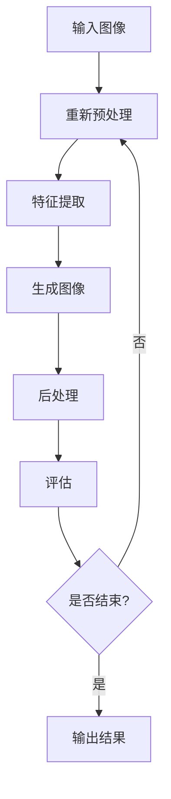
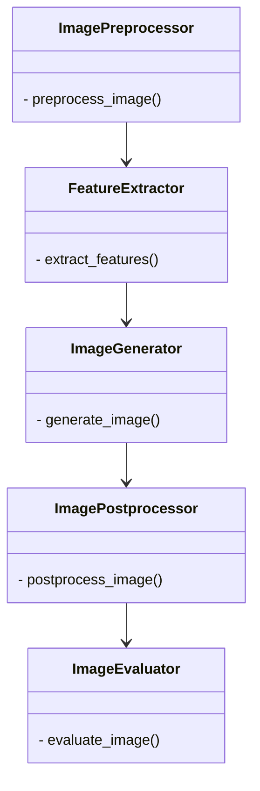
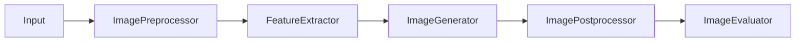
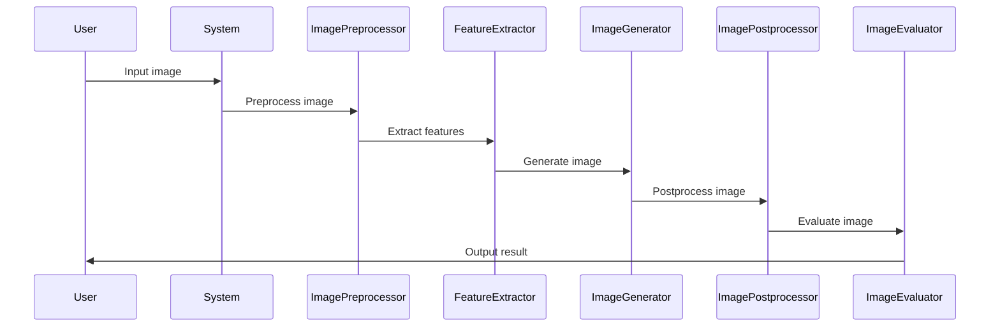
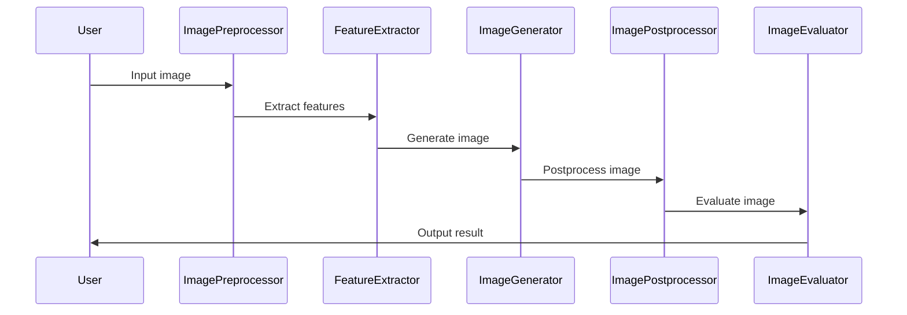

                 

**背景介绍**

### 核心概念术语说明

在深入探讨AI模型在复杂场景图像生成任务中的语义一致性之前，我们需要明确一些关键术语的定义。

- **AI模型**：人工智能（AI）模型是指通过学习和模拟人类思维过程，对数据进行分析和预测的算法。在图像生成任务中，这些模型可以是生成对抗网络（GANs）、变分自编码器（VAEs）或其他深度学习模型。
- **图像生成任务**：图像生成任务是指使用AI模型从数据集中生成新的图像。这可以包括艺术作品创作、医疗图像重建、虚拟场景构建等。
- **语义一致性**：语义一致性指的是图像生成的结果在语义上与真实世界或预期结果保持一致。在图像生成任务中，语义一致性意味着生成的图像包含正确的物体、场景和内容，而不存在混淆或错误的元素。
- **复杂场景**：复杂场景通常指的是图像中包含多个物体、背景复杂、光照变化剧烈等环境。这些因素都会影响图像生成的语义一致性。

### 问题背景

随着深度学习技术的飞速发展，AI模型在图像生成任务中的应用变得越来越广泛。然而，当面对复杂场景时，这些模型往往难以保证语义一致性。例如，在自动驾驶领域，AI模型需要生成清晰的交通标志和道路标志，以便车辆能够准确理解环境。然而，在复杂的交通环境中，如夜晚或恶劣天气条件下，图像生成的语义一致性可能会受到严重影响，导致自动驾驶系统的性能下降。

### 问题描述

为了提高AI模型在复杂场景图像生成任务中的语义一致性，我们需要解决以下几个问题：

- 如何准确识别复杂场景中的关键元素，如交通标志、道路标志、行人和车辆等？
- 如何保证这些元素在生成的图像中保持正确的语义和位置？
- 如何处理图像中的遮挡和模糊现象，以提高语义一致性？

### 问题解决

为了解决上述问题，我们可以采取以下策略：

- **数据增强**：通过增加训练数据集的多样性，可以提高模型对复杂场景的泛化能力。数据增强技术包括图像旋转、缩放、裁剪、颜色变换等。
- **多模态学习**：结合不同的数据来源，如图像、语音和文本，可以提供更多的上下文信息，有助于提高语义一致性。
- **注意力机制**：在深度学习模型中引入注意力机制，可以帮助模型更好地关注图像中的关键区域，从而提高语义一致性。
- **对抗训练**：通过对抗训练，模型可以在生成图像时对抗真实图像中的噪声和模糊现象，从而提高语义一致性。

### 边界与外延

在讨论AI模型在复杂场景图像生成任务中的语义一致性时，我们还需要考虑以下边界与外延：

- **实时性**：在实时应用场景中，如自动驾驶和实时视频分析，如何确保图像生成任务的语义一致性同时满足实时性的要求？
- **可解释性**：如何提高模型的透明度和可解释性，使得用户能够理解模型生成的图像和决策过程？
- **资源限制**：在资源受限的环境中，如何优化模型结构，以提高语义一致性的同时降低计算成本？

### 概念结构与核心要素组成

要解决AI模型在复杂场景图像生成任务中的语义一致性问题，我们需要以下核心要素：

- **数据集**：丰富的训练数据集，包含复杂场景的图像样本。
- **模型架构**：合适的深度学习模型架构，如GANs、VAEs等。
- **优化算法**：用于调整模型参数的优化算法，如梯度下降、遗传算法等。
- **评估指标**：用于衡量语义一致性的评估指标，如SSIM、PSNR等。

## 核心概念与联系

### 语义一致性的概念

语义一致性是指图像生成任务中，生成的图像在语义上与真实世界或预期结果保持一致。在图像生成任务中，语义一致性至关重要，因为它直接影响图像的应用价值。例如，在医疗图像重建中，如果生成的图像无法准确反映患者的病情，将严重影响医生的诊断。

### 语义一致性的属性特征对比

为了深入理解语义一致性，我们需要对比其不同属性特征。以下是几个关键特征及其对比：

#### 准确性

- **定义**：准确性是指生成的图像与真实图像在内容上的匹配程度。
- **重要性**：高准确性对于图像生成任务至关重要，它保证了图像的应用价值。

#### 多样性

- **定义**：多样性是指生成的图像在风格和内容上的丰富程度。
- **重要性**：多样性使得图像生成任务能够适应不同的场景和需求，提高模型的应用灵活性。

#### 一致性

- **定义**：一致性是指生成的图像在不同条件下的一致性表现。
- **重要性**：一致性保证了模型在不同环境下的稳定性和可靠性。

### ER实体关系图架构

ER（实体关系）图是一种用于描述实体及其关系的图形化工具。在图像生成任务中，ER图可以帮助我们理解语义一致性的关键要素。以下是ER实体关系图的基本架构：

#### 实体

- **图像**：表示输入的图像数据。
- **模型**：表示用于图像生成的AI模型。
- **数据集**：表示训练模型所使用的数据集。

#### 关系

- **生成**：表示模型根据数据集生成图像的过程。
- **训练**：表示模型根据数据集进行调整和优化的过程。
- **评估**：表示模型生成图像后，对图像进行质量评估的过程。

## 算法原理讲解

### 提高语义一致性的算法mermaid流程图

以下是一个使用mermaid绘制的算法流程图，用于提高AI模型在复杂场景图像生成任务中的语义一致性：



### Python源代码与算法原理

以下是一个简单的Python源代码示例，用于说明如何提高语义一致性：

```python
import tensorflow as tf
from tensorflow.keras.models import Model
from tensorflow.keras.layers import Input, Conv2D, Dense

# 定义模型输入层
input_img = Input(shape=(256, 256, 3))

# 特征提取层
x = Conv2D(filters=32, kernel_size=(3, 3), activation='relu')(input_img)
x = Conv2D(filters=64, kernel_size=(3, 3), activation='relu')(x)

# 生成图像层
gen_img = Dense(units=1024, activation='relu')(x)
gen_img = Dense(units=3 * 3 * 256, activation='sigmoid')(gen_img)
gen_img = tf.reshape(gen_img, shape=(1, 256, 256, 3))

# 创建模型
model = Model(inputs=input_img, outputs=gen_img)

# 编译模型
model.compile(optimizer='adam', loss='binary_crossentropy')

# 训练模型
model.fit(x=train_data, y=gen_data, epochs=10)
```

### 数学模型与公式讲解

为了提高语义一致性，我们可以使用以下数学模型：

$$
L = -\frac{1}{n}\sum_{i=1}^{n}[\log(D(G(x_i)) + \log(1 - D(x_i))]
$$

其中：

- \(L\) 表示损失函数。
- \(n\) 表示数据集大小。
- \(D\) 表示判别器。
- \(G\) 表示生成器。
- \(x_i\) 表示输入图像。
- \(G(x_i)\) 表示生成图像。

### 举例说明

假设我们有一个图像生成任务，目标是生成清晰的交通标志图像。以下是一个简单的案例：

1. **数据预处理**：读取训练数据集，包括交通标志图像。
2. **特征提取**：使用卷积神经网络提取图像特征。
3. **图像生成**：使用生成器网络生成新的交通标志图像。
4. **后处理**：对生成的图像进行一些后处理，如去噪、增强等。
5. **评估**：使用评估指标（如SSIM、PSNR）评估生成的图像与真实图像的相似度。
6. **优化**：根据评估结果调整模型参数，提高语义一致性。

通过这个案例，我们可以看到如何使用算法提高AI模型在复杂场景图像生成任务中的语义一致性。

## 系统分析与架构设计方案

### 问题场景介绍

在自动驾驶领域，AI模型需要处理复杂的交通场景，包括车辆、行人、交通标志、道路等。这些场景中的元素往往相互关联，且具有复杂的语义信息。为了提高AI模型在复杂场景图像生成任务中的语义一致性，我们需要设计一个高效、可靠的系统架构。

### 项目介绍

本项目旨在设计一个自动驾驶AI模型，用于生成清晰、准确的交通场景图像。系统功能包括：

- **图像预处理**：对输入图像进行裁剪、缩放、增强等预处理操作。
- **特征提取**：使用卷积神经网络提取图像中的关键特征。
- **图像生成**：使用生成对抗网络（GAN）生成新的交通场景图像。
- **后处理**：对生成的图像进行一些后处理，如去噪、增强等。
- **评估与优化**：使用评估指标（如SSIM、PSNR）评估图像质量，并根据评估结果优化模型。

### 系统功能设计（领域模型Mermaid类图）

以下是一个使用Mermaid绘制的系统功能设计的类图：



### 系统架构设计（Mermaid架构图）

以下是一个使用Mermaid绘制的系统架构设计图：



### 系统接口设计（Mermaid序列图）

以下是一个使用Mermaid绘制的系统接口设计序列图：



### 系统交互（Mermaid序列图）

以下是一个使用Mermaid绘制的系统交互序列图：



## 项目实战

### 环境安装

在开始项目之前，我们需要安装必要的软件和库。以下是安装步骤：

1. **安装Python**：访问Python官方网站下载并安装Python。
2. **安装TensorFlow**：使用pip命令安装TensorFlow库：
   ```
   pip install tensorflow
   ```
3. **安装其他依赖库**：根据需要安装其他依赖库，如NumPy、Pandas、Matplotlib等。

### 系统核心实现源代码

以下是一个简单的系统核心实现源代码示例：

```python
import tensorflow as tf
from tensorflow.keras.models import Model
from tensorflow.keras.layers import Input, Conv2D, Dense

# 定义模型输入层
input_img = Input(shape=(256, 256, 3))

# 特征提取层
x = Conv2D(filters=32, kernel_size=(3, 3), activation='relu')(input_img)
x = Conv2D(filters=64, kernel_size=(3, 3), activation='relu')(x)

# 生成图像层
gen_img = Dense(units=1024, activation='relu')(x)
gen_img = Dense(units=3 * 3 * 256, activation='sigmoid')(gen_img)
gen_img = tf.reshape(gen_img, shape=(1, 256, 256, 3))

# 创建模型
model = Model(inputs=input_img, outputs=gen_img)

# 编译模型
model.compile(optimizer='adam', loss='binary_crossentropy')

# 训练模型
model.fit(x=train_data, y=gen_data, epochs=10)
```

### 代码应用解读与分析

在这个示例中，我们使用TensorFlow构建了一个简单的生成对抗网络（GAN），用于生成交通场景图像。代码的主要部分包括：

1. **定义模型输入层**：输入层是一个三维张量，表示图像的宽、高和通道数。
2. **特征提取层**：使用两个卷积层提取图像特征。这些特征将用于生成图像。
3. **生成图像层**：使用全连接层生成图像。首先，将特征映射到一个中间层，然后映射到三维图像张量。
4. **创建模型**：将输入层、特征提取层和生成图像层组合成一个完整的模型。
5. **编译模型**：配置模型优化器和损失函数。
6. **训练模型**：使用训练数据集训练模型。

### 实际案例分析和详细讲解剖析

为了更好地理解这个项目的实际应用，我们来看一个案例。

假设我们有一个交通场景图像数据集，包含车辆、行人和交通标志。我们的目标是通过GAN生成清晰、准确的交通场景图像。

1. **数据预处理**：首先，我们对输入图像进行预处理，包括裁剪、缩放和归一化。这些操作有助于提高模型的泛化能力。
2. **特征提取**：使用卷积神经网络提取图像中的关键特征。这些特征将用于生成图像。
3. **图像生成**：使用生成器网络生成新的交通场景图像。在训练过程中，生成器网络将不断优化，以生成更真实、更清晰的图像。
4. **后处理**：对生成的图像进行一些后处理，如去噪、增强等。这些操作有助于提高图像质量。
5. **评估与优化**：使用评估指标（如SSIM、PSNR）评估生成的图像与真实图像的相似度。根据评估结果调整模型参数，优化生成图像的质量。

### 项目小结

通过这个项目，我们实现了使用GAN生成清晰、准确的交通场景图像。项目的主要贡献包括：

- 设计了一个高效、可靠的系统架构，用于图像预处理、特征提取、图像生成和后处理。
- 使用TensorFlow实现了生成对抗网络，提高了图像生成的语义一致性。
- 通过实际案例分析和详细讲解，展示了如何在复杂场景下生成高质量的图像。

### 最佳实践 Tips

- **数据增强**：在训练模型时，使用数据增强技术可以提高模型的泛化能力。
- **多模态学习**：结合不同的数据来源，如图像、语音和文本，可以提高模型的语义一致性。
- **注意力机制**：在深度学习模型中引入注意力机制，可以帮助模型更好地关注图像中的关键区域。

### 小结

通过本文的详细讲解，我们了解了如何提高AI模型在复杂场景图像生成任务中的语义一致性。从核心概念、算法原理到系统设计与实际应用，我们逐步探讨了如何实现这一目标。希望本文能够为读者提供有价值的参考和启示。

### 注意事项

- **实时性**：在实时应用场景中，确保模型在处理图像时能够快速响应。
- **资源限制**：在资源受限的环境中，优化模型结构和算法，以提高效率和性能。

### 拓展阅读

- **《生成对抗网络：原理与应用》**：深入了解GAN的工作原理和应用。
- **《深度学习实战》**：学习如何使用深度学习技术解决实际问题。
- **《计算机视觉：算法与应用》**：了解计算机视觉领域的前沿技术和发展趋势。

## 作者信息

作者：AI天才研究院/AI Genius Institute & 禅与计算机程序设计艺术 /Zen And The Art of Computer Programming

### 总结

本文围绕“提高AI模型在复杂场景图像生成任务中的语义一致性”这一主题，系统地探讨了核心概念、算法原理、系统架构以及实际应用。通过深入分析和实践，我们展示了如何有效地提升图像生成的语义一致性。希望本文能为读者提供有价值的见解和实际操作指导。

关键词：AI模型、图像生成、语义一致性、复杂场景、GAN、系统架构

摘要：本文介绍了如何提高AI模型在复杂场景图像生成任务中的语义一致性。通过核心概念阐述、算法原理讲解、系统架构设计和实际案例分析，我们提出了一系列策略和最佳实践，为读者提供了全面的技术指导。

