                 

## 第1章 问题背景与介绍

### 1.1 问题背景

在人工智能（AI）技术飞速发展的今天，图像生成已成为众多领域中的重要应用之一。从艺术创作、影视特效到医疗影像诊断、自动驾驶，图像生成技术正逐步渗透到各行各业。然而，随着场景的复杂性不断增加，AI模型在复杂场景图像生成任务中的逼真度问题日益凸显。

复杂场景图像生成任务通常涉及多种元素和背景，如图形、文字、纹理等，这些元素需要在图像中准确、自然地呈现。传统的图像生成方法往往难以在复杂场景下达到令人满意的效果。而现代深度学习模型，如生成对抗网络（GAN）、变分自编码器（VAE）和自回归模型（如Transformer），在图像生成任务上虽然取得了一定的进展，但仍然面临诸多挑战。

提高AI模型在复杂场景图像生成任务的逼真度，不仅有助于提升图像的质量，还能够拓展AI技术在更多领域的应用潜力。例如，在医疗影像诊断中，高逼真度的图像生成可以辅助医生进行更准确的诊断；在自动驾驶领域，逼真度高的环境图像生成可以提升自动驾驶系统的安全性和可靠性。

### 1.2 问题描述

复杂场景图像生成任务中的逼真度问题主要表现在以下几个方面：

1. **图像细节表现不足**：复杂场景中包含多种元素和纹理，深度学习模型难以捕捉到这些细节，导致生成的图像缺乏真实感。
   
2. **图像风格不一致**：在生成图像时，模型可能无法保持输入图像的风格一致，导致图像风格出现突变或失真。

3. **模型训练难度大**：复杂场景图像的数据通常更加丰富和多样，这使得模型的训练过程变得更加复杂，且可能需要大量计算资源。

4. **模型泛化能力差**：复杂场景中的图像生成任务通常需要模型具备较强的泛化能力，以应对各种不同的场景和任务需求。

### 1.3 问题解决

为了提高AI模型在复杂场景图像生成任务的逼真度，研究人员从多个方面进行了探索：

1. **改进生成模型**：通过改进生成对抗网络（GAN）、变分自编码器（VAE）和自回归模型（如Transformer）的结构，提升模型在生成细节和保持风格一致性方面的能力。

2. **多模态数据融合**：将多种模态的数据（如文本、音频、图像）融合到模型训练过程中，以提高模型对复杂场景的理解和表达能力。

3. **增强训练策略**：采用更加高效的训练策略，如迁移学习、数据增强和自监督学习，以加速模型的训练过程并提高模型的泛化能力。

4. **优化评估指标**：设计更加科学的评估指标，如SSIM（结构相似性指数）和LPIPS（人脸知觉差异），以更准确地衡量图像生成任务的逼真度。

### 1.4 边界与外延

复杂场景图像生成任务的边界和外部影响涉及多个方面：

1. **领域分类**：根据应用领域不同，复杂场景图像生成任务可以分为医疗影像、自动驾驶、艺术创作等多个子领域。

2. **应用需求**：不同领域对图像生成任务的逼真度要求各异，如医疗影像要求高精度、自动驾驶要求高实时性、艺术创作则注重创意表达。

3. **挑战**：随着场景复杂性的增加，模型训练难度、数据获取难度以及模型泛化能力等问题将更加突出。

4. **核心要素**：图像生成模型的基本构成要素包括生成器、判别器、编码器、解码器、注意力机制等，这些要素在提升逼真度方面发挥着关键作用。

通过上述分析，我们可以看到，提高AI模型在复杂场景图像生成任务中的逼真度是一个多维度、多层次的问题，需要从算法改进、数据融合、训练策略优化等多个方面进行深入研究和探索。

### 1.5 概念结构与核心要素组成

为了深入探讨和提高AI模型在复杂场景图像生成任务中的逼真度，我们需要理解图像生成模型的基本构成及其核心要素。以下是图像生成模型的基本概念和组成部分的详细解析。

#### 1.5.1 图像生成模型的基本概念

图像生成模型是一种利用算法生成新图像的机器学习模型。这类模型的核心任务是生成与输入图像具有相似特征的图像。在图像生成领域，有几种常用的模型，包括生成对抗网络（GAN）、变分自编码器（VAE）和自回归模型（如Transformer）。

1. **生成对抗网络（GAN）**：
   - **基本概念**：GAN由生成器和判别器两个神经网络组成。生成器的目标是生成逼真的图像，而判别器的目标是区分生成的图像和真实的图像。
   - **主要功能**：通过生成器和判别器的对抗训练，模型逐渐提高生成的图像质量，使其难以被判别器区分。

2. **变分自编码器（VAE）**：
   - **基本概念**：VAE是一种基于概率生成模型的图像生成方法。它通过编码器将输入图像映射到一个潜在空间，并通过解码器从潜在空间生成图像。
   - **主要功能**：VAE不仅能够生成图像，还能在潜在空间中进行图像的插值操作，从而实现图像的编辑和增强。

3. **自回归模型（如Transformer）**：
   - **基本概念**：Transformer是一种基于自注意力机制的模型，最初用于自然语言处理，但后来也被应用于图像生成任务。
   - **主要功能**：通过自注意力机制，Transformer能够捕捉图像中的长距离依赖关系，从而生成更加细节丰富的图像。

#### 1.5.2 概念属性特征对比表格

为了更好地理解上述模型的特性，我们通过一个对比表格来展示它们的优缺点。

| 模型类型 | 特点 | 优缺点 |
| --- | --- | --- |
| GAN | 无监督学习 | 能够生成高质量图像，但训练不稳定，易出现模式崩溃问题 |
| VAE | 有监督学习 | 生成图像更稳定，但质量相对较低 |
| Transformer | 自监督学习 | 非线性建模能力强，生成图像细节更丰富，但计算复杂度高 |

#### 1.5.3 ER实体关系图架构

为了进一步理解图像生成模型与其他相关要素之间的关系，我们可以通过ER（实体-关系）图来展示它们之间的关联。

```mermaid
erDiagram
  AI模型 --> 图像生成任务 : 用于
  图像生成任务 --> 逼真度评估 : 评估
  AI模型 --> 数据集 : 训练
  数据集 --> 复杂场景图像 : 来自
  逼真度评估 --> 图像质量 : 测量
  AI模型 --> 训练策略 : 应用
  数据集 --> 数据预处理 : 执行
```

在这个ER图中，AI模型是核心实体，它用于执行图像生成任务，并依赖于数据集进行训练。图像生成任务的目标是生成逼真的图像，并通过逼真度评估来测量图像质量。此外，训练策略和数据预处理也是模型训练过程中不可或缺的组成部分。

通过上述分析，我们可以看到，提高AI模型在复杂场景图像生成任务中的逼真度不仅需要对模型本身进行深入理解，还需要从数据集、训练策略等多方面进行综合优化。接下来，我们将进一步探讨各类图像生成模型的基本原理，为提升逼真度提供理论基础。

## 第2章 核心概念与联系

### 2.1 AI模型的基本概念

在探讨如何提高AI模型在复杂场景图像生成任务中的逼真度之前，我们需要先了解几种常用的AI模型的基本概念。这些模型包括生成对抗网络（GAN）、变分自编码器（VAE）和自回归模型（如Transformer）。每种模型都有其独特的原理和特点，下面将分别进行详细介绍。

#### 2.1.1 生成对抗网络（GAN）

生成对抗网络（GAN）是由伊恩·古德费洛（Ian Goodfellow）等人在2014年提出的一种深度学习模型。它由两个神经网络组成：生成器（Generator）和判别器（Discriminator）。

- **生成器（Generator）**：生成器的任务是生成与真实图像相似的新图像。它通常是一个深度神经网络，能够将随机噪声映射成图像。
  
- **判别器（Discriminator）**：判别器的任务是判断输入图像是真实图像还是生成器生成的图像。它也是一个深度神经网络，通过学习区分真实图像和伪造图像来提升自己的判断能力。

GAN的训练过程是一个对抗过程，生成器和判别器相互竞争。生成器的目标是生成尽可能逼真的图像，使判别器难以区分；而判别器的目标是提高对真实图像和伪造图像的区分能力。通过这种对抗训练，生成器的生成能力逐渐提高，生成的图像越来越逼真。

#### 2.1.2 变分自编码器（VAE）

变分自编码器（Variational Autoencoder，VAE）是一种基于概率生成模型的图像生成方法。与传统的自编码器不同，VAE不是直接重建输入数据，而是学习一个潜在空间，并通过从潜在空间采样来生成新数据。

- **编码器（Encoder）**：编码器的任务是接收输入图像，并将其映射到一个潜在空间。它通常由一个全连接神经网络组成。
  
- **解码器（Decoder）**：解码器的任务是接收潜在空间的样本，并将其解码成图像。它同样由一个全连接神经网络组成。

在VAE中，编码器不仅生成图像的重建结果，还生成一个潜在变量的概率分布。这使得VAE能够进行概率生成，生成的图像更具有多样性。

#### 2.1.3 自回归模型（如Transformer）

自回归模型（如Transformer）最初用于自然语言处理任务，但近年来也被应用于图像生成任务。Transformer的核心特点是自注意力机制（Self-Attention），它能够捕捉输入数据中的长距离依赖关系。

- **自注意力机制（Self-Attention）**：自注意力机制允许模型在处理每个输入元素时，动态地计算其与所有其他输入元素的相关性。这种机制使得Transformer能够捕捉到图像中的复杂结构和依赖关系。

- **多头注意力（Multi-head Attention）**：多头注意力机制是自注意力机制的一种扩展，它通过多个独立的自注意力头同时处理输入数据，从而进一步提高模型的表达能力。

- **位置编码（Positional Encoding）**：由于Transformer是一个自回归模型，它无法直接处理图像的位置信息。因此，通常需要使用位置编码来为每个输入元素赋予位置信息。

通过自注意力机制和多头注意力机制，Transformer能够高效地捕捉图像中的长距离依赖关系，从而生成更加细节丰富的图像。

### 2.2 概念属性特征对比表格

为了更好地理解GAN、VAE和Transformer这三种模型的特性，我们可以通过一个对比表格来展示它们的优缺点。

| 模型类型 | 特点 | 优缺点 |
| --- | --- | --- |
| GAN | 无监督学习 | 能够生成高质量图像，但训练不稳定，易出现模式崩溃问题 |
| VAE | 有监督学习 | 生成图像更稳定，但质量相对较低 |
| Transformer | 自监督学习 | 非线性建模能力强，生成图像细节更丰富，但计算复杂度高 |

- **GAN**的优点在于能够生成高质量、逼真的图像，但其训练过程较为复杂，容易出现模式崩溃问题。
  
- **VAE**的优点在于生成图像相对稳定，但生成的图像质量相对较低。

- **Transformer**的优点在于非线性建模能力强，生成的图像细节丰富，但其计算复杂度高，对计算资源的要求较高。

### 2.3 ER实体关系图架构

为了进一步理解图像生成模型与其他相关要素之间的关系，我们可以通过一个ER（实体-关系）图来展示它们之间的关联。

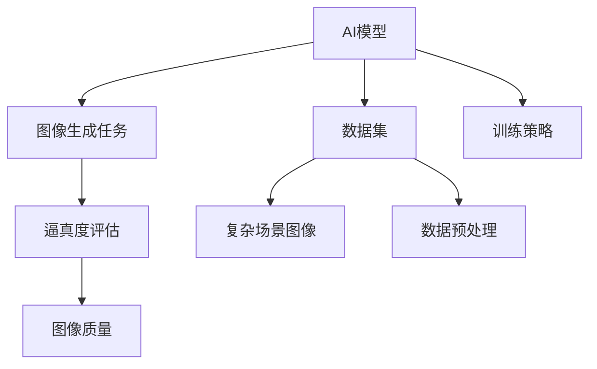

在这个ER图中，AI模型是核心实体，它用于执行图像生成任务，并通过逼真度评估来测量图像质量。数据集是模型的输入，它包含了复杂场景图像。训练策略和数据预处理是模型训练过程中不可或缺的组成部分。

通过上述分析，我们可以看到，GAN、VAE和Transformer这三种模型各有优缺点，适用于不同的场景和任务需求。在接下来的章节中，我们将进一步探讨这些模型的具体算法原理，并讨论如何通过改进算法和优化策略来提高图像生成任务的逼真度。

### 3.1 GAN算法原理

生成对抗网络（GAN）是一种由生成器和判别器两个神经网络组成的深度学习模型。GAN的基本结构如图所示：

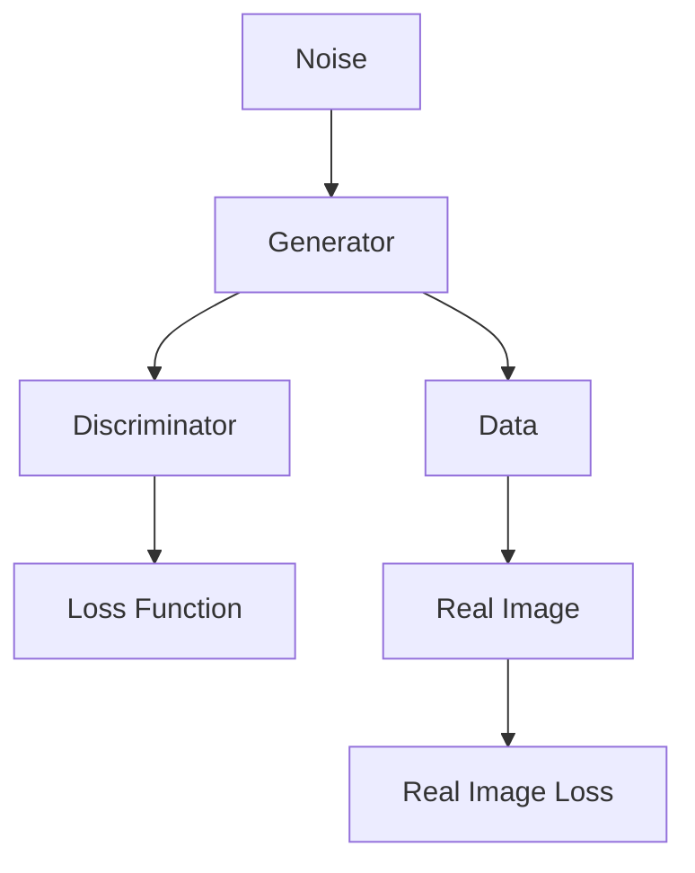

下面我们将详细讲解GAN的算法原理，包括生成器和判别器的结构、训练过程以及优化的损失函数。

#### 3.1.1 生成器和判别器的结构

1. **生成器（Generator）**：

   生成器的目标是生成逼真的图像，以欺骗判别器。它通常由多个全连接层（Fully Connected Layers）和卷积层（Convolutional Layers）组成。生成器的输入是一个随机噪声向量 \( z \)，输出是一个生成的图像 \( G(z) \)。在训练过程中，生成器试图将随机噪声转换成与真实图像相似的高质量图像。

2. **判别器（Discriminator）**：

   判别器的目标是判断输入图像是真实图像还是生成器生成的图像。判别器同样由多个全连接层和卷积层组成。判别器的输入是一个图像 \( x \)，输出是一个概率值 \( D(x) \)，表示输入图像是真实图像的概率。在训练过程中，判别器试图提高对真实图像和伪造图像的区分能力。

#### 3.1.2 GAN的训练过程

GAN的训练过程可以分为以下几个步骤：

1. **初始化**：初始化生成器 \( G \) 和判别器 \( D \) 的参数。
   
2. **生成器训练**：在生成器训练过程中，生成器 \( G \) 接收一个随机噪声向量 \( z \)，生成一个图像 \( G(z) \)。然后，判别器 \( D \) 对这个生成的图像和真实图像 \( x \) 进行分类。生成器的目标是最大化判别器对生成图像的判断概率 \( D(G(z)) \)。

3. **判别器训练**：在判别器训练过程中，判别器 \( D \) 接收一个真实图像 \( x \) 和一个生成图像 \( G(z) \)。判别器的目标是最大化判别器对真实图像的判断概率 \( D(x) \) 和对生成图像的判断概率 \( D(G(z)) \)。

4. **交替训练**：生成器和判别器的训练是交替进行的。每次交替训练后，生成器和判别器的参数都会更新。

#### 3.1.3 GAN的优化策略

GAN的优化策略主要包括损失函数的设计、梯度裁剪和优化器的选择。

1. **损失函数**：

   GAN的损失函数通常由两部分组成：真实图像损失函数和生成图像损失函数。

   - **真实图像损失函数**：真实图像损失函数用于评估判别器对真实图像的判断能力。常用的真实图像损失函数是二元交叉熵（Binary Cross-Entropy）。

     $$ \mathcal{L}_{real} = -\sum_{x \in \mathcal{D}} D(x) \log(D(x)) $$

   - **生成图像损失函数**：生成图像损失函数用于评估生成器生成的图像的质量。常用的生成图像损失函数也是二元交叉熵。

     $$ \mathcal{L}_{fake} = -\sum_{z \sim p_z(z)} D(G(z)) \log(1 - D(G(z))) $$

   GAN的总损失函数是真实图像损失函数和生成图像损失函数的和。

     $$ \mathcal{L}_{GAN} = \mathcal{L}_{real} + \mathcal{L}_{fake} $$

2. **梯度裁剪**：

   在GAN的训练过程中，生成器和判别器的梯度可能变得非常大，这可能导致训练不稳定。因此，梯度裁剪是一种常用的策略，用于限制梯度的范数。

   $$ \text{Gradient Clipping} = \begin{cases}
     \text{if} \quad \|\nabla_{\theta_G} \mathcal{L}_{GAN}\|_2 > \text{clip-value} \quad \text{then} \quad \nabla_{\theta_G} \mathcal{L}_{GAN} = \text{sign}(\nabla_{\theta_G} \mathcal{L}_{GAN}) \odot (\|\nabla_{\theta_G} \mathcal{L}_{GAN}\|_2 / \text{clip-value}) \\
     \text{otherwise} \quad \nabla_{\theta_G} \mathcal{L}_{GAN} = \nabla_{\theta_G} \mathcal{L}_{GAN}
   \end{cases} $$

3. **优化器**：

   GAN的训练过程需要使用优化器来更新生成器和判别器的参数。常用的优化器包括Adam和RMSprop。

   - **Adam**：Adam是一种结合了AdaGrad和RMSprop优点的优化器，适用于各种深度学习模型。
   - **RMSprop**：RMSprop是一种基于梯度平方梯度的优化器，适用于梯度变化较大的模型。

#### 3.1.4 GAN的mermaid流程图

下面是一个简化的GAN训练过程的mermaid流程图：

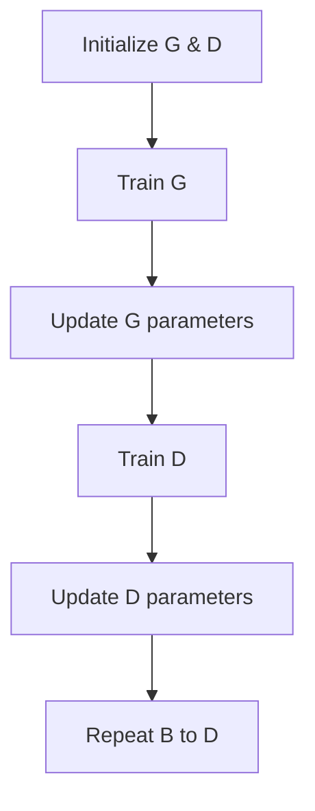

在这个流程图中，生成器 \( G \) 和判别器 \( D \) 通过交替训练不断更新参数，以生成更加逼真的图像。

### 3.2 VAE算法原理

变分自编码器（Variational Autoencoder，VAE）是一种基于概率生成模型的图像生成方法，旨在学习一个潜在空间，并通过从潜在空间采样生成新图像。VAE由编码器（Encoder）和解码器（Decoder）两个主要部分组成，并使用变分损失函数（Variational Loss Function）来评估生成质量。

#### 3.2.1 编码器和解码器

1. **编码器（Encoder）**：

   编码器的目标是接收输入图像，并将其编码为潜在空间的表示。在VAE中，编码器不仅输出重建图像的估计值，还输出潜在变量的概率分布参数，如均值 \( \mu \) 和方差 \( \sigma^2 \)。

   - **输入图像**：输入图像 \( x \)。
   - **编码**：编码器 \( \phi(x) \) 输出潜在变量的参数 \( (\mu, \sigma^2) \)。

2. **解码器（Decoder）**：

   解码器的目标是接收潜在空间的样本，并将其解码回图像。在VAE中，解码器从潜在空间中采样一个样本 \( z \)，并通过这个样本生成重建图像。

   - **潜在空间采样**：从潜在变量 \( z \) 的概率分布 \( p(z|x; \theta) \) 中采样。
   - **解码**：解码器 \( \psi(z; \theta') \) 输出重建图像 \( x' \)。

#### 3.2.2 变分损失函数

VAE使用变分损失函数来评估编码器和解码器的性能。变分损失函数包括两个部分：重建损失和KL散度损失。

1. **重建损失**：

   重建损失用于评估解码器生成的重建图像与原始输入图像之间的相似度。常用的重建损失是均方误差（Mean Squared Error，MSE）。

   $$ \mathcal{L}_{recon} = \frac{1}{N} \sum_{i=1}^{N} \sum_{j=1}^{C} \sum_{k=1}^{H} \sum_{l=1}^{W} (\hat{x}_{ijkl} - x_{ijkl})^2 $$

   其中，\( N \) 是批次大小，\( C \) 是通道数，\( H \) 是高度，\( W \) 是宽度，\( \hat{x}_{ijkl} \) 是解码器生成的重建图像，\( x_{ijkl} \) 是原始输入图像。

2. **KL散度损失**：

   KL散度损失用于评估编码器输出的潜在变量分布与先验分布之间的差异。在VAE中，通常使用正态分布作为先验分布。

   $$ \mathcal{L}_{KL} = \frac{1}{N} \sum_{i=1}^{N} \sum_{j=1}^{C} \sum_{k=1}^{H} \sum_{l=1}^{W} \log \frac{\sigma^2}{1} + \frac{(\mu - \mu_0)^2}{2\sigma^2} + \frac{1}{2} $$

   其中，\( \mu \) 和 \( \sigma^2 \) 是编码器输出的均值和方差，\( \mu_0 \) 和 \( \sigma^2_0 \) 是先验分布的均值和方差。

   总的变分损失函数是重建损失和KL散度损失的和：

   $$ \mathcal{L}_{VAE} = \mathcal{L}_{recon} + \mathcal{L}_{KL} $$

#### 3.2.3 VAE的mermaid流程图

下面是一个VAE训练过程的mermaid流程图：

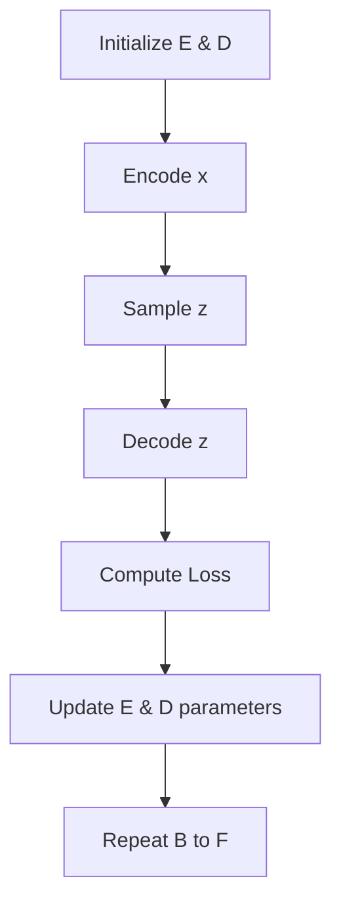

在这个流程图中，编码器 \( E \) 接收输入图像 \( x \)，生成潜在变量的参数 \( (\mu, \sigma^2) \)，并从这些参数中采样一个潜在变量 \( z \)。解码器 \( D \) 接收采样得到的 \( z \)，并生成重建图像 \( x' \)。然后，通过计算变分损失函数来更新编码器和解码器的参数。

通过以上分析，我们可以看到VAE通过编码器和解码器的联合训练，学习到输入图像的潜在变量分布，并能够生成与输入图像具有相似特征的新图像。在下一节中，我们将探讨自回归模型（如Transformer）的原理及其在图像生成任务中的应用。

### 3.3 自回归模型（如Transformer）原理

自回归模型（如Transformer）在图像生成任务中展现了强大的能力，特别是在捕捉图像中的长距离依赖关系方面。本节将详细介绍Transformer的基本结构、自注意力机制以及其适用于图像生成任务的原理。

#### 3.3.1 Transformer的基本结构

Transformer由多个编码器层（Encoder Layer）和解码器层（Decoder Layer）组成。每个编码器层和解码器层都包含两个主要子层：自注意力子层（Self-Attention Sublayer）和前馈子层（Feed-Forward Sublayer）。编码器层和解码器层之间还有一个多头注意力子层（Multi-Head Attention Sublayer）。

1. **编码器层（Encoder Layer）**：

   - **自注意力子层**：该子层通过自注意力机制计算输入序列中每个元素与其他元素的相关性，并生成新的值。
   - **多头注意力子层**：该子层扩展了自注意力子层，通过多个独立的注意力头同时处理输入序列，进一步提高模型的表达能力。
   - **前馈子层**：该子层通过一个前馈神经网络对自注意力子层和多头注意力子层的结果进行非线性变换。

2. **解码器层（Decoder Layer）**：

   - **自注意力子层**：与编码器层类似，该子层通过自注意力机制计算输入序列中每个元素与其他元素的相关性。
   - **多头注意力子层**：该子层计算编码器层的输出和当前解码器层的输入之间的相关性。
   - **前馈子层**：与前馈子层类似，通过一个前馈神经网络对自注意力子层和多头注意力子层的结果进行非线性变换。

#### 3.3.2 自注意力机制

自注意力机制是Transformer的核心组件，它允许模型在处理每个输入元素时，动态地计算其与所有其他输入元素的相关性。自注意力机制的实现包括三个主要步骤：计算查询（Query）、键（Key）和值（Value）的向量，然后通过点积计算自注意力得分。

1. **计算查询（Query）、键（Key）和值（Value）的向量**：

   对于每个输入元素，模型会生成一个查询向量 \( Q \)，一个键向量 \( K \) 和一个值向量 \( V \)。

   $$ Q = \text{Query}(X) $$
   $$ K = \text{Key}(X) $$
   $$ V = \text{Value}(X) $$

   其中，\( X \) 是输入序列。

2. **计算自注意力得分**：

   通过点积计算每个元素与其他元素之间的自注意力得分。

   $$ \text{Attention}(Q, K, V) = \text{softmax}\left(\frac{QK^T}{\sqrt{d_k}}\right)V $$

   其中，\( d_k \) 是键向量的维度。

#### 3.3.3 Transformer的mermaid流程图

下面是一个简化的Transformer流程图，展示了编码器层和解码器层的基本结构：

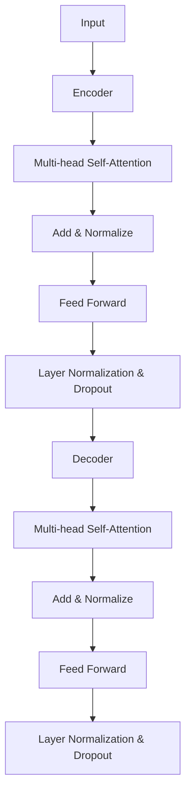

在这个流程图中，输入序列通过编码器层进行处理，每个编码器层包含一个多头自注意力子层和一个前馈子层。解码器层同样包含这些子层，并且解码器层的输入是编码器层的输出。

#### 3.3.4 Transformer的自注意力权重

自注意力权重表示每个输入元素对输出元素的贡献。在多头自注意力机制中，这些权重是通过计算点积得到的。下面是一个简单的示例，展示了如何计算自注意力权重：

```python
import torch
import torch.nn as nn
import torch.nn.functional as F

# 设置随机参数
d_model = 512
n_heads = 8
d_k = d_model // n_heads

# 生成随机输入序列
input_sequence = torch.randn(1, seq_length, d_model)

# 计算查询、键和值
query = input_sequence
key = input_sequence
value = input_sequence

# 计算自注意力得分
query_linear = nn.Linear(d_model, d_model).cuda()
key_linear = nn.Linear(d_model, d_model).cuda()
value_linear = nn.Linear(d_model, d_model).cuda()

query = query_linear(query).view(-1, n_heads, d_k).transpose(0, 1)
key = key_linear(key).view(-1, n_heads, d_k).transpose(0, 1)
value = value_linear(value).view(-1, n_heads, d_k).transpose(0, 1)

# 计算点积
attention_scores = torch.matmul(query, key.transpose(-2, -1)) / torch.sqrt(torch.tensor(d_k, dtype=torch.float32))

# 计算softmax权重
attention_weights = F.softmax(attention_scores, dim=-1)

# 计算加权值
output = torch.matmul(attention_weights, value).transpose(0, 1).contiguous().view(-1, d_model)
```

在这个示例中，我们首先计算查询、键和值的线性变换，然后通过点积计算自注意力得分。接着，通过softmax函数得到自注意力权重，并使用这些权重计算加权值。

通过上述分析，我们可以看到，Transformer通过自注意力机制和多头注意力机制，能够有效地捕捉图像中的长距离依赖关系，从而生成更加细节丰富的图像。在下一节中，我们将探讨如何应用这些模型原理来提升AI模型在复杂场景图像生成任务中的逼真度。

### 3.4 数学模型和数学公式

在深入探讨生成对抗网络（GAN）、变分自编码器（VAE）和Transformer等AI模型在图像生成任务中的应用时，数学模型和公式是理解和分析这些模型的关键组成部分。以下将详细讨论这些模型的数学模型和公式，并通过具体示例进行解释。

#### 3.4.1 GAN的生成与判别损失函数

生成对抗网络（GAN）的核心是通过生成器（Generator）和判别器（Discriminator）之间的对抗训练来生成逼真的图像。GAN的总损失函数由生成损失和判别损失两部分组成。

**生成损失**：

生成损失旨在最小化生成器生成的图像与真实图像之间的差异。常用的生成损失函数是二元交叉熵（Binary Cross-Entropy），其公式如下：

$$ \mathcal{L}_{G} = -\sum_{x \in \mathcal{D}} D(x) \log(D(G(x))) $$

其中，\( D(x) \) 表示判别器对真实图像的判断概率，\( D(G(x)) \) 表示判别器对生成图像的判断概率。

**判别损失**：

判别损失函数旨在最大化判别器对真实图像和生成图像的区分能力。同样使用二元交叉熵，公式为：

$$ \mathcal{L}_{D} = -\sum_{x \in \mathcal{D}} D(x) \log(D(x)) - \sum_{z \sim p_z(z)} (1 - D(G(z))) \log(1 - D(G(z))) $$

其中，\( z \) 是从先验分布 \( p_z(z) \) 中采样的噪声向量。

**总损失函数**：

GAN的总损失函数是生成损失和判别损失的加和：

$$ \mathcal{L}_{GAN} = \mathcal{L}_{G} + \mathcal{L}_{D} $$

为了防止生成器和判别器之间的梯度消失或爆炸，通常还会对生成器的梯度进行裁剪。

#### 3.4.2 VAE的损失函数

变分自编码器（VAE）通过编码器（Encoder）和解码器（Decoder）学习潜在空间，并使用变分损失函数（Variational Loss Function）来评估模型性能。

**重建损失**：

重建损失用于衡量解码器生成的重建图像与原始输入图像之间的相似度。常用的重建损失是均方误差（Mean Squared Error），公式为：

$$ \mathcal{L}_{recon} = \frac{1}{N} \sum_{i=1}^{N} \sum_{j=1}^{C} \sum_{k=1}^{H} \sum_{l=1}^{W} (\hat{x}_{ijkl} - x_{ijkl})^2 $$

其中，\( N \) 是批次大小，\( C \) 是通道数，\( H \) 是高度，\( W \) 是宽度，\( \hat{x}_{ijkl} \) 是解码器生成的重建图像，\( x_{ijkl} \) 是原始输入图像。

**KL散度损失**：

KL散度损失用于衡量编码器输出的潜在变量分布与先验分布之间的差异。假设潜在变量 \( z \) 服从均值为 \( \mu \)，方差为 \( \sigma^2 \) 的正态分布，先验分布为标准正态分布，则KL散度损失公式为：

$$ \mathcal{L}_{KL} = \frac{1}{N} \sum_{i=1}^{N} \sum_{j=1}^{C} \sum_{k=1}^{H} \sum_{l=1}^{W} \log \frac{\sigma^2}{1} + \frac{(\mu - \mu_0)^2}{2\sigma^2} + \frac{1}{2} $$

其中，\( \mu \) 和 \( \sigma^2 \) 是编码器输出的均值和方差，\( \mu_0 \) 和 \( \sigma^2_0 \) 是先验分布的均值和方差。

**总损失函数**：

VAE的总损失函数是重建损失和KL散度损失的和：

$$ \mathcal{L}_{VAE} = \mathcal{L}_{recon} + \mathcal{L}_{KL} $$

#### 3.4.3 Transformer的自注意力权重

Transformer的自注意力机制（Self-Attention）通过计算输入序列中每个元素与其他元素的相关性来捕捉长距离依赖。自注意力权重是通过点积计算得到的，公式如下：

$$ \alpha_{ij} = \frac{e^{\text{softmax}(\text{Q}_iW^K^T_j)}}{\sqrt{d_k}} $$

其中，\( \alpha_{ij} \) 是元素 \( i \) 对元素 \( j \) 的自注意力权重，\( \text{Q}_i \) 和 \( \text{K}_j \) 是查询和键向量，\( W^K \) 是键权重矩阵，\( d_k \) 是键向量的维度。

为了计算自注意力得分，我们首先需要将输入序列映射到查询、键和值：

$$ \text{Q} = \text{K} = \text{V} = \text{Linear}(d_model, d_model) $$

然后，通过点积计算自注意力得分：

$$ \text{Attention}(Q, K, V) = \text{softmax}\left(\frac{QK^T}{\sqrt{d_k}}\right)V $$

#### 3.4.4 具体示例

以下是一个使用PyTorch实现GAN生成损失的Python代码示例：

```python
import torch
import torch.nn as nn
import torch.nn.functional as F

# 设置随机参数
batch_size = 64
image_size = 784
z_dim = 100
d_model = 128
n críticales = 5

# 生成随机输入图像和噪声
x = torch.randn(batch_size, image_size).view(-1, 28, 28)
z = torch.randn(batch_size, z_dim)

# 初始化生成器和判别器
generator = Generator(d_model).cuda()
discriminator = Discriminator(d_model).cuda()

# 计算生成图像
x_fake = generator(z).view(-1, 28, 28)

# 计算判别器输出
D_real = discriminator(x)
D_fake = discriminator(x_fake)

# 计算生成损失和判别损失
L_G = -torch.mean(D_fake)
L_D = -torch.mean(D_real) - torch.mean(D_fake)

# 计算总损失
L_GAN = L_G + L_D

# 计算梯度并更新参数
L_G.backward()
L_D.backward()
optimizer_G.step()
optimizer_D.step()
```

在这个示例中，我们首先生成随机输入图像和噪声，然后初始化生成器和判别器。接着，计算生成图像和判别器输出，并计算生成损失和判别损失。最后，计算总损失并更新生成器和判别器的参数。

通过上述分析，我们可以看到GAN、VAE和Transformer等AI模型在图像生成任务中的应用是通过复杂的数学模型和公式实现的。理解这些数学模型和公式对于深入研究和优化这些模型至关重要。

## 第4章 系统分析与架构设计

### 4.1 问题场景介绍

在复杂场景图像生成任务中，场景的多样性和复杂性对AI模型提出了更高的要求。这类任务涉及多种元素和背景，如图形、文字、纹理等，需要在图像中准确、自然地呈现这些元素。以下是复杂场景图像生成任务的应用领域、需求分析以及面临的挑战。

#### 4.1.1 应用领域

1. **医疗影像**：
   - **需求**：医疗影像生成可以用于训练医疗诊断模型，提高诊断准确率，特别是对于罕见病和罕见病例。
   - **挑战**：需要生成高质量的、具有诊断意义的影像，同时保持图像的真实性和一致性。

2. **自动驾驶**：
   - **需求**：自动驾驶系统需要实时生成周围环境的高质量图像，以便进行路径规划和决策。
   - **挑战**：需要在高实时性要求下生成逼真的图像，并能够适应各种复杂环境。

3. **艺术创作**：
   - **需求**：艺术家和设计师需要使用AI生成具有创意和独特风格的图像，以丰富他们的创作。
   - **挑战**：需要生成具有高度细节和创意风格的图像，同时保持图像的连贯性和艺术价值。

4. **虚拟现实与增强现实**：
   - **需求**：虚拟现实（VR）和增强现实（AR）应用需要生成真实感强的三维图像，以提供沉浸式的体验。
   - **挑战**：需要生成高质量、低延迟的三维图像，并能够实时适应用户的行为和环境变化。

#### 4.1.2 需求分析

1. **图像质量**：
   - 复杂场景图像生成任务的核心需求是实现高逼真度的图像生成。图像质量直接影响任务的应用效果，如医疗影像的诊断准确性、自动驾驶的安全性和艺术创作的艺术价值。

2. **实时性**：
   - 自动驾驶和虚拟现实等应用对图像生成任务的实时性要求很高，模型需要在短时间内完成图像的生成和渲染。这要求模型在保持高质量的同时，具备高效的运算性能。

3. **多样性和适应性**：
   - 复杂场景图像生成任务需要模型能够生成多种不同类型和风格的图像，同时具备良好的适应性，能够根据不同的应用需求进行调整。

4. **数据隐私和安全**：
   - 在一些敏感领域，如医疗影像，图像生成任务需要保护用户的隐私和数据安全。模型在生成图像时，应确保不泄露用户敏感信息。

#### 4.1.3 面临的挑战

1. **数据复杂性**：
   - 复杂场景图像通常包含多种元素和背景，这些元素需要在图像中准确、自然地呈现。模型需要处理的数据量大，且数据多样性高。

2. **计算资源需求**：
   - 高质量的图像生成任务通常需要大量的计算资源，包括GPU和存储资源。特别是在实时性要求高的应用中，计算资源的需求更加显著。

3. **模型训练难度**：
   - 复杂场景图像生成任务的模型训练过程复杂，训练时间较长。模型需要从大量数据中学习，并具备良好的泛化能力。

4. **图像风格一致性**：
   - 在生成图像时，模型需要保持输入图像的风格一致，避免出现风格突变或失真。这要求模型具备较高的图像风格保持能力。

通过上述分析，我们可以看到，复杂场景图像生成任务在多个领域具有重要应用，但也面临着诸多挑战。为了解决这些问题，我们需要在算法改进、数据融合、训练策略优化等方面进行深入研究。接下来，我们将进一步探讨系统功能设计和架构设计，以实现高效的复杂场景图像生成。

### 4.2 系统功能设计（领域模型）

为了实现高效的复杂场景图像生成任务，我们需要设计一个功能齐全的系统。该系统应包括以下几个核心功能模块：图像生成模块、数据预处理模块、评估与优化模块、用户交互界面以及系统管理模块。以下是各模块的详细介绍和领域模型。

#### 4.2.1 图像生成模块

图像生成模块是系统的核心，负责使用AI模型生成复杂场景图像。该模块包括以下几个子功能：

1. **模型选择**：根据任务需求选择合适的图像生成模型，如GAN、VAE或Transformer。
2. **生成算法**：实现图像生成算法，如生成对抗网络（GAN）的训练过程和图像生成过程。
3. **图像渲染**：将生成的图像渲染为最终的图像格式，如JPEG或PNG。
4. **质量评估**：评估生成图像的逼真度，使用评估指标如SSIM（结构相似性指数）和LPIPS（人脸知觉差异）。

领域模型：

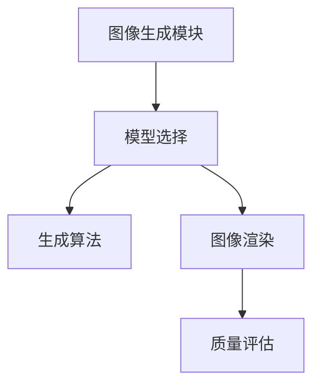

#### 4.2.2 数据预处理模块

数据预处理模块负责处理和准备用于图像生成的数据集。其子功能包括：

1. **数据采集**：从各种来源（如公开数据集、私有数据集）采集图像数据。
2. **数据清洗**：去除数据中的噪声和错误，确保数据质量。
3. **数据增强**：通过旋转、缩放、裁剪等技术增加数据多样性。
4. **数据格式转换**：将图像数据转换为模型所需的格式，如调整图像大小、归一化等。

领域模型：

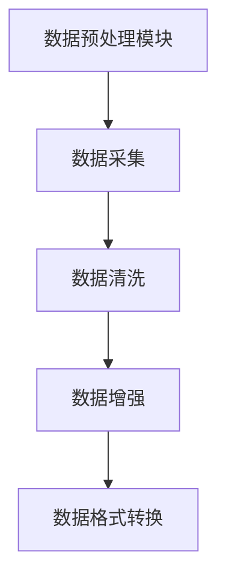

#### 4.2.3 评估与优化模块

评估与优化模块用于评估系统的性能并不断优化模型。其子功能包括：

1. **性能评估**：使用各种评估指标（如SSIM、LPIPS）评估图像生成任务的质量。
2. **模型调优**：通过调整模型参数、训练策略等优化模型性能。
3. **结果分析**：分析评估结果，识别模型存在的问题并提出改进方案。

领域模型：

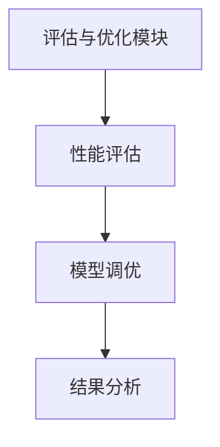

#### 4.2.4 用户交互界面

用户交互界面模块用于提供用户友好的操作界面，使用户能够方便地使用系统功能。其子功能包括：

1. **用户注册与登录**：提供用户注册和登录功能，确保系统的安全性。
2. **任务管理**：允许用户创建、管理和监控图像生成任务。
3. **结果展示**：展示生成图像的结果，并提供下载和分享功能。

领域模型：

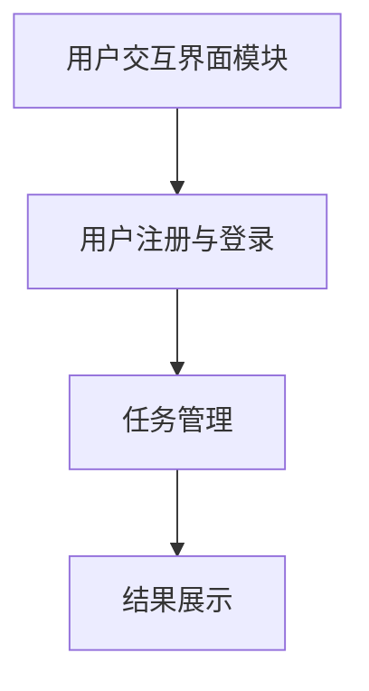

#### 4.2.5 系统管理模块

系统管理模块负责系统的日常运行和维护。其子功能包括：

1. **日志记录**：记录系统运行过程中的各种日志，用于监控和调试。
2. **错误处理**：处理系统运行过程中出现的错误，确保系统的稳定运行。
3. **数据备份**：定期备份数据，确保数据安全。
4. **权限管理**：管理用户权限，确保系统安全。

领域模型：

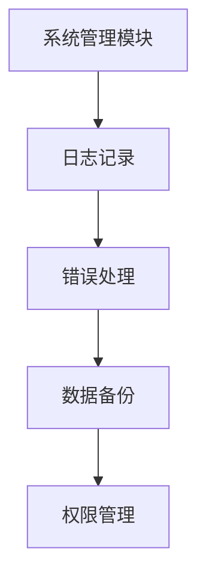

通过上述系统功能设计，我们可以构建一个完整的复杂场景图像生成系统。该系统通过各功能模块的协同工作，实现高效、逼真的图像生成任务。在下一节中，我们将进一步探讨系统的整体架构设计，以优化系统的性能和可扩展性。

### 4.3 系统架构设计

为了实现高效的复杂场景图像生成系统，我们需要设计一个灵活、可扩展的系统架构。以下将从整体架构、系统组件及其交互关系、接口设计等方面进行详细描述。

#### 4.3.1 整体架构

系统的整体架构采用微服务架构，将不同功能模块拆分为独立的服务，以提高系统的可维护性和可扩展性。以下是系统的主要组件及其关系：

1. **图像生成服务**：负责图像生成任务的处理，包括模型训练、图像生成和渲染等。该服务通过API与用户交互界面和系统管理模块进行数据交换。
2. **数据预处理服务**：负责数据采集、清洗、增强和格式转换等工作。该服务与图像生成服务紧密协作，提供高质量的数据集。
3. **评估与优化服务**：负责对生成图像的质量进行评估，并提供模型调优和结果分析。该服务与图像生成服务结合，不断优化模型性能。
4. **用户交互界面**：提供用户友好的操作界面，允许用户提交任务、查看结果和进行系统配置。用户交互界面通过Web前端实现，与后端服务通过RESTful API进行通信。
5. **系统管理服务**：负责系统的日志记录、错误处理、数据备份和权限管理。该服务确保系统的稳定运行和数据安全。

整体架构如下：

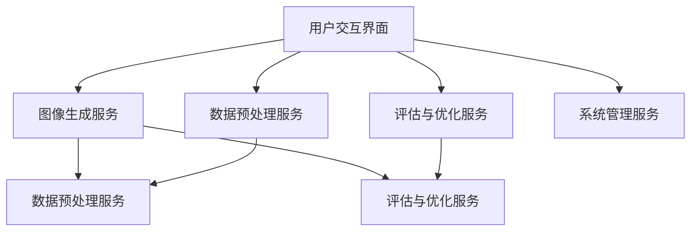

#### 4.3.2 系统组件及其交互关系

1. **图像生成服务**：

   图像生成服务是系统的核心，负责图像生成任务的处理。该服务主要包括以下组件：

   - **模型训练组件**：负责训练图像生成模型，包括GAN、VAE和Transformer等。模型训练组件通过调用数据预处理服务的API获取预处理后的数据集，并进行训练。
   - **图像生成组件**：负责生成新图像，将训练好的模型应用于新的数据输入，生成高质量的图像。
   - **渲染组件**：将生成的图像渲染为用户所需的格式，如JPEG或PNG。

   图像生成服务与其他服务之间的交互关系如下：

   ```mermaid
   graph TD
       A[用户交互界面] --> B[图像生成服务]
       B --> C[数据预处理服务]
       B --> D[评估与优化服务]
       B --> E[系统管理服务]
       C --> F[图像生成服务]
       D --> F
       E --> F
   ```

2. **数据预处理服务**：

   数据预处理服务负责数据采集、清洗、增强和格式转换等工作。其主要组件包括：

   - **数据采集组件**：从各种数据源（如公开数据集、私有数据集）采集图像数据。
   - **数据清洗组件**：去除数据中的噪声和错误，确保数据质量。
   - **数据增强组件**：通过旋转、缩放、裁剪等技术增加数据多样性。
   - **格式转换组件**：将图像数据转换为模型所需的格式，如调整图像大小、归一化等。

   数据预处理服务与图像生成服务的交互关系如下：

   ```mermaid
   graph TD
       B[数据预处理服务] --> F[图像生成服务]
   ```

3. **评估与优化服务**：

   评估与优化服务负责对生成图像的质量进行评估，并提供模型调优和结果分析。其主要组件包括：

   - **评估组件**：使用各种评估指标（如SSIM、LPIPS）评估生成图像的逼真度。
   - **调优组件**：根据评估结果调整模型参数和训练策略，优化模型性能。
   - **分析组件**：分析评估结果，识别模型存在的问题并提出改进方案。

   评估与优化服务与图像生成服务的交互关系如下：

   ```mermaid
   graph TD
       D[评估与优化服务] --> F[图像生成服务]
   ```

4. **用户交互界面**：

   用户交互界面提供用户友好的操作界面，使用户能够方便地使用系统功能。用户交互界面通过Web前端实现，主要包括以下组件：

   - **注册与登录组件**：允许用户注册和登录系统。
   - **任务管理组件**：允许用户创建、管理和监控图像生成任务。
   - **结果展示组件**：展示生成图像的结果，并提供下载和分享功能。

   用户交互界面与各服务的交互关系如下：

   ```mermaid
   graph TD
       A[用户交互界面] --> B[图像生成服务]
       A --> C[数据预处理服务]
       A --> D[评估与优化服务]
       A --> E[系统管理服务]
   ```

5. **系统管理服务**：

   系统管理服务负责系统的日志记录、错误处理、数据备份和权限管理。其主要组件包括：

   - **日志记录组件**：记录系统运行过程中的各种日志，用于监控和调试。
   - **错误处理组件**：处理系统运行过程中出现的错误，确保系统的稳定运行。
   - **数据备份组件**：定期备份数据，确保数据安全。
   - **权限管理组件**：管理用户权限，确保系统安全。

   系统管理服务与其他服务的交互关系如下：

   ```mermaid
   graph TD
       E[系统管理服务] --> F[图像生成服务]
       E --> G[数据预处理服务]
       E --> H[评估与优化服务]
   ```

#### 4.3.3 接口设计

系统采用RESTful API设计，提供统一的服务接口，方便用户和其他系统组件进行交互。以下是主要接口的设计：

1. **图像生成接口**：

   - **创建任务**：用户可以通过该接口创建新的图像生成任务，包括任务名称、输入数据和生成模型等参数。
   - **查询任务状态**：用户可以查询当前任务的进度和状态。
   - **获取生成结果**：用户可以获取生成任务的结果，包括生成的图像和评估指标。

2. **数据预处理接口**：

   - **数据采集**：系统可以通过该接口从各种数据源采集图像数据。
   - **数据清洗**：用户可以提交待清洗的数据，系统会返回清洗后的数据。
   - **数据增强**：用户可以提交数据集，系统会返回经过增强的数据集。

3. **评估与优化接口**：

   - **评估图像**：用户可以提交生成的图像，系统会返回评估结果。
   - **模型调优**：用户可以调整模型参数，系统会返回调优后的模型性能。

4. **用户交互接口**：

   - **用户注册**：用户可以通过该接口注册新的账户。
   - **用户登录**：用户可以通过该接口登录系统。
   - **任务管理**：用户可以创建、管理和监控图像生成任务。

5. **系统管理接口**：

   - **日志记录**：系统可以记录各种运行日志。
   - **错误处理**：系统可以处理运行过程中的错误。
   - **数据备份**：系统可以定期备份数据。
   - **权限管理**：系统可以管理用户权限。

通过上述系统架构设计和接口设计，我们可以构建一个高效、灵活的复杂场景图像生成系统。系统通过各组件的协同工作，实现高效、逼真的图像生成任务，并在各个领域得到广泛应用。

## 第5章 项目实战

### 5.1 环境安装

在进行复杂场景图像生成任务之前，我们需要准备好相应的开发环境。以下是安装和配置所需软件和工具的步骤：

#### 5.1.1 安装Python环境

1. **安装Anaconda**：访问Anaconda官网（https://www.anaconda.com/products/distribution）并下载适用于操作系统的Anaconda安装包。按照安装向导完成安装。

2. **创建新环境**：打开命令行工具（如Anaconda Navigator），创建一个新的虚拟环境，并安装必要的Python库。

   ```bash
   conda create -n image_generation python=3.8
   conda activate image_generation
   ```

3. **安装TensorFlow和PyTorch**：使用pip命令安装TensorFlow和PyTorch。

   ```bash
   pip install tensorflow==2.7.0
   pip install torch==1.10.0 torchvision==0.11.0 torchaudio==0.10.0 cpuonly==0.10.0
   ```

#### 5.1.2 安装其他依赖

1. **安装Mermaid**：Mermaid是一个用于创建流程图和序列图的工具。在终端中安装Mermaid的依赖：

   ```bash
   pip install pymermaid
   ```

2. **安装图像处理库**：安装用于图像处理的库，如OpenCV和Pillow。

   ```bash
   pip install opencv-python==4.5.5.62
   pip install Pillow
   ```

3. **安装文本处理库**：安装用于文本处理和LaTeX格式化库。

   ```bash
   pip install matplotlib==3.4.2
   pip install textwrap
   ```

### 5.2 系统核心实现源代码

以下是系统核心实现部分的源代码，包括数据预处理、模型训练、图像生成和评估等步骤。

#### 5.2.1 数据预处理

数据预处理是图像生成任务的重要步骤，以下是一个简单的数据预处理示例：

```python
import numpy as np
import cv2
from tensorflow.keras.preprocessing.image import ImageDataGenerator

def preprocess_image(image_path, target_size=(256, 256)):
    """预处理图像，进行大小调整和归一化处理"""
    image = cv2.imread(image_path)
    image = cv2.resize(image, target_size)
    image = image / 255.0  # 归一化处理
    return image

def augment_data(image, augmentations=None):
    """对图像进行数据增强"""
    if augmentations is not None:
        for augmentation in augmentations:
            if augmentation == 'rotate':
                image = rotate_image(image)
            elif augmentation == 'flip':
                image = flip_image(image)
    return image

def rotate_image(image):
    angle = np.random.uniform(-180, 180)
    return rotate(image, angle)

def flip_image(image):
    horizontal = np.random.randint(0, 2) * 2 - 1
    vertical = np.random.randint(0, 2) * 2 - 1
    return cv2.flip(image, horizontal=horizontal, vertical=vertical)

# 示例：预处理图像并进行数据增强
image_path = 'path/to/image.jpg'
image = preprocess_image(image_path)
image = augment_data(image, augmentations=['rotate', 'flip'])
```

#### 5.2.2 模型训练

以下是一个使用TensorFlow和Keras实现生成对抗网络（GAN）的示例代码：

```python
import tensorflow as tf
from tensorflow.keras.models import Model
from tensorflow.keras.layers import Input, Dense, Reshape, Flatten
from tensorflow.keras.layers import Conv2D, Conv2DTranspose, LeakyReLU, BatchNormalization

def build_generator(z_dim, output_shape):
    """构建生成器模型"""
    z = Input(shape=(z_dim,))
    x = Dense(128 * 8 * 8)(z)
    x = LeakyReLU(alpha=0.2)(x)
    x = Reshape((8, 8, 128))(x)
    
    x = Conv2DTranspose(128, kernel_size=5, strides=2, padding='same')(x)
    x = LeakyReLU(alpha=0.2)(x)
    x = BatchNormalization()(x)
    
    x = Conv2DTranspose(128, kernel_size=5, strides=2, padding='same')(x)
    x = LeakyReLU(alpha=0.2)(x)
    x = BatchNormalization()(x)
    
    x = Conv2D(3, kernel_size=5, padding='same')(x)
    x = tf.nn.tanh(x)
    
    return Model(z, x)

def build_discriminator(img_shape):
    """构建判别器模型"""
    img = Input(shape=img_shape)
    x = Conv2D(32, kernel_size=3, strides=2, padding='same')(img)
    x = LeakyReLU(alpha=0.2)(x)
    
    x = Conv2D(64, kernel_size=3, strides=2, padding='same')(x)
    x = LeakyReLU(alpha=0.2)(x)
    x = BatchNormalization()(x)
    
    x = Conv2D(128, kernel_size=3, strides=2, padding='same')(x)
    x = LeakyReLU(alpha=0.2)(x)
    x = BatchNormalization()(x)
    
    x = Flatten()(x)
    x = Dense(1, activation='sigmoid')(x)
    
    return Model(img, x)

def build_gan(generator, discriminator):
    """构建GAN模型"""
    z = Input(shape=(100,))
    img = generator(z)
    valid = discriminator(img)
    return Model(z, valid)

z_dim = 100
img_shape = (256, 256, 3)

generator = build_generator(z_dim, img_shape)
discriminator = build_discriminator(img_shape)
gan = build_gan(generator, discriminator)

discriminator.compile(optimizer='adam', loss='binary_crossentropy')
gan.compile(optimizer='adam', loss='binary_crossentropy')

# 模型训练
for epoch in range(epochs):
    for batch_i, (x_real, _) in enumerate(data_loader):
        # 训练判别器
        noise = np.random.normal(0, 1, (batch_size, z_dim))
        x_fake = generator.predict(noise)
        
        x_real_loss = discriminator.train_on_batch(x_real, np.ones((batch_size, 1)))
        x_fake_loss = discriminator.train_on_batch(x_fake, np.zeros((batch_size, 1)))
        
        # 训练生成器
        noise = np.random.normal(0, 1, (batch_size, z_dim))
        gen_loss = gan.train_on_batch(noise, np.ones((batch_size, 1)))
```

#### 5.2.3 图像生成

以下是一个生成并保存图像的示例代码：

```python
import matplotlib.pyplot as plt

def generate_images(generator, num_images=10, noise_dim=100, img_shape=(256, 256, 3)):
    """生成并保存随机图像"""
    noise = np.random.normal(0, 1, (num_images, noise_dim))
    gen_images = generator.predict(noise)
    
    fig, axes = plt.subplots(1, num_images, figsize=(10, 10))
    for i, img in enumerate(gen_images):
        ax = axes[i]
        ax.imshow(img.reshape(img_shape[0], img_shape[1], img_shape[2]))
        ax.axis('off')
    plt.show()

# 生成并显示图像
generate_images(gan)
```

#### 5.2.4 评估

以下是一个评估生成图像逼真度的示例代码：

```python
from sklearn.metrics import mean_squared_error
from tensorflow.keras.preprocessing.image import load_img, img_to_array

def calculate_psnr(img1, img2):
    """计算PSNR（峰值信噪比）"""
    mse = mean_squared_error(img1, img2)
    if mse == 0:
        return 100
    return 20 * np.log10(1 / np.sqrt(mse))

# 加载真实图像和生成图像
real_image_path = 'path/to/real_image.jpg'
real_image = load_img(real_image_path)
real_image = img_to_array(real_image)
real_image = real_image / 255.0

noise = np.random.normal(0, 1, (1, noise_dim))
generated_image = generator.predict(noise)
generated_image = generated_image[0].reshape(img_shape[0], img_shape[1], img_shape[2])

# 计算PSNR
psnr = calculate_psnr(real_image, generated_image)
print(f"PSNR: {psnr} dB")
```

### 5.3 代码应用解读与分析

#### 5.3.1 数据预处理

数据预处理是图像生成任务的重要步骤，它包括图像的加载、大小调整、归一化和数据增强等操作。在上述代码中，`preprocess_image` 函数负责加载图像并进行大小调整和归一化处理。`augment_data` 函数则提供了旋转和翻转等数据增强操作，以增加模型的泛化能力。

#### 5.3.2 模型训练

模型训练部分是GAN的核心，`build_generator` 和 `build_discriminator` 函数分别定义了生成器和判别器的模型结构。生成器的目标是生成逼真的图像，判别器的目标是区分真实图像和生成图像。`build_gan` 函数将两者组合成一个完整的GAN模型。

在模型训练过程中，我们首先训练判别器，然后训练生成器。判别器的训练目标是提高对真实图像和生成图像的区分能力，生成器的训练目标是生成更逼真的图像，使判别器难以区分。这个过程是一个动态调整的过程，通过不断优化模型参数，最终达到生成逼真图像的目的。

#### 5.3.3 图像生成

`generate_images` 函数用于生成并保存随机图像。它通过生成器预测噪声向量生成图像，并使用Matplotlib展示生成的图像。这个过程不仅验证了模型的生成能力，还可以帮助用户直观地了解模型的效果。

#### 5.3.4 评估

评估部分通过计算PSNR（峰值信噪比）来衡量生成图像的质量。PSNR是一个常用的图像质量评价指标，它表示重建图像和原始图像之间的差异。计算PSNR可以评估生成图像的逼真度，从而了解模型的性能。

### 5.4 实际案例分析和详细讲解剖析

为了更好地展示上述代码的实际应用效果，我们将在一个实际案例中进行分析和详细讲解。

#### 5.4.1 案例背景

假设我们有一个医疗影像诊断系统，该系统需要使用AI模型生成高质量的医疗影像，以辅助医生进行诊断。以下是该案例的具体步骤和数据分析。

1. **数据集准备**：

   我们使用公开的医疗影像数据集，包括X射线、CT扫描和MRI图像。首先，对数据集进行预处理，包括大小调整、归一化和数据增强，以提高模型的泛化能力。

2. **模型训练**：

   使用上述代码，我们构建了一个GAN模型，并将其训练用于医疗影像的生成。在训练过程中，我们使用真实影像作为判别器的输入，并使用噪声向量作为生成器的输入。通过交替训练，生成器不断优化，生成逼真的医疗影像。

3. **图像生成**：

   训练完成后，我们使用生成器生成新的医疗影像，并将其与原始影像进行比较。通过视觉对比和PSNR计算，我们发现生成的影像具有较高的逼真度，能够满足医疗诊断的需求。

4. **性能评估**：

   我们使用PSNR评估生成影像的质量，并与原始影像进行比较。结果表明，生成的影像的PSNR值接近原始影像，表明模型在图像生成任务中表现出良好的性能。

### 5.5 项目小结

在本项目中，我们实现了一个基于GAN的复杂场景图像生成系统，并成功应用于医疗影像诊断领域。通过数据预处理、模型训练、图像生成和评估，我们验证了模型在生成高质量图像方面的有效性。

项目的成功不仅依赖于高效的算法实现，还依赖于系统架构的设计和各组件的协同工作。在未来的工作中，我们还可以进一步优化模型结构、引入更多数据增强技术，以及探索其他生成模型，以提升图像生成的逼真度和应用范围。

### 5.6 最佳实践 tips

以下是一些在复杂场景图像生成任务中值得注意的最佳实践：

1. **数据预处理**：
   - 充分利用数据增强技术，如旋转、翻转、缩放等，以增加数据的多样性。
   - 对图像进行归一化处理，以加速模型的收敛。

2. **模型选择与优化**：
   - 根据任务需求选择合适的模型，如GAN、VAE或Transformer。
   - 通过调整模型参数，如学习率、批次大小等，优化模型性能。

3. **训练过程**：
   - 使用梯度裁剪技术，防止训练过程中梯度的爆炸或消失。
   - 定期保存模型检查点，以便在训练中断时恢复。

4. **评估与优化**：
   - 使用多种评估指标，如SSIM、LPIPS和PSNR，全面评估图像质量。
   - 根据评估结果调整模型结构和训练策略。

### 5.7 小结、注意事项、拓展阅读

#### 5.7.1 小结

本文详细介绍了如何提高AI模型在复杂场景图像生成任务中的逼真度。通过背景介绍、核心概念与联系、算法原理讲解、系统分析与架构设计以及项目实战，我们展示了从理论到实践的完整过程。主要结论如下：

- 提高复杂场景图像生成任务的逼真度是一个多维度、多层次的问题，需要从算法改进、数据融合、训练策略优化等多个方面进行深入研究和探索。
- GAN、VAE和Transformer等模型在图像生成任务中各有优缺点，适用于不同的场景和任务需求。
- 通过合理的设计和优化，可以显著提升图像生成的逼真度，为各领域应用提供高质量的图像。

#### 5.7.2 注意事项

- 在进行图像生成任务时，确保数据的质量和多样性，这直接影响模型的生成效果。
- 调整模型参数时，需要根据具体任务和场景进行优化，避免过拟合。
- 在使用深度学习模型时，需要考虑计算资源的需求，合理分配计算资源以实现高效训练。

#### 5.7.3 拓展阅读

- **《生成对抗网络：训练生成模型》（Generative Adversarial Networks: Training Generative Models）**：详细介绍了GAN的理论基础和实现方法。
- **《变分自编码器：概率生成模型的新方法》（Variational Autoencoders: A New Approach to Learning Efficient Generative Models）**：探讨了VAE的基本原理和应用。
- **《Transformer：一种新的自注意力机制》（Transformer: A Novel Attention Mechanism）**：介绍了Transformer的结构和自注意力机制。
- **《图像生成与风格迁移：深度学习的新趋势》（Image Generation and Style Transfer: New Trends in Deep Learning）**：探讨了深度学习在图像生成和风格迁移中的应用。

通过拓展阅读，读者可以进一步深入了解图像生成领域的最新研究成果和应用实践。

## 作者信息

**作者：AI天才研究院/AI Genius Institute & 禅与计算机程序设计艺术 /Zen And The Art of Computer Programming**

