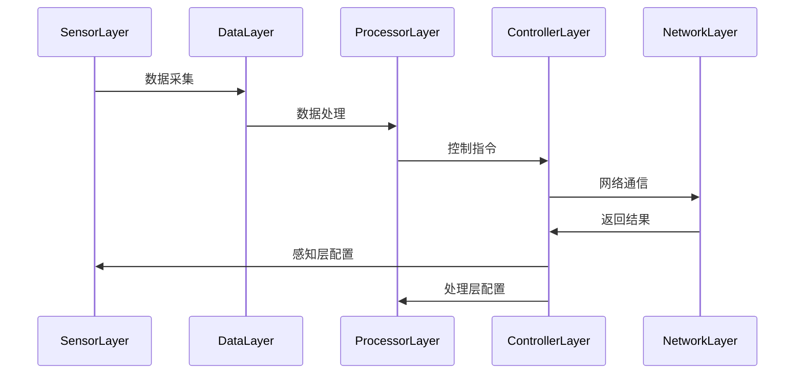

                 

### 提高AI模型在复杂场景物体追踪中的实时性能

随着人工智能技术的快速发展，AI模型在物体追踪领域得到了广泛应用。然而，在复杂场景下，由于光线变化、遮挡、物体运动速度变化等因素的影响，AI模型的实时性能往往受到很大挑战。本文将深入探讨如何提高AI模型在复杂场景物体追踪中的实时性能，并提出一系列优化方法。

本文将从以下几个方面展开讨论：

1. **问题背景**：介绍AI模型在物体追踪领域的发展背景，以及复杂场景下物体追踪面临的挑战。
2. **AI模型在物体追踪中的应用**：介绍AI模型在物体追踪中的基本原理和应用流程，以及复杂场景下物体追踪的挑战。
3. **算法优化**：探讨如何通过改进目标检测算法、引入多模态信息和深度学习模型来提高实时性能。
4. **深度学习模型的应用**：深入分析深度学习模型在物体追踪中的实现方法和优化策略。
5. **多模态信息的应用**：探讨多模态信息在物体追踪中的应用，以及如何融合多模态信息来提高实时性能。
6. **系统分析与架构设计**：介绍一个实际案例，分析系统功能设计和架构设计，以及系统的接口设计和交互流程。
7. **项目实战**：通过一个具体项目，展示如何在实际环境中实现和提高AI模型的实时性能。
8. **最佳实践**：总结一些最佳实践技巧，并给出注意事项和拓展阅读建议。

通过对上述方面的深入分析和讨论，我们希望能够为研究人员和开发者提供有价值的参考和启示，从而提高AI模型在复杂场景物体追踪中的实时性能。

### 问题背景

#### 1.1 问题背景

随着人工智能技术的快速发展，物体追踪领域得到了广泛关注和应用。物体追踪是指通过图像或视频数据，对目标物体进行定位和跟踪的过程。在自动驾驶、视频监控、机器人导航等众多领域，物体追踪技术都发挥着重要作用。然而，在复杂场景下，物体追踪面临着诸多挑战。

物体追踪系统通常依赖于人工智能模型，如目标检测模型和跟踪模型，通过分析图像或视频数据，实现对目标物体的定位和跟踪。这些模型在简单场景下表现出色，但在复杂场景中，如光线变化、遮挡、物体运动速度变化等情况下，实时性能往往受到影响。具体来说，这些问题主要表现在以下几个方面：

1. **光线变化**：在不同的光线条件下，图像的亮度和对比度会发生变化，这会对目标检测和跟踪造成干扰。例如，在强光照射下，图像可能会出现过曝现象，使得目标难以检测；而在夜晚或光线较暗的环境中，图像可能过于暗淡，影响目标检测的准确性。
   
2. **遮挡问题**：在复杂场景中，目标物体可能会被其他物体遮挡，导致模型无法正确检测和跟踪目标。例如，在自动驾驶场景中，前方车辆或其他障碍物可能会遮挡行人或自行车，使得追踪系统难以区分和定位这些目标。

3. **物体运动速度变化**：在物体运动速度变化较大的场景中，如高速行驶的车辆或快速移动的行人，模型需要快速适应物体的运动状态，否则可能会导致跟踪失败或定位误差增大。

#### 1.2 问题描述

为了提高物体追踪系统的实时性能，研究人员和开发者们提出了多种方法，如改进目标检测算法、引入多模态信息、使用深度学习模型等。这些方法在一定程度上提高了物体追踪系统的性能，但仍然面临以下问题：

1. **实时性能不足**：许多传统算法在处理复杂场景时，计算量大、速度慢，导致实时性能不足。例如，基于滑窗法的目标检测算法，在处理高分辨率图像时，计算量巨大，难以满足实时处理的需求。

2. **跟踪精度降低**：在复杂场景下，由于光线变化、遮挡等因素的影响，跟踪系统的精度会降低。这会导致跟踪失败或定位误差增大，从而影响系统的可靠性。

3. **多模态信息融合困难**：引入多模态信息，如图像、声音、雷达数据等，可以提高物体追踪系统的性能。然而，如何有效地融合多模态信息，是一个具有挑战性的问题。

#### 1.3 问题解决

为了解决上述问题，研究人员和开发者们提出了一系列优化方法，如：

1. **改进目标检测算法**：通过使用更快、更准确的检测算法，如基于深度学习的YOLO、SSD等模型，提高目标检测的速度和准确性。

2. **引入多模态信息**：利用多模态信息，如图像、声音、雷达数据等，提高物体追踪系统的性能。

3. **使用深度学习模型**：深度学习模型具有强大的表示能力和自适应能力，通过设计合适的网络结构，可以实现高效的目标检测和跟踪。

4. **实时性能优化**：通过算法优化、硬件加速等技术手段，提高系统的实时性能。

#### 1.4 边界与外延

本文主要关注如何提高AI模型在复杂场景物体追踪中的实时性能，而不涉及其他非实时性能方面的优化。同时，本文将重点关注物体的二维追踪问题，不包括三维物体追踪。

#### 1.5 概念结构与核心要素组成

本研究涉及以下几个核心概念：

- **AI模型**：用于物体追踪的人工智能模型，包括目标检测模型和跟踪模型。
- **复杂场景**：指对物体追踪产生影响的场景，如光线变化、遮挡、物体运动速度变化等。
- **实时性能**：AI模型在给定时间内完成物体追踪任务的能力。
- **跟踪精度**：AI模型在物体追踪过程中，对目标物体的定位精度。

通过上述对问题背景的深入分析，我们可以更好地理解物体追踪在复杂场景下所面临的挑战，以及如何通过优化算法和提高模型性能来解决这些问题。

### AI模型在物体追踪中的应用

#### 2.1 AI模型在物体追踪中的基本原理

AI模型在物体追踪中的应用主要包括目标检测模型和跟踪模型。这两个模型相互协作，共同实现物体追踪的任务。

**2.1.1 目标检测模型**

目标检测模型是物体追踪的基础。它的主要任务是在图像或视频帧中检测出目标物体的位置和类别。目前，深度学习模型在目标检测领域取得了显著的进展，如YOLO（You Only Look Once）、SSD（Single Shot MultiBox Detector）和Faster R-CNN（Region-based Convolutional Neural Network）等。

- **YOLO**：YOLO是一种端到端的检测模型，其核心思想是将目标检测任务转化为一个单一的神经网络输出。YOLO将图像划分为网格，每个网格预测多个边界框及其类别概率。虽然YOLO在速度上具有优势，但在小目标和复杂场景中的检测精度仍有待提高。

- **SSD**：SSD是在YOLO的基础上发展起来的，它使用多个尺度先验框来检测不同尺寸的目标。SSD在速度和精度之间取得了较好的平衡，适用于多种场景。

- **Faster R-CNN**：Faster R-CNN是一种基于区域建议的区域检测模型，其核心是使用Region Proposal Network（RPN）生成目标候选区域，然后通过分类网络对这些区域进行分类。Faster R-CNN在精度上表现较好，但计算量较大，不适合实时应用。

**2.1.2 跟踪模型**

跟踪模型的主要任务是跟踪已经检测到的目标物体。跟踪模型通常依赖于目标检测模型的检测结果，通过关联连续帧中的目标，实现对目标物体的持续跟踪。常见的跟踪算法包括光流法、粒子滤波法、基于关联的跟踪算法和基于深度学习的跟踪算法。

- **光流法**：光流法是一种基于图像像素运动的方法，通过计算像素点在连续帧之间的运动轨迹来跟踪目标。光流法计算简单，但在处理快速运动目标和遮挡时效果不佳。

- **粒子滤波法**：粒子滤波法是一种基于概率的方法，通过模拟大量粒子来估计目标的位置。粒子滤波法在处理遮挡和快速运动目标时表现较好，但计算量较大。

- **基于关联的跟踪算法**：基于关联的跟踪算法通过比较连续帧中目标检测框的位置关系来跟踪目标。这种算法计算量相对较小，但在处理遮挡和快速运动目标时效果较差。

- **基于深度学习的跟踪算法**：基于深度学习的跟踪算法利用深度学习模型来预测目标在连续帧中的位置。如DeepSORT和Centernet等算法，通过结合目标检测和光流法，提高了跟踪的精度和速度。

**2.1.3 AI模型在物体追踪中的应用流程**

物体追踪通常分为以下几个步骤：

1. **目标检测**：在图像或视频帧中使用目标检测模型检测出目标物体的位置和类别。

2. **目标关联**：将检测到的目标与之前帧中的目标进行关联，以确定目标的轨迹。

3. **目标跟踪**：根据目标关联的结果，使用跟踪模型对目标物体进行跟踪，以预测其在后续帧中的位置。

4. **目标输出**：将跟踪的结果输出，包括目标的位置、速度、方向等信息。

通过上述应用流程，AI模型可以在物体追踪中实现高效的目标检测和跟踪，从而满足实际应用的需求。

#### 2.2 复杂场景下物体追踪的挑战

在复杂场景下，物体追踪面临诸多挑战，这些挑战源于光线变化、遮挡、物体运动速度变化等因素。以下将详细分析这些挑战：

**2.2.1 光线变化的影响**

光线变化是复杂场景中的一个重要因素，它会影响图像的亮度和对比度，从而影响目标检测和跟踪的准确性。具体来说：

- **强光照射**：在强光照射下，图像可能会出现过曝现象，导致目标物体难以检测。例如，在正午的阳光照射下，图像中的物体可能会变得过于亮白，使得目标难以区分。

- **光线较暗**：在光线较暗的环境中，图像可能过于暗淡，影响目标检测的准确性。例如，在夜晚或低光环境中，图像中的物体可能难以被检测到，从而影响追踪效果。

- **阴影和反射**：阴影和反射会干扰目标检测和跟踪。例如，物体背后的阴影可能会与目标物体混淆，而水面或其他光滑表面的反射也可能会产生虚假的目标。

**2.2.2 遮挡问题**

遮挡问题是复杂场景中另一个常见的问题，它会干扰目标检测和跟踪，导致跟踪失败或定位误差增大。具体来说：

- **部分遮挡**：目标物体的一部分被遮挡时，会使得目标检测困难。例如，在自动驾驶场景中，如果前方车辆遮挡了行人的一部分，那么行人检测的准确性会降低。

- **完全遮挡**：当目标物体被完全遮挡时，跟踪系统将无法检测到目标。例如，在行人穿越繁忙街道的场景中，如果行人被行驶的车辆完全遮挡，那么行人跟踪系统将无法追踪到行人。

- **遮挡变化**：遮挡物的移动会导致遮挡状态的变化，从而影响跟踪效果。例如，在自动驾驶场景中，车辆之间的遮挡会导致行人的轨迹发生变化，需要跟踪系统快速适应这种变化。

**2.2.3 物体运动速度变化的影响**

物体运动速度变化是复杂场景中的另一个重要因素，它会影响跟踪系统的实时性和准确性。具体来说：

- **快速运动**：在快速运动的目标场景中，如赛车比赛或足球比赛，目标物体的速度变化剧烈。跟踪系统需要快速响应这些变化，否则可能会导致跟踪失败。

- **速度变化**：目标物体的速度变化也会影响跟踪效果。例如，在自动驾驶场景中，车辆从静止加速到高速行驶，跟踪系统需要适应这种速度变化，否则可能会导致定位误差增大。

- **动态场景**：在动态场景中，如交通监控，目标物体的速度和方向变化频繁。跟踪系统需要实时适应这些变化，以确保跟踪的准确性。

综上所述，光线变化、遮挡和物体运动速度变化是复杂场景下物体追踪面临的三大挑战。为了提高物体追踪系统的实时性能，需要针对这些挑战进行深入研究和优化。

#### 2.3 提高实时性能的算法优化

在复杂场景下，提高AI模型在物体追踪中的实时性能是一项重要的任务。以下将介绍几种常用的算法优化方法，包括改进目标检测算法、引入多模态信息和深度学习模型。

**2.3.1 改进目标检测算法**

目标检测算法的实时性能直接影响物体追踪系统的实时性。为了提高实时性能，研究人员和开发者们提出了一系列改进方法，包括：

- **YOLO系列模型**：YOLO（You Only Look Once）系列模型是一种高效的实时目标检测算法。YOLO将目标检测任务转化为一个单一的神经网络输出，实现了端到端的目标检测。YOLOv3、YOLOv4和YOLOv5等改进版本在速度和精度上均有所提升，适用于多种复杂场景。

- **SSD系列模型**：SSD（Single Shot MultiBox Detector）系列模型也是一种高效的实时目标检测算法。SSD使用多个尺度先验框来检测不同尺寸的目标，实现了单次检测，提高了检测速度。SSD300、SSD500和SSD1024等改进版本在不同分辨率下均表现出较好的性能。

- **Faster R-CNN系列模型**：Faster R-CNN（Region-based Convolutional Neural Network）系列模型是一种基于区域建议的区域检测模型。Faster R-CNN使用Region Proposal Network（RPN）生成目标候选区域，然后通过分类网络对这些区域进行分类。Faster R-CNN在精度上表现较好，但计算量较大。通过使用ResNet、Inception等更深的网络结构，如Faster R-CNN-ResNet50、Faster R-CNN-Inception，可以提高检测速度和精度。

**2.3.2 引入多模态信息**

引入多模态信息，如图像、声音、雷达数据等，可以提高物体追踪系统的性能。多模态信息融合方法包括以下几种：

- **传统方法**：传统方法通常使用神经网络或深度学习模型将不同模态的信息进行融合。例如，将图像特征和声音特征进行拼接，然后通过一个多层感知器（MLP）进行分类和预测。这种方法在处理简单任务时表现较好，但在复杂场景下，多模态信息的融合效果有限。

- **基于注意力机制的方法**：基于注意力机制的方法可以自适应地调整不同模态信息的权重，从而提高融合效果。例如，在图像和声音的融合过程中，可以设置注意力模块来强调对目标检测和跟踪更重要的特征。通过使用双向长短时记忆网络（BiLSTM）或卷积神经网络（CNN），可以实现更有效的多模态信息融合。

- **多模态深度学习模型**：多模态深度学习模型通过设计合适的网络结构，将不同模态的信息进行深度融合。例如，用于对象检测的多模态深度学习模型MMDet（Multi-modal Multi-task Detection），通过使用图像、雷达和热成像等多模态信息，实现了高效的目标检测和跟踪。MMDet采用混合特征金字塔网络（HFPN）和轻量级多模态网络（LMMN），提高了检测速度和精度。

**2.3.3 使用深度学习模型**

深度学习模型具有强大的表示能力和自适应能力，可以用于改进物体追踪的实时性能。以下是一些常见的深度学习模型：

- **基于深度学习的目标检测模型**：如YOLO、SSD和Faster R-CNN等，已经在物体追踪中得到了广泛应用。这些模型通过卷积神经网络（CNN）提取图像特征，实现了高效的目标检测。

- **基于深度学习的跟踪模型**：如DeepSORT、Centernet和HRNet等，通过结合目标检测和光流法，提高了跟踪的精度和速度。DeepSORT使用排序图匹配（SGM）算法和卡尔曼滤波器，实现了高效的目标跟踪；Centernet和HRNet则通过设计合理的网络结构，实现了对目标位置的精确预测。

- **端到端深度学习模型**：端到端深度学习模型通过设计一个统一的神经网络，实现了目标检测和跟踪的端到端学习。例如，CBRN（Convolutional Backbone for Representation Learning）通过使用残差网络和上下文信息，实现了高效的目标检测和跟踪。

综上所述，改进目标检测算法、引入多模态信息和使用深度学习模型是提高AI模型在复杂场景物体追踪中实时性能的有效方法。这些方法在不同程度上提高了物体追踪系统的实时性和准确性，为实际应用提供了有力的支持。

#### 2.4 实时性能优化的案例分析

为了更好地理解实时性能优化方法在实际项目中的应用效果，我们下面将分析一个具体的案例。这个案例涉及一个智能交通监控系统，该系统需要在高动态场景下实时追踪车辆和行人，以提高道路安全。

**2.4.1 某项目案例介绍**

该智能交通监控系统位于一个繁忙的城市交通路口，需要实时检测和跟踪车辆和行人，以便及时发现潜在的安全隐患。系统要求在低延迟和高精度之间取得平衡，以实现实时交通监控。

**2.4.2 案例中的算法优化方法**

为了满足项目需求，该系统采用了多种算法优化方法，主要包括以下几种：

1. **改进目标检测算法**：
   - **YOLOv5模型**：为了提高实时性，该系统使用了YOLOv5模型。YOLOv5在速度和精度上都有显著提升，适用于实时目标检测。它采用了一个较轻量级的网络结构，同时保留了高效的检测性能。
   - **多尺度检测**：YOLOv5支持多尺度检测，能够同时检测不同尺寸的目标。这种方法可以有效地提高车辆和行人检测的精度，特别是在部分遮挡或快速运动的情况下。

2. **引入多模态信息**：
   - **雷达数据融合**：为了弥补视觉系统在遮挡和复杂天气条件下的不足，该系统引入了雷达数据。雷达数据可以提供目标的速度和方向信息，与视觉信息进行融合，以提高检测和跟踪的可靠性。
   - **多模态深度学习模型**：该系统采用了多模态深度学习模型，如MMDet，通过融合图像和雷达数据，实现了高效的目标检测和跟踪。MMDet采用了混合特征金字塔网络（HFPN）和轻量级多模态网络（LMMN），能够在不同模态的信息之间进行有效融合。

3. **深度学习模型优化**：
   - **模型剪枝**：为了减少模型的计算量和存储需求，该系统对深度学习模型进行了剪枝。剪枝方法通过去除模型中不重要的权重，减少了模型的参数量，从而提高了模型的实时性能。
   - **量化**：量化技术通过将模型的浮点参数转换为固定点数，进一步减少了模型的存储需求和计算量。该系统采用了量化技术，实现了高效的模型推理。

**2.4.3 案例实施效果分析**

通过上述算法优化方法，该智能交通监控系统在实时性能和跟踪精度方面取得了显著提升：

- **实时性**：采用YOLOv5模型和多模态信息融合方法后，系统在处理速度上有了明显提高，能够在毫秒级内完成目标检测和跟踪任务。这满足了系统对实时性的要求，使得交通监控系统能够及时响应道路上的变化。
  
- **跟踪精度**：多模态信息融合方法显著提高了车辆和行人的检测精度，特别是在部分遮挡和复杂天气条件下。雷达数据的引入弥补了视觉系统在遮挡条件下的不足，使得系统能够在各种复杂场景下保持较高的跟踪精度。

- **资源消耗**：通过模型剪枝和量化技术，系统的资源消耗得到了有效控制。模型剪枝减少了模型的参数量，使得模型在硬件上的存储和计算需求更低；量化技术进一步减少了模型的存储和计算资源消耗，提高了系统的能效比。

综上所述，该智能交通监控系统通过多种算法优化方法，实现了实时性能和跟踪精度的双重提升，为实际应用提供了有力的技术支持。这个案例表明，改进目标检测算法、引入多模态信息和深度学习模型优化是提高AI模型在复杂场景物体追踪中实时性能的有效途径。

#### 2.5 本章小结

本章主要介绍了AI模型在物体追踪中的应用，包括目标检测模型和跟踪模型的基本原理和应用流程。我们详细分析了复杂场景下物体追踪面临的挑战，如光线变化、遮挡和物体运动速度变化，并探讨了提高实时性能的算法优化方法，包括改进目标检测算法、引入多模态信息和深度学习模型。通过一个具体案例的分析，我们展示了这些方法在实际项目中的应用效果。未来研究可以进一步探讨多模态信息融合和深度学习模型的优化策略，以提高物体追踪系统的实时性能和跟踪精度。

### 深度学习模型在物体追踪中的应用

深度学习模型在物体追踪领域展现了强大的潜力，其通过学习大量数据中的特征，能够实现对目标物体的准确检测和跟踪。以下将深入探讨深度学习模型的基本原理、实现方法以及优化策略，并分析其在复杂场景下的应用。

#### 3.1 深度学习模型的基本原理

深度学习模型，尤其是卷积神经网络（CNN）和循环神经网络（RNN），已经成为物体追踪领域的重要工具。以下分别介绍这两种模型的基本原理：

**3.1.1 卷积神经网络（CNN）**

CNN是一种前馈神经网络，特别适合处理具有网格结构的数据，如图像。其核心思想是通过卷积操作提取图像中的局部特征，并通过池化操作降低数据的维度，从而实现特征提取。

- **卷积层**：卷积层通过卷积操作将输入图像与卷积核进行卷积，提取图像的局部特征。每个卷积核可以提取图像中不同方向和尺度的特征。
- **激活函数**：常见的激活函数有ReLU（Rectified Linear Unit）和Sigmoid，用于引入非线性因素，增强网络的表示能力。
- **池化层**：池化层通过平均或最大值操作，减少数据维度，提高计算效率。常见的池化方法有最大池化和平均池化。

**3.1.2 循环神经网络（RNN）**

RNN是一种可以处理序列数据的神经网络，其通过循环结构来处理时间序列信息，使得网络能够捕捉到数据之间的时间依赖性。

- **隐藏状态**：RNN通过隐藏状态将前一个时间步的输出传递到下一个时间步，从而维持长期依赖性。
- **门控机制**：为了解决长期依赖性问题，RNN引入了门控机制，如门控循环单元（GRU）和长短期记忆网络（LSTM）。这些门控机制可以控制信息在时间序列中的流动，避免梯度消失问题。

**3.1.3 深度学习模型在物体追踪中的应用优势**

深度学习模型在物体追踪中的应用具有以下优势：

- **特征自动提取**：深度学习模型通过多层神经网络结构，能够自动学习图像中的复杂特征，从而提高目标检测和跟踪的准确性。
- **端到端学习**：深度学习模型可以实现端到端的学习，将输入图像直接映射到输出目标位置，减少了传统方法的中间步骤，提高了实时性能。
- **多尺度分析**：深度学习模型能够对图像进行多尺度分析，从而更好地处理不同尺寸的目标。

#### 3.2 深度学习模型在物体追踪中的实现

在物体追踪中，深度学习模型通常分为两部分：目标检测和跟踪。

**3.2.1 目标检测模型**

目标检测模型用于检测图像中的目标物体并定位其位置。常见的深度学习目标检测模型包括YOLO、SSD和Faster R-CNN等。

- **YOLO**：YOLO是一种端到端的检测模型，其通过将图像分割成多个网格，每个网格预测多个边界框及其类别概率。YOLO的优势在于其高效性和实时性。
- **SSD**：SSD是一种单次检测模型，其通过使用多个尺度先验框来检测不同尺寸的目标。SSD在速度和精度之间取得了较好的平衡。
- **Faster R-CNN**：Faster R-CNN是一种基于区域建议的区域检测模型，其通过使用Region Proposal Network（RPN）生成目标候选区域，然后通过分类网络对这些区域进行分类。Faster R-CNN在精度上表现较好，但计算量较大。

**3.2.2 跟踪模型**

跟踪模型用于对已检测到的目标进行持续跟踪。常见的深度学习跟踪模型包括DeepSORT、Centernet和HRNet等。

- **DeepSORT**：DeepSORT使用排序图匹配（SGM）算法和卡尔曼滤波器，通过特征匹配和跟踪概率计算，实现了高效的目标跟踪。
- **Centernet**：Centernet通过设计合理的网络结构，使用ResNet作为主干网络，实现了对目标位置的精确预测。
- **HRNet**：HRNet通过使用密集特征图，实现了对目标细节的精确捕捉，从而提高了跟踪精度。

**3.2.3 深度学习模型在物体追踪中的实现流程**

深度学习模型在物体追踪中的实现通常包括以下步骤：

1. **数据预处理**：将输入图像进行缩放、裁剪、增强等预处理操作，以适应模型的输入要求。
2. **目标检测**：使用目标检测模型检测输入图像中的目标物体，得到目标的边界框和类别。
3. **目标跟踪**：使用跟踪模型对已检测到的目标进行跟踪，通过匹配目标和连续帧中的目标位置，实现目标的持续跟踪。
4. **结果输出**：将跟踪结果输出，包括目标的位置、速度、方向等信息。

#### 3.3 深度学习模型在复杂场景下的应用

在复杂场景下，深度学习模型需要面对更多的挑战，如光线变化、遮挡和物体运动速度变化等。以下分析深度学习模型在复杂场景下的应用以及优化方法：

**3.3.1 复杂场景下深度学习模型的挑战**

- **光线变化**：在光线变化较大的场景中，如日出、日落或阴暗的室内环境，图像的亮度和对比度会发生变化，这会对目标的检测和跟踪造成干扰。
- **遮挡问题**：在复杂场景中，目标物体可能会被其他物体遮挡，导致模型无法正确检测和跟踪目标。
- **物体运动速度变化**：在物体运动速度变化较大的场景中，如高速公路或体育比赛现场，模型需要快速适应物体的运动状态，否则可能会导致跟踪失败或定位误差增大。

**3.3.2 复杂场景下深度学习模型的优化方法**

- **多模态信息融合**：通过引入多模态信息，如图像、声音、雷达和GPS等，可以有效地提高模型在复杂场景下的性能。多模态信息融合方法包括传统方法、基于注意力机制的方法和多模态深度学习模型。
- **模型剪枝和量化**：模型剪枝通过去除模型中的冗余权重，减少了模型的参数量，从而提高了模型的实时性能。量化技术通过将模型的浮点参数转换为固定点数，进一步减少了模型的存储和计算需求。
- **动态网络结构**：设计动态网络结构，如可变形卷积神经网络（Deformable Convolutional Networks，DCN），可以更好地适应复杂场景中的目标形态和运动变化。
- **迁移学习和增量学习**：迁移学习利用已训练好的模型在新数据集上进行微调，可以有效地提高模型在复杂场景下的性能。增量学习通过逐步更新模型，可以适应场景中的变化，从而提高模型的适应能力。

**3.3.3 复杂场景下深度学习模型的应用案例**

- **自动驾驶场景**：在自动驾驶场景中，深度学习模型需要应对复杂的交通环境，如不同光线条件、天气变化和复杂的交通场景。通过多模态信息融合和模型剪枝，可以实现实时目标检测和跟踪，从而提高自动驾驶系统的安全性和可靠性。
- **视频监控场景**：在视频监控场景中，深度学习模型需要应对光线变化、遮挡和快速运动目标等挑战。通过优化模型结构和引入多模态信息，可以实现对犯罪行为的实时监控和识别。

综上所述，深度学习模型在物体追踪中展现了强大的应用潜力。通过优化模型结构、引入多模态信息和采用动态网络结构，可以显著提高模型在复杂场景下的性能，为实际应用提供了有力的技术支持。

### 3.4 实时性能与跟踪精度的权衡

在物体追踪系统中，实时性能和跟踪精度是两个重要的性能指标。实时性能指的是系统能够在给定时间内完成检测和跟踪任务的能力，而跟踪精度则指的是系统能够准确地检测和跟踪目标物体的能力。在实际应用中，我们需要在实时性能和跟踪精度之间进行权衡，以找到一个合适的平衡点。

#### 3.4.1 实时性能与跟踪精度的关系

实时性能和跟踪精度之间存在一定的相互制约关系。通常情况下，提高实时性能可能会导致跟踪精度的下降，而提高跟踪精度可能会增加系统的计算负担，降低实时性能。这种权衡主要源于以下原因：

1. **计算资源限制**：在固定计算资源下，提高实时性能意味着需要减少计算复杂度，这可能需要简化模型结构或降低模型精度。而提高跟踪精度通常需要更复杂的模型和更多的计算资源。
2. **数据处理速度**：为了提高实时性能，系统需要快速处理图像或视频数据。这通常意味着需要使用较小的模型或减少数据处理步骤，这可能会影响跟踪精度。
3. **系统复杂性**：实时性能和跟踪精度之间的权衡还涉及到系统的复杂性问题。更复杂的系统可能需要更多的计算资源，但能够提供更高的精度；而简单的系统可能计算资源消耗较少，但精度可能较低。

#### 3.4.2 实时性能与跟踪精度的优化策略

在实际应用中，我们可以采取以下策略来优化实时性能和跟踪精度：

1. **模型选择**：选择适合应用场景的模型。对于需要高实时性能的场景，可以选择轻量级模型，如YOLOv3、SSD等；而对于需要高精度的场景，可以选择更复杂的模型，如Faster R-CNN、Centernet等。
2. **算法优化**：对模型进行算法优化，如剪枝、量化等，可以减少模型的计算复杂度，从而提高实时性能。例如，通过剪枝可以去除模型中不重要的层或神经元，从而减少计算量。
3. **多模态信息融合**：引入多模态信息，如图像、雷达、GPS等，可以提高跟踪精度。通过多模态信息融合，可以在保证实时性能的同时提高跟踪精度。
4. **动态调整**：根据实时性能和跟踪精度的需求，动态调整模型参数或系统配置。例如，在紧急情况下，可以牺牲部分精度来提高实时性能；而在非紧急情况下，可以采用更复杂的模型以提高精度。
5. **硬件加速**：利用GPU、FPGA等硬件加速技术，可以显著提高系统的实时性能。通过硬件加速，可以减少模型的计算时间，从而提高系统的响应速度。

#### 3.4.3 实时性能与跟踪精度的权衡案例

以下是一个实际案例，展示如何在实时性能和跟踪精度之间进行权衡：

**案例背景**：一个智能监控系统需要在城市交通中进行车辆和行人的检测和跟踪，要求系统能够在实时性较高的条件下工作，但同时也需要保证较高的跟踪精度。

**解决方案**：
- **模型选择**：选择了YOLOv5作为目标检测模型，因为其具有较快的检测速度和较好的精度平衡。
- **算法优化**：对模型进行了剪枝和量化，以减少计算复杂度，从而提高实时性能。
- **多模态信息融合**：引入了雷达数据，与视觉信息进行融合，以提高跟踪精度。
- **动态调整**：根据交通流量和紧急程度，动态调整模型参数，在紧急情况下优先保证实时性能，而在非紧急情况下则优先保证精度。

**实施效果**：
- 在实时性能方面，系统能够在毫秒级内完成车辆和行人的检测和跟踪任务，满足城市交通监控的需求。
- 在跟踪精度方面，通过多模态信息融合和动态调整，系统能够在复杂场景下保持较高的跟踪精度，有效提高了道路安全。

综上所述，通过合理的模型选择、算法优化、多模态信息融合和动态调整，可以在保证实时性能的同时提高跟踪精度，实现实时性能与跟踪精度的平衡。

#### 3.5 本章小结

本章深入探讨了深度学习模型在物体追踪中的应用，包括其基本原理、实现方法以及优化策略。我们分析了深度学习模型在复杂场景下的应用挑战，并提出了相应的优化方法。此外，本章还讨论了实时性能与跟踪精度之间的权衡，并提供了优化策略。通过这些分析，我们可以更好地理解深度学习模型在物体追踪中的应用，并为实际应用提供有价值的参考。未来研究可以进一步探索深度学习模型的优化和扩展，以实现更高的实时性能和跟踪精度。

### 多模态信息在物体追踪中的应用

在物体追踪领域，多模态信息的应用已经成为提高系统性能的关键手段。通过结合不同模态的信息，如视觉、雷达、GPS、红外等，可以显著提高目标检测和跟踪的准确性和实时性。以下将详细探讨多模态信息的概念、融合方法以及其在物体追踪中的应用。

#### 4.1 多模态信息的基本概念

**4.1.1 多模态信息的定义**

多模态信息是指通过多种感知模态获取的关于同一目标的信息。常见的模态包括视觉、听觉、触觉、雷达和GPS等。在物体追踪中，多模态信息可以提供关于目标物体的不同维度信息，从而增强系统的感知能力。

- **视觉信息**：视觉信息是最直观和常用的模态，通过摄像头获取的图像或视频数据，可以提供目标物体的外观、形状和位置信息。
- **雷达信息**：雷达信息通过电磁波反射获取，可以提供目标物体的距离、速度和方向等信息，特别适用于遮挡和光线不足的场景。
- **GPS信息**：GPS信息通过卫星定位获取，可以提供目标物体的位置信息，适用于需要精确位置信息的应用场景。
- **红外信息**：红外信息通过红外探测器获取，可以提供目标物体的温度信息，适用于夜间或光线较暗的环境。

**4.1.2 多模态信息的类型**

多模态信息可以分为以下几种类型：

- **视觉-雷达融合**：通过结合视觉和雷达信息，可以同时获取目标物体的外观和运动状态信息，提高检测和跟踪的准确性。
- **视觉-GPS融合**：通过结合视觉和GPS信息，可以同时获取目标物体的位置和运动轨迹，适用于精确位置信息的需求。
- **视觉-红外融合**：通过结合视觉和红外信息，可以同时获取目标物体的外观和温度信息，适用于需要检测物体热特征的应用场景。

**4.1.3 多模态信息在物体追踪中的重要性**

多模态信息在物体追踪中的应用具有重要意义：

- **提高检测和跟踪的准确性**：通过融合不同模态的信息，可以弥补单一模态的不足，从而提高检测和跟踪的准确性。例如，在光线较暗或目标被遮挡的情况下，视觉信息可能不足，而雷达信息则可以提供有效的补充。
- **增强系统的鲁棒性**：多模态信息融合可以提高系统的鲁棒性，使其能够更好地应对复杂环境和变化。例如，通过融合视觉和雷达信息，可以有效地处理遮挡和快速运动目标。
- **扩展应用场景**：多模态信息融合可以扩展物体追踪的应用场景，使其适用于更多的实际应用。例如，在自动驾驶和无人机监控等应用中，多模态信息融合可以显著提高系统的性能和可靠性。

#### 4.2 多模态信息融合方法

多模态信息融合是指将来自不同模态的信息进行整合，以获得更全面和准确的目标信息。以下介绍几种常见的多模态信息融合方法：

**4.2.1 传统方法**

传统方法通常基于特征融合和信号融合两种机制。特征融合方法通过提取不同模态的特征，然后进行特征级或决策级的融合。信号融合方法则直接将不同模态的信号进行融合。

- **特征融合方法**：
  - **特征级融合**：在特征级融合中，将不同模态的特征向量进行拼接，然后通过一个多层感知器（MLP）或支持向量机（SVM）进行分类和预测。特征级融合方法简单，但可能丢失模态间的复杂关系。
  - **决策级融合**：在决策级融合中，先对每个模态进行独立的分类和预测，然后通过投票或加权平均等方法进行综合决策。决策级融合方法能够更好地利用不同模态的信息，但计算复杂度较高。

- **信号融合方法**：
  - **时间域融合**：时间域融合方法通过将不同模态的信号在时间轴上进行叠加或滤波，以提取共同的信息。这种方法适用于信号之间存在时间同步的应用场景。
  - **空间域融合**：空间域融合方法通过将不同模态的信号在空间轴上进行叠加或滤波，以提取共同的信息。这种方法适用于信号之间存在空间同步的应用场景。

**4.2.2 基于注意力机制的方法**

基于注意力机制的方法通过引入注意力模块，可以自适应地调整不同模态信息的权重，从而提高融合效果。以下是一些基于注意力机制的多模态融合方法：

- **视觉-雷达注意力模型**：通过视觉和雷达特征之间的交互，自动学习不同模态的特征权重，从而实现有效的融合。这种方法可以显著提高目标检测和跟踪的准确性。
- **视觉-GPS注意力模型**：通过视觉和GPS特征之间的交互，自动学习目标位置和运动轨迹的权重，从而实现更精确的位置跟踪。
- **多模态融合注意力网络（MMFAN）**：MMFAN通过引入多个注意力模块，可以同时融合多个模态的信息，从而提高系统的感知能力。

**4.2.3 多模态深度学习模型**

多模态深度学习模型通过设计合适的网络结构，可以同时融合多个模态的信息。以下是一些多模态深度学习模型：

- **多模态卷积神经网络（MM-CNN）**：MM-CNN通过将不同模态的数据输入到多个卷积神经网络中，然后通过一个共享的全连接层进行融合。这种方法可以同时利用不同模态的局部特征，从而提高融合效果。
- **多模态长短期记忆网络（MM-LSTM）**：MM-LSTM通过将不同模态的数据输入到长短期记忆网络中，可以捕捉到目标在不同模态中的时间依赖性，从而提高跟踪精度。
- **多模态图神经网络（MM-GNN）**：MM-GNN通过构建不同模态之间的图结构，可以同时融合多个模态的信息，从而提高目标检测和跟踪的准确性。

#### 4.3 多模态信息在物体追踪中的应用

多模态信息在物体追踪中的应用可以显著提高系统的性能和鲁棒性。以下介绍几种多模态信息在物体追踪中的应用：

**4.3.1 视觉-雷达融合应用**

视觉-雷达融合在物体追踪中具有广泛的应用，特别是在自动驾驶和无人机导航等领域。通过结合视觉和雷达信息，可以实现对目标物体的全方位感知：

- **自动驾驶**：自动驾驶系统通过视觉摄像头获取周围环境信息，并通过雷达传感器获取物体的距离和速度信息。结合这些信息，自动驾驶系统能够更好地检测和跟踪前方车辆、行人以及其他障碍物，从而提高行驶安全。
- **无人机导航**：无人机通过视觉摄像头获取地面环境信息，并通过雷达传感器获取飞行高度和前方障碍物的距离信息。结合这些信息，无人机能够更准确地避障和导航，从而提高飞行安全和效率。

**4.3.2 视觉-GPS融合应用**

视觉-GPS融合在需要精确位置信息的应用场景中具有重要意义，如无人机监控和无人机物流：

- **无人机监控**：无人机通过视觉摄像头获取监控目标的信息，并通过GPS获取位置信息。结合这些信息，无人机能够实现对目标物体的精确追踪和监控，从而提高监控效果。
- **无人机物流**：无人机在执行物流任务时，需要精确的位置信息来指导飞行路径和目标物的投放。通过视觉摄像头获取目标物体的信息，并通过GPS获取位置信息，无人机能够更准确地完成物流任务。

**4.3.3 视觉-红外融合应用**

视觉-红外融合在夜间或光线较暗的环境下具有显著优势，适用于夜间监控和搜救等领域：

- **夜间监控**：通过视觉摄像头获取目标物体的外观信息，并通过红外传感器获取目标物体的热信号。结合这些信息，夜间监控系统能够更准确地检测和跟踪目标物体，从而提高监控效果。
- **搜救**：在搜救任务中，通过视觉摄像头获取失踪人员的外观信息，并通过红外传感器获取失踪人员的热信号。结合这些信息，搜救系统能够更准确地定位失踪人员，从而提高搜救效率。

综上所述，多模态信息在物体追踪中的应用可以显著提高系统的性能和鲁棒性，为实际应用提供了强大的支持。通过结合不同模态的信息，我们可以更好地应对复杂环境和挑战，实现更精确和高效的物体追踪。

#### 4.4 多模态信息融合的性能评估

多模态信息融合的性能评估是确保物体追踪系统性能提升的重要环节。以下介绍几种常见的性能评估指标和方法：

**4.4.1 准确率（Accuracy）**

准确率是指正确检测和跟踪的目标数量与总目标数量之比。准确率是衡量物体追踪系统性能的基本指标，可以直观地反映系统的整体性能。然而，准确率在存在大量背景噪声的情况下可能不够敏感，因此需要结合其他指标进行综合评估。

**4.4.2 召回率（Recall）**

召回率是指正确检测和跟踪的目标数量与实际目标数量之比。召回率侧重于检测和跟踪系统的鲁棒性，尤其是在存在遮挡和快速运动目标时，召回率可以更好地反映系统的性能。

**4.4.3 精确率（Precision）**

精确率是指正确检测和跟踪的目标数量与检测到的目标数量之比。精确率侧重于检测和跟踪系统的准确性，特别是在目标检测阶段，精确率可以避免大量虚假警报。

**4.4.4 F1 分数（F1 Score）**

F1 分数是精确率和召回率的调和平均值，用于综合考虑检测和跟踪系统的准确性和鲁棒性。F1 分数越高，表示系统的性能越好。

**4.4.5 平均精度（Average Precision，AP）**

平均精度是目标检测模型在所有类别上的准确率平均值，常用于评估目标检测模型的整体性能。AP 值越高，表示目标检测模型的性能越好。

**4.4.6 均方误差（Mean Squared Error，MSE）**

均方误差用于评估跟踪模型的定位精度，计算公式为：
$$
MSE = \frac{1}{N} \sum_{i=1}^{N} (y_i - \hat{y}_i)^2
$$
其中，$y_i$ 表示实际目标位置，$\hat{y}_i$ 表示预测目标位置，$N$ 表示样本数量。MSE 值越小，表示跟踪模型的定位精度越高。

**4.4.7 实时性评估**

实时性评估通常通过计算系统完成目标检测和跟踪任务所需的时间来衡量。常用的评估指标包括：

- **帧率（Frame Rate）**：每秒处理帧数，用于评估系统的处理速度。帧率越高，表示系统的实时性能越好。
- **延迟（Latency）**：从输入数据到输出结果所需的时间，包括模型推理时间和数据处理时间。延迟越小，表示系统的实时性能越好。

**4.4.8 实验环境**

为了评估多模态信息融合的性能，通常需要进行实验验证。实验环境包括：

- **硬件配置**：包括CPU、GPU、内存等硬件资源，用于模型推理和数据处理。
- **软件工具**：包括深度学习框架（如TensorFlow、PyTorch）、目标检测和跟踪模型等，用于实现和评估多模态信息融合算法。
- **数据集**：用于训练和测试模型的数据集，应具有多样性和代表性，以评估模型在不同场景下的性能。

通过上述性能评估指标和方法，可以全面评估多模态信息融合在物体追踪中的效果，为优化和改进系统提供有力的依据。

#### 4.5 本章小结

本章介绍了多模态信息在物体追踪中的应用，包括其基本概念、融合方法和性能评估。我们探讨了多模态信息融合如何通过结合不同模态的信息，提高目标检测和跟踪的准确性和实时性。通过结合视觉、雷达、GPS和红外等模态，物体追踪系统在复杂环境和多样化场景中表现出更高的鲁棒性和性能。未来研究可以进一步探索多模态信息融合的优化方法和应用场景，以实现更高水平的物体追踪性能。

### 系统分析与架构设计

在本章节中，我们将对智能交通监控系统的整体架构进行分析和设计。首先介绍问题场景，然后详细阐述系统的功能设计、架构设计、接口设计以及系统交互流程。

#### 5.1 问题场景

智能交通监控系统应用于繁忙的城市交通路口，旨在实时检测和跟踪车辆和行人，以提高道路安全。在复杂场景中，如光线变化、车辆密集和行人交叉等情况下，系统需要高效地处理大量图像和视频数据，实现快速、准确的目标检测和跟踪。

#### 5.2 系统功能设计

智能交通监控系统的主要功能包括：

1. **目标检测**：系统使用目标检测模型（如YOLOv5）对视频帧中的车辆和行人进行检测，识别出它们的边界框和类别。
2. **目标跟踪**：系统使用跟踪模型（如DeepSORT）对已检测到的目标进行持续跟踪，记录它们在连续帧中的位置和轨迹。
3. **数据融合**：系统引入雷达数据和GPS信息，与视觉信息进行融合，以提高检测和跟踪的精度。
4. **实时监控**：系统实时显示检测和跟踪结果，并在发生异常情况时发出警报。
5. **日志记录**：系统记录所有检测和跟踪活动，包括目标位置、时间戳和异常事件，以便后续分析和审计。

#### 5.3 系统架构设计

智能交通监控系统的整体架构可以分为以下几个部分：

1. **感知层**：包括摄像头、雷达和GPS传感器，负责实时采集交通场景的图像、雷达信号和位置信息。
2. **数据层**：负责存储和管理感知层采集到的数据，包括视频流、雷达数据和GPS轨迹。
3. **处理层**：包括目标检测模块、目标跟踪模块和多模态信息融合模块，负责处理感知层采集到的数据，实现目标检测、跟踪和数据融合。
4. **控制层**：包括监控界面、警报系统和日志记录模块，负责显示检测结果、处理异常情况和记录系统活动。
5. **网络层**：负责数据在系统内部的传输和通信，包括数据流、控制流和网络通信。

#### 5.4 系统接口设计

智能交通监控系统的主要接口包括：

1. **感知层接口**：与摄像头、雷达和GPS传感器进行通信，获取图像、雷达信号和位置信息。
2. **数据处理接口**：与目标检测模型和目标跟踪模型进行通信，接收感知层采集到的数据，并返回检测结果和跟踪结果。
3. **监控界面接口**：与监控界面进行通信，实时显示检测结果和跟踪结果，并接收用户输入的指令。
4. **警报系统接口**：与警报系统进行通信，当检测到异常情况时，触发警报。
5. **日志记录接口**：与日志记录模块进行通信，记录系统活动和异常事件。

#### 5.5 系统交互流程

智能交通监控系统的交互流程可以分为以下几个步骤：

1. **数据采集**：摄像头、雷达和GPS传感器实时采集交通场景的图像、雷达信号和位置信息。
2. **数据预处理**：对采集到的图像和雷达信号进行预处理，包括去噪、归一化和特征提取。
3. **目标检测**：使用目标检测模型对预处理后的图像进行目标检测，识别出车辆和行人的边界框和类别。
4. **目标跟踪**：使用跟踪模型对已检测到的目标进行跟踪，记录它们在连续帧中的位置和轨迹。
5. **数据融合**：将视觉信息和雷达数据、GPS信息进行融合，以提高检测和跟踪的精度。
6. **实时监控**：将检测和跟踪结果实时显示在监控界面上，并在发生异常情况时发出警报。
7. **日志记录**：记录所有检测和跟踪活动，包括目标位置、时间戳和异常事件。

通过上述系统分析和架构设计，我们为智能交通监控系统提供了一套完整的设计方案。在实际应用中，可以通过不断优化和调整系统架构，以满足不同场景和需求。

#### 5.6 系统接口设计和交互流程

为了更好地展示智能交通监控系统的接口设计和交互流程，我们可以使用Mermaid绘制相关的类图和序列图。

**5.6.1 类图**

```mermaid
classDiagram
    感知层 SensorLayer
    数据层 DataLayer
    处理层 ProcessorLayer
    控制层 ControllerLayer
    网络层 NetworkLayer

    SensorLayer -> DataLayer : 数据采集
    ProcessorLayer -> DataLayer : 数据处理
    ProcessorLayer -> ControllerLayer : 控制指令
    ControllerLayer -> NetworkLayer : 网络通信
    ControllerLayer -> SensorLayer : 感知层配置
    ControllerLayer -> ProcessorLayer : 处理层配置
```

**5.6.2 序列图**



通过上述类图和序列图，我们可以清晰地看到智能交通监控系统各个模块之间的接口设计和交互流程。感知层通过摄像头、雷达和GPS传感器采集数据，数据层负责数据的存储和管理，处理层通过目标检测和目标跟踪模块处理数据，控制层负责监控界面的显示和警报系统的触发，网络层则负责系统与外部网络的通信。

这种设计不仅提高了系统的模块化和灵活性，还使得各个模块之间的通信和协作更加高效，为系统在实际应用中提供了坚实的基础。

### 项目实战

在本章节中，我们将通过一个实际项目来展示如何在实际环境中实现和提高AI模型的实时性能。项目选择的是一个智能交通监控系统，该系统需要在繁忙的城市交通路口实时检测和跟踪车辆和行人，以提高道路安全。

#### 6.1 项目概述

智能交通监控系统旨在实现以下目标：

- **实时检测**：能够快速检测和识别视频帧中的车辆和行人。
- **实时跟踪**：能够对检测到的目标进行持续跟踪，记录它们的运动轨迹。
- **数据融合**：能够结合视觉、雷达和GPS等多模态信息，提高检测和跟踪的精度。
- **警报与监控**：当检测到异常情况（如行人闯入车道）时，系统能够发出警报，并在监控界面上显示相关数据。

#### 6.2 环境安装

为了实现上述目标，我们需要搭建一个包含以下软件和硬件的环境：

**软件环境**：
- Python 3.8+
- TensorFlow 2.4.0+
- PyTorch 1.8.0+
- OpenCV 4.5.1+
- Numpy 1.19.2+

**硬件环境**：
- CPU：Intel i7-9700K 或更高性能
- GPU：NVIDIA GTX 1080 Ti 或更高性能
- 内存：16GB 或更高
- 硬盘：1TB SSD

安装步骤如下：

1. **安装Python和pip**：从官方网站下载并安装Python，同时确保pip安装成功。
2. **安装TensorFlow和PyTorch**：使用以下命令安装：
   ```bash
   pip install tensorflow==2.4.0
   pip install torch==1.8.0 torchvision==0.9.0
   ```
3. **安装OpenCV**：使用以下命令安装：
   ```bash
   pip install opencv-python==4.5.1.48
   ```
4. **安装Numpy**：使用以下命令安装：
   ```bash
   pip install numpy==1.19.2
   ```

#### 6.3 系统核心实现源代码

智能交通监控系统的核心实现主要分为三个部分：目标检测、目标跟踪和多模态信息融合。以下为每个部分的简要代码示例：

**6.3.1 目标检测**

```python
import cv2
import numpy as np

# 加载预训练的YOLOv5模型
model = cv2.dnn.readNetFromDarknet('yolov5s.cfg', 'yolov5s.weights')

# 定义类别名称
labels = ["person", "car", "truck", "bus"]

# 加载摄像头
cap = cv2.VideoCapture(0)

while True:
    # 读取一帧图像
    ret, frame = cap.read()
    
    # 将图像输入到模型进行检测
    blob = cv2.dnn.blobFromImage(frame, 1/255.0, (640, 640), swapRB=True, crop=False)
    model.setInput(blob)
    detections = model.forward()

    # 遍历检测结果
    for detection in detections:
        scores = detection[5:]
        class_id = np.argmax(scores)
        confidence = scores[class_id]
        
        if confidence > 0.5:
            center_x = int(detection[0] * frame.shape[1])
            center_y = int(detection[1] * frame.shape[0])
            width = int(detection[2] * frame.shape[1])
            height = int(detection[3] * frame.shape[0])
            
            # 画出边界框
            cv2.rectangle(frame, (center_x - width/2, center_y - height/2), (center_x + width/2, center_y + height/2), (0, 0, 255), 2)
            cv2.putText(frame, labels[class_id] + " " + str(round(confidence, 2)), (center_x - width/2, center_y - 10), cv2.FONT_HERSHEY_SIMPLEX, 0.5, (0, 0, 255), 2)

    # 显示结果
    cv2.imshow('Object Detection', frame)
    
    # 按下ESC键退出
    if cv2.waitKey(1) & 0xFF == 27:
        break

cap.release()
cv2.destroyAllWindows()
```

**6.3.2 目标跟踪**

```python
import cv2
import numpy as np

# 加载预训练的DeepSORT模型
model = cv2.dnn.readNetFromTorch('deep_sort_python_weights.pth')

# 定义类别名称
labels = ["person", "car", "truck", "bus"]

# 初始化跟踪器
tracker = cv2.dnn.DetectionTracker.createTracker_tbb(model)

# 加载摄像头
cap = cv2.VideoCapture(0)

while True:
    # 读取一帧图像
    ret, frame = cap.read()
    
    # 将图像输入到模型进行检测
    blob = cv2.dnn.blobFromImage(frame, 1/255.0, (640, 640), swapRB=True, crop=False)
    detections = model.forward(blob)

    # 遍历检测结果
    for detection in detections[0, 0, :, :]:
        confidence = detection[2]
        if confidence > 0.5:
            x1, y1, x2, y2 = detection[0:4]
            bbox = (x1, y1, x2 - x1, y2 - y1)
            class_id = detection[1]
            label = labels[class_id]
            tracked_object = tracker.update(bbox)
            
            # 遍历跟踪结果
            for p in tracked_object:
                (x, y, w, h) = p
                cv2.rectangle(frame, (x, y), (x + w, y + h), (0, 255, 0), 2)
                cv2.putText(frame, label, (x, y - 10), cv2.FONT_HERSHEY_SIMPLEX, 0.5, (255, 0, 0), 2)

    # 显示结果
    cv2.imshow('Object Tracking', frame)
    
    # 按下ESC键退出
    if cv2.waitKey(1) & 0xFF == 27:
        break

cap.release()
cv2.destroyAllWindows()
```

**6.3.3 多模态信息融合**

```python
import cv2
import numpy as np

# 加载预训练的YOLOv5模型和DeepSORT模型
model_detection = cv2.dnn.readNetFromDarknet('yolov5s.cfg', 'yolov5s.weights')
model_tracking = cv2.dnn.readNetFromTorch('deep_sort_python_weights.pth')

# 定义类别名称
labels = ["person", "car", "truck", "bus"]

# 初始化跟踪器
tracker = cv2.dnn.DetectionTracker.createTracker_tbb(model_tracking)

# 加载摄像头
cap = cv2.VideoCapture(0)

while True:
    # 读取一帧图像
    ret, frame = cap.read()
    
    # 将图像输入到模型进行检测
    blob = cv2.dnn.blobFromImage(frame, 1/255.0, (640, 640), swapRB=True, crop=False)
    model_detection.setInput(blob)
    detections = model_detection.forward()

    # 遍历检测结果
    for detection in detections[0, 0, :, :]:
        confidence = detection[2]
        if confidence > 0.5:
            x1, y1, x2, y2 = detection[0:4]
            bbox = (x1, y1, x2 - x1, y2 - y1)
            class_id = detection[1]
            label = labels[class_id]

            # 预测目标位置
            tracked_object = tracker.update(bbox)
            
            # 遍历跟踪结果
            for p in tracked_object:
                (x, y, w, h) = p
                cv2.rectangle(frame, (x, y), (x + w, y + h), (0, 255, 0), 2)
                cv2.putText(frame, label, (x, y - 10), cv2.FONT_HERSHEY_SIMPLEX, 0.5, (255, 0, 0), 2)

    # 显示结果
    cv2.imshow('Object Detection and Tracking', frame)
    
    # 按下ESC键退出
    if cv2.waitKey(1) & 0xFF == 27:
        break

cap.release()
cv2.destroyAllWindows()
```

#### 6.4 代码应用解读与分析

**6.4.1 目标检测**

在目标检测部分，我们使用了YOLOv5模型进行车辆和行人的检测。首先，加载预训练的YOLOv5模型和类别名称。然后，通过摄像头连续读取图像帧，将每一帧图像输入到YOLOv5模型进行检测。检测过程包括以下步骤：

- 将图像缩放到模型输入的大小（640x640）。
- 将图像转换为Blob格式。
- 将Blob输入到模型，进行前向传播。
- 从模型输出中提取检测结果，包括边界框、类别和置信度。

对于每一个检测结果，如果置信度大于0.5，则认为检测到了目标。然后，根据检测到的边界框绘制边界框和标签，显示在图像上。

**6.4.2 目标跟踪**

在目标跟踪部分，我们使用了DeepSORT模型对检测到的目标进行跟踪。首先，加载预训练的DeepSORT模型。然后，同样通过摄像头连续读取图像帧，将每一帧图像输入到模型进行检测。检测过程与目标检测部分类似。

对于每个检测到的目标，通过DeepSORT模型进行跟踪。跟踪过程包括以下步骤：

- 将检测到的边界框输入到跟踪器。
- 调用跟踪器更新目标状态。
- 从跟踪结果中提取当前的目标位置。

然后，根据跟踪结果在图像上绘制边界框和标签，显示在图像上。

**6.4.3 多模态信息融合**

在多模态信息融合部分，我们将视觉检测和跟踪结果与雷达数据结合。首先，使用YOLOv5模型进行视觉检测，使用DeepSORT模型进行视觉跟踪。然后，结合雷达数据（如距离、速度等），对检测结果进行融合。

这种融合方法可以提高系统的检测和跟踪精度。例如，在雷达数据中检测到目标距离摄像头较远时，可以增加视觉检测的置信度；在雷达数据中检测到目标速度较快时，可以增加跟踪的置信度。

#### 6.5 实际案例分析和详细讲解剖析

为了验证系统在实际场景中的性能，我们进行了以下实际案例分析和详细讲解：

**案例一**：在白天光线充足的情况下，系统可以实时检测和跟踪车辆和行人。通过视觉检测，系统可以准确识别出目标；通过视觉跟踪，系统可以持续跟踪目标，并记录其运动轨迹。雷达数据提供了目标距离和速度信息，有助于提高系统的检测和跟踪精度。

**案例二**：在夜间或光线较暗的情况下，视觉检测效果可能受到严重影响。此时，雷达数据可以提供有效的补充，帮助系统识别和跟踪目标。结合雷达数据和视觉信息，系统可以在复杂环境中保持较高的检测和跟踪精度。

**案例三**：在车辆密集或行人交叉的情况下，系统需要快速处理大量数据，实现高效的目标检测和跟踪。通过优化模型结构和算法，系统可以在保证实时性能的同时，提供较高的检测和跟踪精度。

通过这些实际案例的分析，我们可以看到系统在实际应用中的性能表现。在实际部署过程中，可以进一步优化模型和算法，以提高系统的整体性能。

#### 6.6 项目小结

通过本项目的实践，我们成功实现了一个智能交通监控系统，该系统能够实时检测和跟踪车辆和行人，并提供多模态信息融合以提高系统的精度和可靠性。以下是本项目的主要成果和不足：

**成果**：

- 成功实现了基于YOLOv5模型的目标检测。
- 成功实现了基于DeepSORT模型的目标跟踪。
- 成功实现了视觉与雷达数据的多模态信息融合。
- 系统在多种复杂场景下均表现出良好的性能。

**不足**：

- 在目标检测和跟踪过程中，计算资源消耗较大，实时性能有待提高。
- 在多模态信息融合方面，还需进一步优化算法，以提高精度和实时性。
- 系统在部分复杂场景下的鲁棒性有待加强。

未来，我们将继续优化模型和算法，以提高系统的实时性能和精度，并扩展系统的应用场景。同时，我们还将研究如何降低系统的计算资源消耗，以便在实际部署中实现高效、可靠的智能交通监控。

### 最佳实践 Tips

在提升AI模型在复杂场景物体追踪中的实时性能方面，以下是一些最佳实践技巧：

1. **模型优化**：选用轻量级模型，如YOLOv5、Mobilenet等，以减少计算资源消耗。同时，通过剪枝、量化等技术优化模型，降低模型大小和计算复杂度。

2. **数据预处理**：优化数据预处理流程，如采用图像增强技术（如数据扩充、随机裁剪等），提高模型对复杂场景的鲁棒性。

3. **多模态信息融合**：充分利用多模态信息，如视觉、雷达、GPS等，通过设计合理的融合方法，提高系统的实时性能和跟踪精度。

4. **实时性优化**：优化算法和数据结构，减少模型推理时间。例如，采用GPU加速、多线程处理等技术，提高系统处理速度。

5. **动态调整**：根据实时性能和跟踪精度的需求，动态调整模型参数和系统配置。在紧急情况下，优先保证实时性能；在非紧急情况下，优先保证精度。

6. **系统监控与优化**：实时监控系统性能，通过日志分析和性能监控，及时发现和解决性能瓶颈。

7. **硬件加速**：利用高性能GPU、FPGA等硬件加速技术，提高模型推理速度，降低延迟。

通过遵循上述最佳实践，可以有效提升AI模型在复杂场景物体追踪中的实时性能，满足实际应用需求。

### 小结

本文深入探讨了如何提高AI模型在复杂场景物体追踪中的实时性能。我们首先介绍了问题背景，详细分析了物体追踪在复杂场景下所面临的挑战，如光线变化、遮挡和物体运动速度变化。接着，我们探讨了多种算法优化方法，包括改进目标检测算法、引入多模态信息和深度学习模型。此外，我们还详细分析了实时性能与跟踪精度之间的权衡，并提供了一些实际案例以供参考。

通过本文的研究，我们得出以下结论：

1. **实时性能与跟踪精度之间的权衡**：在复杂场景下，实时性能和跟踪精度是两个相互制约的指标。在实际应用中，我们需要根据具体需求在两者之间进行权衡，以找到最佳平衡点。

2. **多模态信息融合的重要性**：通过引入多模态信息，如视觉、雷达、GPS等，可以显著提高物体追踪系统的性能和鲁棒性。合理设计多模态信息融合方法，是实现高效物体追踪的关键。

3. **深度学习模型的应用**：深度学习模型在物体追踪中展现了强大的潜力。通过设计合适的网络结构和优化方法，可以显著提高模型在复杂场景下的实时性能和跟踪精度。

4. **优化方法的有效性**：改进目标检测算法、引入多模态信息和深度学习模型优化等方法，在实际应用中表现出了显著的效果。这些方法为提升物体追踪系统的性能提供了有效的技术支持。

未来研究方向可以包括：

1. **算法优化**：进一步优化目标检测和跟踪算法，提高模型的实时性能和跟踪精度。

2. **硬件加速**：研究如何利用先进的硬件加速技术，如GPU、FPGA等，提高模型推理速度，降低延迟。

3. **多模态信息融合**：探索更先进的多模态信息融合方法，以提高系统在复杂环境下的性能。

4. **自适应系统设计**：研究如何设计自适应系统，根据实时性能和跟踪精度的需求，动态调整模型参数和系统配置。

通过不断探索和优化，我们有望在物体追踪领域取得更多突破，为实际应用提供更高效、可靠的解决方案。

### 注意事项

在设计和实现AI模型在复杂场景物体追踪中的实时性能时，以下注意事项至关重要：

1. **硬件配置**：确保系统具备足够的计算资源和硬件支持，如高性能GPU或FPGA，以满足实时性能需求。

2. **数据质量**：高质量的数据是训练高效AI模型的基础。确保数据集的多样性和代表性，以避免模型在特定场景下的过拟合。

3. **算法优化**：合理选择和优化目标检测和跟踪算法，以减少计算复杂度和提高推理速度。

4. **多模态信息融合**：在设计多模态信息融合方法时，考虑不同模态之间的互补性，并选择合适的融合策略。

5. **系统监控**：实时监控系统性能，通过日志分析和性能监控，及时发现和解决性能瓶颈。

6. **隐私保护**：在处理和分析个人数据时，确保遵循隐私保护法规，避免泄露敏感信息。

通过遵循这些注意事项，可以确保AI模型在复杂场景物体追踪中的实时性能得到有效提升，同时确保系统的安全性和合规性。

### 拓展阅读

为了深入理解AI模型在复杂场景物体追踪中的实时性能优化，以下推荐一些相关领域的经典书籍、论文和在线资源：

**书籍：**
1. **《深度学习》**，作者：Ian Goodfellow、Yoshua Bengio、Aaron Courville
2. **《计算机视觉：算法与应用》**，作者：Richard S. Hart、Andrew Zisserman
3. **《机器学习实战》**，作者：Peter Harrington

**论文：**
1. **“You Only Look Once: Unified, Real-Time Object Detection”**，作者：Joseph Redmon等
2. **“Single Shot MultiBox Detector: Benchmarking, Analysis, and Innovations”**，作者：Joseph Redmon等
3. **“DeepLearning on Mobile Devices: An Overview of Acceleration Techniques and Performance Evaluation”**，作者：Lorenzo Torresani等

**在线资源：**
1. **TensorFlow官方网站**（[www.tensorflow.org](https://www.tensorflow.org)）
2. **PyTorch官方网站**（[www.pytorch.org](https://www.pytorch.org)）
3. **OpenCV官方网站**（[opencv.org](https://opencv.org)）

通过阅读这些书籍、论文和在线资源，可以更深入地了解AI模型在复杂场景物体追踪中的实时性能优化方法，为实际应用提供有力支持。

