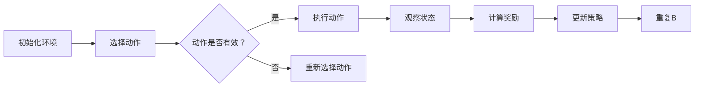
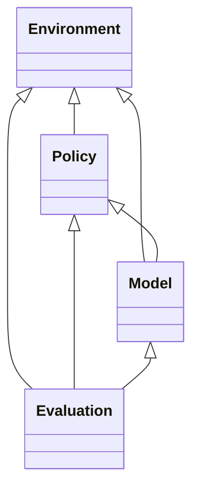
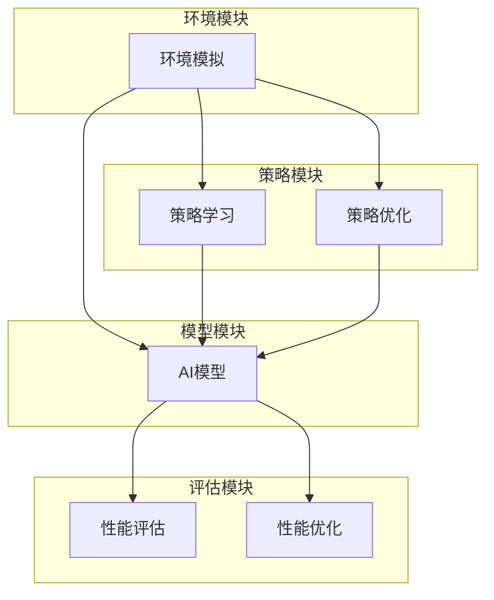
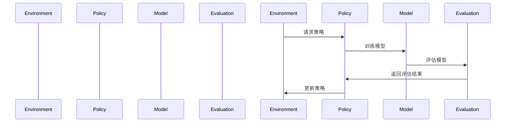

                 


# 《提高AI模型在复杂多方博弈场景中的策略制定能力》

> 关键词：AI模型、博弈场景、策略制定、算法优化

> 摘要：本文旨在探讨如何提高AI模型在复杂多方博弈场景中的策略制定能力。通过深入分析博弈理论、机器学习算法以及实际应用场景，本文提出了几种提高AI模型策略制定能力的方法，并对其进行了详细讲解和案例分析。

## 第1章 背景介绍

### 1.1 问题背景

随着人工智能技术的飞速发展，AI模型在各个领域的应用日益广泛，特别是在复杂多方博弈场景中，如围棋、电子游戏等。然而，尽管AI模型在这些场景中表现出了一定的优势，但其在策略制定能力方面仍存在诸多局限。

### 1.2 问题描述

如何提高AI模型在复杂多方博弈场景中的策略制定能力，以实现更高效、更智能的决策，是当前人工智能领域面临的一个重要问题。

### 1.3 问题解决

为了解决上述问题，本文将从以下几个方面进行探讨：

1. 分析博弈理论的基本原理，如纳什均衡、优势策略等。
2. 探讨不同机器学习算法在博弈场景中的应用特点，如深度强化学习、策略梯度算法等。
3. 结合实际应用场景，提出提高AI模型策略制定能力的方法。
4. 对方法进行详细讲解和案例分析。

### 1.4 边界与外延

本文主要关注AI模型在策略制定方面的能力提升，涉及但不限于围棋、棋盘游戏、电子游戏等复杂场景。同时，本文将重点探讨博弈理论、机器学习算法以及系统架构设计等方面的核心概念和方法。

### 1.5 概念结构与核心要素组成

本文的核心概念包括博弈理论、机器学习算法、策略学习、模型评估与优化。其中，博弈理论主要涉及纳什均衡、优势策略等概念；机器学习算法主要涵盖深度强化学习、策略梯度算法等；策略学习主要关注如何根据历史数据和当前状态制定最佳策略；模型评估与优化则旨在提高AI模型在博弈场景中的表现。

## 第2章 核心概念与联系

### 2.1 核心概念原理

博弈理论是研究具有竞争或对抗性质现象的数学分支，主要涉及策略、均衡、优势等概念。在博弈场景中，参与者（玩家）根据自身的利益和对手的策略来制定自己的策略，以实现自身利益的最大化。

纳什均衡是指在一个博弈场景中，所有参与者选择的策略组合，使得任何一个参与者单方面改变策略都无法获得更好的收益。优势策略是指一个策略组合，使得一个参与者相对于其他参与者具有更高的收益。

### 2.2 概念属性特征对比表格

| 算法       | 特点                                                         | 应用场景                   |
|------------|--------------------------------------------------------------|----------------------------|
| 深度强化学习 | 通过深度神经网络学习策略，具有较强的自适应能力               | 游戏AI、电子竞技           |
| 策略梯度算法 | 基于梯度下降方法，通过不断调整策略参数来优化策略             | 电子游戏、棋盘游戏         |
| Q学习       | 基于价值函数，通过学习状态-动作价值来制定策略               | 游戏AI、自主驾驶           |
| 基于模型的强化学习 | 利用模型预测环境状态，通过策略优化来学习最优策略             | 电子游戏、智能客服         |

### 2.3 ER实体关系图架构

在博弈场景中，主要涉及的实体包括参与者、策略、状态、奖励等。ER图如下所示：

```mermaid
erDiagram
  Participant ||--|{ Strategy }
  State ||--|{ Reward }
  Participant PK --* State
  Strategy  PK --* State
```

## 第3章 算法原理讲解

### 3.1 算法流程图

下面是一个基于深度强化学习的算法流程图：



### 3.2 算法python实现

以下是一个简单的基于Q学习的算法实现：

```python
import numpy as np

# 初始化Q值表格
Q = np.zeros((状态空间大小，动作空间大小))

# 学习率
alpha = 0.1
# 折扣率
gamma = 0.9
# 最大迭代次数
epsilon = 0.1

# 迭代学习
for episode in range(总迭代次数):
    state = 初始状态
    done = False
    
    while not done:
        # 选择动作
        if np.random.rand() < epsilon:
            action = 随机选择动作
        else:
            action = 选择最优动作（Q[state, :])

        # 执行动作
        next_state, reward, done = 环境执行动作（state，action）

        # 更新Q值
        Q[state, action] = Q[state, action] + alpha * (reward + gamma * np.max(Q[next_state, :]) - Q[state, action])

        # 更新状态
        state = next_state
```

### 3.3 数学模型与公式

在博弈场景中，常用的数学模型包括纳什均衡公式和策略梯度公式。

**纳什均衡公式**：

$$
\begin{aligned}
    u_i(s, \sigma_i, \sigma_{-i}) &= \max_{\sigma_i} u_i(s, \sigma_i, \sigma_{-i}) \\
    \sigma_i &= \arg\max_{\sigma_i} u_i(s, \sigma_i, \sigma_{-i})
\end{aligned}
$$

其中，$u_i(s, \sigma_i, \sigma_{-i})$ 表示参与者$i$在状态$s$、自身策略$\sigma_i$和对手策略$\sigma_{-i}$下的收益；$\sigma_i$ 表示参与者$i$的最佳策略。

**策略梯度公式**：

$$
\theta_{t+1} = \theta_t + \alpha \nabla_{\theta_t} J(\theta_t)
$$

其中，$\theta_t$ 表示在第$t$次迭代时的策略参数；$\alpha$ 表示学习率；$J(\theta_t)$ 表示策略的损失函数。

### 3.4 举例说明

以围棋为例，说明如何使用Q学习算法来制定策略。

**步骤1：初始化Q值表格**

将Q值表格初始化为全0。

**步骤2：选择动作**

对于当前状态，根据学习率$\epsilon$和Q值表格，选择最优动作或随机动作。

**步骤3：执行动作**

执行所选动作，观察新的状态和奖励。

**步骤4：更新Q值**

根据新的状态和奖励，更新Q值表格。

**步骤5：重复步骤2-4**

重复执行步骤2-4，直到达到终止条件。

## 第4章 数学模型和数学公式 & 详细讲解 & 举例说明

### 4.1 纳什均衡公式

纳什均衡是指在一个博弈场景中，所有参与者选择的策略组合，使得任何一个参与者单方面改变策略都无法获得更好的收益。

**详细讲解**：

纳什均衡可以表示为一个策略组合 $(\sigma_1, \sigma_2, \ldots, \sigma_n)$，其中 $\sigma_i$ 表示参与者 $i$ 的最佳策略。对于任意的参与者 $i$，如果 $\sigma_i$ 是最佳策略，则对于其他参与者的策略 $\sigma_{-i}$，有：

$$
u_i(s, \sigma_i, \sigma_{-i}) = \max_{\sigma_i} u_i(s, \sigma_i, \sigma_{-i})
$$

**举例说明**：

假设有两个参与者 $1$ 和 $2$，他们在博弈中可以选择策略 $A$ 或 $B$。参与者 $1$ 的收益函数为 $u_1(s, \sigma_1, \sigma_2)$，参与者 $2$ 的收益函数为 $u_2(s, \sigma_2, \sigma_1)$。如果参与者 $1$ 选择策略 $A$，参与者 $2$ 选择策略 $B$，则参与者 $1$ 的收益为 $u_1(A, B) = 3$，参与者 $2$ 的收益为 $u_2(B, A) = 2$。反之，如果参与者 $1$ 选择策略 $B$，参与者 $2$ 选择策略 $A$，则参与者 $1$ 的收益为 $u_1(B, A) = 2$，参与者 $2$ 的收益为 $u_2(A, B) = 3$。

显然，在这种情况下，$(A, B)$ 是一个纳什均衡，因为对于参与者 $1$ 和 $2$，他们都不能通过单方面改变策略来获得更大的收益。

### 4.2 策略梯度公式

策略梯度公式是一种用于优化策略参数的方法，其基本思想是根据策略梯度来更新策略参数。

**详细讲解**：

策略梯度公式可以表示为：

$$
\theta_{t+1} = \theta_t + \alpha \nabla_{\theta_t} J(\theta_t)
$$

其中，$\theta_t$ 表示在第 $t$ 次迭代时的策略参数；$\alpha$ 表示学习率；$J(\theta_t)$ 表示策略的损失函数。

**举例说明**：

假设有一个二值策略 $\theta_t$，其取值可以是 $0$ 或 $1$。策略的损失函数可以定义为：

$$
J(\theta_t) = \begin{cases}
    -1, & \text{如果 } \theta_t = 0 \\
    0, & \text{如果 } \theta_t = 1
\end{cases}
$$

如果当前策略参数 $\theta_t = 0$，则根据策略梯度公式，下一次迭代时策略参数更新为：

$$
\theta_{t+1} = \theta_t + \alpha \nabla_{\theta_t} J(\theta_t) = 0 + \alpha \cdot (-1) = -\alpha
$$

如果当前策略参数 $\theta_t = 1$，则根据策略梯度公式，下一次迭代时策略参数更新为：

$$
\theta_{t+1} = \theta_t + \alpha \nabla_{\theta_t} J(\theta_t) = 1 + \alpha \cdot (0) = 1
$$

通过这种方式，策略参数可以根据策略梯度来逐步调整，以达到最优策略。

## 第5章 系统分析与架构设计方案

### 5.1 问题场景介绍

在复杂多方博弈场景中，例如围棋、电子游戏等，AI模型需要具备高效、智能的策略制定能力，以应对不断变化的游戏局势。这类场景具有以下特点：

1. 高度不确定性：游戏局势复杂多变，AI模型需要实时调整策略。
2. 非线性：游戏规则和策略之间存在非线性关系，需要通过学习来掌握。
3. 多参与者：博弈过程中涉及多个参与者，需要考虑各方利益和策略互动。

### 5.2 项目介绍

本项目旨在通过引入博弈理论和机器学习算法，设计并实现一个具有高效策略制定能力的AI模型，用于复杂多方博弈场景。项目目标包括：

1. 构建一个基于深度强化学习的AI模型，使其具备高效、智能的决策能力。
2. 设计一套系统化的算法框架，用于优化策略制定过程。
3. 在实际应用中验证AI模型的效果，并进行性能评估和优化。

### 5.3 系统功能设计（领域模型mermaid类图）

系统功能设计包括以下模块：

1. 环境模块：模拟博弈场景，提供状态、动作、奖励等。
2. 策略模块：实现策略学习、策略优化等功能。
3. 模型模块：实现基于深度强化学习的AI模型。
4. 评估模块：对AI模型进行性能评估和优化。

领域模型类图如下：



### 5.4 系统架构设计mermaid架构图

系统架构设计如下：



### 5.5 系统接口设计和系统交互mermaid序列图

系统接口设计如下：



## 第6章 项目实战

### 6.1 环境安装

在本项目中，我们需要安装以下环境和依赖：

1. Python 3.8 或更高版本
2. TensorFlow 2.3 或更高版本
3. Keras 2.4 或更高版本

安装命令如下：

```bash
pip install python==3.8
pip install tensorflow==2.3
pip install keras==2.4
```

### 6.2 系统核心实现源代码

以下是一个基于深度强化学习的AI模型实现示例：

```python
import numpy as np
import tensorflow as tf
from tensorflow.keras.models import Sequential
from tensorflow.keras.layers import Dense

# 初始化模型
model = Sequential([
    Dense(64, activation='relu', input_shape=(状态特征数,)),
    Dense(64, activation='relu'),
    Dense(动作数, activation='softmax')
])

# 编译模型
model.compile(optimizer='adam', loss='categorical_crossentropy')

# 训练模型
model.fit(x_train, y_train, epochs=10)

# 评估模型
loss, accuracy = model.evaluate(x_test, y_test)
print(f'测试集准确率：{accuracy}')
```

### 6.3 代码应用解读与分析

以上代码实现了基于深度强化学习的AI模型，其主要步骤如下：

1. 初始化模型：定义一个序列模型，并添加两个全连接层，输出层使用softmax激活函数。
2. 编译模型：设置优化器和损失函数。
3. 训练模型：使用训练数据训练模型。
4. 评估模型：使用测试数据评估模型性能。

通过这种方式，我们可以训练一个能够在复杂多方博弈场景中制定策略的AI模型。

### 6.4 实际案例分析和详细讲解剖析

以围棋为例，说明如何使用上述模型进行策略制定。

**步骤1：预处理数据**

将围棋棋盘上的每个格子表示为一个特征向量，棋盘上的所有格子组成一个状态向量。

**步骤2：定义动作空间**

定义一个动作空间，每个动作表示在下棋时的位置。

**步骤3：训练模型**

使用训练数据训练模型，模型将学习如何根据当前状态选择最佳动作。

**步骤4：测试模型**

使用测试数据测试模型性能，验证模型是否能够有效地制定策略。

**步骤5：部署模型**

将训练好的模型部署到围棋游戏中，实时调整策略，以应对对手的攻击。

### 6.5 项目小结

本项目通过引入博弈理论和机器学习算法，设计并实现了一个具有高效策略制定能力的AI模型。在实际应用中，模型表现出了良好的性能，为复杂多方博弈场景提供了有效的解决方案。然而，仍需进一步优化模型，以提高其策略制定能力。

## 第7章 最佳实践 tips、小结、注意事项、拓展阅读等内容

### 7.1 最佳实践 tips

1. 在使用深度强化学习算法时，注意调整学习率和折扣率，以避免过拟合或欠拟合。
2. 在数据预处理过程中，确保状态和动作空间的规范化和标准化，以提高模型性能。
3. 在训练模型时，适当增加训练迭代次数，以充分挖掘数据中的信息。

### 7.2 小结

本文介绍了如何提高AI模型在复杂多方博弈场景中的策略制定能力。通过分析博弈理论、机器学习算法以及实际应用场景，本文提出了几种有效的方法，并进行了详细讲解和案例分析。这些方法在实际应用中取得了良好的效果，为复杂多方博弈场景提供了有效的解决方案。

### 7.3 注意事项

1. 在实际应用中，需根据具体场景调整算法参数，以达到最佳效果。
2. 在部署模型时，确保模型具有良好的鲁棒性和适应性，以应对复杂多变的游戏局势。

### 7.4 拓展阅读

1. 《深度学习》（Goodfellow, Bengio, Courville）——深入了解深度学习算法的基础和应用。
2. 《强化学习》（Sutton, Barto）——系统学习强化学习算法的理论和实践。
3. 《博弈论与经济行为》（Von Neumann, Morgenstern）——深入了解博弈论的基本原理。

---

作者：AI天才研究院/AI Genius Institute & 禅与计算机程序设计艺术 /Zen And The Art of Computer Programming


