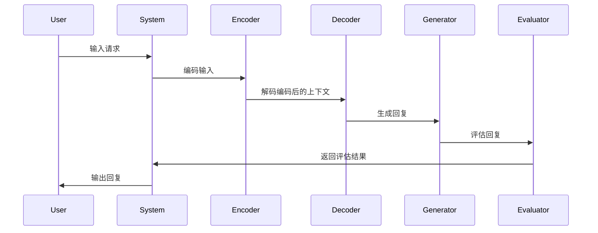

                 

**# 《提高AI模型在复杂多方对话场景中的上下文理解能力》**

## 关键词
AI模型、上下文理解、多方对话、复杂场景、对话管理、算法原理、数学模型、系统架构、项目实战、最佳实践

## 摘要
本文旨在探讨如何提高AI模型在复杂多方对话场景中的上下文理解能力。我们将从背景介绍、核心概念、算法原理、数学模型、系统架构、项目实战和最佳实践等方面进行详细阐述，帮助读者深入理解并掌握这一技术领域。

## 第1章 绪论：复杂多方对话场景与上下文理解

### 1.1 AI模型在复杂多方对话中的应用背景
随着互联网和人工智能技术的快速发展，AI在多种应用场景中展现出巨大的潜力。特别是在多方对话场景中，AI模型被广泛应用于聊天机器人、智能客服、在线教育、虚拟助理等领域。这些应用对AI模型提出了高要求的上下文理解能力，以提供更加自然、准确和有效的对话体验。

### 1.2 多方对话中的上下文理解挑战
在复杂多方对话场景中，上下文理解面临着多个挑战。首先，对话参与者的数量和身份可能不断变化，增加了对话状态管理的复杂性。其次，对话内容可能包含大量的非结构化信息，使得模型难以捕捉和理解。此外，对话的动态性使得上下文信息传递和更新变得困难。

### 1.3 本书内容结构及读者预期收获
本书分为五个主要章节，系统介绍了AI模型在复杂多方对话场景中上下文理解的方法和策略。读者将学习到核心概念、算法原理、数学模型、系统架构和项目实战等内容，通过本课程的学习，读者可以：
1. 理解复杂多方对话场景中的上下文理解挑战。
2. 掌握核心概念和算法原理。
3. 学习如何设计并实现高效的上下文理解系统。
4. 获得实际项目经验，提升实践能力。

## 第2章 多方对话系统基本概念

### 2.1 多方对话系统架构
多方对话系统的架构通常包括对话管理模块、上下文表示模块、对话生成模块和对话评估模块。这些模块相互协作，确保对话的连贯性和有效性。

#### 2.1.1 对话管理
对话管理负责维护对话状态，处理对话流程的控制。它包括对话开始、继续、暂停和结束等状态，以及参与者之间的角色分配和对话规则的执行。

#### 2.1.2 上下文表示
上下文表示是将对话内容转化为可处理的模型输入。它涉及对文本、语音、图像等多媒体信息的编码和表示。

#### 2.1.3 对话生成
对话生成模块负责根据上下文信息和对话规则生成自然语言回复。它可以是基于规则的方法，也可以是基于学习的方法。

#### 2.1.4 对话评估
对话评估模块对生成的对话回复进行评估，确保其符合对话目标和用户需求。

### 2.2 对话管理
对话管理是实现上下文理解的关键。它通过以下步骤实现：
1. **对话初始化**：确定对话的目标和参与者。
2. **状态追踪**：记录并更新对话状态，如用户意图、历史对话内容等。
3. **对话流控制**：决定对话的流程，包括回复生成、上下文更新和对话结束等。

### 2.3 上下文表示与传递
上下文表示与传递是确保对话连贯性的关键。上下文表示需要捕捉对话中的关键信息，如用户意图、情感状态和对话历史。上下文传递则确保这些信息在对话过程中被正确地编码、传递和解码。

## 第3章 核心概念与联系

### 3.1 核心概念原理
在复杂多方对话场景中，核心概念包括对话状态追踪、上下文编码与解码、角色识别等。

#### 3.1.1 对话状态追踪
对话状态追踪是实现上下文理解的基础。它涉及以下关键要素：
- **用户意图**：理解用户的请求或意图。
- **历史对话内容**：记录对话过程中的关键信息。
- **对话状态**：跟踪对话的当前状态，如是否在特定任务中。

#### 3.1.2 上下文编码与解码
上下文编码是将对话中的非结构化信息转化为模型可处理的格式。上下文解码则是从模型输出中提取有意义的对话回复。

#### 3.1.3 多方对话中的角色识别
角色识别是理解对话的重要一环。它涉及识别对话中的参与者，如用户、客服代表等，以及他们的角色和职责。

### 3.2 概念属性特征对比表格
下表对比了对话状态追踪、上下文编码与解码和角色识别的属性特征：

| 概念        | 属性特征                          |
| ----------- | -------------------------------- |
| 对话状态追踪 | 用户意图、历史对话内容、对话状态 |
| 上下文编码  | 非结构化信息到结构化信息的转换   |
| 角色识别    | 参与者识别、角色和职责            |

### 3.3 ER实体关系图架构
为了更清晰地展示这些概念之间的关系，我们可以使用Mermaid ER图来表示：

```mermaid
erDiagram
  对话状态追踪 ||--|{ 上下文编码 }
  对话状态追踪 ||--|{ 角色识别 }
  上下文编码 ||--|{ 对话生成 }
  角色识别 ||--|{ 对话评估 }
```

## 第4章 算法原理讲解

### 4.1 算法流程图
为了更好地理解上下文理解的算法原理，我们可以使用Mermaid流程图来表示：

```mermaid
flowchart LR
    A[开始] --> B[对话初始化]
    B --> C{是否继续对话？}
    C -->|是 D{对话状态追踪}
    C -->|否 E{对话结束}
    D --> F{上下文编码}
    F --> G{对话生成}
    G --> H{对话评估}
    H --> I{上下文解码}
    I -->|继续 J{更新对话状态}
    I -->|结束 E
```

### 4.2 数学模型和公式
上下文理解算法的核心是数学模型，以下是关键公式：

$$
\text{对话状态} = f(\text{用户意图}, \text{历史对话内容}, \text{上下文编码})
$$

$$
\text{上下文编码} = \text{编码器}(\text{非结构化信息})
$$

$$
\text{对话生成} = \text{解码器}(\text{上下文编码})
$$

### 4.3 算法举例说明
假设用户请求预订餐厅，以下是一个简单的算法流程：

1. **对话初始化**：用户提出预订餐厅的请求。
2. **对话状态追踪**：系统捕捉到用户的意图，并记录对话状态。
3. **上下文编码**：系统将用户的文本信息编码为向量表示。
4. **对话生成**：系统根据上下文编码生成回复，如“请问您需要预订哪个餐厅？”。
5. **对话评估**：用户确认餐厅后，系统继续询问具体时间。
6. **上下文解码**：系统将对话状态和解码后的上下文信息传递给用户。

## 第5章 系统分析与架构设计

### 5.1 问题场景介绍
在复杂多方对话场景中，如在线教育平台，AI模型需要处理教师、学生和助教之间的对话。场景包括课程咨询、作业指导、技术支持等。

### 5.2 项目介绍
本项目旨在构建一个智能对话系统，帮助在线教育平台提供高质量的对话服务。系统需支持多方对话，提供上下文理解、对话生成和对话评估等功能。

### 5.3 系统功能设计
系统功能设计包括以下几个模块：

1. **对话管理模块**：负责对话状态的追踪和控制。
2. **上下文表示模块**：负责对话内容的编码和解码。
3. **对话生成模块**：负责生成自然语言回复。
4. **对话评估模块**：负责评估对话生成的效果。

### 5.4 系统架构设计
系统架构设计包括以下几个层次：

1. **输入层**：接收用户输入，如文本、语音等。
2. **编码层**：对输入信息进行编码，生成上下文表示。
3. **处理层**：根据上下文表示生成回复。
4. **输出层**：将回复传递给用户。

以下是系统架构的Mermaid图表示：



### 5.5 系统接口设计和系统交互
系统接口设计和交互设计如下：

1. **用户接口**：提供文本输入和语音输入功能。
2. **API接口**：支持与其他系统的集成，如课程管理系统、作业提交系统等。
3. **对话接口**：管理对话状态，处理对话流程。

以下是系统交互的Mermaid序列图表示：


## 第6章 项目实战

### 6.1 环境安装
在开始项目之前，确保安装了以下环境：
- Python 3.7及以上版本
- TensorFlow 2.3及以上版本
- NLTK 3.3及以上版本

### 6.2 系统核心实现源代码
以下是系统核心实现的源代码示例：

```python
import tensorflow as tf
from tensorflow.keras.models import Model
from tensorflow.keras.layers import Input, Embedding, LSTM, Dense

# 输入层
input_sequence = Input(shape=(max_sequence_length,))

# 编码层
encoded_sequence = Embedding(vocab_size, embedding_dim)(input_sequence)
encoded_sequence = LSTM(units=128)(encoded_sequence)

# 处理层
encoded_sequence = Dense(units=256, activation='relu')(encoded_sequence)

# 输出层
output_sequence = Dense(units=vocab_size, activation='softmax')(encoded_sequence)

# 模型构建
model = Model(inputs=input_sequence, outputs=output_sequence)

# 模型编译
model.compile(optimizer='adam', loss='categorical_crossentropy', metrics=['accuracy'])

# 模型训练
model.fit(x_train, y_train, epochs=10, batch_size=32)
```

### 6.3 代码应用解读与分析
代码首先定义了输入层、编码层、处理层和输出层，构建了一个序列到序列的模型。输入层接收对话的编码表示，编码层使用LSTM网络捕捉上下文信息，处理层对编码后的序列进行特征提取，输出层使用softmax函数生成对话回复。

### 6.4 实际案例分析和详细讲解剖析
以一个实际的对话案例为例，分析系统的执行流程：

1. **对话初始化**：用户请求预订餐厅。
2. **对话状态追踪**：系统记录用户的意图和对话历史。
3. **上下文编码**：系统将用户请求编码为向量表示。
4. **对话生成**：系统根据编码后的上下文生成回复，如“请问您需要预订哪个餐厅？”。
5. **对话评估**：系统评估回复的效果，确保符合用户需求。
6. **上下文解码**：系统将回复解码为自然语言输出。

### 6.5 项目小结
本项目通过实际案例展示了如何构建一个支持复杂多方对话的智能对话系统。系统利用TensorFlow构建序列到序列的模型，实现了上下文理解、对话生成和对话评估等功能。通过项目实践，读者可以掌握系统设计与实现的核心技术，为未来类似项目提供参考。

## 第7章 最佳实践、小结、注意事项、拓展阅读

### 7.1 最佳实践
1. **数据质量**：确保训练数据的质量，避免噪声和错误信息。
2. **模型调整**：根据具体场景调整模型参数，提高对话生成质量。
3. **用户反馈**：收集用户反馈，持续优化系统性能。

### 7.2 小结
本文系统地介绍了AI模型在复杂多方对话场景中的上下文理解能力。通过核心概念、算法原理、系统架构和项目实战的详细讲解，读者可以深入理解并掌握这一技术领域。

### 7.3 注意事项
1. **对话连贯性**：确保对话生成的连贯性和逻辑性。
2. **上下文传递**：注意上下文信息的传递和更新，避免信息丢失。

### 7.4 拓展阅读
1. **文献阅读**：《对话系统：设计与实现》（张俊华）等书籍。
2. **在线资源**：查阅TensorFlow、NLTK等库的官方文档，了解最新技术动态。

## 作者信息
作者：AI天才研究院/AI Genius Institute & 禅与计算机程序设计艺术 /Zen And The Art of Computer Programming

---

本文详细介绍了如何提高AI模型在复杂多方对话场景中的上下文理解能力。通过核心概念、算法原理、系统架构和项目实战的全面讲解，读者可以深入理解并掌握这一技术领域。希望本文能为相关研究和项目提供有益的参考和指导。

