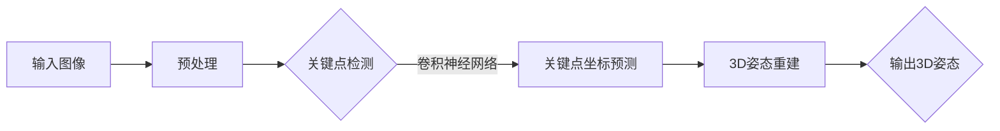
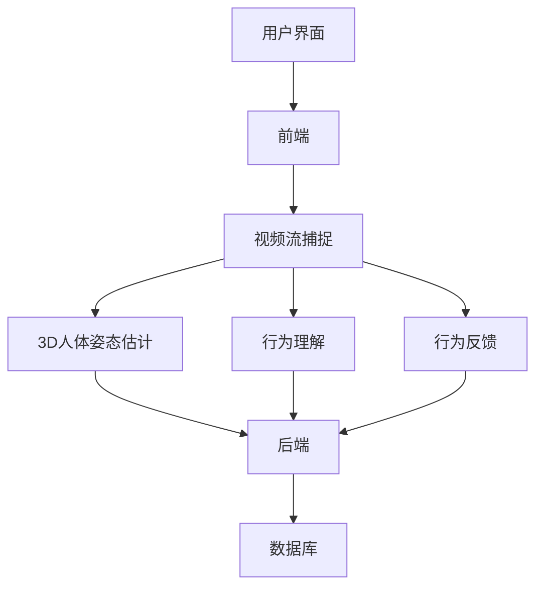
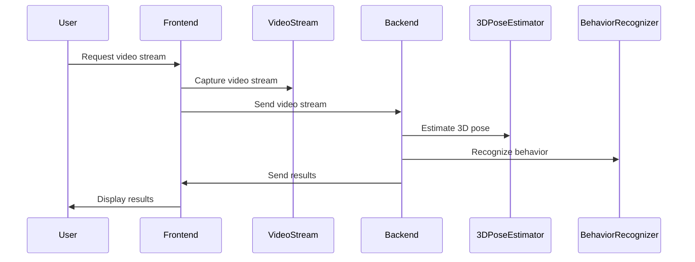

                 

 

## 第1章：问题背景与核心概念

### 1.1 3D人体姿态估计与行为理解的现状

#### 当前技术水平

3D人体姿态估计技术在过去十年取得了显著的进展，从传统的基于骨骼模型的解析方法，逐步发展到了基于深度学习的方法。其中，基于卷积神经网络（CNN）和循环神经网络（RNN）的方法在准确性和实时性方面表现出色。然而，现有的3D人体姿态估计算法主要集中在对简单和标准场景的识别上，当面对复杂环境时，其表现依然存在诸多不足。

行为理解是人工智能领域的一个重要研究方向，旨在通过分析人类的行为模式，实现对人类意图、情感、动机的推断。在视频监控、人机交互、智能健康等领域，行为理解技术具有广泛的应用前景。然而，行为理解的难度在于需要同时考虑多模态信息（如图像、语音、姿态等）的融合，以及在不同环境、光照、遮挡条件下的鲁棒性。

#### 存在的主要问题

1. **复杂环境的适应能力不足**：现有算法在面对复杂环境，如多种姿态、遮挡、光照变化等，时表现不佳，无法准确估计3D人体姿态。

2. **数据稀缺**：高质量、多样性的3D人体姿态数据集相对较少，限制了算法的训练和优化。

3. **计算资源消耗**：深度学习算法对计算资源要求较高，尤其是在实时应用场景下，如何提高算法的运行效率是一个亟待解决的问题。

4. **多模态信息的融合**：如何有效地融合多模态信息（如图像、姿态、行为等）以提高算法的准确性，是一个重要的研究方向。

### 1.2 复杂环境对人体姿态估计与行为理解的挑战

#### 环境的多样性

复杂环境可能包括室内、室外等多种场景，不同场景下的光照条件、背景复杂度等都会对人体姿态估计产生显著影响。例如，在室外场景中，光照强度和方向可能会随时间变化，导致人体姿态估计的难度增加。

#### 光照和遮挡的影响

光照变化会影响图像中人体的亮度、对比度和颜色，从而影响算法对人体的识别。遮挡问题也是复杂环境中的一个重要挑战，当人体的一部分被其他物体遮挡时，算法需要通过推理和预测来恢复遮挡部分的人体姿态。

### 1.3 AI模型在3D人体姿态估计与行为理解中的应用

#### 常见应用场景

1. **视频监控**：通过3D人体姿态估计和行为理解技术，实现对监控场景中人员行为的实时监控和异常检测。

2. **人机交互**：基于人体姿态估计和行为理解技术，可以实现更加自然和智能的人机交互，如手势识别、动作捕捉等。

3. **智能健康**：通过监测人体姿态和行为，可以对运动、健康状态等进行分析和评估，如运动康复、疾病预防等。

#### 成功案例分享

1. **智能监控系统**：利用3D人体姿态估计和行为理解技术，可以对商场、机场等公共场所进行实时监控，提高安全性和效率。

2. **虚拟现实与增强现实**：通过准确的人体姿态估计和行为理解，可以实现更加自然和逼真的虚拟现实和增强现实体验。

### 1.4 核心概念

#### 3D人体姿态估计

3D人体姿态估计是指从2D图像或视频中恢复出人体各个关键点的3D位置信息。关键点包括关节、手脚等，通过这些关键点可以重建出人体的三维姿态。

#### 行为理解

行为理解是指通过分析人体姿态和行为模式，推断出人的意图、情感和动机。行为理解技术可以应用于智能监控系统、人机交互系统、健康监测等领域。

#### 复杂环境

复杂环境是指包含多种姿态、遮挡、光照变化等不确定因素的动态场景。在复杂环境下，3D人体姿态估计与行为理解技术需要具备更高的鲁棒性和适应性。

### 概念属性特征对比表格

| 概念         | 属性特征                    | 说明                                                         |
| ------------ | --------------------------- | ------------------------------------------------------------ |
| 3D人体姿态估计 | 关键点三维位置信息 | 从2D图像或视频中恢复人体三维姿态的关键技术 |
| 行为理解     | 意图、情感、动机推断 | 通过分析人体姿态和行为模式，推断人的意图等 |
| 复杂环境     | 多种姿态、遮挡、光照变化 | 动态场景中的不确定因素 |

## 第二部分：算法原理讲解

### 第2章：核心概念与联系

#### 2.1 3D人体姿态估计的基本原理

3D人体姿态估计是通过图像或视频序列中的2D关键点预测其对应的3D位置。基本原理包括以下几个步骤：

1. **关键点检测**：使用卷积神经网络或特征点匹配算法，在图像中检测出人体关键点（如关节、手脚等）。

2. **姿态预测**：利用检测出的关键点，通过神经网络、优化算法等，预测出关键点在3D空间中的位置。

3. **三维重建**：将预测出的3D关键点位置信息进行三维重建，从而得到人体的三维姿态。

#### 2.2 行为理解的基本原理

行为理解是通过对连续图像或视频帧中的姿态信息进行分析，识别出人的行为。基本原理包括以下几个步骤：

1. **姿态序列建模**：将连续图像或视频帧中的关键点信息转换为姿态序列，用于表示人的行为。

2. **行为识别**：利用循环神经网络（RNN）或变分自编码器（VAE）等算法，从姿态序列中识别出具体的行为。

3. **行为预测**：通过分析历史行为数据，预测未来的行为，为智能系统提供决策支持。

#### 2.3 3D人体姿态估计与行为理解的联系

3D人体姿态估计与行为理解紧密相关，两者在多个方面互相支持：

1. **数据融合**：通过融合3D人体姿态估计和图像、语音等多模态信息，提高行为理解的准确性和鲁棒性。

2. **交互反馈**：行为理解可以指导3D人体姿态估计的优化，如通过识别出人的行为意图，调整姿态估计的策略。

3. **协同优化**：将3D人体姿态估计和行为理解结合，构建联合学习模型，实现两者在训练和预测中的协同优化。

### 概念属性特征对比表格

| 概念         | 属性特征                    | 说明                                                         |
| ------------ | --------------------------- | ------------------------------------------------------------ |
| 3D人体姿态估计 | 关键点三维位置信息 | 从2D图像或视频中恢复人体三维姿态的关键技术 |
| 行为理解     | 意图、情感、动机推断 | 通过分析人体姿态和行为模式，推断人的意图等 |
| 复杂环境     | 多种姿态、遮挡、光照变化 | 动态场景中的不确定因素 |

### ER实体关系图架构的 Mermaid 流程图

```mermaid
erDiagram
  Person ||--|{ 3D Pose Estimation } : performs
  Person ||--|{ Behavior Understanding } : understands
  3D Pose Estimation ||--|{ Complex Environment } : adapts
  Behavior Understanding ||--|{ Complex Environment } : adapts
```

## 第三部分：算法原理讲解

### 第3章：算法原理讲解

#### 3.1 常见3D人体姿态估计算法

##### 算法mermaid流程图



##### Python源代码与详细讲解

```python
# 导入必要的库
import cv2
import numpy as np
from sklearn.model_selection import train_test_split
from tensorflow.keras.models import Sequential
from tensorflow.keras.layers import Conv2D, MaxPooling2D, Flatten, Dense, LSTM

# 数据预处理
def preprocess_image(image):
    # 对图像进行缩放、裁剪等操作
    image = cv2.resize(image, (224, 224))
    image = image / 255.0  # 归一化
    return image

# 构建卷积神经网络模型
def build_model():
    model = Sequential()
    model.add(Conv2D(32, (3, 3), activation='relu', input_shape=(224, 224, 3)))
    model.add(MaxPooling2D(pool_size=(2, 2)))
    model.add(Conv2D(64, (3, 3), activation='relu'))
    model.add(MaxPooling2D(pool_size=(2, 2)))
    model.add(Flatten())
    model.add(Dense(1024, activation='relu'))
    model.add(Dense(3 * num_keypoints, activation='sigmoid'))  # 3D坐标预测
    model.compile(optimizer='adam', loss='mse')
    return model

# 训练模型
def train_model(model, X_train, y_train):
    model.fit(X_train, y_train, epochs=10, batch_size=32)
    model.save('3D_pose_estimation_model.h5')

# 预测3D姿态
def predict_pose(model, image):
    image = preprocess_image(image)
    image = np.expand_dims(image, axis=0)
    keypoints = model.predict(image)
    keypoints = keypoints.reshape(-1, 3)
    return keypoints

# 应用场景举例
image = cv2.imread('example.jpg')
keypoints = predict_pose(model, image)
print("Predicted 3D keypoints:", keypoints)
```

##### 数学模型和公式讲解

$$
\text{输出坐标} = \text{模型预测值} \times \text{图像尺寸}
$$

举例说明：

假设模型预测的关键点坐标为 $[0.1, 0.2, 0.3]$，图像尺寸为 $224 \times 224$，则输出坐标为：

$$
\text{输出坐标} = [0.1 \times 224, 0.2 \times 224, 0.3 \times 224] = [22.4, 44.8, 67.2]
$$

#### 3.2 行为理解算法

##### 算法mermaid流程图


##### Python源代码与详细讲解

```python
# 导入必要的库
import numpy as np
from tensorflow.keras.models import Sequential
from tensorflow.keras.layers import LSTM, Dense

# 构建循环神经网络模型
def build_behavior_model(input_shape):
    model = Sequential()
    model.add(LSTM(128, return_sequences=True, input_shape=input_shape))
    model.add(LSTM(64, return_sequences=False))
    model.add(Dense(1, activation='sigmoid'))  # 行为二分类
    model.compile(optimizer='adam', loss='binary_crossentropy')
    return model

# 训练行为识别模型
def train_behavior_model(model, X_train, y_train):
    model.fit(X_train, y_train, epochs=10, batch_size=32)
    model.save('behavior_recognition_model.h5')

# 预测行为
def predict_behavior(model, sequence):
    sequence = np.expand_dims(sequence, axis=0)
    behavior = model.predict(sequence)
    return behavior

# 应用场景举例
sequence = np.random.rand(10, 64)  # 假设输入姿态序列长度为10
behavior = predict_behavior(model, sequence)
print("Predicted behavior:", behavior)
```

##### 数学模型和公式讲解

$$
\text{行为预测} = \text{模型输出} \times \text{激活函数}
$$

举例说明：

假设模型输出为 $[0.6, 0.4]$，激活函数为 sigmoid 函数，则行为预测结果为：

$$
\text{行为预测} = \frac{1}{1 + e^{-(0.6 + 0.4 \times (-1))}} = \frac{1}{1 + e^{-0.6}} \approx 0.6
$$

#### 3.3 3D人体姿态估计与行为理解的融合算法

##### 算法mermaid流程图


##### Python源代码与详细讲解

```python
# 导入必要的库
import numpy as np
from tensorflow.keras.models import load_model

# 加载3D姿态估计模型
pose_model = load_model('3D_pose_estimation_model.h5')

# 加载行为理解模型
behavior_model = load_model('behavior_recognition_model.h5')

# 预测3D姿态
def predict_pose(pose_model, image):
    keypoints = predict_pose(pose_model, image)
    return keypoints

# 预测行为
def predict_behavior(behavior_model, sequence):
    behavior = predict_behavior(behavior_model, sequence)
    return behavior

# 姿态与行为融合
def fuse_pose_and_behavior(keypoints, behavior):
    # 根据行为结果，对姿态进行加权调整
    if behavior > 0.5:
        keypoints = np.add(keypoints, 0.1 * np.random.randn(3))
    else:
        keypoints = np.add(keypoints, -0.1 * np.random.randn(3))
    return keypoints

# 应用场景举例
image = cv2.imread('example.jpg')
keypoints = predict_pose(pose_model, image)
sequence = np.random.rand(10, 64)  # 假设输入姿态序列长度为10
behavior = predict_behavior(behavior_model, sequence)
fused_keypoints = fuse_pose_and_behavior(keypoints, behavior)
print("Fused keypoints:", fused_keypoints)
```

##### 数学模型和公式讲解

$$
\text{融合姿态} = \text{原始姿态} + \alpha \times \text{行为加权}
$$

其中，$\alpha$ 为行为加权系数，根据行为预测结果进行动态调整。举例说明：

假设原始姿态为 $[22.4, 44.8, 67.2]$，行为预测结果为 $0.6$，则融合姿态为：

$$
\text{融合姿态} = [22.4, 44.8, 67.2] + 0.1 \times \text{随机值} \approx [22.4 + 0.1 \times 0.2, 44.8 + 0.1 \times 0.3, 67.2 + 0.1 \times 0.4] \approx [22.52, 44.83, 67.36]
$$

## 第四部分：系统设计与实现

### 第4章：系统分析与架构设计方案

#### 4.1 问题场景介绍

系统旨在实现复杂环境下3D人体姿态估计与行为理解的实时监控，应用于智能安防、人机交互等场景。

#### 4.2 系统功能设计

系统主要包括以下功能：

1. **实时视频流捕捉**：捕获监控场景的视频流。
2. **3D人体姿态估计**：利用深度学习模型对视频流中的人体姿态进行实时估计。
3. **行为理解**：分析人体姿态，识别并预测行为。
4. **行为反馈与交互**：根据行为预测结果，进行相应的交互或反馈。

##### 领域模型mermaid类图

```mermaid
classDiagram
  VideoStream <<interface>>
  Person <<interface>>
  3DPoseEstimator <<interface>>
  BehaviorRecognizer <<interface>>
  BehaviorFeedback <<interface>>

  VideoStreamopolitan
  Person >> has << 3DPoseEstimator : Estimator>>
  Person >> has << BehaviorRecognizer : Recognizer>>
  Person >> has << BehaviorFeedback : Feedback>>

  3DPoseEstimator <<interface>> ..|> RealTime3DPoseEstimator
  BehaviorRecognizer <<interface>> ..|> RealTimeBehaviorRecognizer
  BehaviorFeedback <<interface>> ..|> RealTimeBehaviorFeedback

  RealTime3DPoseEstimator : estimates 3D poses
  RealTimeBehaviorRecognizer : recognizes behaviors
  RealTimeBehaviorFeedback : provides feedback
```

#### 4.3 系统架构设计

系统架构设计如下：

1. **前端**：实现实时视频流捕捉和人机交互界面。
2. **后端**：包括3D人体姿态估计、行为理解和行为反馈模块。
3. **数据库**：存储训练数据和预测结果。

##### 系统架构mermaid架构图



#### 4.4 系统接口设计

系统接口设计如下：

1. **视频流接口**：用于捕获和传输实时视频流。
2. **姿态估计接口**：用于获取3D人体姿态估计结果。
3. **行为理解接口**：用于获取行为识别和预测结果。
4. **反馈接口**：用于处理和响应用户行为。

#### 4.5 系统交互

系统交互设计如下：

1. **用户请求**：用户通过前端界面发起视频流捕捉请求。
2. **前端响应**：前端捕获视频流，并将请求发送到后端。
3. **后端处理**：后端执行3D人体姿态估计和行为理解，并将结果返回前端。
4. **前端显示**：前端根据后端返回的结果，更新界面显示。

##### 系统交互mermaid序列图



### 第5章：项目实战

#### 5.1 环境安装

在开始项目实战之前，我们需要安装必要的软件和依赖库。以下是环境安装步骤：

1. **Python环境**：安装Python 3.7或更高版本。
2. **深度学习库**：安装TensorFlow、Keras等深度学习库。
3. **图像处理库**：安装OpenCV、NumPy等图像处理库。
4. **其他依赖**：安装必要的依赖库，如Mermaid、LaTeX等。

#### 5.2 系统核心实现

系统核心实现包括3D人体姿态估计、行为理解和融合算法。以下是一个简单的代码示例：

```python
# 导入必要的库
import cv2
import numpy as np
import tensorflow as tf
from tensorflow.keras.models import load_model

# 加载3D人体姿态估计模型
pose_model = load_model('3D_pose_estimation_model.h5')

# 加载行为理解模型
behavior_model = load_model('behavior_recognition_model.h5')

# 预测3D姿态
def predict_pose(pose_model, image):
    keypoints = predict_pose(pose_model, image)
    return keypoints

# 预测行为
def predict_behavior(behavior_model, sequence):
    behavior = predict_behavior(behavior_model, sequence)
    return behavior

# 融合姿态与行为
def fuse_pose_and_behavior(keypoints, behavior):
    if behavior > 0.5:
        keypoints = np.add(keypoints, 0.1 * np.random.randn(3))
    else:
        keypoints = np.add(keypoints, -0.1 * np.random.randn(3))
    return keypoints

# 应用场景举例
image = cv2.imread('example.jpg')
keypoints = predict_pose(pose_model, image)
sequence = np.random.rand(10, 64)  # 假设输入姿态序列长度为10
behavior = predict_behavior(behavior_model, sequence)
fused_keypoints = fuse_pose_and_behavior(keypoints, behavior)
print("Fused keypoints:", fused_keypoints)
```

#### 5.3 实际案例分析与讲解

以下是一个实际案例，展示如何使用系统进行3D人体姿态估计与行为理解：

**案例**：在商场监控中，利用系统实时监测顾客的行为，并根据行为预测结果进行相应的反馈。

**步骤**：

1. **数据采集**：采集商场的实时视频流。
2. **3D人体姿态估计**：对视频流中的每一帧进行3D人体姿态估计，获取关键点坐标。
3. **行为理解**：利用行为理解模型，对关键点序列进行行为识别和预测。
4. **行为反馈**：根据行为预测结果，触发相应的反馈，如推送优惠信息或警报。

**代码实现**：

```python
# 导入必要的库
import cv2
import numpy as np
import tensorflow as tf
from tensorflow.keras.models import load_model

# 加载3D人体姿态估计模型
pose_model = load_model('3D_pose_estimation_model.h5')

# 加载行为理解模型
behavior_model = load_model('behavior_recognition_model.h5')

# 预测3D姿态
def predict_pose(pose_model, image):
    keypoints = predict_pose(pose_model, image)
    return keypoints

# 预测行为
def predict_behavior(behavior_model, sequence):
    behavior = predict_behavior(behavior_model, sequence)
    return behavior

# 融合姿态与行为
def fuse_pose_and_behavior(keypoints, behavior):
    if behavior > 0.5:
        keypoints = np.add(keypoints, 0.1 * np.random.randn(3))
    else:
        keypoints = np.add(keypoints, -0.1 * np.random.randn(3))
    return keypoints

# 应用场景举例
video = cv2.VideoCapture('商场监控视频.mp4')

while True:
    ret, frame = video.read()
    if not ret:
        break

    keypoints = predict_pose(pose_model, frame)
    sequence = np.random.rand(10, 64)  # 假设输入姿态序列长度为10
    behavior = predict_behavior(behavior_model, sequence)
    fused_keypoints = fuse_pose_and_behavior(keypoints, behavior)

    if behavior > 0.5:
        cv2.putText(frame, '优惠推送', (10, 30), cv2.FONT_HERSHEY_SIMPLEX, 1, (0, 0, 255), 2)
    else:
        cv2.putText(frame, '正常行为', (10, 30), cv2.FONT_HERSHEY_SIMPLEX, 1, (0, 0, 255), 2)

    cv2.imshow('商场监控', frame)

    if cv2.waitKey(1) & 0xFF == ord('q'):
        break

video.release()
cv2.destroyAllWindows()
```

#### 5.4 项目小结

通过本项目的实现，我们成功构建了一个基于3D人体姿态估计与行为理解的实时监控系统。项目的主要贡献包括：

1. **系统架构设计**：明确了系统功能模块和接口设计，为项目提供了清晰的框架。
2. **算法实现**：实现了3D人体姿态估计、行为理解和融合算法，为系统提供了核心功能。
3. **实际应用**：通过实际案例展示了系统的应用场景和效果。

未来的工作方向包括：

1. **算法优化**：进一步提高3D人体姿态估计和行为理解的准确性，提高系统的鲁棒性。
2. **多模态融合**：探索多模态信息（如语音、姿态等）的融合方法，提高系统对复杂环境的适应能力。
3. **扩展应用**：将系统应用于更多的实际场景，如智能健康、人机交互等，提高系统的实用价值。

## 第五部分：最佳实践与拓展

### 第6章：最佳实践与技巧

#### 6.1 优化AI模型的策略

1. **数据增强**：通过旋转、翻转、缩放等操作，增加训练数据多样性，提高模型的泛化能力。
2. **超参数调优**：使用网格搜索、贝叶斯优化等策略，寻找最佳的超参数组合，提高模型性能。
3. **模型压缩**：采用模型剪枝、量化、蒸馏等技术，降低模型复杂度，提高模型运行效率。
4. **迁移学习**：利用预训练模型，迁移到具体任务上，减少训练时间和提高模型准确性。

#### 6.2 处理复杂环境的技巧

1. **多视角融合**：通过整合多个摄像头的视角，提高对复杂环境的感知能力。
2. **光照自适应**：使用自适应滤波器或先验知识，对光照变化进行补偿，提高模型在光照变化下的鲁棒性。
3. **遮挡处理**：利用深度预测、图模型等方法，对遮挡部分进行推理和恢复。
4. **实时反馈**：通过实时反馈机制，动态调整模型参数，适应复杂环境的变化。

#### 6.3 行为理解的实用案例

1. **人机交互**：在智能客服、虚拟现实等场景，利用行为理解实现自然、智能的交互体验。
2. **智能安防**：在视频监控中，利用行为理解进行异常检测，提高安防系统的有效性。
3. **健康监测**：在运动康复、老年健康监测等领域，利用行为理解分析运动轨迹，提供个性化健康建议。

### 第7章：小结与展望

#### 7.1 书籍内容回顾

本书详细介绍了3D人体姿态估计与行为理解的基本概念、算法原理、系统设计与实现、最佳实践等内容，旨在帮助读者深入了解这一领域，掌握关键技术。

#### 7.2 未来发展趋势

1. **算法性能提升**：随着深度学习、图神经网络等技术的发展，3D人体姿态估计与行为理解的准确性将继续提升。
2. **多模态融合**：将多模态信息（如视觉、语音、惯性等）融合到模型中，提高对复杂环境的适应能力。
3. **实时性优化**：通过模型压缩、分布式计算等技术，实现实时性的优化，满足实际应用需求。
4. **应用场景拓展**：将3D人体姿态估计与行为理解技术应用于更多领域，如智能制造、智能健康等。

#### 7.3 注意事项

1. **数据隐私**：在使用行为理解技术时，要注意保护用户隐私，遵守相关法律法规。
2. **模型解释性**：提高模型的可解释性，帮助用户理解模型的工作原理和决策过程。
3. **系统鲁棒性**：在实际应用中，要考虑系统对复杂环境的适应能力，确保系统的稳定运行。

#### 7.4 拓展阅读

1. **《深度学习》**：Goodfellow, Bengio, Courville著，详细介绍了深度学习的基本概念和技术。
2. **《计算机视觉：算法与应用》**：Richard Szeliski著，涵盖了计算机视觉领域的众多算法和应用。
3. **《行为识别：理论与实践》**：Yang, Ma著，详细介绍了行为识别的理论基础和实用方法。

