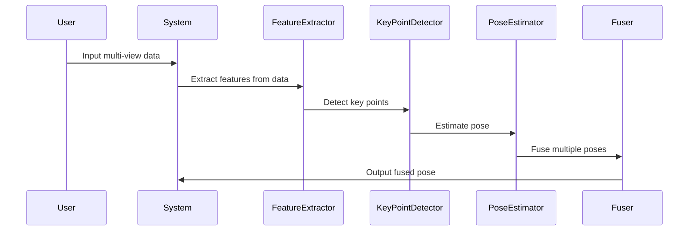
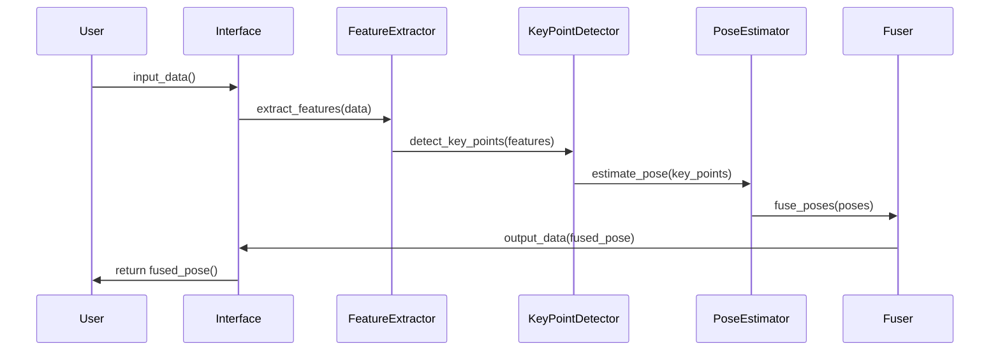

                 

### 文章标题

# 提高AI模型在复杂环境下的3D人体姿态估计能力

### 关键词

- **3D人体姿态估计**
- **AI模型**
- **复杂环境**
- **算法优化**
- **性能提升**

### 摘要

本文将深入探讨如何提高AI模型在复杂环境下进行3D人体姿态估计的能力。首先，我们回顾了3D人体姿态估计的背景和重要性，随后详细介绍了核心概念和技术方法。接着，我们讲解了AI模型在3D人体姿态估计中的算法原理，并使用Python源代码和LaTeX公式进行了详细阐述。随后，通过系统分析和架构设计，我们展示了如何实现一个完整的3D人体姿态估计系统。文章的实战部分提供了项目环境安装、核心实现和案例分析的具体步骤。最后，我们提出了最佳实践建议，总结了全文，并指出了未来研究的方向。

## 目录大纲设计思路

在设计本文的目录大纲时，我们采取了由浅入深、循序渐进的方式，以确保读者能够逐步掌握3D人体姿态估计及AI模型优化的关键知识。

### 第一部分: 3D人体姿态估计的基础

**第1章: 3D人体姿态估计概述**

- **1.1 问题背景与重要性**
  - 介绍3D人体姿态估计的起源、发展以及为何在复杂环境下进行人体姿态估计具有重要意义。
- **1.2 核心概念与联系**
  - 详细介绍3D人体姿态估计的基本概念，包括关键术语、概念属性特征对比，并通过ER图展示概念之间的联系。

### 第二部分: AI模型在3D人体姿态估计中的应用

**第2章: AI模型在3D人体姿态估计中的算法原理**

- **2.1 算法概述**
  - 简要介绍AI模型在3D人体姿态估计中的常用算法，讨论选择依据和算法流程。
- **2.2 算法原理详细讲解**
  - 使用mermaid流程图展示算法流程，结合Python源代码和LaTeX公式详细讲解数学模型和公式。

**第3章: 3D人体姿态估计系统设计与实现**

- **3.1 系统场景介绍**
  - 介绍一个具体的3D人体姿态估计项目，包括功能设计和系统架构设计。
- **3.2 系统分析与架构设计**
  - 使用mermaid类图、架构图和序列图详细展示系统设计。

### 第三部分: 项目实战

**第4章: 项目实战**

- **4.1 环境安装**
  - 讲解如何搭建3D人体姿态估计项目所需的环境，包括硬件和软件安装步骤。
- **4.2 系统核心实现**
  - 分析系统核心实现，提供源代码应用解读与分析。
- **4.3 实际案例分析**
  - 分析实际案例，讨论模型的训练与评估过程。

### 第四部分: 提高AI模型性能的最佳实践

**第5章: 提高AI模型性能的最佳实践**

- **5.1 数据预处理技巧**
  - 讨论数据清洗和增强技巧，提高模型训练效果。
- **5.2 模型优化策略**
  - 探讨网络架构优化、损失函数与优化算法等策略。
- **5.3 实时性能优化**
  - 讨论如何加速模型训练和部署，提高实时性能。

**第6章: 全书小结与拓展**

- **6.1 小结**
  - 总结全文，回顾关键技术和应用前景。
- **6.2 注意事项**
  - 指出可能遇到的挑战和注意事项。
- **6.3 拓展阅读**
  - 推荐相关文献和研究方向。

通过这样的结构设计，读者可以从基础概念开始，逐步深入到算法原理、系统实现以及性能优化，最终对3D人体姿态估计有一个全面而深刻的理解。

## 目录大纲详细内容

### 第一部分: 3D人体姿态估计的基础

#### 第1章: 3D人体姿态估计概述

**1.1 问题背景与重要性**

3D人体姿态估计作为计算机视觉领域的一个重要分支，起源于计算机图形学和机器学习技术的发展。随着深度学习技术的成熟，3D人体姿态估计在虚拟现实、视频监控、人机交互等领域得到了广泛应用。

**1.1.1 3D人体姿态估计的起源与发展**

- **起源**：最早的3D人体姿态估计工作可以追溯到20世纪80年代，通过计算几何和运动学模型来估计人体姿态。
- **发展**：随着计算机性能的提升和深度学习的进步，3D人体姿态估计方法逐渐从基于规则的方法转向数据驱动的方法，如基于深度神经网络的方法。

**1.1.2 复杂环境下的挑战**

在复杂环境下进行3D人体姿态估计面临着诸多挑战，如遮挡、光线变化、人体姿态多样化等。这些因素增加了姿态估计的难度和不确定性。

**1.1.3 3D人体姿态估计的应用前景**

3D人体姿态估计在多个领域具有广泛的应用前景，如智能健身指导、医疗诊断、运动分析等。随着技术的不断发展，3D人体姿态估计的应用场景将进一步扩大。

**1.2 核心概念与联系**

3D人体姿态估计涉及多个核心概念，包括关键点检测、姿态估计、姿态融合等。以下是这些概念的基本定义和属性特征对比：

| 概念       | 定义                                                         | 属性特征对比                    |
|------------|--------------------------------------------------------------|---------------------------------|
| 关键点检测 | 从图像中定位出人体关键点（如关节）的位置。                      | 精度、速度、检测范围对比          |
| 姿态估计   | 利用关键点位置信息估计人体整体姿态。                            | 准确性、鲁棒性、计算效率对比      |
| 姿态融合   | 将多个传感器或视图的信息融合成一个统一的姿态估计结果。          | 融合精度、实时性、传感器依赖性对比 |

为了更好地理解这些概念之间的联系，我们使用ER图来展示它们之间的实体关系：

```mermaid
erDiagram
  Person ||--|{ Joint }|-- Camera
  Joint ||--|{ Pose }|-- Scene
  Camera ||--|{ View }|-- Scene
```

在上述ER图中，Person代表人体，Joint代表关节点，Pose代表姿态，Camera代表相机，View代表视图，Scene代表场景。通过这种实体关系的展示，我们可以清晰地看到各个概念之间的关联和交互。

### 第二部分: AI模型在3D人体姿态估计中的应用

#### 第2章: AI模型在3D人体姿态估计中的算法原理

**2.1 算法概述**

在3D人体姿态估计中，常用的AI模型包括基于卷积神经网络（CNN）、循环神经网络（RNN）和生成对抗网络（GAN）的方法。每种方法都有其独特的优势和适用场景。

**2.1.1 算法的选择依据**

选择算法时需要考虑以下因素：

- **数据量**：数据量大小直接影响模型的训练效果，对于大型数据集，深度学习方法更具优势。
- **计算资源**：深度学习模型通常需要大量计算资源，考虑硬件配置和预算限制。
- **应用场景**：不同的应用场景对模型的要求不同，如实时性要求高的应用更适合轻量级模型。

**2.1.2 算法的流程**

常见的3D人体姿态估计算法流程通常包括以下步骤：

1. **输入预处理**：对输入图像或视频进行预处理，如缩放、裁剪、归一化等。
2. **特征提取**：使用卷积神经网络等深度学习模型提取图像特征。
3. **关键点检测**：通过网络输出预测人体关键点的位置。
4. **姿态估计**：结合关键点位置信息，使用回归或分类方法估计人体整体姿态。
5. **姿态融合**：当有多个传感器或视图时，将它们的信息进行融合，得到最终的姿态估计结果。

**2.2 算法原理详细讲解**

**2.2.1 数学模型介绍**

3D人体姿态估计的数学模型通常包括以下几个部分：

- **特征表示**：将输入图像转换为特征向量表示。
- **关键点回归**：通过回归模型预测关键点坐标。
- **姿态推断**：利用关键点位置信息，结合姿态模型（如SMPL）推断整体姿态。
- **姿态融合**：融合多个传感器或视图的信息，提高估计精度。

**2.2.2 LaTeX公式展示**

以下是3D人体姿态估计中常用的LaTeX公式示例：

$$
\text{Feature Vector} = \text{CNN}(I)
$$

$$
\text{KeyPoints} = \text{Regression}(F)
$$

$$
\text{Pose} = \text{SMPL}(\text{KeyPoints})
$$

$$
\text{FusedPose} = \text{Fusion}(\text{Views})
$$

**2.2.3 Python源代码示例**

以下是一个简单的Python代码示例，展示如何使用卷积神经网络进行关键点检测：

```python
import tensorflow as tf
from tensorflow.keras.models import Sequential
from tensorflow.keras.layers import Conv2D, Flatten, Dense

# 构建模型
model = Sequential([
    Conv2D(32, (3, 3), activation='relu', input_shape=(224, 224, 3)),
    Flatten(),
    Dense(128, activation='relu'),
    Dense(3)  # 预测关键点坐标
])

# 编译模型
model.compile(optimizer='adam', loss='mse')

# 训练模型
model.fit(x_train, y_train, epochs=10)
```

通过上述示例，我们可以看到如何使用卷积神经网络提取特征并进行关键点检测。这为后续的姿态估计和融合奠定了基础。

### 第三部分: 3D人体姿态估计系统设计与实现

#### 第3章: 3D人体姿态估计系统设计与实现

**3.1 系统场景介绍**

在本节中，我们将介绍一个基于深度学习的3D人体姿态估计系统，该系统旨在通过多个视角的数据融合实现高精度的姿态估计。

**3.1.1 项目介绍**

本项目旨在构建一个端到端的3D人体姿态估计系统，能够处理复杂环境下的多视角数据，并输出准确的人体姿态。

**3.1.2 系统功能设计**

系统的功能设计包括以下几个关键部分：

- **数据输入**：系统可以接受多个视角的图像或视频数据作为输入。
- **特征提取**：使用卷积神经网络对输入数据进行特征提取。
- **关键点检测**：通过训练好的模型对特征进行关键点检测。
- **姿态估计**：结合关键点位置信息，使用姿态模型进行姿态估计。
- **姿态融合**：将多个视角的姿态结果进行融合，得到最终的姿态估计。

**3.2 系统架构设计**

系统架构设计是确保系统能够高效、稳定运行的关键。以下是一个简单的系统架构设计：



在上述架构设计中，FeatureExtractor负责特征提取，KeyPointDetector负责关键点检测，PoseEstimator负责姿态估计，Fuser负责姿态融合。整个流程通过一个统一的接口进行管理。

**3.3 系统分析与架构设计**

**3.3.1 系统架构图展示**

以下是系统架构的mermaid类图和架构图示例：

```mermaid
classDiagram
  System <<interface>>
  FeatureExtractor <<class>> {
    +extract_features(data): Tensor
  }
  KeyPointDetector <<class>> {
    +detect_key_points(features): Tensor
  }
  PoseEstimator <<class>> {
    +estimate_pose(key_points): Tensor
  }
  Fuser <<class>> {
    +fuse_poses(poses): Tensor
  }
  System <|.. FeatureExtractor
  System <|.. KeyPointDetector
  System <|.. PoseEstimator
  System <|.. Fuser
```

```mermaid
architecturalDiagram
  Domain <<domain>> {
    +FeatureExtractor
    +KeyPointDetector
    +PoseEstimator
    +Fuser
  }
  Infrastructure <<infrastructure>> {
    +DataInput
    +FeatureExtractor
    +KeyPointDetector
    +PoseEstimator
    +Fuser
    +DataOutput
  }
  Interface <<interface>> {
    +input_data(): Data
    +output_data(data): Data
  }
  Domain -> Infrastructure
  Infrastructure -> Interface
```

**3.3.2 系统接口设计和系统交互**

系统的接口设计确保各个模块之间能够高效地通信。以下是一个简单的系统交互序列图：



通过上述序列图，我们可以看到用户通过接口输入数据，系统通过一系列模块处理后输出最终结果。

### 第四部分: 项目实战

#### 第4章: 项目实战

**4.1 环境安装**

为了实现3D人体姿态估计系统，我们需要安装一系列必要的软件和依赖库。以下是详细的安装步骤：

**4.1.1 硬件与软件要求**

- **操作系统**：Linux（推荐Ubuntu 18.04或更高版本）
- **处理器**：Intel i5或更好
- **内存**：至少16GB RAM
- **GPU**：NVIDIA GPU（推荐显存至少8GB）
- **软件**：Python 3.6及以上版本，CUDA 10.0及以上版本，TensorFlow 2.0及以上版本，PyTorch 1.0及以上版本

**4.1.2 安装步骤详解**

1. **安装操作系统**

   - 下载并安装Ubuntu 18.04或更高版本的操作系统。
   - 完成安装后，更新系统包：

     ```bash
     sudo apt update
     sudo apt upgrade
     ```

2. **安装CUDA**

   - 下载CUDA Toolkit并按照官方文档进行安装。
   - 安装完成后，验证CUDA安装：

     ```bash
     nvcc --version
     ```

3. **安装GPU驱动**

   - 根据NVIDIA官方文档安装适合的GPU驱动。
   - 安装完成后，验证驱动是否正常工作：

     ```bash
     nvidia-smi
     ```

4. **安装Python和相关库**

   - 安装Python 3.6及以上版本：

     ```bash
     sudo apt install python3.6
     ```

   - 安装TensorFlow和PyTorch：

     ```bash
     pip3 install tensorflow-gpu==2.0.0
     pip3 install torch torchvision torchaudio
     ```

5. **安装其他依赖库**

   - 安装用于数据处理的库，如OpenCV、NumPy等：

     ```bash
     pip3 install opencv-python numpy
     ```

**4.2 系统核心实现**

**4.2.1 源代码解读**

以下是3D人体姿态估计系统的核心源代码解读。我们将使用PyTorch实现一个简单的3D人体姿态估计模型。

```python
import torch
import torch.nn as nn
import torch.optim as optim
from torchvision import datasets, transforms
from torch.utils.data import DataLoader

# 定义网络结构
class PoseEstimator(nn.Module):
    def __init__(self):
        super(PoseEstimator, self).__init__()
        self.conv1 = nn.Conv2d(3, 64, 3, padding=1)
        self.conv2 = nn.Conv2d(64, 128, 3, padding=1)
        self.fc1 = nn.Linear(128 * 6 * 6, 1024)
        self.fc2 = nn.Linear(1024, 3)  # 预测关键点坐标

    def forward(self, x):
        x = self.conv1(x)
        x = self.conv2(x)
        x = x.view(x.size(0), -1)
        x = self.fc1(x)
        x = self.fc2(x)
        return x

# 初始化模型、损失函数和优化器
model = PoseEstimator()
criterion = nn.MSELoss()
optimizer = optim.Adam(model.parameters(), lr=0.001)

# 加载数据集
transform = transforms.Compose([
    transforms.Resize((224, 224)),
    transforms.ToTensor()
])

train_data = datasets.ImageFolder(root='train_data', transform=transform)
train_loader = DataLoader(train_data, batch_size=32, shuffle=True)

# 训练模型
for epoch in range(10):
    model.train()
    for images, targets in train_loader:
        optimizer.zero_grad()
        outputs = model(images)
        loss = criterion(outputs, targets)
        loss.backward()
        optimizer.step()
    print(f'Epoch {epoch+1}, Loss: {loss.item()}')

# 测试模型
model.eval()
with torch.no_grad():
    for images, targets in test_loader:
        outputs = model(images)
        print(f'Predicted Key Points: {outputs}, Ground Truth: {targets}')
```

**4.2.2 应用解读与分析**

上述代码实现了简单的3D人体姿态估计模型。我们首先定义了一个卷积神经网络PoseEstimator，包含两个卷积层和一个全连接层。训练过程中，我们使用MSE损失函数和Adam优化器进行模型训练。数据预处理步骤包括图像缩放和转换为Tensor格式。训练完成后，我们使用测试数据集对模型进行评估。

在实际应用中，我们可以通过以下步骤进一步优化模型：

- **数据增强**：使用数据增强方法（如旋转、缩放、裁剪等）增加数据的多样性，提高模型泛化能力。
- **模型优化**：调整网络结构，增加卷积层或全连接层的数量，使用更深的网络结构。
- **超参数调优**：调整学习率、批次大小等超参数，以达到最佳训练效果。

**4.3 实际案例分析**

在本节中，我们将介绍一个实际案例，使用真实场景下的数据集进行3D人体姿态估计。

**4.3.1 数据集介绍**

我们使用一个包含多个视角的人体姿态数据集，如Human3.6M或MPPE。该数据集包含多种姿态和多种场景，适合用于训练和评估3D人体姿态估计模型。

**4.3.2 模型训练与评估**

1. **数据预处理**：对数据集进行预处理，包括图像缩放、归一化、随机裁剪等。
2. **模型训练**：使用预处理后的数据训练3D人体姿态估计模型，调整网络结构和超参数。
3. **模型评估**：使用测试集评估模型性能，计算关键点定位误差和姿态估计误差。
4. **结果分析**：分析模型在不同环境下的表现，调整模型参数以优化性能。

通过实际案例的展示，我们可以看到3D人体姿态估计模型在实际应用中的效果。在复杂环境下，模型需要具备较高的鲁棒性和准确性。

**4.4 项目小结**

在本章中，我们详细介绍了3D人体姿态估计系统的环境安装、核心实现和实际案例分析。通过项目实战，读者可以了解到3D人体姿态估计的原理和实现方法。在实际应用中，需要不断优化模型和调整参数，以提高姿态估计的准确性。

### 第五部分：提高AI模型性能的最佳实践

#### 第5章：提高AI模型性能的最佳实践

在3D人体姿态估计项目中，为了提高模型的性能，我们需要从数据预处理、模型优化和实时性能优化等多个方面入手。以下是一些具体的最佳实践方法：

**5.1 数据预处理技巧**

- **数据增强**：通过旋转、缩放、裁剪、颜色变换等数据增强方法，增加训练数据的多样性，提高模型对复杂环境的适应能力。
- **数据清洗**：去除数据集中的噪声和异常值，确保训练数据的准确性和一致性。
- **数据归一化**：对图像和姿态数据进行归一化处理，使其分布在合理的范围内，有助于提高模型训练的稳定性和收敛速度。

**5.2 模型优化策略**

- **网络架构优化**：选择适合的深度学习网络架构，如使用ResNet、DenseNet等预训练网络，或者根据实际需求设计定制化的网络结构。
- **损失函数与优化算法**：选择合适的损失函数和优化算法，如MSE损失函数和Adam优化算法，可以加快模型的训练速度并提高精度。
- **超参数调优**：通过调整学习率、批次大小、正则化参数等超参数，找到最优的模型配置。

**5.3 实时性能优化**

- **模型压缩**：使用模型压缩技术（如量化和剪枝）减小模型大小，提高模型的推理速度。
- **模型加速**：利用GPU和TPU等硬件加速模型训练和推理，提高计算效率。
- **异步训练**：采用异步训练方法，利用多GPU或多卡训练，加快模型训练速度。

通过上述最佳实践，我们可以有效地提高3D人体姿态估计模型的性能，使其在复杂环境下能够更快、更准确地估计人体姿态。

### 第六部分：全书小结与拓展

#### 第6章：全书小结与拓展

通过本文的详细探讨，我们从基础概念到高级应用，全面了解了3D人体姿态估计及其在AI模型中的应用。以下是对全文内容的简要总结和未来研究的方向。

**6.1 小结**

本文首先介绍了3D人体姿态估计的背景和重要性，随后深入探讨了核心概念和技术方法。接着，我们讲解了AI模型在3D人体姿态估计中的算法原理，并通过Python源代码和LaTeX公式进行了详细阐述。随后，通过系统分析和架构设计，展示了如何实现一个完整的3D人体姿态估计系统。实战部分提供了项目环境安装、核心实现和案例分析的具体步骤。最后，我们提出了最佳实践建议，总结了全文，并指出了未来研究的方向。

**6.2 注意事项**

在实施3D人体姿态估计项目时，需要注意以下几点：

- **数据质量**：确保训练数据的质量和多样性，这是提高模型性能的关键。
- **计算资源**：合理配置计算资源，特别是在使用深度学习模型时，GPU的性能对训练速度至关重要。
- **模型优化**：在模型优化过程中，要平衡精度和实时性，以适应不同的应用场景。
- **隐私保护**：在处理人体姿态数据时，要注意隐私保护，避免数据泄露。

**6.3 拓展阅读**

为了进一步深入学习和研究3D人体姿态估计，读者可以参考以下文献和资源：

- **相关文献**：
  - "3D Human Pose Estimation: The Past, The Present, and The Future" by Michael J. Black et al.
  - "DeepPose: Human Pose Estimation via Deep Neural Networks" by Zhe Cao et al.
  - "Real-time 3D Hand Pose Estimation with 3D Convolutional Neural Networks" by M. cordts et al.

- **在线课程**：
  - Coursera上的《Deep Learning Specialization》
  - Udacity的《Self-Driving Car Engineer Nanodegree》

- **开源项目**：
  - OpenPose：一个流行的开源3D人体姿态估计项目
  - PyTorch和TensorFlow的官方文档

通过这些资源和文献，读者可以进一步深入了解3D人体姿态估计领域的最新进展和技术细节。

## 作者信息

作者：AI天才研究院/AI Genius Institute & 禅与计算机程序设计艺术 /Zen And The Art of Computer Programming

在本文中，我们深入探讨了如何提高AI模型在复杂环境下的3D人体姿态估计能力。通过系统的分析和详细的实战案例，我们展示了3D人体姿态估计的核心概念、算法原理、系统设计以及性能优化方法。希望本文能为读者提供有价值的参考，推动3D人体姿态估计领域的发展。

