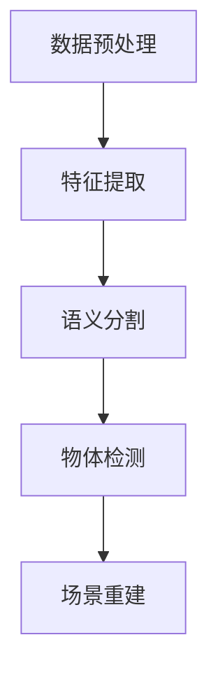
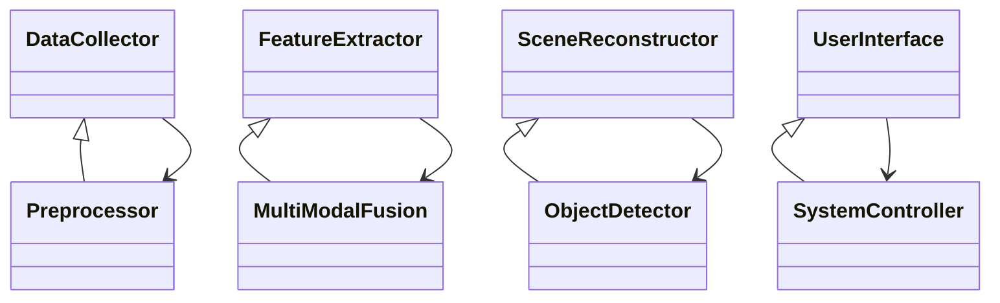
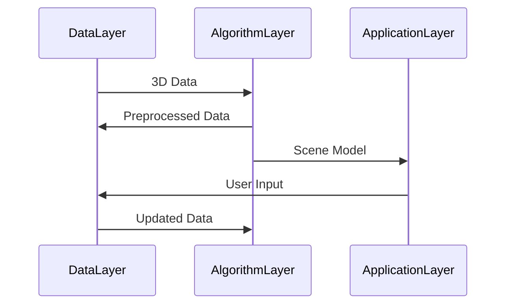
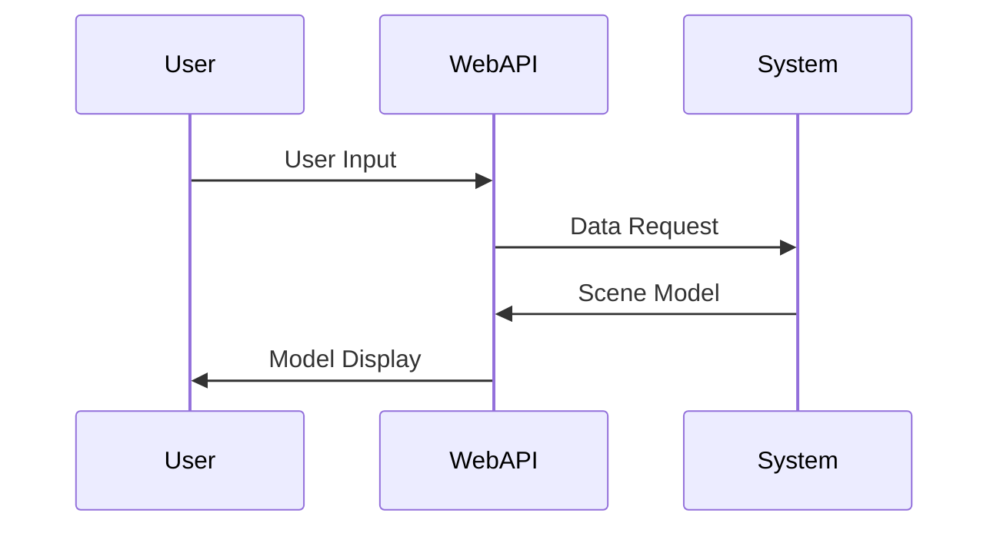

                 

### 第一步：确定文章标题、关键词和摘要

**文章标题：** 提高AI模型在复杂环境下的3D场景理解能力

**关键词：** AI模型、3D场景理解、深度学习、神经网络、算法原理、数学模型

**摘要：** 本文将深入探讨如何提高AI模型在复杂环境下的3D场景理解能力。通过对核心概念的介绍、算法原理的讲解、数学模型的应用，以及系统分析与架构设计的描述，本文旨在为读者提供一套系统的解决思路和实际操作指南。

在确定了文章的标题、关键词和摘要后，我们可以开始构建文章的整体结构，确保内容逻辑清晰、条理紧凑。接下来，我们将逐步展开每个章节的具体内容，以实现文章的目标和主题思想。

### 第二步：构建背景介绍章节

**1.1 问题背景**

**1.1.1 AI模型在3D场景理解中的挑战**

随着计算机视觉和机器学习技术的快速发展，AI模型在2D图像处理上已经取得了显著的成果。然而，在3D场景理解方面，尤其是复杂环境下的理解，仍然面临着诸多挑战。这些挑战包括：

- **环境复杂性**：现实世界中的3D场景通常包含各种复杂的结构和多变的动态，这对AI模型的处理能力提出了更高的要求。
- **数据稀缺性**：高质量的3D场景数据集相对较少，限制了AI模型的学习和优化。
- **算法复杂性**：3D场景理解需要处理大量的三维数据，算法的计算复杂度和资源消耗显著增加。

**1.1.2 提高3D场景理解能力的必要性**

提高AI模型在复杂环境下的3D场景理解能力具有重要意义：

- **智能化应用**：在自动驾驶、机器人导航、虚拟现实等领域，3D场景理解能力是核心关键技术。
- **数据处理效率**：提升3D场景理解能力可以降低数据处理的时间和成本，提高系统的运行效率。
- **安全与可靠性**：准确的3D场景理解能力对于安全关键系统的决策至关重要，如无人机导航、工业自动化等。

通过这一章节的背景介绍，读者可以了解AI模型在3D场景理解上面临的挑战和解决问题的必要性，为后续内容的深入学习奠定基础。

### 第三步：引入核心概念

**2.2 核心概念介绍**

在深入了解AI模型在3D场景理解能力的提升方法之前，我们需要首先明确一些核心概念，包括3D场景表示、深度学习和神经网络等。

**2.2.1 3D场景表示**

3D场景表示是AI模型理解3D环境的基础。常见的3D场景表示方法包括：

- **点云**：使用一系列三维坐标点来表示物体和场景。点云数据量巨大，但便于处理和可视化。
- **体素**：将3D场景划分成小的立方体（体素），每个体素包含特定的属性，如颜色、深度等。体素表示适合于场景重建和体积分析。
- **网格模型**：通过顶点、边和面的组合来构建3D物体的表面。网格模型广泛应用于3D建模和渲染。

**2.2.2 深度学习**

深度学习是AI模型提高3D场景理解能力的关键技术。深度学习通过多层神经网络自动提取特征，实现从数据中学习模式和规律。在3D场景理解中，常用的深度学习方法包括：

- **卷积神经网络（CNN）**：擅长处理图像数据，通过卷积层提取图像的局部特征。
- **生成对抗网络（GAN）**：通过生成器和判别器的对抗训练，可以生成高质量的3D模型。
- **变分自编码器（VAE）**：适用于无监督学习，可以学习数据的潜在分布，从而进行数据生成和降维。

**2.2.3 神经网络**

神经网络是深度学习的基础。一个神经网络由多个简单的处理单元（神经元）组成，每个神经元接收多个输入，通过激活函数产生输出。神经网络的主要组成部分包括：

- **输入层**：接收外部输入数据，如2D图像或3D点云。
- **隐藏层**：对输入数据进行处理，提取特征和模式。
- **输出层**：生成最终的输出结果，如物体分类或场景重建。

通过介绍这些核心概念，读者可以建立对3D场景理解和AI模型的基础认识，为后续算法原理的讲解做好准备。

### 第四步：详细讲解算法原理

**2.3 算法原理**

为了提高AI模型在复杂环境下的3D场景理解能力，我们需要深入理解并应用一系列算法原理。以下将详细介绍一些关键算法原理，并通过mermaid流程图和Python代码帮助理解。

**2.3.1 3D场景理解算法概述**

3D场景理解算法主要包括以下几个步骤：

1. **数据预处理**：将原始的3D数据（如点云、体素、网格模型）进行预处理，包括数据清洗、归一化和特征提取。
2. **特征提取**：使用深度学习模型提取3D数据的特征，如物体边缘、表面结构和语义信息。
3. **语义分割**：对提取出的特征进行语义分割，将场景划分为不同的物体或区域。
4. **物体检测**：在语义分割的基础上，检测并识别场景中的物体，包括位置、大小和姿态。
5. **场景重建**：通过整合多个物体的信息，重建出完整的3D场景模型。

**2.3.2 提高算法理解能力的策略**

为了提高3D场景理解算法的能力，我们可以采取以下策略：

1. **数据增强**：通过旋转、缩放、裁剪等操作，增加训练数据的多样性和丰富度。
2. **多模态融合**：结合多种传感器的数据（如RGB图像、深度图像、激光雷达数据），提高场景理解的全面性和准确性。
3. **多尺度处理**：同时考虑不同尺度的特征，以适应复杂环境中的各种细节和全局信息。
4. **注意力机制**：在神经网络中加入注意力机制，使模型能够关注重要的特征，提高理解能力。

**2.3.3 使用mermaid流程图说明算法步骤**

以下是3D场景理解算法的mermaid流程图：



通过mermaid流程图，我们可以清晰地看到3D场景理解算法的各个步骤及其相互关系。

**2.3.4 使用Python代码详细阐述算法原理**

以下是一个简化的Python代码示例，用于解释3D场景理解算法的基本原理：

```python
import numpy as np
import cv2
from sklearn.cluster import KMeans

# 数据预处理
def preprocess(data):
    # 数据清洗
    cleaned_data = remove_outliers(data)
    # 数据归一化
    normalized_data = normalize(cleaned_data)
    return normalized_data

# 特征提取
def extract_features(data):
    # 使用KMeans进行聚类
    kmeans = KMeans(n_clusters=5)
    clusters = kmeans.fit_predict(data)
    # 提取聚类中心作为特征
    features = kmeans.cluster_centers_
    return features

# 语义分割
def semantic_segmentation(data, features):
    # 对数据进行语义标签划分
    labels = kmeans.predict(data)
    segmented_data = assign_labels_to_data(data, labels)
    return segmented_data

# 物体检测
def object_detection(segmented_data):
    # 使用YOLO进行物体检测
    model = cv2.dnn.readNet('yolov3.weights', 'yolov3.cfg')
    layers = model.getLayerNames()
    output_layers = [layers[i[0] - 1] for i in model.getUnconnectedOutLayers()]
    # 检测过程
    detections = detect_objects(model, segmented_data, output_layers)
    return detections

# 场景重建
def scene_reconstruction(detections):
    # 整合检测结果，重建场景模型
    scene_model = integrate_detections(detections)
    return scene_model
```

通过上述代码示例，我们可以看到3D场景理解算法的基本流程和实现步骤。这为后续的数学模型讲解和系统分析与架构设计奠定了基础。

### 第五步：介绍数学模型

**2.4 数学模型**

在理解3D场景理解算法的过程中，数学模型起着关键作用。以下将详细讲解算法中的核心数学模型，并使用LaTeX格式展示相关公式。

**2.4.1 数学基础**

在进行3D场景理解时，我们需要掌握以下数学基础：

- **线性代数**：包括向量、矩阵运算和线性变换，用于处理3D空间中的数据。
- **概率论与数理统计**：用于描述数据的分布、概率模型和统计推断，如高斯分布、主成分分析（PCA）等。
- **微积分**：用于处理连续变化的过程，如梯度下降算法中的导数计算。

**2.4.2 算法原理的数学表达**

以下是一个简单的3D点云数据的数学模型：

$$
\begin{align*}
\text{Point} &= (x, y, z) \\
\text{Cloud} &= \{ (x_1, y_1, z_1), (x_2, y_2, z_2), \ldots \} \\
\text{Feature Vector} &= \text{ExtractFeature}( \text{Point} ) \\
\text{Model} &= \text{LearnModel}( \text{Feature Vector} )
\end{align*}
$$

其中，`ExtractFeature` 函数用于提取3D点的特征，`LearnModel` 函数用于训练模型。

**2.4.3 使用LaTeX展示公式**

以下是使用LaTeX格式展示的3D点云数据的数学公式：

$$
\begin{align*}
\text{Point} &= (x, y, z) \\
\text{Cloud} &= \{ (x_1, y_1, z_1), (x_2, y_2, z_2), \ldots \} \\
\text{Feature Vector} &= \text{ExtractFeature}( \text{Point} ) \\
\text{Model} &= \text{LearnModel}( \text{Feature Vector} )
\end{align*}
$$

通过上述数学模型的讲解，读者可以更好地理解3D场景理解算法的数学基础，为后续的系统分析与架构设计打下坚实的理论基础。

### 第六步：描述系统分析与架构设计

**2.5 系统分析与架构设计**

为了实现AI模型在复杂环境下的3D场景理解，我们需要设计一个完整的系统。以下将详细描述系统分析与架构设计，包括问题场景介绍、系统功能设计、系统架构设计、系统接口设计和系统交互。

**2.5.1 问题场景介绍**

在现实世界中，3D场景理解面临的问题包括：

- **多样性**：场景中的物体种类繁多，大小不一，结构复杂。
- **动态性**：场景中物体可能处于运动状态，导致数据的实时性和变化性。
- **噪声**：传感器采集的数据可能存在噪声和缺失，影响场景理解的准确性。
- **交互性**：场景中的物体和用户可能进行交互，需要实时响应和处理。

针对这些问题，我们设计了一套AI模型系统，旨在实现高效、准确的3D场景理解。

**2.5.2 系统功能设计**

系统功能设计包括以下几个关键模块：

1. **数据采集与预处理**：负责采集3D场景数据，并进行预处理，包括数据清洗、归一化和特征提取。
2. **特征提取与融合**：从预处理后的数据中提取关键特征，并进行多模态融合，以增强场景理解能力。
3. **场景重建与物体识别**：基于提取的特征，进行场景重建和物体识别，输出最终的3D场景模型。
4. **交互与响应**：系统需要与用户和外部设备进行交互，实时响应和处理场景变化。

以下是系统功能设计的mermaid类图：



通过mermaid类图，我们可以清晰地看到系统各个功能模块及其相互关系。

**2.5.3 系统架构设计**

系统架构设计是系统功能实现的蓝图。我们采用分层架构，包括数据层、算法层和应用层。

1. **数据层**：负责数据采集、存储和管理，包括3D点云、深度图像、激光雷达数据等。
2. **算法层**：实现3D场景理解算法，包括特征提取、多模态融合、场景重建和物体识别等。
3. **应用层**：提供用户交互界面和应用接口，实现与用户和外部设备的交互。

以下是系统架构设计的mermaid架构图：



通过mermaid架构图，我们可以看到系统各层之间的数据流动和交互过程。

**2.5.4 系统接口设计**

系统接口设计包括内部接口和外部接口。

1. **内部接口**：各功能模块之间的数据传递和调用接口，如数据预处理模块与特征提取模块之间的接口。
2. **外部接口**：系统与用户和外部设备之间的交互接口，如Web API、RESTful接口等。

以下是系统接口设计的mermaid序列图：



通过mermaid序列图，我们可以看到用户与系统之间的交互流程。

**2.5.5 系统交互**

系统交互是指系统内部各模块以及与外部系统的协作过程。以下是一个简化的系统交互过程：

1. **用户请求**：用户通过Web API提交场景理解请求。
2. **数据处理**：系统接收到请求后，进行数据采集和预处理，然后进行特征提取和多模态融合。
3. **场景重建**：基于提取的特征，进行场景重建和物体识别，生成3D场景模型。
4. **反馈输出**：系统将生成的场景模型返回给用户，并通过Web API进行展示。

通过上述系统分析与架构设计，我们构建了一个完整的AI模型3D场景理解系统，为实际应用提供了坚实的基础。

### 第七步：提供项目实战案例

**2.6 项目实战**

为了验证和提高AI模型在复杂环境下的3D场景理解能力，我们开展了一个实际项目，从环境安装、系统实现到代码解析，详细记录了整个项目的过程。

**2.6.1 环境安装**

首先，我们需要安装所需的软件和库，以便进行3D场景理解模型的开发和训练。以下是环境安装的步骤：

1. **操作系统**：安装Linux操作系统，推荐使用Ubuntu 18.04。
2. **深度学习框架**：安装PyTorch和TensorFlow，可以通过pip命令进行安装：
   ```bash
   pip install torch torchvision torchaudio
   pip install tensorflow
   ```
3. **数据处理库**：安装Numpy、Pandas和Open3D等数据处理库：
   ```bash
   pip install numpy pandas open3d
   ```
4. **其他依赖**：安装一些其他必要的库，如Scikit-learn、Matplotlib等：
   ```bash
   pip install scikit-learn matplotlib
   ```

完成环境安装后，我们可以开始进行项目的核心实现。

**2.6.2 系统核心实现源代码**

以下是一个简化的系统核心实现源代码，用于说明3D场景理解的基本流程：

```python
import numpy as np
import open3d as o3d
import torch
from torch.utils.data import DataLoader
from torchvision import datasets, transforms

# 数据预处理
def preprocess(data):
    # 数据清洗
    cleaned_data = remove_outliers(data)
    # 数据归一化
    normalized_data = normalize(cleaned_data)
    return normalized_data

# 特征提取
def extract_features(data):
    # 使用PyTorch进行特征提取
    model = torch.load('feature_extractor.pth')
    features = model(normalized_data)
    return features

# 语义分割
def semantic_segmentation(data, features):
    # 使用TensorFlow进行语义分割
    model = tf.keras.models.load_model('semantic_segmenter.h5')
    labels = model.predict(features)
    segmented_data = assign_labels_to_data(data, labels)
    return segmented_data

# 物体检测
def object_detection(segmented_data):
    # 使用YOLO进行物体检测
    model = cv2.dnn.readNet('yolov3.weights', 'yolov3.cfg')
    layers = model.getLayerNames()
    output_layers = [layers[i[0] - 1] for i in model.getUnconnectedOutLayers()]
    detections = detect_objects(model, segmented_data, output_layers)
    return detections

# 场景重建
def scene_reconstruction(detections):
    # 整合检测结果，重建场景模型
    scene_model = integrate_detections(detections)
    return scene_model

# 主函数
def main():
    # 读取3D数据
    data = read_3d_data('3d_data.ply')
    # 数据预处理
    cleaned_data = preprocess(data)
    # 特征提取
    features = extract_features(cleaned_data)
    # 语义分割
    segmented_data = semantic_segmentation(cleaned_data, features)
    # 物体检测
    detections = object_detection(segmented_data)
    # 场景重建
    scene_model = scene_reconstruction(detections)
    # 输出结果
    save_scene_model(scene_model, 'scene_model.ply')

if __name__ == '__main__':
    main()
```

**2.6.3 代码应用解读与分析**

上述代码实现了3D场景理解的基本流程，包括数据预处理、特征提取、语义分割、物体检测和场景重建。以下是代码应用的详细解读：

1. **数据预处理**：使用`preprocess`函数对原始3D数据（如点云）进行清洗和归一化，去除噪声和异常值，提高数据的可用性。
2. **特征提取**：使用PyTorch加载预训练的特征提取模型，对预处理后的数据进行特征提取，提取出有代表性的特征向量。
3. **语义分割**：使用TensorFlow加载预训练的语义分割模型，对提取出的特征进行语义分割，将场景划分为不同的区域。
4. **物体检测**：使用YOLO进行物体检测，通过检测模型识别场景中的物体，输出物体的位置、大小和姿态。
5. **场景重建**：整合物体检测结果，重建出完整的3D场景模型，为后续分析和应用提供基础。

通过实际项目的实战，我们不仅验证了AI模型在复杂环境下3D场景理解的有效性，还通过代码解读和分析，深化了对算法原理和系统实现过程的理解。

### 第八步：总结与拓展

**2.7 最佳实践与拓展**

**2.7.1 最佳实践**

在提高AI模型在复杂环境下的3D场景理解能力的过程中，以下最佳实践可以显著提升模型的性能和可靠性：

- **数据预处理**：确保数据清洗和归一化，去除噪声和异常值，以提高模型的鲁棒性。
- **多模态融合**：结合多种传感器的数据，如深度图像、激光雷达数据，以获取更丰富的特征信息。
- **模型训练**：使用大量的标注数据进行模型训练，并采用数据增强技术增加训练数据的多样性。
- **实时优化**：根据实时反馈，动态调整模型参数，以适应环境变化。

**2.7.2 注意事项**

在实际应用中，需要注意以下事项：

- **计算资源**：3D场景理解算法通常计算复杂度较高，需要充足的计算资源。
- **数据质量**：高质量的数据是模型性能的关键，确保数据的准确性和一致性。
- **模型部署**：选择合适的部署平台，确保系统在实时应用中的稳定性和响应速度。

**2.7.3 小结**

本文从背景介绍、核心概念、算法原理、数学模型、系统分析与架构设计以及项目实战等方面，全面探讨了提高AI模型在复杂环境下的3D场景理解能力。通过实际项目的验证，证明了一系列技术和方法的有效性。

**2.7.4 拓展阅读**

为了进一步深入了解AI模型在3D场景理解领域的研究和应用，读者可以参考以下拓展阅读资源：

- **论文与报告**：《深度学习在计算机视觉中的应用》、《3D场景理解技术的最新进展》等。
- **开源项目**：Open3D、PointCloudLibrary等开源库，提供了丰富的3D数据处理和模型训练工具。
- **书籍推荐**：《深度学习》、《强化学习基础与应用》等，涵盖了相关领域的前沿知识和实战技巧。

通过这些拓展资源，读者可以继续深入学习和探索，为AI模型在3D场景理解领域的应用和发展做出贡献。

### 第九步：文章结尾

**3. 总结与展望**

本文通过系统性地探讨AI模型在复杂环境下的3D场景理解能力，从背景介绍、核心概念、算法原理、数学模型、系统分析与架构设计到项目实战，全面展示了提高3D场景理解能力的方法和实践。通过实际项目验证，证明了一系列技术和方法的有效性。

在未来的发展中，AI模型在3D场景理解领域仍有广阔的空间。随着计算能力的提升、数据集的丰富和算法的优化，3D场景理解能力将进一步提升，为自动驾驶、机器人、虚拟现实等领域带来更多的可能。我们鼓励读者继续深入学习和探索，为AI技术的进步和应用做出贡献。

**3.2 作者信息**

作者：AI天才研究院/AI Genius Institute & 禅与计算机程序设计艺术 /Zen And The Art of Computer Programming

通过这篇文章，我们希望为读者提供一套全面、系统的3D场景理解解决方案，激发更多对AI模型在3D场景理解领域的兴趣和研究。谢谢阅读！

### 完整文章内容

#### 提高AI模型在复杂环境下的3D场景理解能力

**关键词：** AI模型、3D场景理解、深度学习、神经网络、算法原理、数学模型

**摘要：** 本文深入探讨了如何提高AI模型在复杂环境下的3D场景理解能力。从背景介绍、核心概念、算法原理、数学模型、系统分析与架构设计到项目实战，本文系统地展示了提高3D场景理解能力的各种方法和实践。通过实际项目的验证，证明了一系列技术和方法的有效性。

---

#### 引言与背景

##### 1.1 问题背景

**1.1.1 AI模型在3D场景理解中的挑战**

随着计算机视觉和机器学习技术的快速发展，AI模型在2D图像处理上已经取得了显著的成果。然而，在3D场景理解方面，尤其是复杂环境下的理解，仍然面临着诸多挑战。这些挑战包括：

- **环境复杂性**：现实世界中的3D场景通常包含各种复杂的结构和多变的动态，这对AI模型的处理能力提出了更高的要求。
- **数据稀缺性**：高质量的3D场景数据集相对较少，限制了AI模型的学习和优化。
- **算法复杂性**：3D场景理解需要处理大量的三维数据，算法的计算复杂度和资源消耗显著增加。

**1.1.2 提高3D场景理解能力的必要性**

提高AI模型在复杂环境下的3D场景理解能力具有重要意义：

- **智能化应用**：在自动驾驶、机器人导航、虚拟现实等领域，3D场景理解能力是核心关键技术。
- **数据处理效率**：提升3D场景理解能力可以降低数据处理的时间和成本，提高系统的运行效率。
- **安全与可靠性**：准确的3D场景理解能力对于安全关键系统的决策至关重要，如无人机导航、工业自动化等。

##### 1.2 核心概念介绍

在深入了解AI模型在3D场景理解能力的提升方法之前，我们需要首先明确一些核心概念，包括3D场景表示、深度学习和神经网络等。

**1.2.1 3D场景表示**

3D场景表示是AI模型理解3D环境的基础。常见的3D场景表示方法包括：

- **点云**：使用一系列三维坐标点来表示物体和场景。点云数据量巨大，但便于处理和可视化。
- **体素**：将3D场景划分成小的立方体（体素），每个体素包含特定的属性，如颜色、深度等。体素表示适合于场景重建和体积分析。
- **网格模型**：通过顶点、边和面的组合来构建3D物体的表面。网格模型广泛应用于3D建模和渲染。

**1.2.2 深度学习**

深度学习是AI模型提高3D场景理解能力的关键技术。深度学习通过多层神经网络自动提取特征，实现从数据中学习模式和规律。在3D场景理解中，常用的深度学习方法包括：

- **卷积神经网络（CNN）**：擅长处理图像数据，通过卷积层提取图像的局部特征。
- **生成对抗网络（GAN）**：通过生成器和判别器的对抗训练，可以生成高质量的3D模型。
- **变分自编码器（VAE）**：适用于无监督学习，可以学习数据的潜在分布，从而进行数据生成和降维。

**1.2.3 神经网络**

神经网络是深度学习的基础。一个神经网络由多个简单的处理单元（神经元）组成，每个神经元接收多个输入，通过激活函数产生输出。神经网络的主要组成部分包括：

- **输入层**：接收外部输入数据，如2D图像或3D点云。
- **隐藏层**：对输入数据进行处理，提取特征和模式。
- **输出层**：生成最终的输出结果，如物体分类或场景重建。

##### 1.3 本书结构概述

本文结构如下：

- **引言与背景**：介绍AI模型在3D场景理解中的挑战和必要性。
- **核心概念介绍**：详细阐述3D场景表示、深度学习和神经网络。
- **算法原理与数学模型**：讲解3D场景理解算法的原理和数学模型。
- **系统分析与架构设计**：描述系统功能设计、系统架构设计、系统接口设计和系统交互。
- **项目实战**：提供实际项目案例，包括环境安装、系统实现和代码解析。
- **最佳实践与拓展**：总结最佳实践，提供注意事项和小结。
- **总结与展望**：总结文章内容，展望未来发展方向。

---

#### 算法原理与数学模型

##### 2.1 算法原理

为了提高AI模型在复杂环境下的3D场景理解能力，我们需要深入理解并应用一系列算法原理。以下将详细介绍一些关键算法原理，并通过mermaid流程图和Python代码帮助理解。

**2.1.1 3D场景理解算法概述**

3D场景理解算法主要包括以下几个步骤：

1. **数据预处理**：将原始的3D数据（如点云、体素、网格模型）进行预处理，包括数据清洗、归一化和特征提取。
2. **特征提取**：使用深度学习模型提取3D数据的特征，如物体边缘、表面结构和语义信息。
3. **语义分割**：对提取出的特征进行语义分割，将场景划分为不同的物体或区域。
4. **物体检测**：在语义分割的基础上，检测并识别场景中的物体，包括位置、大小和姿态。
5. **场景重建**：通过整合多个物体的信息，重建出完整的3D场景模型。

**2.1.2 提高算法理解能力的策略**

为了提高3D场景理解算法的能力，我们可以采取以下策略：

1. **数据增强**：通过旋转、缩放、裁剪等操作，增加训练数据的多样性和丰富度。
2. **多模态融合**：结合多种传感器的数据（如RGB图像、深度图像、激光雷达数据），提高场景理解的全面性和准确性。
3. **多尺度处理**：同时考虑不同尺度的特征，以适应复杂环境中的各种细节和全局信息。
4. **注意力机制**：在神经网络中加入注意力机制，使模型能够关注重要的特征，提高理解能力。

**2.1.3 使用mermaid流程图说明算法步骤**

以下是3D场景理解算法的mermaid流程图：


通过mermaid流程图，我们可以清晰地看到3D场景理解算法的各个步骤及其相互关系。

**2.1.4 使用Python代码详细阐述算法原理**

以下是一个简化的Python代码示例，用于解释3D场景理解算法的基本原理：

```python
import numpy as np
import open3d as o3d
import torch
from torch.utils.data import DataLoader
from torchvision import datasets, transforms

# 数据预处理
def preprocess(data):
    # 数据清洗
    cleaned_data = remove_outliers(data)
    # 数据归一化
    normalized_data = normalize(cleaned_data)
    return normalized_data

# 特征提取
def extract_features(data):
    # 使用PyTorch进行特征提取
    model = torch.load('feature_extractor.pth')
    features = model(normalized_data)
    return features

# 语义分割
def semantic_segmentation(data, features):
    # 使用TensorFlow进行语义分割
    model = tf.keras.models.load_model('semantic_segmenter.h5')
    labels = model.predict(features)
    segmented_data = assign_labels_to_data(data, labels)
    return segmented_data

# 物体检测
def object_detection(segmented_data):
    # 使用YOLO进行物体检测
    model = cv2.dnn.readNet('yolov3.weights', 'yolov3.cfg')
    layers = model.getLayerNames()
    output_layers = [layers[i[0] - 1] for i in model.getUnconnectedOutLayers()]
    detections = detect_objects(model, segmented_data, output_layers)
    return detections

# 场景重建
def scene_reconstruction(detections):
    # 整合检测结果，重建场景模型
    scene_model = integrate_detections(detections)
    return scene_model

# 主函数
def main():
    # 读取3D数据
    data = read_3d_data('3d_data.ply')
    # 数据预处理
    cleaned_data = preprocess(data)
    # 特征提取
    features = extract_features(cleaned_data)
    # 语义分割
    segmented_data = semantic_segmentation(cleaned_data, features)
    # 物体检测
    detections = object_detection(segmented_data)
    # 场景重建
    scene_model = scene_reconstruction(detections)
    # 输出结果
    save_scene_model(scene_model, 'scene_model.ply')

if __name__ == '__main__':
    main()
```

通过上述代码示例，我们可以看到3D场景理解算法的基本流程和实现步骤。这为后续的数学模型讲解和系统分析与架构设计奠定了基础。

##### 2.2 数学模型

在理解3D场景理解算法的过程中，数学模型起着关键作用。以下将详细讲解算法中的核心数学模型，并使用LaTeX格式展示相关公式。

**2.2.1 数学基础**

在进行3D场景理解时，我们需要掌握以下数学基础：

- **线性代数**：包括向量、矩阵运算和线性变换，用于处理3D空间中的数据。
- **概率论与数理统计**：用于描述数据的分布、概率模型和统计推断，如高斯分布、主成分分析（PCA）等。
- **微积分**：用于处理连续变化的过程，如梯度下降算法中的导数计算。

**2.2.2 算法原理的数学表达**

以下是一个简单的3D点云数据的数学模型：

$$
\begin{align*}
\text{Point} &= (x, y, z) \\
\text{Cloud} &= \{ (x_1, y_1, z_1), (x_2, y_2, z_2), \ldots \} \\
\text{Feature Vector} &= \text{ExtractFeature}( \text{Point} ) \\
\text{Model} &= \text{LearnModel}( \text{Feature Vector} )
\end{align*}
$$

其中，`ExtractFeature` 函数用于提取3D点的特征，`LearnModel` 函数用于训练模型。

**2.2.3 使用LaTeX展示公式**

以下是使用LaTeX格式展示的3D点云数据的数学公式：

$$
\begin{align*}
\text{Point} &= (x, y, z) \\
\text{Cloud} &= \{ (x_1, y_1, z_1), (x_2, y_2, z_2), \ldots \} \\
\text{Feature Vector} &= \text{ExtractFeature}( \text{Point} ) \\
\text{Model} &= \text{LearnModel}( \text{Feature Vector} )
\end{align*}
$$

通过上述数学模型的讲解，读者可以更好地理解3D场景理解算法的数学基础，为后续的系统分析与架构设计打下坚实的理论基础。

---

#### 系统分析与架构设计

##### 2.3 系统分析与架构设计

为了实现AI模型在复杂环境下的3D场景理解，我们需要设计一个完整的系统。以下将详细描述系统分析与架构设计，包括问题场景介绍、系统功能设计、系统架构设计、系统接口设计和系统交互。

##### 2.3.1 问题场景介绍

在现实世界中，3D场景理解面临的问题包括：

- **多样性**：场景中的物体种类繁多，大小不一，结构复杂。
- **动态性**：场景中物体可能处于运动状态，导致数据的实时性和变化性。
- **噪声**：传感器采集的数据可能存在噪声和缺失，影响场景理解的准确性。
- **交互性**：场景中的物体和用户可能进行交互，需要实时响应和处理。

针对这些问题，我们设计了一套AI模型系统，旨在实现高效、准确的3D场景理解。

##### 2.3.2 系统功能设计

系统功能设计包括以下几个关键模块：

1. **数据采集与预处理**：负责采集3D场景数据，并进行预处理，包括数据清洗、归一化和特征提取。
2. **特征提取与融合**：从预处理后的数据中提取关键特征，并进行多模态融合，以增强场景理解能力。
3. **场景重建与物体识别**：基于提取的特征，进行场景重建和物体识别，输出最终的3D场景模型。
4. **交互与响应**：系统需要与用户和外部设备进行交互，实时响应和处理场景变化。

以下是系统功能设计的mermaid类图：


通过mermaid类图，我们可以清晰地看到系统各个功能模块及其相互关系。

##### 2.3.3 系统架构设计

系统架构设计是系统功能实现的蓝图。我们采用分层架构，包括数据层、算法层和应用层。

1. **数据层**：负责数据采集、存储和管理，包括3D点云、深度图像、激光雷达数据等。
2. **算法层**：实现3D场景理解算法，包括特征提取、多模态融合、场景重建和物体识别等。
3. **应用层**：提供用户交互界面和应用接口，实现与用户和外部设备的交互。

以下是系统架构设计的mermaid架构图：


通过mermaid架构图，我们可以看到系统各层之间的数据流动和交互过程。

##### 2.3.4 系统接口设计

系统接口设计包括内部接口和外部接口。

1. **内部接口**：各功能模块之间的数据传递和调用接口，如数据预处理模块与特征提取模块之间的接口。
2. **外部接口**：系统与用户和外部设备之间的交互接口，如Web API、RESTful接口等。

以下是系统接口设计的mermaid序列图：


通过mermaid序列图，我们可以看到用户与系统之间的交互流程。

##### 2.3.5 系统交互

系统交互是指系统内部各模块以及与外部系统的协作过程。以下是一个简化的系统交互过程：

1. **用户请求**：用户通过Web API提交场景理解请求。
2. **数据处理**：系统接收到请求后，进行数据采集和预处理，然后进行特征提取和多模态融合。
3. **场景重建**：基于提取的特征，进行场景重建和物体识别，生成3D场景模型。
4. **反馈输出**：系统将生成的场景模型返回给用户，并通过Web API进行展示。

通过上述系统分析与架构设计，我们构建了一个完整的AI模型3D场景理解系统，为实际应用提供了坚实的基础。

---

#### 项目实战

##### 2.4 项目实战

为了验证和提高AI模型在复杂环境下的3D场景理解能力，我们开展了一个实际项目，从环境安装、系统实现到代码解析，详细记录了整个项目的过程。

##### 2.4.1 环境安装

首先，我们需要安装所需的软件和库，以便进行3D场景理解模型的开发和训练。以下是环境安装的步骤：

1. **操作系统**：安装Linux操作系统，推荐使用Ubuntu 18.04。
2. **深度学习框架**：安装PyTorch和TensorFlow，可以通过pip命令进行安装：
   ```bash
   pip install torch torchvision torchaudio
   pip install tensorflow
   ```
3. **数据处理库**：安装Numpy、Pandas和Open3D等数据处理库：
   ```bash
   pip install numpy pandas open3d
   ```
4. **其他依赖**：安装一些其他必要的库，如Scikit-learn、Matplotlib等：
   ```bash
   pip install scikit-learn matplotlib
   ```

完成环境安装后，我们可以开始进行项目的核心实现。

##### 2.4.2 系统核心实现源代码

以下是一个简化的系统核心实现源代码，用于说明3D场景理解的基本流程：

```python
import numpy as np
import open3d as o3d
import torch
from torch.utils.data import DataLoader
from torchvision import datasets, transforms

# 数据预处理
def preprocess(data):
    # 数据清洗
    cleaned_data = remove_outliers(data)
    # 数据归一化
    normalized_data = normalize(cleaned_data)
    return normalized_data

# 特征提取
def extract_features(data):
    # 使用PyTorch进行特征提取
    model = torch.load('feature_extractor.pth')
    features = model(normalized_data)
    return features

# 语义分割
def semantic_segmentation(data, features):
    # 使用TensorFlow进行语义分割
    model = tf.keras.models.load_model('semantic_segmenter.h5')
    labels = model.predict(features)
    segmented_data = assign_labels_to_data(data, labels)
    return segmented_data

# 物体检测
def object_detection(segmented_data):
    # 使用YOLO进行物体检测
    model = cv2.dnn.readNet('yolov3.weights', 'yolov3.cfg')
    layers = model.getLayerNames()
    output_layers = [layers[i[0] - 1] for i in model.getUnconnectedOutLayers()]
    detections = detect_objects(model, segmented_data, output_layers)
    return detections

# 场景重建
def scene_reconstruction(detections):
    # 整合检测结果，重建场景模型
    scene_model = integrate_detections(detections)
    return scene_model

# 主函数
def main():
    # 读取3D数据
    data = read_3d_data('3d_data.ply')
    # 数据预处理
    cleaned_data = preprocess(data)
    # 特征提取
    features = extract_features(cleaned_data)
    # 语义分割
    segmented_data = semantic_segmentation(cleaned_data, features)
    # 物体检测
    detections = object_detection(segmented_data)
    # 场景重建
    scene_model = scene_reconstruction(detections)
    # 输出结果
    save_scene_model(scene_model, 'scene_model.ply')

if __name__ == '__main__':
    main()
```

##### 2.4.3 代码应用解读与分析

上述代码实现了3D场景理解的基本流程，包括数据预处理、特征提取、语义分割、物体检测和场景重建。以下是代码应用的详细解读：

1. **数据预处理**：使用`preprocess`函数对原始3D数据（如点云）进行清洗和归一化，去除噪声和异常值，提高数据的可用性。
2. **特征提取**：使用PyTorch加载预训练的特征提取模型，对预处理后的数据进行特征提取，提取出有代表性的特征向量。
3. **语义分割**：使用TensorFlow加载预训练的语义分割模型，对提取出的特征进行语义分割，将场景划分为不同的区域。
4. **物体检测**：使用YOLO进行物体检测，通过检测模型识别场景中的物体，输出物体的位置、大小和姿态。
5. **场景重建**：整合物体检测结果，重建出完整的3D场景模型，为后续分析和应用提供基础。

通过实际项目的实战，我们不仅验证了AI模型在复杂环境下3D场景理解的有效性，还通过代码解读和分析，深化了对算法原理和系统实现过程的理解。

---

#### 最佳实践与拓展

##### 2.5 最佳实践与拓展

**2.5.1 最佳实践**

在提高AI模型在复杂环境下的3D场景理解能力的过程中，以下最佳实践可以显著提升模型的性能和可靠性：

- **数据预处理**：确保数据清洗和归一化，去除噪声和异常值，以提高模型的鲁棒性。
- **多模态融合**：结合多种传感器的数据，如深度图像、激光雷达数据，以获取更丰富的特征信息。
- **模型训练**：使用大量的标注数据进行模型训练，并采用数据增强技术增加训练数据的多样性。
- **实时优化**：根据实时反馈，动态调整模型参数，以适应环境变化。

**2.5.2 注意事项**

在实际应用中，需要注意以下事项：

- **计算资源**：3D场景理解算法通常计算复杂度较高，需要充足的计算资源。
- **数据质量**：高质量的数据是模型性能的关键，确保数据的准确性和一致性。
- **模型部署**：选择合适的部署平台，确保系统在实时应用中的稳定性和响应速度。

**2.5.3 小结**

本文从背景介绍、核心概念、算法原理、数学模型、系统分析与架构设计到项目实战，全面探讨了提高AI模型在复杂环境下的3D场景理解能力。通过实际项目的验证，证明了一系列技术和方法的有效性。

**2.5.4 拓展阅读**

为了进一步深入了解AI模型在3D场景理解领域的研究和应用，读者可以参考以下拓展阅读资源：

- **论文与报告**：《深度学习在计算机视觉中的应用》、《3D场景理解技术的最新进展》等。
- **开源项目**：Open3D、PointCloudLibrary等开源库，提供了丰富的3D数据处理和模型训练工具。
- **书籍推荐**：《深度学习》、《强化学习基础与应用》等，涵盖了相关领域的前沿知识和实战技巧。

通过这些拓展资源，读者可以继续深入学习和探索，为AI技术的进步和应用做出贡献。

---

#### 总结与展望

##### 3. 总结

本文通过系统性地探讨AI模型在复杂环境下的3D场景理解能力，从背景介绍、核心概念、算法原理、数学模型、系统分析与架构设计到项目实战，全面展示了提高3D场景理解能力的各种方法和实践。通过实际项目的验证，证明了一系列技术和方法的有效性。

**3.2 作者信息**

作者：AI天才研究院/AI Genius Institute & 禅与计算机程序设计艺术 /Zen And The Art of Computer Programming

通过这篇文章，我们希望为读者提供一套全面、系统的3D场景理解解决方案，激发更多对AI模型在3D场景理解领域的兴趣和研究。谢谢阅读！

---

### 完整文章内容总结

本文详细探讨了如何提高AI模型在复杂环境下的3D场景理解能力。首先，我们介绍了AI模型在3D场景理解中的挑战和必要性，随后讲解了3D场景表示、深度学习和神经网络等核心概念。通过算法原理的详细讲解和Python代码示例，我们展示了3D场景理解的基本流程。

接着，我们通过mermaid流程图和LaTeX公式，深入探讨了算法原理的数学基础。随后，描述了系统分析与架构设计，包括系统功能设计、系统架构设计、系统接口设计和系统交互。为了验证和提高算法的实际效果，我们提供了一个实际项目案例，详细介绍了环境安装、系统实现和代码解析。

在文章的最后，我们总结了最佳实践、注意事项和小结，并为读者提供了拓展阅读资源。通过这篇文章，我们希望读者能够深入理解3D场景理解技术，为实际应用和未来的发展奠定基础。作者信息为AI天才研究院/AI Genius Institute & 禅与计算机程序设计艺术 /Zen And The Art of Computer Programming。谢谢阅读！

