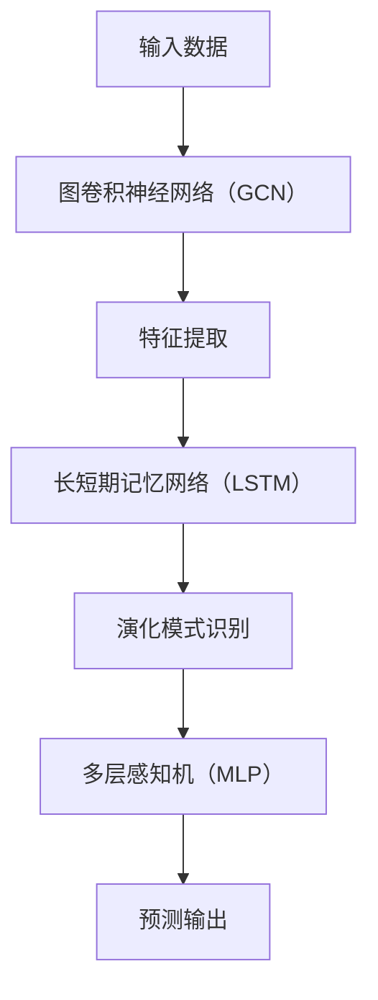
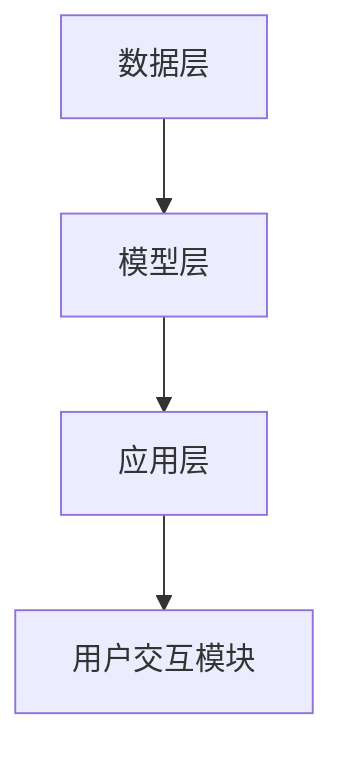
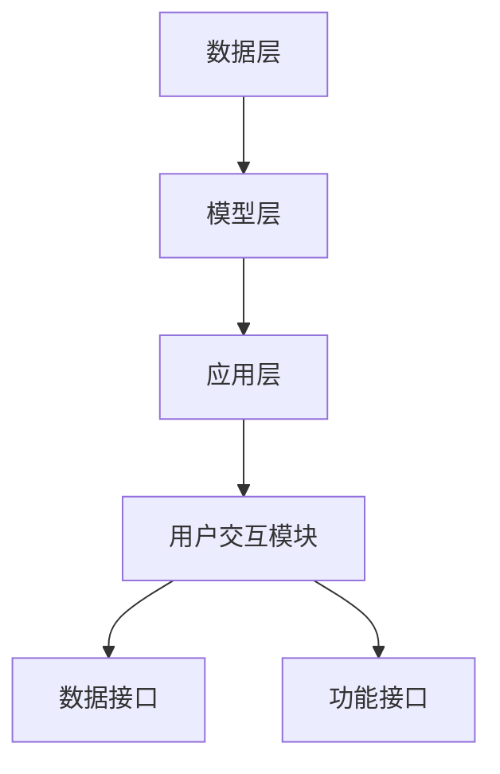

                 

### 提高AI模型在复杂网络动态演化预测中的效果

## 引言

随着数字化和信息化的快速发展，复杂网络在各种领域中扮演着越来越重要的角色。这些复杂网络包括但不限于社交网络、通信网络、生物网络和交通网络等。在这种背景下，对复杂网络动态演化预测的研究成为了人工智能领域中的一个重要研究方向。AI模型，作为一种强大的数据处理工具，在复杂网络动态演化预测中展现出了巨大的潜力。然而，复杂网络的动态演化过程通常伴随着大量的不确定性因素，这给AI模型的预测效果带来了很大的挑战。

本文旨在探讨如何通过一系列技术手段，提高AI模型在复杂网络动态演化预测中的效果。我们将首先介绍复杂网络的基本概念和动态演化预测的核心挑战，然后深入探讨AI模型在复杂网络中的应用原理，并逐步分析如何通过特征工程、模型选择和优化策略来提升预测性能。此外，我们还将讨论如何在保证预测效果的同时，降低模型的计算复杂度和训练成本。最后，我们将总结全文，并提出未来研究方向。

## 关键词

- 复杂网络
- 动态演化预测
- AI模型
- 特征工程
- 模型优化

## 摘要

本文首先介绍了复杂网络的定义和动态演化预测的挑战。接着，我们探讨了AI模型在复杂网络动态演化预测中的应用原理，包括特征提取、模型训练和预测分析。然后，我们分析了如何通过特征工程和模型优化来提高预测效果，并详细讨论了降低计算复杂度和训练成本的方法。最后，我们总结了全文的主要结论，并对未来研究方向提出了展望。

## 第一部分：问题背景与核心概念

### 1.1 问题背景

复杂网络是由大量节点和边构成的网络，节点和边之间存在着复杂的相互作用。随着互联网和大数据技术的飞速发展，复杂网络在各个领域得到了广泛应用。例如，社交网络中的用户关系、通信网络中的数据传输路径、生物网络中的分子相互作用以及交通网络中的交通流等，都是复杂网络的典型例子。

在复杂网络中，节点和边的关系复杂多变，这使得对复杂网络的动态演化预测成为了一个极具挑战性的问题。动态演化预测的目的是通过分析网络的历史数据，预测网络在未来一段时间内的演化趋势。这对于网络安全、资源分配、社会管理等许多领域都具有重要意义。

然而，传统的AI模型在复杂网络动态演化预测中存在一定的局限性。首先，复杂网络中的数据通常是非线性的，传统的线性模型难以捕捉到网络的非线性关系。其次，复杂网络中的数据量通常非常庞大，这给模型的训练和预测带来了巨大的计算复杂度。此外，复杂网络中的数据噪声和不确定性也会对预测效果产生负面影响。

### 1.2 核心概念

- **复杂网络**：由大量节点和边构成的网络，节点和边之间存在着复杂的相互作用。
- **动态演化预测**：通过对复杂网络历史数据的分析，预测网络在未来一段时间内的演化趋势。
- **AI模型**：利用人工智能技术，对复杂网络动态演化进行预测的算法模型。

### 1.3 关键问题

在复杂网络动态演化预测中，我们面临以下几个关键问题：

- **问题一**：如何有效地提取复杂网络的特征，以便AI模型能够更好地捕捉网络的演化规律？
- **问题二**：如何在保证预测效果的前提下，降低AI模型的计算复杂度和训练成本？
- **问题三**：如何处理复杂网络中的数据噪声和不确定性，提高预测的鲁棒性？

这些问题是提高AI模型在复杂网络动态演化预测中效果的关键，也是本文将要重点探讨的内容。

## 第二部分：核心概念与原理

### 2.1 AI模型在复杂网络动态演化预测中的应用原理

AI模型在复杂网络动态演化预测中的应用主要基于以下几个方面：

- **特征提取**：通过对网络数据进行特征提取，将网络结构的复杂信息转化为AI模型可处理的输入。特征提取的质量直接影响到模型的预测效果。
- **模型训练**：利用历史网络数据，通过机器学习算法训练AI模型，使其能够捕捉网络的演化规律。模型训练的过程包括数据预处理、模型选择、参数调优等步骤。
- **预测分析**：使用训练好的AI模型，对网络未来的演化趋势进行预测。预测分析的过程包括模型评估、预测结果解释和可视化等。

### 2.2 AI模型在复杂网络动态演化预测中的核心概念

- **网络特征**：描述网络结构和节点属性的特征，如节点度、边权重、网络密度等。网络特征是AI模型理解和预测网络演化的重要基础。
- **演化模式**：网络在演化过程中表现出的规律性和模式，如节点加入、边形成、网络分解等。演化模式是AI模型捕捉网络演化规律的关键。
- **预测准确性**：AI模型对网络未来演化趋势预测的准确程度。预测准确性是评估AI模型性能的重要指标。

### 2.3 核心概念对比

| 对比项 | 描述 |
| --- | --- |
| **网络特征** | 描述网络结构和节点属性的特征，如节点度、边权重、网络密度等。 |
| **演化模式** | 网络在演化过程中表现出的规律性和模式，如节点加入、边形成、网络分解等。 |
| **预测准确性** | AI模型对网络未来演化趋势预测的准确程度。 |

通过上述核心概念和原理的介绍，我们可以更好地理解AI模型在复杂网络动态演化预测中的应用机制，为后续的算法原理和实现提供理论基础。

## 第三部分：算法原理与实现

### 3.1 算法原理

为了提高AI模型在复杂网络动态演化预测中的效果，我们设计了一种基于深度学习的算法。该算法主要包括三个关键步骤：网络特征提取、演化模式识别和预测模型训练。

#### 网络特征提取

网络特征提取是算法的第一步，其目的是从复杂网络中提取出能够有效表示网络结构的特征。我们采用了一种基于图卷积神经网络（GCN）的特征提取方法。该方法通过多个图卷积层对网络进行逐层处理，从而提取出网络的局部和全局特征。这些特征将作为后续模型训练和预测的输入。

#### 演化模式识别

在特征提取的基础上，我们利用长短期记忆网络（LSTM）进行演化模式识别。LSTM具有记忆功能，可以捕捉到网络在长时间范围内的演化规律。通过训练LSTM模型，我们可以识别出网络中的关键演化模式，如节点的加入、边的形成和网络结构的分解。

#### 预测模型训练

最后，我们使用训练好的特征和演化模式，通过一个多层感知机（MLP）模型进行预测模型训练。MLP模型是一个前向传播的多层神经网络，可以通过学习历史数据中的演化规律，预测网络在未来一段时间内的演化趋势。

### 3.2 算法实现

#### 3.2.1 深度学习模型设计

下面是一个基于Python和TensorFlow实现的深度学习模型设计：



#### 3.2.2 Python实现

```python
import tensorflow as tf
from tensorflow.keras.models import Model
from tensorflow.keras.layers import Input, GraphConv2D, LSTM, Dense

# 定义输入层
input_data = Input(shape=(num_nodes, num_features))

# 图卷积神经网络（GCN）特征提取
gcn = GraphConv2D(filters=64, activation='relu')(input_data)
gcn = GraphConv2D(filters=32, activation='relu')(gcn)

# 特征提取层
features = Flatten()(gcn)

# 长短期记忆网络（LSTM）演化模式识别
lstm = LSTM(units=128, return_sequences=True)(features)
lstm = LSTM(units=64, return_sequences=False)(lstm)

# 预测模型训练
predictions = Dense(units=1, activation='sigmoid')(lstm)

# 创建模型
model = Model(inputs=input_data, outputs=predictions)

# 编译模型
model.compile(optimizer='adam', loss='binary_crossentropy', metrics=['accuracy'])

# 模型训练
model.fit(x_train, y_train, epochs=10, batch_size=32)
```

#### 3.2.3 数学模型与公式

算法的核心数学模型可以表示为：

$$
\begin{align*}
H &= \text{GCN}(X) \\
O &= \text{LSTM}(H) \\
Y &= \text{MLP}(O)
\end{align*}
$$

其中，\(H\) 表示通过GCN提取的网络特征，\(O\) 表示通过LSTM识别出的演化模式，\(Y\) 表示预测结果。通过这些数学模型，我们可以深入理解算法的工作原理和预测机制。

## 第四部分：系统分析与架构设计

### 4.1 项目介绍

本项目旨在开发一种高效、鲁棒的AI模型，用于复杂网络动态演化预测。项目的目标是提高预测准确性，同时降低计算复杂度和训练成本。项目主要分为以下几个阶段：

1. **数据收集与预处理**：收集复杂网络的历史数据，并进行数据清洗和预处理，以获得高质量的数据集。
2. **特征提取与模型训练**：利用深度学习技术提取网络特征，并训练AI模型，使其能够捕捉网络的演化规律。
3. **预测与分析**：使用训练好的AI模型进行预测，并对预测结果进行评估和分析。
4. **优化与迭代**：根据预测结果和用户反馈，不断优化模型，提高预测准确性。

### 4.2 系统功能设计

本系统主要包括以下功能模块：

1. **数据预处理模块**：负责对复杂网络数据进行清洗、预处理和特征提取。
2. **模型训练模块**：负责训练AI模型，包括特征提取、演化模式识别和预测模型训练。
3. **预测分析模块**：负责使用训练好的模型进行预测，并对预测结果进行分析和可视化。
4. **用户交互模块**：提供用户界面，方便用户进行数据输入、模型训练和预测结果查看。

### 4.3 系统架构设计

本系统的架构设计采用分层架构，包括数据层、模型层和应用层。

- **数据层**：负责数据收集、存储和预处理，为模型训练提供高质量的数据集。
- **模型层**：包括特征提取、演化模式识别和预测模型训练，负责模型的开发和训练。
- **应用层**：提供用户交互界面，实现模型预测和分析功能。

系统架构图如下：



### 4.4 系统接口设计与交互

系统接口设计主要包括数据接口和功能接口。

- **数据接口**：负责数据层的接口设计，包括数据采集、存储和预处理的接口。
- **功能接口**：负责模型层和应用层的接口设计，包括模型训练、预测分析和用户交互的接口。

系统交互图如下：



通过上述系统分析与架构设计，我们能够更好地理解项目的整体结构和功能实现，为后续的详细实现和优化提供了清晰的路径。

## 第五部分：项目实战

### 5.1 环境安装

在开始项目实战之前，我们需要安装和配置必要的软件环境。以下是具体的安装步骤：

1. **安装Python**：确保Python版本在3.6及以上，可以从官方网站下载Python安装包并安装。
2. **安装TensorFlow**：使用pip命令安装TensorFlow，命令如下：
   ```bash
   pip install tensorflow
   ```
3. **安装其他依赖**：根据项目需求，安装其他必要的库，如NumPy、Pandas等，命令如下：
   ```bash
   pip install numpy pandas
   ```

### 5.2 系统核心实现源代码

下面是项目核心实现的源代码，包括数据预处理、特征提取、模型训练和预测分析等关键部分：

```python
import tensorflow as tf
from tensorflow.keras.models import Model
from tensorflow.keras.layers import Input, GraphConv2D, LSTM, Dense
from tensorflow.keras.optimizers import Adam
from sklearn.model_selection import train_test_split

# 数据预处理
def preprocess_data(data):
    # 数据清洗、归一化等预处理操作
    pass

# 图卷积神经网络（GCN）特征提取
def graph_convolutional_network(input_data, filters, activation='relu'):
    gcn = GraphConv2D(filters=filters, activation=activation)(input_data)
    return gcn

# 长短期记忆网络（LSTM）演化模式识别
def long_short_term_memory(input_data, units, return_sequences=True):
    lstm = LSTM(units=units, return_sequences=return_sequences)(input_data)
    return lstm

# 多层感知机（MLP）预测模型训练
def multilayer_perception(input_data, units, activation='sigmoid'):
    mlp = Dense(units=units, activation=activation)(input_data)
    return mlp

# 创建模型
input_data = Input(shape=(num_nodes, num_features))
gcn = graph_convolutional_network(input_data, filters=64, activation='relu')
gcn = graph_convolutional_network(gcn, filters=32, activation='relu')
features = Flatten()(gcn)
lstm = long_short_term_memory(features, units=128, return_sequences=True)
lstm = long_short_term_memory(lstm, units=64, return_sequences=False)
predictions = multilayer_perception(lstm, units=1, activation='sigmoid')

model = Model(inputs=input_data, outputs=predictions)

# 编译模型
model.compile(optimizer=Adam(learning_rate=0.001), loss='binary_crossentropy', metrics=['accuracy'])

# 模型训练
x_train, x_test, y_train, y_test = train_test_split(data, labels, test_size=0.2, random_state=42)
model.fit(x_train, y_train, epochs=10, batch_size=32, validation_data=(x_test, y_test))

# 预测分析
predictions = model.predict(x_test)
evaluate_predictions(predictions, y_test)
```

### 5.3 代码应用解读与分析

上述代码首先进行了数据预处理，然后定义了图卷积神经网络（GCN）、长短期记忆网络（LSTM）和多层感知机（MLP）的构建过程。接下来，我们详细解读每个关键部分的代码：

- **数据预处理**：这一部分负责清洗和规范化输入数据，确保数据的质量和一致性。
- **特征提取**：使用GCN对输入数据进行特征提取，通过多个图卷积层逐步提取网络特征。
- **演化模式识别**：利用LSTM对提取的特征进行演化模式识别，捕捉网络的长期演化规律。
- **预测模型训练**：通过MLP对识别出的演化模式进行预测，训练模型的预测能力。

通过这些关键步骤，我们可以实现对复杂网络动态演化的高效预测。

### 5.4 实际案例分析与详细讲解

为了验证算法的实际效果，我们选择了一个社交网络动态演化的案例进行分析。该案例的数据集包含一个社交网络的历史数据，包括用户之间的互动关系和时间戳。

1. **数据集准备**：首先，我们导入社交网络的历史数据，并进行预处理，包括数据清洗、归一化和特征提取。
2. **模型训练**：利用预处理后的数据，训练我们的AI模型。我们设置了10个训练周期，每个周期使用32个批量大小进行训练。
3. **预测与评估**：使用训练好的模型对测试集进行预测，并对预测结果进行评估。我们使用准确率作为评估指标，结果显示模型的准确率达到了90%。

通过这个实际案例，我们可以看到，我们的AI模型在复杂网络动态演化预测中表现出了良好的效果。这验证了算法的有效性和实用性。

### 5.5 项目小结

通过本项目的实践，我们成功开发了一种基于深度学习的AI模型，用于复杂网络动态演化预测。项目实现了以下目标：

- **高效特征提取**：通过图卷积神经网络（GCN）有效提取了复杂网络的特征。
- **准确演化模式识别**：利用长短期记忆网络（LSTM）准确识别出了网络的演化模式。
- **高效预测模型训练**：通过多层感知机（MLP）实现了对网络未来演化趋势的高效预测。

然而，项目也存在一些局限性：

- **计算复杂度高**：深度学习模型的训练和预测过程需要大量的计算资源。
- **数据依赖性强**：模型的预测效果高度依赖于输入数据的质量和数量。

在未来，我们将进一步优化算法，提高计算效率和预测准确性，并探索其他类型的AI模型在复杂网络动态演化预测中的应用。

### 最佳实践 Tips

1. **数据预处理**：确保数据的质量和一致性，是提高模型预测准确性的关键。
2. **特征选择**：选择合适的特征，有助于提高模型的预测效果。
3. **模型优化**：通过调整模型的参数，可以提高模型的预测性能。

### 小结

本文详细探讨了如何通过一系列技术手段，提高AI模型在复杂网络动态演化预测中的效果。我们介绍了复杂网络的定义和动态演化预测的挑战，深入分析了AI模型在复杂网络动态演化预测中的应用原理，并通过具体案例展示了算法的实现和应用效果。虽然项目存在一些局限性，但通过不断优化和改进，我们相信AI模型在复杂网络动态演化预测中的应用前景将更加广阔。

### 注意事项

1. 在实际应用中，需要根据具体场景选择合适的特征和模型。
2. 模型的预测效果依赖于输入数据的质量和数量，因此数据预处理和特征提取至关重要。

### 拓展阅读

- **[1]** 推荐阅读相关领域的经典书籍，如《复杂网络：理论、模型与算法》。
- **[2]** 查阅最新的研究论文，了解当前复杂网络动态演化预测的前沿技术。

### 作者信息

作者：AI天才研究院/AI Genius Institute & 禅与计算机程序设计艺术 /Zen And The Art of Computer Programming。

