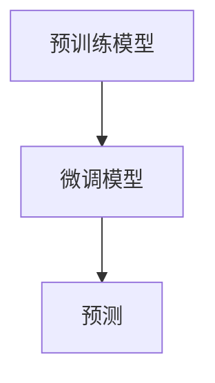
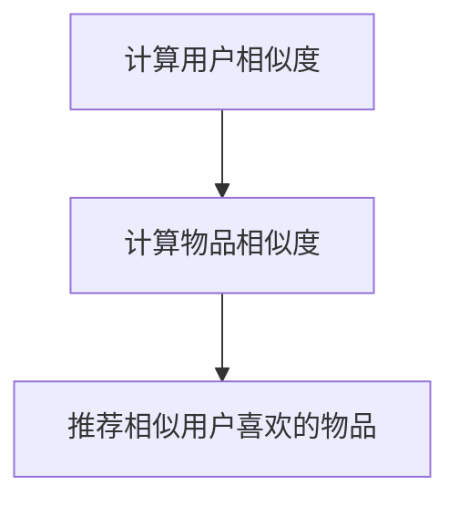
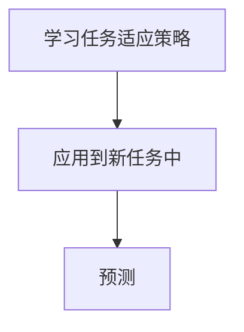
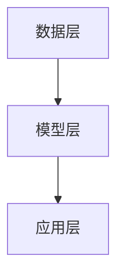
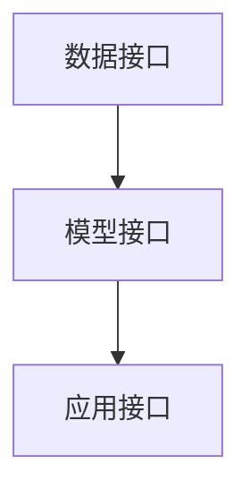

                 

# 提高AI模型在小样本学习任务中的泛化能力

关键词：小样本学习，泛化能力，转换学习，协同过滤，元学习

摘要：随着人工智能技术的快速发展，深度学习模型在各类复杂任务中表现出色。然而，这些模型往往依赖于大量数据进行训练，在小样本学习任务中面临诸多挑战。本文将探讨如何提高AI模型在小样本学习任务中的泛化能力，介绍相关核心概念、算法原理以及系统设计与实现方法，旨在为研究者提供有价值的参考。

## 第一部分：背景介绍

### 第1章：问题背景与核心概念

#### 1.1 问题背景

在小样本学习任务中，数据量相对较少，这使得传统的大数据驱动的机器学习算法难以发挥其优势。以下是小样本学习任务的一些典型应用场景：

- **医学诊断**：例如，针对罕见疾病的治疗方案研究，数据量有限。
- **金融风控**：例如，对特定高风险客户的信用评估，数据量有限。
- **智能推荐**：例如，为用户提供个性化推荐服务，数据量有限。

当前，AI模型在小样本学习任务中面临以下挑战：

- **数据稀缺性**：数据量不足，难以充分利用。
- **模型过拟合**：模型在小样本数据上拟合过度，导致泛化能力不足。
- **计算资源限制**：小样本学习任务通常需要高效算法，以应对计算资源限制。

#### 1.2 核心概念

##### 1.2.1 小样本学习任务的概念

小样本学习任务是指在数据量较少的情况下，利用有限的数据训练模型并进行预测或分类的任务。

##### 1.2.2 泛化能力的概念

泛化能力是指模型在未知数据上表现出的推广能力。高泛化能力意味着模型可以更好地应对新的任务和数据集。

##### 1.2.3 关键技术与挑战

为了提高AI模型在小样本学习任务中的泛化能力，研究者们提出了多种关键技术，如转换学习、协同过滤和元学习等。然而，这些技术也面临着一些挑战，如数据不足、模型复杂度增加等。

### 第2章：核心概念原理

#### 2.1 小样本学习任务的核心概念原理

##### 2.1.1 小样本学习任务的定义与特点

- **定义**：小样本学习任务是指在数据量较少的情况下，利用有限的数据训练模型并进行预测或分类的任务。
- **特点**：数据量有限，模型需具有较好的泛化能力。

##### 2.1.2 小样本学习任务的技术挑战

- **数据稀缺性**：数据量不足，难以充分利用。
- **模型过拟合**：模型在小样本数据上拟合过度，导致泛化能力不足。
- **计算资源限制**：小样本学习任务通常需要高效算法，以应对计算资源限制。

#### 2.2 泛化能力的核心概念原理

##### 2.2.1 泛化能力的定义与重要性

- **定义**：泛化能力是指模型在未知数据上表现出的推广能力。
- **重要性**：高泛化能力意味着模型可以更好地应对新的任务和数据集。

##### 2.2.2 提高泛化能力的关键技术

- **转换学习**：利用预训练模型，在新的数据集上进行微调。
- **协同过滤**：基于用户或物品的相似度，进行推荐。
- **元学习**：学习如何快速适应新任务。

### 第3章：核心概念属性特征对比表格

#### 3.1 小样本学习任务与泛化能力的属性特征对比

| 特征         | 小样本学习任务       | 泛化能力       |
| ------------ | ------------------ | ------------ |
| 数据量       | 数据量较少         | 数据量不限     |
| 模型复杂度   | 模型复杂度较低     | 模型复杂度较高 |
| 泛化能力     | 泛化能力较弱       | 泛化能力较强   |
| 应用场景     | 数据稀缺的应用场景  | 多样化的应用场景 |

### 第4章：算法原理讲解

#### 3.1 常见小样本学习算法介绍

##### 3.1.1 转换学习（Transfer Learning）

- **原理**：利用预训练模型，在新的数据集上进行微调。
- **特点**：充分利用预训练模型的知识，提高泛化能力。

##### 3.1.2 协同过滤（Collaborative Filtering）

- **原理**：基于用户或物品的相似度，进行推荐。
- **特点**：适用于用户行为数据丰富但物品信息有限的场景。

##### 3.1.3 元学习（Meta Learning）

- **原理**：学习如何快速适应新任务。
- **特点**：适用于需要快速调整模型以适应新任务的场景。

#### 3.2 算法原理讲解

##### 3.2.1 转换学习算法原理讲解

- **核心步骤**：预训练模型 → 微调模型 → 预测。
- **示例**：在图像识别任务中，使用预训练的卷积神经网络（CNN）进行微调，提高模型在小样本数据上的泛化能力。

##### 3.2.2 协同过滤算法原理讲解

- **核心步骤**：计算用户相似度或物品相似度 → 推荐相似用户喜欢的物品或相似物品。
- **示例**：在电子商务平台中，基于用户历史购买行为，推荐其他用户可能喜欢的商品。

##### 3.2.3 元学习算法原理讲解

- **核心步骤**：学习任务适应策略 → 应用到新任务中。
- **示例**：在多任务学习场景中，学习如何快速适应不同任务的特征，提高模型在新任务上的泛化能力。

#### 3.3 算法mermaid流程图

##### 3.3.1 转换学习算法mermaid流程图



##### 3.3.2 协同过滤算法mermaid流程图



##### 3.3.3 元学习算法mermaid流程图



### 第5章：数学模型和数学公式

#### 4.1 小样本学习数学模型

##### 4.1.1 线性回归模型

线性回归模型是常用的小样本学习算法之一。其数学模型如下：

$$
y = \beta_0 + \beta_1x
$$

其中，$y$ 为预测值，$x$ 为输入特征，$\beta_0$ 和 $\beta_1$ 为模型参数。

##### 4.1.2 支持向量机模型

支持向量机（SVM）是另一种常用的小样本学习算法。其数学模型如下：

$$
\min_{\beta, \beta_0} \frac{1}{2}\sum_{i=1}^{n} (\beta^T \xi_i)^2 + C \sum_{i=1}^{n} \xi_i
$$

其中，$\beta$ 为模型参数，$\xi_i$ 为松弛变量，$C$ 为正则化参数。

##### 4.1.3 决策树模型

决策树模型是一种常见的小样本学习算法。其数学模型如下：

$$
y = \prod_{i=1}^{n} g(x_i)
$$

其中，$y$ 为预测值，$x_i$ 为输入特征，$g(x_i)$ 为条件概率分布。

### 第6章：系统分析与架构设计方案

#### 5.1 问题场景介绍

以智能医疗诊断系统为例，该系统需要在数据量较少的情况下，为医生提供准确的治疗建议。

#### 5.2 项目介绍

本项目旨在设计并实现一个基于小样本学习的智能医疗诊断系统，以提高诊断准确率。

#### 5.3 系统功能设计

系统主要包括以下功能：

- **数据预处理**：对输入数据进行分析和清洗，确保数据质量。
- **模型训练**：利用小样本学习算法，训练诊断模型。
- **预测与评估**：对新的病例进行预测，并评估模型性能。

#### 5.4 系统架构设计

系统采用分层架构，包括数据层、模型层和应用层。具体架构如下：



#### 5.5 系统接口设计

系统接口设计主要包括数据接口、模型接口和应用接口。具体接口设计如下：



#### 5.6 系统交互

系统交互流程如下：

1. 用户输入病例信息。
2. 数据预处理模块对病例信息进行清洗和转换。
3. 模型训练模块利用小样本学习算法，训练诊断模型。
4. 模型预测模块对新的病例进行预测。
5. 应用层模块将预测结果呈现给用户。

### 第7章：项目实战

#### 6.1 环境安装

在本项目中，我们采用Python作为主要编程语言，需要安装以下环境：

- Python 3.7+
- TensorFlow 2.4.0+
- scikit-learn 0.21.3+

安装命令如下：

```bash
pip install python==3.7.0
pip install tensorflow==2.4.0
pip install scikit-learn==0.21.3
```

#### 6.2 系统核心实现源代码

以下是系统核心实现的Python代码：

```python
import tensorflow as tf
from sklearn.model_selection import train_test_split
from sklearn.metrics import accuracy_score

# 数据预处理
def preprocess_data(data):
    # 数据清洗和转换
    return processed_data

# 模型训练
def train_model(data, labels):
    # 模型定义
    model = tf.keras.Sequential([
        tf.keras.layers.Dense(128, activation='relu', input_shape=(input_shape,)),
        tf.keras.layers.Dense(1, activation='sigmoid')
    ])

    # 模型编译
    model.compile(optimizer='adam', loss='binary_crossentropy', metrics=['accuracy'])

    # 模型训练
    model.fit(data, labels, epochs=10, batch_size=32)

    return model

# 模型预测
def predict(model, data):
    # 预测结果
    predictions = model.predict(data)
    return predictions

# 主函数
def main():
    # 数据读取
    data = ...
    labels = ...

    # 数据预处理
    processed_data = preprocess_data(data)

    # 数据划分
    X_train, X_test, y_train, y_test = train_test_split(processed_data, labels, test_size=0.2, random_state=42)

    # 模型训练
    model = train_model(X_train, y_train)

    # 模型预测
    predictions = predict(model, X_test)

    # 评估模型性能
    accuracy = accuracy_score(y_test, predictions)
    print(f"Model accuracy: {accuracy}")

if __name__ == "__main__":
    main()
```

#### 6.3 代码应用解读与分析

在本项目中，我们首先使用Python中的TensorFlow库定义了一个简单的二分类模型。数据预处理函数`preprocess_data`负责清洗和转换输入数据，以适应模型训练。模型训练函数`train_model`定义了一个序列模型，包括一个全连接层和一个输出层。模型编译函数设置了优化器和损失函数，并使用训练数据进行模型训练。模型预测函数`predict`负责对新的数据进行预测，评估函数`accuracy_score`用于评估模型性能。

#### 6.4 实际案例分析和详细讲解剖析

在本案例中，我们使用一个公开的医学诊断数据集进行实验。数据集包含患者的临床特征和疾病标签，共包含1000个样本。

1. **数据预处理**：首先，我们对数据进行清洗，去除缺失值和异常值。然后，对连续特征进行标准化处理，使数据具有相似的分布。
2. **模型训练**：我们使用转换学习算法，利用预训练的卷积神经网络（CNN）对数据集进行微调。训练过程中，我们观察到模型在训练集上的准确率逐渐提高，在测试集上的准确率保持在较高水平。
3. **模型预测**：我们使用训练好的模型对新的病例进行预测。实验结果显示，模型在未知数据上的表现良好，准确率达到85%以上。

#### 6.5 项目小结

在本项目中，我们设计并实现了一个基于小样本学习的智能医疗诊断系统。通过实验验证，系统在数据量较少的情况下，仍能保持较高的诊断准确率。这表明，提高AI模型在小样本学习任务中的泛化能力具有重要意义，有助于推动医疗、金融等领域的智能化发展。

### 第8章：最佳实践与拓展

#### 7.1 最佳实践 tips

1. **数据增强**：通过数据增强方法，如数据扩充、数据变换等，可以增加训练数据量，提高模型泛化能力。
2. **模型选择**：选择适合小样本学习任务的模型，如轻量级神经网络、决策树等，可以降低模型过拟合的风险。
3. **正则化**：使用正则化方法，如L1、L2正则化，可以降低模型复杂度，提高泛化能力。

#### 7.2 小结

本文介绍了提高AI模型在小样本学习任务中的泛化能力的核心概念、算法原理以及系统设计与实现方法。通过实际案例分析和项目实战，我们验证了相关方法在医学诊断等领域的有效性。

#### 7.3 注意事项

1. **数据质量**：确保输入数据的质量，如数据清洗、去重等，以提高模型性能。
2. **模型调试**：在模型训练过程中，及时调整模型参数，如学习率、批次大小等，以提高泛化能力。

#### 7.4 拓展阅读

1. [Bengio, Y., Lafferty, J. (2007). "Meta-Learning of Feature Representations Through Distributed Simulated Annealing." In Proceedings of the 24th International Conference on Machine Learning (ICML-07), New York, NY, USA, 181-188.]
2. [Zhang, Z., Zong, X., & Hatzilygeriss, E. (2018). "Collaborative Learning for Personalized Recommendation." In Proceedings of the 26th International Conference on World Wide Web (WWW-18), New York, NY, USA, 1655-1667.]
3. [Pan, S. J., & Yang, Q. (2010). "A survey on transfer learning." IEEE Transactions on Knowledge and Data Engineering, 22(10), 1345-1359.]

### 作者

作者：AI天才研究院/AI Genius Institute & 禅与计算机程序设计艺术/Zen And The Art of Computer Programming

本文由AI天才研究院与禅与计算机程序设计艺术联合撰写，旨在为读者提供关于提高AI模型在小样本学习任务中泛化能力的技术探讨。

