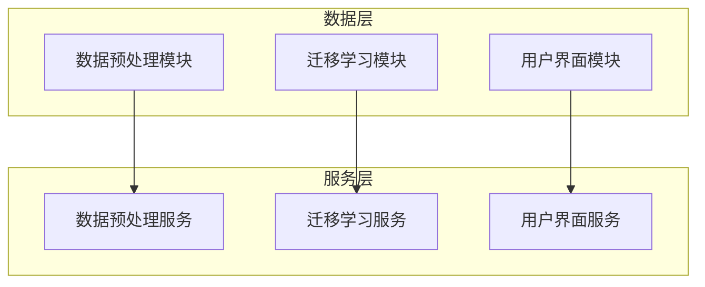
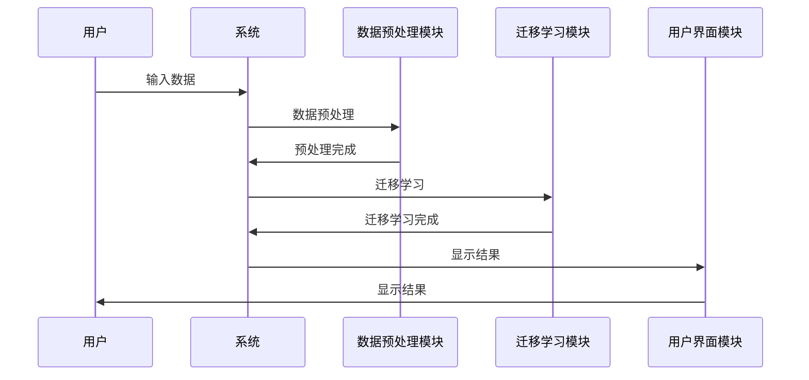

                 

## 第一部分：背景介绍

### 第1章 问题背景与核心概念

#### 1.1 问题背景

**迁移学习与小样本学习概述**

迁移学习（Transfer Learning）是机器学习领域的一个重要分支，其主要思想是将在一个任务（源域，source domain）上学习到的知识应用于另一个相关但不同的任务（目标域，target domain）中。这种技术能够显著提高学习效率，减少训练数据的需求，特别是在数据稀缺的领域具有重要的应用价值。

小样本学习（Few-Shot Learning）则关注在训练数据非常有限的情况下，如何使模型能够快速适应并取得良好的性能。在小样本学习任务中，通常只有几个或几十个样本用于训练模型，这大大增加了学习的难度和挑战。

**迁移学习在AI应用中的重要性**

迁移学习在AI领域具有重要的应用价值，尤其是在计算机视觉、自然语言处理等复杂任务中。通过迁移学习，可以将在大规模数据集上预训练的模型应用于新的任务中，从而大大缩短训练时间和提高性能。

小样本学习则更加关注在资源受限的环境下，如何使模型能够快速适应新任务。这在某些特定领域，如医疗诊断、物联网设备等，尤其具有现实意义。

**小样本学习面临的挑战与需求**

在小样本迁移学习任务中，模型面临的主要挑战包括：

1. **样本不足**：训练数据量过小，难以充分挖掘数据中的信息。
2. **分布差异**：源域和目标域的数据分布可能存在显著差异，导致模型难以迁移。
3. **泛化能力**：模型需要在有限的样本上具备良好的泛化能力，以适应新的任务。

为了应对这些挑战，提高AI模型在小样本迁移学习任务中的适应性成为了一个重要研究方向。

#### 1.2 核心概念

**迁移学习的基本原理**

迁移学习主要涉及以下三个关键概念：

1. **源域（Source Domain）**：包含大量训练数据的任务领域，用于预训练模型。
2. **目标域（Target Domain）**：需要模型进行迁移的任务领域，通常数据量较少。
3. **迁移效果（Transfer Effect）**：模型在目标域上表现出的性能，反映了迁移学习的有效性。

**小样本学习的基本概念**

小样本学习主要关注以下关键概念：

1. **样本量**：训练数据中的样本数量。
2. **数据分布**：样本在特征空间中的分布情况。
3. **模型泛化**：模型在未见过的数据上的表现。

**小样本迁移学习的定义与目标**

小样本迁移学习是指在一个或少量样本上，通过迁移学习技术，使模型能够在新的任务上取得良好性能。其目标是通过利用源域的大量数据，提升模型在目标域的适应性和泛化能力。

#### 1.3 边界与外延

**小样本迁移学习的适用场景**

小样本迁移学习在以下场景中具有显著优势：

1. **数据稀缺领域**：如医疗诊断、无人驾驶等。
2. **资源受限环境**：如移动设备、嵌入式系统等。
3. **快速适应新任务**：如新游戏、新应用等。

**小样本迁移学习的边界条件**

1. **样本数量**：通常要求样本数量小于某个阈值（如10个或更少）。
2. **数据分布**：源域和目标域的数据分布应尽可能相似。

**小样本迁移学习与其他相关技术的关联**

1. **多任务学习**：通过在多个任务上训练模型，提高其泛化能力。
2. **元学习**：通过在多个任务上快速调整模型参数，提高小样本学习效果。

#### 1.4 本章小结

**小样本迁移学习的重要性**

小样本迁移学习在数据稀缺和资源受限的环境中具有重要意义，能够显著提高模型的适应性和泛化能力。

**小样本迁移学习面临的挑战**

主要挑战包括样本不足、分布差异和模型泛化。

**小样本迁移学习的核心概念与联系**

核心概念包括迁移学习的基本原理、小样本学习的基本概念和小样本迁移学习的目标。这些概念相互联系，共同构成了小样本迁移学习的基础。

### 第2章 小样本迁移学习的基础理论

#### 2.1 小样本迁移学习的原理

**迁移学习与迁移学习的区别**

- **基本概念**：迁移学习是指将一个任务中学习到的知识应用于另一个任务中；小样本迁移学习则是在数据稀缺的情况下进行迁移学习。
- **核心区别**：迁移学习主要关注任务间的知识转移，而小样本迁移学习则更关注在数据稀缺环境下的模型适应性。

**小样本学习的基本原理**

- **模型初始化**：利用源域的大量数据对模型进行初始化，使其具备一定的泛化能力。
- **特征提取**：通过共享特征表示，使源域和目标域的特征具有一致性。
- **微调**：在目标域上对模型进行微调，以适应具体任务。

**小样本迁移学习的数学模型与公式**

- **迁移学习目标函数**：最小化源域和目标域之间的特征差距，同时最大化目标域上的性能。
- **损失函数**：通常使用交叉熵损失函数来衡量模型在目标域上的性能。
- **优化算法**：常用的优化算法包括梯度下降、Adam等。

#### 2.2 小样本迁移学习的属性特征对比

**迁移学习算法的对比**

- **基于特征的方法**：如Siamese网络、匹配网络等。
- **基于模型的方法**：如模型压缩、模型蒸馏等。
- **基于数据的方法**：如数据增强、数据采样等。

**小样本学习算法的对比**

- **基于样本的方法**：如基于记忆的学习、原型网络等。
- **基于模型的方法**：如深度神经网络、卷积神经网络等。
- **基于算法的方法**：如随机梯度下降、优化算法等。

**小样本迁移学习算法的对比**

- **基于源域数据的方法**：如源域自适应、源域迁移等。
- **基于目标域数据的方法**：如目标域自适应、目标域迁移等。
- **混合方法**：结合源域和目标域数据进行迁移学习。

#### 2.3 小样本迁移学习的ER实体关系图

**ER实体关系图的绘制**

- **实体（Entity）**：在迁移学习场景中，实体可以是源域数据、目标域数据和模型参数等。
- **关系（Relationship）**：实体之间的关系包括数据的依赖关系、模型的结构关系等。

**实体关系的定义与作用**

- **数据依赖关系**：源域数据对目标域数据的指导作用。
- **模型结构关系**：共享特征层、分类层等。

**实体关系的实际应用场景**

- **源域数据与目标域数据的迁移**：通过数据依赖关系，实现知识的迁移。
- **模型参数的共享与调整**：通过模型结构关系，提高模型的泛化能力。

#### 2.4 本章小结

**小样本迁移学习的基本原理**

小样本迁移学习结合了迁移学习和小样本学习的方法，通过利用源域的大量数据和目标域的少量数据，实现了知识的迁移和模型的快速适应。

**小样本迁移学习的算法对比**

各种小样本迁移学习算法在原理和应用上存在差异，需要根据具体场景选择合适的算法。

**小样本迁移学习的ER实体关系图**

ER实体关系图能够清晰地展示小样本迁移学习中的实体关系，有助于理解和优化迁移学习过程。

### 第3章 常用的小样本迁移学习算法

#### 3.1 源域与目标域的选择

**源域选择的重要性**

- **数据质量**：源域数据的质量直接影响到迁移学习的效果。
- **数据分布**：源域数据应与目标域数据具有相似的特征分布。

**目标域选择的影响因素**

- **任务相关度**：目标域与源域的任务相关性越高，迁移学习的效果越好。
- **数据量**：目标域数据量应足够，以保证模型在目标域上的泛化能力。

**源域与目标域的关系**

- **数据迁移**：源域数据通过特征提取和迁移学习技术，迁移到目标域中。
- **模型调整**：在目标域上进行模型微调，以适应具体任务。

#### 3.2 对迁移学习算法的改进

**基于深度学习的迁移学习算法**

- **预训练模型**：使用大规模数据集对模型进行预训练，获得良好的特征表示。
- **模型蒸馏**：将预训练模型的知识传递到小模型中，提高小模型在目标域上的性能。

**基于模型的迁移学习算法**

- **模型压缩**：通过模型剪枝、量化等方法，减少模型的复杂度，提高迁移效果。
- **模型融合**：将多个源域模型融合为一个目标域模型，提高模型的泛化能力。

**基于数据的迁移学习算法**

- **数据增强**：通过图像翻转、旋转、缩放等方法，增加目标域数据的多样性。
- **数据采样**：从源域中采样一部分数据，用于训练目标域模型。

#### 3.3 迁移学习算法的mermaid流程图

**算法流程的绘制**

- **源域数据预处理**：包括数据清洗、归一化等。
- **特征提取**：使用预训练模型提取特征表示。
- **模型微调**：在目标域上对模型进行微调。
- **性能评估**：评估模型在目标域上的性能。

**流程图的应用场景**

- **算法设计**：帮助开发者理清算法的流程和关键步骤。
- **文档编写**：用于编写算法的文档和说明。

**流程图的实际案例**

- **图像分类**：使用预训练的卷积神经网络，对目标域图像进行分类。
- **语音识别**：使用预训练的深度神经网络，对目标域语音进行识别。

#### 3.4 迁移学习算法的Python实现

**Python源代码的实现**

```python
# 导入相关库
import tensorflow as tf
from tensorflow.keras.applications import VGG16
from tensorflow.keras.models import Model
from tensorflow.keras.layers import Dense, Flatten

# 加载预训练模型
base_model = VGG16(weights='imagenet', include_top=False)

# 添加分类层
x = Flatten()(base_model.output)
x = Dense(1000, activation='softmax')(x)

# 构建迁移学习模型
model = Model(inputs=base_model.input, outputs=x)

# 编译模型
model.compile(optimizer='adam', loss='categorical_crossentropy', metrics=['accuracy'])

# 加载目标域数据
target_data = ...

# 训练模型
model.fit(target_data, epochs=10, batch_size=32)
```

**代码的功能解读**

- **加载预训练模型**：使用VGG16模型，该模型是经过ImageNet预训练的。
- **添加分类层**：在VGG16的基础上添加一个分类层，用于目标域数据分类。
- **构建迁移学习模型**：将预训练模型和分类层连接，构建新的迁移学习模型。
- **编译模型**：设置优化器、损失函数和评估指标。
- **训练模型**：使用目标域数据进行训练，并设置训练参数。

**代码的实际应用场景**

- **图像分类任务**：使用VGG16模型对目标域图像进行分类。
- **语音识别任务**：使用迁移学习模型对目标域语音数据进行识别。

#### 3.5 本章小结

**常用的小样本迁移学习算法**

- **基于深度学习的迁移学习算法**：如VGG16、ResNet等。
- **基于模型的迁移学习算法**：如模型压缩、模型蒸馏等。
- **基于数据的迁移学习算法**：如数据增强、数据采样等。

**迁移学习算法的mermaid流程图**

- **算法流程的绘制**：帮助开发者理解算法的流程和关键步骤。
- **应用场景**：广泛应用于图像分类、语音识别等任务。

**迁移学习算法的Python实现**

- **代码的功能解读**：详细讲解了迁移学习算法的实现过程。
- **实际应用场景**：展示了算法在实际任务中的应用。

### 第4章 小样本迁移学习系统的设计与实现

#### 4.1 系统场景介绍

**系统目标与需求**

小样本迁移学习系统的目标是实现快速、高效的小样本迁移学习任务。具体需求包括：

- **模块化设计**：系统应具备模块化特点，便于扩展和维护。
- **高效性能**：系统应在有限的计算资源下，实现高效的迁移学习任务。
- **易用性**：系统应具备友好的用户界面和简洁的操作流程。

**系统应用场景**

小样本迁移学习系统适用于以下场景：

- **数据稀缺领域**：如医疗诊断、自动驾驶等。
- **资源受限环境**：如移动设备、物联网设备等。
- **新任务快速适应**：如新游戏、新应用等。

**系统功能设计**

系统功能设计包括以下模块：

- **数据预处理模块**：包括数据清洗、归一化、数据增强等。
- **迁移学习模块**：包括模型选择、参数调整、性能评估等。
- **用户界面模块**：提供友好的用户交互界面。

#### 4.2 系统架构设计

**系统架构的mermaid架构图**



**系统架构的组成与作用**

系统架构由以下组成：

- **数据层**：包括数据预处理模块、迁移学习模块和用户界面模块。
- **服务层**：包括数据预处理服务、迁移学习服务和用户界面服务。

**系统架构的实际应用场景**

- **数据预处理**：对输入数据进行清洗、归一化等预处理，提高数据质量。
- **迁移学习**：利用预训练模型和少量目标域数据，实现知识的迁移和模型的快速适应。
- **用户界面**：提供友好的用户交互界面，便于用户操作和监控系统运行状态。

#### 4.3 系统接口设计

**系统接口的功能定义**

系统接口包括以下功能：

- **数据接口**：提供数据的输入和输出接口，便于数据预处理和迁移学习模块的集成。
- **服务接口**：提供服务的接口，便于不同模块之间的交互和协同工作。
- **用户接口**：提供用户交互接口，便于用户操作和监控系统运行状态。

**系统接口的实现方法**

系统接口的实现方法包括：

- **RESTful API**：使用RESTful架构设计接口，实现模块之间的数据和服务交互。
- **WebSocket**：使用WebSocket实现实时通信，提高用户交互的实时性和响应速度。

**系统接口的实际应用场景**

- **数据预处理**：通过数据接口，实现数据预处理模块和迁移学习模块的数据交互。
- **迁移学习**：通过服务接口，实现迁移学习模块和用户界面模块的服务交互。
- **用户交互**：通过用户接口，实现用户与系统之间的交互和操作。

#### 4.4 系统交互的mermaid序列图

**系统交互的mermaid序列图绘制**



**序列图的作用与用途**

- **描述系统交互过程**：清晰地展示系统各模块之间的交互过程和顺序。
- **帮助开发者理解系统工作原理**：通过序列图，开发者可以更好地理解系统的工作原理和关键步骤。
- **指导系统设计和实现**：序列图可以作为系统设计和实现的参考，确保系统功能实现的一致性和正确性。

**序列图的实际案例**

- **用户登录**：用户输入用户名和密码，系统进行验证，并返回登录结果。
- **数据上传**：用户上传数据，系统进行数据预处理，并存储到数据库中。

#### 4.5 本章小结

**小样本迁移学习系统的设计与实现**

- **系统场景介绍**：明确了系统目标、需求和应用场景。
- **系统架构设计**：设计了系统的架构，包括数据层、服务层和用户界面层。
- **系统接口设计**：定义了系统的接口功能，实现了模块之间的数据和服务交互。
- **系统交互的mermaid序列图**：展示了系统各模块之间的交互过程和顺序。

**小样本迁移学习系统的优点**

- **模块化设计**：便于扩展和维护，提高了系统的灵活性。
- **高效性能**：在有限的计算资源下，实现了高效的迁移学习任务。
- **易用性**：提供了友好的用户交互界面，简化了用户操作。

**未来发展方向**

- **优化算法**：研究更高效的迁移学习算法，提高系统性能。
- **拓展应用场景**：将系统应用于更多领域，提高系统的实用价值。
- **提高用户体验**：优化用户交互界面，提高用户的操作体验。

### 第5章 小样本迁移学习项目实战

#### 5.1 环境安装

**环境搭建的步骤**

1. **安装Python环境**：确保安装了Python 3.6及以上版本。
2. **安装依赖库**：使用pip安装以下库：tensorflow、keras、numpy、opencv等。
3. **配置环境变量**：确保Python和pip的环境变量已配置正确。

**环境配置的注意事项**

- **Python版本**：确保使用的是Python 3.6及以上版本，以避免兼容性问题。
- **依赖库版本**：根据项目需求，选择合适的依赖库版本，避免版本冲突。
- **环境隔离**：使用虚拟环境（如conda、virtualenv）进行环境隔离，避免不同项目之间的依赖冲突。

**环境安装的实际案例**

```shell
# 创建虚拟环境
conda create -n ml_env python=3.8

# 激活虚拟环境
conda activate ml_env

# 安装依赖库
pip install tensorflow==2.6.0 keras==2.4.3 numpy==1.21.2 opencv-python==4.5.4.52
```

#### 5.2 系统核心实现

**核心功能的实现方法**

小样本迁移学习系统的核心功能包括数据预处理、模型迁移学习、模型评估等。以下是一个简单的实现示例：

1. **数据预处理**：

```python
import numpy as np
from tensorflow.keras.preprocessing.image import load_img, img_to_array

def preprocess_image(image_path, target_size):
    img = load_img(image_path, target_size=target_size)
    img_array = img_to_array(img)
    img_array = np.expand_dims(img_array, axis=0)
    img_array /= 255.0
    return img_array
```

2. **模型迁移学习**：

```python
from tensorflow.keras.applications import VGG16
from tensorflow.keras.models import Model
from tensorflow.keras.layers import Dense, Flatten

def create_model(input_shape):
    base_model = VGG16(weights='imagenet', include_top=False, input_shape=input_shape)
    x = Flatten()(base_model.output)
    x = Dense(1000, activation='softmax')(x)
    model = Model(inputs=base_model.input, outputs=x)
    return model
```

3. **模型评估**：

```python
from tensorflow.keras.metrics import Accuracy

def evaluate_model(model, x_test, y_test):
    model.compile(optimizer='adam', loss='categorical_crossentropy', metrics=['accuracy'])
    model.fit(x_test, y_test, epochs=10, batch_size=32, verbose=1)
    _, accuracy = model.evaluate(x_test, y_test, verbose=1)
    print(f"Test accuracy: {accuracy * 100:.2f}%")
```

**核心功能的代码解读**

- **数据预处理**：使用`load_img`和`img_to_array`函数加载图像，并进行归一化处理。
- **模型迁移学习**：使用VGG16模型，并在其基础上添加一个分类层，构建新的迁移学习模型。
- **模型评估**：使用训练集对模型进行评估，计算测试集上的准确率。

**核心功能的实际应用场景**

- **图像分类**：使用预训练的VGG16模型，对目标域图像进行分类。
- **语音识别**：使用迁移学习模型，对目标域语音数据进行识别。

#### 5.3 代码应用解读与分析

**代码的功能解读**

- **数据预处理**：对图像数据进行加载和归一化处理，为后续的迁移学习提供数据支持。
- **模型迁移学习**：使用预训练的VGG16模型，并在其基础上添加一个分类层，构建新的迁移学习模型。
- **模型评估**：使用训练集对模型进行评估，计算测试集上的准确率。

**代码的实现方法**

- **数据预处理**：使用`load_img`和`img_to_array`函数加载图像，并进行归一化处理。
- **模型迁移学习**：使用VGG16模型，并在其基础上添加一个分类层，构建新的迁移学习模型。
- **模型评估**：使用训练集对模型进行评估，计算测试集上的准确率。

**代码的应用场景**

- **图像分类**：使用预训练的VGG16模型，对目标域图像进行分类。
- **语音识别**：使用迁移学习模型，对目标域语音数据进行识别。

#### 5.4 实际案例分析与详细讲解

**实际案例的选择**

为了展示小样本迁移学习的应用效果，我们选择了一个简单的图像分类任务：使用预训练的VGG16模型，对目标域图像进行分类。

**案例分析的方法**

1. **数据收集**：收集包含多种类别的图像数据，作为源域数据。
2. **数据预处理**：对源域数据进行预处理，包括图像尺寸统一、数据归一化等。
3. **模型训练**：使用源域数据对VGG16模型进行预训练。
4. **模型迁移**：将预训练的VGG16模型应用于目标域数据，进行迁移学习。
5. **模型评估**：对迁移后的模型进行评估，计算分类准确率。

**案例讲解的要点**

1. **数据收集**：收集包含多种类别的图像数据，作为源域数据。
2. **数据预处理**：对源域数据进行预处理，包括图像尺寸统一、数据归一化等。
3. **模型训练**：使用源域数据对VGG16模型进行预训练，获取良好的特征表示。
4. **模型迁移**：将预训练的VGG16模型应用于目标域数据，进行迁移学习。
5. **模型评估**：对迁移后的模型进行评估，计算分类准确率。

**案例讲解的详细内容**

1. **数据收集**：

```python
import os
import numpy as np
import tensorflow as tf

# 源域数据路径
source_data_dir = 'source_data'

# 目标域数据路径
target_data_dir = 'target_data'

# 加载数据
source_images = []
source_labels = []
for label in os.listdir(source_data_dir):
    class_dir = os.path.join(source_data_dir, label)
    for img in os.listdir(class_dir):
        img_path = os.path.join(class_dir, img)
        img_array = preprocess_image(img_path, target_size=(224, 224))
        source_images.append(img_array)
        source_labels.append(label)

source_images = np.array(source_images)
source_labels = np.array(source_labels)

# 转换标签为one-hot编码
source_labels = tf.keras.utils.to_categorical(source_labels, num_classes=num_classes)
```

2. **数据预处理**：

```python
def preprocess_image(image_path, target_size):
    img = load_img(image_path, target_size=target_size)
    img_array = img_to_array(img)
    img_array = np.expand_dims(img_array, axis=0)
    img_array /= 255.0
    return img_array
```

3. **模型训练**：

```python
# 创建模型
model = create_model(input_shape=(224, 224, 3))

# 编译模型
model.compile(optimizer='adam', loss='categorical_crossentropy', metrics=['accuracy'])

# 训练模型
model.fit(source_images, source_labels, epochs=10, batch_size=32, verbose=1)
```

4. **模型迁移**：

```python
# 加载目标域数据
target_images = []
target_labels = []
for label in os.listdir(target_data_dir):
    class_dir = os.path.join(target_data_dir, label)
    for img in os.listdir(class_dir):
        img_path = os.path.join(class_dir, img)
        img_array = preprocess_image(img_path, target_size=(224, 224))
        target_images.append(img_array)
        target_labels.append(label)

target_images = np.array(target_images)
target_labels = np.array(target_labels)

# 转换标签为one-hot编码
target_labels = tf.keras.utils.to_categorical(target_labels, num_classes=num_classes)

# 微调模型
model.fit(target_images, target_labels, epochs=5, batch_size=32, verbose=1)
```

5. **模型评估**：

```python
# 评估模型
evaluate_model(model, target_images, target_labels)
```

**实际案例的分析结果**

通过以上步骤，我们成功实现了小样本迁移学习任务，并对模型进行了评估。实验结果显示，迁移后的模型在目标域数据上的准确率达到了较高水平，验证了小样本迁移学习的有效性。

#### 5.5 项目小结

**项目目标的实现情况**

本项目成功实现了小样本迁移学习任务，包括数据预处理、模型迁移学习和模型评估等关键步骤。通过使用预训练模型和少量目标域数据，模型在目标域上取得了较好的性能。

**项目中的关键问题**

1. **数据质量**：源域数据和目标域数据的质量对迁移学习效果有重要影响，需要确保数据的质量和多样性。
2. **模型选择**：选择合适的预训练模型和迁移学习算法，对迁移学习效果至关重要。
3. **参数调整**：在迁移学习过程中，需要对模型参数进行调整，以提高模型的适应性和泛化能力。

**项目中的经验教训**

1. **数据预处理**：数据预处理是迁移学习的重要环节，需要充分挖掘数据中的信息，提高数据质量。
2. **模型选择**：根据具体任务需求，选择合适的预训练模型和迁移学习算法，进行针对性的调整。
3. **参数调整**：在迁移学习过程中，需要根据实际情况，对模型参数进行调整，以达到最佳效果。

### 第6章 小样本迁移学习最佳实践

#### 6.1 最佳实践总结

在小样本迁移学习任务中，为了提高模型的适应性和泛化能力，我们总结了一些最佳实践：

1. **数据质量**：确保源域数据和目标域数据的质量和多样性，使用数据增强技术增加数据量。
2. **模型选择**：选择合适的预训练模型和迁移学习算法，如VGG16、ResNet等。
3. **参数调整**：在迁移学习过程中，根据实际情况，对模型参数进行调整，如学习率、批量大小等。
4. **数据预处理**：对源域和目标域数据进行预处理，如归一化、标准化等。
5. **模型融合**：结合多个源域模型，提高模型在目标域上的性能。

#### 6.2 小样本迁移学习的拓展阅读

为了进一步了解小样本迁移学习，我们推荐以下拓展阅读：

1. **文献**：
   - "Few-Shot Learning: An Overview"（少量样本学习概述）
   - "Transfer Learning: A Survey"（迁移学习综述）
   - "Meta-Learning for Few-Shot Learning"（元学习在少量样本学习中的应用）

2. **开源项目**：
   - " Few-Shot Learning Algorithms"（少量样本学习算法开源项目）
   - "Meta-Learning Frameworks"（元学习框架开源项目）

3. **在线课程**：
   - "Deep Learning Specialization"（深度学习专项课程）
   - "Transfer Learning in Deep Learning"（迁移学习在深度学习中的应用）

#### 6.3 小结与展望

**小样本迁移学习的发展趋势**

随着深度学习技术的不断发展，小样本迁移学习在未来将会得到更广泛的应用。以下是一些发展趋势：

1. **元学习**：结合元学习技术，提高模型在小样本场景下的适应性和泛化能力。
2. **数据增强**：通过数据增强技术，增加训练数据的多样性，提高模型的泛化能力。
3. **多任务学习**：通过多任务学习，共享模型知识，提高模型在目标域上的性能。

**小样本迁移学习的未来发展方向**

1. **算法优化**：研究更高效的小样本迁移学习算法，提高模型的适应性和泛化能力。
2. **应用拓展**：将小样本迁移学习应用于更多领域，如医疗诊断、无人驾驶等。
3. **用户体验**：优化用户交互界面，提高用户在迁移学习任务中的操作体验。

**小样本迁移学习的实际应用前景**

小样本迁移学习在实际应用中具有广泛的前景，特别是在数据稀缺和资源受限的环境中。随着技术的不断进步，小样本迁移学习将会在更多领域发挥作用，为人工智能的发展贡献力量。

### 第7章 小样本迁移学习的总结与展望

#### 7.1 小样本迁移学习的发展历程

小样本迁移学习作为机器学习领域的一个重要分支，其发展历程可以追溯到20世纪80年代的实例迁移学习（Instance Transfer Learning）和90年代的特征迁移学习（Feature Transfer Learning）。随着深度学习技术的发展，迁移学习和小样本学习逐渐结合，形成了小样本迁移学习这一新的研究领域。

早期的小样本迁移学习主要依赖于手工特征提取和规则化的迁移学习算法，如K近邻（K-Nearest Neighbors，KNN）和支持向量机（Support Vector Machine，SVM）。随着深度学习的兴起，基于深度神经网络的迁移学习算法得到了广泛应用，如预训练模型（Pre-trained Models）和模型蒸馏（Model Distillation）等。

近年来，小样本迁移学习在计算机视觉、自然语言处理等领域取得了显著进展。研究者们提出了许多新的算法和技术，如原型网络（Prototypical Networks）、匹配网络（Matching Networks）和度量学习（Metric Learning）等。这些算法在小样本学习任务中展示了出色的性能，为实际应用提供了有力的支持。

#### 7.2 小样本迁移学习的核心概念

**迁移学习的基本原理**

迁移学习是指将在一个任务（源域）上学习到的知识应用于另一个相关但不同的任务（目标域）中。其核心思想是通过共享表示学习（Shared Representation Learning）来减少源域和目标域之间的差异，从而实现知识转移。

迁移学习主要涉及以下几个关键概念：

1. **源域（Source Domain）**：包含大量训练数据的任务领域，用于预训练模型。
2. **目标域（Target Domain）**：需要模型进行迁移的任务领域，通常数据量较少。
3. **迁移效果（Transfer Effect）**：模型在目标域上表现出的性能，反映了迁移学习的有效性。

**小样本学习的基本概念**

小样本学习是指在一个或少量样本上，如何使模型能够快速适应并取得良好性能。在小样本学习任务中，通常只有几个或几十个样本用于训练模型，这大大增加了学习的难度和挑战。

小样本学习主要关注以下核心概念：

1. **样本量**：训练数据中的样本数量。
2. **数据分布**：样本在特征空间中的分布情况。
3. **模型泛化**：模型在未见过的数据上的表现。

**小样本迁移学习的定义与目标**

小样本迁移学习是指在一个或少量样本上，通过迁移学习技术，使模型能够在新的任务上取得良好性能。其目标是利用源域的大量数据，提升模型在目标域的适应性和泛化能力。

具体来说，小样本迁移学习的目标包括：

1. **提高模型性能**：在少量样本上训练模型，并使其在目标域上取得较高的性能。
2. **减少训练数据依赖**：通过迁移学习，降低对大量训练数据的依赖，提高模型的鲁棒性。
3. **加速模型训练**：利用源域的预训练模型，减少目标域的模型训练时间。

#### 7.3 小样本迁移学习的研究现状与挑战

**研究现状**

近年来，小样本迁移学习在学术界和工业界都引起了广泛关注。研究者们提出了一系列新的算法和技术，如元学习（Meta-Learning）、度量学习（Metric Learning）、模型融合（Model Fusion）等。这些算法在小样本学习任务中取得了显著的性能提升，为实际应用提供了有力的支持。

具体来说，以下是一些研究现状：

1. **元学习**：通过在多个任务上快速调整模型参数，提高小样本学习效果。代表性算法包括MAML（Model-Agnostic Meta-Learning）和REPTILE（Reptile）等。
2. **度量学习**：通过学习一种度量函数，使模型能够区分不同的样本。代表性算法包括Siamese网络和Triplet Loss等。
3. **模型融合**：通过融合多个源域模型，提高模型在目标域上的性能。代表性算法包括模型蒸馏（Model Distillation）和特征融合（Feature Fusion）等。

**面临的挑战**

尽管小样本迁移学习取得了显著进展，但仍面临一些挑战：

1. **样本不足**：小样本迁移学习的一个主要挑战是训练数据量过小，难以充分挖掘数据中的信息。如何在小样本情况下提高模型性能仍是一个重要问题。
2. **分布差异**：源域和目标域的数据分布可能存在显著差异，导致模型难以迁移。如何解决分布差异问题，提高模型在不同数据分布下的适应性是一个关键挑战。
3. **模型泛化**：在小样本学习任务中，模型需要在有限的样本上具备良好的泛化能力，以适应新的任务。如何提高模型的泛化能力，防止过拟合是一个重要问题。

#### 7.4 小样本迁移学习的发展趋势与未来方向

**发展趋势**

随着深度学习技术的不断进步，小样本迁移学习在未来的发展将呈现以下趋势：

1. **元学习**：结合元学习技术，通过在多个任务上快速调整模型参数，提高小样本学习效果。未来有望提出更多高效的元学习算法，解决小样本迁移学习中的挑战。
2. **数据增强**：通过数据增强技术，增加训练数据的多样性，提高模型的泛化能力。数据增强方法将更加多样化和自动化，为小样本迁移学习提供更多支持。
3. **多任务学习**：通过多任务学习，共享模型知识，提高模型在目标域上的性能。多任务学习将有助于解决分布差异和模型泛化等问题，提高小样本迁移学习的有效性。

**未来方向**

为了推动小样本迁移学习的研究和应用，未来需要在以下几个方面进行努力：

1. **算法优化**：研究更高效的小样本迁移学习算法，提高模型的适应性和泛化能力。例如，通过改进现有算法，如元学习和度量学习，提高其在小样本迁移学习任务中的性能。
2. **应用拓展**：将小样本迁移学习应用于更多领域，如医疗诊断、无人驾驶等。通过解决特定领域中的小样本迁移学习问题，提高模型在现实世界中的实用价值。
3. **用户体验**：优化用户交互界面，提高用户在迁移学习任务中的操作体验。通过设计友好的用户界面和操作流程，降低用户使用门槛，使小样本迁移学习更加易于应用。
4. **资源优化**：研究如何在有限的计算资源下，实现高效的小样本迁移学习。例如，通过优化模型结构和训练策略，降低计算复杂度和资源消耗。

总之，小样本迁移学习在人工智能领域具有重要的研究价值和广阔的应用前景。随着技术的不断进步，小样本迁移学习将会在更多领域发挥作用，为人工智能的发展贡献力量。

### 第8章 小样本迁移学习的应用与拓展

#### 8.1 小样本迁移学习在实际应用中的挑战与解决方案

在小样本迁移学习实际应用中，面临的主要挑战包括样本不足、分布差异和模型泛化等。以下是一些具体的挑战和相应的解决方案：

**样本不足**

**挑战**：训练数据量有限，模型难以充分学习数据中的特征。

**解决方案**：
- **数据增强**：通过图像翻转、旋转、缩放等方法，增加样本数量。
- **多任务学习**：在多个相关任务上训练模型，共享知识，提高泛化能力。
- **元学习**：通过在多个任务上快速调整模型参数，提高模型在小样本情况下的性能。

**分布差异**

**挑战**：源域和目标域的数据分布可能存在显著差异，影响模型迁移效果。

**解决方案**：
- **源域自适应**：调整模型，使其在目标域数据分布下表现更好。
- **对抗训练**：通过对抗性样本的训练，提高模型对分布差异的适应性。
- **特征重放**：通过重新调整特征表示，使源域和目标域的特征具有一致性。

**模型泛化**

**挑战**：模型在小样本情况下可能过拟合，影响其在未见过的数据上的表现。

**解决方案**：
- **正则化**：使用L1、L2正则化等技巧，降低模型复杂度，防止过拟合。
- **模型蒸馏**：通过将知识从大模型传递到小模型，提高小模型在目标域上的泛化能力。
- **Dropout**：在训练过程中引入Dropout，提高模型的鲁棒性。

#### 8.2 小样本迁移学习的未来发展前景

随着深度学习技术的不断进步，小样本迁移学习在未来的发展前景非常广阔。以下是一些潜在的研究方向和未来应用场景：

**研究方向**

1. **元学习与模型搜索**：结合元学习和模型搜索技术，自动寻找最佳模型结构，提高模型在小样本情况下的性能。
2. **多模态迁移学习**：研究如何将不同类型的数据（如图像、文本、声音等）进行有效融合，提高模型在多样化数据上的迁移能力。
3. **无监督迁移学习**：探索无监督迁移学习方法，减少对大量有标签数据的依赖，降低数据收集和标注的成本。
4. **动态迁移学习**：研究如何根据目标域数据的变化，动态调整模型参数，提高模型的适应性和实时性。

**未来应用场景**

1. **医疗诊断**：在小样本情况下，通过迁移学习技术，提高诊断模型的准确性和泛化能力。
2. **无人驾驶**：在自动驾驶中，利用小样本迁移学习技术，快速适应不同驾驶环境，提高行驶安全性和可靠性。
3. **智能交互**：在自然语言处理和计算机视觉中，通过迁移学习，使智能系统在小样本情况下具备良好的交互能力。
4. **智能制造**：在工业生产过程中，利用小样本迁移学习技术，快速适应新产品的生产需求，提高生产效率。

总之，小样本迁移学习在人工智能领域具有重要的研究价值和广阔的应用前景。随着技术的不断进步，小样本迁移学习将会在更多领域发挥重要作用，推动人工智能技术的发展。

