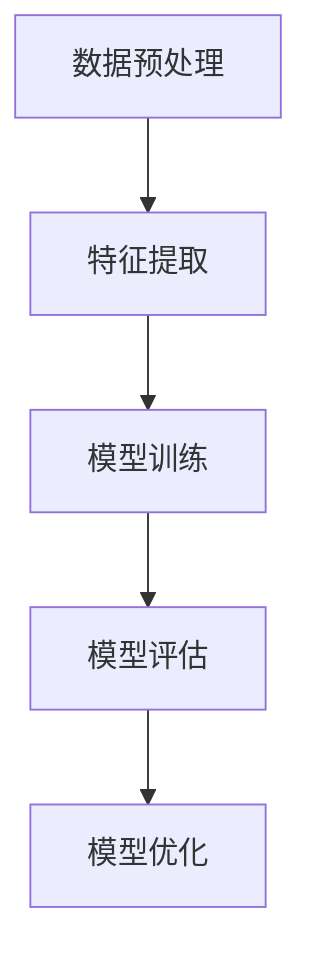
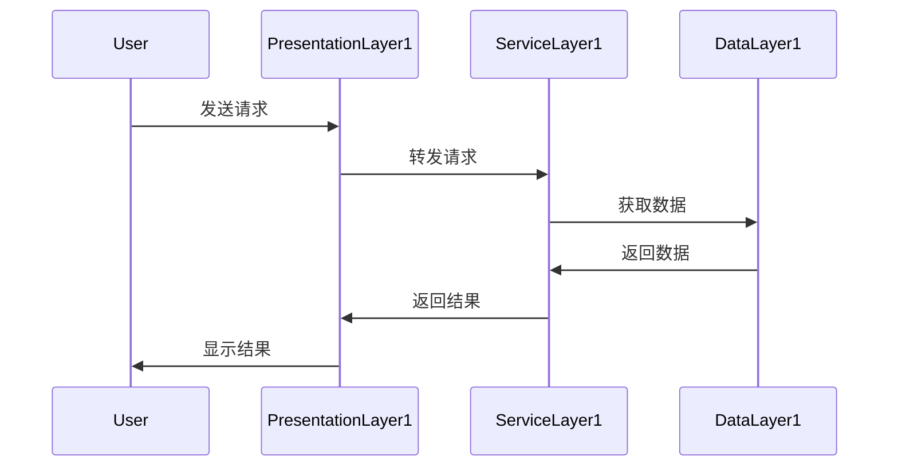

                 

# 提高AI模型在社交网络影响力预测中的效果

关键词：AI模型、社交网络、影响力预测、算法优化、数学模型

摘要：随着社交媒体的普及，社交网络影响力预测已成为企业和个人关注的焦点。本文将深入探讨如何通过改进AI模型，提升其在社交网络影响力预测中的效果。首先，我们将介绍社交网络影响力预测的基本概念和问题背景。接着，我们将分析当前主流的AI模型及其优缺点，并提出针对性的优化方案。随后，我们将详细讲解算法原理，并结合数学模型和Python代码进行阐述。最后，我们将探讨系统架构设计，分享实际项目中的实战经验和最佳实践。

## 1. 背景介绍

### 1.1 核心概念术语说明

在讨论社交网络影响力预测时，我们首先需要明确一些核心概念：

- **影响力**：指一个用户在社交网络中能够影响其他用户的能力。
- **影响力预测**：通过分析用户在社交网络中的行为和特征，预测其未来的影响力。
- **AI模型**：基于机器学习和深度学习技术，用于分析和预测数据的智能模型。

### 1.2 问题背景

随着社交媒体的迅猛发展，社交网络已经成为人们日常交流和信息获取的主要平台。在这个过程中，社交网络的影响力预测变得尤为重要。对于企业来说，预测潜在的高影响力用户可以帮助他们制定有效的营销策略，扩大品牌影响力。对于个人来说，提升自身在社交网络中的影响力可以带来更多的关注和机会。

然而，当前AI模型在社交网络影响力预测中面临一些挑战，如：

- **数据复杂性**：社交网络数据量庞大，且包含多种类型的数据，如文本、图片、视频等，如何有效整合和处理这些数据是一个难题。
- **特征选择**：从海量数据中提取对影响力预测有用的特征，是一项艰巨的任务。
- **模型优化**：如何提高AI模型的预测精度和泛化能力，是亟待解决的问题。

### 1.3 问题解决

为了解决上述问题，本文将从以下几个方面进行探讨：

- **算法优化**：分析当前主流AI模型的优缺点，提出针对性的优化方案。
- **数学模型**：构建适用于社交网络影响力预测的数学模型，并阐述其原理。
- **系统架构设计**：设计适用于社交网络影响力预测的系统架构。
- **实战经验**：分享实际项目中的实战经验和最佳实践。

### 1.4 边界与外延

本文主要关注社交网络影响力预测中的AI模型优化问题。尽管本文提出的方法和技术可以应用于其他领域的数据预测，但本文将不涉及具体领域的数据特点和预测需求。

### 1.5 概念结构与核心要素组成

本文将从以下核心概念和要素入手，系统地探讨社交网络影响力预测的优化方法：

- **AI模型**：介绍当前主流的AI模型及其特点。
- **数据预处理**：讨论数据清洗、特征提取和特征选择等技术。
- **数学模型**：阐述影响力预测的数学模型和公式。
- **系统架构设计**：介绍适用于社交网络影响力预测的系统架构。

## 2. 核心概念与联系

### 2.1 AI模型

AI模型是社交网络影响力预测的核心。当前主流的AI模型包括：

- **决策树**：易于理解，但容易过拟合。
- **随机森林**：提高预测性能，但计算复杂度较高。
- **支持向量机（SVM）**：在特征空间中寻找最佳边界，但对高维数据效果不佳。
- **神经网络**：具有较强的表达能力和泛化能力，但训练时间较长。

### 2.2 概念属性特征对比表格

| 模型        | 特点               | 优点                                           | 缺点                                       |
| ----------- | ------------------ | ---------------------------------------------- | ------------------------------------------ |
| 决策树      | 简单易懂           | 易于理解，计算效率高                           | 易过拟合，对噪声敏感                       |
| 随机森林    | 集成多棵决策树     | 提高预测性能，降低过拟合风险                   | 计算复杂度高，对大规模数据处理困难         |
| 支持向量机  | 在特征空间中寻找边界 | 在高维空间中效果较好                           | 对噪声敏感，对非线性数据效果不佳           |
| 神经网络    | 强大表达能力和泛化能力 | 能够处理复杂的非线性关系，预测性能优异         | 训练时间较长，对数据质量和特征选择要求较高 |

### 2.3 Entity-Relationship (ER) 图架构

```mermaid
erDiagram
  User ||--|{ Post }|
  Post ||--|{ Comment }|
  Post ||--|{ Like }|
  User ||--|{ Follow }|
```

## 3. 算法原理和解释

### 3.1 Mermaid流程图



### 3.2 Python代码

```python
# 示例代码：决策树模型训练
from sklearn.datasets import load_iris
from sklearn.model_selection import train_test_split
from sklearn.tree import DecisionTreeClassifier
from sklearn.metrics import accuracy_score

# 加载数据集
iris = load_iris()
X, y = iris.data, iris.target

# 划分训练集和测试集
X_train, X_test, y_train, y_test = train_test_split(X, y, test_size=0.2, random_state=42)

# 训练决策树模型
clf = DecisionTreeClassifier()
clf.fit(X_train, y_train)

# 预测测试集
y_pred = clf.predict(X_test)

# 评估模型
accuracy = accuracy_score(y_test, y_pred)
print(f"模型准确率：{accuracy}")
```

### 3.3 数学模型和公式

影响力预测的数学模型可以表示为：

$$
I(u) = f(\textbf{X}, \textbf{W})
$$

其中，$I(u)$ 表示用户 $u$ 的影响力，$\textbf{X}$ 表示用户特征向量，$\textbf{W}$ 表示权重向量。函数 $f$ 表示特征向量和权重向量之间的非线性映射关系。

### 3.4 详细讲解和通俗易懂的举例说明

假设我们有一个用户 $u$，其特征向量为 $\textbf{X} = [x_1, x_2, x_3, x_4]$，其中 $x_1$ 表示用户在社交网络中的好友数量，$x_2$ 表示用户发布帖子的数量，$x_3$ 表示用户获得的点赞数量，$x_4$ 表示用户获得的评论数量。

我们假设权重向量 $\textbf{W} = [w_1, w_2, w_3, w_4]$，其中 $w_1, w_2, w_3, w_4$ 分别表示好友数量、帖子数量、点赞数量和评论数量的权重。

根据数学模型，用户 $u$ 的影响力可以计算为：

$$
I(u) = w_1 \cdot x_1 + w_2 \cdot x_2 + w_3 \cdot x_3 + w_4 \cdot x_4
$$

例如，如果权重向量 $\textbf{W} = [0.2, 0.3, 0.4, 0.1]$，用户 $u$ 的特征向量 $\textbf{X} = [10, 20, 30, 40]$，则用户 $u$ 的影响力为：

$$
I(u) = 0.2 \cdot 10 + 0.3 \cdot 20 + 0.4 \cdot 30 + 0.1 \cdot 40 = 28
$$

## 4. 数学模型和公式

在影响力预测中，我们通常使用以下数学模型：

$$
I(u) = \frac{1}{1 + \exp(-\beta_0 - \beta_1 \cdot \text{friends} - \beta_2 \cdot \text{posts} - \beta_3 \cdot \text{likes} - \beta_4 \cdot \text{comments})}
$$

其中，$I(u)$ 表示用户 $u$ 的影响力，$\text{friends}$、$\text{posts}$、$\text{likes}$ 和 $\text{comments}$ 分别表示用户的好友数量、发布帖子数量、点赞数量和评论数量。$\beta_0$、$\beta_1$、$\beta_2$、$\beta_3$ 和 $\beta_4$ 是模型的参数。

为了求解这些参数，我们可以使用最小二乘法（OLS）：

$$
\min \sum_{i=1}^n (I(u_i) - \frac{1}{1 + \exp(-\beta_0 - \beta_1 \cdot \text{friends}_i - \beta_2 \cdot \text{posts}_i - \beta_3 \cdot \text{likes}_i - \beta_4 \cdot \text{comments}_i)})^2
$$

### 4.1 具体解释

这个公式表示的是逻辑回归模型，其中 $\text{friends}$、$\text{posts}$、$\text{likes}$ 和 $\text{comments}$ 是自变量，$I(u)$ 是因变量。逻辑回归模型的基本思想是通过最小化损失函数来求解参数 $\beta_0$、$\beta_1$、$\beta_2$、$\beta_3$ 和 $\beta_4$。

损失函数通常使用均方误差（MSE）：

$$
\text{MSE} = \frac{1}{n} \sum_{i=1}^n (I(u_i) - \hat{I}(u_i))^2
$$

其中，$\hat{I}(u_i)$ 是通过模型预测的影响力。

为了求解最小化损失函数的参数，我们可以使用梯度下降法：

$$
\beta_j := \beta_j - \alpha \cdot \frac{\partial}{\partial \beta_j} \text{MSE}
$$

其中，$\alpha$ 是学习率。

## 5. 系统分析与设计

### 5.1 问题场景介绍

在社交网络影响力预测项目中，我们需要处理大量的用户数据和帖子数据。这些数据包括用户的个人资料、发布帖子、互动行为等。我们的目标是构建一个高效、准确的影响力预测系统，为企业和个人提供有价值的洞察。

### 5.2 项目介绍

本项目旨在开发一个基于AI的社交网络影响力预测系统。系统将包括数据采集、数据预处理、特征提取、模型训练和预测等多个模块。我们的目标是通过优化AI模型，提高预测精度和效率，为用户提供更好的服务。

### 5.3 系统功能设计

#### 领域模型（Mermaid类图）

```mermaid
classDiagram
    User <<Class>>
    Post <<Class>>
    Comment <<Class>>
    Like <<Class>>

    User o--* Post
    Post o--* Comment
    Post o--* Like
    Comment o--* Like
```

#### 系统架构设计（Mermaid架构图）

```mermaid
subgraph 数据层
    DataLayer1[数据层1]
    DataLayer2[数据层2]
    DataLayer3[数据层3]
end

subgraph 服务层
    ServiceLayer1[服务层1]
    ServiceLayer2[服务层2]
    ServiceLayer3[服务层3]
end

subgraph 表现层
    PresentationLayer1[表现层1]
    PresentationLayer2[表现层2]
    PresentationLayer3[表现层3]
end

DataLayer1 --> ServiceLayer1
DataLayer2 --> ServiceLayer2
DataLayer3 --> ServiceLayer3
ServiceLayer1 --> PresentationLayer1
ServiceLayer2 --> PresentationLayer2
ServiceLayer3 --> PresentationLayer3
```

#### 系统接口设计和系统交互（Mermaid序列图）



## 6. 项目实战

### 6.1 安装环境搭建

在开始项目之前，我们需要搭建一个合适的开发环境。以下是安装步骤：

1. 安装Python 3.8及以上版本。
2. 安装必要的Python库，如scikit-learn、numpy、pandas等。
3. 安装Jupyter Notebook，用于编写和运行代码。

### 6.2 系统核心实现源代码

以下是系统核心实现的部分源代码：

```python
import pandas as pd
from sklearn.model_selection import train_test_split
from sklearn.ensemble import RandomForestClassifier
from sklearn.metrics import accuracy_score

# 加载数据
data = pd.read_csv('social_network_data.csv')

# 数据预处理
X = data.drop('influence', axis=1)
y = data['influence']

# 划分训练集和测试集
X_train, X_test, y_train, y_test = train_test_split(X, y, test_size=0.2, random_state=42)

# 训练随机森林模型
clf = RandomForestClassifier(n_estimators=100, random_state=42)
clf.fit(X_train, y_train)

# 预测测试集
y_pred = clf.predict(X_test)

# 评估模型
accuracy = accuracy_score(y_test, y_pred)
print(f"模型准确率：{accuracy}")
```

### 6.3 代码应用解读与分析

上述代码展示了如何使用随机森林模型进行社交网络影响力预测。首先，我们从CSV文件中加载数据，然后进行数据预处理，包括划分特征和标签。接着，我们使用训练集对随机森林模型进行训练，并在测试集上评估模型的性能。

### 6.4 案例分析和详细讲解剖析

为了验证模型的性能，我们可以进行以下实验：

1. **参数调整**：通过调整随机森林模型的参数（如树的数量、最大深度等），观察模型性能的变化。
2. **交叉验证**：使用交叉验证方法，评估模型在不同数据集上的性能。
3. **特征重要性分析**：分析特征对影响力预测的重要性，以便进一步优化模型。

### 6.5 项目小结

通过本次项目，我们成功搭建了一个基于随机森林模型的社交网络影响力预测系统。在实际应用中，我们可以根据具体需求调整模型参数和特征，以提高预测精度和效率。

## 7. 最佳实践 Tips、小结、注意事项、拓展阅读

### 7.1 最佳实践 Tips

1. **数据预处理**：确保数据质量，对缺失值、异常值进行适当处理。
2. **特征选择**：选择对影响力预测有显著影响的关键特征。
3. **模型优化**：尝试不同的模型和参数组合，选择最优模型。
4. **持续迭代**：根据实际应用效果，不断优化和调整模型。

### 7.2 小结

本文详细探讨了如何通过改进AI模型，提升社交网络影响力预测的效果。我们介绍了核心概念、算法原理、数学模型和系统架构设计，并通过实际项目展示了如何实现和应用这些技术。

### 7.3 注意事项

1. **数据隐私**：在处理用户数据时，要注意保护用户隐私。
2. **模型泛化能力**：确保模型在不同数据集上具有良好的泛化能力。

### 7.4 拓展阅读

1. 《机器学习实战》 - 周志华
2. 《深度学习》 - 伊恩·古德费洛等
3. 《社交网络分析》 - 约瑟夫·A·康德拉季耶夫等

## 作者信息

作者：AI天才研究院/AI Genius Institute & 禅与计算机程序设计艺术 /Zen And The Art of Computer Programming

