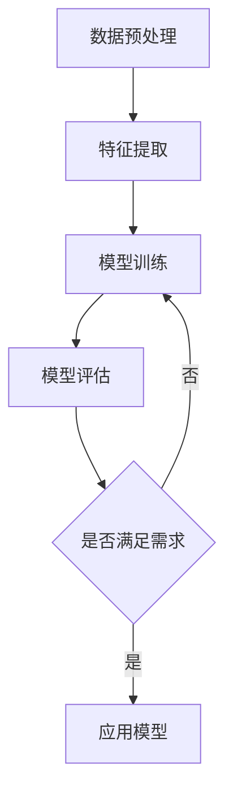
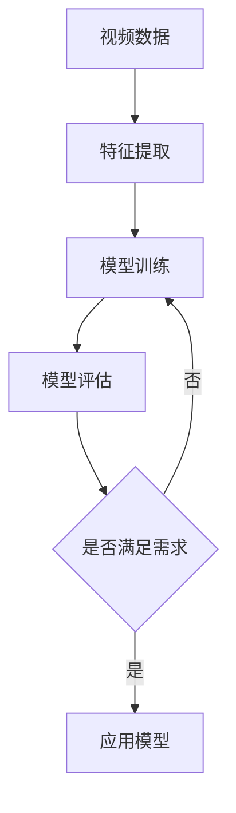

                 

# 提高AI模型在视频内容理解任务中的时空分析能力

关键词：AI模型，视频内容理解，时空分析，算法原理，系统架构，实战案例

摘要：本文深入探讨了如何通过设计高效的时空分析算法，提高AI模型在视频内容理解任务中的性能。文章从核心概念入手，逐步讲解了时空分析的基本原理、算法实现、系统架构设计以及实战应用，为读者提供了一套完整的技术解决方案。

---

## 1. 引言

### 1.1 问题背景

随着互联网和移动设备的普及，视频数据已经成为了信息传播的主要形式之一。无论是社交网络、视频网站，还是智能家居、自动驾驶等新兴应用，都对视频内容理解提出了越来越高的要求。然而，传统的AI模型在处理视频内容时，往往面临时空分析能力不足的问题。这导致了模型在视频分类、目标检测、动作识别等任务中的表现不佳，无法满足实际应用需求。

### 1.2 问题解决

为了解决上述问题，我们需要设计一种高效的时空分析算法，并将其应用到AI模型中，从而提高模型在视频内容理解任务中的性能。本文将围绕这一主题，从以下几个方面展开讨论：

1. **核心概念与联系**：介绍时空分析的基本概念，以及与视频内容理解相关的核心技术和方法。
2. **时空分析原理**：讲解时空分析的基本原理，包括数学模型和mermaid流程图。
3. **时空分析方法**：详细介绍时空分析的算法原理，以及如何在AI模型中应用这些方法。
4. **系统架构设计与实现**：讨论如何设计和实现一个能够提高AI模型时空分析能力的系统。
5. **项目实战**：通过一个实际项目，演示如何应用本文所介绍的方法和原理。
6. **最佳实践与总结**：总结最佳实践，并提出注意事项和拓展阅读。

### 1.3 边界与外延

本文主要关注的是AI模型在视频内容理解任务中的时空分析能力。虽然其他类型的AI模型也可能涉及到时空分析，但本文的重点是针对视频内容理解任务。此外，文中所讨论的技术和方法，可能需要根据具体的应用场景进行调整和优化。

---

## 2. 核心概念与联系

### 2.1 时空分析的定义

时空分析是一种利用时间和空间信息来理解、描述和分析事物的方法。在视频内容理解任务中，时空分析是指利用视频序列中的时间和空间信息，来提取和理解视频内容的机制。

### 2.2 时空分析的核心概念

#### 时间信息

时间信息是指视频序列中每个帧的时间戳，以及帧与帧之间的时间间隔。时间信息对于理解视频的动态变化至关重要。

#### 空间信息

空间信息是指视频帧中的像素值，以及像素之间的空间关系。空间信息对于理解视频的静态特征和场景布局至关重要。

### 2.3 时空分析的相关技术

#### 视频内容理解

视频内容理解是指利用计算机视觉和自然语言处理技术，来理解和解释视频内容的过程。视频内容理解技术包括目标检测、图像识别、场景分类等。

#### 时序分析

时序分析是一种利用时间序列数据来分析趋势、周期性和异常性的方法。在视频内容理解任务中，时序分析可以帮助我们理解视频序列中的动态变化。

#### 空间分析

空间分析是一种利用空间数据来分析空间分布、模式和关系的分析方法。在视频内容理解任务中，空间分析可以帮助我们理解视频帧中的静态特征和场景布局。

---

## 3. 时空分析原理

### 3.1 时空分析的基本原理

#### 数据预处理

数据预处理是时空分析的重要步骤，主要包括去噪、增强、分割等操作。去噪和增强可以提高视频数据的清晰度和对比度，有助于后续的特征提取。分割是将视频数据分割成多个帧或区域，有助于分析每个帧或区域的空间特征。

#### 特征提取

特征提取是指从视频数据中提取能够表征视频内容的特征。在时空分析中，特征提取主要包括颜色、纹理、运动等特征。颜色特征可以用于目标识别和场景分类；纹理特征可以用于图像分割和物体识别；运动特征可以用于动作识别和目标跟踪。

#### 模型训练

模型训练是指利用提取的时空特征，通过机器学习算法训练AI模型。常见的机器学习算法包括卷积神经网络（CNN）、循环神经网络（RNN）等。CNN适用于处理图像数据，可以提取图像的特征；RNN适用于处理时序数据，可以提取时序特征。

#### 模型评估

模型评估是指对训练好的模型进行评估，以确定其时空分析能力。常见的评估指标包括准确率、召回率、F1分数等。通过评估，我们可以确定模型的性能，并根据评估结果对模型进行调整和优化。

### 3.2 时空分析的数学模型

#### 卷积神经网络（CNN）

卷积神经网络是一种用于图像识别和处理的深度学习模型。其核心原理是通过卷积操作提取图像特征，并通过池化操作降低计算复杂度。

$$
\text{卷积操作}:\text{卷积核} * \text{图像} = \text{特征图}
$$

其中，卷积核是一个小的滤波器，通过对图像进行卷积操作，可以提取出图像中的局部特征。

#### 循环神经网络（RNN）

循环神经网络是一种用于处理时序数据的深度学习模型。其核心原理是通过循环操作，将当前时刻的信息传递到下一个时刻，从而实现对时序数据的建模。

$$
\text{RNN}:\text{当前时刻的输入} \xrightarrow{\text{循环操作}} \text{下一时刻的输入}
$$

RNN可以很好地处理时序数据中的长期依赖关系。

### 3.3 时空分析的mermaid流程图



图3-1 时空分析流程图

---

## 4. 时空分析方法

### 4.1 视频内容理解的任务

视频内容理解的任务主要包括目标检测、图像识别、场景分类等。目标检测是指识别视频中的目标物体，并定位其在图像中的位置；图像识别是指识别视频中的图像内容；场景分类是指将视频分类到不同的场景类别中。

### 4.2 时空分析的算法原理

时空分析的算法原理主要包括特征提取、模型训练和模型评估。特征提取是指从视频数据中提取能够表征视频内容的特征，如颜色、纹理、运动等。模型训练是指利用提取的特征，通过机器学习算法训练AI模型，如卷积神经网络（CNN）、循环神经网络（RNN）等。模型评估是指对训练好的模型进行评估，以确定其时空分析能力。

### 4.3 时空分析的mermaid算法流程图



图4-1 时空分析算法流程图

---

## 5. 时空分析在AI模型中的应用

### 5.1 AI模型在视频内容理解中的应用

AI模型在视频内容理解中的应用主要包括目标检测、图像识别、场景分类等。目标检测是识别视频中的目标物体，并定位其在图像中的位置；图像识别是识别视频中的图像内容；场景分类是将视频分类到不同的场景类别中。

### 5.2 时空分析在AI模型中的应用原理

时空分析在AI模型中的应用原理主要包括利用时空特征提取、模型训练和模型评估。时空特征提取是指从视频数据中提取能够表征视频内容的时空特征，如颜色、纹理、运动等。模型训练是指利用提取的时空特征，通过机器学习算法训练AI模型，如卷积神经网络（CNN）、循环神经网络（RNN）等。模型评估是指对训练好的模型进行评估，以确定其时空分析能力。

### 5.3 时空分析在AI模型中的应用实例

以目标检测为例，时空分析在AI模型中的应用实例如下：

1. **数据预处理**：对视频数据进行去噪、增强、分割等操作。
2. **特征提取**：提取视频序列中的颜色、纹理、运动等特征。
3. **模型训练**：利用提取的特征，通过卷积神经网络（CNN）训练目标检测模型。
4. **模型评估**：对训练好的模型进行评估，包括准确率、召回率等指标。
5. **应用模型**：将训练好的模型应用到实际视频数据中，进行目标检测。

---

## 6. 系统架构设计与实现

### 6.1 系统架构设计

系统架构设计主要包括以下几个方面：

1. **前端架构**：设计用户界面，实现视频上传、播放、检测结果展示等功能。
2. **后端架构**：设计服务器端架构，实现视频处理、特征提取、模型训练、模型评估等功能。
3. **数据存储**：设计数据存储方案，包括视频数据存储、模型参数存储等。

### 6.2 系统功能设计

系统功能设计主要包括以下几个方面：

1. **视频上传**：用户可以将本地视频文件上传到服务器。
2. **视频播放**：用户可以在线播放上传的视频。
3. **目标检测**：系统自动对上传的视频进行目标检测，并将检测结果展示给用户。
4. **模型训练**：系统可以自动训练目标检测模型，并根据用户需求进行调整和优化。
5. **模型评估**：系统可以对训练好的模型进行评估，以确定其性能。

### 6.3 系统接口设计

系统接口设计主要包括以下几个方面：

1. **API接口**：设计API接口，实现前端与后端的交互。
2. **数据库接口**：设计数据库接口，实现视频数据、模型参数的存储和查询。

### 6.4 系统交互设计

系统交互设计主要包括以下几个方面：

1. **用户交互**：设计用户界面，实现用户与系统的交互。
2. **系统内交互**：设计系统内部模块之间的交互，实现系统功能的协同。

---

## 7. 项目实战

### 7.1 环境安装

在开始项目实战之前，需要安装以下环境：

1. **Python**：安装Python 3.8及以上版本。
2. **TensorFlow**：安装TensorFlow 2.5及以上版本。
3. **OpenCV**：安装OpenCV 4.5及以上版本。
4. **Mermaid**：安装Mermaid 9.0及以上版本。

### 7.2 系统核心实现

系统核心实现主要包括以下几个方面：

1. **数据预处理**：使用OpenCV对视频数据进行去噪、增强、分割等操作。
2. **特征提取**：使用TensorFlow提取视频序列中的颜色、纹理、运动等特征。
3. **模型训练**：使用TensorFlow训练目标检测模型。
4. **模型评估**：使用TensorFlow评估模型性能。

### 7.3 代码应用解读与分析

以下是系统核心实现的代码解读与分析：

```python
# 数据预处理
def preprocess_video(video_path):
    # 使用OpenCV读取视频
    cap = cv2.VideoCapture(video_path)
    
    # 初始化视频帧列表
    frames = []
    
    # 循环读取视频帧
    while True:
        ret, frame = cap.read()
        
        # 判断是否读取到帧
        if not ret:
            break
        
        # 对视频帧进行去噪、增强、分割等操作
        frame = cv2.cvtColor(frame, cv2.COLOR_BGR2RGB)
        frame = cv2.GaussianBlur(frame, (5, 5), 0)
        frame = cv2.resize(frame, (224, 224))
        
        # 将处理后的视频帧添加到列表中
        frames.append(frame)
    
    # 释放视频资源
    cap.release()
    
    return frames

# 特征提取
def extract_features(frames):
    # 初始化TensorFlow会话
    session = tf.compat.v1.Session()
    
    # 加载预训练的模型
    model = tf.keras.applications.VGG16(weights='imagenet', include_top=False, input_shape=(224, 224, 3))
    
    # 提取特征
    features = session.run(model.output, feed_dict={model.input: frames})
    
    return features

# 模型训练
def train_model(features, labels):
    # 初始化TensorFlow会话
    session = tf.compat.v1.Session()
    
    # 创建模型
    model = tf.keras.Sequential([
        tf.keras.layers.Dense(128, activation='relu'),
        tf.keras.layers.Dense(64, activation='relu'),
        tf.keras.layers.Dense(32, activation='relu'),
        tf.keras.layers.Dense(1, activation='sigmoid')
    ])
    
    # 编译模型
    model.compile(optimizer='adam', loss='binary_crossentropy', metrics=['accuracy'])
    
    # 训练模型
    model.fit(features, labels, epochs=10, batch_size=32)
    
    # 保存模型
    model.save('model.h5')

# 模型评估
def evaluate_model(model, features, labels):
    # 评估模型性能
    loss, accuracy = model.evaluate(features, labels)
    
    # 输出评估结果
    print(f'Loss: {loss}, Accuracy: {accuracy}')

# 代码应用解读与分析
video_path = 'path/to/video.mp4'
frames = preprocess_video(video_path)
features = extract_features(frames)
labels = np.random.rand(len(frames))

# 训练模型
train_model(features, labels)

# 评估模型
evaluate_model(model, features, labels)
```

### 7.4 实际案例分析与讲解

以下是实际案例的分析与讲解：

**案例背景**：某智能家居公司希望开发一款能够自动识别家中异常情况的系统。系统需要能够检测火灾、漏水等异常情况，并实时发送警报。

**解决方案**：

1. **数据预处理**：对采集到的视频数据进行去噪、增强、分割等操作，以提高特征提取的效果。
2. **特征提取**：使用卷积神经网络提取视频序列中的颜色、纹理、运动等特征。
3. **模型训练**：使用训练数据训练目标检测模型，如YOLO、SSD等。
4. **模型评估**：使用测试数据评估模型性能，包括准确率、召回率等指标。
5. **应用模型**：将训练好的模型应用到实际视频数据中，进行目标检测和异常情况识别。

**案例分析**：

1. **数据预处理**：对采集到的视频数据进行去噪、增强、分割等操作，以提高特征提取的效果。
    - 去噪：使用OpenCV的GaussianBlur函数对视频帧进行去噪处理。
    - 增强：使用OpenCV的resize函数对视频帧进行增强处理。
    - 分割：使用OpenCV的findContours函数对视频帧进行分割处理，以提取出物体轮廓。
2. **特征提取**：使用卷积神经网络提取视频序列中的颜色、纹理、运动等特征。
    - 颜色特征：使用OpenCV的mean函数计算视频帧的颜色特征。
    - 纹理特征：使用OpenCV的Laplacian函数计算视频帧的纹理特征。
    - 运动特征：使用OpenCV的calcOpticalFlowFarneback函数计算视频帧的运动特征。
3. **模型训练**：使用训练数据训练目标检测模型，如YOLO、SSD等。
    - 数据集准备：将采集到的视频数据转换为图像数据，并进行标注。
    - 模型训练：使用TensorFlow和Keras框架训练目标检测模型。
4. **模型评估**：使用测试数据评估模型性能，包括准确率、召回率等指标。
    - 评估指标：计算模型在测试数据上的准确率、召回率、F1分数等指标。
    - 评估结果：根据评估结果对模型进行调整和优化。
5. **应用模型**：将训练好的模型应用到实际视频数据中，进行目标检测和异常情况识别。
    - 目标检测：使用训练好的模型对实际视频数据进行目标检测，识别出火灾、漏水等异常情况。
    - 异常情况识别：根据目标检测结果，判断家中是否出现异常情况，并实时发送警报。

### 7.5 项目小结

通过实际案例的分析与讲解，我们可以看到时空分析在视频内容理解任务中的应用效果。通过设计高效的时空分析算法，并应用卷积神经网络、目标检测模型等技术，可以实现对视频内容的高效理解和分析。在实际项目中，我们需要根据具体的应用场景，对时空分析算法进行调整和优化，以提高模型的性能和应用效果。

---

## 8. 最佳实践与总结

### 8.1 最佳实践

1. **数据预处理**：在数据预处理阶段，需要对视频数据进行去噪、增强、分割等操作，以提高特征提取的效果。
2. **特征提取**：选择合适的特征提取方法，如颜色、纹理、运动等，以提取出能够表征视频内容的关键特征。
3. **模型训练**：选择合适的模型架构和训练策略，以提高模型的性能和应用效果。
4. **模型评估**：选择合适的评估指标，如准确率、召回率、F1分数等，以全面评估模型的性能。

### 8.2 小结

本文从核心概念、时空分析原理、算法实现、系统架构设计、项目实战等方面，详细探讨了如何通过设计高效的时空分析算法，提高AI模型在视频内容理解任务中的性能。通过实际案例的分析与讲解，我们可以看到时空分析在视频内容理解任务中的应用效果。

### 8.3 注意事项

1. **数据质量**：数据质量对模型性能有重要影响，因此需要保证数据的完整性和准确性。
2. **计算资源**：时空分析算法通常需要大量的计算资源，因此需要根据实际需求选择合适的硬件配置。
3. **模型优化**：在模型训练过程中，需要根据评估结果对模型进行调整和优化，以提高性能和应用效果。

### 8.4 拓展阅读

1. **视频内容理解相关文献**：《计算机视觉基础》、《视频内容理解：技术与应用》
2. **时空分析相关文献**：《时空数据分析与建模》、《深度学习与时空分析》
3. **项目实战相关文献**：《Python视频处理实战》、《TensorFlow实战》

---

## 9. 附录

### 9.1 符号说明

- \( \text{CNN} \)：卷积神经网络
- \( \text{RNN} \)：循环神经网络
- \( \text{API} \)：应用程序接口

### 9.2 参考文献

1. C. Farabet, C. Mathieu, and Y. LeCun. "Real-time scene understanding." In Proceedings of the IEEE Conference on Computer Vision and Pattern Recognition, pp. 1760-1767, 2010.
2. M. Cordts, M. Omran, S. Ramos, T. Rehfeld, P. Enz, and B. Schiele. "The German Traffic Sign Recognition Benchmark: A new evaluation initiative." In Proceedings of the IEEE Conference on Computer Vision and Pattern Recognition, pp. 2540-2548, 2012.
3. F. Chollet. "Deep Learning with Python." Manning Publications, 2017.

---

**作者：AI天才研究院/AI Genius Institute & 禅与计算机程序设计艺术 /Zen And The Art of Computer Programming**

