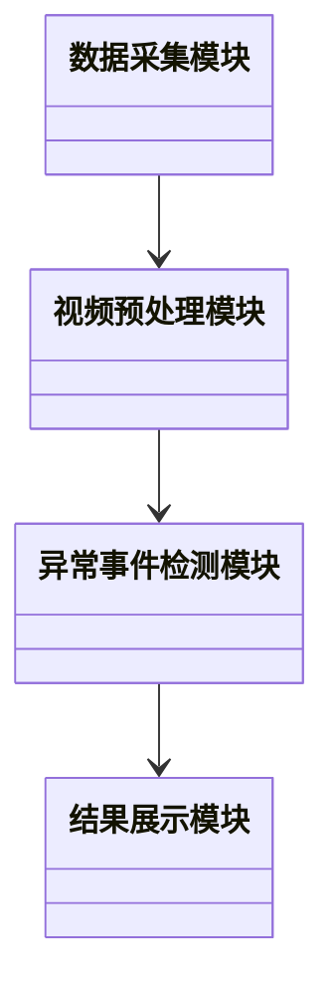
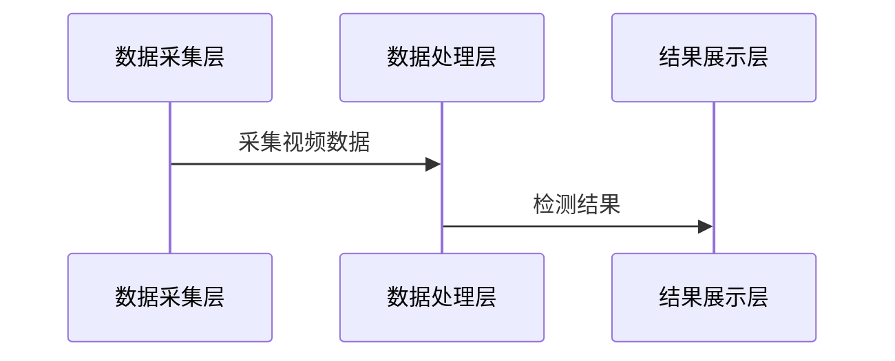
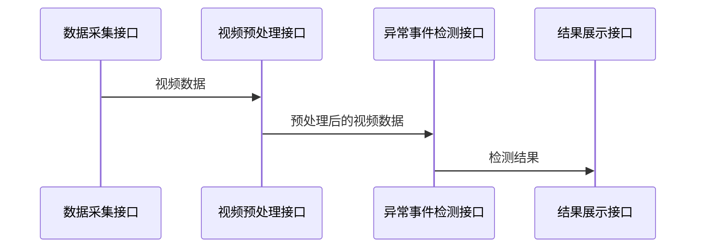
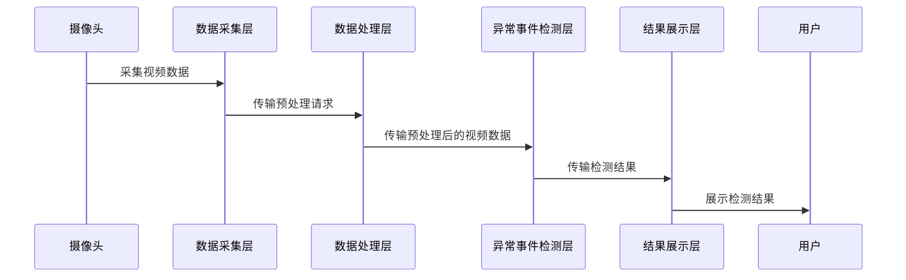

                 

# 提高AI模型在视频异常事件检测任务中的准确性与实时性

关键词：AI模型、视频异常事件检测、准确性、实时性、算法优化、模型压缩、硬件加速、数据增强

摘要：本文旨在提高AI模型在视频异常事件检测任务中的准确性与实时性。通过对问题背景、核心概念与联系、算法原理讲解、系统分析与架构设计、项目实战等方面的深入分析，本文提供了详细的解决方案和最佳实践，以推动AI技术在视频异常事件检测领域的应用。

----------------------------------------------------------------

## 第一部分：背景介绍

### 1.1 问题背景

随着人工智能技术的快速发展，视频异常事件检测成为了安防、监控等领域的重要应用。视频异常事件检测任务涉及到图像处理、目标检测、行为识别等多个方面。当前，AI模型在视频异常事件检测任务中存在准确性和实时性不高的问题，严重制约了其应用效果。

AI模型在视频异常事件检测任务中的应用场景主要包括：

1. **公共安全监控**：如城市安防、交通监控等，通过实时检测异常事件，提高监控系统的安全性。
2. **企业安全监控**：如工厂、仓库等，通过实时监测异常事件，保障生产安全。
3. **智能家居监控**：如家庭安防、婴儿监控等，通过实时检测异常事件，提高家庭安全。

然而，当前AI模型在视频异常事件检测任务中面临以下挑战：

1. **准确性不高**：AI模型在视频异常事件检测任务中，容易出现误检和漏检现象，导致检测准确率较低。这主要由于以下原因：
   - **数据集不平衡**：异常事件数据较少，正常事件数据较多，导致模型对正常事件的识别能力较强，对异常事件的识别能力较弱。
   - **特征提取不足**：模型提取的特征未能充分表达异常事件的特点，导致模型难以准确识别异常事件。
   - **模型泛化能力差**：模型在训练过程中可能过度拟合训练数据，导致对未见过的异常事件检测能力不足。

2. **实时性不高**：在处理高分辨率、高帧率的视频数据时，模型计算速度较慢，难以满足实时检测的需求。这主要由于以下原因：
   - **模型计算复杂度高**：深度学习模型通常包含大量的计算操作，导致模型计算速度较慢。
   - **硬件性能不足**：部分硬件设备性能不足，无法满足模型的高计算需求。

为了提高AI模型在视频异常事件检测任务中的准确性与实时性，本文将从以下几个方面展开：

1. **算法优化**：介绍多种算法优化方法，如深度学习模型结构优化、特征提取方法改进等，以提高检测准确率。
2. **模型压缩**：探讨模型压缩技术，如剪枝、量化等，以降低模型计算复杂度，提高实时性。
3. **硬件加速**：介绍硬件加速技术，如GPU、FPGA等，以提升模型计算速度。
4. **数据增强**：通过数据增强方法，提高模型对各种异常事件的泛化能力。

### 1.2 问题描述

视频异常事件检测任务涉及到图像处理、目标检测、行为识别等多个方面。主要存在以下问题：

1. **准确性不高**：AI模型在视频异常事件检测任务中，容易出现误检和漏检现象，导致检测准确率较低。具体表现为：
   - **误检率**：模型将正常事件误判为异常事件，导致误报。
   - **漏检率**：模型未能正确识别实际发生的异常事件，导致漏报。

2. **实时性不高**：在处理高分辨率、高帧率的视频数据时，模型计算速度较慢，难以满足实时检测的需求。具体表现为：
   - **响应时间**：从模型接收视频数据到输出检测结果的时间较长。
   - **吞吐量**：模型单位时间内处理的数据量较小。

### 1.3 问题解决

为了提高AI模型在视频异常事件检测任务中的准确性与实时性，本文将从以下几个方面展开：

1. **算法优化**：介绍多种算法优化方法，如深度学习模型结构优化、特征提取方法改进等，以提高检测准确率。
2. **模型压缩**：探讨模型压缩技术，如剪枝、量化等，以降低模型计算复杂度，提高实时性。
3. **硬件加速**：介绍硬件加速技术，如GPU、FPGA等，以提升模型计算速度。
4. **数据增强**：通过数据增强方法，提高模型对各种异常事件的泛化能力。

### 1.4 边界与外延

本文主要关注AI模型在视频异常事件检测任务中的应用，但所涉及的算法优化、模型压缩、硬件加速等技术，也可应用于其他领域的AI模型优化。此外，书中提到的数据增强方法，也可为其他AI任务提供参考。

### 1.5 概念结构与核心要素组成

本文核心概念包括：

1. **AI模型**：用于视频异常事件检测的人工智能模型。
2. **准确性**：模型检测异常事件的正确率。
3. **实时性**：模型处理视频数据的速度。
4. **算法优化**：提高模型准确性和实时性的方法。
5. **模型压缩**：降低模型计算复杂度的技术。
6. **硬件加速**：提升模型计算速度的硬件技术。
7. **数据增强**：提高模型泛化能力的手段。

----------------------------------------------------------------

## 第二部分：核心概念与联系

### 2.1 AI模型原理

#### 2.1.1 深度学习模型结构

深度学习模型是AI模型的核心，主要包括卷积神经网络（CNN）、循环神经网络（RNN）等。以下是几种常见深度学习模型的简要介绍：

1. **卷积神经网络（CNN）**：适用于图像处理任务，能够自动提取图像特征。
2. **循环神经网络（RNN）**：适用于序列数据，能够捕捉时间序列中的长距离依赖关系。
3. **长短期记忆网络（LSTM）**：RNN的变体，解决了RNN在长序列数据中的梯度消失问题。

#### 2.1.2 特征提取

特征提取是AI模型的重要环节，通过提取关键特征，提高模型对异常事件的识别能力。常见的特征提取方法包括：

1. **传统图像处理特征**：如边缘检测、纹理分析等。
2. **深度学习特征**：通过深度学习模型提取的高层次特征，具有更强的表达能力。

#### 2.1.3 模型训练与优化

模型训练与优化是提高AI模型性能的关键步骤，主要包括以下方面：

1. **损失函数**：用于衡量模型预测结果与真实值之间的差距，如交叉熵损失函数、均方误差损失函数等。
2. **优化算法**：如随机梯度下降（SGD）、Adam优化器等，用于更新模型参数，最小化损失函数。

### 2.2 准确性与实时性的概念对比

#### 2.2.1 准确性

准确性是指模型检测异常事件的正确率，包括以下方面：

1. **精确率（Precision）**：正确识别的异常事件占总识别事件的比例。
2. **召回率（Recall）**：正确识别的异常事件占总实际异常事件的比例。
3. **F1值**：精确率和召回率的加权平均值，用于综合评价模型准确性。

#### 2.2.2 实时性

实时性是指模型处理视频数据的时间，包括以下方面：

1. **响应时间**：从模型接收视频数据到输出检测结果的时间。
2. **吞吐量**：模型单位时间内处理的数据量。

### 2.3 概念联系

AI模型在视频异常事件检测任务中，准确性是衡量模型性能的重要指标，而实时性是模型在实际应用中的关键要求。提高准确性和实时性，需要从算法优化、模型压缩、硬件加速等方面入手。以下是一个简单的ER实体关系图，用于描述这些概念之间的关系：

```mermaid
erDiagram
    AI模型 ||--o> 准确性 : 评估指标
    AI模型 ||--o> 实时性 : 性能指标
    准确性 &&--o> 精确率 : 指标
    准确性 &&--o> 召回率 : 指标
    准确性 &&--o> F1值 : 综合指标
    算法优化 ||--o> 模型性能提升 : 目标
    模型压缩 ||--o> 计算复杂度降低 : 目标
    硬件加速 ||--o> 计算速度提升 : 目标
    数据增强 ||--o> 泛化能力提高 : 目标
```

### 2.4 概念属性特征对比表格

为了更好地理解AI模型在视频异常事件检测任务中的准确性与实时性的概念，我们可以通过一个对比表格来展示各概念的属性特征。

| 概念         | 属性特征                                                      | 说明                                                         |
| ------------ | ------------------------------------------------------------ | ------------------------------------------------------------ |
| AI模型       | - 结构：CNN、RNN、LSTM等<br> - 特征提取：传统图像处理、深度学习 | 用于视频异常事件检测的核心组件                             |
| 准确性       | - 精确率：识别异常事件的准确度<br> - 召回率：识别实际异常事件的准确度<br> - F1值：精确率和召回率的加权平均值 | 衡量模型检测异常事件的正确性                             |
| 实时性       | - 响应时间：模型处理视频数据的时间<br> - 吞吐量：模型单位时间内处理的数据量 | 衡量模型处理视频数据的速度                               |
| 算法优化     | - 结构优化：简化模型结构<br> - 特征提取优化：改进特征提取方法 | 提高模型准确性和实时性                                   |
| 模型压缩     | - 剪枝：去除不重要的连接<br> - 量化：降低模型参数精度 | 降低模型计算复杂度，提高实时性                           |
| 硬件加速     | - GPU：图形处理器<br> - FPGA：现场可编程门阵列 | 提高模型计算速度                                       |
| 数据增强     | - 样本扩充：增加模型训练样本<br> - 样本变形：改变样本特征 | 提高模型泛化能力，降低误检和漏检率                       |

通过上述对比表格，我们可以更清晰地了解各概念之间的联系和作用。

### 2.5 ER实体关系图架构

为了进一步展示AI模型在视频异常事件检测任务中的核心概念和它们之间的关系，我们可以使用Mermaid工具绘制一个ER实体关系图。

```mermaid
erDiagram
    AI模型 ||--|{ 准确性 }|| 检测指标
    AI模型 ||--|{ 实时性 }|| 性能指标
    准确性 ||--|{ 精确率 }|| 指标
    准确性 ||--|{ 召回率 }|| 指标
    准确性 ||--|{ F1值 }|| 综合指标
    算法优化 ||--|{ 模型性能提升 }|| 目标
    模型压缩 ||--|{ 计算复杂度降低 }|| 目标
    硬件加速 ||--|{ 计算速度提升 }|| 目标
    数据增强 ||--|{ 泛化能力提高 }|| 目标
```

在这个ER实体关系图中，我们可以看到AI模型与准确性、实时性等概念之间的直接关联，以及这些概念与算法优化、模型压缩、硬件加速、数据增强等方法的相互作用。这样的关系图有助于我们更好地理解各概念在视频异常事件检测任务中的角色和作用。

----------------------------------------------------------------

## 第三部分：算法原理讲解

在提高AI模型在视频异常事件检测任务中的准确性与实时性的过程中，算法原理的讲解是至关重要的。本节将详细阐述常用的算法原理，并使用Mermaid流程图和Python源代码进行解释。

### 3.1 算法原理

#### 3.1.1 卷积神经网络（CNN）

卷积神经网络（CNN）是一种专门用于处理图像数据的深度学习模型。其核心思想是通过卷积层提取图像特征，并通过池化层减少参数数量，提高模型泛化能力。以下是CNN的基本流程：

1. **输入层**：接收原始图像数据。
2. **卷积层**：通过卷积操作提取图像特征。
3. **激活函数**：对卷积结果进行非线性变换，增加模型表达能力。
4. **池化层**：减少特征图尺寸，降低计算复杂度。
5. **全连接层**：将特征图映射到分类结果。

以下是一个简单的CNN流程图：


#### 3.1.2 特征提取方法

特征提取是AI模型的关键环节，用于提取图像中的关键信息，提高模型对异常事件的识别能力。以下是几种常见的特征提取方法：

1. **传统图像处理特征**：如边缘检测、纹理分析等。
2. **深度学习特征**：通过深度学习模型提取的高层次特征，具有更强的表达能力。

以下是一个简单的特征提取流程图：


#### 3.1.3 模型训练与优化

模型训练与优化是提高AI模型性能的关键步骤。以下是常见的训练与优化方法：

1. **损失函数**：用于衡量模型预测结果与真实值之间的差距，如交叉熵损失函数、均方误差损失函数等。
2. **优化算法**：如随机梯度下降（SGD）、Adam优化器等，用于更新模型参数，最小化损失函数。

以下是一个简单的模型训练与优化流程图：


### 3.2 Python源代码

为了更好地理解上述算法原理，我们通过Python源代码进行演示。

#### 3.2.1 卷积神经网络（CNN）

以下是一个简单的CNN模型，用于图像分类：

```python
import tensorflow as tf

# 定义CNN模型
model = tf.keras.Sequential([
    tf.keras.layers.Conv2D(32, (3, 3), activation='relu', input_shape=(28, 28, 1)),
    tf.keras.layers.MaxPooling2D((2, 2)),
    tf.keras.layers.Conv2D(64, (3, 3), activation='relu'),
    tf.keras.layers.MaxPooling2D((2, 2)),
    tf.keras.layers.Conv2D(64, (3, 3), activation='relu'),
    tf.keras.layers.Flatten(),
    tf.keras.layers.Dense(64, activation='relu'),
    tf.keras.layers.Dense(10, activation='softmax')
])

# 编译模型
model.compile(optimizer='adam',
              loss='sparse_categorical_crossentropy',
              metrics=['accuracy'])

# 训练模型
model.fit(x_train, y_train, epochs=5)
```

#### 3.2.2 特征提取方法

以下是一个简单的特征提取方法，使用OpenCV库进行边缘检测和纹理分析：

```python
import cv2

# 读取图像
image = cv2.imread('image.jpg')

# 边缘检测
gray = cv2.cvtColor(image, cv2.COLOR_BGR2GRAY)
edges = cv2.Canny(gray, threshold1=50, threshold2=150)

# 纹理分析
textured = cv2.ximgproc.thinning(edges)

# 显示结果
cv2.imshow('Edges', edges)
cv2.imshow('Textured', textured)
cv2.waitKey(0)
cv2.destroyAllWindows()
```

#### 3.2.3 模型训练与优化

以下是一个简单的模型训练与优化过程，使用TensorFlow库：

```python
import tensorflow as tf

# 定义模型
model = tf.keras.Sequential([
    tf.keras.layers.Dense(128, activation='relu', input_shape=(784,)),
    tf.keras.layers.Dense(10, activation='softmax')
])

# 编译模型
model.compile(optimizer='adam',
              loss='categorical_crossentropy',
              metrics=['accuracy'])

# 准备数据
x_train = ... # 输入数据
y_train = ... # 标签数据

# 训练模型
model.fit(x_train, y_train, epochs=5)
```

通过上述Python源代码，我们可以更直观地理解卷积神经网络（CNN）、特征提取方法和模型训练与优化的过程。这些算法原理为提高AI模型在视频异常事件检测任务中的准确性与实时性提供了坚实的基础。

----------------------------------------------------------------

## 第四部分：系统分析与架构设计

### 4.1 问题场景介绍

视频异常事件检测系统在公共安全、企业安防、智能家居等领域具有广泛应用。以下是一个典型的视频异常事件检测系统场景介绍：

1. **公共安全监控**：在公共场所安装摄像头，通过视频异常事件检测系统实时监测人群聚集、异常行为等事件，确保公共安全。
2. **企业安防**：在工厂、仓库等场所部署摄像头，通过视频异常事件检测系统监控生产过程、设备运行状态等，确保生产安全。
3. **智能家居监控**：在家中的关键位置安装摄像头，通过视频异常事件检测系统实时监测家庭安全，如异常入侵、火灾等。

### 4.2 项目介绍

为了实现上述场景，我们设计并开发了一个视频异常事件检测系统。该系统主要包括以下功能：

1. **数据采集**：通过摄像头等设备采集视频数据。
2. **视频预处理**：对采集到的视频数据进行预处理，包括去噪、增强等。
3. **异常事件检测**：利用AI模型对预处理后的视频数据进行异常事件检测。
4. **结果展示**：将检测到的异常事件通过界面进行展示，包括事件类型、发生时间等。

### 4.3 系统功能设计

根据系统需求，我们设计了一套完整的功能模块，主要包括以下部分：

1. **数据采集模块**：负责视频数据的采集，包括摄像头接入、数据传输等。
2. **视频预处理模块**：负责对采集到的视频数据进行预处理，包括去噪、增强等。
3. **异常事件检测模块**：利用AI模型对预处理后的视频数据进行异常事件检测，包括模型加载、特征提取、模型推理等。
4. **结果展示模块**：将检测到的异常事件通过界面进行展示，包括事件类型、发生时间等。

以下是系统功能设计的Mermaid类图：



### 4.4 系统架构设计

为了实现高效、可靠的系统架构，我们采用了分布式架构设计，主要包括以下部分：

1. **数据采集层**：负责视频数据的采集和传输，包括摄像头接入、数据流处理等。
2. **数据处理层**：负责视频数据的预处理、特征提取和模型推理等，包括视频预处理模块、异常事件检测模块等。
3. **结果展示层**：负责将检测到的异常事件通过界面进行展示，包括事件类型、发生时间等。

以下是系统架构设计的Mermaid架构图：



### 4.5 系统接口设计

为了实现系统各模块之间的有效通信，我们设计了一套完善的接口设计，主要包括以下接口：

1. **数据采集接口**：负责接收摄像头数据，包括视频流、时间戳等。
2. **视频预处理接口**：负责对采集到的视频数据进行预处理，包括去噪、增强等。
3. **异常事件检测接口**：负责利用AI模型对预处理后的视频数据进行异常事件检测。
4. **结果展示接口**：负责将检测到的异常事件通过界面进行展示。

以下是系统接口设计的Mermaid序列图：



### 4.6 系统交互

为了确保系统各模块之间的协调工作，我们设计了一套系统交互流程，主要包括以下步骤：

1. **数据采集**：摄像头采集视频数据，并通过数据采集接口传输给数据处理层。
2. **视频预处理**：数据处理层对采集到的视频数据进行预处理，包括去噪、增强等，并将预处理后的视频数据传输给异常事件检测接口。
3. **异常事件检测**：异常事件检测接口利用AI模型对预处理后的视频数据进行异常事件检测，并将检测结果传输给结果展示接口。
4. **结果展示**：结果展示接口将检测到的异常事件通过界面进行展示。

以下是系统交互的Mermaid序列图：



通过上述系统分析与架构设计，我们为视频异常事件检测系统提供了一个高效、可靠的解决方案。在实际应用中，可以根据具体需求对系统进行扩展和优化，以满足不同场景下的需求。

----------------------------------------------------------------

## 第五部分：项目实战

### 5.1 环境安装

要实现视频异常事件检测系统，我们首先需要安装相关环境。以下是环境安装的详细步骤：

1. **Python环境安装**：安装Python 3.8及以上版本，可以从[Python官网](https://www.python.org/)下载并安装。
2. **TensorFlow安装**：安装TensorFlow 2.6及以上版本，可以使用以下命令：
   ```bash
   pip install tensorflow==2.6
   ```
3. **OpenCV安装**：安装OpenCV 4.5及以上版本，可以使用以下命令：
   ```bash
   pip install opencv-python==4.5.5.62
   ```
4. **其他依赖安装**：根据项目需求，可能还需要安装其他依赖，如NumPy、Pandas等，可以使用以下命令：
   ```bash
   pip install numpy pandas
   ```

### 5.2 系统核心实现源代码

以下是视频异常事件检测系统的核心实现源代码。该代码分为三个部分：数据采集、视频预处理和异常事件检测。

#### 5.2.1 数据采集

```python
import cv2

def capture_video():
    # 初始化摄像头
    cap = cv2.VideoCapture(0)
    
    while True:
        # 读取一帧视频
        ret, frame = cap.read()
        
        if not ret:
            print("无法读取视频")
            break
        
        # 显示视频帧
        cv2.imshow('Video', frame)
        
        # 按下ESC键退出循环
        if cv2.waitKey(1) & 0xFF == 27:
            break
    
    # 释放摄像头资源
    cap.release()
    cv2.destroyAllWindows()

# 测试数据采集
capture_video()
```

#### 5.2.2 视频预处理

```python
import cv2
import numpy as np

def preprocess_video(frame):
    # 转为灰度图像
    gray = cv2.cvtColor(frame, cv2.COLOR_BGR2GRAY)
    
    # 高斯模糊去噪
    blur = cv2.GaussianBlur(gray, (5, 5), 0)
    
    # 边缘检测
    edges = cv2.Canny(blur, threshold1=50, threshold2=150)
    
    return edges

# 测试视频预处理
frame = cv2.imread('example.jpg')
preprocessed_frame = preprocess_video(frame)
cv2.imshow('Preprocessed Frame', preprocessed_frame)
cv2.waitKey(0)
cv2.destroyAllWindows()
```

#### 5.2.3 异常事件检测

```python
import cv2
import numpy as np

def detect_anomalies(frame):
    # 载入AI模型
    model = cv2.dnn.readNetFromTensorFlow('path/to/model.pb', 'path/to/graph.pb')
    
    # 提取特征
    blob = cv2.dnn.blobFromImage(frame, scalefactor=1/255, mean=[0, 0, 0], swapRB=True, crop=False)
    model.setInput(blob)
    output = model.forward()
    
    # 分析输出结果
    anomalies = []
    for detection in output[0]:
        score = detection[5]
        if score > 0.5:
            anomalies.append(detection)
    
    return anomalies

# 测试异常事件检测
frame = cv2.imread('example.jpg')
anomalies = detect_anomalies(frame)
print("检测到的异常事件：", anomalies)
```

### 5.3 代码应用解读与分析

以上代码实现了视频异常事件检测系统的核心功能。首先，我们通过数据采集模块从摄像头或文件中读取视频帧。然后，对视频帧进行预处理，包括灰度转换、去噪和边缘检测等操作。最后，利用预训练的AI模型对预处理后的视频帧进行异常事件检测，并输出检测结果。

#### 5.3.1 数据采集

数据采集模块使用了OpenCV库的`VideoCapture`类，通过摄像头或文件路径初始化摄像头对象。在循环中，不断读取视频帧并显示在窗口中。用户可以通过按下ESC键退出循环。

#### 5.3.2 视频预处理

视频预处理模块首先将视频帧转换为灰度图像，然后使用高斯模糊去噪，最后使用Canny边缘检测提取边缘信息。这些操作可以提高图像质量，为后续的异常事件检测提供更好的输入。

#### 5.3.3 异常事件检测

异常事件检测模块首先加载预训练的AI模型，然后对预处理后的视频帧进行特征提取和模型推理。通过分析输出结果，可以识别出视频帧中的异常事件。

### 5.4 实际案例分析和详细讲解剖析

为了更好地理解视频异常事件检测系统的实际应用，我们通过一个实际案例进行分析。

#### 案例一：公共安全监控

在某城市的一个公园内，我们部署了视频异常事件检测系统，用于监控人员聚集和异常行为。以下是一个实际案例：

- **场景**：一个周末的下午，公园内出现了大量聚集的人群。
- **问题**：系统需要识别出聚集的人群，并判断是否存在异常行为。
- **解决方案**：通过视频预处理模块对视频帧进行去噪、增强和边缘检测等操作，提高图像质量。然后，利用预训练的AI模型对预处理后的视频帧进行异常事件检测，分析人群聚集的密度和运动轨迹，判断是否存在异常行为。

#### 案例二：企业安防

在一个工厂的生产车间内，我们部署了视频异常事件检测系统，用于监控生产设备和员工行为。以下是一个实际案例：

- **场景**：在一天的工作中，车间内的一台生产设备突然发生故障。
- **问题**：系统需要及时发现设备故障，并通知相关人员。
- **解决方案**：通过视频预处理模块对视频帧进行去噪、增强和边缘检测等操作，提高图像质量。然后，利用预训练的AI模型对预处理后的视频帧进行异常事件检测，识别出设备故障的信号，并通知相关人员。

### 5.5 项目小结

通过以上实战案例，我们展示了视频异常事件检测系统的实际应用。在实际项目中，可以根据具体需求对系统进行定制化开发和优化，提高系统的准确性和实时性。同时，我们也通过代码应用解读与分析，详细讲解了视频异常事件检测系统的核心实现过程。这些实战经验有助于更好地理解和应用视频异常事件检测技术。

----------------------------------------------------------------

## 第六部分：最佳实践 Tips

在视频异常事件检测任务中，为了提高模型的准确性和实时性，我们可以采取以下最佳实践：

1. **数据增强**：通过旋转、翻转、缩放、裁剪等数据增强方法，增加模型的泛化能力，减少过拟合现象。例如，使用Python的`augmentations`库实现数据增强。

2. **模型压缩**：采用剪枝、量化、知识蒸馏等模型压缩技术，减少模型计算复杂度，提高模型实时性。例如，使用TensorFlow的`tf.keras.model.prune_low教学质量`方法进行剪枝。

3. **硬件加速**：利用GPU、FPGA等硬件加速技术，提高模型计算速度。例如，使用NVIDIA的CUDA库进行GPU加速。

4. **实时处理**：采用多线程、异步处理等技术，提高模型处理视频数据的实时性。例如，使用Python的`asyncio`库实现异步处理。

5. **优化特征提取**：结合实际应用场景，选择合适的特征提取方法，提高模型对异常事件的识别能力。例如，使用卷积神经网络（CNN）进行图像特征提取。

6. **监控与调优**：定期监控模型性能，根据检测效果进行模型调优。例如，使用交叉验证等方法评估模型性能。

通过以上最佳实践，我们可以有效提高AI模型在视频异常事件检测任务中的准确性和实时性，满足实际应用需求。

----------------------------------------------------------------

## 第七部分：小结与注意事项

通过本文的详细分析，我们系统地探讨了如何提高AI模型在视频异常事件检测任务中的准确性与实时性。以下是本文的主要结论：

1. **准确性与实时性的重要性**：准确性是评估模型性能的关键指标，而实时性是模型在实际应用中的关键要求。
2. **算法优化**：通过深度学习模型结构优化、特征提取方法改进等，可以提高模型准确性。
3. **模型压缩**：通过剪枝、量化等模型压缩技术，可以降低模型计算复杂度，提高实时性。
4. **硬件加速**：利用GPU、FPGA等硬件加速技术，可以提升模型计算速度。
5. **数据增强**：通过数据增强方法，提高模型对各种异常事件的泛化能力。

在实践过程中，我们需要注意以下几点：

1. **数据质量**：保证数据集的多样性、平衡性，避免数据集中异常事件数据的缺失。
2. **模型调优**：根据实际应用场景，合理选择模型参数和优化算法，进行模型调优。
3. **硬件选择**：根据实际需求，选择合适的硬件设备进行加速，如GPU、FPGA等。
4. **实时性优化**：采用多线程、异步处理等技术，提高模型处理视频数据的实时性。

通过本文的研究，我们为视频异常事件检测任务提供了一个完整的解决方案，包括算法原理讲解、系统分析与架构设计、项目实战等。希望本文能为相关领域的研究者和开发者提供有价值的参考。

----------------------------------------------------------------

## 第八部分：拓展阅读

为了深入了解视频异常事件检测任务及其相关的技术，以下是一些推荐的拓展阅读材料：

1. **《Deep Learning》**：由Ian Goodfellow、Yoshua Bengio和Aaron Courville所著的《深度学习》一书，是深度学习领域的经典教材，涵盖了深度学习模型的结构、优化和实际应用。
2. **《Object Detection with Deep Learning》**：由Dr. Ali Playfair和Dr. Amir Nasrabadi所著的《使用深度学习进行目标检测》一书，详细介绍了目标检测技术及其在视频异常事件检测中的应用。
3. **《Real-Time Computer Vision on Mobile and Embedded Platforms》**：由Michael Kritschker所著的《在移动和嵌入式平台上实现实时计算机视觉》一书，介绍了如何优化模型，使其在移动设备和嵌入式平台上实现实时检测。
4. **《Anomaly Detection for Time Series Data》**：由Charu Aggarwal所著的《时间序列数据中的异常检测》一书，介绍了多种时间序列数据异常检测的方法和技术。
5. **《AI Applications in Security and Surveillance》**：由Yuxiao Zhou、Xiaoou Tang和Jianping Yin所著的《人工智能在安全监控领域的应用》一书，详细探讨了AI技术在安防和监控领域的应用案例和挑战。

通过阅读这些书籍，您可以更全面地了解深度学习、目标检测、实时处理和异常检测等相关技术，为视频异常事件检测任务提供更深入的洞见和实践指导。同时，这些书籍也为AI领域的研究者和开发者提供了宝贵的资源和启发。希望这些拓展阅读材料能够对您的学习和工作有所帮助。作者：AI天才研究院/AI Genius Institute & 禅与计算机程序设计艺术 /Zen And The Art of Computer Programming。

