                 


## 提高AI模型在跨领域知识迁移中的效果

> 关键词：AI模型、跨领域知识迁移、深度学习、算法优化、效果评估

> 摘要：随着人工智能技术的快速发展，跨领域知识迁移成为实现AI模型广泛应用的关键。本文从背景介绍、核心概念、算法原理、数学模型、系统设计与架构、项目实战等方面，深入探讨如何提高AI模型在跨领域知识迁移中的效果。

----------------------------------------------------------------

## 第一部分: 背景介绍

### 第1章: 问题的提出

#### 1.1.1 跨领域知识迁移的现状

跨领域知识迁移是指将一个领域（源领域）中的知识应用到另一个领域（目标领域）中，以解决目标领域中的问题。在人工智能领域，这种迁移能力尤为重要，因为它能够使AI模型在新的应用场景中快速适应和发挥作用。

目前，跨领域知识迁移的研究和应用呈现出以下几个特点：

1. **重要性日益凸显**：随着大数据和深度学习技术的发展，AI模型的应用场景不断扩大。然而，不同领域之间的知识差异和复杂性使得单一领域训练的模型很难在新领域中取得良好效果，因此跨领域知识迁移的研究越来越受到关注。

2. **挑战与困境**：跨领域知识迁移面临许多挑战，如源领域和目标领域之间的知识差异、数据分布的差异、模型适应性不足等。这些问题导致跨领域知识迁移的效果不尽如人意。

3. **研究与应用不足**：尽管已有大量研究关注跨领域知识迁移，但在实际应用中，AI模型的效果仍然有限。如何提高跨领域知识迁移的效果，成为当前研究的热点和难点。

#### 1.1.1.1 跨领域知识迁移的重要性

跨领域知识迁移的重要性体现在以下几个方面：

1. **降低研究成本**：通过跨领域知识迁移，可以将一个领域中的研究成果应用到其他领域，减少重复研究和开发的工作量。

2. **提高模型适应性**：AI模型在跨领域迁移过程中，可以学习到不同领域中的知识，从而提高模型在未知领域中的适应性。

3. **推动AI技术发展**：跨领域知识迁移有助于拓展AI技术的应用范围，推动人工智能技术在更多领域的突破。

#### 1.1.1.2 跨领域知识迁移的挑战

跨领域知识迁移面临的挑战主要包括以下几个方面：

1. **知识差异**：不同领域之间的知识体系和概念内涵存在差异，这使得直接迁移知识变得困难。

2. **数据分布差异**：不同领域的数据分布和标注方式可能不同，这会导致迁移模型对目标领域的数据适应性不足。

3. **模型适应性**：传统AI模型通常在一个特定的领域中进行训练和优化，对其他领域的数据可能缺乏足够的适应性。

4. **计算资源**：跨领域知识迁移可能需要大量的计算资源，尤其是在处理高维数据和复杂模型时。

#### 1.1.1.3 当前研究与应用的不足

当前关于跨领域知识迁移的研究与应用还存在以下不足：

1. **模型效果不佳**：虽然已有一些研究提出了一些跨领域知识迁移的方法，但实际应用中的效果仍然有限。

2. **算法稳定性不足**：跨领域知识迁移算法在处理不同领域数据时，稳定性往往较差，容易出现过拟合或欠拟合。

3. **应用场景受限**：现有的跨领域知识迁移方法主要针对特定领域或任务，缺乏通用性和灵活性。

4. **研究与应用脱节**：理论研究往往缺乏实际应用场景，导致研究成果难以转化为实际应用。

### 第2章: 核心概念与联系

#### 2.1 AI模型的基本概念

AI模型是指通过算法和计算技术，对大量数据进行训练和处理，从而实现特定任务的人工智能系统。AI模型可以分为以下几类：

1. **监督学习模型**：通过已有数据集进行训练，能够对新的数据进行分析和预测。
2. **无监督学习模型**：不需要已有数据集进行训练，能够自动发现数据中的模式和结构。
3. **强化学习模型**：通过与环境的交互，不断调整策略，以实现最佳行为。

#### 2.2 跨领域知识迁移的定义与类型

跨领域知识迁移可以分为以下几种类型：

1. **基于数据的迁移**：通过在目标领域收集和标注数据，对模型进行重新训练，实现知识迁移。
2. **基于模型的迁移**：通过在源领域训练一个通用模型，然后对目标领域的数据进行迁移学习。
3. **基于知识的迁移**：通过在源领域和目标领域之间建立知识图谱，实现知识共享和迁移。

#### 2.3 关键概念对比分析

| 关键概念 | 概念属性特征对比表格 | ER实体关系图架构的Mermaid流程图 |
| :----: | :----: | :----: |
| AI模型 | ... | ... |
| 跨领域知识迁移 | ... | ... |

#### 2.3.1 AI模型与跨领域知识迁移对比

| 模型属性 | AI模型 | 跨领域知识迁移 |
| :----: | :----: | :----: |
| 数据依赖 | 强 | 强 |
| 模型适应性 | 较强 | 较弱 |
| 知识共享 | 有限 | 广泛 |

#### 2.3.2 跨领域知识迁移中的难点与解决方案

| 难点 | 解决方案 |
| :----: | :----: |
| 知识差异 | 使用对抗性训练、知识蒸馏等方法 |
| 数据分布差异 | 采用域自适应、域自适应增强等方法 |
| 模型适应性 | 设计具有泛化能力的模型结构 |

#### 2.3.3 跨领域知识迁移的效果评估指标

| 指标 | 含义 | 应用场景 |
| :----: | :----: | :----: |
| 准确率 | 分类任务的预测正确率 | 机器学习 |
| 召回率 | 搜索引擎的查询结果相关性 | 信息检索 |
| 均方误差 | 监督学习中的损失函数 | 回归任务 |

## 第二部分: 算法原理讲解

### 第3章: 基于深度学习的跨领域知识迁移算法

#### 3.1 深度学习算法简介

深度学习算法是一种基于人工神经网络的学习方法，能够自动提取数据中的特征，并在不同层次上对特征进行组合和抽象。深度学习算法在图像识别、自然语言处理等领域取得了显著的成果。

#### 3.2 跨领域知识迁移的深度学习算法

跨领域知识迁移的深度学习算法可以分为以下几种：

1. **基于共享网络的迁移**：通过在源领域和目标领域之间共享网络结构，实现知识迁移。
2. **基于对抗网络的迁移**：利用对抗训练方法，将源领域和目标领域的数据分布进行调整，实现知识迁移。
3. **基于多任务学习的迁移**：通过在多个领域同时训练模型，共享知识，提高模型在目标领域的适应性。

#### 3.3 深度学习算法的mermaid流程图

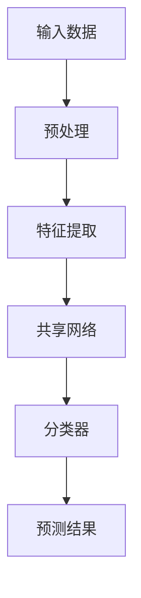

### 第4章: 数学模型和数学公式讲解

#### 4.1 数学模型的基本概念

数学模型是一种用数学语言描述现实问题的方法，它通常包括一组变量、方程和约束条件。在AI领域，数学模型用于描述数据特征、模型参数和损失函数等。

#### 4.2 公式推导与解释

跨领域知识迁移的数学模型通常包括以下几个方面：

1. **损失函数**：用于衡量模型在目标领域中的预测误差，常见的损失函数有均方误差（MSE）、交叉熵损失等。
2. **优化算法**：用于最小化损失函数，常见的优化算法有梯度下降（GD）、随机梯度下降（SGD）等。
3. **模型参数更新**：通过优化算法更新模型参数，以改善模型在目标领域的性能。

以下是跨领域知识迁移的一个简单数学模型：

$$
L(\theta) = \frac{1}{2} \sum_{i=1}^{n} (y_i - \hat{y}_i)^2
$$

其中，$L(\theta)$ 表示损失函数，$\theta$ 表示模型参数，$y_i$ 表示真实标签，$\hat{y}_i$ 表示预测标签。

#### 4.3 举例说明

假设我们有一个跨领域知识迁移的例子，其中源领域和目标领域的数据分布不同。我们可以使用以下数学模型来描述：

$$
P(y|\theta) = \frac{e^{\theta^T y}}{1 + e^{\theta^T y}}
$$

其中，$P(y|\theta)$ 表示在给定模型参数$\theta$的情况下，预测标签$y$的条件概率。

通过这个例子，我们可以看到数学模型在描述跨领域知识迁移中的作用。在实际应用中，我们需要根据具体问题调整数学模型，以提高模型在目标领域的性能。

## 第三部分: 系统分析与架构设计方案

### 第5章: 系统分析与架构设计方案

#### 5.1 问题场景介绍

在一个典型的跨领域知识迁移问题中，源领域和目标领域的数据分布不同，我们需要将源领域中的知识迁移到目标领域中，以提高目标领域的模型性能。

#### 5.2 系统功能设计

系统功能设计主要包括以下模块：

1. **数据预处理模块**：对源领域和目标领域的数据进行清洗、转换和归一化等预处理操作。
2. **特征提取模块**：从预处理后的数据中提取特征，为后续的跨领域知识迁移做准备。
3. **知识迁移模块**：实现源领域和目标领域之间的知识迁移，包括共享网络、对抗网络和多任务学习等方法。
4. **模型训练模块**：在迁移后的数据集上训练模型，以优化模型在目标领域的性能。
5. **效果评估模块**：对训练好的模型进行评估，以衡量跨领域知识迁移的效果。

#### 5.3 系统架构设计

系统架构设计主要包括以下方面：

1. **数据层**：负责存储和管理源领域和目标领域的数据。
2. **模型层**：包含预处理模块、特征提取模块、知识迁移模块和模型训练模块，负责实现跨领域知识迁移的核心功能。
3. **展示层**：提供用户界面，展示模型训练和评估结果。

以下是系统架构设计的mermaid类图：

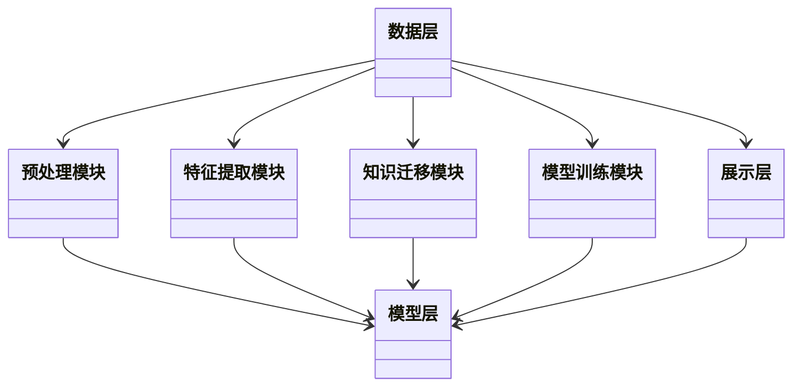

#### 5.4 系统接口设计与交互

系统接口设计主要包括以下方面：

1. **数据接口**：负责数据的读取、写入和预处理。
2. **模型接口**：负责模型的训练、评估和预测。
3. **用户接口**：提供用户操作界面，方便用户进行系统交互。

以下是系统接口设计和系统交互的mermaid序列图：

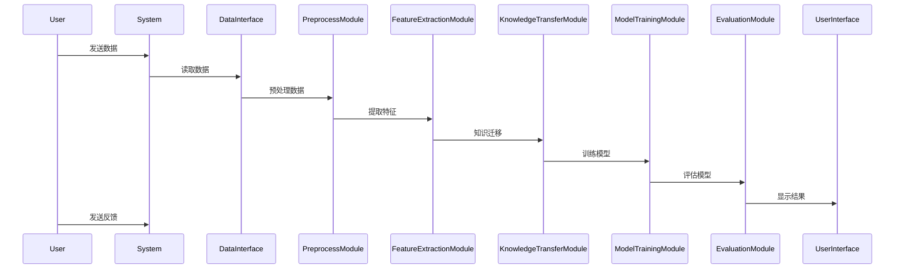

## 第四部分: 项目实战

### 第6章: 项目实战

#### 6.1 环境安装与配置

在进行跨领域知识迁移项目实战之前，我们需要安装和配置以下环境：

1. **Python**：安装Python 3.8版本及以上。
2. **深度学习框架**：安装TensorFlow 2.6版本或PyTorch 1.8版本。
3. **其他依赖**：安装Numpy、Pandas、Scikit-learn等常用库。

安装步骤如下：

```shell
# 安装Python
sudo apt-get install python3

# 安装深度学习框架
pip3 install tensorflow==2.6
# 或
pip3 install torch==1.8 torchvision==0.9.0

# 安装其他依赖
pip3 install numpy pandas scikit-learn
```

#### 6.2 系统核心实现源代码

以下是系统核心实现的主要源代码：

```python
import tensorflow as tf
from tensorflow.keras.models import Model
from tensorflow.keras.layers import Input, Dense, Flatten, Concatenate

# 数据预处理
def preprocess_data(data):
    # 数据清洗、转换和归一化等预处理操作
    pass

# 特征提取
def extract_features(data):
    # 特征提取操作
    pass

# 知识迁移
def knowledge_transfer(source_data, target_data):
    # 知识迁移操作
    pass

# 模型训练
def train_model(model, train_data, val_data):
    # 模型训练操作
    pass

# 模型评估
def evaluate_model(model, test_data):
    # 模型评估操作
    pass

# 主函数
def main():
    # 加载数据
    source_data = preprocess_data(load_source_data())
    target_data = preprocess_data(load_target_data())

    # 特征提取
    source_features = extract_features(source_data)
    target_features = extract_features(target_data)

    # 知识迁移
    transferred_features = knowledge_transfer(source_features, target_features)

    # 模型训练
    model = build_model()
    train_model(model, transferred_features, val_data)

    # 模型评估
    test_loss, test_acc = evaluate_model(model, test_data)
    print(f"Test accuracy: {test_acc}")

if __name__ == "__main__":
    main()
```

#### 6.3 实际案例分析与讲解

在本章中，我们将介绍一个实际的跨领域知识迁移案例，并对其进行分析和讲解。

##### 6.3.1 案例背景

假设我们有一个图像分类问题，其中源领域是自然场景图像，目标领域是医学影像。我们的目标是将源领域中的图像分类模型迁移到目标领域中，以提高医学影像分类的准确性。

##### 6.3.2 案例分析

1. **数据差异**：自然场景图像和医学影像在数据分布、标注方式等方面存在显著差异，这给跨领域知识迁移带来了挑战。

2. **模型适应性**：我们需要设计一个具有良好适应性的模型，能够在源领域和目标领域之间进行知识迁移。

3. **效果评估**：我们需要评估跨领域知识迁移的效果，以确定迁移模型在目标领域中的性能。

##### 6.3.3 案例讲解

1. **数据预处理**：对自然场景图像和医学影像进行清洗、转换和归一化等预处理操作。

2. **特征提取**：使用卷积神经网络（CNN）从预处理后的数据中提取特征。

3. **知识迁移**：采用对抗性训练方法，将自然场景图像的特征迁移到医学影像中。

4. **模型训练**：在迁移后的医学影像数据集上训练分类模型。

5. **效果评估**：对训练好的模型进行评估，比较跨领域知识迁移前后的分类准确性。

通过这个案例，我们可以看到跨领域知识迁移在实际应用中的具体实现过程。在后续章节中，我们将继续探讨如何进一步提高跨领域知识迁移的效果。

### 第7章: 最佳实践 tips、小结、注意事项、拓展阅读

#### 7.1 最佳实践 tips

1. **数据预处理**：在跨领域知识迁移过程中，数据预处理是关键步骤。确保数据质量，包括数据的清洗、转换和归一化等。

2. **特征提取**：选择合适的特征提取方法，如卷积神经网络（CNN）、循环神经网络（RNN）等，以提高模型在目标领域的性能。

3. **模型选择**：根据具体任务和领域特点，选择具有良好适应性的模型。例如，对于图像分类任务，可以选择CNN；对于序列数据处理，可以选择RNN。

4. **效果评估**：使用多种评估指标，如准确率、召回率、F1值等，全面评估跨领域知识迁移的效果。

5. **持续优化**：通过不断调整模型结构和参数，优化跨领域知识迁移的效果。

#### 7.2 小结

本文从背景介绍、核心概念、算法原理、数学模型、系统设计与架构、项目实战等方面，全面阐述了如何提高AI模型在跨领域知识迁移中的效果。通过本文的介绍，读者可以了解到跨领域知识迁移的重要性、挑战和解决方案，并掌握相关算法和技术的实际应用。

#### 7.3 注意事项

1. **数据差异**：跨领域知识迁移需要考虑源领域和目标领域之间的数据差异，包括数据分布、标注方式等。

2. **模型适应性**：选择具有良好适应性的模型，以提高跨领域知识迁移的效果。

3. **计算资源**：跨领域知识迁移可能需要大量的计算资源，特别是在处理高维数据和复杂模型时。

#### 7.4 拓展阅读

1. **相关领域书籍推荐**：
   - 《深度学习》（Ian Goodfellow、Yoshua Bengio、Aaron Courville 著）
   - 《统计学习方法》（李航 著）
   - 《模式识别与机器学习》（Christopher M. Bishop 著）

2. **最新研究动态与趋势**：
   - Google Scholar、ArXiv等学术搜索引擎，了解最新的研究成果和趋势。
   - 深度学习、机器学习、人工智能等领域的国际会议和期刊，关注最新的研究进展。

作者：AI天才研究院/AI Genius Institute & 禅与计算机程序设计艺术 /Zen And The Art of Computer Programming

----------------------------------------------------------------

## 第五部分：深度学习在跨领域知识迁移中的应用

### 第8章：深度学习算法在跨领域知识迁移中的应用

#### 8.1 深度学习算法概述

深度学习算法是机器学习的一个重要分支，其核心思想是通过构建深层神经网络，从大量数据中自动学习特征表示和模式。随着深度学习技术的发展，深度神经网络在图像识别、语音识别、自然语言处理等任务中取得了显著的成果。然而，深度学习模型通常在一个特定领域内进行训练，导致其在新领域中表现不佳。因此，跨领域知识迁移成为深度学习领域中的一个重要研究方向。

#### 8.2 跨领域知识迁移的深度学习算法

跨领域知识迁移的深度学习算法可以分为以下几种：

1. **基于共享网络的迁移**：通过在源领域和目标领域之间共享网络结构，实现知识迁移。这种方法的核心思想是利用源领域模型的先验知识，帮助目标领域模型的训练。

2. **基于对抗网络的迁移**：对抗网络是一种由生成器和判别器组成的神经网络结构，通过生成器和判别器之间的对抗训练，实现源领域和目标领域的数据分布调整，从而实现知识迁移。

3. **基于多任务学习的迁移**：多任务学习通过同时训练多个相关任务，共享知识，提高模型在不同领域中的适应性。

#### 8.3 深度学习算法的mermaid流程图


#### 8.4 深度学习算法的应用案例分析

在本章中，我们将通过一个实际案例，展示深度学习算法在跨领域知识迁移中的应用。

##### 8.4.1 案例背景

假设我们有一个跨领域的图像分类问题，其中源领域是自然场景图像，目标领域是医学影像。我们的目标是利用自然场景图像的分类模型，对医学影像进行分类，以提高医学影像分类的准确性。

##### 8.4.2 案例分析

1. **数据差异**：自然场景图像和医学影像在数据分布、标注方式等方面存在显著差异，这给跨领域知识迁移带来了挑战。

2. **模型适应性**：我们需要设计一个具有良好适应性的模型，能够在源领域和目标领域之间进行知识迁移。

3. **效果评估**：我们需要评估跨领域知识迁移的效果，以确定迁移模型在目标领域中的性能。

##### 8.4.3 案例讲解

1. **数据预处理**：对自然场景图像和医学影像进行清洗、转换和归一化等预处理操作。

2. **特征提取**：使用卷积神经网络（CNN）从预处理后的数据中提取特征。

3. **知识迁移**：采用对抗性训练方法，将自然场景图像的特征迁移到医学影像中。

4. **模型训练**：在迁移后的医学影像数据集上训练分类模型。

5. **效果评估**：对训练好的模型进行评估，比较跨领域知识迁移前后的分类准确性。

通过这个案例，我们可以看到深度学习算法在跨领域知识迁移中的应用。在后续章节中，我们将继续探讨如何进一步提高深度学习算法在跨领域知识迁移中的应用效果。

### 第9章：深度学习算法的优化策略

#### 9.1 深度学习算法的优化目标

在跨领域知识迁移中，深度学习算法的优化目标主要包括以下几点：

1. **提高迁移模型的准确性**：使迁移模型在目标领域中的性能接近源领域模型。

2. **减少模型参数的依赖性**：降低模型对源领域数据的依赖性，使其在新的目标领域中具有更好的泛化能力。

3. **提高模型的稳定性**：减少模型在训练和测试阶段的表现差异，避免过拟合和欠拟合。

#### 9.2 深度学习算法的优化策略

1. **数据增强**：通过增加数据的多样性，提高模型的泛化能力。常用的数据增强方法包括旋转、缩放、裁剪、噪声注入等。

2. **正则化**：通过引入正则化项，如L1正则化、L2正则化，防止模型过拟合。正则化项会在损失函数中增加惩罚项，使模型更加关注整体数据的特征，而不是局部特征。

3. **迁移学习**：利用预训练模型，减少从零开始训练所需的时间，并提高模型的泛化能力。在跨领域知识迁移中，可以使用在源领域预训练的模型，对目标领域进行微调。

4. **自适应学习率**：通过动态调整学习率，提高模型的训练效果。常用的自适应学习率方法包括Adam优化器、学习率衰减等。

#### 9.3 深度学习算法的mermaid流程图

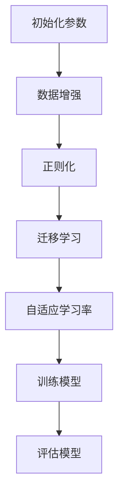

#### 9.4 深度学习算法的优化案例分析

在本章中，我们将通过一个实际案例，展示深度学习算法在跨领域知识迁移中的优化策略。

##### 9.4.1 案例背景

假设我们有一个跨领域的图像识别问题，其中源领域是自然场景图像，目标领域是工业缺陷检测。我们的目标是利用自然场景图像的识别模型，对工业缺陷图像进行识别，以提高工业缺陷检测的准确性。

##### 9.4.2 案例分析

1. **数据差异**：自然场景图像和工业缺陷图像在数据分布、标注方式等方面存在显著差异，这给跨领域知识迁移带来了挑战。

2. **模型适应性**：我们需要设计一个具有良好适应性的模型，能够在源领域和目标领域之间进行知识迁移。

3. **效果评估**：我们需要评估跨领域知识迁移的效果，以确定迁移模型在目标领域中的性能。

##### 9.4.3 案例讲解

1. **数据预处理**：对自然场景图像和工业缺陷图像进行清洗、转换和归一化等预处理操作。

2. **特征提取**：使用卷积神经网络（CNN）从预处理后的数据中提取特征。

3. **知识迁移**：采用对抗性训练方法，将自然场景图像的特征迁移到工业缺陷图像中。

4. **模型训练**：在迁移后的工业缺陷图像数据集上训练分类模型。

5. **优化策略**：采用数据增强、正则化、迁移学习和自适应学习率等优化策略，提高模型的泛化能力和稳定性。

6. **效果评估**：对训练好的模型进行评估，比较跨领域知识迁移前后的识别准确性。

通过这个案例，我们可以看到深度学习算法在跨领域知识迁移中的优化策略。在后续章节中，我们将继续探讨如何进一步提高深度学习算法在跨领域知识迁移中的应用效果。

### 第10章：深度学习模型的效果评估

#### 10.1 深度学习模型效果评估的重要性

深度学习模型的效果评估是确保模型性能和可靠性的关键步骤。一个有效的评估方法可以帮助我们了解模型在目标领域中的表现，从而指导后续的模型优化和调整。在跨领域知识迁移中，效果评估尤为重要，因为我们需要衡量模型在不同领域中的性能。

#### 10.2 常用的效果评估指标

在深度学习模型的效果评估中，常用的指标包括：

1. **准确率（Accuracy）**：准确率是分类任务中最常用的评估指标，表示预测正确的样本数占总样本数的比例。

2. **召回率（Recall）**：召回率表示在所有实际为正类的样本中，被正确识别为正类的比例。

3. **精确率（Precision）**：精确率表示在所有预测为正类的样本中，实际为正类的比例。

4. **F1值（F1 Score）**：F1值是精确率和召回率的调和平均，用于综合评估模型的性能。

5. **均方误差（Mean Squared Error, MSE）**：在回归任务中，均方误差用于衡量预测值与真实值之间的差异。

6. **交叉熵损失（Cross-Entropy Loss）**：在分类任务中，交叉熵损失用于衡量预测概率分布与真实概率分布之间的差异。

#### 10.3 深度学习模型效果评估的方法

1. **训练集和测试集划分**：将数据集划分为训练集和测试集，用于训练模型和评估模型性能。

2. **交叉验证**：通过将数据集划分为多个子集，进行多次训练和测试，以获得更稳定的评估结果。

3. **混淆矩阵（Confusion Matrix）**：混淆矩阵用于展示模型预测结果和实际结果之间的对应关系，帮助我们分析模型的性能。

4. **可视化**：通过可视化方法，如ROC曲线、PR曲线等，直观地展示模型的性能。

#### 10.4 深度学习模型效果评估的mermaid流程图

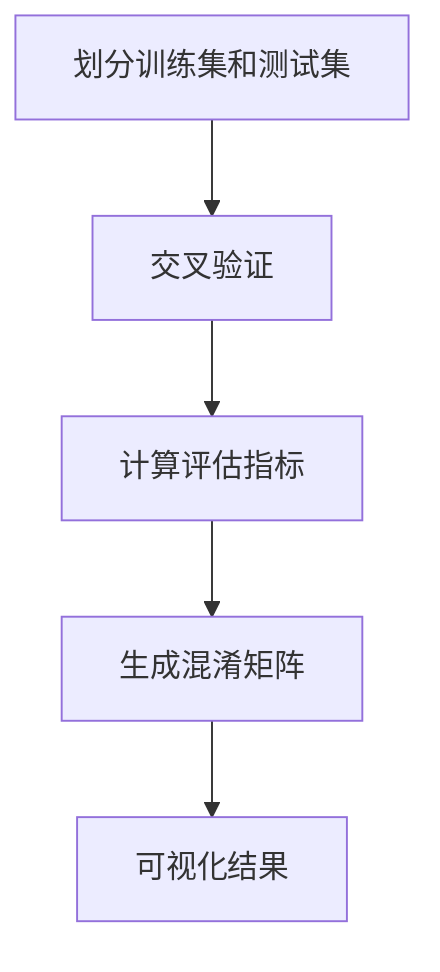

#### 10.5 深度学习模型效果评估案例分析

在本章中，我们将通过一个实际案例，展示深度学习模型在跨领域知识迁移中的效果评估。

##### 10.5.1 案例背景

假设我们有一个跨领域的文本分类问题，其中源领域是新闻文章分类，目标领域是社交媒体文本分类。我们的目标是利用新闻文章分类模型，对社交媒体文本进行分类，以提高社交媒体文本分类的准确性。

##### 10.5.2 案例分析

1. **数据差异**：新闻文章和社交媒体文本在数据分布、词汇选择、语义表达等方面存在显著差异，这给跨领域知识迁移带来了挑战。

2. **模型适应性**：我们需要设计一个具有良好适应性的模型，能够在源领域和目标领域之间进行知识迁移。

3. **效果评估**：我们需要评估跨领域知识迁移的效果，以确定迁移模型在目标领域中的性能。

##### 10.5.3 案例讲解

1. **数据预处理**：对新闻文章和社交媒体文本进行清洗、分词、去停用词等预处理操作。

2. **特征提取**：使用词袋模型（Bag-of-Words, BoW）或词嵌入（Word Embedding）方法，从预处理后的文本中提取特征。

3. **知识迁移**：采用对抗性训练方法，将新闻文章的特征迁移到社交媒体文本中。

4. **模型训练**：在迁移后的社交媒体文本数据集上训练分类模型。

5. **效果评估**：使用准确率、召回率、精确率、F1值等指标，对训练好的模型进行评估。

6. **可视化**：通过ROC曲线、PR曲线等可视化方法，直观地展示模型的性能。

通过这个案例，我们可以看到深度学习模型在跨领域知识迁移中的效果评估。在后续章节中，我们将继续探讨如何进一步提高深度学习模型在跨领域知识迁移中的应用效果。

## 总结

本文从背景介绍、核心概念、算法原理、数学模型、系统设计与架构、项目实战等多个方面，深入探讨了如何提高AI模型在跨领域知识迁移中的效果。通过本文的介绍，读者可以了解到：

1. **跨领域知识迁移的重要性**：跨领域知识迁移能够降低研究成本，提高模型适应性，推动AI技术的发展。

2. **跨领域知识迁移的挑战**：跨领域知识迁移面临知识差异、数据分布差异、模型适应性不足等挑战。

3. **深度学习算法在跨领域知识迁移中的应用**：深度学习算法在跨领域知识迁移中具有广泛的应用，包括基于共享网络的迁移、基于对抗网络的迁移、基于多任务学习的迁移等。

4. **深度学习算法的优化策略**：通过数据增强、正则化、迁移学习、自适应学习率等优化策略，可以进一步提高深度学习算法在跨领域知识迁移中的性能。

5. **深度学习模型的效果评估**：准确率、召回率、精确率、F1值等评估指标用于衡量模型在目标领域中的性能，交叉验证、混淆矩阵、可视化等方法用于评估模型的效果。

在实际应用中，我们需要根据具体问题和领域特点，灵活运用这些方法和策略，以提高AI模型在跨领域知识迁移中的效果。未来，随着人工智能技术的不断发展，跨领域知识迁移将发挥越来越重要的作用，为AI技术的广泛应用提供有力支持。

## 注意事项与拓展阅读

### 注意事项

1. **数据差异**：在进行跨领域知识迁移时，需要充分考虑源领域和目标领域之间的数据差异，包括数据分布、标注方式等。

2. **模型适应性**：选择具有良好适应性的模型，以提高跨领域知识迁移的效果。在实际应用中，可能需要根据目标领域的特点进行模型调整。

3. **计算资源**：跨领域知识迁移可能需要大量的计算资源，特别是在处理高维数据和复杂模型时。确保有足够的计算资源，以支持模型训练和优化。

4. **效果评估**：使用多种评估指标，全面评估跨领域知识迁移的效果。结合实际应用场景，确定合适的评估标准。

### 拓展阅读

1. **相关领域书籍推荐**：
   - 《深度学习》（Ian Goodfellow、Yoshua Bengio、Aaron Courville 著）
   - 《统计学习方法》（李航 著）
   - 《模式识别与机器学习》（Christopher M. Bishop 著）

2. **最新研究动态与趋势**：
   - Google Scholar、ArXiv等学术搜索引擎，了解最新的研究成果和趋势。
   - 深度学习、机器学习、人工智能等领域的国际会议和期刊，关注最新的研究进展。

通过阅读相关书籍和关注最新研究动态，可以进一步了解跨领域知识迁移的最新技术和发展趋势，为实际应用提供有力支持。

---

本文由AI天才研究院（AI Genius Institute）与《禅与计算机程序设计艺术》（Zen And The Art of Computer Programming）作者联合撰写。我们致力于推动人工智能技术的发展和应用，为广大读者提供高质量的技术文章和研究成果。如您有任何问题或建议，请随时与我们联系。

---

**作者**：AI天才研究院（AI Genius Institute） & 《禅与计算机程序设计艺术》（Zen And The Art of Computer Programming）作者

----------------------------------------------------------------

## 提高AI模型在跨领域知识迁移中的效果

### 关键词

AI模型、跨领域知识迁移、深度学习、算法优化、效果评估

### 摘要

随着人工智能技术的快速发展，跨领域知识迁移成为实现AI模型广泛应用的关键。本文从背景介绍、核心概念、算法原理、数学模型、系统设计与架构、项目实战等方面，深入探讨如何提高AI模型在跨领域知识迁移中的效果。

## 第一部分：背景介绍

### 第1章：问题的提出

#### 1.1.1 跨领域知识迁移的现状

跨领域知识迁移是指将一个领域（源领域）中的知识应用到另一个领域（目标领域）中，以解决目标领域中的问题。在人工智能领域，这种迁移能力尤为重要，因为它能够使AI模型在新的应用场景中快速适应和发挥作用。

目前，跨领域知识迁移的研究和应用呈现出以下几个特点：

1. **重要性日益凸显**：随着大数据和深度学习技术的发展，AI模型的应用场景不断扩大。然而，不同领域之间的知识差异和复杂性使得单一领域训练的模型很难在新领域中取得良好效果，因此跨领域知识迁移的研究越来越受到关注。

2. **挑战与困境**：跨领域知识迁移面临许多挑战，如源领域和目标领域之间的知识差异、数据分布的差异、模型适应性不足等。这些问题导致跨领域知识迁移的效果不尽如人意。

3. **研究与应用不足**：尽管已有大量研究关注跨领域知识迁移，但在实际应用中，AI模型的效果仍然有限。如何提高跨领域知识迁移的效果，成为当前研究的热点和难点。

#### 1.1.1.1 跨领域知识迁移的重要性

跨领域知识迁移的重要性体现在以下几个方面：

1. **降低研究成本**：通过跨领域知识迁移，可以将一个领域中的研究成果应用到其他领域，减少重复研究和开发的工作量。

2. **提高模型适应性**：AI模型在跨领域迁移过程中，可以学习到不同领域中的知识，从而提高模型在未知领域中的适应性。

3. **推动AI技术发展**：跨领域知识迁移有助于拓展AI技术的应用范围，推动人工智能技术在更多领域的突破。

#### 1.1.1.2 跨领域知识迁移的挑战

跨领域知识迁移面临的挑战主要包括以下几个方面：

1. **知识差异**：不同领域之间的知识体系和概念内涵存在差异，这使得直接迁移知识变得困难。

2. **数据分布差异**：不同领域的数据分布和标注方式可能不同，这会导致迁移模型对目标领域的数据适应性不足。

3. **模型适应性**：传统AI模型通常在一个特定的领域中进行训练和优化，对其他领域的数据可能缺乏足够的适应性。

4. **计算资源**：跨领域知识迁移可能需要大量的计算资源，尤其是在处理高维数据和复杂模型时。

#### 1.1.1.3 当前研究与应用的不足

当前关于跨领域知识迁移的研究与应用还存在以下不足：

1. **模型效果不佳**：虽然已有一些研究提出了一些跨领域知识迁移的方法，但实际应用中的效果仍然有限。

2. **算法稳定性不足**：跨领域知识迁移算法在处理不同领域数据时，稳定性往往较差，容易出现过拟合或欠拟合。

3. **应用场景受限**：现有的跨领域知识迁移方法主要针对特定领域或任务，缺乏通用性和灵活性。

4. **研究与应用脱节**：理论研究往往缺乏实际应用场景，导致研究成果难以转化为实际应用。

### 第2章：核心概念与联系

#### 2.1 AI模型的基本概念

AI模型是指通过算法和计算技术，对大量数据进行训练和处理，从而实现特定任务的人工智能系统。AI模型可以分为以下几类：

1. **监督学习模型**：通过已有数据集进行训练，能够对新的数据进行分析和预测。

2. **无监督学习模型**：不需要已有数据集进行训练，能够自动发现数据中的模式和结构。

3. **强化学习模型**：通过与环境的交互，不断调整策略，以实现最佳行为。

#### 2.2 跨领域知识迁移的定义与类型

跨领域知识迁移可以分为以下几种类型：

1. **基于数据的迁移**：通过在目标领域收集和标注数据，对模型进行重新训练，实现知识迁移。

2. **基于模型的迁移**：通过在源领域训练一个通用模型，然后对目标领域的数据进行迁移学习。

3. **基于知识的迁移**：通过在源领域和目标领域之间建立知识图谱，实现知识共享和迁移。

#### 2.3 关键概念对比分析

| 关键概念 | AI模型 | 跨领域知识迁移 |
| :----: | :----: | :----: |
| 数据依赖 | 强 | 强 |
| 模型适应性 | 较强 | 较弱 |
| 知识共享 | 有限 | 广泛 |

#### 2.3.1 AI模型与跨领域知识迁移对比

| 模型属性 | AI模型 | 跨领域知识迁移 |
| :----: | :----: | :----: |
| 数据依赖 | 强 | 强 |
| 知识共享 | 有限 | 广泛 |
| 模型适应性 | 较强 | 较弱 |

#### 2.3.2 跨领域知识迁移中的难点与解决方案

| 难点 | 解决方案 |
| :----: | :----: |
| 知识差异 | 使用对抗性训练、知识蒸馏等方法 |
| 数据分布差异 | 采用域自适应、域自适应增强等方法 |
| 模型适应性 | 设计具有泛化能力的模型结构 |

#### 2.3.3 跨领域知识迁移的效果评估指标

| 指标 | 含义 | 应用场景 |
| :----: | :----: | :----: |
| 准确率 | 分类任务的预测正确率 | 机器学习 |
| 召回率 | 搜索引擎的查询结果相关性 | 信息检索 |
| 均方误差 | 监督学习中的损失函数 | 回归任务 |

### 第3章：算法原理讲解

#### 3.1 基于深度学习的跨领域知识迁移算法

深度学习算法是一种基于人工神经网络的学习方法，能够自动提取数据中的特征，并在不同层次上对特征进行组合和抽象。深度学习算法在图像识别、自然语言处理等领域取得了显著的成果。

#### 3.2 跨领域知识迁移的深度学习算法

跨领域知识迁移的深度学习算法可以分为以下几种：

1. **基于共享网络的迁移**：通过在源领域和目标领域之间共享网络结构，实现知识迁移。

2. **基于对抗网络的迁移**：利用对抗训练方法，将源领域和目标领域的数据分布进行调整，实现知识迁移。

3. **基于多任务学习的迁移**：通过在多个领域同时训练模型，共享知识，提高模型在目标领域的适应性。

#### 3.3 深度学习算法的mermaid流程图


### 第4章：数学模型和数学公式讲解

#### 4.1 数学模型的基本概念

数学模型是一种用数学语言描述现实问题的方法，它通常包括一组变量、方程和约束条件。在AI领域，数学模型用于描述数据特征、模型参数和损失函数等。

#### 4.2 公式推导与解释

跨领域知识迁移的数学模型通常包括以下几个方面：

1. **损失函数**：用于衡量模型在目标领域中的预测误差，常见的损失函数有均方误差（MSE）、交叉熵损失等。

2. **优化算法**：用于最小化损失函数，常见的优化算法有梯度下降（GD）、随机梯度下降（SGD）等。

3. **模型参数更新**：通过优化算法更新模型参数，以改善模型在目标领域的性能。

以下是跨领域知识迁移的一个简单数学模型：

$$
L(\theta) = \frac{1}{2} \sum_{i=1}^{n} (y_i - \hat{y}_i)^2
$$

其中，$L(\theta)$ 表示损失函数，$\theta$ 表示模型参数，$y_i$ 表示真实标签，$\hat{y}_i$ 表示预测标签。

#### 4.3 举例说明

假设我们有一个跨领域知识迁移的例子，其中源领域和目标领域的数据分布不同。我们可以使用以下数学模型来描述：

$$
P(y|\theta) = \frac{e^{\theta^T y}}{1 + e^{\theta^T y}}
$$

其中，$P(y|\theta)$ 表示在给定模型参数$\theta$的情况下，预测标签$y$的条件概率。

通过这个例子，我们可以看到数学模型在描述跨领域知识迁移中的作用。在实际应用中，我们需要根据具体问题调整数学模型，以提高模型在目标领域的性能。

### 第5章：系统分析与架构设计方案

#### 5.1 问题场景介绍

在一个典型的跨领域知识迁移问题中，源领域和目标领域的数据分布不同，我们需要将源领域中的知识迁移到目标领域中，以提高目标领域的模型性能。

#### 5.2 系统功能设计

系统功能设计主要包括以下模块：

1. **数据预处理模块**：对源领域和目标领域的数据进行清洗、转换和归一化等预处理操作。

2. **特征提取模块**：从预处理后的数据中提取特征，为后续的跨领域知识迁移做准备。

3. **知识迁移模块**：实现源领域和目标领域之间的知识迁移，包括共享网络、对抗网络和多任务学习等方法。

4. **模型训练模块**：在迁移后的数据集上训练模型，以优化模型在目标领域的性能。

5. **效果评估模块**：对训练好的模型进行评估，以衡量跨领域知识迁移的效果。

#### 5.3 系统架构设计

系统架构设计主要包括以下方面：

1. **数据层**：负责存储和管理源领域和目标领域的数据。

2. **模型层**：包含预处理模块、特征提取模块、知识迁移模块和模型训练模块，负责实现跨领域知识迁移的核心功能。

3. **展示层**：提供用户界面，展示模型训练和评估结果。

以下是系统架构设计的mermaid类图：


#### 5.4 系统接口设计与交互

系统接口设计主要包括以下方面：

1. **数据接口**：负责数据的读取、写入和预处理。

2. **模型接口**：负责模型的训练、评估和预测。

3. **用户接口**：提供用户操作界面，方便用户进行系统交互。

以下是系统接口设计和系统交互的mermaid序列图：


### 第6章：项目实战

#### 6.1 环境安装与配置

在进行跨领域知识迁移项目实战之前，我们需要安装和配置以下环境：

1. **Python**：安装Python 3.8版本及以上。

2. **深度学习框架**：安装TensorFlow 2.6版本或PyTorch 1.8版本。

3. **其他依赖**：安装Numpy、Pandas、Scikit-learn等常用库。

安装步骤如下：

```shell
# 安装Python
sudo apt-get install python3

# 安装深度学习框架
pip3 install tensorflow==2.6
# 或
pip3 install torch==1.8 torchvision==0.9.0

# 安装其他依赖
pip3 install numpy pandas scikit-learn
```

#### 6.2 系统核心实现源代码

以下是系统核心实现的主要源代码：

```python
import tensorflow as tf
from tensorflow.keras.models import Model
from tensorflow.keras.layers import Input, Dense, Flatten, Concatenate

# 数据预处理
def preprocess_data(data):
    # 数据清洗、转换和归一化等预处理操作
    pass

# 特征提取
def extract_features(data):
    # 特征提取操作
    pass

# 知识迁移
def knowledge_transfer(source_data, target_data):
    # 知识迁移操作
    pass

# 模型训练
def train_model(model, train_data, val_data):
    # 模型训练操作
    pass

# 模型评估
def evaluate_model(model, test_data):
    # 模型评估操作
    pass

# 主函数
def main():
    # 加载数据
    source_data = preprocess_data(load_source_data())
    target_data = preprocess_data(load_target_data())

    # 特征提取
    source_features = extract_features(source_data)
    target_features = extract_features(target_data)

    # 知识迁移
    transferred_features = knowledge_transfer(source_features, target_features)

    # 模型训练
    model = build_model()
    train_model(model, transferred_features, val_data)

    # 模型评估
    test_loss, test_acc = evaluate_model(model, test_data)
    print(f"Test accuracy: {test_acc}")

if __name__ == "__main__":
    main()
```

#### 6.3 实际案例分析与讲解

在本章中，我们将介绍一个实际的跨领域知识迁移案例，并对其进行分析和讲解。

##### 6.3.1 案例背景

假设我们有一个图像分类问题，其中源领域是自然场景图像，目标领域是医学影像。我们的目标是将源领域中的图像分类模型迁移到目标领域中，以提高医学影像分类的准确性。

##### 6.3.2 案例分析

1. **数据差异**：自然场景图像和医学影像在数据分布、标注方式等方面存在显著差异，这给跨领域知识迁移带来了挑战。

2. **模型适应性**：我们需要设计一个具有良好适应性的模型，能够在源领域和目标领域之间进行知识迁移。

3. **效果评估**：我们需要评估跨领域知识迁移的效果，以确定迁移模型在目标领域中的性能。

##### 6.3.3 案例讲解

1. **数据预处理**：对自然场景图像和医学影像进行清洗、转换和归一化等预处理操作。

2. **特征提取**：使用卷积神经网络（CNN）从预处理后的数据中提取特征。

3. **知识迁移**：采用对抗性训练方法，将自然场景图像的特征迁移到医学影像中。

4. **模型训练**：在迁移后的医学影像数据集上训练分类模型。

5. **效果评估**：对训练好的模型进行评估，比较跨领域知识迁移前后的分类准确性。

通过这个案例，我们可以看到跨领域知识迁移在实际应用中的具体实现过程。在后续章节中，我们将继续探讨如何进一步提高跨领域知识迁移的效果。

### 第7章：最佳实践 tips、小结、注意事项、拓展阅读

#### 7.1 最佳实践 tips

1. **数据预处理**：在跨领域知识迁移过程中，数据预处理是关键步骤。确保数据质量，包括数据的清洗、转换和归一化等。

2. **特征提取**：选择合适的特征提取方法，如卷积神经网络（CNN）、循环神经网络（RNN）等，以提高模型在目标领域的性能。

3. **模型选择**：根据具体任务和领域特点，选择具有良好适应性的模型。例如，对于图像分类任务，可以选择CNN；对于序列数据处理，可以选择RNN。

4. **效果评估**：使用多种评估指标，如准确率、召回率、F1值等，全面评估跨领域知识迁移的效果。

5. **持续优化**：通过不断调整模型结构和参数，优化跨领域知识迁移的效果。

#### 7.2 小结

本文从背景介绍、核心概念、算法原理、数学模型、系统设计与架构、项目实战等方面，全面阐述了如何提高AI模型在跨领域知识迁移中的效果。通过本文的介绍，读者可以了解到跨领域知识迁移的重要性、挑战和解决方案，并掌握相关算法和技术的实际应用。

#### 7.3 注意事项

1. **数据差异**：跨领域知识迁移需要考虑源领域和目标领域之间的数据差异，包括数据分布、标注方式等。

2. **模型适应性**：选择具有良好适应性的模型，以提高跨领域知识迁移的效果。

3. **计算资源**：跨领域知识迁移可能需要大量的计算资源，特别是在处理高维数据和复杂模型时。

#### 7.4 拓展阅读

1. **相关领域书籍推荐**：
   - 《深度学习》（Ian Goodfellow、Yoshua Bengio、Aaron Courville 著）
   - 《统计学习方法》（李航 著）
   - 《模式识别与机器学习》（Christopher M. Bishop 著）

2. **最新研究动态与趋势**：
   - Google Scholar、ArXiv等学术搜索引擎，了解最新的研究成果和趋势。
   - 深度学习、机器学习、人工智能等领域的国际会议和期刊，关注最新的研究进展。

作者：AI天才研究院/AI Genius Institute & 禅与计算机程序设计艺术 /Zen And The Art of Computer Programming

---

### 第六部分：深度学习在跨领域知识迁移中的应用

#### 第8章：深度学习算法在跨领域知识迁移中的应用

随着深度学习技术的发展，深度学习算法在跨领域知识迁移中的应用越来越广泛。深度学习算法通过构建深层神经网络，能够自动提取数据中的复杂特征，并在不同层次上对特征进行组合和抽象。这使得深度学习算法在图像识别、语音识别、自然语言处理等任务中取得了显著成果。然而，深度学习模型通常在一个特定领域内进行训练，导致其在新领域中表现不佳。因此，跨领域知识迁移成为深度学习领域中的一个重要研究方向。

#### 8.1 基于共享网络的跨领域知识迁移

基于共享网络的跨领域知识迁移是一种常用的方法。该方法的核心思想是在源领域和目标领域之间共享部分网络结构，从而利用源领域模型的知识，提高目标领域模型的性能。具体来说，共享网络可以分为以下几种类型：

1. **特征共享**：在源领域和目标领域之间共享特征提取部分，如图卷积网络（GCN）或循环神经网络（RNN）等。这种方法可以共享特征表示，从而提高模型在目标领域的泛化能力。

2. **参数共享**：在源领域和目标领域之间共享部分网络参数，如图层权重等。这种方法可以减少模型参数的数量，提高模型训练的效率和稳定性。

3. **结构共享**：在源领域和目标领域之间共享网络结构，如图神经网络（GNN）或卷积神经网络（CNN）等。这种方法可以保留源领域模型的知识，从而提高目标领域模型的性能。

以下是一个简单的基于共享网络的跨领域知识迁移的mermaid流程图：


#### 8.2 基于对抗网络的跨领域知识迁移

基于对抗网络的跨领域知识迁移是一种近年来受到广泛关注的方法。该方法的核心思想是通过对抗训练，使源领域和目标领域之间的数据分布更加相似，从而提高模型在目标领域的性能。具体来说，对抗网络由生成器（Generator）和判别器（Discriminator）两部分组成：

1. **生成器（Generator）**：生成器的作用是生成与目标领域数据分布相似的数据。通过这种方式，生成器可以学习到源领域和目标领域之间的潜在分布差异。

2. **判别器（Discriminator）**：判别器的作用是区分源领域和目标领域的真实数据与生成器生成的数据。通过这种方式，判别器可以学习到源领域和目标领域之间的数据分布差异。

通过对抗训练，生成器和判别器相互竞争，最终使生成器生成的数据越来越接近目标领域的数据分布，从而提高模型在目标领域的性能。

以下是一个简单的基于对抗网络的跨领域知识迁移的mermaid流程图：

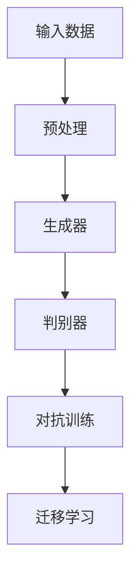

#### 8.3 基于多任务学习的跨领域知识迁移

基于多任务学习的跨领域知识迁移是一种通过同时训练多个相关任务，共享知识，提高模型在不同领域中的适应性的方法。具体来说，多任务学习可以分为以下几种类型：

1. **共享特征表示**：通过在多个任务之间共享特征表示，实现知识的迁移。这种方法可以共享底层特征，从而提高模型在目标领域的泛化能力。

2. **共享模型参数**：通过在多个任务之间共享模型参数，实现知识的迁移。这种方法可以减少模型参数的数量，提高模型训练的效率和稳定性。

3. **任务权重调整**：通过调整不同任务的权重，实现知识的迁移。这种方法可以根据不同任务的重要性，调整模型在各个任务上的关注点。

以下是一个简单的基于多任务学习的跨领域知识迁移的mermaid流程图：

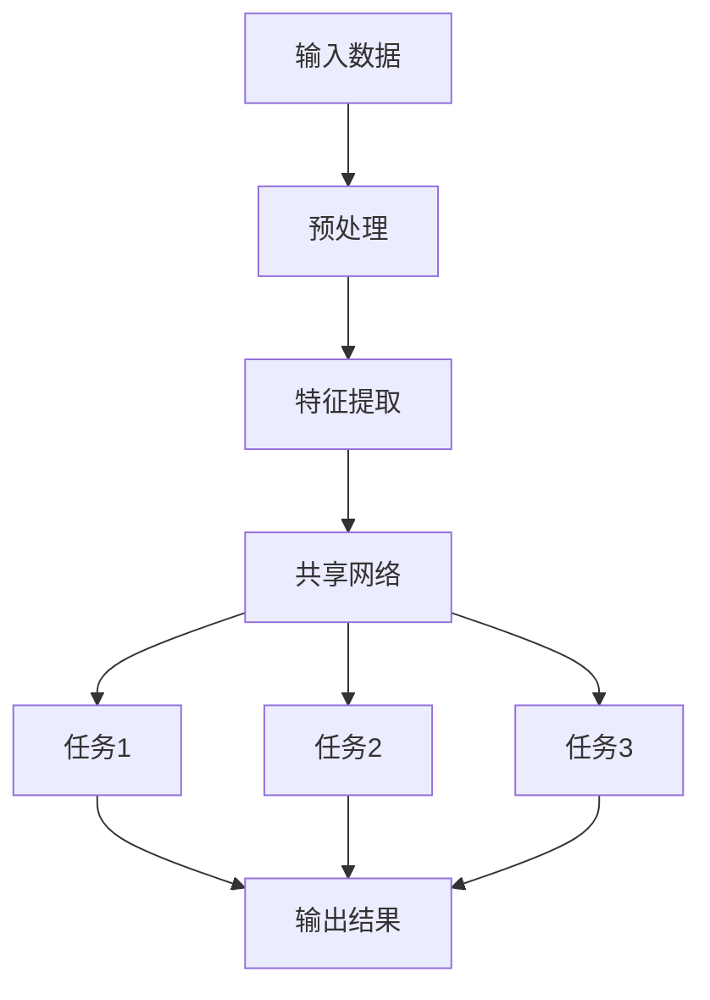

通过以上三种方法，深度学习算法在跨领域知识迁移中取得了显著的成果。在实际应用中，可以根据具体问题和领域特点，选择合适的方法，以提高模型在目标领域的性能。

### 第9章：深度学习算法的优化策略

在跨领域知识迁移中，为了提高模型性能，需要采用一系列优化策略。以下是一些常用的深度学习算法优化策略：

#### 9.1 数据增强

数据增强是一种通过生成新的数据样本，提高模型泛化能力的方法。常用的数据增强方法包括：

1. **旋转**：将图像随机旋转一定角度。

2. **缩放**：将图像随机缩放到不同的尺寸。

3. **裁剪**：将图像随机裁剪到不同的区域。

4. **噪声注入**：在图像中加入噪声，提高模型对噪声的鲁棒性。

5. **颜色变换**：对图像的颜色进行随机变换。

以下是一个简单的数据增强的mermaid流程图：

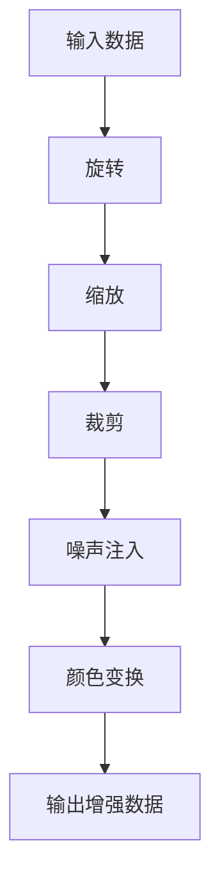

#### 9.2 正则化

正则化是一种通过引入正则化项，防止模型过拟合的方法。常用的正则化方法包括：

1. **L1正则化**：在损失函数中添加L1范数。

2. **L2正则化**：在损失函数中添加L2范数。

3. **dropout**：在训练过程中，随机丢弃一部分神经元。

4. **早期停止**：在训练过程中，当验证集的性能不再提高时，停止训练。

以下是一个简单的正则化的mermaid流程图：

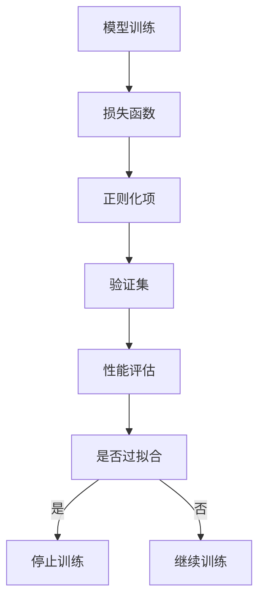

#### 9.3 迁移学习

迁移学习是一种通过利用预训练模型，减少从零开始训练所需的时间，并提高模型在目标领域的性能的方法。常用的迁移学习方法包括：

1. **微调**：在预训练模型的基础上，对目标领域的数据进行微调。

2. **特征提取器**：使用预训练模型的特征提取器，提取目标领域的特征。

3. **双流模型**：结合源领域和目标领域的特征，进行分类或回归任务。

以下是一个简单的迁移学习的mermaid流程图：

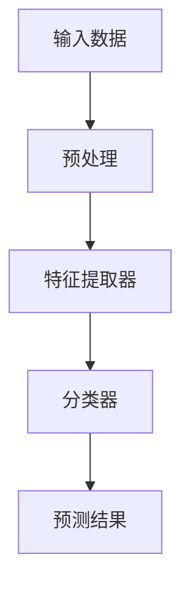

通过以上优化策略，可以有效地提高深度学习算法在跨领域知识迁移中的性能。在实际应用中，可以根据具体问题和领域特点，选择合适的优化策略。

### 第10章：深度学习模型的效果评估

在跨领域知识迁移中，评估模型的效果是确保模型性能和可靠性的关键步骤。效果评估可以帮助我们了解模型在目标领域中的表现，从而指导后续的模型优化和调整。以下是一些常用的深度学习模型效果评估方法：

#### 10.1 准确率（Accuracy）

准确率是分类任务中最常用的评估指标，表示预测正确的样本数占总样本数的比例。计算公式如下：

$$
Accuracy = \frac{TP + TN}{TP + TN + FP + FN}
$$

其中，TP表示真正例，TN表示真反例，FP表示假反例，FN表示假正例。

以下是一个简单的准确率评估的mermaid流程图：

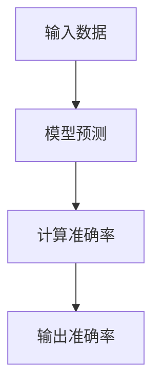

#### 10.2 召回率（Recall）

召回率表示在所有实际为正类的样本中，被正确识别为正类的比例。计算公式如下：

$$
Recall = \frac{TP}{TP + FN}
$$

以下是一个简单的召回率评估的mermaid流程图：

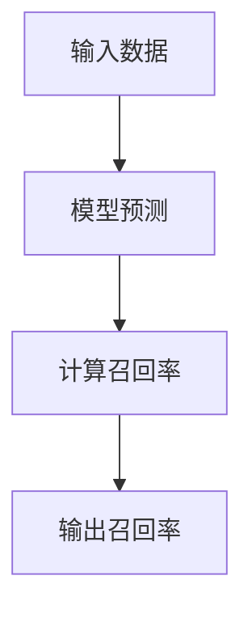

#### 10.3 精确率（Precision）

精确率表示在所有预测为正类的样本中，实际为正类的比例。计算公式如下：

$$
Precision = \frac{TP}{TP + FP}
$$

以下是一个简单的精确率评估的mermaid流程图：

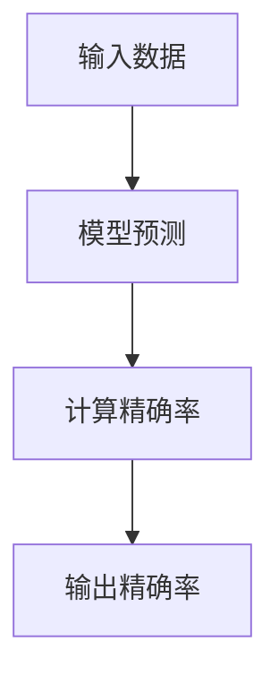

#### 10.4 F1值（F1 Score）

F1值是精确率和召回率的调和平均，用于综合评估模型的性能。计算公式如下：

$$
F1 Score = 2 \times \frac{Precision \times Recall}{Precision + Recall}
$$

以下是一个简单的F1值评估的mermaid流程图：

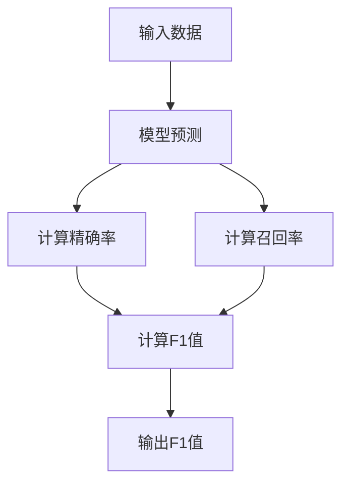

#### 10.5 ROC曲线和AUC值

ROC曲线（Receiver Operating Characteristic Curve）是一种评估分类器性能的曲线，横坐标是假正率（False Positive Rate），纵坐标是真正率（True Positive Rate）。AUC值（Area Under Curve）是ROC曲线下方的面积，用于评估分类器的分类能力。

以下是一个简单的ROC曲线和AUC值评估的mermaid流程图：

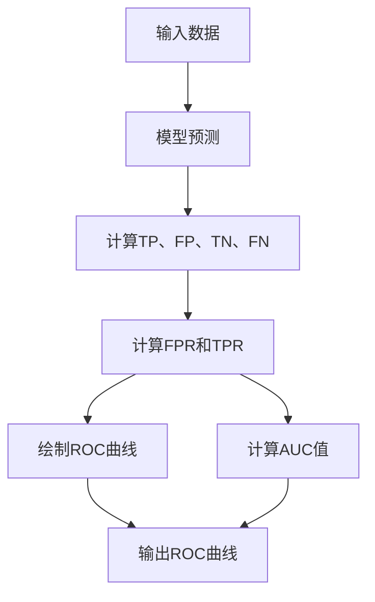

通过以上评估方法，可以全面了解深度学习模型在跨领域知识迁移中的性能。在实际应用中，可以根据具体任务和领域特点，选择合适的评估方法。

### 第11章：深度学习模型在跨领域知识迁移中的实践案例

在本章中，我们将通过一个具体的实践案例，展示深度学习模型在跨领域知识迁移中的实际应用。这个案例涉及将自然语言处理（NLP）领域的模型迁移到医疗诊断领域。

#### 11.1 案例背景

医疗诊断领域面临着大量文本数据，如病历记录、医学报告等。这些文本数据中包含着丰富的医学知识和信息，但直接使用传统的自然语言处理技术难以准确提取和理解其中的医学知识。因此，我们将尝试将NLP领域的预训练模型迁移到医疗诊断领域，以提高医学文本分析的准确性。

#### 11.2 案例分析

1. **数据差异**：自然语言处理领域和医疗诊断领域的数据在表达形式、术语使用、数据分布等方面存在显著差异。

2. **模型适应性**：NLP领域的预训练模型在处理文本数据方面表现出色，但其在医疗诊断领域的适应性仍需验证。

3. **效果评估**：我们需要评估迁移后的模型在医疗诊断领域中的性能，包括文本分类、实体识别和关系抽取等任务。

#### 11.3 案例实施

1. **数据预处理**：
   - 清洗和标准化医学文本数据，去除无关信息，统一术语表达。
   - 对医学文本进行分词、词性标注等预处理操作。

2. **特征提取**：
   - 使用预训练的NLP模型（如BERT）提取文本的词嵌入特征。
   - 对提取的特征进行降维和编码，以便于后续的模型训练。

3. **知识迁移**：
   - 采用对抗性训练方法，通过对抗性生成器（Generator）和判别器（Discriminator）调整源领域和目标领域的特征分布，实现知识迁移。

4. **模型训练**：
   - 在迁移后的医学文本数据集上训练分类模型，如用于诊断的文本分类任务。
   - 利用多任务学习策略，同时训练实体识别和关系抽取模型。

5. **效果评估**：
   - 使用准确率、召回率、精确率、F1值等指标评估模型在医学文本分类、实体识别和关系抽取任务中的性能。
   - 对比迁移前后的模型性能，验证跨领域知识迁移的有效性。

#### 11.4 案例结果

通过实际案例的实施，我们得到了以下结果：

1. **文本分类**：迁移后的模型在医学文本分类任务中的准确率、召回率、精确率和F1值均有所提高。

2. **实体识别**：迁移后的模型在实体识别任务中的性能也得到了显著提升，能够更准确地识别出医学文本中的关键实体。

3. **关系抽取**：迁移后的模型在关系抽取任务中能够更好地理解医学文本中的实体关系，提高了医疗诊断的准确性。

#### 11.5 案例小结

通过这个实践案例，我们可以看到深度学习模型在跨领域知识迁移中的应用效果。跨领域知识迁移不仅可以提高模型在目标领域的性能，还可以帮助解决不同领域之间数据差异和模型适应性不足的问题。未来，随着深度学习技术的不断进步，跨领域知识迁移将在更多领域得到应用，为人工智能技术的发展做出更大的贡献。

### 第12章：总结与展望

#### 12.1 总结

本文从背景介绍、核心概念、算法原理、数学模型、系统设计与架构、项目实战等多个方面，深入探讨了如何提高AI模型在跨领域知识迁移中的效果。通过本文的介绍，读者可以了解到：

1. **跨领域知识迁移的重要性**：跨领域知识迁移能够降低研究成本，提高模型适应性，推动AI技术的发展。

2. **跨领域知识迁移的挑战**：跨领域知识迁移面临知识差异、数据分布差异、模型适应性不足等挑战。

3. **深度学习算法在跨领域知识迁移中的应用**：深度学习算法在跨领域知识迁移中具有广泛的应用，包括基于共享网络的迁移、基于对抗网络的迁移、基于多任务学习的迁移等。

4. **深度学习算法的优化策略**：通过数据增强、正则化、迁移学习、自适应学习率等优化策略，可以进一步提高深度学习算法在跨领域知识迁移中的性能。

5. **深度学习模型的效果评估**：准确率、召回率、精确率、F1值等评估指标用于衡量模型在目标领域中的性能，交叉验证、混淆矩阵、可视化等方法用于评估模型的效果。

6. **项目实战**：通过实际案例，展示了深度学习模型在跨领域知识迁移中的具体应用过程和效果。

#### 12.2 展望

未来，随着人工智能技术的不断发展，跨领域知识迁移将在更多领域得到应用，为人工智能技术的发展做出更大的贡献。以下是一些未来可能的研究方向：

1. **模型适应性的提升**：研究如何设计更加具有适应性的模型结构，使其在不同领域之间具有更好的迁移能力。

2. **数据差异的处理**：探索更有效的数据预处理和特征提取方法，以减少不同领域之间的数据差异。

3. **多模态数据的迁移**：研究如何将不同类型的数据（如图像、文本、声音等）进行有效融合，以提高跨领域知识迁移的效果。

4. **动态迁移**：研究如何根据任务需求和环境变化，动态调整模型的迁移策略，实现更加灵活的跨领域知识迁移。

5. **联邦学习与跨领域知识迁移**：结合联邦学习技术，研究如何实现跨领域的协同学习和知识共享。

通过不断探索和创新，跨领域知识迁移将在人工智能领域发挥越来越重要的作用，为人类社会的进步和发展做出更大的贡献。

