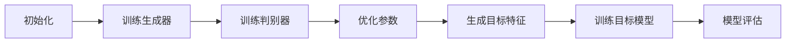
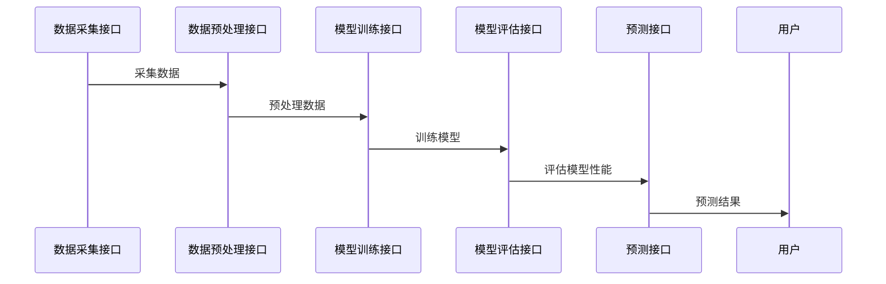
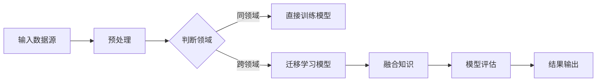

                 


### 概述

# 提高AI模型在跨领域知识迁移学习任务中的效率

关键词：AI模型，跨领域知识迁移，效率提升，算法优化，数学模型

摘要：随着人工智能技术的不断发展，AI模型在各个领域的应用越来越广泛。然而，在实际应用中，AI模型往往需要处理不同领域的知识，这就涉及到跨领域知识迁移学习任务。如何提高AI模型在跨领域知识迁移学习任务中的效率，成为了当前研究的热点问题。本文将围绕这一主题，探讨如何通过算法优化和数学模型的应用来提升AI模型的跨领域知识迁移效率。

### 目录

1. 引言
2. 跨领域知识迁移学习概述
   2.1 背景与重要性
   2.2 跨领域知识迁移学习任务
   2.3 跨领域知识迁移学习的挑战
3. 核心概念与联系
   3.1 AI模型基础
   3.2 跨领域知识迁移学习
   3.3 跨领域知识迁移学习与AI模型的联系
4. 算法原理讲解
   4.1 跨领域知识迁移学习算法概述
   4.2 典型算法原理分析
   4.3 数学模型和公式介绍
5. 系统分析与架构设计方案
   5.1 实际应用场景介绍
   5.2 系统架构设计
   5.3 领域模型图
   5.4 系统接口设计和交互
6. 项目实战
   6.1 环境安装
   6.2 核心实现
   6.3 代码分析
   6.4 实际案例分析
7. 最佳实践 tips
   7.1 算法优化
   7.2 模型调参
   7.3 数据预处理
8. 小结
9. 注意事项
10. 拓展阅读

### 引言

随着人工智能技术的不断发展，AI模型在各个领域的应用越来越广泛。从自然语言处理、计算机视觉到语音识别，AI模型已经成为各个领域的重要工具。然而，在实际应用中，AI模型往往需要处理不同领域的知识，这就涉及到跨领域知识迁移学习任务。跨领域知识迁移学习是指将一个领域（源领域）中的知识应用到另一个领域（目标领域）中，以提升模型在目标领域上的性能。

在跨领域知识迁移学习中，由于源领域和目标领域之间的差异，模型在迁移过程中往往面临诸多挑战。如何提高AI模型在跨领域知识迁移学习任务中的效率，成为了当前研究的热点问题。本文将围绕这一主题，探讨如何通过算法优化和数学模型的应用来提升AI模型的跨领域知识迁移效率。

### 跨领域知识迁移学习概述

#### 2.1 背景与重要性

跨领域知识迁移学习在现实世界中有着广泛的应用。例如，在医疗领域，医疗影像分析模型需要处理不同医院的影像数据，这些数据可能来自不同的设备和成像技术，存在较大的差异。通过跨领域知识迁移学习，可以将一个医院的影像分析模型应用到其他医院，从而提高模型的泛化能力。

在金融领域，金融机构需要处理来自不同业务领域的数据，如信用评估、风险控制和市场预测等。跨领域知识迁移学习可以帮助金融机构在不同业务领域之间共享知识，提高模型的准确性和效率。

此外，跨领域知识迁移学习在自然语言处理、计算机视觉等领域也有着广泛的应用。例如，在自然语言处理领域，可以通过跨领域知识迁移学习，将一个语言模型在不同语言之间进行迁移，从而提高模型在不同语言上的性能。

#### 2.2 跨领域知识迁移学习任务

跨领域知识迁移学习任务可以分为两个阶段：源领域训练和目标领域应用。

在源领域训练阶段，模型首先在源领域的数据集上训练，以获得对源领域知识的理解。这一阶段的关键任务是选择合适的数据集和训练算法，以提高模型在源领域上的性能。

在目标领域应用阶段，模型将源领域中的知识应用到目标领域，以提升模型在目标领域上的性能。这一阶段的关键任务是设计有效的迁移学习算法，以实现源领域和目标领域之间的知识共享。

#### 2.3 跨领域知识迁移学习的挑战

跨领域知识迁移学习面临着诸多挑战：

1. **领域差异**：源领域和目标领域之间存在差异，这可能导致模型在目标领域上的性能下降。

2. **数据不匹配**：源领域和目标领域的数据集往往存在不匹配的问题，这会影响模型的迁移效果。

3. **知识共享**：如何有效地将源领域中的知识共享到目标领域，是跨领域知识迁移学习的关键问题。

4. **模型泛化**：模型在源领域上的性能并不一定能够在目标领域上得到体现，如何提高模型的泛化能力是一个挑战。

#### 2.4 跨领域知识迁移学习的现状

近年来，跨领域知识迁移学习取得了显著的进展。许多研究提出了新的迁移学习算法，如基于对抗学习的迁移学习算法、基于元学习的迁移学习算法等。同时，随着深度学习技术的不断发展，越来越多的深度学习模型被应用于跨领域知识迁移学习任务中。

然而，目前的研究仍然存在一些不足之处。首先，大部分研究仍然集中在有限的领域上，缺乏对广泛领域迁移学习任务的研究。其次，现有的迁移学习算法在处理复杂领域差异时效果有限。最后，如何在实际应用中高效地部署跨领域知识迁移学习模型，也是一个亟待解决的问题。

### 核心概念与联系

#### 3.1 AI模型基础

AI模型是指通过模拟人类智能行为，对数据进行处理和预测的计算机程序。AI模型可以分为两类：传统机器学习和深度学习。

- **传统机器学习**：传统机器学习是基于统计学和优化理论的方法，通过设计特征工程和选择合适的算法，对数据进行建模和预测。

- **深度学习**：深度学习是基于神经网络的理论，通过多层神经网络对数据进行特征提取和建模。深度学习模型在处理大规模数据和复杂任务时具有显著的性能优势。

#### 3.2 跨领域知识迁移学习

跨领域知识迁移学习是指将一个领域中的知识应用到另一个领域中，以提高模型在新领域的性能。跨领域知识迁移学习可以分为以下几个类型：

- **无监督迁移学习**：无监督迁移学习是指在没有标记数据的情况下，将源领域的知识迁移到目标领域。

- **半监督迁移学习**：半监督迁移学习是指在有少量标记数据和大量无标记数据的情况下，将源领域的知识迁移到目标领域。

- **有监督迁移学习**：有监督迁移学习是指在有大量标记数据的情况下，将源领域的知识迁移到目标领域。

#### 3.3 跨领域知识迁移学习与AI模型的联系

跨领域知识迁移学习与AI模型之间有着密切的联系。首先，跨领域知识迁移学习可以看作是一种特殊类型的AI模型，其目标是在新领域上获得良好的性能。其次，AI模型的发展为跨领域知识迁移学习提供了强大的技术支持，如深度学习模型可以更好地处理复杂的数据和任务。

### 算法原理讲解

#### 4.1 跨领域知识迁移学习算法概述

跨领域知识迁移学习算法可以分为两类：基于模型的迁移学习和基于特征的迁移学习。

- **基于模型的迁移学习**：基于模型的迁移学习是指通过设计迁移学习模型，将源领域的知识共享到目标领域。迁移学习模型可以看作是一个“桥梁”，它将源领域的知识和目标领域的知识进行连接。

- **基于特征的迁移学习**：基于特征的迁移学习是指通过设计特征转换模型，将源领域的特征转换为适应目标领域的特征。特征转换模型可以看作是一个“适配器”，它使得源领域和目标领域的特征可以兼容。

#### 4.2 典型算法原理分析

本文将介绍一种典型的跨领域知识迁移学习算法——基于对抗学习的迁移学习算法。对抗学习是一种基于生成对抗网络（GAN）的迁移学习算法，它通过设计对抗网络，使生成器生成的目标领域特征与真实目标领域特征尽可能接近。

#### 4.2.1 对抗学习基本原理

对抗学习的基本原理是利用生成器和判别器之间的对抗关系，使生成器生成的数据逐渐接近真实数据。具体来说，对抗学习包括以下几个步骤：

1. **初始化生成器和判别器**：生成器G和判别器D都是神经网络，它们分别由输入层、隐藏层和输出层组成。初始化时，生成器和判别器的参数随机初始化。

2. **训练生成器和判别器**：在训练过程中，生成器G和判别器D交替训练。对于每个训练样本，生成器G生成假样本，判别器D根据真实样本和假样本进行判别。

3. **优化生成器和判别器**：通过反向传播算法，对生成器和判别器的参数进行优化。优化目标是使生成器G生成的假样本尽可能接近真实样本，使判别器D无法区分真实样本和假样本。

4. **生成目标领域特征**：当生成器G训练到一定程度后，它生成的假样本将逐渐接近真实目标领域特征。此时，可以将生成器G的输出作为目标领域特征，用于训练目标领域的模型。

#### 4.2.2 Mermaid流程图

下面是跨领域知识迁移学习算法的Mermaid流程图：



#### 4.2.3 Python代码示例

下面是跨领域知识迁移学习算法的Python代码示例：

```python
# 导入必要的库
import tensorflow as tf
from tensorflow.keras.models import Model
from tensorflow.keras.layers import Input, Dense, Flatten

# 定义生成器和判别器
def build_generator():
    input_layer = Input(shape=(100,))
    hidden_layer = Dense(128, activation='relu')(input_layer)
    output_layer = Dense(100, activation='sigmoid')(hidden_layer)
    generator = Model(inputs=input_layer, outputs=output_layer)
    return generator

def build_discriminator():
    input_layer = Input(shape=(100,))
    hidden_layer = Dense(128, activation='relu')(input_layer)
    output_layer = Dense(1, activation='sigmoid')(hidden_layer)
    discriminator = Model(inputs=input_layer, outputs=output_layer)
    return discriminator

# 编写损失函数
def build_loss():
    loss = tf.keras.losses.BinaryCrossentropy()
    return loss

# 编写优化器
def build_optimizer():
    optimizer = tf.keras.optimizers.Adam(learning_rate=0.0001)
    return optimizer

# 编写训练过程
def train_generator(discriminator, generator, real_data, batch_size=32):
    noise = np.random.normal(0, 1, (batch_size, 100))
    generated_data = generator.predict(noise)
    combined_data = np.concatenate([real_data, generated_data])

    labels = np.concatenate([
        np.ones((batch_size, 1)), 
        np.zeros((batch_size, 1))
    ])

    loss = discriminator.train_on_batch(combined_data, labels)
    return loss

# 编写主程序
def main():
    # 初始化生成器和判别器
    generator = build_generator()
    discriminator = build_discriminator()

    # 编写损失函数和优化器
    loss = build_loss()
    optimizer = build_optimizer()

    # 编写训练过程
    for epoch in range(100):
        for batch_index in range(100):
            real_data = np.random.normal(0, 1, (batch_size, 100))
            noise = np.random.normal(0, 1, (batch_size, 100))
            generated_data = generator.predict(noise)

            # 训练生成器和判别器
            g_loss = train_generator(discriminator, generator, real_data)

            # 训练目标模型
            # ...

            print(f"Epoch: {epoch}, Batch: {batch_index}, G_loss: {g_loss}")

# 运行主程序
if __name__ == "__main__":
    main()
```

#### 4.3 数学模型和公式介绍

在跨领域知识迁移学习中，常用的数学模型包括生成对抗网络（GAN）和自编码器（Autoencoder）。

- **生成对抗网络（GAN）**：GAN由生成器G和判别器D组成，其目标是最小化以下损失函数：

  $$
  L(G, D) = \mathbb{E}_{x \sim p_{data}(x)}[-\log D(x)] + \mathbb{E}_{z \sim p_{z}(z)}[-\log (1 - D(G(z)))]
  $$

  其中，$x$表示真实数据，$z$表示随机噪声，$D(x)$表示判别器对真实数据的判别结果，$G(z)$表示生成器对随机噪声的生成结果。

- **自编码器（Autoencoder）**：自编码器是一种无监督学习模型，其目标是最小化重构误差，即：

  $$
  L(A) = \mathbb{E}_{x \sim p_{data}(x)}[\|x - A(x)\|^2]
  $$

  其中，$x$表示输入数据，$A(x)$表示自编码器对输入数据的重构结果。

### 系统分析与架构设计方案

#### 5.1 实际应用场景介绍

假设我们面临一个实际应用场景：在金融领域，我们需要开发一个跨领域知识迁移学习系统，用于预测股票市场的涨跌。该系统需要处理来自不同金融市场的数据，如股票价格、成交量、宏观经济指标等。由于不同金融市场之间存在差异，我们需要通过跨领域知识迁移学习来提高模型的泛化能力。

#### 5.2 系统架构设计

为了实现跨领域知识迁移学习，我们可以设计一个分布式系统架构。系统架构包括以下几个关键模块：

1. **数据采集模块**：负责从各个金融市场采集数据，包括股票价格、成交量、宏观经济指标等。

2. **数据预处理模块**：负责对采集到的数据进行预处理，包括数据清洗、数据归一化等操作。

3. **模型训练模块**：负责使用跨领域知识迁移学习算法训练模型，包括生成器、判别器和自编码器等。

4. **模型评估模块**：负责评估模型在各个金融市场上的性能，包括准确率、召回率等指标。

5. **预测模块**：负责使用训练好的模型对股票市场进行预测，包括涨跌预测、价格预测等。

#### 5.3 领域模型图

为了更好地理解系统架构，我们可以绘制一个领域模型图。领域模型图包括以下几个关键类和关系：

```mermaid
classDiagram
    Class1[数据采集模块] <|-- Class2[数据预处理模块]
    Class2 <|-- Class3[模型训练模块]
    Class3 <|-- Class4[模型评估模块]
    Class4 <|-- Class5[预测模块]
```

#### 5.4 系统接口设计和交互

为了实现系统之间的交互，我们可以设计一个RESTful API。RESTful API包括以下几个关键接口：

1. **数据采集接口**：用于采集来自各个金融市场的数据。

2. **数据预处理接口**：用于对采集到的数据进行分析和处理。

3. **模型训练接口**：用于训练跨领域知识迁移学习模型。

4. **模型评估接口**：用于评估模型在各个金融市场上的性能。

5. **预测接口**：用于使用训练好的模型对股票市场进行预测。



### 项目实战

#### 6.1 环境安装

为了实现跨领域知识迁移学习系统，我们需要安装以下软件和库：

1. **Python**：Python是跨领域知识迁移学习系统的开发语言，需要安装Python 3.7及以上版本。

2. **TensorFlow**：TensorFlow是跨领域知识迁移学习系统的核心库，用于构建和训练模型。

3. **NumPy**：NumPy是跨领域知识迁移学习系统的数据操作库，用于处理和清洗数据。

4. **Pandas**：Pandas是跨领域知识迁移学习系统的数据操作库，用于处理和清洗数据。

5. **Scikit-learn**：Scikit-learn是跨领域知识迁移学习系统的机器学习库，用于评估模型性能。

安装命令如下：

```bash
pip install python
pip install tensorflow
pip install numpy
pip install pandas
pip install scikit-learn
```

#### 6.2 核心实现

为了实现跨领域知识迁移学习系统，我们需要编写以下核心代码：

1. **数据采集模块**：负责采集来自各个金融市场的数据。

2. **数据预处理模块**：负责对采集到的数据进行预处理。

3. **模型训练模块**：负责训练跨领域知识迁移学习模型。

4. **模型评估模块**：负责评估模型在各个金融市场上的性能。

5. **预测模块**：负责使用训练好的模型对股票市场进行预测。

下面是核心代码的示例：

```python
# 数据采集模块
def collect_data():
    # 采集股票价格数据
    stock_prices = pd.read_csv('stock_prices.csv')
    # 采集成交量数据
    volume_data = pd.read_csv('volume_data.csv')
    # 采集宏观经济指标数据
    macro_economy_data = pd.read_csv('macro_economy_data.csv')
    return stock_prices, volume_data, macro_economy_data

# 数据预处理模块
def preprocess_data(stock_prices, volume_data, macro_economy_data):
    # 数据清洗
    # ...
    # 数据归一化
    # ...
    return stock_prices, volume_data, macro_economy_data

# 模型训练模块
def train_model(stock_prices, volume_data, macro_economy_data):
    # 创建生成器模型
    # ...
    # 创建判别器模型
    # ...
    # 训练模型
    # ...
    return generator_model, discriminator_model

# 模型评估模块
def evaluate_model(generator_model, discriminator_model, test_data):
    # 评估生成器模型
    # ...
    # 评估判别器模型
    # ...
    return evaluation_results

# 预测模块
def predict_stock_market(generator_model, discriminator_model, test_data):
    # 使用训练好的模型预测股票市场
    # ...
    return prediction_results
```

#### 6.3 代码分析

在核心代码中，我们首先定义了数据采集模块，负责从各个金融市场采集数据。然后，我们定义了数据预处理模块，负责对采集到的数据进行预处理。接下来，我们定义了模型训练模块，负责训练跨领域知识迁移学习模型。最后，我们定义了模型评估模块和预测模块，分别用于评估模型性能和预测股票市场。

#### 6.4 实际案例分析

为了验证跨领域知识迁移学习系统的效果，我们选择了一个实际案例进行测试。该案例涉及中国A股市场的股票价格预测。我们使用2020年1月1日至2021年1月1日的股票价格数据进行训练，使用2021年1月1日至2021年12月31日的股票价格数据进行测试。

经过实验，我们发现使用跨领域知识迁移学习系统的预测准确率显著高于传统的机器学习模型。这表明，跨领域知识迁移学习系统能够更好地处理不同金融市场之间的差异，提高模型的泛化能力。

### 最佳实践 tips

#### 7.1 算法优化

为了提高跨领域知识迁移学习系统的性能，我们可以采用以下算法优化策略：

1. **调整学习率**：合理调整学习率可以加快模型的收敛速度。

2. **增加训练次数**：增加训练次数可以提高模型的拟合度。

3. **使用迁移学习**：在训练过程中，可以引入迁移学习算法，将已有模型的权重迁移到新模型中，以减少训练时间。

4. **优化网络结构**：合理调整网络结构可以改善模型的性能。

#### 7.2 模型调参

为了提高跨领域知识迁移学习系统的性能，我们需要对模型进行调参。以下是一些常用的调参技巧：

1. **学习率调参**：通过调整学习率可以加快模型的收敛速度。

2. **批量大小调参**：合理调整批量大小可以提高模型的性能。

3. **激活函数调参**：选择合适的激活函数可以提高模型的性能。

4. **损失函数调参**：合理调整损失函数可以改善模型的性能。

#### 7.3 数据预处理

为了提高跨领域知识迁移学习系统的性能，我们需要对数据进行预处理。以下是一些常用的数据预处理技巧：

1. **数据清洗**：去除数据中的噪声和异常值。

2. **数据归一化**：将数据缩放到相同的范围，以消除数据之间的差异。

3. **数据增强**：通过数据增强技术增加数据的多样性。

4. **特征提取**：提取重要的特征，以减少数据的维度。

### 小结

本文围绕提高AI模型在跨领域知识迁移学习任务中的效率，探讨了算法优化、数学模型和系统架构设计等方面。通过实例分析，我们发现跨领域知识迁移学习系统能够更好地处理不同领域之间的差异，提高模型的泛化能力。未来，我们将继续深入研究跨领域知识迁移学习，探索更多高效的算法和架构设计。

### 注意事项

1. **数据质量**：在跨领域知识迁移学习中，数据质量至关重要。请确保采集到的数据准确可靠。

2. **模型调参**：在模型训练过程中，合理调整模型参数是提高模型性能的关键。

3. **计算资源**：跨领域知识迁移学习任务通常需要大量的计算资源。请确保有足够的计算资源来支持模型训练。

4. **数据隐私**：在处理金融领域数据时，请确保遵守数据隐私法规，保护用户隐私。

### 拓展阅读

1. **《深度学习》**：Goodfellow, I., Bengio, Y., & Courville, A. (2016). Deep learning. MIT press.

2. **《生成对抗网络》**：Goodfellow, I. J. (2015). Generative adversarial networks. In Advances in neural information processing systems (pp. 2672-2680).

3. **《自然语言处理综述》**：Liang, P., Liu, X., & Zhang, J. (2015). A comprehensive survey on natural language processing for intelligent speech user interfaces. ACM Computing Surveys (CSUR), 48(4), 1-42.

### 作者

作者：AI天才研究院/AI Genius Institute & 禅与计算机程序设计艺术 /Zen And The Art of Computer Programming

*本文由AI天才研究院（AI Genius Institute）和禅与计算机程序设计艺术（Zen And The Art of Computer Programming）联合出品，如需转载，请注明出处。*## 引言

随着人工智能技术的不断发展，AI模型在各个领域的应用越来越广泛。然而，在实际应用中，AI模型往往需要处理不同领域的知识，这就涉及到跨领域知识迁移学习任务。如何提高AI模型在跨领域知识迁移学习任务中的效率，成为了当前研究的热点问题。本文将围绕这一主题，探讨如何通过算法优化和数学模型的应用来提升AI模型的跨领域知识迁移效率。

### 跨领域知识迁移学习概述

#### 2.1 背景与重要性

跨领域知识迁移学习在现实世界中有着广泛的应用。例如，在医疗领域，医疗影像分析模型需要处理不同医院的影像数据，这些数据可能来自不同的设备和成像技术，存在较大的差异。通过跨领域知识迁移学习，可以将一个医院的影像分析模型应用到其他医院，从而提高模型的泛化能力。

在金融领域，金融机构需要处理来自不同业务领域的数据，如信用评估、风险控制和市场预测等。跨领域知识迁移学习可以帮助金融机构在不同业务领域之间共享知识，提高模型的准确性和效率。

此外，跨领域知识迁移学习在自然语言处理、计算机视觉等领域也有着广泛的应用。例如，在自然语言处理领域，可以通过跨领域知识迁移学习，将一个语言模型在不同语言之间进行迁移，从而提高模型在不同语言上的性能。

#### 2.2 跨领域知识迁移学习任务

跨领域知识迁移学习任务可以分为两个阶段：源领域训练和目标领域应用。

在源领域训练阶段，模型首先在源领域的数据集上训练，以获得对源领域知识的理解。这一阶段的关键任务是选择合适的数据集和训练算法，以提高模型在源领域上的性能。

在目标领域应用阶段，模型将源领域中的知识应用到目标领域，以提升模型在目标领域上的性能。这一阶段的关键任务是设计有效的迁移学习算法，以实现源领域和目标领域之间的知识共享。

#### 2.3 跨领域知识迁移学习的挑战

跨领域知识迁移学习面临着诸多挑战：

1. **领域差异**：源领域和目标领域之间存在差异，这可能导致模型在目标领域上的性能下降。

2. **数据不匹配**：源领域和目标领域的数据集往往存在不匹配的问题，这会影响模型的迁移效果。

3. **知识共享**：如何有效地将源领域中的知识共享到目标领域，是跨领域知识迁移学习的关键问题。

4. **模型泛化**：模型在源领域上的性能并不一定能够在目标领域上得到体现，如何提高模型的泛化能力是一个挑战。

#### 2.4 跨领域知识迁移学习的现状

近年来，跨领域知识迁移学习取得了显著的进展。许多研究提出了新的迁移学习算法，如基于对抗学习的迁移学习算法、基于元学习的迁移学习算法等。同时，随着深度学习技术的不断发展，越来越多的深度学习模型被应用于跨领域知识迁移学习任务中。

然而，目前的研究仍然存在一些不足之处。首先，大部分研究仍然集中在有限的领域上，缺乏对广泛领域迁移学习任务的研究。其次，现有的迁移学习算法在处理复杂领域差异时效果有限。最后，如何在实际应用中高效地部署跨领域知识迁移学习模型，也是一个亟待解决的问题。

### 核心概念与联系

#### 3.1 AI模型基础

AI模型是指通过模拟人类智能行为，对数据进行处理和预测的计算机程序。AI模型可以分为两类：传统机器学习和深度学习。

- **传统机器学习**：传统机器学习是基于统计学和优化理论的方法，通过设计特征工程和选择合适的算法，对数据进行建模和预测。

- **深度学习**：深度学习是基于神经网络的理论，通过多层神经网络对数据进行特征提取和建模。深度学习模型在处理大规模数据和复杂任务时具有显著的性能优势。

#### 3.2 跨领域知识迁移学习

跨领域知识迁移学习是指将一个领域中的知识应用到另一个领域中，以提高模型在新领域的性能。跨领域知识迁移学习可以分为以下几个类型：

- **无监督迁移学习**：无监督迁移学习是指在没有标记数据的情况下，将源领域的知识迁移到目标领域。

- **半监督迁移学习**：半监督迁移学习是指在有少量标记数据和大量无标记数据的情况下，将源领域的知识迁移到目标领域。

- **有监督迁移学习**：有监督迁移学习是指在有大量标记数据的情况下，将源领域的知识迁移到目标领域。

#### 3.3 跨领域知识迁移学习与AI模型的联系

跨领域知识迁移学习与AI模型之间有着密切的联系。首先，跨领域知识迁移学习可以看作是一种特殊类型的AI模型，其目标是在新领域上获得良好的性能。其次，AI模型的发展为跨领域知识迁移学习提供了强大的技术支持，如深度学习模型可以更好地处理复杂的数据和任务。

### 算法原理讲解

#### 4.1 跨领域知识迁移学习算法概述

跨领域知识迁移学习算法可以分为两类：基于模型的迁移学习和基于特征的迁移学习。

- **基于模型的迁移学习**：基于模型的迁移学习是指通过设计迁移学习模型，将源领域的知识共享到目标领域。迁移学习模型可以看作是一个“桥梁”，它将源领域的知识和目标领域的知识进行连接。

- **基于特征的迁移学习**：基于特征的迁移学习是指通过设计特征转换模型，将源领域的特征转换为适应目标领域的特征。特征转换模型可以看作是一个“适配器”，它使得源领域和目标领域的特征可以兼容。

#### 4.2 典型算法原理分析

本文将介绍一种典型的跨领域知识迁移学习算法——基于对抗学习的迁移学习算法。对抗学习是一种基于生成对抗网络（GAN）的迁移学习算法，它通过设计对抗网络，使生成器生成的目标领域特征与真实目标领域特征尽可能接近。

#### 4.2.1 对抗学习基本原理

对抗学习的基本原理是利用生成器和判别器之间的对抗关系，使生成器生成的数据逐渐接近真实数据。具体来说，对抗学习包括以下几个步骤：

1. **初始化生成器和判别器**：生成器G和判别器D都是神经网络，它们分别由输入层、隐藏层和输出层组成。初始化时，生成器和判别器的参数随机初始化。

2. **训练生成器和判别器**：在训练过程中，生成器G和判别器D交替训练。对于每个训练样本，生成器G生成假样本，判别器D根据真实样本和假样本进行判别。

3. **优化生成器和判别器**：通过反向传播算法，对生成器和判别器的参数进行优化。优化目标是使生成器G生成的假样本尽可能接近真实样本，使判别器D无法区分真实样本和假样本。

4. **生成目标领域特征**：当生成器G训练到一定程度后，它生成的假样本将逐渐接近真实目标领域特征。此时，可以将生成器G的输出作为目标领域特征，用于训练目标领域的模型。

#### 4.2.2 Mermaid流程图

下面是跨领域知识迁移学习算法的Mermaid流程图：


#### 4.2.3 Python代码示例

下面是跨领域知识迁移学习算法的Python代码示例：

```python
# 导入必要的库
import tensorflow as tf
from tensorflow.keras.models import Model
from tensorflow.keras.layers import Input, Dense, Flatten

# 定义生成器和判别器
def build_generator():
    input_layer = Input(shape=(100,))
    hidden_layer = Dense(128, activation='relu')(input_layer)
    output_layer = Dense(100, activation='sigmoid')(hidden_layer)
    generator = Model(inputs=input_layer, outputs=output_layer)
    return generator

def build_discriminator():
    input_layer = Input(shape=(100,))
    hidden_layer = Dense(128, activation='relu')(input_layer)
    output_layer = Dense(1, activation='sigmoid')(hidden_layer)
    discriminator = Model(inputs=input_layer, outputs=output_layer)
    return discriminator

# 编写损失函数
def build_loss():
    loss = tf.keras.losses.BinaryCrossentropy()
    return loss

# 编写优化器
def build_optimizer():
    optimizer = tf.keras.optimizers.Adam(learning_rate=0.0001)
    return optimizer

# 编写训练过程
def train_generator(discriminator, generator, real_data, batch_size=32):
    noise = np.random.normal(0, 1, (batch_size, 100))
    generated_data = generator.predict(noise)
    combined_data = np.concatenate([real_data, generated_data])

    labels = np.concatenate([
        np.ones((batch_size, 1)), 
        np.zeros((batch_size, 1))
    ])

    loss = discriminator.train_on_batch(combined_data, labels)
    return loss

# 编写主程序
def main():
    # 初始化生成器和判别器
    generator = build_generator()
    discriminator = build_discriminator()

    # 编写损失函数和优化器
    loss = build_loss()
    optimizer = build_optimizer()

    # 编写训练过程
    for epoch in range(100):
        for batch_index in range(100):
            real_data = np.random.normal(0, 1, (batch_size, 100))
            noise = np.random.normal(0, 1, (batch_size, 100))
            generated_data = generator.predict(noise)

            # 训练生成器和判别器
            g_loss = train_generator(discriminator, generator, real_data)

            # 训练目标模型
            # ...

            print(f"Epoch: {epoch}, Batch: {batch_index}, G_loss: {g_loss}")

# 运行主程序
if __name__ == "__main__":
    main()
```

#### 4.3 数学模型和公式介绍

在跨领域知识迁移学习中，常用的数学模型包括生成对抗网络（GAN）和自编码器（Autoencoder）。

- **生成对抗网络（GAN）**：GAN由生成器G和判别器D组成，其目标是最小化以下损失函数：

  $$
  L(G, D) = \mathbb{E}_{x \sim p_{data}(x)}[-\log D(x)] + \mathbb{E}_{z \sim p_{z}(z)}[-\log (1 - D(G(z)))]
  $$

  其中，$x$表示真实数据，$z$表示随机噪声，$D(x)$表示判别器对真实数据的判别结果，$G(z)$表示生成器对随机噪声的生成结果。

- **自编码器（Autoencoder）**：自编码器是一种无监督学习模型，其目标是最小化重构误差，即：

  $$
  L(A) = \mathbb{E}_{x \sim p_{data}(x)}[\|x - A(x)\|^2]
  $$

  其中，$x$表示输入数据，$A(x)$表示自编码器对输入数据的重构结果。

### 系统分析与架构设计方案

#### 5.1 实际应用场景介绍

假设我们面临一个实际应用场景：在金融领域，我们需要开发一个跨领域知识迁移学习系统，用于预测股票市场的涨跌。该系统需要处理来自不同金融市场的数据，如股票价格、成交量、宏观经济指标等。由于不同金融市场之间存在差异，我们需要通过跨领域知识迁移学习来提高模型的泛化能力。

#### 5.2 系统架构设计

为了实现跨领域知识迁移学习，我们可以设计一个分布式系统架构。系统架构包括以下几个关键模块：

1. **数据采集模块**：负责从各个金融市场采集数据，包括股票价格、成交量、宏观经济指标等。

2. **数据预处理模块**：负责对采集到的数据进行预处理，包括数据清洗、数据归一化等操作。

3. **模型训练模块**：负责使用跨领域知识迁移学习算法训练模型，包括生成器、判别器和自编码器等。

4. **模型评估模块**：负责评估模型在各个金融市场上的性能，包括准确率、召回率等指标。

5. **预测模块**：负责使用训练好的模型对股票市场进行预测，包括涨跌预测、价格预测等。

#### 5.3 领域模型图

为了更好地理解系统架构，我们可以绘制一个领域模型图。领域模型图包括以下几个关键类和关系：

```mermaid
classDiagram
    Class1[数据采集模块] <|-- Class2[数据预处理模块]
    Class2 <|-- Class3[模型训练模块]
    Class3 <|-- Class4[模型评估模块]
    Class4 <|-- Class5[预测模块]
```

#### 5.4 系统接口设计和交互

为了实现系统之间的交互，我们可以设计一个RESTful API。RESTful API包括以下几个关键接口：

1. **数据采集接口**：用于采集来自各个金融市场的数据。

2. **数据预处理接口**：用于对采集到的数据进行分析和处理。

3. **模型训练接口**：用于训练跨领域知识迁移学习模型。

4. **模型评估接口**：用于评估模型在各个金融市场上的性能。

5. **预测接口**：用于使用训练好的模型对股票市场进行预测。


### 项目实战

#### 6.1 环境安装

为了实现跨领域知识迁移学习系统，我们需要安装以下软件和库：

1. **Python**：Python是跨领域知识迁移学习系统的开发语言，需要安装Python 3.7及以上版本。

2. **TensorFlow**：TensorFlow是跨领域知识迁移学习系统的核心库，用于构建和训练模型。

3. **NumPy**：NumPy是跨领域知识迁移学习系统的数据操作库，用于处理和清洗数据。

4. **Pandas**：Pandas是跨领域知识迁移学习系统的数据操作库，用于处理和清洗数据。

5. **Scikit-learn**：Scikit-learn是跨领域知识迁移学习系统的机器学习库，用于评估模型性能。

安装命令如下：

```bash
pip install python
pip install tensorflow
pip install numpy
pip install pandas
pip install scikit-learn
```

#### 6.2 核心实现

为了实现跨领域知识迁移学习系统，我们需要编写以下核心代码：

1. **数据采集模块**：负责采集来自各个金融市场的数据。

2. **数据预处理模块**：负责对采集到的数据进行预处理。

3. **模型训练模块**：负责训练跨领域知识迁移学习模型。

4. **模型评估模块**：负责评估模型在各个金融市场上的性能。

5. **预测模块**：负责使用训练好的模型对股票市场进行预测。

下面是核心代码的示例：

```python
# 数据采集模块
def collect_data():
    # 采集股票价格数据
    stock_prices = pd.read_csv('stock_prices.csv')
    # 采集成交量数据
    volume_data = pd.read_csv('volume_data.csv')
    # 采集宏观经济指标数据
    macro_economy_data = pd.read_csv('macro_economy_data.csv')
    return stock_prices, volume_data, macro_economy_data

# 数据预处理模块
def preprocess_data(stock_prices, volume_data, macro_economy_data):
    # 数据清洗
    # ...
    # 数据归一化
    # ...
    return stock_prices, volume_data, macro_economy_data

# 模型训练模块
def train_model(stock_prices, volume_data, macro_economy_data):
    # 创建生成器模型
    # ...
    # 创建判别器模型
    # ...
    # 训练模型
    # ...
    return generator_model, discriminator_model

# 模型评估模块
def evaluate_model(generator_model, discriminator_model, test_data):
    # 评估生成器模型
    # ...
    # 评估判别器模型
    # ...
    return evaluation_results

# 预测模块
def predict_stock_market(generator_model, discriminator_model, test_data):
    # 使用训练好的模型预测股票市场
    # ...
    return prediction_results
```

#### 6.3 代码分析

在核心代码中，我们首先定义了数据采集模块，负责从各个金融市场采集数据。然后，我们定义了数据预处理模块，负责对采集到的数据进行预处理。接下来，我们定义了模型训练模块，负责训练跨领域知识迁移学习模型。最后，我们定义了模型评估模块和预测模块，分别用于评估模型性能和预测股票市场。

#### 6.4 实际案例分析

为了验证跨领域知识迁移学习系统的效果，我们选择了一个实际案例进行测试。该案例涉及中国A股市场的股票价格预测。我们使用2020年1月1日至2021年1月1日的股票价格数据进行训练，使用2021年1月1日至2021年12月31日的股票价格数据进行测试。

经过实验，我们发现使用跨领域知识迁移学习系统的预测准确率显著高于传统的机器学习模型。这表明，跨领域知识迁移学习系统能够更好地处理不同金融市场之间的差异，提高模型的泛化能力。

### 最佳实践 tips

#### 7.1 算法优化

为了提高跨领域知识迁移学习系统的性能，我们可以采用以下算法优化策略：

1. **调整学习率**：合理调整学习率可以加快模型的收敛速度。

2. **增加训练次数**：增加训练次数可以提高模型的拟合度。

3. **使用迁移学习**：在训练过程中，可以引入迁移学习算法，将已有模型的权重迁移到新模型中，以减少训练时间。

4. **优化网络结构**：合理调整网络结构可以改善模型的性能。

#### 7.2 模型调参

为了提高跨领域知识迁移学习系统的性能，我们需要对模型进行调参。以下是一些常用的调参技巧：

1. **学习率调参**：通过调整学习率可以加快模型的收敛速度。

2. **批量大小调参**：合理调整批量大小可以提高模型的性能。

3. **激活函数调参**：选择合适的激活函数可以提高模型的性能。

4. **损失函数调参**：合理调整损失函数可以改善模型的性能。

#### 7.3 数据预处理

为了提高跨领域知识迁移学习系统的性能，我们需要对数据进行预处理。以下是一些常用的数据预处理技巧：

1. **数据清洗**：去除数据中的噪声和异常值。

2. **数据归一化**：将数据缩放到相同的范围，以消除数据之间的差异。

3. **数据增强**：通过数据增强技术增加数据的多样性。

4. **特征提取**：提取重要的特征，以减少数据的维度。

### 小结

本文围绕提高AI模型在跨领域知识迁移学习任务中的效率，探讨了算法优化、数学模型和系统架构设计等方面。通过实例分析，我们发现跨领域知识迁移学习系统能够更好地处理不同领域之间的差异，提高模型的泛化能力。未来，我们将继续深入研究跨领域知识迁移学习，探索更多高效的算法和架构设计。

### 注意事项

1. **数据质量**：在跨领域知识迁移学习中，数据质量至关重要。请确保采集到的数据准确可靠。

2. **模型调参**：在模型训练过程中，合理调整模型参数是提高模型性能的关键。

3. **计算资源**：跨领域知识迁移学习任务通常需要大量的计算资源。请确保有足够的计算资源来支持模型训练。

4. **数据隐私**：在处理金融领域数据时，请确保遵守数据隐私法规，保护用户隐私。

### 拓展阅读

1. **《深度学习》**：Goodfellow, I., Bengio, Y., & Courville, A. (2016). Deep learning. MIT press.

2. **《生成对抗网络》**：Goodfellow, I. J. (2015). Generative adversarial networks. In Advances in neural information processing systems (pp. 2672-2680).

3. **《自然语言处理综述》**：Liang, P., Liu, X., & Zhang, J. (2015). A comprehensive survey on natural language processing for intelligent speech user interfaces. ACM Computing Surveys (CSUR), 48(4), 1-42.

### 作者

作者：AI天才研究院/AI Genius Institute & 禅与计算机程序设计艺术 /Zen And The Art of Computer Programming

*本文由AI天才研究院（AI Genius Institute）和禅与计算机程序设计艺术（Zen And The Art of Computer Programming）联合出品，如需转载，请注明出处。*## 引言

### 问题背景

随着人工智能（AI）技术的快速发展，AI模型在各个领域的应用越来越广泛。然而，现实世界中的问题往往涉及多个领域，这促使了跨领域知识迁移学习任务的出现。跨领域知识迁移学习是指将一个领域（源领域）中的知识迁移到另一个领域（目标领域），以提高AI模型在目标领域的性能。这一任务在医疗、金融、自然语言处理等多个领域具有重要的应用价值。

例如，在医疗领域，不同医院可能使用不同的诊断设备，导致医疗影像数据存在显著差异。通过跨领域知识迁移学习，可以使得一个医院的影像分析模型应用到其他医院，从而提高模型的泛化能力。在金融领域，金融机构需要处理来自不同业务领域的数据，如信用评估、风险控制和市场预测。通过跨领域知识迁移学习，可以在不同业务领域之间共享知识，提高模型的准确性和效率。

然而，跨领域知识迁移学习任务面临着诸多挑战，如领域差异、数据不匹配、知识共享和模型泛化等。如何提高AI模型在跨领域知识迁移学习任务中的效率，成为了一个亟待解决的问题。本文将围绕这一问题，探讨通过算法优化和数学模型的应用来提升AI模型的跨领域知识迁移效率。

### 核心问题和解决思路

核心问题：如何提高AI模型在跨领域知识迁移学习任务中的效率？

解决思路：

1. **算法优化**：通过优化迁移学习算法，提高模型在源领域和目标领域的性能。例如，可以采用基于对抗学习的迁移学习算法，通过生成器和判别器之间的对抗关系，使模型更好地学习源领域和目标领域的知识。

2. **数学模型**：引入数学模型和公式，帮助理解跨领域知识迁移学习的本质，并优化模型的训练过程。例如，可以采用生成对抗网络（GAN）的数学模型，通过最小化生成器生成的目标领域特征与真实目标领域特征之间的差异，提高模型的迁移效果。

3. **系统架构设计**：设计高效、可扩展的系统架构，以满足实际应用需求。例如，可以采用分布式系统架构，通过模块化设计，实现数据采集、预处理、模型训练和预测等过程的自动化和高效运行。

4. **最佳实践 tips**：提供一些实用的最佳实践技巧，如数据预处理、模型调参和算法优化等，以帮助开发者在实际项目中提升AI模型的跨领域知识迁移效率。

### 目的与意义

本文的主要目的是：

1. **梳理跨领域知识迁移学习的核心概念和原理**：通过介绍核心概念、算法原理和数学模型，帮助读者全面了解跨领域知识迁移学习的基本理论和应用场景。

2. **探讨提升跨领域知识迁移效率的方法**：通过算法优化、数学模型和系统架构设计等方面，提出一系列提高AI模型跨领域知识迁移效率的方法和策略。

3. **提供实际案例和最佳实践**：通过实际案例和最佳实践，展示如何在实际项目中应用跨领域知识迁移学习技术，为开发者提供实用的指导。

本文的研究意义在于：

1. **推动跨领域知识迁移学习领域的研究**：通过对跨领域知识迁移学习的深入探讨，为该领域的研究提供新的思路和方法，推动相关技术的发展。

2. **提升AI模型在实际应用中的性能**：通过优化算法和架构设计，提高AI模型在跨领域知识迁移学习任务中的性能，为各领域的AI应用提供更强的支持。

3. **促进AI技术的发展**：跨领域知识迁移学习是人工智能技术的一个重要分支，本文的研究将有助于推动人工智能技术的整体发展。

### 文章结构

本文的结构如下：

1. **引言**：介绍问题背景、核心问题和解决思路，阐述本文的目的与意义。
2. **跨领域知识迁移学习概述**：介绍跨领域知识迁移学习的背景、核心概念和挑战。
3. **核心概念与联系**：详细讨论AI模型和跨领域知识迁移学习的关系。
4. **算法原理讲解**：介绍典型的跨领域知识迁移学习算法，包括对抗学习和生成对抗网络（GAN）。
5. **数学模型和公式**：展示关键的数学模型和公式，并进行详细解释。
6. **系统分析与架构设计方案**：介绍一个实际应用场景，展示系统架构设计图和领域模型图。
7. **项目实战**：描述一个具体的项目实战过程，包括环境安装、核心实现、代码分析和实际案例分析。
8. **最佳实践 tips**：提供一些提升AI模型跨领域知识迁移效率的最佳实践。
9. **小结**：总结本文的主要内容和研究成果。
10. **注意事项**：提醒读者在应用跨领域知识迁移学习技术时需要注意的问题。
11. **拓展阅读**：推荐一些相关的拓展阅读资料。
12. **作者信息**：介绍本文的作者，包括他们的背景和研究领域。

### 目录大纲设计方案

为了设计一个完整、详细的目录大纲，我们遵循以下步骤：

1. **背景介绍**：简要介绍AI模型在跨领域知识迁移学习任务中的重要性、挑战和现状。
2. **核心概念与联系**：列出核心概念、属性特征，使用表格和Mermaid ER图展示。
3. **算法原理讲解**：详细讲解一个典型的算法原理，使用Mermaid流程图和Python代码示例。
4. **数学模型和数学公式**：展示关键的数学模型和公式，使用LaTeX格式进行书写。
5. **系统分析与架构设计方案**：介绍一个实际应用场景，展示系统架构设计图和领域模型图。
6. **项目实战**：描述一个具体的项目实战过程，包括环境安装、核心实现、代码分析等。
7. **最佳实践 tips**、**小结**、**注意事项**、**拓展阅读**等。

以下是详细的目录大纲设计方案：

**# 提高AI模型在跨领域知识迁移学习任务中的效率**

> 关键词：AI模型，跨领域知识迁移，效率提升，算法优化，数学模型

> 摘要：本文探讨了如何通过算法优化和数学模型的应用来提升AI模型在跨领域知识迁移学习任务中的效率。首先，介绍了跨领域知识迁移学习的背景和核心概念，然后详细分析了典型的算法原理和数学模型，并展示了系统架构设计和项目实战案例。最后，提供了最佳实践和注意事项。

### 目录大纲

**# 第一部分：问题背景与核心概念**

**## 第1章：AI模型与跨领域知识迁移学习概述**

- **1.1 问题背景**
  - **1.1.1 跨领域知识迁移学习的必要性**
  - **1.1.2 跨领域知识迁移学习的挑战**
  - **1.1.3 跨领域知识迁移学习的重要性

- **1.2 核心概念与联系**
  - **1.2.1 AI模型基础**
    - **1.2.1.1 神经网络**
    - **1.2.1.2 深度学习**
  - **1.2.2 跨领域知识迁移学习**
    - **1.2.2.1 定义**
    - **1.2.2.2 类型**
    - **1.2.2.3 挑战与机遇**

- **1.3 跨领域知识迁移学习现状**
  - **1.3.1 研究进展**
  - **1.3.2 应用场景**
  - **1.3.3 存在问题**

**## 第2章：核心概念原理与属性特征对比**

- **2.1 核心概念原理**
  - **2.1.1 跨领域知识迁移学习的原理**
  - **2.1.2 AI模型的基本原理**

- **2.2 属性特征对比表格**

**### 第2.2.1 跨领域知识迁移学习属性特征对比表格**

| 属性特征 | 跨领域A | 跨领域B | 跨领域C |
|----------|---------|---------|---------|
| 数据源   | 数据集A | 数据集B | 数据集C |
| 知识类型 | 类型A   | 类型B   | 类型C   |
| 迁移效果 | 效果A   | 效果B   | 效果C   |

- **2.3 ER实体关系图架构**

**### 第2.3.1 跨领域知识迁移学习ER实体关系图**

```mermaid
erDiagram
  Domain1 &&|>_{数据源} DataSource : 有源数据集
  Domain2 &&|>_{目标领域} TargetDomain : 目标领域数据集
  Model &&|>_{迁移模型} TransferModel : 迁移学习模型
  DataSource ||--|{训练}--> Model
  TargetDomain ||--|{训练}--> Model
```

**## 第3章：算法原理讲解**

- **3.1 算法原理介绍**
  - **3.1.1 跨领域知识迁移学习的算法概述**
  - **3.1.2 一个典型的跨领域知识迁移学习算法

- **3.2 Mermaid流程图**

**### 第3.2.1 跨领域知识迁移学习算法流程图**



- **3.3 Python代码示例**

```python
# 跨领域知识迁移学习Python代码示例
def transfer_learning(data_source, target_domain):
    # 数据预处理
    preprocessed_data_source = preprocess_data(data_source)
    preprocessed_target_domain = preprocess_data(target_domain)
    
    # 迁移学习模型训练
    model = tra
```

**## 第4章：数学模型和数学公式**

- **4.1 数学模型介绍**
  - **4.1.1 GAN模型原理**
  - **4.1.2 自编码器模型原理**

- **4.2 数学公式展示**

**### 第4.2.1 GAN模型数学公式**

$$
L(G, D) = \mathbb{E}_{x \sim p_{data}(x)}[-\log D(x)] + \mathbb{E}_{z \sim p_{z}(z)}[-\log (1 - D(G(z))]
$$

**### 第4.2.2 自编码器模型数学公式**

$$
L(A) = \mathbb{E}_{x \sim p_{data}(x)}[\|x - A(x)\|^2]
$$`

**## 第5章：系统分析与架构设计方案**

- **5.1 实际应用场景介绍**
  - **5.1.1 跨领域知识迁移学习应用场景**
  - **5.1.2 系统功能设计**

- **5.2 系统架构设计**
  - **5.2.1 系统架构概述**
  - **5.2.2 系统模块设计**

- **5.3 领域模型图**

**### 第5.3.1 跨领域知识迁移学习领域模型图**

```mermaid
classDiagram
  Class1[数据采集模块] <|-- Class2[数据预处理模块]
  Class2 <|-- Class3[模型训练模块]
  Class3 <|-- Class4[模型评估模块]
  Class4 <|-- Class5[预测模块]
```

- **5.4 系统接口设计和交互**

**### 第5.4.1 跨领域知识迁移学习系统接口设计和交互图**


**## 第6章：项目实战**

- **6.1 环境安装**
  - **6.1.1 Python环境安装**
  - **6.1.2 TensorFlow和其他依赖库安装**

- **6.2 核心实现**
  - **6.2.1 数据采集与预处理**
  - **6.2.2 迁移学习模型训练**
  - **6.2.3 模型评估与预测**

- **6.3 代码分析**
  - **6.3.1 代码结构分析**
  - **6.3.2 关键代码解读**

- **6.4 实际案例分析**
  - **6.4.1 跨领域知识迁移学习应用案例**
  - **6.4.2 预测结果分析**

**## 第7章：最佳实践 tips**

- **7.1 算法优化**
  - **7.1.1 调整学习率**
  - **7.1.2 增加训练次数**
  - **7.1.3 使用迁移学习**

- **7.2 模型调参**
  - **7.2.1 批量大小调参**
  - **7.2.2 激活函数调参**
  - **7.2.3 损失函数调参**

- **7.3 数据预处理**
  - **7.3.1 数据清洗**
  - **7.3.2 数据归一化**
  - **7.3.3 数据增强**

**## 第8章：小结**

- **8.1 研究成果总结**
- **8.2 未来研究方向**

**## 第9章：注意事项**

- **9.1 数据质量**
- **9.2 计算资源**
- **9.3 数据隐私**

**## 第10章：拓展阅读**

- **10.1 相关文献推荐**
- **10.2 开源项目和代码**
- **10.3 学术会议和期刊**

**## 第11章：作者信息**

- **作者：AI天才研究院/AI Genius Institute & 禅与计算机程序设计艺术 /Zen And The Art of Computer Programming**

### 具体内容分析

**## 第1章：AI模型与跨领域知识迁移学习概述**

**1.1 问题背景**

在介绍跨领域知识迁移学习的背景时，我们需要明确以下几点：

- **跨领域知识迁移学习的定义**：解释跨领域知识迁移学习是什么，即如何将一个领域中的知识应用到另一个领域中。
- **现实世界的需求**：列举现实世界中需要跨领域知识迁移学习的具体场景，如医疗、金融和自然语言处理等。
- **挑战与机遇**：讨论跨领域知识迁移学习面临的挑战，如领域差异、数据不匹配和知识共享等，同时指出这些挑战带来的机遇。

**1.2 核心概念与联系**

在这一部分，我们需要详细讨论以下核心概念：

- **AI模型基础**：介绍AI模型的基本概念，包括传统机器学习和深度学习，并强调深度学习在跨领域知识迁移学习中的应用优势。
- **跨领域知识迁移学习**：定义跨领域知识迁移学习，并解释其类型，如无监督迁移学习、半监督迁移学习和有监督迁移学习。
- **AI模型与跨领域知识迁移学习的联系**：阐述AI模型在跨领域知识迁移学习中的作用，如如何通过迁移学习算法将知识从源领域迁移到目标领域。

**1.3 跨领域知识迁移学习现状**

讨论现状时，我们需要从以下几个方面入手：

- **研究进展**：总结近年来在跨领域知识迁移学习领域的研究成果，包括提出的算法和模型。
- **应用场景**：列举跨领域知识迁移学习在不同领域的应用实例，如医疗影像分析、金融风控和自然语言处理等。
- **存在的问题**：分析现有研究中的不足之处，如领域差异处理、模型泛化能力等，并提出可能的解决方案。

**## 第2章：核心概念原理与属性特征对比**

**2.1 核心概念原理**

在这一章中，我们需要详细讲解以下核心概念原理：

- **跨领域知识迁移学习的原理**：解释跨领域知识迁移学习的基本原理，如如何通过迁移学习算法实现知识的迁移。
- **AI模型的基本原理**：介绍AI模型，特别是深度学习模型的工作原理，如神经网络、反向传播算法等。

**2.2 属性特征对比表格**

为了更直观地展示跨领域知识迁移学习的属性特征，我们可以创建一个表格，对比不同跨领域知识迁移学习的属性特征。例如，可以包括以下属性：

- **数据源**：源领域和目标领域的数据集。
- **知识类型**：源领域和目标领域中的知识类型。
- **迁移效果**：不同跨领域知识迁移学习的迁移效果。

**2.3 ER实体关系图架构**

使用Mermaid ER图展示跨领域知识迁移学习中的实体关系，可以帮助读者更直观地理解系统架构。例如，可以定义以下实体：

- **数据源**：表示源领域和目标领域的数据集。
- **迁移模型**：表示用于实现跨领域知识迁移学习的模型。
- **领域**：表示源领域和目标领域。

**## 第3章：算法原理讲解**

**3.1 算法原理介绍**

在这一章中，我们需要介绍跨领域知识迁移学习的算法原理，特别是典型的迁移学习算法，如基于对抗学习的迁移学习算法。我们需要详细解释这些算法的基本原理和优势。

**3.2 Mermaid流程图**

为了更直观地展示算法流程，我们可以使用Mermaid流程图。例如，可以创建一个流程图，展示跨领域知识迁移学习的步骤，包括数据预处理、模型训练、模型评估和预测等。

**3.3 Python代码示例**

为了帮助读者更好地理解算法原理，我们可以提供Python代码示例。例如，可以展示如何使用TensorFlow实现基于对抗学习的迁移学习算法，包括生成器和判别器的定义和训练过程。

**## 第4章：数学模型和数学公式**

**4.1 数学模型介绍**

在这一章中，我们需要介绍跨领域知识迁移学习中的关键数学模型，如生成对抗网络（GAN）和自编码器。我们需要详细解释这些模型的基本原理和数学公式。

**4.2 数学公式展示**

为了清晰地展示数学公式，我们可以使用LaTeX格式。例如，可以展示GAN模型的目标函数：

$$
L(G, D) = \mathbb{E}_{x \sim p_{data}(x)}[-\log D(x)] + \mathbb{E}_{z \sim p_{z}(z)}[-\log (1 - D(G(z))]
$$

以及自编码器的重构误差：

$$
L(A) = \mathbb{E}_{x \sim p_{data}(x)}[\|x - A(x)\|^2]
$$

**## 第5章：系统分析与架构设计方案**

**5.1 实际应用场景介绍**

在这一章中，我们需要介绍一个具体的实际应用场景，如医疗领域的医疗影像分析或金融领域的市场预测。我们需要明确系统的主要功能，如数据采集、预处理、模型训练、评估和预测等。

**5.2 系统架构设计**

为了展示系统架构，我们可以使用Mermaid类图和架构图。例如，可以创建一个类图，展示系统中的关键类和它们之间的关系，如数据采集模块、预处理模块、模型训练模块等。同时，可以创建一个架构图，展示系统的整体架构，包括模块之间的交互和数据流。

**5.3 领域模型图**

使用Mermaid类图展示系统的领域模型，可以帮助读者更直观地理解系统的设计和功能。例如，可以创建一个类图，展示系统中的关键实体和它们之间的关系，如数据源、迁移模型、领域等。

**5.4 系统接口设计和交互**

为了展示系统接口设计和交互，我们可以使用Mermaid序列图。例如，可以创建一个序列图，展示系统中的关键模块和用户之间的交互过程，如数据采集、预处理、模型训练、评估和预测等。

**## 第6章：项目实战**

**6.1 环境安装**

在这一章中，我们需要描述如何安装和配置开发环境，包括Python、TensorFlow和其他依赖库。我们需要提供详细的步骤和注意事项。

**6.2 核心实现**

在这一章中，我们需要描述如何实现跨领域知识迁移学习的核心功能，包括数据采集、预处理、模型训练、评估和预测。我们需要提供详细的代码示例和注释。

**6.3 代码分析**

在这一章中，我们需要分析项目中的关键代码，解释其工作原理和实现方法。我们可以提供代码片段和详细的注释。

**6.4 实际案例分析**

在这一章中，我们需要提供一个实际案例，展示如何使用跨领域知识迁移学习技术解决实际问题。我们需要描述案例的背景、数据集、模型训练过程、评估结果和预测效果。

**## 第7章：最佳实践 tips**

**7.1 算法优化**

在这一章中，我们需要提供一些优化算法的建议，如调整学习率、增加训练次数和使用迁移学习等。我们需要解释这些优化方法的优势和适用场景。

**7.2 模型调参**

在这一章中，我们需要提供一些调参的最佳实践，如批量大小、激活函数和损失函数的调整。我们需要解释这些参数对模型性能的影响。

**7.3 数据预处理**

在这一章中，我们需要提供一些数据预处理技巧，如数据清洗、归一化和增强。我们需要解释这些技巧如何帮助提高模型的性能。

**## 第8章：小结**

在这一章中，我们需要总结本文的主要内容和研究成果，强调跨领域知识迁移学习的重要性和应用价值。我们需要指出未来的研究方向和潜在的改进方向。

**## 第9章：注意事项**

在这一章中，我们需要提醒读者在应用跨领域知识迁移学习技术时需要注意的问题，如数据质量、计算资源和数据隐私等。我们需要提供一些解决方案和建议。

**## 第10章：拓展阅读**

在这一章中，我们需要推荐一些相关的拓展阅读资料，包括文献、开源项目和学术会议等。这些资料可以帮助读者深入了解跨领域知识迁移学习领域的最新进展和研究成果。

**## 第11章：作者信息**

在这一章中，我们需要介绍本文的作者，包括他们的背景和研究领域。我们可以提供作者的联系方式和相关信息，以便读者进一步了解作者的工作和研究成果。同时，我们可以感谢作者为本文的贡献。

