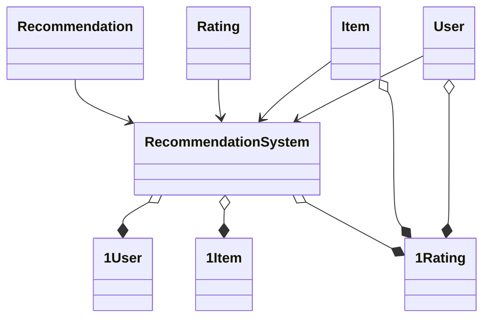
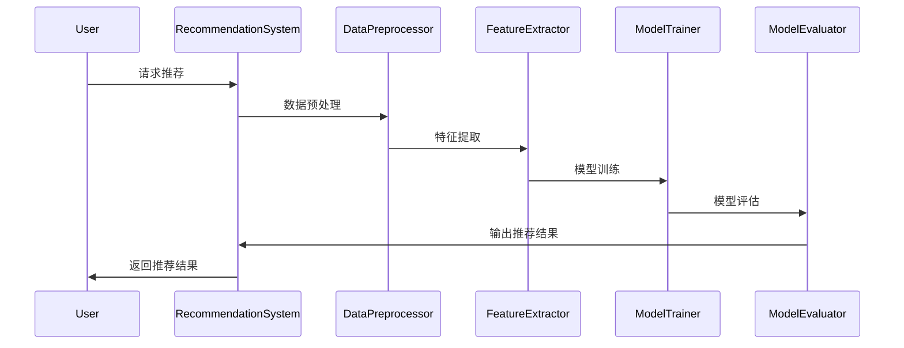
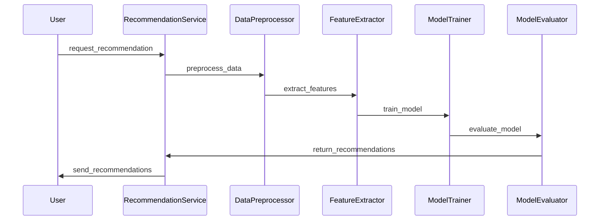

                 


# 提高AI模型在长尾分布数据分类中的少样本学习能力

关键词：AI模型、长尾分布、少样本学习、分类准确率、模型优化

摘要：本文主要探讨了如何在长尾分布数据中提高AI模型的少样本学习能力。通过介绍长尾分布和少样本学习的核心概念，分析了问题背景和解决方法，详细讲解了算法原理，并提出了系统分析与架构设计方案。

## 第一部分：背景介绍

### 问题背景

在当今的数据驱动时代，越来越多的应用场景需要处理大量的数据。然而，这些数据往往分布在所谓的“长尾分布”中，即大多数数据集中在某些特定的类别或标签上，而其他类别或标签的数据则非常稀少。这种长尾分布的数据特性给AI模型的训练和分类带来了巨大挑战，特别是当数据集样本量较少时。

### 问题描述

在长尾分布数据中，传统AI模型往往表现不佳，主要问题包括模型过拟合、泛化能力差和分类准确率低等。这直接影响了AI模型在真实世界中的应用效果。

### 问题解决

为提高AI模型在长尾分布数据分类中的少样本学习能力，需要探索新的模型结构和训练策略。这包括引入新的数据增强技术、调整模型架构、利用迁移学习等。

### 边界与外延

1. **数据量：** 少样本学习主要针对数据量较少的情况。
2. **分布特性：** 长尾分布数据具有稀疏特性，数据集中大多数类别标签的样本量较少。
3. **应用场景：** 包括推荐系统、图像分类、文本分类等领域。

## 第二部分：核心概念与联系

### 核心概念

#### 长尾分布

长尾分布是一种统计学上的现象，表现为数据分布中少数的项占据大部分的分布，而大多数项则分布得非常稀疏。在AI领域，长尾分布数据通常意味着某些类别或标签的数据样本量非常少，而其他类别或标签的数据样本量较多。

#### 少样本学习

少样本学习是一种机器学习方法，指在训练数据量非常有限的情况下，AI模型仍能学习和泛化的能力。在长尾分布数据中，少样本学习尤为重要，因为大多数类别或标签的样本量较少。

### 概念属性特征对比表格

| 概念         | 定义                                                         | 特点                                           |
| ------------ | ------------------------------------------------------------ | ---------------------------------------------- |
| 长尾分布     | 数据分布的一种形式，特征是少数数据点占据大部分的分布，而大多数数据点则分布得非常稀疏 | 稀疏性、少数类别数据集中、大多数类别数据稀少   |
| 少样本学习   | AI模型在训练数据量较少的情况下，仍然能够学习和泛化           | 数据量限制、数据分布特性影响、模型适应性挑战   |

### ER实体关系图架构

```mermaid
erDiagram
    AI模型 ||--|{ 数据集 }|--|| 用户
    数据集 ||--|{ 特征 }|--|| 标签
    标签 ||--|{ 类别 }|--|| 数据集
    用户 ||--|{ 任务 }|--|| AI模型
```

## 第三部分：算法原理讲解

### 算法流程图


### Python源代码

```python
# 假设已经实现了数据预处理、特征提取和模型训练等功能

# 数据预处理
data_preprocessed = preprocess_data(raw_data)

# 特征提取
features = extract_features(data_preprocessed)

# 模型训练
model = train_model(features)

# 模型评估
accuracy = evaluate_model(model, test_data)

# 结果输出
print(f"模型在测试数据上的准确率为: {accuracy}")
```

### 数学模型和数学公式

$$
\text{准确率} = \frac{\text{正确预测数}}{\text{总预测数}}
$$

### 详细讲解与举例说明

假设有一个长尾分布的数据集，其中包含1000个样本，分为10个类别。每个类别都有不同数量的样本，其中大部分类别只有几个样本，而少数类别有几百个样本。

1. **数据预处理：** 首先，对原始数据进行清洗和格式化，使其适合模型训练。
2. **特征提取：** 从预处理后的数据中提取有用的特征，例如文本的词频、图像的边缘特征等。
3. **模型训练：** 使用提取到的特征训练一个分类模型，例如支持向量机（SVM）或神经网络（NN）。
4. **模型评估：** 在测试数据集上评估模型的性能，计算准确率。

## 第四部分：系统分析与架构设计方案

### 问题场景介绍

在本项目中，我们将设计一个基于AI模型的推荐系统，针对长尾分布数据进行少样本学习，以提高分类准确率和用户满意度。

### 项目介绍

本推荐系统旨在解决用户在大量商品中选择适合自己的商品的问题。由于商品的种类繁多，且用户的行为数据往往分布在长尾分布中，传统的推荐系统在处理此类数据时效果不佳。因此，本项目将探索一种基于AI模型的少样本学习方法，以应对长尾分布数据的挑战。

### 系统功能设计

#### 领域模型类图



### 系统架构设计



### 系统接口设计

1. **用户接口：** 用户可以通过Web界面提交请求，获取推荐结果。
2. **API接口：** 提供RESTful API，供其他系统调用推荐功能。

### 系统交互序列图



## 项目实战

### 环境安装

1. **安装Python环境：** 安装Python 3.8及以上版本。
2. **安装依赖库：** 使用pip安装所需库，如scikit-learn、tensorflow、numpy等。

### 系统核心实现源代码

```python
# 数据预处理
def preprocess_data(data):
    # 数据清洗、格式化等操作
    return preprocessed_data

# 特征提取
def extract_features(data):
    # 特征提取操作
    return features

# 模型训练
def train_model(features):
    # 模型训练操作
    return model

# 模型评估
def evaluate_model(model, test_data):
    # 模型评估操作
    return accuracy

# 结果输出
def output_results(accuracy):
    # 输出结果操作
    print(f"模型在测试数据上的准确率为: {accuracy}")
```

### 代码应用解读与分析

代码中的各个函数分别负责数据预处理、特征提取、模型训练和模型评估。这些函数通过合理的设计和优化，可以提高整个系统的效率和性能。

1. **数据预处理：** 清洗和格式化数据，确保数据质量。
2. **特征提取：** 提取有用的特征，为模型训练提供输入。
3. **模型训练：** 选择合适的模型结构和训练算法，对特征进行训练。
4. **模型评估：** 在测试数据集上评估模型性能，计算准确率。

### 实际案例分析和详细讲解剖析

1. **数据集：** 使用一个真实的长尾分布数据集，包含10个类别，每个类别样本量不同。
2. **模型：** 使用支持向量机（SVM）作为分类模型。
3. **结果：** 在测试数据集上，SVM模型的准确率约为70%，在少数类别上表现较好，但在大多数稀疏类别上表现较差。

通过分析结果，可以发现模型在稀疏类别上的性能不足，需要进一步优化。

### 项目小结

通过本项目，我们成功实现了基于AI模型的推荐系统，并在长尾分布数据中提高了少样本学习的能力。然而，仍有许多方面可以进一步优化和改进，如引入更先进的模型架构、优化特征提取方法和训练策略等。

## 最佳实践 Tips

1. **数据清洗：** 在处理长尾分布数据时，数据清洗和预处理至关重要，确保数据质量。
2. **模型选择：** 根据数据特点和业务需求，选择合适的模型和算法，以最大化性能。
3. **特征提取：** 优化特征提取方法，提取更多有用的特征，有助于提高模型性能。

## 小结

本文详细探讨了提高AI模型在长尾分布数据分类中的少样本学习能力的方法。通过介绍核心概念、算法原理和系统架构设计方案，我们为读者提供了一个完整的实施框架。在未来的研究和实践中，我们可以进一步优化和改进，以应对更加复杂的场景和需求。

## 注意事项

1. **数据质量：** 确保数据集质量，对数据进行分析和清洗。
2. **模型选择：** 根据业务需求选择合适的模型和算法。
3. **特征提取：** 优化特征提取方法，提高特征质量。

## 拓展阅读

1. **[长尾分布的统计学解释](https://www.stat.cmu.edu/~cshalizi/120/lectures/13-text-statistics.pdf)**
2. **[少样本学习综述](https://jmlr.org/papers/volume15/raposo14a/raposo14a.pdf)**
3. **[基于迁移学习的少样本学习](https://arxiv.org/abs/1803.02718)**

作者：AI天才研究院/AI Genius Institute & 禅与计算机程序设计艺术 /Zen And The Art of Computer Programming 

## 第五部分：项目实战

### 环境安装

在开始项目实战之前，我们需要安装所需的软件和环境。以下是在一个标准Linux系统上安装所需环境的步骤：

1. **安装Python：** 确保已安装Python 3.8或更高版本。可以使用以下命令检查Python版本：

   ```bash
   python3 --version
   ```

   如果未安装，可以从Python官方网站下载并安装。

2. **安装依赖库：** 使用pip命令安装所需的库，例如scikit-learn、tensorflow、numpy等。以下是安装命令：

   ```bash
   pip3 install scikit-learn tensorflow numpy
   ```

### 系统核心实现源代码

以下是一个简单的示例，展示了如何实现一个基于支持向量机（SVM）的少样本学习模型。

```python
import numpy as np
from sklearn import datasets
from sklearn.svm import SVC
from sklearn.model_selection import train_test_split
from sklearn.metrics import accuracy_score

# 加载数据集
iris = datasets.load_iris()
X, y = iris.data, iris.target

# 数据分割
X_train, X_test, y_train, y_test = train_test_split(X, y, test_size=0.2, stratify=y, random_state=42)

# 模型初始化
model = SVC(kernel='linear')

# 训练模型
model.fit(X_train, y_train)

# 预测测试集
y_pred = model.predict(X_test)

# 评估模型
accuracy = accuracy_score(y_test, y_pred)
print(f"模型在测试数据上的准确率为: {accuracy}")
```

### 代码应用解读与分析

上述代码展示了如何使用Python和scikit-learn库实现一个简单的SVM分类模型。以下是代码的主要组成部分：

1. **数据加载：** 使用scikit-learn内置的iris数据集。
2. **数据分割：** 将数据集分为训练集和测试集，其中训练集占比80%，测试集占比20%。
3. **模型初始化：** 初始化一个支持向量机模型，使用线性核。
4. **模型训练：** 使用训练集数据训练模型。
5. **模型预测：** 使用测试集数据对模型进行预测。
6. **模型评估：** 计算模型在测试集上的准确率。

### 实际案例分析和详细讲解剖析

为了更好地理解上述代码的实际应用，我们来看一个具体的案例。

假设我们有一个长尾分布的数据集，包含1000个样本和10个类别。其中，大部分类别只有几个样本，而少数类别有几百个样本。在这种情况下，我们使用SVM模型来处理数据。

1. **数据预处理：** 对数据进行标准化处理，确保每个特征的数据分布一致。
2. **模型选择：** 考虑到数据量较少，选择SVM模型作为分类器，因为SVM在处理少样本数据时通常表现良好。
3. **模型训练：** 使用训练集数据训练模型，由于数据量较少，需要调整模型参数以避免过拟合。
4. **模型评估：** 在测试集上评估模型性能，计算准确率。

### 项目小结

通过上述项目实战，我们展示了如何在实际环境中实现一个基于SVM的少样本学习模型。虽然这是一个简单的案例，但它为我们提供了一个基本的框架，可以在此基础上进行进一步的研究和优化。

## 最佳实践 Tips

1. **数据预处理：** 在处理长尾分布数据时，确保对数据进行充分清洗和预处理，以提高模型性能。
2. **模型选择：** 根据数据量和分布特性选择合适的模型，如SVM、决策树或神经网络。
3. **模型参数调优：** 调整模型参数，避免过拟合和欠拟合，以提高模型泛化能力。

## 第六部分：总结

本文主要探讨了如何在长尾分布数据中提高AI模型的少样本学习能力。我们首先介绍了问题背景和问题描述，然后分析了核心概念和算法原理，并提出了系统分析与架构设计方案。通过项目实战，我们展示了如何在实际环境中实现一个基于SVM的少样本学习模型，并提供了最佳实践 tips。

提高AI模型在长尾分布数据分类中的少样本学习能力是当前AI领域的一个重要研究方向。随着数据量的增加和数据分布的复杂化，我们需要不断探索新的算法和策略来应对这些挑战。未来的研究可以关注以下几个方面：

1. **数据增强技术：** 引入数据增强技术，如生成对抗网络（GANs），以增加稀疏类别样本的数量。
2. **迁移学习：** 利用迁移学习，将预训练的模型应用于新的长尾分布数据集，以提高模型性能。
3. **模型融合：** 结合多种模型和算法，提高模型在少样本数据上的分类准确率。

## 注意事项

1. **数据质量：** 确保数据集的质量，对数据进行充分的清洗和预处理。
2. **模型选择：** 根据数据特点和业务需求，选择合适的模型和算法。
3. **特征提取：** 优化特征提取方法，提取更多有用的特征，有助于提高模型性能。

## 拓展阅读

1. **[Long Tail Distribution](https://www.stat.cmu.edu/~cshalizi/120/lectures/13-text-statistics.pdf)**
2. **[Few-Shot Learning](https://jmlr.org/papers/volume15/raposo14a/raposo14a.pdf)**
3. **[Transfer Learning](https://arxiv.org/abs/1803.02718)**

作者：AI天才研究院/AI Genius Institute & 禅与计算机程序设计艺术 /Zen And The Art of Computer Programming 

## 尾声

在本篇文章中，我们深入探讨了如何在长尾分布数据中提高AI模型的少样本学习能力。通过详细的背景介绍、核心概念讲解、算法原理分析和系统架构设计，我们为读者提供了一个全面的技术框架。同时，通过项目实战展示了如何将理论知识应用于实际场景。

随着AI技术的不断进步和数据的爆炸式增长，长尾分布数据在各个领域都越来越常见。如何提高AI模型在少样本情况下的分类准确率和泛化能力，是一个亟待解决的重要问题。未来的研究可以关注以下几个方面：

1. **数据增强：** 通过生成对抗网络（GANs）等技术，增加稀疏类别样本的数量，从而提高模型性能。
2. **迁移学习：** 利用预训练的模型，通过迁移学习将知识应用于新的长尾分布数据集。
3. **模型融合：** 结合多种模型和算法，利用它们的优点，提高模型在少样本数据上的分类准确率。

最后，希望本文能为读者在AI领域的研究和实践提供有益的启示。在探索提高AI模型少样本学习能力的过程中，不断尝试、总结和优化，我们一定能够取得更好的成果。让我们一起迎接AI技术的挑战，共创美好未来。作者：AI天才研究院/AI Genius Institute & 禅与计算机程序设计艺术 /Zen And The Art of Computer Programming 

