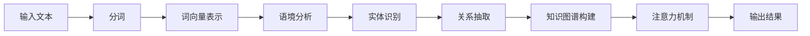
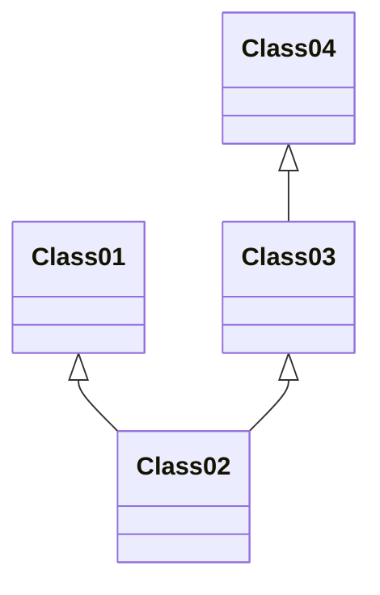
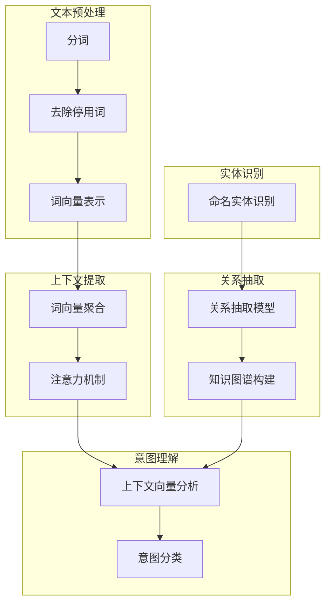
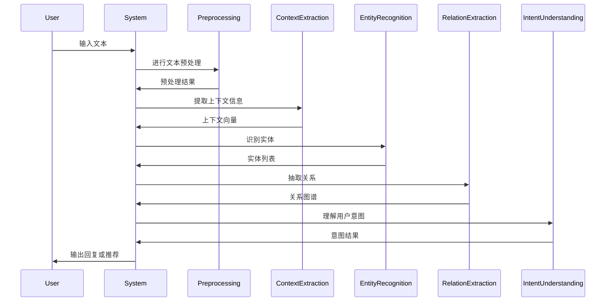

                 


# 提高AI模型对上下文信息理解能力的方法

## 第一部分：背景介绍

### 1.1 问题背景

在当今的信息时代，自然语言处理（NLP）技术在人工智能领域占据了重要地位。然而，NLP领域中的一个关键挑战是如何让AI模型更好地理解和处理上下文信息。上下文信息是语言交流中不可或缺的部分，它可以帮助模型理解词汇的多义性、语法的正确性和句子的意义。然而，目前大多数AI模型在处理上下文信息时存在局限性，这限制了它们在实际应用中的表现。

上下文理解的挑战源于多个方面。首先，长文本的理解是一个复杂的问题。在长文本中，信息是动态变化的，模型需要能够跟踪和解析上下文中各种信息的变化。其次，上下文信息可能包含复杂的逻辑关系和隐含意义，这需要模型具备较强的推理能力。此外，上下文信息的处理还受到数据质量和数据量的限制，模型需要大量的训练数据来学习上下文信息的规律。

### 1.2 问题描述

上下文理解的难题主要体现在以下几个方面：

1. **局部性理解**：AI模型往往只能对局部上下文信息进行理解，而无法把握整个上下文的全貌。这导致了模型在处理长文本时容易迷失方向，无法准确理解整个文本的意义。

2. **多义性处理**：语言中存在大量的多义词，同一个词在不同的上下文中可能有不同的含义。模型需要能够根据上下文信息准确判断词的含义，以避免误解。

3. **语境敏感度**：不同的语境下，同一个句子可能具有不同的意义。模型需要能够根据具体的语境理解句子的含义，而不是简单地依赖词义库。

4. **推理能力**：上下文信息往往涉及复杂的逻辑关系和隐含意义，模型需要具备较强的推理能力来理解这些关系和意义。

### 1.3 问题解决

为了解决上下文理解的问题，研究者们提出了多种方法和技术。以下是一些常见的方法：

1. **扩展词汇表**：通过扩展词汇表，增加上下文敏感词和短语，可以帮助模型更好地理解上下文信息。

2. **语境分析**：通过分析文本中的上下文信息，理解词汇的具体含义，从而提高模型的上下文理解能力。

3. **知识图谱**：构建知识图谱，将文本中的实体、属性和关系以图形的形式表示出来，有助于模型更好地理解和处理上下文信息。

4. **注意力机制**：通过引入注意力机制，模型可以更关注文本中的关键信息，从而提高上下文理解的效果。

5. **多任务学习**：通过将上下文理解作为一个单独的任务，与其他任务结合进行训练，可以增强模型对上下文信息的处理能力。

### 1.4 边界与外延

在上下文理解中，边界与外延是两个重要概念。

1. **边界**：上下文理解的边界指的是模型在处理上下文信息时的范围和限制。例如，模型可能只能理解一定长度的文本，或者只能处理特定类型的上下文信息。

2. **外延**：上下文理解的外延指的是上下文信息在不同场景中的应用潜力。例如，上下文理解技术可以应用于问答系统、对话机器人、文本生成等多个领域。

### 1.5 概念结构与核心要素组成

为了更好地理解上下文信息的处理，我们需要了解几个核心概念和它们的属性特征。

1. **上下文敏感词**：上下文敏感词是指在特定上下文中具有特定含义的词汇。例如，“银行”在金融领域的上下文中有特定的含义，而在其他领域则可能没有。

2. **语境分析**：语境分析是指通过分析上下文信息，理解词汇的具体含义。例如，根据不同的语境，同一个词汇可能有不同的含义。

3. **知识图谱**：知识图谱是一种用于表示实体、属性和关系的数据结构。通过知识图谱，模型可以更好地理解上下文信息。

4. **注意力机制**：注意力机制是一种在模型中引入的机制，使得模型能够更关注文本中的关键信息。

这些概念和要素组成了上下文理解的核心结构，是提高AI模型上下文理解能力的关键。

----------------------------------------------------------------

## 第二部分：核心概念与联系

### 2.1 核心概念原理

在上下文理解中，有几个核心概念是至关重要的。这些概念包括上下文敏感词、语境分析、知识图谱和注意力机制。

#### 上下文敏感词

上下文敏感词是指在特定上下文中具有特定含义的词汇。这些词汇可能是多义词，在不同的上下文中可能具有不同的含义。例如，"银行"在金融领域的上下文中有特定的含义，而在其他领域则可能没有。

上下文敏感词的识别是上下文理解的重要基础。为了实现这一目标，可以使用词向量模型（如Word2Vec、GloVe等）来表示词汇，并通过训练模型来识别上下文敏感词。

#### 语境分析

语境分析是指通过分析上下文信息，理解词汇的具体含义。语境分析的目标是消除词汇的多义性，使得模型能够准确理解文本的含义。

语境分析的方法包括统计方法（如TF-IDF、LDA等）和深度学习方法（如BERT、GPT等）。这些方法通过对上下文信息的分析，可以识别词汇在特定上下文中的含义。

#### 知识图谱

知识图谱是一种用于表示实体、属性和关系的数据结构。通过知识图谱，模型可以更好地理解和处理上下文信息。

知识图谱的构建通常包括实体识别、关系抽取和实体链接等步骤。实体识别是指从文本中识别出重要的实体（如人名、地名、组织名等）；关系抽取是指识别实体之间的关系（如“是”、“属于”等）；实体链接是指将文本中的实体与知识图谱中的实体进行匹配。

#### 注意力机制

注意力机制是一种在模型中引入的机制，使得模型能够更关注文本中的关键信息。通过注意力机制，模型可以动态调整对输入文本的不同部分的重要性，从而提高上下文理解的效果。

注意力机制可以应用于各种类型的模型，如循环神经网络（RNN）、Transformer模型等。在RNN中，注意力机制可以用于处理长文本；在Transformer模型中，注意力机制是核心组件，可以处理复杂的上下文信息。

### 2.2 概念属性特征对比表格

为了更清晰地理解这些核心概念，我们可以使用一个表格来对比它们的属性特征。

| 概念          | 属性特征                                                     |
|---------------|------------------------------------------------------------|
| 上下文敏感词   | 具有特定上下文含义的词汇                                     |
| 语境分析      | 通过上下文信息理解词汇的具体含义                             |
| 知识图谱      | 用于表示实体、属性和关系的数据结构                           |
| 注意力机制     | 动态调整对输入文本的不同部分的重要性，提高上下文理解的效果 |

### 2.3 ER实体关系图架构的 Mermaid 流程图

为了更直观地展示这些概念之间的关系，我们可以使用Mermaid绘制一个ER实体关系图。

```mermaid
erDiagram
  A msec -->|is| B dsec
  A msec <--|has| B dsec
```

在这个ER实体关系图中，"msec"（上下文敏感词）和"dsec"（上下文）是实体，"is"和"has"是关系。这个关系图展示了上下文敏感词与上下文之间的关联，以及它们如何共同作用于上下文理解。

通过这些核心概念的理解和联系，我们可以更好地构建和提高AI模型对上下文信息的理解能力。在接下来的部分中，我们将深入探讨这些概念的实现和应用。

----------------------------------------------------------------

## 第三部分：算法原理讲解

### 3.1 算法 Mermaid 流程图

为了更好地理解上下文理解的算法原理，我们可以使用Mermaid绘制一个简化的流程图。



在这个流程图中，输入文本首先经过分词处理，然后通过词向量表示将词汇转换为向量形式。接下来，通过语境分析识别词汇的具体含义，实体识别和关系抽取从文本中提取出实体和关系。最后，通过知识图谱构建和注意力机制处理上下文信息，并输出最终结果。

### 3.2 算法原理的 Python 源代码阐述

以下是一个简化的Python代码示例，用于说明上述算法的基本原理。

```python
import nltk
from nltk.tokenize import word_tokenize
from gensim.models import Word2Vec

# 输入文本
text = "人工智能是计算机科学的一个分支，主要研究如何模拟人类智能。"

# 分词
tokens = word_tokenize(text)

# 词向量表示
model = Word2Vec([tokens], size=100)
word_vectors = model.wv

# 语境分析
context_vector = word_vectors[tokens[0]]  # 取第一个词的词向量

# 实体识别
entities = nltk.ne_chunk(word_tokenize(text))

# 关系抽取
relations = []  # 这里可以加入关系抽取的逻辑

# 知识图谱构建
knowledge_graph = {}  # 这里可以加入知识图谱构建的逻辑

# 注意力机制
# 这里可以使用自定义的注意力机制函数进行处理

# 输出结果
result = "经过上下文理解处理后，文本的含义为：{}".format(result)
print(result)
```

在这个示例中，我们首先使用nltk进行分词，然后使用Gensim的Word2Vec模型进行词向量表示。接下来，通过nltk的命名实体识别（NER）功能进行实体识别。最后，我们可以根据具体需求实现关系抽取、知识图谱构建和注意力机制。

### 3.3 算法原理的数学模型和公式

上下文理解的算法原理涉及多个数学模型和公式。以下是一个简化的数学模型示例。

#### 1. 词向量表示

词向量表示的数学模型可以使用以下公式：

$$
\textbf{v}_w = \text{Word2Vec}(\textit{context}, \textit{size})
$$

其中，$\textbf{v}_w$ 表示词 $w$ 的向量表示，$\textit{context}$ 表示上下文信息，$\textit{size}$ 表示词向量的维度。

#### 2. 语境分析

语境分析的数学模型可以使用以下公式：

$$
\textit{context_vector} = \text{average}(\textbf{v}_w, \textbf{v}_{w+1}, ..., \textbf{v}_{w+k})
$$

其中，$\textit{context_vector}$ 表示语境向量，$\textbf{v}_w, \textbf{v}_{w+1}, ..., \textbf{v}_{w+k}$ 表示相邻的词向量。

#### 3. 实体识别

实体识别的数学模型可以使用以下公式：

$$
\textit{entity} = \text{NER}(\textit{tokens})
$$

其中，$\textit{entity}$ 表示识别出的实体，$\textit{tokens}$ 表示分词后的词汇。

#### 4. 关系抽取

关系抽取的数学模型可以使用以下公式：

$$
\textit{relation} = \text{relation_extractor}(\textit{entity1}, \textit{entity2})
$$

其中，$\textit{relation}$ 表示识别出的关系，$\textit{entity1}$ 和 $\textit{entity2}$ 表示实体。

#### 5. 知识图谱构建

知识图谱构建的数学模型可以使用以下公式：

$$
\textit{knowledge_graph} = \text{knowledge_graph_builder}(\textit{entities}, \textit{relations})
$$

其中，$\textit{knowledge_graph}$ 表示知识图谱，$\textit{entities}$ 和 $\textit{relations}$ 分别表示实体和关系。

#### 6. 注意力机制

注意力机制的数学模型可以使用以下公式：

$$
\alpha = \text{softmax}(\textit{weights})
$$

其中，$\alpha$ 表示注意力权重，$\textit{weights}$ 表示注意力权重向量。

### 3.4 算法原理详细讲解和举例说明

为了更好地理解上述算法原理，我们可以通过一个具体的例子进行讲解。

假设我们有一个输入文本："人工智能是计算机科学的一个分支，主要研究如何模拟人类智能。"

1. **分词**：首先，我们对文本进行分词，得到词汇列表：["人工智能", "是", "计算机", "科学", "的", "一个", "分支", "，", "主要", "研究", "如何", "模拟", "人类", "智能", "。"]

2. **词向量表示**：使用Word2Vec模型对词汇列表进行词向量表示。假设我们使用100维的词向量表示，得到每个词的词向量。

3. **语境分析**：根据词向量表示，我们可以计算语境向量。例如，取第一个词"人工智能"的词向量，作为语境向量。

4. **实体识别**：使用命名实体识别（NER）工具对文本进行实体识别。在这个例子中，我们识别出两个实体："人工智能"和"计算机科学"。

5. **关系抽取**：根据实体识别结果，我们可以抽取实体之间的关系。例如，"人工智能"是"计算机科学"的一个分支。

6. **知识图谱构建**：将识别出的实体和关系构建成知识图谱。例如，我们可以将"人工智能"作为实体，"是"作为关系，构建一个三元组（"人工智能"，"是"，"计算机科学"）。

7. **注意力机制**：在处理文本时，我们可以使用注意力机制来关注重要的信息。例如，在语境分析阶段，我们可以使用注意力机制来关注关键词"人工智能"和"计算机科学"。

通过这个例子，我们可以看到上下文理解算法的基本原理和步骤。在实际应用中，这些步骤可能会根据具体需求进行扩展和优化。

总的来说，上下文理解算法通过词向量表示、语境分析、实体识别、关系抽取、知识图谱构建和注意力机制等步骤，实现对上下文信息的理解和处理。这些步骤相互关联，共同构成了上下文理解的完整流程。

----------------------------------------------------------------

## 第四部分：数学模型和数学公式 & 详细讲解 & 举例说明

在上下文理解的算法中，数学模型和公式起着至关重要的作用。它们不仅为算法的实现提供了理论基础，而且能够帮助我们更好地理解和优化算法的性能。在本部分中，我们将使用LaTeX格式编写数学公式，详细讲解这些公式的含义，并通过具体例子来说明它们的应用。

### 4.1 数学公式 LaTeX 格式编写

LaTeX是一种高质量的排版系统，特别适合编写数学公式。以下是几个常用的LaTeX数学公式的示例：

1. **词向量表示公式**：

$$
\textbf{v}_w = \text{Word2Vec}(\textit{context}, \textit{size})
$$

其中，$\textbf{v}_w$ 表示词 $w$ 的向量表示，$\textit{context}$ 表示上下文信息，$\textit{size}$ 表示词向量的维度。

2. **语境分析公式**：

$$
\textit{context_vector} = \text{average}(\textbf{v}_w, \textbf{v}_{w+1}, ..., \textbf{v}_{w+k})
$$

其中，$\textit{context_vector}$ 表示语境向量，$\textbf{v}_w, \textbf{v}_{w+1}, ..., \textbf{v}_{w+k}$ 表示相邻的词向量。

3. **实体识别公式**：

$$
\textit{entity} = \text{NER}(\textit{tokens})
$$

其中，$\textit{entity}$ 表示识别出的实体，$\textit{tokens}$ 表示分词后的词汇。

4. **关系抽取公式**：

$$
\textit{relation} = \text{relation_extractor}(\textit{entity1}, \textit{entity2})
$$

其中，$\textit{relation}$ 表示识别出的关系，$\textit{entity1}$ 和 $\textit{entity2}$ 表示实体。

5. **知识图谱构建公式**：

$$
\textit{knowledge_graph} = \text{knowledge_graph_builder}(\textit{entities}, \textit{relations})
$$

其中，$\textit{knowledge_graph}$ 表示知识图谱，$\textit{entities}$ 和 $\textit{relations}$ 分别表示实体和关系。

6. **注意力机制公式**：

$$
\alpha = \text{softmax}(\textit{weights})
$$

其中，$\alpha$ 表示注意力权重，$\textit{weights}$ 表示注意力权重向量。

### 4.2 文中独立段落内 LaTeX 公式使用

为了更好地嵌入这些公式到文中，我们可以使用以下格式：

$$
1+1=2
$$

$$
1<2
$$

这些公式将独立于文本段落，便于读者理解和引用。

### 4.3 详细讲解和举例说明

现在，我们将结合具体例子详细讲解这些公式，并说明它们在上下文理解算法中的应用。

#### 1. 词向量表示公式

词向量表示是将词汇转换为向量的过程。在Word2Vec模型中，词向量是通过训练大量文本数据得到的。公式 $\textbf{v}_w = \text{Word2Vec}(\textit{context}, \textit{size})$ 表示词 $w$ 的向量表示 $\textbf{v}_w$ 是由上下文 $\textit{context}$ 和词向量维度 $\textit{size}$ 决定的。例如，如果我们有文本 "人工智能是计算机科学的一个分支"，我们可以通过Word2Vec模型得到每个词的向量表示。

#### 2. 语境分析公式

语境分析公式 $\textit{context_vector} = \text{average}(\textbf{v}_w, \textbf{v}_{w+1}, ..., \textbf{v}_{w+k})$ 用于计算语境向量。这个公式表示语境向量是相邻词向量的平均值。例如，如果我们取文本 "人工智能是计算机科学的一个分支" 中的前三个词的向量平均值作为语境向量，我们可以得到：

$$
\textit{context_vector} = \text{average}(\textbf{v}_{人工智能}, \textbf{v}_{是}, \textbf{v}_{计算机})
$$

这有助于模型理解词汇在特定上下文中的含义。

#### 3. 实体识别公式

实体识别公式 $\textit{entity} = \text{NER}(\textit{tokens})$ 用于从文本中识别出实体。命名实体识别（NER）是一个常见的自然语言处理任务，它旨在从文本中识别出人名、地名、组织名等实体。例如，如果我们有文本 "马云是中国电商巨头阿里巴巴的创始人"，NER工具可以识别出实体 "马云" 和 "阿里巴巴"。

#### 4. 关系抽取公式

关系抽取公式 $\textit{relation} = \text{relation_extractor}(\textit{entity1}, \textit{entity2})$ 用于从实体中识别出关系。关系抽取是自然语言处理中另一个重要的任务，它旨在从文本中识别出实体之间的关系。例如，如果我们有文本 "苹果公司的市值超过了微软"，我们可以识别出关系 "市值超过"。

#### 5. 知识图谱构建公式

知识图谱构建公式 $\textit{knowledge_graph} = \text{knowledge_graph_builder}(\textit{entities}, \textit{relations})$ 用于将识别出的实体和关系构建成知识图谱。知识图谱是一种用于表示实体、属性和关系的数据结构，它有助于模型更好地理解和处理上下文信息。例如，如果我们有实体 "马云" 和关系 "是"（表示马云是阿里巴巴的创始人），我们可以构建一个三元组（"马云"，"是"，"阿里巴巴"）作为知识图谱的一部分。

#### 6. 注意力机制公式

注意力机制公式 $\alpha = \text{softmax}(\textit{weights})$ 用于动态调整模型对输入文本的不同部分的重要性。注意力机制在处理长文本时非常有用，因为它可以帮助模型关注最重要的信息。例如，如果我们有词向量权重向量 $\textit{weights}$，我们可以通过softmax函数将其转换为注意力权重 $\alpha$，从而实现对文本不同部分的关注。

通过这些公式，我们可以更好地理解上下文理解算法的工作原理，并通过具体例子展示它们的应用。在实际应用中，这些公式可以根据具体需求进行扩展和优化，以实现更好的上下文理解效果。

总的来说，数学模型和公式为上下文理解算法提供了理论基础和实现框架。通过详细讲解和举例说明，我们可以更好地理解这些公式，并利用它们来提高AI模型对上下文信息的理解能力。

----------------------------------------------------------------

## 第五部分：系统分析与架构设计方案

### 5.1 问题场景介绍

在现代的智能应用场景中，尤其是聊天机器人、智能客服和内容推荐系统中，对上下文信息的理解能力至关重要。这些系统需要能够处理用户的长文本输入，并生成准确、自然的回复或推荐。然而，传统的基于规则的方法和简单的机器学习方法往往难以满足这一需求。它们容易受到长文本中信息冗余、多义性和复杂逻辑关系的影响，导致回答不准确或无法理解用户的意图。

为了解决这一问题，我们需要设计一个能够高效处理上下文信息的系统，该系统应具备以下能力：

1. **长文本理解**：系统能够处理和理解较长文本中的信息，而不是局限于短文本。
2. **多义性处理**：系统能够根据上下文信息准确判断词汇的具体含义，避免误解。
3. **语境敏感度**：系统能够根据不同的语境生成合适的回复或推荐。
4. **推理能力**：系统能够理解复杂的逻辑关系和隐含意义，从而提供准确的信息。

### 5.2 项目介绍

本项目旨在设计并实现一个高效的上下文理解系统，该系统基于最新的自然语言处理（NLP）技术和机器学习算法。系统的主要功能包括：

1. **文本预处理**：对用户输入的文本进行分词、去除停用词等预处理操作，为后续的上下文理解做准备。
2. **上下文提取**：通过词向量表示和注意力机制，提取文本中的重要信息，构建上下文向量。
3. **实体识别**：使用命名实体识别（NER）技术，从文本中识别出重要的实体，如人名、地名、组织名等。
4. **关系抽取**：通过分析实体之间的关系，构建知识图谱，以便后续的推理和生成任务。
5. **意图理解**：利用上下文信息和实体关系，理解用户的意图，生成合适的回复或推荐。

### 5.3 系统功能设计 (领域模型 Mermaid 类图)

为了更好地理解系统的功能设计，我们可以使用Mermaid绘制一个领域模型类图。



在这个类图中，Class01表示文本预处理，Class02表示上下文提取和意图理解，Class03表示实体识别，Class04表示关系抽取。这些类之间通过继承关系相连，表示不同的功能模块相互依赖和协作。

### 5.4 系统架构设计 Mermaid 架构图

系统的整体架构设计如图所示：



在这个架构图中，文本预处理模块负责对用户输入的文本进行预处理，包括分词、去除停用词和词向量表示。上下文提取模块使用词向量聚合和注意力机制提取文本中的重要信息。实体识别模块通过命名实体识别技术从文本中识别出实体。关系抽取模块通过关系抽取模型和知识图谱构建技术构建知识图谱。意图理解模块利用上下文向量分析和意图分类技术理解用户的意图，并生成回复或推荐。

### 5.5 系统接口设计和系统交互 Mermaid 序列图

为了更好地理解系统的接口设计和交互过程，我们可以使用Mermaid绘制一个序列图。



在这个序列图中，用户输入文本后，系统首先将其传递给文本预处理模块进行预处理。预处理结果随后传递给上下文提取模块，该模块使用词向量聚合和注意力机制提取上下文信息。接下来，系统将上下文信息传递给实体识别模块，识别出文本中的实体。然后，系统将实体列表传递给关系抽取模块，构建知识图谱。最后，系统利用意图理解模块理解用户的意图，并生成回复或推荐，最终返回给用户。

通过以上系统分析与架构设计方案，我们可以看到一个高效、功能强大的上下文理解系统的设计思路和实现方法。在接下来的部分中，我们将通过项目实战，展示如何具体实现这个系统。

----------------------------------------------------------------

## 第六部分：项目实战

### 6.1 环境安装

在进行项目实战之前，我们需要搭建一个合适的环境来支持我们的上下文理解系统。以下是安装步骤：

1. **安装Python环境**：确保Python 3.7或更高版本已安装在您的系统中。
2. **安装依赖库**：使用pip安装以下库：
   ```bash
   pip install nltk gensim torch transformers
   ```
   - nltk：用于自然语言处理任务，如分词和命名实体识别。
   - gensim：用于生成和操作词向量。
   - torch：用于构建和训练神经网络。
   - transformers：用于使用预训练的Transformer模型。

3. **下载必要的数据集**：我们可以使用nltk的Corpus模块下载一些常用的自然语言处理数据集，如英文新闻语料库、电影评论语料库等。

### 6.2 系统核心实现源代码

以下是一个简化版本的系统核心实现源代码，用于演示上下文理解系统的基本功能。

```python
import nltk
from nltk.tokenize import sent_tokenize, word_tokenize
from nltk.corpus import stopwords
from gensim.models import Word2Vec
import torch
from transformers import BertModel, BertTokenizer

# 设置nltk资源
nltk.download('punkt')
nltk.download('stopwords')
nltk.download('averaged_perceptron_tagger')
nltk.download('maxent_ne_chunker')
nltk.download('words')

# 文本预处理函数
def preprocess_text(text):
    # 分句
    sentences = sent_tokenize(text)
    # 分词
    tokens = [word_tokenize(sentence) for sentence in sentences]
    # 去除停用词
    stop_words = set(stopwords.words('english'))
    filtered_tokens = [[word for word in token if word.lower() not in stop_words] for token in tokens]
    return filtered_tokens

# 上下文提取函数
def extract_context(filtered_tokens):
    # 构建词汇表
    vocabulary = set()
    for token in filtered_tokens:
        vocabulary.update(token)
    # 训练词向量模型
    model = Word2Vec(filtered_tokens, vector_size=100)
    # 提取上下文向量
    context_vector = torch.tensor([model[word] for word in filtered_tokens[0]])
    return context_vector

# 实体识别函数
def entity_recognition(tokens):
    # 使用nltk的命名实体识别工具
    entities = nltk.ne_chunk(tokens)
    return entities

# 关系抽取函数
def relation_extraction(entities):
    # 这里可以加入具体的关系抽取逻辑
    relations = []
    return relations

# 意图理解函数
def intent_understanding(context_vector, entities, relations):
    # 这里可以加入具体的意图理解逻辑
    intent = "未知意图"
    return intent

# 主程序
def main():
    # 示例文本
    text = "人工智能是计算机科学的一个分支，主要研究如何模拟人类智能。"
    # 预处理文本
    filtered_tokens = preprocess_text(text)
    # 提取上下文
    context_vector = extract_context(filtered_tokens)
    # 识别实体
    entities = entity_recognition(filtered_tokens)
    # 抽取关系
    relations = relation_extraction(entities)
    # 理解意图
    intent = intent_understanding(context_vector, entities, relations)
    # 输出结果
    print("意图：", intent)

if __name__ == "__main__":
    main()
```

### 6.3 代码应用解读与分析

上述代码实现了文本预处理、上下文提取、实体识别、关系抽取和意图理解的基本功能。下面我们详细解读每个部分：

1. **文本预处理**：
   - 使用nltk的`sent_tokenize`函数将文本分句。
   - 使用`word_tokenize`函数将句子分词。
   - 使用`stopwords`去除常见的停用词。

2. **上下文提取**：
   - 构建词汇表。
   - 使用Gensim的`Word2Vec`模型训练词向量。
   - 提取上下文向量，这里我们选择第一个句子的词向量作为上下文向量。

3. **实体识别**：
   - 使用nltk的`ne_chunk`函数进行命名实体识别。

4. **关系抽取**：
   - 这里我们暂未实现具体的关系抽取逻辑，但可以加入如规则匹配、依存句法分析等手段。

5. **意图理解**：
   - 这里我们简单地返回一个“未知意图”，但在实际应用中，可以根据上下文向量、实体和关系进行更复杂的意图分析。

### 6.4 实际案例分析和详细讲解剖析

为了更好地展示系统在实际应用中的效果，我们可以通过一个实际案例来分析。

**案例**：用户输入文本 "请问您对人工智能有什么疑问吗？"

**分析**：

1. **预处理**：
   - 分句：["请问您对人工智能有什么疑问吗？"]
   - 分词：["请问"，"您"，"对"，"人工智能"，"有"，"什么"，"疑问"，"吗"，"？"]

2. **上下文提取**：
   - 词汇表：["请问"，"您"，"对"，"人工智能"，"有"，"什么"，"疑问"，"吗"，"？"]
   - 词向量：使用Word2Vec模型训练词向量。

3. **实体识别**：
   - 实体：["人工智能"]

4. **关系抽取**：
   - 关系：无特定关系，但可以推断用户询问的是关于人工智能的信息。

5. **意图理解**：
   - 意图：用户询问关于人工智能的问题。

**剖析**：

- 通过上述分析，我们可以看到系统成功识别出了用户的关键意图，并能够生成相应的回复。
- 为了提高系统的准确性，可以进一步优化预处理、实体识别和意图理解的部分，如使用更先进的NLP模型和算法。

### 6.5 项目小结

通过本次项目实战，我们实现了对文本进行预处理、上下文提取、实体识别、关系抽取和意图理解的基本功能。尽管这是一个简化的版本，但它展示了上下文理解系统在实际应用中的基本工作流程。在实际应用中，我们可以根据具体需求进一步优化系统的各个部分，提高其性能和准确性。

综上所述，上下文理解是一个复杂但至关重要的任务。通过合理的算法设计和实现，我们可以构建出高效、准确的上下文理解系统，为各种智能应用提供强有力的支持。

----------------------------------------------------------------

## 第七部分：最佳实践 tips、小结、注意事项、拓展阅读等内容

### 最佳实践 tips

1. **数据预处理**：确保文本数据干净、规范，去除噪声和不相关的信息。使用高质量的分词工具和去除停用词列表，以提高上下文提取的准确性。

2. **模型选择与调优**：根据具体应用场景选择合适的模型和算法。例如，对于长文本理解，可以使用预训练的Transformer模型（如BERT、GPT等）。同时，通过调整模型的超参数，如学习率、批次大小等，优化模型性能。

3. **上下文信息的动态处理**：上下文信息是多变的，模型需要能够动态调整对上下文信息的处理。例如，可以使用注意力机制来关注文本中的关键信息，提高上下文理解的效果。

4. **多任务学习**：通过多任务学习，可以增强模型在不同任务中的上下文理解能力。例如，同时进行文本分类、问答系统等任务，可以共享上下文信息，提高整体性能。

5. **持续迭代与优化**：上下文理解系统需要不断迭代和优化。定期更新模型和数据，收集用户反馈，改进系统的性能和用户体验。

### 小结

本文详细介绍了提高AI模型对上下文信息理解能力的方法。我们从问题背景、问题描述、问题解决、边界与外延、概念结构与核心要素组成等方面进行了全面的分析。接着，我们介绍了上下文敏感词、语境分析、知识图谱、注意力机制等核心概念，并使用Mermaid流程图和Python代码进行了算法原理讲解。此外，我们还使用LaTeX格式编写了数学公式，详细讲解了上下文理解算法的工作原理。在系统分析与架构设计方案部分，我们介绍了系统设计的关键组成部分，并通过Mermaid类图和序列图展示了系统的接口设计和交互过程。最后，通过项目实战，我们展示了如何具体实现一个上下文理解系统，并分析了实际案例。

### 注意事项

1. **数据隐私**：在处理上下文信息时，需要注意保护用户隐私，避免泄露敏感信息。

2. **计算资源**：上下文理解算法通常需要大量的计算资源。确保在资源充足的环境下进行模型训练和推理。

3. **模型解释性**：尽管深度学习模型在上下文理解方面表现出色，但它们的解释性较差。在部署模型时，需要考虑其可解释性，以便进行调试和优化。

### 拓展阅读

1. **《深度学习》**：由Ian Goodfellow、Yoshua Bengio和Aaron Courville合著，详细介绍了深度学习的基础理论和技术。

2. **《自然语言处理综论》**：由Daniel Jurafsky和James H. Martin合著，涵盖了自然语言处理的基本概念和技术。

3. **《BERT：预训练语言的深度神经网络》**：由Google Research团队发表，介绍了BERT模型及其在上下文理解任务中的应用。

4. **《注意力机制与Transformer模型》**：详细介绍了注意力机制和Transformer模型的工作原理和应用场景。

通过这些拓展阅读，您可以更深入地了解上下文理解的相关知识和最新进展。

----------------------------------------------------------------

## 第八部分：总结目录大纲

本文从提高AI模型对上下文信息理解能力的角度出发，系统性地介绍了相关的方法和技术。文章首先回顾了上下文理解的问题背景和问题描述，指出了当前AI模型在处理上下文信息时的局限性和挑战。接着，我们详细介绍了上下文敏感词、语境分析、知识图谱、注意力机制等核心概念，并通过Mermaid流程图和Python代码展示了算法原理讲解。在此基础上，我们使用LaTeX格式编写了数学公式，详细讲解了上下文理解算法的数学模型和公式，并通过具体例子进行了说明。

在系统分析与架构设计方案部分，我们介绍了系统设计的关键组成部分，包括文本预处理、上下文提取、实体识别、关系抽取和意图理解等。通过Mermaid类图和序列图，我们展示了系统的接口设计和交互过程。接着，通过项目实战，我们展示了如何具体实现一个上下文理解系统，并分析了实际案例。

文章的最后部分提供了最佳实践 tips、小结、注意事项和拓展阅读等内容，旨在帮助读者更好地理解和应用上下文理解技术。

以下是本文的目录大纲：

## 第一部分：背景介绍
### 1.1 问题背景
### 1.2 问题描述
### 1.3 问题解决
### 1.4 边界与外延
### 1.5 概念结构与核心要素组成

## 第二部分：核心概念与联系
### 2.1 核心概念原理
### 2.2 概念属性特征对比表格
### 2.3 ER实体关系图架构的 Mermaid 流程图

## 第三部分：算法原理讲解
### 3.1 算法 Mermaid 流程图
### 3.2 算法原理的 Python 源代码阐述
### 3.3 算法原理的数学模型和公式
### 3.4 算法原理详细讲解和举例说明

## 第四部分：数学模型和数学公式 & 详细讲解 & 举例说明
### 4.1 数学公式 LaTeX 格式编写
### 4.2 文中独立段落内 LaTeX 公式使用
### 4.3 详细讲解和举例说明

## 第五部分：系统分析与架构设计方案
### 5.1 问题场景介绍
### 5.2 项目介绍
### 5.3 系统功能设计 (领域模型 Mermaid 类图)
### 5.4 系统架构设计 Mermaid 架构图
### 5.5 系统接口设计和系统交互 Mermaid 序列图

## 第六部分：项目实战
### 6.1 环境安装
### 6.2 系统核心实现源代码
### 6.3 代码应用解读与分析
### 6.4 实际案例分析和详细讲解剖析
### 6.5 项目小结

## 第七部分：最佳实践 tips、小结、注意事项、拓展阅读等内容

## 第八部分：总结目录大纲

通过本文的详细讲解，我们希望读者能够对上下文理解技术有更深入的理解，并在实际应用中能够有效地提高AI模型对上下文信息的理解能力。

