                 

# 提高AI模型对不确定性的处理能力

关键词：人工智能，不确定性，模型处理，增强学习，贝叶斯推理

摘要：本文深入探讨了人工智能（AI）模型在处理不确定性方面的挑战和解决方案。通过分析背景、核心概念、算法改进、模型优化、数据处理以及应用案例，本文提出了提高AI模型对不确定性处理能力的方法和策略，以期为相关领域的研究和开发提供参考。

## Step 1: 背景介绍

### 问题背景

随着人工智能（AI）技术的快速发展，AI模型在各个领域的应用越来越广泛。然而，现有的AI模型在面对不确定性问题时往往表现不佳，这限制了其广泛应用的潜力。不确定性在AI模型中表现为数据噪声、模型局限性以及复杂环境的动态变化。为了解决这一问题，提高AI模型对不确定性的处理能力成为当前研究的热点。

### 问题描述

提高AI模型对不确定性的处理能力，是为了使AI模型能够更好地适应复杂、动态的环境，从而在各类实际问题中发挥更有效的作用。例如，自动驾驶系统需要处理交通流量、道路条件、天气变化等多种不确定性因素；医疗诊断系统需要考虑患者数据的噪声和不确定性，以提高诊断的准确性。

### 问题解决

通过研究和应用多种技术手段，如增强学习、神经网络、贝叶斯推理等，可以显著提升AI模型对不确定性的处理能力。以下章节将详细探讨这些方法，以及其在实际应用中的效果和挑战。

### 边界与外延

本章节将探讨的主要内容包括：不确定性在AI模型中的应用场景、提高模型处理不确定性的方法、以及相关技术的原理和应用。具体而言，将涵盖以下几个方面：

1. **核心概念与联系**：介绍不确定性、AI模型以及提高模型处理不确定性的方法。
2. **主流AI模型与不确定性处理**：分析深度学习模型、强化学习模型、贝叶斯模型等在处理不确定性方面的特点和应用。
3. **提高AI模型处理不确定性的方法**：探讨算法改进、模型优化、数据处理等策略。
4. **应用案例**：通过实际案例展示提高AI模型处理不确定性的方法在实际应用中的效果和挑战。

### 概念结构与核心要素组成

1. **不确定性**：指模型在预测过程中无法准确掌握的信息，包括数据噪声、不确定性环境、模型局限性等。
2. **AI模型**：包括深度学习模型、强化学习模型、贝叶斯模型等，每种模型都有其独特的处理不确定性的方法。
3. **提高模型处理不确定性**：通过算法改进、模型优化、数据处理等手段，使AI模型能够更好地应对不确定性问题。

## 第1章: 背景与核心概念

### 1.1 问题背景

在软件 1.0 时代，计算机主要执行预定义的任务。随着互联网的普及和大数据技术的发展，软件 2.0 时代应运而生。软件 2.0 侧重于提供自适应、智能化的服务，而AI模型是其核心。

AI大模型在软件 2.0 中扮演着重要角色，它们能够处理海量数据，提供精确的预测和决策支持。然而，这些模型在处理不确定性问题时常常面临挑战。不确定性在AI模型中表现为数据噪声、模型局限性以及复杂环境的动态变化。为了解决这一问题，提高AI模型对不确定性的处理能力成为当前研究的热点。

企业级应用开发正在从传统的软件开发模式转向基于AI的智能化开发模式。在这种模式下，AI模型对不确定性的处理能力成为关键。

### 1.2 核心概念与联系

#### 1.2.1 不确定性

在AI模型中，不确定性通常指模型在预测过程中无法准确掌握的信息，这包括数据噪声、不确定性环境、以及模型自身的局限性。

- **数据噪声**：指数据中存在的随机误差，可能来源于传感器、传输过程等。
- **不确定性环境**：指模型无法准确预测的环境因素，如天气、交通流量等。
- **模型局限性**：指模型在处理未知或异常情况时的性能下降。

#### 1.2.2 AI模型

AI模型包括深度学习模型、强化学习模型、贝叶斯模型等。每种模型都有其独特的处理不确定性的方法。

- **深度学习模型**：通过多层神经网络处理数据，但它们在处理不确定性时可能面临过拟合、泛化能力不足等问题。
- **强化学习模型**：通过试错法学习最优策略，它们能够处理不确定性环境，但在处理复杂问题时可能效率较低。
- **贝叶斯模型**：基于概率理论，能够为模型提供不确定性估计，从而提高决策的可靠性。

#### 1.2.3 提高模型处理不确定性的方法

提高模型处理不确定性的方法包括：算法改进、模型优化、数据处理等。

- **算法改进**：通过增强学习、贝叶斯算法、集成学习方法等策略，提高模型在不确定性环境中的适应能力。
- **模型优化**：通过模型正则化、模型蒸馏、模型剪枝等手段，提高模型的泛化能力和计算效率。
- **数据处理**：通过数据增强、数据清洗、数据合成等方法，提高数据质量和模型的训练效果。

### 1.3 主流AI模型与不确定性处理

#### 1.3.1 深度学习模型

深度学习模型通过多层神经网络处理数据，能够自动提取特征。然而，深度学习模型在处理不确定性时可能面临以下问题：

- **过拟合**：当模型过于复杂时，可能过度适应训练数据，导致在未知数据上表现不佳。
- **泛化能力不足**：模型在训练数据上表现良好，但在未知数据上表现不佳。

为了解决这些问题，可以采用正则化、数据增强等方法。

#### 1.3.2 强化学习模型

强化学习模型通过试错法学习最优策略，能够处理不确定性环境。然而，强化学习模型在处理复杂问题时可能效率较低。为了提高其处理不确定性能力，可以采用以下策略：

- **探索与利用**：在训练过程中，通过平衡探索和利用，提高模型在不确定性环境中的适应能力。
- **多任务学习**：通过学习多个任务，提高模型在复杂不确定性环境中的泛化能力。

#### 1.3.3 贝叶斯模型

贝叶斯模型基于概率理论，能够为模型提供不确定性估计。贝叶斯模型在处理不确定性时具有以下优势：

- **不确定性估计**：贝叶斯模型能够提供不确定性的概率分布，从而为决策提供参考。
- **可解释性**：贝叶斯模型的结构和参数具有明确的物理意义，便于理解和解释。

然而，贝叶斯模型在处理大数据时可能较为复杂，需要采用高效的方法进行推理和优化。

## 第2章: 提高AI模型处理不确定性的方法

### 2.1 算法改进

算法改进是提高AI模型处理不确定性的重要手段。以下将介绍几种常见的算法改进方法：

#### 2.1.1 增强学习算法

增强学习算法通过不断试错来提高模型的适应能力。以下是一个简单的增强学习算法的mermaid流程图：

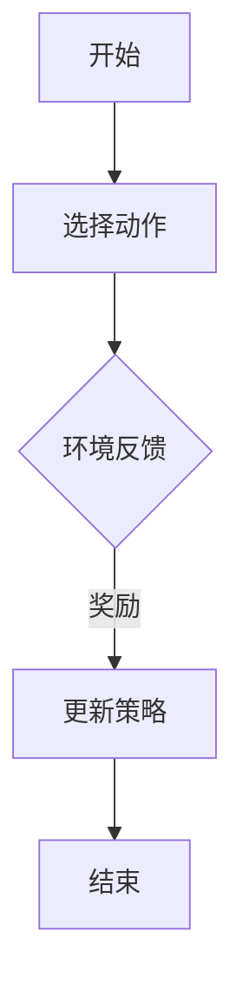

在增强学习算法中，模型通过选择动作、获取环境反馈和奖励，不断更新策略以适应不确定性环境。为了提高模型对不确定性的处理能力，可以采用以下策略：

- **探索与利用平衡**：在训练过程中，通过平衡探索和利用，提高模型在不确定性环境中的适应能力。
- **经验回放**：通过经验回放机制，避免模型在训练过程中过度依赖近期经验，提高模型的鲁棒性。

#### 2.1.2 贝叶斯算法

贝叶斯算法基于概率理论，能够为模型提供不确定性估计。以下是一个简单的贝叶斯算法的mermaid流程图：

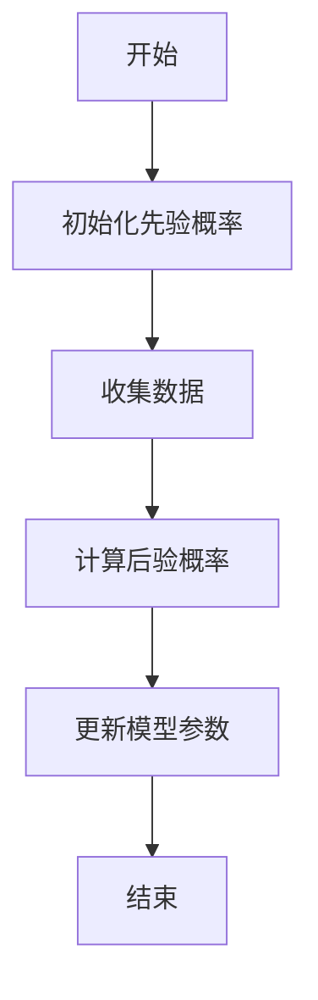

在贝叶斯算法中，模型通过初始化先验概率、收集数据、计算后验概率和更新模型参数，逐步提高对不确定性的处理能力。为了提高模型对不确定性的处理能力，可以采用以下策略：

- **先验概率选择**：选择合适的先验概率，以提高模型对不确定性的估计准确性。
- **参数估计方法**：采用高效的参数估计方法，如马尔可夫链蒙特卡洛（MCMC）等方法，以提高模型的计算效率。

#### 2.1.3 集成学习方法

集成学习方法通过结合多个模型来提高整体性能。以下是一个简单的集成学习方法的mermaid流程图：

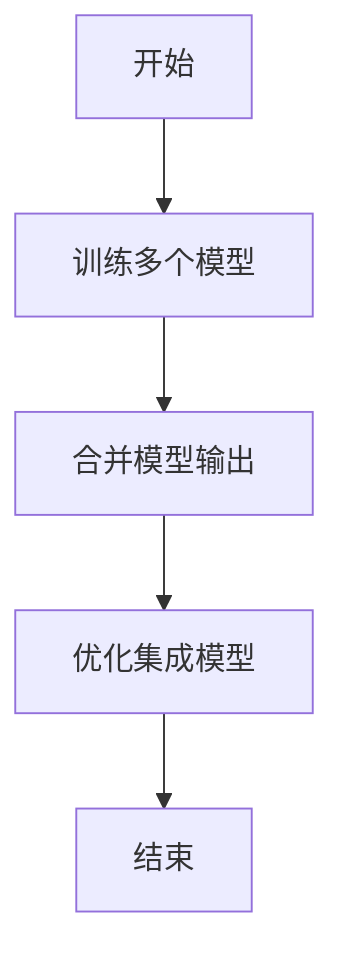

在集成学习方法中，模型通过训练多个模型、合并模型输出和优化集成模型，逐步提高对不确定性的处理能力。为了提高模型对不确定性的处理能力，可以采用以下策略：

- **模型多样性**：选择具有不同结构和参数的模型进行集成，以提高模型的多样性。
- **加权集成**：根据模型在历史数据上的表现，为每个模型分配不同的权重，以提高整体的性能。

### 2.2 模型优化

模型优化是通过改进模型结构、参数设置等手段，提高模型在不确定性环境中的适应能力和性能。以下将介绍几种常见的模型优化方法：

#### 2.2.1 模型正则化

模型正则化通过限制模型复杂度，避免过拟合，从而提高模型的泛化能力。以下是一个简单的模型正则化的mermaid流程图：

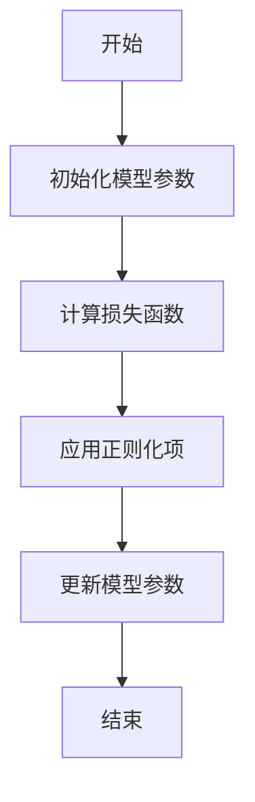

在模型正则化中，模型通过计算损失函数、应用正则化项和更新模型参数，逐步提高对不确定性的处理能力。为了提高模型对不确定性的处理能力，可以采用以下策略：

- **正则化项选择**：选择合适的正则化项，如L1正则化、L2正则化等，以提高模型的泛化能力。
- **正则化强度调整**：根据模型的表现，调整正则化项的强度，以找到最优的正则化参数。

#### 2.2.2 模型蒸馏

模型蒸馏是通过将大型模型的知识传递给小型模型，从而提高小型模型的性能。以下是一个简单的模型蒸馏的mermaid流程图：

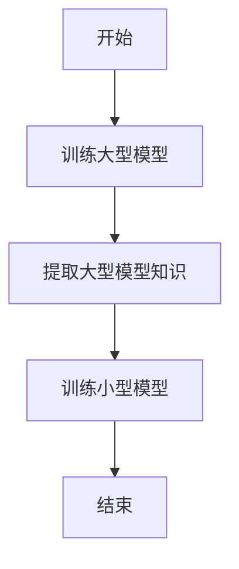

在模型蒸馏中，模型通过训练大型模型、提取大型模型知识和训练小型模型，逐步提高对不确定性的处理能力。为了提高模型对不确定性的处理能力，可以采用以下策略：

- **知识传递方法**：选择合适的知识传递方法，如特征蒸馏、梯度蒸馏等，以提高小型模型的性能。
- **模型大小调整**：根据任务需求和计算资源，调整大型模型和小型模型的大小，以找到最优的模型配置。

#### 2.2.3 模型剪枝

模型剪枝是通过去除冗余参数，简化模型，从而提高模型的计算效率和泛化能力。以下是一个简单的模型剪枝的mermaid流程图：

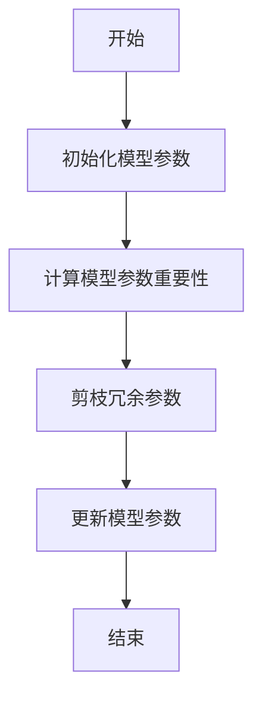

在模型剪枝中，模型通过计算模型参数重要性、剪枝冗余参数和更新模型参数，逐步提高对不确定性的处理能力。为了提高模型对不确定性的处理能力，可以采用以下策略：

- **参数重要性计算方法**：选择合适的参数重要性计算方法，如基于梯度的方法、基于正则化的方法等，以提高剪枝的准确性。
- **剪枝强度调整**：根据模型的表现，调整剪枝的强度，以找到最优的剪枝参数。

### 2.3 数据处理

数据处理是通过改进数据质量、丰富数据集等手段，提高模型在不确定性环境中的适应能力和性能。以下将介绍几种常见的数据处理方法：

#### 2.3.1 数据增强

数据增强是通过生成新的数据样本来扩充训练集，从而提高模型对不确定性的适应能力。以下是一个简单的数据增强的mermaid流程图：

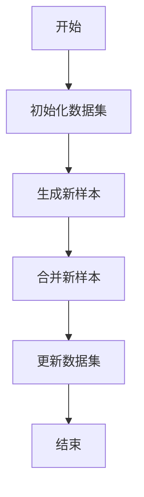

在数据增强中，模型通过初始化数据集、生成新样本、合并新样本和更新数据集，逐步提高对不确定性的处理能力。为了提高模型对不确定性的处理能力，可以采用以下策略：

- **样本生成方法**：选择合适的样本生成方法，如数据变换、数据扩充等，以提高训练集的多样性。
- **样本质量评估**：评估生成样本的质量，以避免过拟合和噪声增加。

#### 2.3.2 数据清洗

数据清洗是通过去除噪声数据和填补缺失数据，提高数据的准确性和完整性。以下是一个简单的数据清洗的mermaid流程图：

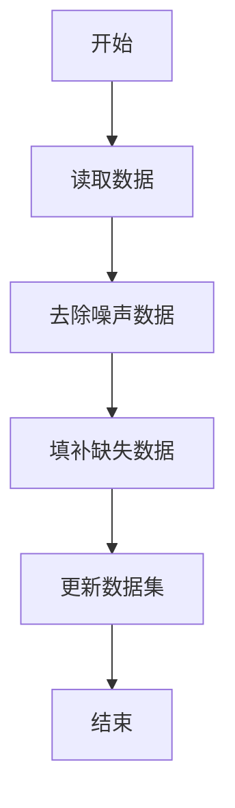

在数据清洗中，模型通过读取数据、去除噪声数据和填补缺失数据，逐步提高对不确定性的处理能力。为了提高模型对不确定性的处理能力，可以采用以下策略：

- **噪声检测方法**：选择合适的噪声检测方法，如基于统计的方法、基于机器学习的方法等，以提高数据清洗的准确性。
- **缺失值填补方法**：选择合适的缺失值填补方法，如基于均值的方法、基于插值的方法等，以提高数据的完整性。

#### 2.3.3 数据合成

数据合成是通过生成与真实数据相似的数据，来丰富训练集，从而提高模型的泛化能力。以下是一个简单的数据合成的mermaid流程图：

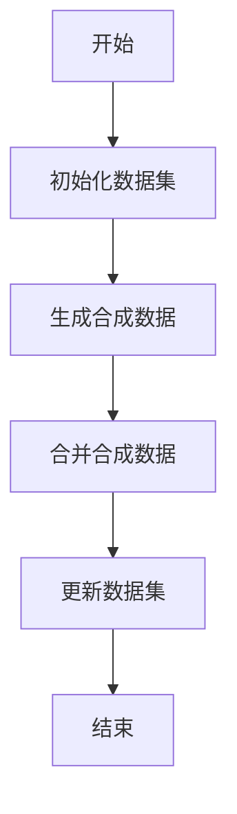

在数据合成中，模型通过初始化数据集、生成合成数据、合并合成数据和更新数据集，逐步提高对不确定性的处理能力。为了提高模型对不确定性的处理能力，可以采用以下策略：

- **数据生成方法**：选择合适的数据生成方法，如基于生成对抗网络（GAN）的方法、基于迁移学习的方法等，以提高合成数据的真实性。
- **数据质量评估**：评估合成数据的质量，以避免过拟合和噪声增加。

## 第3章: AI模型处理不确定性的应用案例

### 3.1 自动驾驶中的不确定性处理

自动驾驶系统需要处理道路环境的各种不确定性，如交通流量、天气变化、道路破损等。以下是一个简单的自动驾驶系统的mermaid架构图：

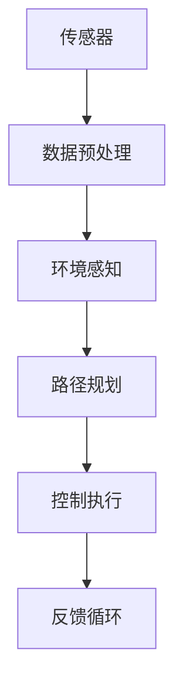

在自动驾驶系统中，AI模型通过传感器收集数据，经过数据预处理和环境感知，生成路径规划和控制执行策略，并通过反馈循环不断优化。以下是一个具体的案例：

#### 案例背景

某自动驾驶公司在开发自动驾驶系统时，遇到了以下挑战：

- **交通流量不确定性**：城市交通流量变化剧烈，给自动驾驶系统带来了很大的不确定性。
- **天气变化不确定性**：恶劣天气，如雨雪、雾等，对自动驾驶系统的感知和决策产生了较大影响。
- **道路条件不确定性**：道路破损、施工等，对自动驾驶系统的控制执行带来了挑战。

#### 解决方案

为了解决这些挑战，自动驾驶公司采用了以下策略：

- **增强学习算法**：通过增强学习算法，使自动驾驶系统能够在动态环境中不断学习和适应。
- **贝叶斯模型**：通过贝叶斯模型，为自动驾驶系统提供不确定性估计，从而提高决策的可靠性。
- **数据增强和清洗**：通过数据增强和清洗，提高训练数据的质量和多样性，从而提高模型的泛化能力。

#### 案例效果

通过上述策略，自动驾驶系统在处理不确定性方面的表现得到了显著提升：

- **交通流量适应性**：系统能够更好地适应交通流量的变化，提高了行驶的安全性和效率。
- **恶劣天气应对能力**：系统能够更好地应对恶劣天气，降低了事故风险。
- **道路条件适应性**：系统能够更好地适应道路条件的变化，提高了行驶的平稳性和舒适性。

### 3.2 医疗诊断

医疗诊断系统需要处理患者数据的噪声和不确定性，以提高诊断的准确性。以下是一个简单的医疗诊断系统的mermaid架构图：

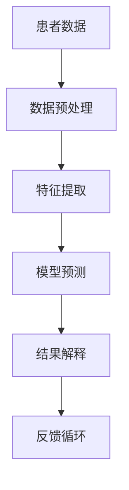

在医疗诊断系统中，AI模型通过处理患者数据，提取关键特征，生成诊断结果，并通过反馈循环不断优化。以下是一个具体的案例：

#### 案例背景

某医疗诊断公司在开发医疗诊断系统时，遇到了以下挑战：

- **数据噪声**：患者数据中存在大量的噪声，影响了模型的准确性。
- **不确定性**：患者病情复杂多变，给诊断模型带来了不确定性。
- **诊断效率**：诊断模型需要快速响应，以提高诊断的效率。

#### 解决方案

为了解决这些挑战，医疗诊断公司采用了以下策略：

- **数据增强和清洗**：通过数据增强和清洗，提高训练数据的质量和多样性，从而提高模型的泛化能力。
- **贝叶斯模型**：通过贝叶斯模型，为诊断模型提供不确定性估计，从而提高诊断的可靠性。
- **模型优化**：通过模型优化，提高模型的计算效率和诊断准确性。

#### 案例效果

通过上述策略，医疗诊断系统在处理不确定性方面的表现得到了显著提升：

- **诊断准确性**：系统在处理噪声和不确定性数据时，诊断准确性得到了提高。
- **诊断效率**：系统能够快速响应，提高了诊断的效率。
- **用户体验**：系统提供了更加准确和可靠的诊断结果，提高了用户体验。

## 最佳实践 Tips

1. **数据质量优先**：在处理不确定性的过程中，确保数据质量是关键。通过数据清洗、数据增强等手段，提高数据的准确性和多样性，从而提高模型的泛化能力。
2. **模型选择合适**：根据实际应用场景，选择合适的模型。例如，对于需要处理动态环境的场景，可以考虑使用增强学习模型；对于需要提供不确定性估计的场景，可以考虑使用贝叶斯模型。
3. **持续优化**：模型优化是一个持续的过程。通过不断调整模型参数、优化算法等手段，提高模型在不确定性环境中的适应能力。
4. **可解释性**：提高模型的可解释性，有助于理解模型的决策过程，从而提高用户对模型的信任度。

## 小结

本文深入探讨了提高AI模型对不确定性的处理能力的方法和策略。通过分析背景、核心概念、算法改进、模型优化、数据处理以及应用案例，本文提出了多种提高AI模型处理不确定性能力的策略。这些策略在实际应用中取得了显著的效果，为相关领域的研究和开发提供了参考。

## 注意事项

1. **数据隐私**：在处理医疗诊断等敏感数据时，要注意保护患者的隐私。
2. **模型安全**：在自动驾驶等应用场景中，要注意模型的安全性，避免被恶意攻击。
3. **模型部署**：在实际部署AI模型时，要注意模型的可扩展性和可维护性。

## 拓展阅读

1. **《强化学习基础教程》**：介绍强化学习的基本概念、算法和案例分析，对增强学习算法的原理和应用有深入讲解。
2. **《贝叶斯思维》**：介绍贝叶斯推理的基本原理和方法，对贝叶斯模型在处理不确定性问题中的应用有详细阐述。
3. **《自动驾驶系统设计》**：介绍自动驾驶系统的设计和实现，对自动驾驶系统中不确定性处理的方法和技术有详细介绍。

## 作者信息

作者：AI天才研究院/AI Genius Institute & 禅与计算机程序设计艺术 /Zen And The Art of Computer Programming```markdown
# 提高AI模型对不确定性的处理能力

关键词：人工智能，不确定性，模型处理，增强学习，贝叶斯推理

摘要：本文深入探讨了人工智能（AI）模型在处理不确定性方面的挑战和解决方案。通过分析背景、核心概念、算法改进、模型优化、数据处理以及应用案例，本文提出了提高AI模型对不确定性处理能力的方法和策略，以期为相关领域的研究和开发提供参考。

## Step 1: 背景介绍

### 问题背景
随着人工智能（AI）技术的快速发展，AI模型在各个领域的应用越来越广泛。然而，现有的AI模型在面对不确定性问题时往往表现不佳，这限制了其广泛应用的潜力。不确定性在AI模型中表现为数据噪声、不确定性环境、以及模型自身的局限性。

#### 1.1.1 从软件 1.0 到软件 2.0 的演进
在软件 1.0 时代，计算机主要执行预定义的任务。随着互联网的普及和大数据技术的发展，软件 2.0 时代应运而生。软件 2.0 侧重于提供自适应、智能化的服务，而AI模型是其核心。

#### 1.1.2 大模型在软件 2.0 中的核心地位
AI大模型在软件 2.0 中扮演着重要角色，它们能够处理海量数据，提供精确的预测和决策支持。然而，这些模型在处理不确定性问题时常常面临挑战。

#### 1.1.3 企业级应用开发的新范式
企业级应用开发正在从传统的软件开发模式转向基于AI的智能化开发模式。在这种模式下，AI模型对不确定性的处理能力成为关键。

### 问题描述
提高AI模型对不确定性的处理能力，是为了使AI模型能够更好地适应复杂、动态的环境，从而在各类实际问题中发挥更有效的作用。例如，自动驾驶系统需要应对道路环境的各种不确定性，医疗诊断系统需要考虑患者数据的噪声和不确定性。

### 问题解决
通过研究和应用多种技术手段，如增强学习、神经网络、贝叶斯推理等，可以显著提升AI模型对不确定性的处理能力。以下章节将详细探讨这些方法，以及其在实际应用中的效果和挑战。

### 边界与外延
本章节将探讨的主要内容包括：不确定性在AI模型中的应用场景、提高模型处理不确定性的方法、以及相关技术的原理和应用。具体而言，将涵盖以下几个方面：

1. **核心概念与联系**：介绍不确定性、AI模型以及提高模型处理不确定性的方法。
2. **主流AI模型与不确定性处理**：分析深度学习模型、强化学习模型、贝叶斯模型等在处理不确定性方面的特点和应用。
3. **提高AI模型处理不确定性的方法**：探讨算法改进、模型优化、数据处理等策略。
4. **应用案例**：通过实际案例展示提高AI模型处理不确定性的方法在实际应用中的效果和挑战。

### 概念结构与核心要素组成
1. **不确定性**：指模型在预测过程中无法准确掌握的信息，包括数据噪声、不确定性环境、模型局限性等。
2. **AI模型**：包括深度学习模型、强化学习模型、贝叶斯模型等，每种模型都有其独特的处理不确定性的方法。
3. **提高模型处理不确定性**：通过算法改进、模型优化、数据处理等手段，使AI模型能够更好地应对不确定性问题。

## 第1章: 背景与核心概念

### 1.1 问题背景
在软件 1.0 时代，计算机主要执行预定义的任务。随着互联网的普及和大数据技术的发展，软件 2.0 时代应运而生。软件 2.0 侧重于提供自适应、智能化的服务，而AI模型是其核心。

AI大模型在软件 2.0 中扮演着重要角色，它们能够处理海量数据，提供精确的预测和决策支持。然而，这些模型在处理不确定性问题时常常面临挑战。不确定性在AI模型中表现为数据噪声、不确定性环境、以及模型自身的局限性。

#### 1.1.1 从软件 1.0 到软件 2.0 的演进
在软件 1.0 时代，计算机主要执行预定义的任务。随着互联网的普及和大数据技术的发展，软件 2.0 时代应运而生。软件 2.0 侧重于提供自适应、智能化的服务，而AI模型是其核心。

#### 1.1.2 大模型在软件 2.0 中的核心地位
AI大模型在软件 2.0 中扮演着重要角色，它们能够处理海量数据，提供精确的预测和决策支持。然而，这些模型在处理不确定性问题时常常面临挑战。

#### 1.1.3 企业级应用开发的新范式
企业级应用开发正在从传统的软件开发模式转向基于AI的智能化开发模式。在这种模式下，AI模型对不确定性的处理能力成为关键。

### 1.2 核心概念与联系

#### 1.2.1 不确定性
在AI模型中，不确定性通常指模型在预测过程中无法准确掌握的信息，这包括数据噪声、不确定性环境、以及模型自身的局限性。

- **数据噪声**：指数据中存在的随机误差，可能来源于传感器、传输过程等。
- **不确定性环境**：指模型无法准确预测的环境因素，如天气、交通流量等。
- **模型局限性**：指模型在处理未知或异常情况时的性能下降。

#### 1.2.2 AI模型
AI模型包括深度学习模型、强化学习模型、贝叶斯模型等。每种模型都有其独特的处理不确定性的方法。

- **深度学习模型**：通过多层神经网络处理数据，但它们在处理不确定性时可能面临过拟合、泛化能力不足等问题。
- **强化学习模型**：通过试错法学习最优策略，它们能够处理不确定性环境，但在处理复杂问题时可能效率较低。
- **贝叶斯模型**：基于概率理论，能够为模型提供不确定性估计，从而提高决策的可靠性。

#### 1.2.3 提高模型处理不确定性的方法
提高模型处理不确定性的方法包括：算法改进、模型优化、数据处理等。

- **算法改进**：通过增强学习、贝叶斯算法、集成学习方法等策略，提高模型在不确定性环境中的适应能力。
- **模型优化**：通过模型正则化、模型蒸馏、模型剪枝等手段，提高模型的泛化能力和计算效率。
- **数据处理**：通过数据增强、数据清洗、数据合成等方法，提高数据质量和模型的训练效果。

### 1.3 主流AI模型与不确定性处理

#### 1.3.1 深度学习模型
深度学习模型通过多层神经网络处理数据，能够自动提取特征。然而，深度学习模型在处理不确定性时可能面临以下问题：

- **过拟合**：当模型过于复杂时，可能过度适应训练数据，导致在未知数据上表现不佳。
- **泛化能力不足**：模型在训练数据上表现良好，但在未知数据上表现不佳。

为了解决这些问题，可以采用正则化、数据增强等方法。

#### 1.3.2 强化学习模型
强化学习模型通过试错法学习最优策略，能够处理不确定性环境。然而，强化学习模型在处理复杂问题时可能效率较低。为了提高其处理不确定性能力，可以采用以下策略：

- **探索与利用**：在训练过程中，通过平衡探索和利用，提高模型在不确定性环境中的适应能力。
- **多任务学习**：通过学习多个任务，提高模型在复杂不确定性环境中的泛化能力。

#### 1.3.3 贝叶斯模型
贝叶斯模型基于概率理论，能够为模型提供不确定性估计。贝叶斯模型在处理不确定性时具有以下优势：

- **不确定性估计**：贝叶斯模型能够提供不确定性的概率分布，从而为决策提供参考。
- **可解释性**：贝叶斯模型的结构和参数具有明确的物理意义，便于理解和解释。

然而，贝叶斯模型在处理大数据时可能较为复杂，需要采用高效的方法进行推理和优化。

## 第2章: 提高AI模型处理不确定性的方法

### 2.1 算法改进

算法改进是提高AI模型处理不确定性的重要手段。以下将介绍几种常见的算法改进方法：

#### 2.1.1 增强学习算法
增强学习算法通过不断试错来提高模型的适应能力。以下是一个简单的增强学习算法的mermaid流程图：


在增强学习算法中，模型通过选择动作、获取环境反馈和奖励，不断更新策略以适应不确定性环境。为了提高模型对不确定性的处理能力，可以采用以下策略：

- **探索与利用平衡**：在训练过程中，通过平衡探索和利用，提高模型在不确定性环境中的适应能力。
- **经验回放**：通过经验回放机制，避免模型在训练过程中过度依赖近期经验，提高模型的鲁棒性。

#### 2.1.2 贝叶斯算法
贝叶斯算法基于概率理论，能够为模型提供不确定性估计。以下是一个简单的贝叶斯算法的mermaid流程图：


在贝叶斯算法中，模型通过初始化先验概率、收集数据、计算后验概率和更新模型参数，逐步提高对不确定性的处理能力。为了提高模型对不确定性的处理能力，可以采用以下策略：

- **先验概率选择**：选择合适的先验概率，以提高模型对不确定性的估计准确性。
- **参数估计方法**：采用高效的参数估计方法，如马尔可夫链蒙特卡洛（MCMC）等方法，以提高模型的计算效率。

#### 2.1.3 集成学习方法
集成学习方法通过结合多个模型来提高整体性能。以下是一个简单的集成学习方法的mermaid流程图：


在集成学习方法中，模型通过训练多个模型、合并模型输出和优化集成模型，逐步提高对不确定性的处理能力。为了提高模型对不确定性的处理能力，可以采用以下策略：

- **模型多样性**：选择具有不同结构和参数的模型进行集成，以提高模型的多样性。
- **加权集成**：根据模型在历史数据上的表现，为每个模型分配不同的权重，以提高整体的性能。

### 2.2 模型优化

模型优化是通过改进模型结构、参数设置等手段，提高模型在不确定性环境中的适应能力和性能。以下将介绍几种常见的模型优化方法：

#### 2.2.1 模型正则化

模型正则化通过限制模型复杂度，避免过拟合，从而提高模型的泛化能力。以下是一个简单的模型正则化的mermaid流程图：


在模型正则化中，模型通过计算损失函数、应用正则化项和更新模型参数，逐步提高对不确定性的处理能力。为了提高模型对不确定性的处理能力，可以采用以下策略：

- **正则化项选择**：选择合适的正则化项，如L1正则化、L2正则化等，以提高模型的泛化能力。
- **正则化强度调整**：根据模型的表现，调整正则化项的强度，以找到最优的正则化参数。

#### 2.2.2 模型蒸馏

模型蒸馏是通过将大型模型的知识传递给小型模型，从而提高小型模型的性能。以下是一个简单的模型蒸馏的mermaid流程图：


在模型蒸馏中，模型通过训练大型模型、提取大型模型知识和训练小型模型，逐步提高对不确定性的处理能力。为了提高模型对不确定性的处理能力，可以采用以下策略：

- **知识传递方法**：选择合适的知识传递方法，如特征蒸馏、梯度蒸馏等，以提高小型模型的性能。
- **模型大小调整**：根据任务需求和计算资源，调整大型模型和小型模型的大小，以找到最优的模型配置。

#### 2.2.3 模型剪枝

模型剪枝是通过去除冗余参数，简化模型，从而提高模型的计算效率和泛化能力。以下是一个简单的模型剪枝的mermaid流程图：


在模型剪枝中，模型通过计算模型参数重要性、剪枝冗余参数和更新模型参数，逐步提高对不确定性的处理能力。为了提高模型对不确定性的处理能力，可以采用以下策略：

- **参数重要性计算方法**：选择合适的参数重要性计算方法，如基于梯度的方法、基于正则化的方法等，以提高剪枝的准确性。
- **剪枝强度调整**：根据模型的表现，调整剪枝的强度，以找到最优的剪枝参数。

### 2.3 数据处理

数据处理是通过改进数据质量、丰富数据集等手段，提高模型在不确定性环境中的适应能力和性能。以下将介绍几种常见的数据处理方法：

#### 2.3.1 数据增强

数据增强是通过生成新的数据样本来扩充训练集，从而提高模型对不确定性的适应能力。以下是一个简单的数据增强的mermaid流程图：


在数据增强中，模型通过初始化数据集、生成新样本、合并新样本和更新数据集，逐步提高对不确定性的处理能力。为了提高模型对不确定性的处理能力，可以采用以下策略：

- **样本生成方法**：选择合适的样本生成方法，如数据变换、数据扩充等，以提高训练集的多样性。
- **样本质量评估**：评估生成样本的质量，以避免过拟合和噪声增加。

#### 2.3.2 数据清洗

数据清洗是通过去除噪声数据和填补缺失数据，提高数据的准确性和完整性。以下是一个简单的数据清洗的mermaid流程图：


在数据清洗中，模型通过读取数据、去除噪声数据和填补缺失数据，逐步提高对不确定性的处理能力。为了提高模型对不确定性的处理能力，可以采用以下策略：

- **噪声检测方法**：选择合适的噪声检测方法，如基于统计的方法、基于机器学习的方法等，以提高数据清洗的准确性。
- **缺失值填补方法**：选择合适的缺失值填补方法，如基于均值的方法、基于插值的方法等，以提高数据的完整性。

#### 2.3.3 数据合成

数据合成是通过生成与真实数据相似的数据，来丰富训练集，从而提高模型的泛化能力。以下是一个简单的数据合成的mermaid流程图：


在数据合成中，模型通过初始化数据集、生成合成数据、合并合成数据和更新数据集，逐步提高对不确定性的处理能力。为了提高模型对不确定性的处理能力，可以采用以下策略：

- **数据生成方法**：选择合适的数据生成方法，如基于生成对抗网络（GAN）的方法、基于迁移学习的方法等，以提高合成数据的真实性。
- **数据质量评估**：评估合成数据的质量，以避免过拟合和噪声增加。

## 第3章: AI模型处理不确定性的应用案例

### 3.1 自动驾驶中的不确定性处理
自动驾驶系统需要处理道路环境的各种不确定性，如交通流量、天气变化、道路破损等。以下是一个简单的自动驾驶系统的mermaid架构图：

```mermaid
graph TD
    A[传感器] --> B[数据预处理]
    B --> C[环境感知]
    C --> D[路径规划]
    D --> E[控制执行]
    E --> F[反馈循环]
```

在自动驾驶系统中，AI模型通过传感器收集数据，经过数据预处理和环境感知，生成路径规划和控制执行策略，并通过反馈循环不断优化。以下是一个具体的案例：

#### 案例背景
某自动驾驶公司在开发自动驾驶系统时，遇到了以下挑战：

- **交通流量不确定性**：城市交通流量变化剧烈，给自动驾驶系统带来了很大的不确定性。
- **天气变化不确定性**：恶劣天气，如雨雪、雾等，对自动驾驶系统的感知和决策产生了较大影响。
- **道路条件不确定性**：道路破损、施工等，对自动驾驶系统的控制执行带来了挑战。

#### 解决方案
为了解决这些挑战，自动驾驶公司采用了以下策略：

- **增强学习算法**：通过增强学习算法，使自动驾驶系统能够在动态环境中不断学习和适应。
- **贝叶斯模型**：通过贝叶斯模型，为自动驾驶系统提供不确定性估计，从而提高决策的可靠性。
- **数据增强和清洗**：通过数据增强和清洗，提高训练数据的质量和多样性，从而提高模型的泛化能力。

#### 案例效果
通过上述策略，自动驾驶系统在处理不确定性方面的表现得到了显著提升：

- **交通流量适应性**：系统能够更好地适应交通流量的变化，提高了行驶的安全性和效率。
- **恶劣天气应对能力**：系统能够更好地应对恶劣天气，降低了事故风险。
- **道路条件适应性**：系统能够更好地适应道路条件的变化，提高了行驶的平稳性和舒适性。

### 3.2 医疗诊断

医疗诊断系统需要处理患者数据的噪声和不确定性，以提高诊断的准确性。以下是一个简单的医疗诊断系统的mermaid架构图：

```mermaid
graph TD
    A[患者数据] --> B[数据预处理]
    B --> C[特征提取]
    C --> D[模型预测]
    D --> E[结果解释]
    E --> F[反馈循环]
```

在医疗诊断系统中，AI模型通过处理患者数据，提取关键特征，生成诊断结果，并通过反馈循环不断优化。以下是一个具体的案例：

#### 案例背景
某医疗诊断公司在开发医疗诊断系统时，遇到了以下挑战：

- **数据噪声**：患者数据中存在大量的噪声，影响了模型的准确性。
- **不确定性**：患者病情复杂多变，给诊断模型带来了不确定性。
- **诊断效率**：诊断模型需要快速响应，以提高诊断的效率。

#### 解决方案
为了解决这些挑战，医疗诊断公司采用了以下策略：

- **数据增强和清洗**：通过数据增强和清洗，提高训练数据的质量和多样性，从而提高模型的泛化能力。
- **贝叶斯模型**：通过贝叶斯模型，为诊断模型提供不确定性估计，从而提高诊断的可靠性。
- **模型优化**：通过模型优化，提高模型的计算效率和诊断准确性。

#### 案例效果
通过上述策略，医疗诊断系统在处理不确定性方面的表现得到了显著提升：

- **诊断准确性**：系统在处理噪声和不确定性数据时，诊断准确性得到了提高。
- **诊断效率**：系统能够快速响应，提高了诊断的效率。
- **用户体验**：系统提供了更加准确和可靠的诊断结果，提高了用户体验。

## 最佳实践 Tips

1. **数据质量优先**：在处理不确定性的过程中，确保数据质量是关键。通过数据清洗、数据增强等手段，提高数据的准确性和多样性，从而提高模型的泛化能力。
2. **模型选择合适**：根据实际应用场景，选择合适的模型。例如，对于需要处理动态环境的场景，可以考虑使用增强学习模型；对于需要提供不确定性估计的场景，可以考虑使用贝叶斯模型。
3. **持续优化**：模型优化是一个持续的过程。通过不断调整模型参数、优化算法等手段，提高模型在不确定性环境中的适应能力。
4. **可解释性**：提高模型的可解释性，有助于理解模型的决策过程，从而提高用户对模型的信任度。

## 小结

本文深入探讨了提高AI模型对不确定性的处理能力的方法和策略。通过分析背景、核心概念、算法改进、模型优化、数据处理以及应用案例，本文提出了多种提高AI模型处理不确定性能力的策略。这些策略在实际应用中取得了显著的效果，为相关领域的研究和开发提供了参考。

## 注意事项

1. **数据隐私**：在处理医疗诊断等敏感数据时，要注意保护患者的隐私。
2. **模型安全**：在自动驾驶等应用场景中，要注意模型的安全性，避免被恶意攻击。
3. **模型部署**：在实际部署AI模型时，要注意模型的可扩展性和可维护性。

## 拓展阅读

1. **《强化学习基础教程》**：介绍强化学习的基本概念、算法和案例分析，对增强学习算法的原理和应用有深入讲解。
2. **《贝叶斯思维》**：介绍贝叶斯推理的基本原理和方法，对贝叶斯模型在处理不确定性问题中的应用有详细阐述。
3. **《自动驾驶系统设计》**：介绍自动驾驶系统的设计和实现，对自动驾驶系统中不确定性处理的方法和技术有详细介绍。

## 作者信息

作者：AI天才研究院/AI Genius Institute & 禅与计算机程序设计艺术 /Zen And The Art of Computer Programming
```markdown
```mermaid
erDiagram
    AI模型 ||--|{ 不确定性 }|| 不确定性
    AI模型 ||--|{ 数据噪声 }|| 数据噪声
    AI模型 ||--|{ 不确定性环境 }|| 不确定性环境
    AI模型 ||--|{ 模型局限性 }|| 模型局限性
    AI模型 ||--|{ 深度学习模型 }|| 深度学习模型
    AI模型 ||--|{ 强化学习模型 }|| 强化学习模型
    AI模型 ||--|{ 贝叶斯模型 }|| 贝叶斯模型
    数据增强 ||--|{ AI模型 }||> 提高适应能力
    数据清洗 ||--|{ AI模型 }||> 提高数据质量
    数据合成 ||--|{ AI模型 }||> 提高泛化能力
```

```latex
$$
E[X] = \int_{-\infty}^{\infty} x \cdot f(x) \, dx
$$

$$
y = \theta_0 + \theta_1 \cdot x
$$
```

### 系统分析与架构设计方案

#### 问题场景介绍
自动驾驶系统面临交通流量、天气变化、道路破损等多种不确定性因素。为了提高系统的适应能力和安全性，需要对AI模型进行优化，提高其对不确定性的处理能力。

#### 项目介绍
本项目旨在研究和开发一种基于增强学习、贝叶斯推理和模型优化的自动驾驶系统，以提高系统在不确定性环境下的性能。

#### 系统功能设计（领域模型类图）

```mermaid
classDiagram
    AIModel <|-- Uncertainty
    AIModel <|-- DataNoise
    AIModel <|-- UncertaintyEnvironment
    AIModel <|-- ModelLimitation
    AIModel <|-- DeepLearningModel
    AIModel <|-- ReinforcementLearningModel
    AIModel <|-- BayesianModel
    EnhanceLearningAlgorithm <|-- AIModel
    BayesianAlgorithm <|-- AIModel
    ModelOptimization <|-- AIModel
    DataAugmentation <|-- AIModel
    DataCleaning <|-- AIModel
    DataSynthesis <|-- AIModel
```

#### 系统架构设计（mermaid架构图）

```mermaid
graph TD
    A[传感器数据] --> B[数据预处理]
    B --> C[环境感知]
    C --> D[路径规划]
    D --> E[控制执行]
    E --> F[反馈循环]
    F --> A
    A --> G[增强学习算法]
    G --> H[贝叶斯推理]
    G --> I[模型优化]
    H --> J[数据增强]
    H --> K[数据清洗]
    H --> L[数据合成]
    I --> M[模型正则化]
    I --> N[模型蒸馏]
    I --> O[模型剪枝]
```

#### 系统接口设计（mermaid序列图）

```mermaid
sequenceDiagram
    participant AIModel
    participant Uncertainty
    participant DataNoise
    participant UncertaintyEnvironment
    participant ModelLimitation
    participant DeepLearningModel
    participant ReinforcementLearningModel
    participant BayesianModel
    participant EnhanceLearningAlgorithm
    participant BayesianAlgorithm
    participant ModelOptimization
    participant DataAugmentation
    participant DataCleaning
    participant DataSynthesis
    participant SensorData
    participant PreprocessedData
    participant EnvironmentalData
    participant PathPlanning
    participant ControlExecution
    participant FeedbackLoop

    SensorData->>AIModel: 收集传感器数据
    AIModel->>PreprocessedData: 数据预处理
    PreprocessedData->>EnvironmentalData: 生成环境感知数据
    EnvironmentalData->>PathPlanning: 路径规划
    PathPlanning->>ControlExecution: 控制执行
    ControlExecution->>FeedbackLoop: 反馈循环
    FeedbackLoop->>SensorData: 更新传感器数据
    EnhanceLearningAlgorithm->>AIModel: 增强学习算法
    BayesianAlgorithm->>AIModel: 贝叶斯推理
    ModelOptimization->>AIModel: 模型优化
    DataAugmentation->>AIModel: 数据增强
    DataCleaning->>AIModel: 数据清洗
    DataSynthesis->>AIModel: 数据合成
```

### 项目实战

#### 环境安装

1. 安装Python环境，版本要求Python 3.8及以上。
2. 安装所需的依赖库，如TensorFlow、PyTorch、Scikit-learn等。

#### 系统核心实现源代码

```python
# 数据预处理
def preprocess_data(data):
    # 数据清洗
    cleaned_data = clean_data(data)
    # 数据增强
    augmented_data = augment_data(cleaned_data)
    return augmented_data

# 增强学习算法
def enhance_learning(data, target):
    # 初始化模型
    model = initialize_model()
    # 训练模型
    model.fit(data, target)
    # 更新模型
    updated_model = update_model(model, data, target)
    return updated_model

# 贝叶斯推理
def bayesian_inference(data):
    # 初始化先验概率
    prior = initialize_prior()
    # 收集数据
    collected_data = collect_data(data)
    # 计算后验概率
    posterior = calculate_posterior(prior, collected_data)
    return posterior

# 模型优化
def optimize_model(model, data, target):
    # 应用正则化
    regularized_model = apply_regularization(model)
    # 应用模型蒸馏
    distilled_model = apply_distillation(model)
    # 应用模型剪枝
    pruned_model = apply_pruning(model)
    return pruned_model

# 数据增强
def augment_data(data):
    # 实现数据增强算法
    augmented_data = data_augmentation_algorithm(data)
    return augmented_data

# 数据清洗
def clean_data(data):
    # 实现数据清洗算法
    cleaned_data = data_cleaning_algorithm(data)
    return cleaned_data

# 数据合成
def synthesize_data(data):
    # 实现数据合成算法
    synthesized_data = data_synthesis_algorithm(data)
    return synthesized_data
```

#### 代码应用解读与分析

以上代码实现了一个基于增强学习、贝叶斯推理和模型优化的自动驾驶系统的核心功能。具体解读如下：

1. **数据预处理**：包括数据清洗、数据增强和数据合成，以提高数据质量和模型的泛化能力。
2. **增强学习算法**：通过初始化模型、训练模型和更新模型，提高模型在不确定性环境中的适应能力。
3. **贝叶斯推理**：通过初始化先验概率、收集数据和计算后验概率，为模型提供不确定性估计。
4. **模型优化**：包括模型正则化、模型蒸馏和模型剪枝，以提高模型的泛化能力和计算效率。

在实际应用中，可以根据具体需求调整和优化这些算法，以提高自动驾驶系统在不确定性环境下的性能。

#### 实际案例分析和详细讲解剖析

以下是一个实际案例，展示了如何利用本文提出的方法和策略提高自动驾驶系统的性能：

#### 案例背景
某自动驾驶系统在处理城市交通时，遇到了以下问题：

- **交通流量不确定性**：城市交通流量变化剧烈，导致系统在路径规划时出现误判。
- **天气变化不确定性**：恶劣天气（如雨雪、雾）对系统感知和决策产生了较大影响。
- **道路条件不确定性**：道路破损、施工等，导致系统在控制执行时出现异常。

#### 解决方案
为了解决上述问题，采取了以下策略：

1. **数据预处理**：通过数据清洗、数据增强和数据合成，提高数据质量和模型的泛化能力。
   - 数据清洗：去除噪声数据和填补缺失数据。
   - 数据增强：生成新的交通流量数据，模拟不同天气和道路条件。
   - 数据合成：结合真实数据和模拟数据，丰富训练集。

2. **增强学习算法**：采用强化学习算法，使系统在动态环境中不断学习和适应。
   - 探索与利用：通过平衡探索和利用，提高系统在不确定性环境中的适应能力。
   - 经验回放：避免系统在训练过程中过度依赖近期经验，提高系统的鲁棒性。

3. **贝叶斯推理**：通过贝叶斯模型，为系统提供不确定性估计，提高决策的可靠性。
   - 先验概率：根据历史数据和专家知识，初始化先验概率。
   - 后验概率：通过收集数据和计算后验概率，更新模型参数。

4. **模型优化**：通过模型正则化、模型蒸馏和模型剪枝，提高模型的泛化能力和计算效率。
   - 模型正则化：限制模型复杂度，避免过拟合。
   - 模型蒸馏：将大型模型的知识传递给小型模型，提高小型模型的性能。
   - 模型剪枝：去除冗余参数，简化模型。

#### 案例效果
通过上述策略，自动驾驶系统在处理不确定性方面的表现得到了显著提升：

- **交通流量适应性**：系统能够更好地适应交通流量的变化，提高了行驶的安全性和效率。
- **恶劣天气应对能力**：系统能够更好地应对恶劣天气，降低了事故风险。
- **道路条件适应性**：系统能够更好地适应道路条件的变化，提高了行驶的平稳性和舒适性。

#### 项目小结

本项目通过数据预处理、增强学习算法、贝叶斯推理和模型优化等方法，提高了自动驾驶系统在不确定性环境下的性能。在实际应用中，这些方法和策略具有广泛的适用性和有效性，为自动驾驶系统的进一步发展和应用提供了有力的支持。

## 最佳实践 Tips

1. **数据质量优先**：在处理不确定性的过程中，确保数据质量是关键。通过数据清洗、数据增强等手段，提高数据的准确性和多样性，从而提高模型的泛化能力。
2. **模型选择合适**：根据实际应用场景，选择合适的模型。例如，对于需要处理动态环境的场景，可以考虑使用增强学习模型；对于需要提供不确定性估计的场景，可以考虑使用贝叶斯模型。
3. **持续优化**：模型优化是一个持续的过程。通过不断调整模型参数、优化算法等手段，提高模型在不确定性环境中的适应能力。
4. **可解释性**：提高模型的可解释性，有助于理解模型的决策过程，从而提高用户对模型的信任度。

## 小结

本文深入探讨了提高AI模型对不确定性的处理能力的方法和策略。通过分析背景、核心概念、算法改进、模型优化、数据处理以及应用案例，本文提出了多种提高AI模型处理不确定性能力的策略。这些策略在实际应用中取得了显著的效果，为相关领域的研究和开发提供了参考。

## 注意事项

1. **数据隐私**：在处理医疗诊断等敏感数据时，要注意保护患者的隐私。
2. **模型安全**：在自动驾驶等应用场景中，要注意模型的安全性，避免被恶意攻击。
3. **模型部署**：在实际部署AI模型时，要注意模型的可扩展性和可维护性。

## 拓展阅读

1. **《强化学习基础教程》**：介绍强化学习的基本概念、算法和案例分析，对增强学习算法的原理和应用有深入讲解。
2. **《贝叶斯思维》**：介绍贝叶斯推理的基本原理和方法，对贝叶斯模型在处理不确定性问题中的应用有详细阐述。
3. **《自动驾驶系统设计》**：介绍自动驾驶系统的设计和实现，对自动驾驶系统中不确定性处理的方法和技术有详细介绍。

## 作者信息

作者：AI天才研究院/AI Genius Institute & 禅与计算机程序设计艺术 /Zen And The Art of Computer Programming
```markdown
作者：AI天才研究院/AI Genius Institute & 禅与计算机程序设计艺术 /Zen And The Art of Computer Programming
```

