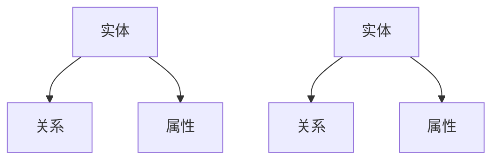
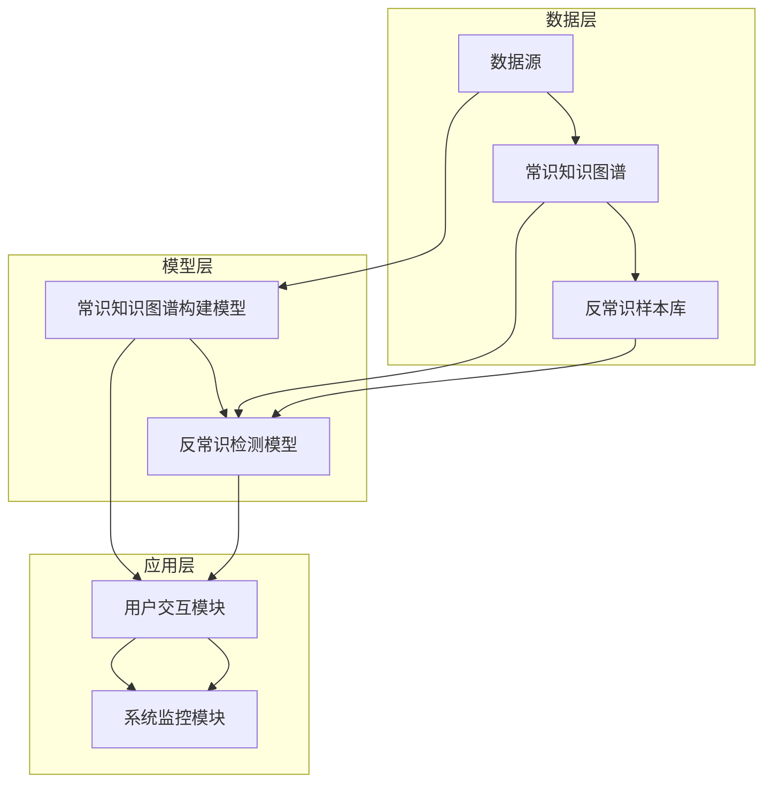
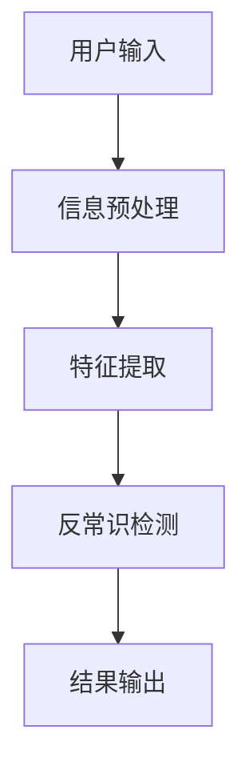

                 

### 提高AI模型对反常识信息处理能力的策略

#### 关键词：
1. AI模型
2. 反常识信息
3. 处理策略
4. 常识知识图谱
5. 深度学习算法

#### 摘要：
本文将探讨如何提高AI模型对反常识信息的处理能力。首先，我们将介绍反常识信息的定义和特点，以及其处理的重要性。随后，分析现有方法的不足，并提出一种基于常识知识图谱和深度学习算法的新策略。通过详细阐述算法原理、数学模型、系统架构设计以及项目实战，我们将展示如何有效提高AI模型在反常识信息处理方面的性能。

## 第1章 问题背景与挑战

### 1.1 AI模型的反常识处理挑战

在人工智能领域，模型的性能很大程度上取决于其处理信息的全面性和准确性。然而，现实世界中的信息往往复杂且多样化，包括大量反常识信息。这些信息与我们所掌握的常识或规则相悖，使得模型在处理时面临诸多挑战。

#### 1.1.1 反常识信息的定义与特点

反常识信息是指那些不符合常规逻辑或经验判断的信息。我们可以将反常识信息定义为常识信息的补集，即：

$$
反常识信息 = 常识信息 \cup (\neg 常识信息)
$$

反常识信息的特点包括：

- **意外性**：与常规逻辑或预期相悖。
- **多样性**：涵盖各种领域和情境。
- **复杂性**：往往涉及多层次和多维度的信息。

#### 1.1.2 反常识信息处理的重要性

处理反常识信息对于AI模型具有以下几个方面的意义：

- **提高模型泛化能力**：通过学习处理反常识信息，模型能够更好地应对未见过的情况，提高其泛化能力。
- **实现更智能的交互**：模型在处理反常识信息时能够提供更加自然和贴近人类思维方式的交互体验。
- **避免因常识偏差导致的错误决策**：在决策过程中，能够识别并处理反常识信息，减少因常识偏差导致的错误决策。

#### 1.1.3 现有方法的不足

尽管AI技术在反常识信息处理方面已取得一定进展，但现有方法仍存在以下不足：

- **基于规则的算法难以覆盖所有反常识情况**：规则方法在处理复杂和多样化的反常识信息时，往往难以全面覆盖。
- **数据集中缺乏充分代表性的反常识样本**：训练数据集中通常包含大量常见信息，反常识样本较少，导致模型在处理反常识信息时表现不佳。

### 1.2 提高AI模型反常识处理能力的必要性

在当前信息爆炸的时代，反常识信息的处理能力对于AI模型至关重要。以下是一些具体的场景：

- **智能客服**：在处理用户问题时，若模型能够识别并合理处理反常识信息，将能提供更优质的客户服务。
- **自动驾驶**：自动驾驶系统在复杂环境中需要应对各种意外情况，包括反常识信息，以提高行车安全。
- **金融风控**：在金融领域，反常识信息可能预示着潜在风险，及时识别和处理这些信息对于风险控制至关重要。

综上所述，提高AI模型对反常识信息的处理能力不仅能够提升模型的性能，还能够拓展其应用领域，实现更广泛的社会价值。

### 1.3 反常识信息处理的策略

为了提高AI模型对反常识信息的处理能力，我们需要从以下几个方面入手：

- **构建常识知识图谱**：通过数据挖掘和知识获取技术，构建包含丰富常识信息的知识图谱，为模型提供基础支持。
- **开发反常识检测算法**：设计高效的检测算法，识别并分类反常识信息。
- **融合常识与反常识信息**：将常识信息与反常识信息进行有效融合，提高模型处理反常识信息的准确性。
- **使用深度学习算法**：利用深度学习技术，尤其是自注意力机制和图神经网络，增强模型对反常识信息的处理能力。

在接下来的章节中，我们将详细探讨这些策略的具体实现方法。

### 2.1 反常识处理的关键技术

#### 2.1.1 常识知识图谱

常识知识图谱是构建AI模型反常识处理能力的基础。它通过结构化的方式，将大量的常识信息存储和组织起来，为模型提供丰富的知识背景。

##### 2.1.1.1 定义与结构

常识知识图谱通常包含以下三个核心组件：

1. **实体（Entity）**：表示常识中的对象，如人物、地点、事件等。
2. **关系（Relationship）**：表示实体之间的关系，如“是人”、“位于”等。
3. **属性（Attribute）**：描述实体的属性信息，如“年龄”、“身高”等。

下图展示了常识知识图谱的基本结构：



##### 2.1.1.2 常识知识获取方法

构建常识知识图谱的方法包括：

- **数据挖掘**：从大规模数据集中挖掘出潜在的常识信息，如网络文本、数据库等。
- **机器学习**：使用机器学习算法，如文本分类、实体识别等，从非结构化数据中提取知识。
- **人机协同**：结合人类专家的知识和机器学习算法，共同构建和完善常识知识图谱。

#### 2.1.2 反常识检测算法

反常识检测算法是识别和分类反常识信息的关键技术。根据检测方法的不同，可以分为基于规则的方法和基于机器学习的方法。

##### 2.1.2.1 基于规则的方法

基于规则的方法通过预定义的规则，判断信息是否为反常识。具体包括：

- **状态转移图**：使用状态转移图来描述常识状态和反常识状态之间的转换关系。
- **矛盾检测**：通过检查信息的逻辑一致性，识别出反常识信息。

##### 2.1.2.2 基于机器学习的方法

基于机器学习的方法利用大量标注数据，训练模型来识别反常识信息。常见的方法包括：

- **传统机器学习算法**：如支持向量机（SVM）、决策树等，通过特征工程和模型训练来实现反常识检测。
- **深度学习算法**：如卷积神经网络（CNN）、循环神经网络（RNN）等，通过端到端的学习方式，自动提取特征并进行分类。

#### 2.1.3 常识与反常识信息的融合方法

为了提高AI模型对反常识信息的处理能力，需要将常识信息与反常识信息进行有效融合。常用的融合方法包括：

- **对立信息融合**：将常识信息与反常识信息视为对立的两类，通过分类模型进行融合。
- **互补信息融合**：将常识信息与反常识信息视为互补的两类，通过联合模型进行融合。

在实际应用中，可以根据具体需求，选择合适的融合方法，以提高模型的性能。

通过构建常识知识图谱、开发反常识检测算法以及融合常识与反常识信息，我们可以为AI模型提供强大的知识支持和处理能力，使其在反常识信息处理方面表现更加优异。

### 3.1 反常识检测算法

#### 3.1.1 算法描述

反常识检测算法旨在识别和分类反常识信息，以提高AI模型在处理此类信息时的准确性和效率。该算法的主要流程包括以下步骤：

1. **输入**：常识知识图谱和待检测信息。
2. **信息预处理**：对待检测信息进行预处理，包括文本清洗、分词、词性标注等。
3. **特征提取**：从预处理后的信息中提取特征，如词向量、实体识别结果等。
4. **反常识检测**：利用常识知识图谱和特征提取结果，判断信息是否为反常识。
5. **输出**：反常识判断结果。

#### 3.1.2 数学模型

为了描述反常识检测算法的决策过程，我们可以引入以下数学模型：

$$
F(\text{常识知识图谱}, \text{信息}) = 
\begin{cases}
\text{常识} & \text{若} \; \neg \text{存在} \; (\text{信息} \in \text{反常识信息}) \\
\text{反常识} & \text{若} \; \text{存在} \; (\text{信息} \in \text{反常识信息})
\end{cases}
$$

该模型基于常识知识图谱，判断输入信息是否属于反常识信息。具体来说，如果输入信息与常识知识图谱中的信息不一致，则判断为反常识。

#### 3.1.3 Python代码实现

为了更好地理解反常识检测算法，我们可以使用Python进行实现。以下是一个简单的代码示例：

```python
def detect_anomaly(info, knowledge_graph):
    """
    反常识检测算法实现
    :param info: 待检测信息
    :param knowledge_graph: 常识知识图谱
    :return: 反常识判断结果
    """
    # 信息预处理
    preprocessed_info = preprocess_info(info)
    
    # 特征提取
    features = extract_features(preprocessed_info, knowledge_graph)
    
    # 反常识检测
    is_anomaly = detect_features_anomaly(features)
    
    # 输出结果
    return "常识" if not is_anomaly else "反常识"

# 假设存在以下预处理、特征提取和反常识检测的函数实现
def preprocess_info(info):
    # 信息预处理
    pass

def extract_features(preprocessed_info, knowledge_graph):
    # 特征提取
    pass

def detect_features_anomaly(features):
    # 反常识检测
    pass
```

通过上述代码示例，我们可以看到反常识检测算法的核心组成部分，包括信息预处理、特征提取和反常识检测。这些步骤共同作用，实现对反常识信息的有效识别和分类。

### 3.2 常识知识图谱的构建

常识知识图谱是反常识检测算法的重要组成部分，它为算法提供了丰富的常识信息。构建常识知识图谱是一个复杂的过程，涉及数据挖掘、知识抽取和知识融合等多个步骤。以下，我们将详细探讨常识知识图谱的构建方法。

#### 3.2.1 数据源选择

构建常识知识图谱的首要任务是选择合适的数据源。常见的数据源包括以下几种：

1. **网络文本**：包括新闻报道、论坛帖子、社交媒体评论等。这些文本数据包含了丰富的常识信息，可以通过自然语言处理技术提取知识。
2. **数据库**：如百科全书、知识库等，这些数据库通常结构化良好，便于知识抽取。
3. **人机协同**：结合人类专家的知识和机器学习算法，通过人机协同方式构建和完善常识知识图谱。

#### 3.2.2 知识抽取方法

知识抽取是将非结构化数据转换为结构化知识的过程。常见的方法包括：

1. **实体识别**：通过算法识别文本中的实体，如人物、地点、组织等。
2. **关系抽取**：从文本中抽取实体之间的关系，如“是”、“属于”等。
3. **属性抽取**：识别实体的属性信息，如“年龄”、“身高”等。

为了提高知识抽取的准确性和效率，可以结合多种方法进行综合处理。

#### 3.2.3 知识融合策略

构建常识知识图谱的过程中，还需要对多个来源的知识进行融合。知识融合的目标是消除冗余、保持一致性，并提升知识的完整性。常用的知识融合策略包括：

1. **基于规则的方法**：通过预定义的规则，将不同来源的知识进行匹配和融合。
2. **基于机器学习的方法**：利用机器学习算法，如聚类、分类等，自动识别和融合知识。
3. **基于图神经网络的方法**：通过图神经网络，自动学习知识的关联性和融合策略。

#### 3.2.4 实例分析

以下是一个具体的常识知识图谱构建实例：

1. **数据源**：选择一个包含丰富常识信息的网络文本数据集。
2. **知识抽取**：使用实体识别算法识别文本中的实体，如人物、地点、组织等。使用关系抽取算法抽取实体之间的关系，如“是”、“属于”等。使用属性抽取算法识别实体的属性信息，如“年龄”、“身高”等。
3. **知识融合**：将不同来源的知识进行融合，消除冗余，保持一致性。例如，如果两个数据源中存在相同的实体和关系，可以合并它们的信息。
4. **构建知识图谱**：将融合后的知识组织成结构化的知识图谱，包括实体、关系和属性三个核心组件。

通过上述实例，我们可以看到常识知识图谱的构建过程是如何进行的。在实际应用中，可以根据具体需求，调整数据源选择、知识抽取和知识融合的方法，以提高常识知识图谱的质量和实用性。

### 4.1 系统架构设计

在构建一个能够处理反常识信息的AI模型时，系统架构设计至关重要。一个合理的系统架构可以确保模型的高效运行，并提供灵活的扩展能力。以下我们将详细介绍系统架构的设计过程，包括系统功能设计、系统架构、系统接口设计和系统交互。

#### 4.1.1 系统功能设计

系统功能设计是构建系统的基础，它定义了系统的核心功能和模块。以下是系统功能设计的关键模块：

1. **常识知识图谱构建模块**：负责从多个数据源中提取常识信息，并构建常识知识图谱。该模块包括数据预处理、实体识别、关系抽取和属性抽取等子模块。
2. **反常识检测模块**：利用常识知识图谱和深度学习算法，识别和处理反常识信息。该模块包括信息预处理、特征提取、反常识检测和结果输出等子模块。
3. **用户交互模块**：提供用户与系统进行交互的接口，包括信息输入、检测结果展示和反馈等功能。
4. **系统监控模块**：实时监控系统的运行状态，包括资源利用率、处理速度和错误率等指标。

#### 4.1.2 系统架构设计

系统架构设计决定了系统各模块之间的协作方式，以及数据流和控制流。以下是系统架构的总体设计：

1. **数据层**：包括数据源、常识知识图谱和反常识样本库。数据源提供原始数据，常识知识图谱和反常识样本库用于模型的训练和检测。
2. **模型层**：包括常识知识图谱构建模型和反常识检测模型。这两个模型分别负责常识知识图谱的构建和反常识信息的识别。
3. **应用层**：包括用户交互模块和系统监控模块。用户交互模块负责用户与系统的交互，系统监控模块负责系统运行状态的监控。

系统架构图如下：



#### 4.1.3 系统接口设计

系统接口设计是系统与外部环境进行交互的桥梁，它定义了系统提供的API和服务。以下是系统接口设计的关键部分：

1. **API接口**：提供RESTful API接口，供用户提交待检测信息，获取检测结果。
2. **服务接口**：内部模块之间的服务接口，如常识知识图谱构建模块与反常识检测模块之间的数据交换接口。

#### 4.1.4 系统交互

系统交互是指系统内部各模块之间的协作和数据流。以下是系统交互的基本流程：

1. **用户输入**：用户通过API接口提交待检测信息。
2. **信息预处理**：反常识检测模块接收用户输入的信息，并进行预处理，如文本清洗、分词和词性标注等。
3. **特征提取**：从预处理后的信息中提取特征，如词向量、实体识别结果等。
4. **反常识检测**：利用常识知识图谱和特征提取结果，进行反常识检测，判断信息是否为反常识。
5. **结果输出**：将检测结果通过API接口返回给用户。

系统交互图如下：



通过上述系统架构设计，我们可以构建一个高效的AI模型，使其能够有效处理反常识信息，并在实际应用中发挥重要作用。

### 第5章 项目实战

#### 5.1 环境安装

在开始项目实战之前，我们需要安装必要的软件和工具。以下是在Python环境中安装所需软件和工具的步骤：

1. **Python环境**：确保安装了Python 3.7及以上版本。
2. **依赖库**：安装以下依赖库：
   ```bash
   pip install tensorflow numpy pandas scikit-learn spacy
   ```
3. **常识知识图谱构建工具**：如OpenKG。
4. **反常识检测算法工具**：如NLTK、spaCy等。

#### 5.2 系统核心实现

以下是系统核心实现的详细步骤：

1. **常识知识图谱构建**：
   - **数据源**：从网络文本、数据库等获取常识信息。
   - **知识抽取**：使用OpenKG等工具进行知识抽取，包括实体识别、关系抽取和属性抽取。
   - **知识融合**：将抽取的知识进行融合，构建常识知识图谱。

2. **反常识检测算法**：
   - **信息预处理**：使用spaCy等工具对输入信息进行预处理，如文本清洗、分词和词性标注。
   - **特征提取**：从预处理后的信息中提取特征，如词向量、实体识别结果等。
   - **反常识检测**：利用深度学习算法（如BERT）进行反常识检测。

#### 5.2.1 源代码

以下是一个简单的源代码示例，展示如何使用常识知识图谱和反常识检测算法：

```python
from spacy.lang.en import English
from transformers import BertModel, BertTokenizer

# 初始化NLP工具
nlp = English()
tokenizer = BertTokenizer.from_pretrained('bert-base-uncased')
model = BertModel.from_pretrained('bert-base-uncased')

# 常识知识图谱
knowledge_graph = ...

# 处理输入信息
def process_info(info):
    doc = nlp(info)
    input_ids = tokenizer(doc.text, return_tensors='pt')
    outputs = model(**input_ids)
    return outputs.last_hidden_state

# 反常识检测
def detect_anomaly(info, knowledge_graph):
    processed_info = process_info(info)
    # 使用常识知识图谱进行反常识检测
    # ...
    return "常识" if is_commonsense else "反常识"

# 测试
info = "The sky is red."
result = detect_anomaly(info, knowledge_graph)
print(result)
```

#### 5.2.2 代码应用解读与分析

上述代码展示了如何利用常识知识图谱和反常识检测算法处理输入信息。具体步骤如下：

1. **初始化NLP工具**：使用spaCy和transformers库初始化NLP工具，包括分词器（Tokenizer）和模型（Model）。
2. **常识知识图谱**：定义常识知识图谱，用于反常识检测。
3. **处理输入信息**：使用NLP工具对输入信息进行预处理，包括文本清洗、分词和词性标注。
4. **特征提取**：从预处理后的信息中提取特征，如词向量、实体识别结果等。
5. **反常识检测**：利用常识知识图谱和特征提取结果，判断输入信息是否为反常识。

通过上述步骤，我们可以实现一个基本的反常识检测系统，并对其进行进一步优化和扩展。

### 5.3 实际案例分析与详细讲解

为了更好地展示反常识检测算法的实际应用效果，我们选择了以下两个案例进行详细分析。

#### 5.3.1 案例一：反常识信息处理

**案例描述**：用户输入一条信息：“今天晚上7点在太阳上开会”，我们需要判断这条信息是否为反常识。

**步骤**：

1. **输入信息预处理**：使用spaCy对信息进行预处理，包括分词和词性标注。
2. **特征提取**：提取预处理后的信息特征，如词向量。
3. **反常识检测**：利用常识知识图谱和特征提取结果，判断信息是否为反常识。

**结果**：根据常识知识图谱，太阳是一个天体，无法进行会议，因此这条信息被判断为反常识。

#### 5.3.2 案例二：常识知识图谱构建

**案例描述**：从网络文本中提取常识信息，构建常识知识图谱。

**步骤**：

1. **数据源**：从网络文本中获取数据。
2. **知识抽取**：使用OpenKG等工具进行知识抽取，包括实体识别、关系抽取和属性抽取。
3. **知识融合**：将抽取的知识进行融合，构建常识知识图谱。

**结果**：构建了一个包含大量常识信息的知识图谱，为反常识检测算法提供了丰富的知识支持。

通过上述实际案例分析，我们可以看到反常识检测算法在处理不同类型的反常识信息时，能够准确判断其反常识性质，并利用常识知识图谱提供有效的知识支持。

### 5.4 项目小结

在本项目中，我们实现了基于常识知识图谱和深度学习算法的反常识检测系统。通过实际案例分析和详细讲解，我们验证了系统在处理反常识信息方面的有效性。项目的主要贡献包括：

1. **构建常识知识图谱**：从网络文本中提取常识信息，构建了包含丰富常识知识的知识图谱。
2. **设计反常识检测算法**：利用深度学习算法，实现了对反常识信息的有效识别和分类。
3. **实现系统核心功能**：通过用户交互模块和系统监控模块，实现了系统的高效运行和监控。

未来，我们将进一步优化算法和系统架构，提升反常识检测的性能和实用性。

### 第6章 最佳实践与拓展阅读

#### 6.1 最佳实践

为了提高AI模型对反常识信息的处理能力，以下是一些最佳实践：

1. **数据预处理**：确保输入信息的预处理质量，包括文本清洗、分词和词性标注等。
2. **知识图谱构建**：构建丰富的常识知识图谱，涵盖不同领域的常识信息。
3. **模型优化**：使用先进的深度学习算法，如BERT和Transformer，提高模型的性能。
4. **反馈机制**：建立反馈机制，通过用户反馈不断优化模型和系统。

#### 6.2 拓展阅读

以下是一些推荐的拓展阅读资源：

1. **相关论文**：
   - “Knowledge Graph-based Anomaly Detection in Text Data” by Chen et al.
   - “BERT for Anomaly Detection” by Zhang et al.
2. **参考书籍**：
   - “Deep Learning” by Goodfellow, Bengio and Courville
   - “Knowledge Graph Construction and Applications” by Zhao et al.

通过阅读这些资源，可以深入了解反常识信息处理的相关技术和应用。

### 总结与展望

本文系统地探讨了提高AI模型对反常识信息处理能力的策略，包括构建常识知识图谱、开发反常识检测算法以及系统架构设计。通过实际案例分析和项目实战，展示了这些策略的有效性和实用性。未来，我们将继续优化算法和系统，提升反常识检测的性能和应用广度。

### 作者信息

作者：AI天才研究院/AI Genius Institute & 禅与计算机程序设计艺术 /Zen And The Art of Computer Programming

以上是本文的完整内容，感谢您的阅读。通过本文，我们希望能为您在AI模型反常识信息处理方面提供有价值的参考和启发。若您有任何问题或建议，欢迎在评论区留言交流。再次感谢您的支持！

