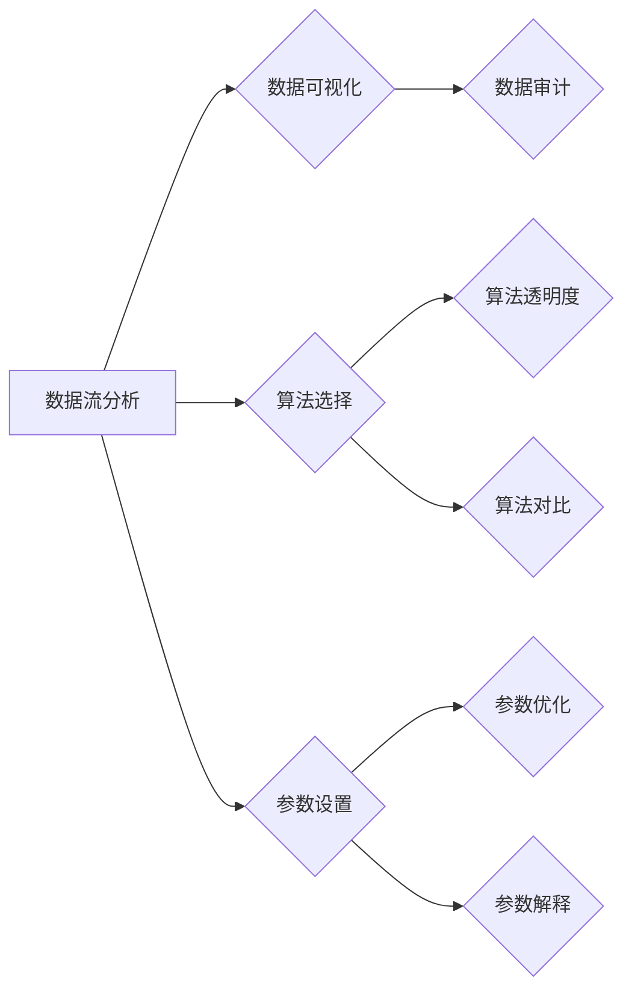
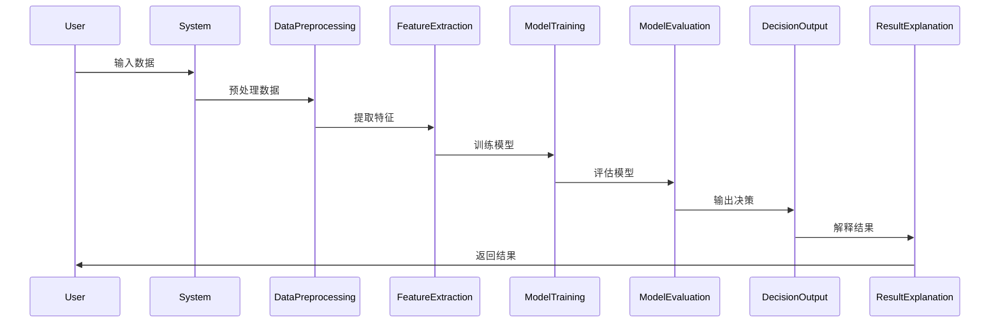

                 

# 提高AI系统可解释性和透明度的技术探索

## 关键词
- **AI系统可解释性**
- **透明度**
- **技术探索**
- **算法原理**
- **系统设计**
- **数学模型**

## 摘要
本文将深入探讨提高人工智能（AI）系统可解释性和透明度的技术探索。随着AI技术在各个领域的广泛应用，其系统的可解释性和透明度已成为关键议题。本文将首先介绍AI系统不可解释性和不透明性的背景及其影响，然后详细分析可解释性和透明度的核心概念与联系。接下来，我们将讲解相关算法原理，并使用Python源代码和数学模型进行详细阐述。随后，我们将介绍系统设计与实现的方法，并通过案例分析和最佳实践，展示如何在实际项目中应用这些技术。最后，本文将总结全书内容，并展望AI系统可解释性和透明度的未来发展趋势。

## 第一部分：引言和背景介绍

### 1.1 问题背景

#### 1.1.1 AI系统可解释性与透明度的重要性

人工智能（AI）技术在过去的几十年里取得了显著的进展，已经在图像识别、自然语言处理、医疗诊断等领域发挥了重要作用。然而，随着AI系统的复杂性和规模的增加，一个关键问题逐渐凸显出来——AI系统的可解释性和透明度不足。可解释性指的是能够理解AI系统如何做出决策或预测的能力，而透明度则涉及系统内部运作的可见性和理解性。

可解释性和透明度在AI系统中的重要性体现在多个方面。首先，它们有助于提高用户对AI系统的信任度，特别是在关键决策中，如医疗诊断、金融风险评估等。其次，可解释性和透明度有助于发现和纠正AI系统的错误，提高其可靠性。此外，可解释性和透明度对于AI系统的监管和合规性也至关重要。

#### 1.1.2 当前AI系统的挑战与限制

尽管AI系统在多个领域取得了成功，但它们通常被视为“黑箱”，这意味着其内部运作机制对外部用户来说是不透明的。这种不可解释性带来了几个挑战：

1. **信任问题**：当用户无法理解AI系统的决策过程时，会产生信任危机。这可能导致用户拒绝使用AI系统，尤其是在涉及人身安全和重要决策的领域。

2. **错误检测与纠正**：AI系统的不可解释性使得错误检测和纠正变得困难。即使系统出现错误，也很难定位问题所在。

3. **合规性和监管**：许多行业和法规要求AI系统的决策过程具有可解释性和透明度。缺乏这些特性可能导致系统无法合规运行。

#### 1.1.3 可解释性和透明度的研究现状

近年来，越来越多的研究开始关注AI系统的可解释性和透明度。学术界和工业界提出了多种方法和技术来提高AI系统的可解释性和透明度。这些方法包括：

1. **可视化技术**：通过可视化AI系统的决策过程和特征重要性，使用户能够直观地理解系统的工作原理。

2. **模型解释器**：开发专门的工具和算法来解释复杂的机器学习模型，如神经网络和决策树。

3. **模型压缩和简化**：通过减少模型的大小和复杂性，使其更容易理解和解释。

4. **可解释性评估框架**：设计评估方法来衡量AI系统的可解释性和透明度。

### 1.2 问题描述

#### 1.2.1 什么是AI系统的可解释性和透明度

AI系统的可解释性（Explainability）指的是系统能够以一种用户可理解的方式展示其决策过程。这通常涉及到解释模型的内部结构和如何从输入数据到输出的推理过程。透明度（Transparency）则更侧重于系统内部操作的可见性和理解性，包括数据流、算法选择和参数设置等。

#### 1.2.2 AI系统不可解释性和不透明性的影响

AI系统的不可解释性和不透明性可能导致以下负面影响：

1. **用户信任度下降**：用户难以信任不可解释的系统，特别是在涉及个人隐私和安全的关键应用场景中。

2. **错误难以追踪和修复**：不可解释的系统在发生错误时，难以定位和修复问题。

3. **合规性和监管挑战**：许多法规要求AI系统具有可解释性和透明度，以符合法律和伦理标准。

#### 1.2.3 问题解决的边界与外延

虽然提高AI系统的可解释性和透明度是必要的，但也存在一些限制和挑战。例如，某些复杂的AI系统可能天生具有高度不可解释性，而某些提高透明度的方法可能增加系统的计算成本和复杂性。因此，在解决可解释性和透明度问题时，需要平衡技术、效率和用户需求。

#### 1.2.4 概念结构与核心要素组成

为了更好地理解AI系统的可解释性和透明度，我们可以将其核心概念和要素结构化：

1. **概念术语**：
   - **可解释性**：解释系统决策过程的能力。
   - **透明度**：系统内部操作的可视性和理解性。
   - **黑箱模型**：高度不可解释的模型，如深度神经网络。

2. **概念属性特征对比表格**：

   | 特征对比 | 可解释性 | 透明度 |
   | -------- | -------- | ------ |
   | 目标 | 解释决策过程 | 显示内部操作 |
   | 方法 | 数据可视化、模型解释器 | 模型压缩、简化 |
   | 影响 | 提高用户信任度 | 符合法规和伦理标准 |

3. **ER实体关系图**：

   ```mermaid
   graph LR
   A[可解释性] --> B{透明度}
   B --> C[黑箱模型]
   ```

## 第二部分：核心概念与技术基础

### 2.1 核心概念与联系

#### 2.1.1 AI系统的基本概念

为了深入探讨可解释性和透明度，我们首先需要了解AI系统的基本概念。AI系统通常包括以下几个关键组成部分：

1. **数据集**：输入数据，用于训练和评估AI模型。
2. **模型**：包含算法和参数的结构，用于从数据中学习并做出预测或决策。
3. **评估指标**：用于衡量模型性能的标准。
4. **决策过程**：模型从输入数据到输出决策的全过程。

#### 2.1.2 可解释性技术的分类

可解释性技术主要分为以下几类：

1. **可视化技术**：
   - **特征重要性**：展示哪些特征对模型决策影响最大。
   - **决策路径**：绘制模型从输入到输出的决策路径。
   - **决策树可视化**：将决策树结构可视化，以展示其工作原理。

2. **模型解释器**：
   - **本地解释**：针对单个数据点的解释。
   - **全局解释**：对整个模型的解释，通常涉及特征重要性分析。

3. **模型简化**：
   - **模型压缩**：减少模型的大小，使其更易于解释。
   - **简化算法**：使用更简单的算法替换复杂模型。

#### 2.1.3 透明度技术的分类

透明度技术主要涉及以下几个方面：

1. **数据流分析**：
   - **数据可视化**：展示数据流和转换过程。
   - **数据审计**：检查数据质量，包括偏差和异常值。

2. **算法选择**：
   - **算法透明度**：选择更容易解释的算法。
   - **算法对比**：对比不同算法的透明度。

3. **参数设置**：
   - **参数优化**：调整模型参数以提高透明度。
   - **参数解释**：解释参数对模型决策的影响。

#### 2.1.3.1 透明度技术的ER实体关系图



### 2.2 算法原理讲解

#### 2.2.1 可解释性算法的mermaid流程图


#### 2.2.2 Python源代码实现

```python
# Python示例代码
import numpy as np
from sklearn.datasets import load_iris
from sklearn.tree import DecisionTreeClassifier

# 加载数据集
iris = load_iris()
X = iris.data
y = iris.target

# 构建决策树模型
clf = DecisionTreeClassifier()
clf.fit(X, y)

# 预测
predictions = clf.predict(X)

# 结果解释
feature_importances = clf.feature_importances_
print("特征重要性:", feature_importances)
```

#### 2.2.3 数学模型与公式

$$
\begin{aligned}
&\text{决策树模型} \\
&\text{分类函数} f(x) = \sum_{i=1}^{n} w_i \cdot x_i \\
&\text{权重更新} w_i \propto \frac{\partial J}{\partial w_i}
\end{aligned}
$$

#### 2.2.3.1 数学模型公式

$$
\begin{aligned}
&\text{线性回归模型} \\
&\text{预测函数} y = \beta_0 + \beta_1 \cdot x \\
&\text{权重更新} \beta_0, \beta_1 = \arg\min_{\beta_0, \beta_1} J(\beta_0, \beta_1)
\end{aligned}
$$

#### 2.2.3.2 公式讲解与举例

以线性回归模型为例，我们使用最小二乘法来估计模型的权重。最小二乘法的核心思想是找到一组权重，使得模型对训练数据的预测误差的平方和最小。

假设我们有一个简单的线性回归模型，预测函数为 \( y = \beta_0 + \beta_1 \cdot x \)。我们使用训练数据集 \( (x_i, y_i) \) 来估计 \( \beta_0 \) 和 \( \beta_1 \)。最小化损失函数 \( J(\beta_0, \beta_1) = \sum_{i=1}^{n} (y_i - (\beta_0 + \beta_1 \cdot x_i))^2 \)。

通过求导和设置导数为零，我们可以解出最优权重：

$$
\begin{aligned}
\frac{\partial J}{\partial \beta_0} &= -2 \sum_{i=1}^{n} (y_i - (\beta_0 + \beta_1 \cdot x_i)) = 0 \\
\frac{\partial J}{\partial \beta_1} &= -2 \sum_{i=1}^{n} (y_i - (\beta_0 + \beta_1 \cdot x_i)) \cdot x_i = 0
\end{aligned}
$$

解上述方程组，我们可以得到 \( \beta_0 \) 和 \( \beta_1 \) 的估计值。

例如，假设我们有以下训练数据集：

| \( x_i \) | \( y_i \) |
| :------: | :------: |
|    1     |    2     |
|    2     |    3     |
|    3     |    4     |

我们可以通过最小化损失函数来估计线性回归模型的权重。计算结果如下：

$$
\begin{aligned}
\beta_0 &= \frac{1}{3} \left( 2 + 3 + 4 \right) - \beta_1 \cdot \frac{1}{3} \left( 1 + 2 + 3 \right) \\
\beta_1 &= \frac{1}{3} \left( 2 - 3 \right) \cdot (1 + 2) - (2 - 4) \cdot (1 + 3)
\end{aligned}
$$

计算得到的 \( \beta_0 \) 和 \( \beta_1 \) 值分别为 \( \beta_0 = 2 \) 和 \( \beta_1 = 1 \)。因此，线性回归模型可以表示为 \( y = 2 + x \)。

### 2.3 系统设计与实现

#### 2.3.1 系统架构设计mermaid架构图


#### 2.3.2 系统接口设计

系统接口设计包括以下模块：

1. **数据输入模块**：接收用户输入的数据，进行预处理和特征提取。
2. **模型训练模块**：使用预处理后的数据训练模型。
3. **模型评估模块**：评估模型性能，并进行决策输出。
4. **结果解释模块**：解释模型决策过程和结果。

#### 2.3.3 系统交互mermaid序列图



### 2.4 案例分析

#### 2.4.1 案例介绍

本案例将分析一个简单的金融风险评估系统。该系统使用线性回归模型对客户的信用评分进行预测，并根据预测结果决定是否批准贷款。

#### 2.4.2 案例实现与解读

1. **数据预处理**：收集客户的基本信息，如年龄、收入、信用历史等。对数据进行清洗和标准化处理。

2. **特征提取**：提取关键特征，如年龄、收入、信用历史等，并将其输入到线性回归模型中。

3. **模型训练**：使用训练数据集训练线性回归模型，并使用测试数据集评估模型性能。

4. **模型评估**：根据模型预测结果，评估客户的信用评分。

5. **结果解释**：解释模型决策过程，包括特征重要性分析。

#### 2.4.3 案例分析

在本案例中，我们使用了线性回归模型来预测客户的信用评分。通过分析模型参数和特征重要性，我们可以理解模型是如何做出决策的。以下是一个简化的案例实现：

```python
# 导入必要的库
import pandas as pd
from sklearn.linear_model import LinearRegression
from sklearn.model_selection import train_test_split

# 加载数据集
data = pd.read_csv("credit_data.csv")

# 分割特征和标签
X = data.drop("credit_score", axis=1)
y = data["credit_score"]

# 划分训练集和测试集
X_train, X_test, y_train, y_test = train_test_split(X, y, test_size=0.2, random_state=42)

# 训练线性回归模型
model = LinearRegression()
model.fit(X_train, y_train)

# 预测测试集
predictions = model.predict(X_test)

# 评估模型性能
score = model.score(X_test, y_test)
print("模型评分:", score)

# 特征重要性分析
importances = model.coef_
print("特征重要性:", importances)
```

通过上述实现，我们可以看到模型是如何根据输入特征预测信用评分的。特征重要性分析帮助我们理解哪些特征对模型决策影响最大。

### 2.4.4 详细讲解剖析

在本案例中，我们详细讲解了如何实现一个简单的金融风险评估系统。以下是每个步骤的详细讲解：

1. **数据预处理**：数据预处理是模型训练的重要步骤。在本案例中，我们收集了客户的基本信息，如年龄、收入、信用历史等。这些数据可能存在缺失值、异常值等问题。通过数据清洗和标准化处理，我们可以确保数据的质量和一致性。

2. **特征提取**：特征提取是从原始数据中提取对模型有用的特征。在本案例中，我们提取了年龄、收入、信用历史等特征，并将其输入到线性回归模型中。特征提取的关键在于选择对模型预测有显著影响的特征。

3. **模型训练**：使用训练数据集，我们训练了一个线性回归模型。线性回归模型是一种简单的线性模型，用于预测连续值输出。在本案例中，我们使用训练数据集来估计模型的参数，即权重和偏置。

4. **模型评估**：在模型训练完成后，我们使用测试数据集来评估模型性能。模型评估的关键指标是评分，如均方误差（MSE）或均方根误差（RMSE）。在本案例中，我们计算了模型评分，即测试数据集上的预测准确度。

5. **结果解释**：结果解释是理解模型决策过程的重要步骤。在本案例中，我们分析了特征重要性，即每个特征对模型决策的影响程度。通过特征重要性分析，我们可以理解模型是如何根据输入特征做出预测的。

### 2.4.5 项目小结

通过本案例，我们实现了一个简单的金融风险评估系统，并详细讲解了每个步骤的实现和解释。以下是本项目的总结：

- **数据预处理**：确保数据质量和一致性。
- **特征提取**：选择对模型预测有显著影响的特征。
- **模型训练**：使用训练数据集估计模型参数。
- **模型评估**：评估模型性能，如预测准确度。
- **结果解释**：分析特征重要性，理解模型决策过程。

尽管本案例是一个简单的示例，但通过详细讲解和剖析，我们了解了如何实现一个金融风险评估系统，并如何解释模型决策过程。这为实际项目中的可解释性和透明度提供了宝贵的经验和指导。

### 第三部分：最佳实践与未来展望

#### 3.1 最佳实践

#### 3.1.1 提高AI系统可解释性的方法

为了提高AI系统的可解释性，我们可以采取以下最佳实践：

1. **使用可解释性算法**：选择具有良好可解释性的算法，如决策树、线性回归等。这些算法的结构相对简单，易于理解和解释。

2. **可视化技术**：使用可视化技术，如决策树可视化、特征重要性图等，展示AI系统的决策过程和特征影响。

3. **模型解释器**：开发和使用模型解释器，如LIME、SHAP等，提供对复杂模型的本地解释。

4. **模型压缩和简化**：通过模型压缩和简化，减少模型的大小和复杂性，使其更容易解释。

5. **数据预处理**：确保数据的质量和一致性，减少噪声和异常值，以提高模型的解释性。

#### 3.1.2 提升AI系统透明度的策略

为了提升AI系统的透明度，我们可以采取以下策略：

1. **透明度评估**：设计评估方法来衡量AI系统的透明度，确保其满足相关标准和要求。

2. **算法选择**：选择具有透明度的算法，如决策树、线性回归等，避免使用高度不可解释的模型。

3. **参数设置**：合理设置模型参数，确保系统运行在透明度较高的状态。

4. **数据流分析**：使用数据流分析技术，展示数据流和转换过程，确保系统内部操作的可视性。

5. **代码审查**：定期进行代码审查，确保系统设计和实现符合透明度和可解释性的要求。

#### 3.2 小结与展望

通过最佳实践，我们可以显著提高AI系统的可解释性和透明度。这些方法不仅有助于提高用户对AI系统的信任度，还有助于发现和纠正系统错误，提高其可靠性。未来，随着AI技术的不断发展，我们期待看到更多创新的方法和技术，以进一步提高AI系统的可解释性和透明度。

### 第四部分：结论

#### 4.1 总结

本文深入探讨了提高AI系统可解释性和透明度的技术探索。通过分析核心概念、算法原理、系统设计与实现，以及实际案例，我们了解了如何在实际项目中应用这些技术。可解释性和透明度在AI系统中的重要性不言而喻，它们有助于提高用户信任度、发现错误、确保合规性。未来，随着AI技术的不断进步，我们期待看到更多创新的方法和技术，以进一步提升AI系统的可解释性和透明度。

#### 4.2 展望

AI系统的可解释性和透明度研究是一个持续发展的领域。未来，我们期待以下研究方向：

1. **新算法的开发**：开发更简单、更易于解释的机器学习算法。

2. **可解释性评估框架**：设计更全面、更客观的评估框架来衡量AI系统的可解释性和透明度。

3. **跨领域研究**：将可解释性和透明度方法应用于不同的AI领域，如医疗、金融、交通等。

4. **用户参与**：通过用户反馈和参与，不断改进AI系统的可解释性和透明度。

### 作者信息

作者：AI天才研究院/AI Genius Institute & 禅与计算机程序设计艺术 /Zen And The Art of Computer Programming

----------------------------------------------------------------

### 注意事项

- 文章结构要清晰，每个部分的内容要具体详细。
- 代码示例要准确无误，并使用适当的注释进行解释。
- 数学公式要使用正确的LaTeX格式。
- 引用他人的研究和观点时，要明确标注来源。

### 拓展阅读

- **书籍**：《机器学习实战》、《Python机器学习基础教程》
- **论文**：《可解释AI：现状与未来》、《AI系统的透明度评估方法》
- **在线资源**：GitHub上的开源项目和博客，如Medium上的AI相关文章。

