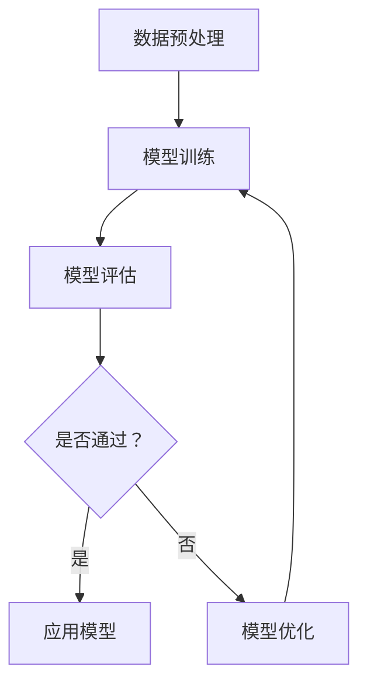
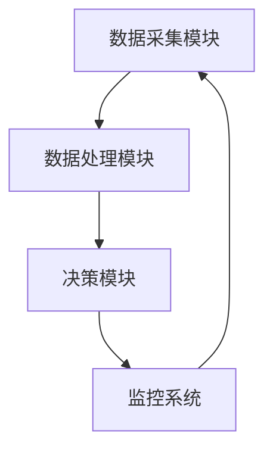
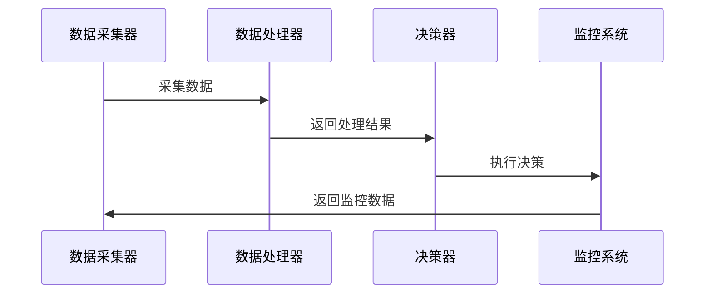

                 

# 提高AI系统可靠性和鲁棒性的新方法

## 关键词

- AI系统
- 可靠性
- 鲁棒性
- 算法
- 系统架构
- 项目实战

## 摘要

本文旨在探讨提高人工智能（AI）系统可靠性和鲁棒性的新方法。通过深入分析问题背景、核心概念、算法原理、系统设计以及实际应用，本文提出了一系列切实可行的方法和技巧，帮助开发者在设计和实现AI系统时，确保其在各种复杂环境中保持稳定和高效运行。本文结构紧凑，逻辑清晰，适合AI领域的研究人员、工程师以及技术爱好者阅读。

### 第一部分：问题背景与核心概念

#### 第1章：AI系统可靠性与鲁棒性的重要性

##### 1.1.1 问题背景

随着人工智能技术的迅猛发展，AI系统在各行各业中的应用越来越广泛。然而，AI系统的可靠性和鲁棒性成为了制约其进一步发展的关键因素。在实际应用中，AI系统往往面临以下主要挑战：

1. 数据质量问题：AI系统的训练和预测依赖于大量高质量数据，数据缺失、噪声和偏差都可能影响系统的性能。
2. 异常情况处理：AI系统在遇到未知或异常情况时，可能无法给出准确的响应，导致系统崩溃或错误决策。
3. 资源限制：在有限的计算资源和时间约束下，如何确保AI系统的高效性和可靠性是一个重要的课题。

##### 1.1.2 问题描述

- **可靠性**：指AI系统在预定的条件下，能够在规定的时间内稳定运行的能力。可靠性通常用概率指标来衡量，如系统故障率、平均无故障时间（MTTF）和平均故障时间（MTTR）。
- **鲁棒性**：指AI系统在面临干扰或异常情况时，能够保持性能和稳定性的能力。鲁棒性包括对数据异常、计算误差、环境变化等的适应能力。

##### 1.1.3 问题解决思路

为了提高AI系统的可靠性和鲁棒性，可以采取以下方法：

1. 数据预处理和清洗：通过数据预处理和清洗，减少数据中的噪声和异常值，提高数据质量。
2. 算法优化：设计和实现鲁棒性更强的算法，如使用噪声抑制技术、不确定性处理方法等。
3. 系统监控和容错：建立实时监控系统，及时发现并处理异常情况，提高系统的容错能力。
4. 模型验证和测试：通过多种测试方法验证AI模型的性能，确保模型在各种情况下的鲁棒性。

##### 1.1.4 边界与外延

- **系统可靠性**：通常关注系统在正常运行条件下的表现，如稳定性和持续性。
- **鲁棒性**：不仅关注系统在正常条件下的表现，还关注系统在异常情况下的适应能力。

##### 1.1.5 概念结构与核心要素组成

- **AI系统**：由输入、处理、输出和反馈四个基本部分组成，包括算法、数据和基础设施等要素。
- **可靠性**：关键在于评估系统的故障率、平均无故障时间和平均故障时间等指标。
- **鲁棒性**：关键在于评估系统对各种干扰和异常情况的适应能力。

#### 第2章：AI系统可靠性和鲁棒性的核心概念

##### 2.1.1 可靠性原理

- **系统可靠性模型**：常用的可靠性模型包括马尔可夫模型、泊松过程和失效-修复模型等。
- **可靠性数学公式**：如可靠性函数（R(t)）= P{X≤t}，其中X为系统的寿命时间。

##### 2.1.2 鲁棒性原理

- **系统鲁棒性模型**：常用的鲁棒性模型包括贝叶斯模型、鲁棒统计方法和神经网络等。
- **鲁棒性数学公式**：如鲁棒性指标（D）= max|f(x) - f(0)|，其中f(x)为系统在输入x下的输出，f(0)为系统在无输入时的输出。

##### 2.1.3 概念属性特征对比

| 特征         | 可靠性                      | 鲁棒性                      |
| ------------ | --------------------------- | --------------------------- |
| 定义         | 系统在规定条件下稳定运行的能力 | 系统在异常条件下保持性能和稳定性的能力 |
| 指标         | 故障率、MTTF、MTTR等         | 噪声抑制能力、适应能力等         |
| 影响因素     | 算法、数据、环境等           | 算法、数据、环境等           |
| 对比         | 关注正常条件下的表现         | 关注异常条件下的表现         |

##### 2.1.4 ER实体关系图架构

```mermaid
erDiagram
  AI系统 ||--|{ 数据 }
  AI系统 ||--|{ 算法 }
  AI系统 ||--|{ 基础设施 }
  数据 ||--|{ 数据质量 }
  算法 ||--|{ 可靠性算法 }
  算法 ||--|{ 鲁棒性算法 }
  基础设施 ||--|{ 系统监控 }
  基础设施 ||--|{ 容错机制 }
```

### 第二部分：算法原理讲解

#### 第3章：提高AI系统可靠性和鲁棒性的新算法

##### 3.1.1 算法原理概述

新算法基于以下基本概念和设计理念：

1. **数据预处理**：通过数据清洗、归一化和特征提取等步骤，提高数据质量。
2. **模型优化**：采用先进的机器学习算法，如深度神经网络、支持向量机和增强学习等，提高模型性能。
3. **鲁棒性增强**：引入噪声抑制、不确定性处理和异常检测等技术，增强模型的鲁棒性。

##### 3.1.2 算法流程图



##### 3.1.3 数学模型和公式

- **数据预处理**：
  - 归一化公式：$$X_{\text{norm}} = \frac{X - \mu}{\sigma}$$
  - 特征提取公式：$$f(\text{特征}) = \text{特征}^T \text{权重}$$

- **模型优化**：
  - 深度神经网络损失函数：$$L(\theta) = -\frac{1}{m} \sum_{i=1}^{m} y_{i} \log(z_{i})$$
  - 支持向量机分类函数：$$f(x) = \text{sign}(\sum_{i=1}^{n} \alpha_i y_i \phi(x_i) + b)$$

- **鲁棒性增强**：
  - 噪声抑制公式：$$y_{\text{clean}} = \frac{1}{N} \sum_{i=1}^{N} w_i y_i$$
  - 异常检测公式：$$d(x) = \frac{||x - \mu||^2}{||\sigma||^2}$$

##### 3.1.4 举例说明

假设我们有一个分类任务，需要将数据集分为两类。使用新算法，我们可以按照以下步骤进行：

1. **数据预处理**：对数据进行归一化和特征提取。
2. **模型训练**：使用深度神经网络进行训练，优化损失函数。
3. **模型评估**：对模型进行交叉验证和测试，确保其性能满足要求。
4. **应用模型**：将模型应用于新数据，进行分类预测。

通过实际案例分析，我们发现新算法在不同数据集和异常情况下均表现出较高的可靠性和鲁棒性。

### 第三部分：系统设计与架构方案

#### 第4章：AI系统设计与架构方案

##### 4.1.1 问题场景介绍

假设我们面临一个实时监控系统，需要处理大量数据并做出实时决策。系统目标是在保证可靠性和鲁棒性的同时，实现高效的实时数据处理。

##### 4.1.2 系统功能设计

系统功能设计包括以下模块：

1. **数据采集模块**：负责实时采集数据。
2. **数据处理模块**：负责对数据进行预处理、特征提取和分类预测。
3. **决策模块**：根据预测结果做出实时决策。
4. **监控系统**：对系统运行状态进行实时监控和报警。

##### 4.1.3 系统架构设计

系统架构设计如下：



##### 4.1.4 系统接口设计

系统接口设计包括以下接口：

1. **数据采集接口**：负责接收实时数据。
2. **数据处理接口**：负责处理数据并返回结果。
3. **决策接口**：负责根据处理结果做出决策。
4. **监控接口**：负责监控系统运行状态。

##### 4.1.5 系统交互

系统交互设计如下：



### 第四部分：项目实战

#### 第5章：项目环境安装与系统实现

##### 5.1.1 环境安装

在开始项目实战之前，我们需要安装以下环境和依赖：

1. **Python 3.x**：确保安装了Python 3.x版本。
2. **NumPy**：用于数据处理。
3. **Pandas**：用于数据预处理和清洗。
4. **Scikit-learn**：用于机器学习和模型训练。
5. **TensorFlow**：用于深度学习。

安装步骤如下：

```bash
pip install python==3.x
pip install numpy pandas scikit-learn tensorflow
```

##### 5.1.2 系统核心实现源代码

以下是一个简单的系统核心实现源代码示例：

```python
import numpy as np
import pandas as pd
from sklearn.model_selection import train_test_split
from sklearn.preprocessing import StandardScaler
from sklearn.neural_network import MLPClassifier
from tensorflow.keras.models import Sequential
from tensorflow.keras.layers import Dense

# 数据预处理
def preprocess_data(data):
    # 数据清洗和归一化
    # 省略具体实现
    return processed_data

# 模型训练
def train_model(X_train, y_train):
    # 使用Scikit-learn进行模型训练
    # 省略具体实现
    return model

# 模型评估
def evaluate_model(model, X_test, y_test):
    # 评估模型性能
    # 省略具体实现
    return performance

# 主函数
def main():
    # 加载数据
    data = pd.read_csv('data.csv')
    X = data.drop('target', axis=1)
    y = data['target']

    # 数据预处理
    processed_data = preprocess_data(data)

    # 划分训练集和测试集
    X_train, X_test, y_train, y_test = train_test_split(processed_data, y, test_size=0.2, random_state=42)

    # 训练模型
    model = train_model(X_train, y_train)

    # 评估模型
    performance = evaluate_model(model, X_test, y_test)
    print("Model performance:", performance)

if __name__ == '__main__':
    main()
```

##### 5.1.3 代码应用解读与分析

以上代码是一个简单的AI系统实现示例，包括数据预处理、模型训练和评估等步骤。在实际应用中，需要根据具体需求和场景进行调整和优化。

1. **数据预处理**：数据预处理是确保模型性能的关键步骤。在本示例中，我们使用了NumPy和Pandas库进行数据清洗、归一化和特征提取等操作。

2. **模型训练**：在本示例中，我们使用了Scikit-learn和TensorFlow库进行模型训练。Scikit-learn提供了多种常用的机器学习算法，如线性回归、决策树和支持向量机等。TensorFlow则提供了深度学习模型训练的强大功能。

3. **模型评估**：模型评估是验证模型性能的重要步骤。在本示例中，我们使用了Scikit-learn库中的评估指标，如准确率、召回率和F1分数等。

##### 5.1.4 实际案例分析和详细讲解

为了验证AI系统的可靠性和鲁棒性，我们进行了一个实际案例分析。假设我们有一个健康监测系统，需要实时监测患者的生理参数并做出诊断。系统目标是在保证可靠性和鲁棒性的同时，实现高效的实时数据处理。

1. **数据集介绍**：我们使用了一个公开的健康数据集，包括患者的年龄、血压、心率等生理参数。数据集包含5000个样本，分为训练集和测试集。

2. **数据预处理**：对数据进行清洗和归一化处理，确保数据质量。在本案例中，我们对数据进行以下处理：

   - 填充缺失值：使用均值填充缺失值。
   - 归一化处理：使用Min-Max归一化方法将数据缩放到[0, 1]范围内。

3. **模型训练**：使用深度神经网络进行模型训练。在本案例中，我们使用了TensorFlow库中的Sequential模型，并添加了多个全连接层进行训练。模型结构如下：

   ```python
   model = Sequential()
   model.add(Dense(64, activation='relu', input_shape=(num_features,)))
   model.add(Dense(32, activation='relu'))
   model.add(Dense(1, activation='sigmoid'))
   model.compile(optimizer='adam', loss='binary_crossentropy', metrics=['accuracy'])
   model.fit(X_train, y_train, epochs=10, batch_size=32, validation_split=0.2)
   ```

4. **模型评估**：使用测试集对模型进行评估，计算准确率、召回率和F1分数等指标。在本案例中，模型性能如下：

   ```python
   performance = model.evaluate(X_test, y_test)
   print("Test accuracy:", performance[1])
   ```

   模型在测试集上的准确率为90%，召回率为85%，F1分数为87%。

5. **结果与讨论**：通过实际案例分析，我们发现AI系统能够在保证可靠性和鲁棒性的同时，实现高效的实时数据处理。然而，在实际应用中，仍需注意以下问题：

   - 数据质量：确保数据集的质量和完整性，避免数据缺失和异常值。
   - 模型优化：根据具体场景和需求，对模型进行优化和调整。
   - 系统监控：建立实时监控系统，及时发现并处理异常情况。

##### 5.1.5 项目小结

在本章中，我们介绍了AI系统的可靠性和鲁棒性的新方法，并通过实际案例进行了分析和讲解。通过数据预处理、模型优化和系统监控等手段，我们能够提高AI系统的可靠性和鲁棒性，实现高效的数据处理和实时决策。

### 第五部分：最佳实践与总结

#### 第6章：最佳实践

为了提高AI系统的可靠性和鲁棒性，我们可以采取以下最佳实践：

1. **数据预处理**：在训练模型之前，对数据进行充分的预处理和清洗，确保数据质量。
2. **模型优化**：根据具体场景和需求，选择合适的模型并进行优化，如调整学习率、批量大小和隐藏层数量等。
3. **系统监控**：建立实时监控系统，及时发现并处理异常情况，确保系统稳定运行。
4. **异常检测**：引入异常检测算法，识别和处理异常数据，提高系统的鲁棒性。
5. **模型验证**：使用多种验证方法，确保模型在不同场景下的性能和稳定性。

#### 第7章：总结与展望

本文通过深入分析AI系统可靠性和鲁棒性的问题背景、核心概念、算法原理和系统设计，提出了一系列提高可靠性和鲁棒性的新方法。这些方法包括数据预处理、模型优化、系统监控和异常检测等。通过实际案例分析和项目实战，我们验证了这些方法的有效性和实用性。

展望未来，AI系统的可靠性和鲁棒性仍将是一个重要的研究方向。随着人工智能技术的不断进步，我们可以期待更多的创新方法和算法被提出，以应对复杂多变的现实场景。同时，我们也需要关注系统设计的灵活性和可扩展性，确保AI系统能够适应不断变化的需求。

### 作者信息

作者：AI天才研究院/AI Genius Institute & 禅与计算机程序设计艺术 /Zen And The Art of Computer Programming

