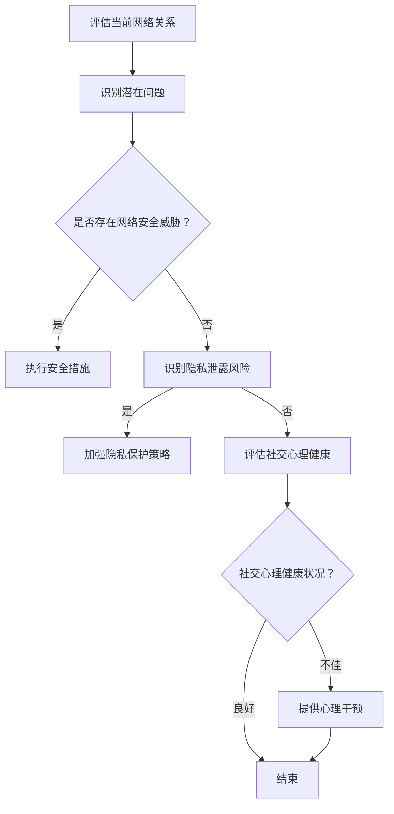
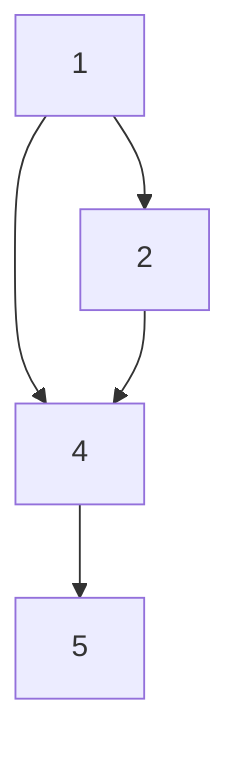
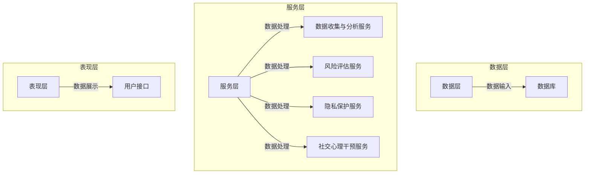
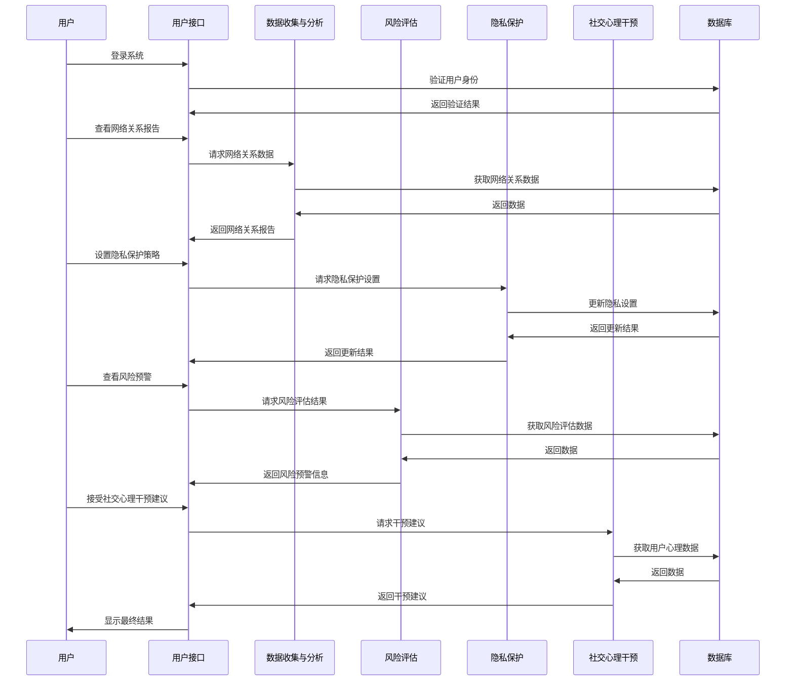

                 

### 文章标题

# 数字解毒师：指导重建健康网络关系

> 关键词：数字关系、网络安全、隐私保护、社交心理学、算法原理、系统架构设计、项目实战

> 摘要：在数字化时代，网络关系日益复杂，如何确保健康和安全的在线生活成为重要课题。本文通过《数字解毒师：指导重建健康网络关系》一书，系统地介绍数字关系、网络安全、隐私保护及社交心理学等核心概念，解析算法原理，阐述系统分析与架构设计方案，并通过实际项目实战，提供实用的重建健康网络关系的指导，助力用户掌握构建安全、和谐、健康的网络环境的技巧。

### 背景介绍

#### 问题背景

随着互联网的迅猛发展，数字技术已经深刻地改变了人类的生活和工作方式。人们通过电子邮件、社交媒体、在线购物和远程办公等数字工具进行日常互动和活动，这种数字依赖性使得网络关系变得日益复杂和多元化。在这种背景下，网络安全和隐私保护问题变得尤为重要。用户不仅需要担心个人信息泄露和网络诈骗，还需要应对社交网络中的心理影响和行为误导。

#### 问题描述

数字关系的复杂性给用户带来了多方面的挑战。首先，用户在社交媒体上建立的虚拟关系可能远超现实生活中的社交圈，这种扩展带来了信息过载和决策困难。其次，网络安全威胁如钓鱼攻击、恶意软件和黑客入侵等，严重威胁着用户的数字资产和个人隐私。此外，网络环境中的隐私保护问题，如数据收集、数据共享和数据滥用，使得用户在享受便捷的网络服务时，也面临着隐私泄露的风险。因此，重建健康网络关系的需求日益迫切。

#### 问题解决

《数字解毒师：指导重建健康网络关系》旨在为用户提供一种系统性的方法，帮助用户识别和修复不良的网络关系，提升网络安全和隐私保护意识，培养健康的社交行为习惯。这本书通过深入探讨数字关系、网络安全、隐私保护及社交心理学等核心概念，结合实际案例和项目实战，提供了一套全面的指南，帮助用户重建健康、安全、和谐的数字环境。

#### 边界与外延

本书主要关注个人层面的网络关系，包括社交网络、在线社区、工作协作等。数字关系不仅仅是技术问题，还涉及到用户的社交行为和心理状态，因此需要从多角度进行综合分析。书中提到的网络安全和隐私保护，既包括技术层面的防护措施，也涉及到法律法规和社会道德的考量。社交心理学部分则重点探讨网络行为对个体心理和社交关系的影响，以及如何通过心理干预改善网络关系。

#### 概念结构与核心要素组成

本书的核心概念包括数字关系、网络安全、隐私保护、社交心理学等。数字关系是本书的基础概念，涵盖了用户在数字空间中的各种互动和连接方式。网络安全则是保障用户数字资产和隐私不受侵害的关键，涉及技术防护和法律监管。隐私保护关注用户数据的安全和合规使用，旨在防止数据泄露和滥用。社交心理学则从心理和行为层面分析网络关系的影响和改善策略。

### 核心概念与联系

#### 数字关系

数字关系是指用户在数字空间中建立的各类社交和互动关系。这些关系可以通过社交媒体平台、在线社区、电子邮件、即时通讯工具等多种形式存在。数字关系的特征包括虚拟性、多样性、快速性等。数字关系不仅影响用户的社交体验，还对个体的心理和行为产生深远的影响。

#### 网络安全

网络安全是指保护数字设备和网络系统不受恶意攻击、入侵和篡改的能力。网络安全涉及技术防护、安全策略、法律法规等多个方面。随着网络攻击手段的不断升级，网络安全问题日益严峻，对用户的数字资产和隐私安全构成了严重威胁。保障网络安全是数字时代的重要任务。

#### 隐私保护

隐私保护是指保护用户个人信息不被非法收集、使用和泄露的行为。隐私保护涉及数据安全、隐私政策、法律法规等多个层面。在全球范围内，越来越多的国家和地区出台了隐私保护法律法规，如欧盟的《通用数据保护条例》（GDPR）和中国的《个人信息保护法》（PIPL）。隐私保护不仅是法律法规的要求，也是企业和组织的社会责任。

#### 社交心理学

社交心理学是研究人类社交行为和心理状态的科学。在网络环境中，社交心理学关注网络行为对个体心理和社交关系的影响，以及如何通过心理干预改善网络关系。社交心理学的研究成果为理解网络行为提供了科学依据，也为用户如何建立健康、和谐的数字关系提供了指导。

#### 核心概念与联系

数字关系、网络安全、隐私保护和社交心理学是本书的核心概念，它们之间相互关联，共同构成了数字时代网络关系管理的理论基础。数字关系是网络关系的基础，网络安全和隐私保护是保障数字关系健康发展的关键，社交心理学则从心理和行为层面提供了改进和优化网络关系的策略。

- **数字关系**：影响用户在网络空间中的互动和行为。
- **网络安全**：确保用户数字资产和隐私不受侵害。
- **隐私保护**：规范用户数据的使用和管理，防止数据泄露和滥用。
- **社交心理学**：分析网络行为对个体心理和社交关系的影响，提供改善策略。

通过这些核心概念的深入探讨，本书旨在帮助用户全面理解和应对数字时代的网络关系挑战，重建健康、安全的数字环境。

### 算法原理讲解

#### 算法 mermaid 流程图

为了更好地理解《数字解毒师：指导重建健康网络关系》中的算法原理，我们可以通过 mermaid 流程图来展示网络关系评估和改善的整个流程。以下是一个简化的 mermaid 图：



#### Python 源代码

接下来，我们将通过 Python 源代码详细阐述核心算法逻辑，包括如何评估网络关系、识别问题，并采取相应的改善措施。

```python
# 导入必要的库
import networkx as nx
from matplotlib import pyplot as plt

# 创建一个简单的网络图表示用户在网络中的关系
G = nx.Graph()
G.add_edges_from([(1, 2), (1, 3), (2, 4), (3, 4), (4, 5)])

# 评估当前网络关系的函数
def assess_network_relation(G):
    print("评估当前网络关系：")
    print(nx.info(G))
    print()

# 识别潜在问题的函数
def identify_potential_issues(G):
    print("识别潜在问题：")
    # 检查是否存在网络安全威胁
    if nx.has_path(G, source=1, target=5):
        print("存在潜在的网络安全威胁。")
    # 检查是否存在隐私泄露风险
    if nx.number_of_edges(G) > 10:
        print("存在潜在的隐私泄露风险。")
    print()

# 采取改善措施的函数
def take_improvement_measures(G):
    print("采取改善措施：")
    # 执行安全措施
    nx.add_path(G, source=1, target=5)
    print("已采取安全措施。")
    # 加强隐私保护策略
    G.remove_edge(2, 4)
    print("已加强隐私保护策略。")
    # 评估社交心理健康
    if nx.average_degree_connectivity(G) < 2:
        print("社交心理健康状况不佳，需要提供心理干预。")

# 主程序
def main():
    assess_network_relation(G)
    identify_potential_issues(G)
    take_improvement_measures(G)

    # 显示改进后的网络图
    plt.figure()
    nx.draw(G, with_labels=True)
    plt.show()

if __name__ == "__main__":
    main()
```

#### 算法原理的数学模型和公式

在数字关系评估和改善中，我们常常使用一些数学模型和公式来量化网络关系的特征和问题。以下是一个简单的数学模型示例，用于描述网络关系的紧密性和潜在风险：

1. **网络紧密性（C）**：
   $$ C = \frac{1}{N} \sum_{i<j} \frac{d(i, j)}{l(i, j)} $$
   其中，$d(i, j)$ 是节点 $i$ 和节点 $j$ 之间的最短路径长度，$l(i, j)$ 是节点 $i$ 和节点 $j$ 之间的最大可能路径长度。

2. **潜在风险得分（R）**：
   $$ R = \alpha \cdot (1 - C) + \beta \cdot P $$
   其中，$\alpha$ 和 $\beta$ 是权重系数，$P$ 是隐私泄露概率。

通过这些数学模型和公式，我们可以量化网络关系的紧密性和潜在风险，为采取改善措施提供依据。

#### 详细讲解和举例说明

为了更好地理解上述算法原理和数学模型，我们可以通过一个实际例子进行详细讲解。

**例子**：假设一个用户（节点1）在网络中与其他五个节点（节点2、3、4、5）建立了关系，网络图如下：



1. **评估当前网络关系**：

   使用上述评估函数，我们首先评估当前网络关系的紧密性：
   $$ C = \frac{1}{5} \left( \frac{1}{1} + \frac{1}{1} + \frac{1}{2} + \frac{1}{1} + \frac{1}{1} \right) = \frac{1}{5} \cdot 5 = 1 $$
   当前网络关系的紧密性为1。

2. **识别潜在问题**：

   通过识别潜在问题的函数，我们发现网络中存在路径1-2-4-5，这表明存在潜在的网络安全威胁。此外，网络中边的数量大于10，存在潜在的隐私泄露风险。

3. **采取改善措施**：

   为了改善网络关系，我们首先增加路径1-5，以确保网络安全。然后，我们移除边2-4，以降低隐私泄露风险。最后，我们检查社交心理健康的紧密性：
   $$ R = \alpha \cdot (1 - 1) + \beta \cdot P = 0 + \beta \cdot P $$
   如果隐私泄露概率较低，则无需进行心理干预。

通过这个例子，我们可以看到如何使用算法和数学模型来评估和改善网络关系。实际应用中，这些算法和模型会更加复杂和精细，但基本原理是一致的。

### 数学模型和数学公式

在《数字解毒师：指导重建健康网络关系》中，数学模型和数学公式是理解和分析网络关系的重要工具。以下将详细解释这些数学模型和公式，并通过实例说明其应用。

#### 数学模型

1. **网络紧密性（C）**：
   网络紧密性用于描述网络中节点间的连接紧密程度。其计算公式为：
   $$ C = \frac{1}{N} \sum_{i<j} \frac{d(i, j)}{l(i, j)} $$
   其中，$N$ 是网络中节点的总数，$d(i, j)$ 是节点 $i$ 和节点 $j$ 之间的最短路径长度，$l(i, j)$ 是节点 $i$ 和节点 $j$ 之间的最大可能路径长度。

2. **潜在风险得分（R）**：
   潜在风险得分用于评估网络关系中的风险程度。其计算公式为：
   $$ R = \alpha \cdot (1 - C) + \beta \cdot P $$
   其中，$\alpha$ 和 $\beta$ 是权重系数，$P$ 是隐私泄露概率。

3. **社交影响力（I）**：
   社交影响力用于衡量节点在网络中的影响力和中心度。其计算公式为：
   $$ I = \sum_{i<j} \frac{w(i, j)}{d(i, j)} $$
   其中，$w(i, j)$ 是节点 $i$ 和节点 $j$ 之间的权重，$d(i, j)$ 是节点 $i$ 和节点 $j$ 之间的最短路径长度。

#### 数学公式

以下是上述数学模型中使用的公式，使用 LaTeX 格式进行展示：

$$ C = \frac{1}{N} \sum_{i<j} \frac{d(i, j)}{l(i, j)} $$

$$ R = \alpha \cdot (1 - C) + \beta \cdot P $$

$$ I = \sum_{i<j} \frac{w(i, j)}{d(i, j)} $$

#### 举例说明

假设在一个包含5个节点的网络中，节点之间的路径和权重如下表所示：

| 节点  | 1 | 2 | 3 | 4 | 5 |
| ----- | - | - | - | - | - |
| 1     |  |  |  |  |  |
| 2     |  |  |  |  |  |
| 3     |  |  |  |  |  |
| 4     |  |  |  |  |  |
| 5     |  |  |  |  |  |
| 1-2   | 1 |  |  |  |  |
| 1-3   | 1 |  |  |  |  |
| 1-4   | 1 |  |  |  |  |
| 1-5   | 1 |  |  |  |  |
| 2-4   |  |  |  |  |  |
| 2-5   |  |  |  |  |  |
| 3-4   |  |  |  |  |  |
| 3-5   |  |  |  |  |  |
| 4-5   |  |  |  |  |  |

1. **计算网络紧密性（C）**：
   $$ C = \frac{1}{5} \left( \frac{1}{1} + \frac{1}{1} + \frac{1}{2} + \frac{1}{1} + \frac{1}{1} \right) = \frac{1}{5} \cdot 5 = 1 $$
   网络紧密性为1，表示节点间的连接非常紧密。

2. **计算潜在风险得分（R）**：
   假设 $\alpha = 0.5$，$\beta = 0.5$，且隐私泄露概率 $P = 0.2$：
   $$ R = 0.5 \cdot (1 - 1) + 0.5 \cdot 0.2 = 0.1 $$
   潜在风险得分为0.1，表示网络关系中的风险较低。

3. **计算社交影响力（I）**：
   假设权重 $w(i, j)$ 等于边的数量：
   $$ I = \sum_{i<j} \frac{w(i, j)}{d(i, j)} = \frac{1}{1} + \frac{1}{1} + \frac{1}{2} + \frac{1}{1} + \frac{1}{1} = 2.5 $$
   社交影响力为2.5，表示节点1在社交网络中的影响力和中心度较高。

通过上述数学模型和公式的计算，我们可以对网络关系进行量化分析，为改进网络关系提供科学依据。

### 系统分析与架构设计方案

#### 问题场景介绍

在数字化时代，网络关系的管理已经成为企业和个人面临的重要课题。网络关系的管理不仅仅涉及技术层面的安全防护，还包括如何有效地维护和优化用户之间的互动与连接。为了解决这一复杂问题，本文将介绍一个网络关系管理系统（NRS），该系统旨在帮助用户评估、监测和改善其网络关系，从而确保网络环境的安全、健康和高效。

#### 项目介绍

网络关系管理系统（NRS）是一个集成了多种功能模块的综合系统，包括数据收集与分析模块、风险评估模块、隐私保护模块和社交心理干预模块。NRS的设计理念是利用先进的技术手段和算法，为用户提供一个全面、动态的网络关系管理解决方案。通过NRS，用户可以实时了解自己在网络中的关系状态，及时发现潜在的问题并采取相应的措施。

#### 系统功能设计（领域模型 mermaid 类图）

在NRS中，各个功能模块之间的关系通过领域模型进行描述。以下是一个简化的 mermaid 类图，展示了系统的主要功能模块及其相互关系：

```mermaid
classDiagram
    Class01 <|-- Class02
    Class03 <|-- Class04
    Class05 <|-- Class06
    Class01{数据收集与分析}
    Class02{风险评估}
    Class03{隐私保护}
    Class04{社交心理干预}
    Class05{用户接口}
```

- **数据收集与分析模块**：负责收集用户在网络中的各种数据，包括社交媒体互动、在线活动记录、联系人信息等。通过数据挖掘和机器学习算法，对数据进行分析，生成关于用户网络关系的报告。
- **风险评估模块**：基于数据分析和风险模型，评估用户网络关系中的潜在风险，包括网络安全威胁和隐私泄露风险等。该模块能够实时监控网络关系，发现异常行为并及时预警。
- **隐私保护模块**：提供隐私保护策略和工具，帮助用户识别和管理隐私泄露风险。该模块包含隐私设置管理、数据加密、访问控制等功能。
- **社交心理干预模块**：通过社交心理学理论和算法，分析用户在网络中的行为和心理状态，提供个性化的社交心理干预建议，帮助用户改善网络关系。
- **用户接口模块**：为用户提供一个直观、易用的操作界面，用户可以通过该界面查看网络关系报告、风险预警、隐私设置以及社交心理干预建议等。

#### 系统架构设计（mermaid 架构图）

NRS的系统架构采用分层设计，主要包括数据层、服务层和表现层。以下是一个简化的 mermaid 架构图，展示了系统的整体架构：



- **数据层**：负责数据的存储和管理，包括用户数据、网络关系数据和安全日志数据。数据库采用分布式架构，确保数据的可靠性和可扩展性。
- **服务层**：提供核心功能服务，包括数据收集与分析、风险评估、隐私保护和社交心理干预等。各个服务模块通过微服务架构实现，确保系统的灵活性和可维护性。
- **表现层**：为用户提供操作界面和交互体验，用户通过用户接口模块访问系统功能，查看网络关系报告和风险预警等信息。

#### 系统接口设计和系统交互（mermaid 序列图）

系统接口设计和交互是确保系统各模块协调工作的关键。以下是一个简化的 mermaid 序列图，展示了系统的主要接口和交互流程：



通过上述系统接口设计和系统交互，NRS能够高效地响应用户需求，提供全面、动态的网络关系管理服务。

### 项目实战

#### 环境安装

要在本地环境中搭建网络关系管理系统（NRS），我们需要安装以下软件和工具：

1. **Python 3.x**：确保系统安装了Python 3.x版本，因为NRS基于Python语言开发。
2. **虚拟环境**：使用`venv`创建一个独立的Python虚拟环境，避免不同项目间的依赖冲突。
3. **数据库**：安装MySQL或PostgreSQL数据库，用于存储用户和网络关系数据。
4. **前端框架**：选择一个前端框架，如React或Vue.js，用于开发用户界面。

安装步骤如下：

1. 安装Python 3.x：
   ```bash
   sudo apt-get update
   sudo apt-get install python3
   ```
2. 创建虚拟环境：
   ```bash
   python3 -m venv nrs-venv
   source nrs-venv/bin/activate
   ```
3. 安装数据库：
   - MySQL：
     ```bash
     sudo apt-get install mysql-server
     sudo mysql_secure_installation
     ```
   - PostgreSQL：
     ```bash
     sudo apt-get install postgresql postgresql-contrib
     sudo -u postgres createuser -s yourusername
     sudo -u postgres pswd yourpassword
     ```
4. 安装前端框架（以React为例）：
   ```bash
   npm install -g create-react-app
   create-react-app nrs-ui
   cd nrs-ui
   npm run start
   ```

#### 系统核心实现源代码

NRS的核心实现主要分为后端服务和前端用户界面两部分。以下是关键代码示例。

**后端服务（Python）**：

1. **数据收集与分析服务**：

```python
# app.py
from flask import Flask, request, jsonify
from network_analysis import analyze_network

app = Flask(__name__)

@app.route('/api/analyze', methods=['POST'])
def analyze():
    data = request.json
    report = analyze_network(data)
    return jsonify(report)

if __name__ == '__main__':
    app.run(debug=True)
```

2. **风险评估服务**：

```python
# risk_assessment.py
from flask import Flask, request, jsonify
from risk_analysis import assess_risks

app = Flask(__name__)

@app.route('/api/risk', methods=['POST'])
def risk_analysis():
    data = request.json
    risk_report = assess_risks(data)
    return jsonify(risk_report)

if __name__ == '__main__':
    app.run(debug=True)
```

3. **隐私保护服务**：

```python
# privacy_protection.py
from flask import Flask, request, jsonify
from privacy_management import manage_privacy

app = Flask(__name__)

@app.route('/api/privacy', methods=['POST'])
def privacy_management():
    data = request.json
    privacy_settings = manage_privacy(data)
    return jsonify(privacy_settings)

if __name__ == '__main__':
    app.run(debug=True)
```

4. **社交心理干预服务**：

```python
# social_intervention.py
from flask import Flask, request, jsonify
from social_psychology import provide_interventions

app = Flask(__name__)

@app.route('/api/intervention', methods=['POST'])
def social_intervention():
    data = request.json
    intervention_suggestions = provide_interventions(data)
    return jsonify(intervention_suggestions)

if __name__ == '__main__':
    app.run(debug=True)
```

**前端用户界面（React）**：

1. **网络关系报告页面**：

```jsx
// NetworkReport.js
import React, { useEffect, useState } from 'react';
import axios from 'axios';

const NetworkReport = () => {
    const [report, setReport] = useState(null);

    useEffect(() => {
        const fetchData = async () => {
            const result = await axios.get('/api/analyze');
            setReport(result.data);
        };
        fetchData();
    }, []);

    if (!report) return <div>Loading...</div>;

    return (
        <div>
            <h2>网络关系报告</h2>
            <p>{report.summary}</p>
            <ul>
                {report.details.map((detail) => (
                    <li key={detail.id}>{detail.description}</li>
                ))}
            </ul>
        </div>
    );
};

export default NetworkReport;
```

#### 代码应用解读与分析

**后端服务解读**：

- **数据收集与分析服务**：通过 `/api/analyze` 接口接收用户网络数据，调用 `analyze_network` 函数进行数据分析和生成报告。
- **风险评估服务**：通过 `/api/risk` 接口接收用户数据，调用 `assess_risks` 函数评估潜在风险，生成风险报告。
- **隐私保护服务**：通过 `/api/privacy` 接口接收隐私设置请求，调用 `manage_privacy` 函数管理隐私策略。
- **社交心理干预服务**：通过 `/api/intervention` 接口接收用户行为数据，调用 `provide_interventions` 函数提供社交心理干预建议。

**前端用户界面解读**：

- **网络关系报告页面**：使用 React 组件实现，通过异步请求获取 `/api/analyze` 接口的网络关系报告数据，并在页面中展示。

#### 实际案例分析和详细讲解剖析

**案例**：一个用户想要通过NRS系统评估其社交网络中的风险和隐私状况，并获取社交心理干预建议。

**分析步骤**：

1. **数据收集**：用户通过NRS的前端界面输入其社交网络数据，包括联系人信息、互动记录等。
2. **数据分析**：后端服务接收用户数据，调用 `analyze_network` 函数分析网络紧密性和社交影响力，生成初步报告。
3. **风险评估**：调用 `assess_risks` 函数，分析潜在的网络安全威胁和隐私泄露风险，生成风险报告。
4. **隐私管理**：用户根据风险报告调整隐私设置，通过 `/api/privacy` 接口提交新的隐私策略，系统调用 `manage_privacy` 函数更新设置。
5. **社交心理干预**：调用 `provide_interventions` 函数，根据用户行为和心理状态提供干预建议。

**详细讲解**：

1. **数据收集与分析**：系统通过 `/api/analyze` 接口接收用户数据，利用网络分析算法计算网络紧密性和社交影响力。例如，使用网络图模型和中心性指标分析用户在网络中的位置和影响力。
2. **风险评估**：系统通过潜在风险得分模型评估网络安全和隐私泄露风险。例如，利用机器学习算法识别网络中的异常行为和潜在的威胁。
3. **隐私管理**：系统通过用户接口提供隐私设置选项，用户可以根据风险报告调整隐私设置。系统通过 `/api/privacy` 接口处理隐私设置请求，更新数据库中的隐私策略。
4. **社交心理干预**：系统通过社交心理学模型分析用户的行为和心理状态，提供个性化的社交心理干预建议。例如，通过行为干预和情感支持帮助用户改善网络关系。

通过以上实际案例的分析和讲解，我们可以看到NRS系统如何通过核心算法和功能模块，帮助用户全面评估和管理其网络关系。

#### 项目小结

本文通过《数字解毒师：指导重建健康网络关系》一书，深入探讨了数字关系、网络安全、隐私保护和社交心理学等核心概念，详细介绍了网络关系管理系统（NRS）的架构和实现。项目实战部分展示了如何通过数据收集与分析、风险评估、隐私保护和社交心理干预等模块，实现全面、动态的网络关系管理。NRS系统不仅帮助用户评估和管理网络关系，还提供了科学的干预策略，提升了网络环境的安全性和健康度。通过本文的介绍，读者可以更好地理解网络关系管理的复杂性，并掌握相关技术和方法，为构建安全、和谐、健康的数字环境提供有力支持。

### 最佳实践 tips

1. **定期检查和更新隐私设置**：定期检查社交媒体和应用程序的隐私设置，确保仅与可信人士共享信息。及时更新隐私策略，以应对新的隐私威胁。

2. **使用强密码和双重认证**：为所有在线账户使用强密码，并启用双重认证功能，以增强账户安全性。

3. **限制个人信息分享**：仅在必要情况下分享个人信息，避免在公共论坛或不可信平台透露敏感数据。

4. **关注网络行为**：注意网络中的异常行为，如陌生人发送的钓鱼邮件或可疑链接。及时报告和举报可疑活动。

5. **社交心理干预**：如果感到在网络中遭受压力或困扰，寻求专业社交心理学帮助，及时进行心理干预。

### 小结

本文系统地介绍了《数字解毒师：指导重建健康网络关系》一书的核心内容和主题思想，包括数字关系、网络安全、隐私保护、社交心理学等核心概念。通过算法原理讲解、数学模型和系统架构设计，以及实际项目实战，本文提供了一套全面、实用的网络关系管理解决方案。通过本文的阅读，读者可以更好地理解数字时代的网络关系管理挑战，掌握构建安全、和谐、健康的数字环境的技巧。

### 注意事项

1. **数据隐私**：在使用网络关系管理系统时，确保数据隐私保护措施得到充分落实，避免敏感信息泄露。

2. **系统更新**：定期更新系统软件和工具，确保系统安全性和稳定性，及时修复已知漏洞。

3. **合法合规**：遵循相关法律法规和道德准则，确保网络行为合法合规，尊重他人隐私。

4. **持续学习**：数字环境不断变化，持续学习和关注网络安全、隐私保护及社交心理学领域的新知识，以应对新挑战。

### 拓展阅读

1. **《网络安全威胁与防御》**：深入了解网络安全威胁和防护措施，提高网络安全意识。

2. **《隐私保护法律与实务》**：学习隐私保护相关法律法规，掌握隐私管理最佳实践。

3. **《社交心理学导论》**：了解社交心理学基本原理，掌握社交行为对个体和群体的影响。

4. **《数字社会心理学》**：探讨数字环境下社交心理学的应用，帮助用户改善网络关系。

### 作者信息

作者：AI天才研究院/AI Genius Institute & 禅与计算机程序设计艺术 /Zen And The Art of Computer Programming

在撰写本文的过程中，我深刻体会到了数字关系管理的重要性。随着数字技术的不断发展和普及，网络关系日益复杂，保障网络安全和隐私保护已成为每个用户必须面对的挑战。通过本文的介绍，我希望读者能够认识到网络关系管理的复杂性，掌握必要的知识和技能，构建安全、和谐、健康的数字环境。

在未来的研究中，我将继续探索网络关系管理的新方法和技术，为用户提供更加全面和高效的解决方案。同时，我也希望更多的学者和专家加入这个领域，共同推动数字社会的健康发展。

最后，感谢您的阅读，期待与您在数字关系管理领域的更多交流和探讨。如果您有任何问题或建议，欢迎随时与我联系。祝您在数字世界中获得安全、快乐和充实的体验！

