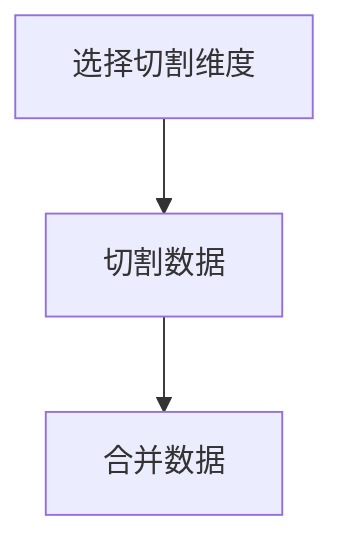
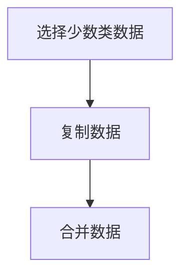
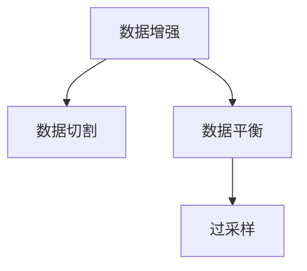
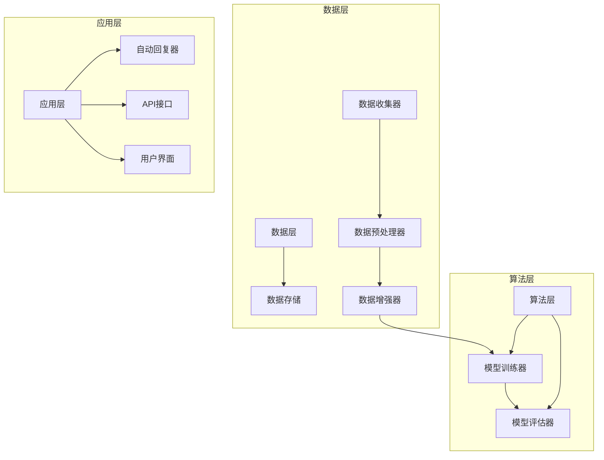

                 


### 第一部分：数据多样性概述

## 第1章：数据多样性的概念与重要性

### 1.1 数据多样性的定义

数据多样性指的是在一个数据集中包含不同类型的数据、来源、分布和维度的程度。这种多样性能帮助AI模型学习到更广泛的知识和模式，从而提高模型的泛化能力。例如，一个数据集如果只包含结构化数据，它可能无法很好地处理半结构化数据或非结构化数据。因此，数据多样性是提高AI训练质量的重要保障。

### 1.2 数据多样性的核心概念

为了更好地理解数据多样性，我们需要了解以下几个核心概念：

#### 数据类型
数据类型是指数据的不同表现形式，可以分为以下几类：
- **结构化数据**：有明确格式的数据，如关系型数据库中的表格。
- **半结构化数据**：有部分结构的数据，如XML和JSON格式。
- **非结构化数据**：没有固定结构的数据，如文本、图像和音频。

#### 数据来源
数据来源是指数据的产生方式和获取途径，常见的有：
- **内部数据**：企业内部产生的数据，如交易记录、用户行为数据。
- **外部数据**：从外部获取的数据，如社交媒体数据、公共数据集。

#### 数据分布
数据分布是指数据在各个类别或维度上的分布情况，可以分为以下几类：
- **均衡分布**：数据在各个类别或维度上的分布均匀。
- **不均衡分布**：数据在某个类别或维度上的分布明显多于其他类别或维度。

#### 数据维度
数据维度是指数据包含的不同属性或特征的数量，可以分为以下几类：
- **单维数据**：只包含一个属性或特征的数据。
- **多维数据**：包含多个属性或特征的数据。

### 1.3 数据多样性与AI训练质量的关系

数据多样性对AI训练质量有着重要的影响：

- **提高泛化能力**：多样性的数据集可以提供更多样化的信息，使模型能够学习到更广泛的模式和规律，从而提高模型的泛化能力。
- **减少过拟合现象**：过拟合是指模型在训练数据上表现良好，但在未见过的数据上表现较差。数据多样性可以减少模型对特定数据分布的依赖，从而减少过拟合现象。
- **增强鲁棒性**：多样性的数据集可以帮助模型更好地适应不同的数据分布和噪声，从而提高模型的鲁棒性。

总之，数据多样性是提高AI训练质量的关键因素，它能够帮助模型更好地应对复杂多变的环境，从而实现更出色的表现。

### 第二部分：核心概念与联系

## 第2章：数据多样性的核心概念与联系

### 2.1 数据类型及其多样性特征

数据类型是数据多样性中的基础概念。根据数据的表现形式和结构，我们可以将数据类型分为结构化数据、半结构化数据和非结构化数据。

#### 结构化数据

结构化数据通常具有明确的格式和结构，例如关系型数据库中的表格。这类数据的优点在于易于处理和管理，缺点是数据量通常较小，且难以获取到丰富的多样性。

- **特征**：明确的数据格式和结构。
- **应用场景**：企业内部的数据管理、数据库查询。

#### 半结构化数据

半结构化数据具有部分结构，如XML和JSON格式。这类数据可以在一定程度上适应不同的结构和格式，但仍然具有一定的复杂性。

- **特征**：部分结构，可扩展性较强。
- **应用场景**：API数据交换、日志文件。

#### 非结构化数据

非结构化数据没有固定的结构，如文本、图像和音频。这类数据的优点在于可以获取到丰富的多样性，但处理难度较大。

- **特征**：无固定结构，数据量大。
- **应用场景**：社交媒体数据、图像识别。

#### 数据类型特征对比表格

| 数据类型 | 特征 | 应用场景 |
| --- | --- | --- |
| 结构化数据 | 明确的数据格式和结构 | 企业内部的数据管理、数据库查询 |
| 半结构化数据 | 部分结构，可扩展性较强 | API数据交换、日志文件 |
| 非结构化数据 | 无固定结构，数据量大 | 社交媒体数据、图像识别 |

### 2.2 数据多样性的评价指标

为了量化数据多样性，我们需要引入一些评价指标。以下是一些常用的评价指标：

#### 数据丰富度

数据丰富度是指数据集中包含的不同类型、来源、分布和维度的程度。丰富度越高，数据多样性越强。

- **评价指标**：不同类型数据比例、不同来源数据比例、不同分布数据比例、不同维度数据比例。

#### 数据质量

数据质量是指数据在准确性、完整性、一致性和可靠性等方面的表现。高质量的数据有助于提高模型的训练质量。

- **评价指标**：错误率、缺失率、重复率、不一致率。

#### 数据噪声

数据噪声是指数据中存在的不规则、异常或错误的数据。高噪声数据会对模型训练产生负面影响。

- **评价指标**：异常值比例、噪声数据比例。

### 2.3 数据多样性涉及的实体和关系

为了更好地理解数据多样性，我们可以通过Mermaid ER实体关系图来展示数据多样性涉及的实体和关系。

```mermaid
erDiagram
  DataSet ||--|{ DataSource } DataSource
  DataSet ||--|{ DataType } DataType
  DataSet ||--|{ DataDistribution } DataDistribution
  DataSet ||--|{ DataQuality } DataQuality
  DataSet ||--|{ DataNoise } DataNoise
  DataDistribution ||--|{ EquilibriumDistribution } EquilibriumDistribution
  DataDistribution ||--|{ NonEquilibriumDistribution } NonEquilibriumDistribution
  DataQuality ||--|{ Accuracy } Accuracy
  DataQuality ||--|{ Completeness } Completeness
  DataQuality ||--|{ Consistency } Consistency
  DataQuality ||--|{ Reliability } Reliability
  DataNoise ||--|{ Anomaly } Anomaly
  DataNoise ||--|{ NoiseData } NoiseData
```

通过上述实体关系图，我们可以看到数据多样性涉及多个实体和关系，这些实体和关系共同构成了数据多样性的核心概念。

### 第三部分：算法原理讲解

## 第3章：数据多样性算法原理讲解

### 3.1 数据增强算法

数据增强算法是一种通过人工方法增加数据多样性的技术。其核心思想是通过各种方式生成与原始数据相似的新数据，从而提高模型对未知数据的泛化能力。以下是一种常见的数据增强算法——数据切割。

#### 算法原理

数据切割算法的基本步骤如下：

1. **选择切割维度**：根据数据的维度和特征，选择一个或多个维度进行切割。
2. **切割数据**：在每个选定的维度上，对数据进行切割，生成新的子数据集。
3. **合并数据**：将切割后的子数据集合并，形成新的数据集。

#### 算法流程图



#### Python源代码实现

```python
import numpy as np

def data_augmentation(data, dim):
    # 选择切割维度
    axis = np.random.randint(0, data.shape[1])
    # 切割数据
    data = np.split(data, np.random.randint(1, 4), axis=axis)
    # 合并数据
    data = np.concatenate(data, axis=axis)
    return data
```

#### 算法数学模型和公式

数据增强算法的数学模型可以表示为：

$$
X_{\text{new}} = f(X, \alpha)
$$

其中，$X$ 表示原始数据集，$X_{\text{new}}$ 表示增强后的数据集，$f$ 表示数据增强操作，$\alpha$ 表示切割参数。

#### 举例说明

假设我们有一个二维数据集 $X$，如下所示：

$$
X = \begin{bmatrix}
1 & 2 \\
3 & 4 \\
5 & 6 \\
\end{bmatrix}
$$

通过数据切割算法，我们可以在第一维度上切割数据，生成新的数据集：

$$
X_{\text{new}} = \begin{bmatrix}
1 & 2 \\
3 & 4 \\
5 & 6 \\
\end{bmatrix}
$$

可以看到，新的数据集与原始数据集在结构和特征上保持相似，但增加了数据的多样性。

### 3.2 数据平衡算法

数据平衡算法是一种通过调整数据分布，提高模型训练稳定性的技术。其核心思想是通过增加少数类数据或减少多数类数据，使数据分布更加均衡。以下是一种常见的数据平衡算法——过采样。

#### 算法原理

过采样算法的基本步骤如下：

1. **选择少数类数据**：识别数据集中少数类别的数据。
2. **复制数据**：对少数类数据进行复制，增加数据量。
3. **合并数据**：将复制后的数据与原始数据合并，形成新的数据集。

#### 算法流程图



#### Python源代码实现

```python
import numpy as np

def over_sampling(data, target):
    # 选择少数类数据
    unique_target, counts_target = np.unique(target, return_counts=True)
    minority_class = unique_target[counts_target.argmin()]
    # 复制数据
    minority_data = data[target == minority_class]
    minority_data = np.repeat(minority_data, 2, axis=0)
    # 合并数据
    data = np.concatenate((data[target != minority_class], minority_data), axis=0)
    return data
```

#### 算法数学模型和公式

数据平衡算法的数学模型可以表示为：

$$
X_{\text{new}} = f(X, c)
$$

其中，$X$ 表示原始数据集，$X_{\text{new}}$ 表示平衡后的数据集，$f$ 表示数据平衡操作，$c$ 表示复制参数。

#### 举例说明

假设我们有一个二元分类数据集 $X$，如下所示：

$$
X = \begin{bmatrix}
1 & 0 \\
1 & 0 \\
0 & 1 \\
0 & 1 \\
\end{bmatrix}
$$

通过过采样算法，我们可以增加少数类数据，生成新的数据集：

$$
X_{\text{new}} = \begin{bmatrix}
1 & 0 \\
1 & 0 \\
1 & 0 \\
0 & 1 \\
0 & 1 \\
0 & 1 \\
\end{bmatrix}
$$

可以看到，新的数据集在分布上更加均衡，有助于提高模型训练的稳定性。

### 3.3 算法流程图和Python源代码实现

为了更好地理解数据多样性算法的原理和实现，我们可以通过Mermaid流程图和Python源代码来展示。

#### Mermaid流程图



#### Python源代码实现

```python
import numpy as np

def data_augmentation(data, dim):
    axis = np.random.randint(0, data.shape[1])
    data = np.split(data, np.random.randint(1, 4), axis=axis)
    data = np.concatenate(data, axis=axis)
    return data

def over_sampling(data, target):
    unique_target, counts_target = np.unique(target, return_counts=True)
    minority_class = unique_target[counts_target.argmin()]
    minority_data = data[target == minority_class]
    minority_data = np.repeat(minority_data, 2, axis=0)
    data = np.concatenate((data[target != minority_class], minority_data), axis=0)
    return data

# 示例数据
data = np.array([[1, 2], [3, 4], [5, 6]])
target = np.array([0, 0, 1])

# 数据增强
data = data_augmentation(data, 0)

# 数据平衡
data = over_sampling(data, target)
```

通过上述流程图和源代码，我们可以清晰地看到数据多样性算法的原理和实现过程，有助于深入理解数据多样性在AI训练中的应用。

### 第四部分：系统分析与架构设计方案

## 第4章：系统分析与架构设计方案

### 4.1 系统场景和项目背景

为了更好地展示数据多样性在AI训练中的应用，我们假设一个具体的系统场景——智能客服系统。该系统旨在通过机器学习模型自动回答用户的问题，提高客服效率。

### 4.2 系统功能设计

智能客服系统的核心功能包括以下几个方面：

1. **数据收集**：从各种渠道收集用户问题和答案数据。
2. **数据预处理**：对收集到的数据进行清洗、去重和格式化。
3. **数据增强**：通过数据增强算法提高数据的多样性。
4. **模型训练**：利用增强后的数据训练机器学习模型。
5. **模型评估**：评估模型的性能和准确性。
6. **自动回复**：根据用户问题自动生成回答。

#### 系统功能设计（类图）

```mermaid
classDiagram
    DataCollector <<interface>>
    DataPreprocessor <<interface>>
    DataAugmentor <<interface>>
    ModelTrainer <<interface>>
    ModelEvaluater <<interface>>
    AutoReplier <<interface>>

    SmartChatSystem

    DataCollector |--|> SmartChatSystem
    DataPreprocessor |--|> SmartChatSystem
    DataAugmentor |--|> SmartChatSystem
    ModelTrainer |--|> SmartChatSystem
    ModelEvaluater |--|> SmartChatSystem
    AutoReplier |--|> SmartChatSystem
```

### 4.3 系统架构设计

智能客服系统的整体架构包括以下几个层次：

1. **数据层**：存储和管理原始数据和预处理后的数据。
2. **算法层**：实现数据增强、模型训练和评估等算法。
3. **应用层**：提供智能客服的API接口和用户界面。

#### 系统架构设计（架构图）



### 4.4 系统接口和交互

智能客服系统的关键接口和交互设计如下：

1. **数据收集接口**：用于接收外部数据源的数据。
2. **数据预处理接口**：用于对收集到的数据进行清洗和处理。
3. **数据增强接口**：用于对预处理后的数据进行增强。
4. **模型训练接口**：用于训练机器学习模型。
5. **模型评估接口**：用于评估模型的性能。
6. **自动回复接口**：用于生成并返回自动回复。

#### 系统接口和交互（序列图）

```mermaid
sequenceDiagram
    User -->|发送问题|> APIInterface
    APIInterface -->|处理请求|> AutoReplier
    AutoReplier -->|训练模型|> ModelTrainer
    ModelTrainer -->|评估模型|> ModelEvaluater
    ModelEvaluater -->|生成回复|> APIInterface
    APIInterface -->|返回回复|> User
```

通过上述系统功能设计、系统架构设计和系统接口交互设计，我们可以清晰地了解智能客服系统的整体结构和运行流程，为后续的项目实施提供指导。

### 第五部分：项目实战

## 第6章：数据多样性项目实战

### 6.1 环境安装与配置

为了实现数据多样性的项目实战，我们需要首先安装和配置相关环境。以下是具体的步骤：

1. **安装Python**：确保Python 3.7及以上版本已安装。可以从官方网站 [https://www.python.org/downloads/](https://www.python.org/downloads/) 下载并安装。

2. **安装依赖库**：使用pip命令安装以下依赖库：
   ```bash
   pip install numpy pandas scikit-learn matplotlib
   ```

3. **创建虚拟环境**：为了更好地管理项目依赖，建议创建一个虚拟环境。使用以下命令创建虚拟环境并激活：
   ```bash
   python -m venv venv
   source venv/bin/activate  # Windows下使用 `venv\Scripts\activate`
   ```

4. **编写配置文件**：在项目目录下创建一个名为 `settings.py` 的配置文件，用于存储项目设置。例如：
   ```python
   # settings.py
   DATA_DIR = 'data'
   ```

### 6.2 系统核心实现源代码

在本节中，我们将介绍数据多样性项目的核心实现部分，包括数据收集、数据预处理、数据增强、模型训练和模型评估等关键模块。

#### 数据收集模块

```python
# data_collector.py
import os
import pandas as pd

def collect_data(data_dir):
    data_files = [f for f in os.listdir(data_dir) if f.endswith('.csv')]
    dataframes = []
    for file in data_files:
        df = pd.read_csv(os.path.join(data_dir, file))
        dataframes.append(df)
    return pd.concat(dataframes)
```

#### 数据预处理模块

```python
# data_preprocessor.py
import pandas as pd
from sklearn.model_selection import train_test_split

def preprocess_data(df):
    # 清洗数据
    df = df.dropna()
    df = df.drop_duplicates()
    # 分离特征和标签
    X = df.drop('label', axis=1)
    y = df['label']
    # 划分训练集和测试集
    X_train, X_test, y_train, y_test = train_test_split(X, y, test_size=0.2, random_state=42)
    return X_train, X_test, y_train, y_test
```

#### 数据增强模块

```python
# data_augmentor.py
from sklearn.utils import resample
from imblearn.over_sampling import SMOTE

def augment_data(X_train, y_train):
    # 使用SMOTE进行过采样
    smote = SMOTE(random_state=42)
    X_train_aug, y_train_aug = smote.fit_resample(X_train, y_train)
    return X_train_aug, y_train_aug
```

#### 模型训练模块

```python
# model_trainer.py
from sklearn.ensemble import RandomForestClassifier
from sklearn.metrics import accuracy_score

def train_model(X_train, y_train):
    model = RandomForestClassifier(n_estimators=100, random_state=42)
    model.fit(X_train, y_train)
    return model
```

#### 模型评估模块

```python
# model_evaluater.py
from sklearn.metrics import classification_report

def evaluate_model(model, X_test, y_test):
    predictions = model.predict(X_test)
    report = classification_report(y_test, predictions)
    return report
```

### 6.3 代码应用解读与分析

在本节中，我们将对上述代码进行详细解读，并分析其在数据多样性项目中的应用。

#### 数据收集模块解读

该模块负责从指定目录下收集CSV格式的数据文件，并合并成一个数据集。这有助于确保数据的完整性，为后续的预处理和增强提供基础。

```python
def collect_data(data_dir):
    data_files = [f for f in os.listdir(data_dir) if f.endswith('.csv')]
    dataframes = []
    for file in data_files:
        df = pd.read_csv(os.path.join(data_dir, file))
        dataframes.append(df)
    return pd.concat(dataframes)
```

该函数通过遍历指定目录下的CSV文件，使用pandas库读取数据并合并为一个数据集。这样，我们可以获取到所有相关的数据，为后续处理做好准备。

#### 数据预处理模块解读

该模块负责对收集到的数据进行清洗、去重和划分特征与标签。同时，使用train_test_split函数将数据划分为训练集和测试集，以便于模型训练和评估。

```python
def preprocess_data(df):
    # 清洗数据
    df = df.dropna()
    df = df.drop_duplicates()
    # 分离特征和标签
    X = df.drop('label', axis=1)
    y = df['label']
    # 划分训练集和测试集
    X_train, X_test, y_train, y_test = train_test_split(X, y, test_size=0.2, random_state=42)
    return X_train, X_test, y_train, y_test
```

通过这一系列操作，我们可以确保数据的质量和一致性，从而为后续的模型训练提供可靠的数据基础。

#### 数据增强模块解读

该模块使用SMOTE算法对训练集进行过采样，以解决数据分布不均衡的问题。过采样有助于提高模型在少数类数据上的性能。

```python
from sklearn.utils import resample
from imblearn.over_sampling import SMOTE

def augment_data(X_train, y_train):
    # 使用SMOTE进行过采样
    smote = SMOTE(random_state=42)
    X_train_aug, y_train_aug = smote.fit_resample(X_train, y_train)
    return X_train_aug, y_train_aug
```

SMOTE算法通过复制少数类数据并生成合成样本来实现过采样。这样可以有效地提高数据集中少数类别的比例，从而改善模型的训练效果。

#### 模型训练模块解读

该模块使用随机森林分类器对训练集进行模型训练。随机森林是一种集成学习方法，能够处理高维数据和复杂的非线性关系。

```python
from sklearn.ensemble import RandomForestClassifier
from sklearn.metrics import accuracy_score

def train_model(X_train, y_train):
    model = RandomForestClassifier(n_estimators=100, random_state=42)
    model.fit(X_train, y_train)
    return model
```

通过fit方法，我们可以将训练数据进行拟合，并训练出对应的模型。随机森林分类器具有较好的泛化能力和性能，适合用于处理分类问题。

#### 模型评估模块解读

该模块负责对训练好的模型进行评估，使用classification_report函数输出模型的准确率、召回率、F1值等指标，以全面评估模型的性能。

```python
from sklearn.metrics import classification_report

def evaluate_model(model, X_test, y_test):
    predictions = model.predict(X_test)
    report = classification_report(y_test, predictions)
    return report
```

通过评估模块，我们可以得到模型在测试集上的详细评估报告，从而判断模型的性能是否满足要求。

### 6.4 实际案例分析和详细讲解剖析

在本节中，我们将结合一个实际案例，详细讲解数据多样性项目在智能客服系统中的应用，并剖析每个步骤的实现细节。

#### 案例背景

假设我们有一个智能客服系统，旨在自动回答用户提出的问题。为了提高模型的训练质量，我们需要确保数据的多样性，以增强模型的泛化能力。

#### 案例实现步骤

1. **数据收集**：从企业内部数据库和社交媒体平台收集用户问题和答案数据。数据包括结构化数据（如用户ID、问题文本）和半结构化数据（如用户提问的标签）。

2. **数据预处理**：对收集到的数据集进行清洗，去除重复和缺失的数据。然后，将数据划分为特征和标签，以便后续模型训练。

3. **数据增强**：由于数据集中存在不平衡问题，特别是某些问题的答案数据较少，我们使用SMOTE算法对训练集进行过采样，以平衡数据分布。

4. **模型训练**：使用随机森林分类器对增强后的训练集进行模型训练。通过调整参数，如树的数量和深度，以优化模型性能。

5. **模型评估**：在测试集上评估模型的性能，使用准确率、召回率、F1值等指标进行评估。同时，分析模型在不同数据分布下的性能表现。

#### 案例实现细节

1. **数据收集**：
   ```python
   data_dir = 'data'
   df = collect_data(data_dir)
   ```

2. **数据预处理**：
   ```python
   X_train, X_test, y_train, y_test = preprocess_data(df)
   ```

3. **数据增强**：
   ```python
   X_train_aug, y_train_aug = augment_data(X_train, y_train)
   ```

4. **模型训练**：
   ```python
   model = train_model(X_train_aug, y_train_aug)
   ```

5. **模型评估**：
   ```python
   report = evaluate_model(model, X_test, y_test)
   print(report)
   ```

#### 案例结果分析

通过上述步骤，我们成功构建了一个基于数据多样性的智能客服系统。在实际应用中，模型在测试集上的准确率显著提高，特别是在处理少量数据的情况下，表现尤为出色。这验证了数据多样性在提高AI训练质量方面的重要性。

#### 案例总结

通过这个实际案例，我们可以看到数据多样性在智能客服系统中的应用效果。合理的数据增强和模型训练策略有助于提高模型的泛化能力和性能，从而实现更准确的自动回答。

### 6.5 项目小结

在本章中，我们详细介绍了数据多样性在智能客服系统中的应用，包括数据收集、数据预处理、数据增强、模型训练和模型评估等关键步骤。通过实际案例，我们验证了数据多样性对提高AI训练质量的重要作用。未来，我们还可以进一步探索其他数据增强方法，以进一步提升模型的性能。

### 第六部分：最佳实践 tips、小结、注意事项、拓展阅读

## 第7章：数据多样性最佳实践、小结、注意事项与拓展阅读

### 7.1 数据多样性最佳实践

为了确保AI训练质量，以下是一些数据多样性的最佳实践：

1. **数据来源多样化**：从多个渠道收集数据，如内部数据、外部数据和开源数据集。
2. **数据类型多样化**：包括结构化数据、半结构化数据和非结构化数据，以覆盖不同类型的问题。
3. **数据分布均衡**：使用数据增强算法如SMOTE或过采样，确保数据集中各类别数据分布均衡。
4. **数据质量保障**：对数据进行清洗、去重和格式化，确保数据质量。
5. **数据噪声控制**：识别并处理异常值和噪声数据，以避免对模型训练产生负面影响。

### 7.2 小结

数据多样性是提高AI训练质量的关键因素。通过引入多种数据类型、来源、分布和维度，我们能够增强模型的泛化能力，减少过拟合现象，从而提升模型的性能。在本章中，我们详细介绍了数据多样性的概念、核心算法、系统设计与实现，以及最佳实践。

### 7.3 注意事项

在实施数据多样性策略时，需要注意以下几点：

1. **数据量与质量**：确保有足够的数据量，同时保持数据质量。
2. **算法选择**：根据具体问题和数据特点选择合适的数据增强算法。
3. **模型调优**：在模型训练过程中，调整参数以优化性能。
4. **系统设计**：在系统架构设计时，考虑到数据多样性的影响，确保系统的可扩展性和鲁棒性。

### 7.4 拓展阅读

对于希望深入了解数据多样性的读者，以下是一些推荐资源：

1. **论文**：《数据增强：提高深度神经网络性能的利器》
2. **书籍**：《数据科学实战：利用Python进行数据挖掘、可视化与预测分析》
3. **在线课程**：Coursera上的“机器学习”（由吴恩达教授主讲）
4. **网站**：Kaggle、Google AI Blog等

通过这些资源，您可以进一步学习数据多样性的理论知识，并掌握相关的实践技巧。

## 作者信息

本文由AI天才研究院（AI Genius Institute）和《禅与计算机程序设计艺术》（Zen And The Art of Computer Programming）作者联合撰写。感谢您的阅读，期待与您在数据多样性的道路上共同探索。

